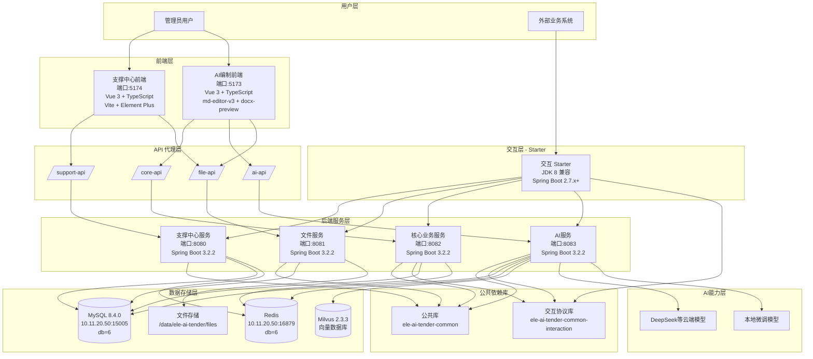
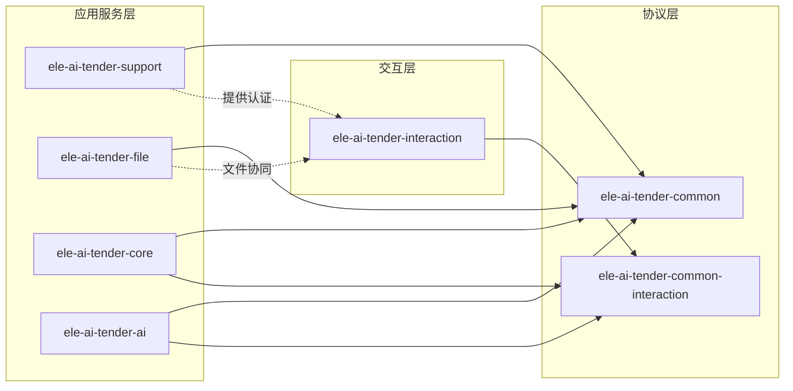
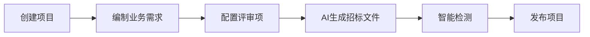
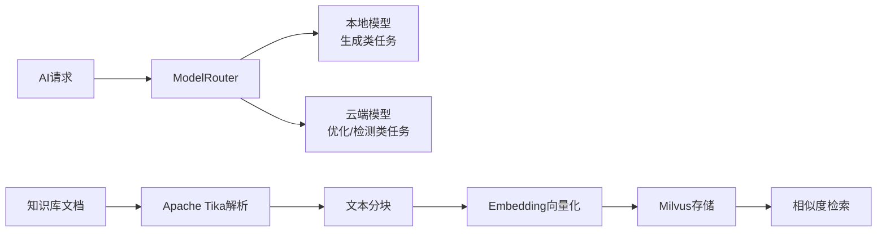
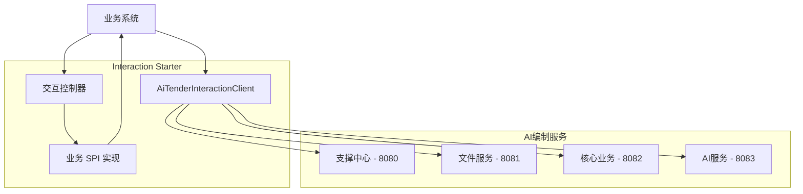
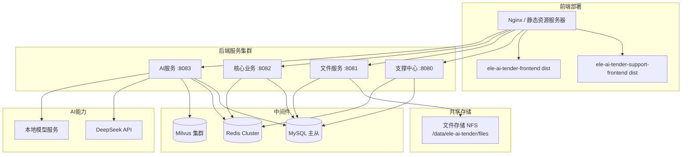
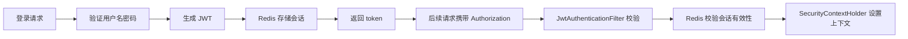

# AI编制系统架构设计文档

## 1. 系统概述

### 1.1 系统定位

AI编制系统是一个独立的AI招标文件编制平台,提供招标文件AI生成、智能检测、知识库管理、评审项配置等核心能力。系统采用前后端分离架构,支持独立部署、嵌入第三方平台和一体机模式。

### 1.2 核心业务能力

- **支撑中心**:用户认证、权限管理、菜单管理、模板管理、知识库管理、统计分析、AI服务配置、操作日志、消息中心
- **文件服务**:通用文件上传、下载、查询、删除
- **招标文件编制核心**:项目管理、业务需求编制、评审项管理、文档生成、文档格式转换
- **AI服务**:AI助手、知识库检索、智能检测、模型路由
- **业务系统交互**:为标准业务系统提供统一的接入协议和回调接口

注意！ai服务为招标文件编制中心的业务流程提供ai业务增强，当ai服务无法启动时也不影响招标文件编制中心的业务流程。

---

## 2. 整体架构

### 2.1 系统架构图



### 2.2 技术栈总览

| 层级 | 技术选型 | 版本 |
|------|---------|------|
| **前端** | Vue 3 | 3.5.25 |
| | TypeScript | 5.9.3 |
| | Vite | 7.3.1 |
| | Element Plus | 2.13.2 |
| | Pinia | 3.0.4 |
| | Vue Router | 4.6.4 |
| | md-editor-v3 | 4.10.0+ |
| | docx-preview | 0.3.1+ |
| | diff2html | 3.4.45+ |
| **后端** | JDK | 21 (交互层兼容 JDK 8) |
| | Spring Boot | 3.2.2 |
| | Spring AI | 1.1.0 |
| | MyBatis-Plus | 3.5.5 |
| | MySQL Connector | 8.4.0 |
| | JWT (JJWT) | 0.12.5 |
| | Hutool | 5.8.25 |
| **AI技术栈** | Milvus | 2.3.3 |
| | Apache Tika | 2.9.0 |
| | poi-tl | 1.12.0 |
| | flexmark-java | 0.64.0 |
| **中间件** | MySQL | 8.4.0 |
| | Redis | - |
| | Milvus | 2.3.3 |
| **构建工具** | Maven | - |
| | npm | - |

---

## 3. 模块结构详解

### 3.1 模块清单与职责

| 模块名称 | 类型 | 端口 | 职责 | 数据库表前缀 |
|---------|------|------|------|-------------|
| `ele-ai-tender-support-frontend` | 前端 | 5174 | 支撑中心管理界面 | - |
| `ele-ai-tender-frontend` | 前端 | 5173 | AI编制业务界面 | - |
| `ele-ai-tender-common` | 公共库 | - | 公共实体、工具类、异常、响应、安全、日志 | - |
| `ele-ai-tender-common-interaction` | 协议库 | - | 交互协议 DTO、SPI 接口、路径常量 | - |
| `ele-ai-tender-support` | 后端服务 | 8080 | 认证、用户、角色、菜单、模板管理、知识库管理、统计分析、AI服务配置、操作日志、消息中心 | `sup_*` |
| `ele-ai-tender-file` | 后端服务 | 8081 | 文件上传、下载、查询、删除 | `file_*` |
| `ele-ai-tender-core` | 后端服务 | 8082 | 项目管理、业务需求编制、评审项管理、文档生成 | `ai_*` |
| `ele-ai-tender-ai` | 后端服务 | 8083 | AI助手、知识库检索、智能检测、模型路由 | `ai_*` |
| `ele-ai-tender-interaction` | Starter | - | 业务系统接入协议、客户端、自动装配、回调接口 | - |

### 3.2 模块依赖关系



### 3.3 核心模块详细架构

#### 3.3.1 支撑中心 (ele-ai-tender-support)

**核心能力**:
- 认证授权:登录/登出、JWT 签发、权限校验
- 用户管理:用户 CRUD、状态管理、密码重置
- 角色管理:角色 CRUD、菜单授权
- 菜单管理:菜单树、路由配置
- 模板管理:模板 CRUD、默认模板设置
- 知识库管理:知识文档管理、分类管理
- 统计分析:项目统计、模板使用统计、检测统计
- AI服务配置:模型配置、Token 管理
- 操作日志:查询入口、日志落库
- 消息中心:消息管理、消息推送

**关键控制器**:
- `AuthController`: `/api/auth/*`
- `UserController`: `/api/users/*`
- `RoleController`: `/api/roles/*`
- `MenuController`: `/api/menus/*`
- `TemplateConfigController`: `/api/templates/*`
- `KnowledgeConfigController`: `/api/knowledge/*`
- `StatisticsController`: `/api/statistics/*`
- `AiConfigController`: `/api/ai-config/*`
- `AccessLogController`: `/api/access-logs`
- `MessageController`: `/api/messages/*`

**技术特点**:
- JWT + Redis 双校验
- 支持内部用户和外部系统两种认证模式
- 统一访问日志落库到 `sup_access_log`

#### 3.3.2 文件服务 (ele-ai-tender-file)

**核心能力**:
- 通用文件上传:`POST /api/file/upload`
- 文件下载:`GET /api/file/download/{fileId}`
- 文件信息查询:`GET /api/file/info/{fileId}`
- 文件删除:`DELETE /api/file/delete/{fileId}`

**文件类型白名单**:
- `.doc`, `.docx`, `.pdf`, `.txt`, `.md`
- `.jar`, `.war`, `.zip`, `.tar.gz`
- 支持自定义后缀配置

**存储策略**:
- 元数据落库:`file_*` 表
- 物理文件:`/data/ele-ai-tender/files`
- 文件摘要:SHA-256

**技术特点**:
- 最大文件大小:500MB
- 文件服务只处理文件能力,不承接业务逻辑

#### 3.3.3 AI编制核心业务 (ele-ai-tender-core)

**核心能力**:
- 项目管理:项目 CRUD、版本管理、状态流转
- 业务需求编制:需求创建、历史匹配、AI生成
- 评审项管理:三级嵌套评审项配置
- 文档生成:Markdown → Word 转换、文档导出

**编制流程**:


**关键数据表**:
- `ai_project`: 项目表
- `ai_project_version`: 项目版本表
- `ai_requirement`: 业务需求表
- `ai_review_item`: 评审项表
- `ai_template`: 模板表

**技术特点**:
- 项目状态流转:DRAFT → IN_PROGRESS → PENDING_DETECTION → DETECTION_PASSED → PUBLISHED
- 评审项采用三级嵌套结构 (parent_id + level)
- 版本快照机制,支持版本对比

#### 3.3.4 AI服务 (ele-ai-tender-ai)

**核心能力**:
- AI助手:对话式AI助手、文本优化(SSE流式)
- 知识库:文档上传、向量化、检索
- 智能检测:公平性、合规性、错别字、敏感词检测
- 模型路由:本地模型/云端模型智能路由

**AI能力架构**:


**关键数据表**:
- `ai_knowledge_document`: 知识库文档表
- `ai_detection_record`: 检测记录表
- `ai_model_config`: AI模型配置表

**技术特点**:
- 混合模型架构:生成本地化 + 优化云端化
- SSE流式响应,前端实时展示
- Milvus向量检索,支持大规模知识库
- Token用量监控和限流

#### 3.3.5 交互 Starter (ele-ai-tender-interaction)

**模块组成**:
- `ele-ai-tender-interaction-core`: 核心客户端能力
- `ele-ai-tender-interaction-autoconfigure`: 自动装配
- `ele-ai-tender-interaction-spring-boot-starter`: Starter 聚合

**固定接口**(业务系统接入后暴露):
- `GET /api/eleAiTender/interaction/identity/current`
- `POST /api/eleAiTender/interaction/projects/basic-info`
- `POST /api/eleAiTender/interaction/callbacks/document-export`
- `POST /api/eleAiTender/interaction/callbacks/detection-result`

**业务系统必须实现的 SPI**:
- `InteractionIdentityService`: 当前外部用户信息
- `InteractionProjectInfoService`: 项目基础信息
- `InteractionDocumentExportCallbackService`: 文档导出回调
- `InteractionDetectionResultCallbackService`: 检测结果回调

**出站能力**(统一客户端):
- `getExternalToken`: 获取外部 token
- `getCurrentExternalUser`: 获取当前用户
- `getFileInfo`: 文件信息查询
- `downloadFile`: 文件下载
- `buildTenderDocumentEntryUrl`: 构造编制入口 URL

**技术特点**:
- JDK 8 + Spring Boot 2.7.x 兼容
- 协议 DTO 单源放在 `ele-ai-tender-common-interaction`
- 统一签名校验、异常处理

---

## 4. 请求链路与部署架构

### 4.1 前端请求链路

```mermaid
graph TB
    Browser[浏览器]
    
    subgraph "前端应用"
        SupportFE[支撑中心前端 - 5174]
        AiFE[AI编制前端 - 5173]
    end
    
    subgraph "Vite 开发代理"
        SupportProxy[/support-api/*]
        CoreProxy[/core-api/*]
        AiProxy[/ai-api/*]
        FileProxy[/file-api/*]
    end
    
    subgraph "后端服务"
        Support[支撑中心 - 8080]
        File[文件服务 - 8081]
        Core[核心业务 - 8082]
        Ai[AI服务 - 8083]
    end
    
    subgraph "数据库与缓存"
        MySQL[(MySQL db=6)]
        Redis[(Redis db=6)]
        Milvus[(Milvus)]
    end
    
    subgraph "文件存储"
        Disk[本地磁盘 /data/ele-ai-tender/files]
    end
    
    Browser --> SupportFE
    Browser --> AiFE
    
    SupportFE --> SupportProxy
    SupportFE --> FileProxy
    AiFE --> CoreProxy
    AiFE --> AiProxy
    AiFE --> FileProxy
    
    SupportProxy -->|rewrite: /api/*| Support
    CoreProxy -->|rewrite: /api/*| Core
    AiProxy -->|rewrite: /api/*| Ai
    FileProxy --> File
    
    Support --> MySQL
    Support --> Redis
    File --> MySQL
    File --> Disk
    Core --> MySQL
    Core --> Redis
    Ai --> MySQL
    Ai --> Redis
    Ai --> Milvus
```

### 4.2 业务系统请求链路



### 4.3 部署架构



---

## 5. 基础设施与配置

### 5.1 数据库与中间件

| 资源 | 地址 | 配置 |
|------|------|------|
| MySQL | 10.11.20.50:15005 | 数据库:ele_ai_tender (db=6, 独立于现有系统 db=5) |
| Redis | 10.11.20.50:16879 | db=6, password=test123 (独立于现有系统 db=5) |
| Milvus | localhost:19530 | collection=ai_tender_knowledge (向量数据库) |
| 文件存储 | /data/ele-ai-tender/files | 独立存储路径 |

### 5.2 默认账户

- 管理员:`admin / admin123`

### 5.3 环境变量配置

**通用环境变量**:
- `SPRING_DATASOURCE_PASSWORD`
- `SPRING_REDIS_PASSWORD`
- `APP_JWT_SECRET`

**服务专属配置**:
- `FILE_STORAGE_BASE_PATH`: 文件服务存储路径
- `DEEPSEEK_API_KEY`: DeepSeek API密钥
- `LOCAL_MODEL_KEY`: 本地模型API密钥
- `MILVUS_COLLECTION`: Milvus集合名称

**本地配置覆盖**(各服务均支持):
```yaml
spring.config.import: optional:file:${user.home}/.ele-ai-tender/{module}-local.yml
```

**服务专属覆盖**:
- support模块:`ele-ai-tender-support-local.yml`
- file模块:`ele-ai-tender-file-local.yml`
- core模块:`ele-ai-tender-core-local.yml`
- ai模块:`ele-ai-tender-ai-local.yml`

---

## 6. 安全架构

### 6.1 认证体系

**双轨认证**:
- **内部用户**:JWT (`type=INTERNAL`) + Redis 会话
- **外部系统**:JWT (`type=EXTERNAL`) + 签名校验

**认证流程**:


### 6.2 签名机制

- 算法:HMAC-SHA256
- 工具类:`SignatureUtil`
- 外部系统签名校验统一使用此工具

### 6.3 密码加密

- 算法:BCrypt
- 工具类:`PasswordUtil`

### 6.4 文件安全

- 文件摘要:SHA-256
- API密钥加密存储:AES加密

---

## 7. 日志与监控

### 7.1 日志规范

- 全系统透传 `X-Trace-Id`
- MDC 键:`traceId`
- HTTP 入站日志落库到 `sup_access_log`
- 禁止记录敏感信息(token、secret、文件二进制)

### 7.2 访问日志字段

- `traceId`: 链路追踪 ID
- `bizType`: 业务类型
- `bizId`: 业务 ID
- `projectId`: 项目 ID
- `fileId`: 文件 ID
- 请求方法、路径、状态码、耗时

---

## 8. 核心接口设计

### 8.1 项目管理

```
POST   /api/v1/projects                    # 创建项目
GET    /api/v1/projects                    # 查询项目列表
GET    /api/v1/projects/{id}               # 获取项目详情
PUT    /api/v1/projects/{id}               # 更新项目
DELETE /api/v1/projects                    # 批量删除项目
POST   /api/v1/projects/{id}/generate      # AI生成招标文件
GET    /api/v1/projects/{id}/versions      # 获取版本历史
GET    /api/v1/projects/{id}/versions/compare  # 版本对比
POST   /api/v1/projects/{id}/export        # 导出Word文档
POST   /api/v1/projects/{id}/publish       # 发布项目
```

### 8.2 业务需求

```
POST   /api/v1/requirements                # 创建业务需求
GET    /api/v1/requirements                # 查询需求列表
GET    /api/v1/requirements/{id}           # 获取需求详情
PUT    /api/v1/requirements/{id}           # 更新需求
POST   /api/v1/requirements/{id}/match     # 匹配历史模板
POST   /api/v1/requirements/{id}/generate  # AI生成需求初稿
POST   /api/v1/requirements/{id}/submit    # 提交审核
```

### 8.3 AI助手

```
POST   /api/v1/ai/optimize                 # 文本优化(SSE流式)
POST   /api/v1/ai/suggest                  # 获取AI建议
POST   /api/v1/ai/generate                 # AI内容生成
POST   /api/v1/ai/chat                     # 对话式AI助手
```

### 8.4 智能检测

```
POST   /api/v1/detection/start             # 启动检测
GET    /api/v1/detection/{id}/status       # 查询检测状态
GET    /api/v1/detection/{id}/result       # 获取检测结果
POST   /api/v1/detection/{id}/confirm      # 确认检测结果
```

### 8.5 知识库

```
POST   /api/v1/knowledge/documents         # 上传知识文档
GET    /api/v1/knowledge/documents         # 查询知识文档列表
DELETE /api/v1/knowledge/documents/{id}    # 删除知识文档
POST   /api/v1/knowledge/retrieve          # 检索知识(向量检索)
POST   /api/v1/knowledge/vectorize         # 手动触发向量化
```

### 8.6 评审项

```
POST   /api/v1/review-items                # 创建评审项
GET    /api/v1/review-items/{projectId}    # 查询评审项树
PUT    /api/v1/review-items/{id}           # 更新评审项
DELETE /api/v1/review-items/{id}           # 删除评审项
POST   /api/v1/review-items/generate       # AI生成评审项
GET    /api/v1/review-items/{projectId}/export  # 导出评审项JSON
```

### 8.7 模板管理

```
POST   /api/v1/templates                   # 创建模板
GET    /api/v1/templates                   # 查询模板列表
GET    /api/v1/templates/{id}              # 获取模板详情
PUT    /api/v1/templates/{id}              # 更新模板
DELETE /api/v1/templates/{id}              # 删除模板
POST   /api/v1/templates/{id}/set-default  # 设为默认模板
POST   /api/v1/templates/import            # 导入模板
GET    /api/v1/templates/{id}/export       # 导出模板
```

---

## 9. 数据库设计

### 9.1 表前缀规范

| 模块 | 前缀 | 说明 |
|------|------|------|
| 支撑中心 | `sup_*` | 用户、角色、菜单、日志等 |
| 文件服务 | `file_*` | 文件信息 |
| AI编制系统 | `ai_*` | 项目、需求、模板、知识库、检测记录、评审项、模型配置 |

### 9.2 核心数据表

| 表名 | 说明 | 关键字段 |
|------|------|----------|
| `ai_project` | 项目表 | 编号、名称、类别、类型、预算、状态、模板关联 |
| `ai_project_version` | 项目版本表 | 版本号、内容快照JSON、变更说明 |
| `ai_requirement` | 业务需求表 | 需求描述、匹配模式、匹配度、内容 |
| `ai_template` | 模板表 | Markdown内容、结构定义JSON、版本号、默认标记 |
| `ai_knowledge_document` | 知识库文档表 | 文档类别、向量集合、向量ID列表 |
| `ai_detection_record` | 检测记录表 | 检测类型、内容快照、结果JSON、状态 |
| `ai_review_item` | 评审项表 | 三级嵌套结构:parent_id + level |
| `ai_model_config` | AI模型配置表 | 模型类型、API端点/密钥、参数JSON、Token用量 |

### 9.3 Redis 数据结构

```
ai:task:queue:{task_id}        - Hash  AI任务队列
ai:task:status:{task_id}       - String 任务状态
ai:assistant:session:{id}      - Hash  AI助手会话上下文
ai:assistant:history:{id}      - List  对话历史
ai:detection:result:{proj_id}  - Hash  检测结果缓存
ai:token:limit:{user_id}:{date} - String 当日Token使用量
```

---

## 10. AI能力架构

### 10.1 混合模型路由

```
任务类型 → ModelRouter → 本地模型(生成类) / 云端模型(优化/检测类)
```

- **本地模型**:处理大批量生成任务,降低Token成本
- **云端模型**(DeepSeek等):处理优化和检测任务,保证质量
- **私有模型**:支持私有化部署场景

### 10.2 知识库向量化流程

```
文档上传 → Apache Tika解析 → 文本分块(500-1000字/块) → Embedding API向量化 → Milvus存储 → 相似度检索 → Top-K返回
```

### 10.3 流式响应

AI助手和文本优化接口使用 SSE (Server-Sent Events) 实现流式响应,前端通过 `EventSource` 接收。

### 10.4 文档生成

Markdown模板 → flexmark-java解析 → poi-tl填充Word模板 → 导出.docx

---

## 11. 数据隔离策略

| 资源 | 现有EleTender系统 | AI编制系统 | 说明 |
|------|-----------------|-----------|------|
| MySQL | db=5 | db=6 | 独立数据库 |
| Redis | db=5 | db=6 | 独立缓存空间 |
| 文件存储 | /data/ele-tender/files | /data/ele-ai-tender/files | 独立存储路径 |
| 用户体系 | 复用 | 复用 | 共享支撑中心用户表结构 |

---

## 12. 开发工作流

### 12.1 本地开发启动

```bash
# 前端 - 支撑中心管理后台(端口 5174)
cd ele-ai-tender-support-frontend
npm install
npm run dev

# 前端 - AI编制业务前端(端口 5173)
cd ele-ai-tender-frontend
npm install
npm run dev

# 后端(在 ele-ai-tender-system/ 目录下)
mvn clean test                                          # 运行所有测试
mvn -pl ele-ai-tender-support -am spring-boot:run       # 支撑中心 :8080
mvn -pl ele-ai-tender-file -am spring-boot:run          # 文件服务 :8081
mvn -pl ele-ai-tender-core -am spring-boot:run          # 核心业务 :8082
mvn -pl ele-ai-tender-ai -am spring-boot:run            # AI服务   :8083
```

> 使用 `-pl` 时必须加 `-am`,确保依赖模块先构建。

### 12.2 测试与打包

```bash
# 运行所有测试
mvn clean test

# 打包单模块
mvn -pl ele-ai-tender-support -am package

# 构建交互 starter
mvn -pl ele-ai-tender-common-interaction,ele-ai-tender-interaction/ele-ai-tender-interaction-core,ele-ai-tender-interaction/ele-ai-tender-interaction-autoconfigure,ele-ai-tender-interaction/ele-ai-tender-interaction-spring-boot-starter -am package -DskipTests
```

### 12.3 提交前检查

- 前端:`npm run build`
- 后端:`mvn clean test`

---

## 13. 文档索引

### 13.1 规范文档

| 文档 | 路径 |
|------|------|
| 项目总规范 | [docs/rules/PROJECT_SPEC_FINAL.md](../rules/PROJECT_SPEC_FINAL.md) |
| 编码规范 | [docs/rules/CODE_CONVENTIONS.md](../rules/CODE_CONVENTIONS.md) |
| AI编制系统架构优化方案 | [docs/plans/AI编制系统架构优化_0e4bb37a.md](../plans/AI编制系统架构优化_0e4bb37a.md) |
| 文件服务规范 | [docs/rules/FILE_SERVICE_SPEC.md](../rules/FILE_SERVICE_SPEC.md) |
| 支撑中心规范 | [docs/rules/SUPPORT_SYSTEM_SPEC.md](../rules/SUPPORT_SYSTEM_SPEC.md) |
| 交互集成规范 | [docs/rules/INTERACTION_INTEGRATION_SPEC.md](../rules/INTERACTION_INTEGRATION_SPEC.md) |

### 13.2 使用指南

| 指南 | 路径 |
|------|------|
| 业务系统接入手册 | [docs/guides/业务系统接入手册.md](业务系统接入手册.md) |

---

## 14. 术语表

| 中文 | 代码术语 | 说明 |
|------|----------|------|
| AI编制 | AiTender | AI招标文件编制系统 |
| 项目 | Project (ai_project) | 招标项目 |
| 项目版本 | ProjectVersion (ai_project_version) | 项目版本快照 |
| 业务需求 | Requirement (ai_requirement) | 招标需求描述 |
| 模板 | Template (ai_template) | 招标文件模板 |
| 知识库文档 | KnowledgeDocument (ai_knowledge_document) | 向量化知识文档 |
| 检测记录 | DetectionRecord (ai_detection_record) | 智能检测结果 |
| 评审项 | ReviewItem (ai_review_item) | 评审配置项 |
| AI模型配置 | ModelConfig (ai_model_config) | 模型API配置 |

**项目类别**: LIMITED_BELOW(限额以下) / PROPERTY_TRADE(产权交易) / GOVERNMENT_PROCUREMENT(政府采购)

**项目类型**: ENGINEERING(工程) / GOODS(货物) / SERVICE(服务)
- 服务子类型: PROPERTY / IT_SERVICE / CONSULTING / MAINTENANCE

**项目状态流转**:
DRAFT → IN_PROGRESS → PENDING_DETECTION → DETECTING → DETECTION_PASSED / DETECTION_FAILED → PUBLISHED → ARCHIVED / CANCELLED

**检测类型**: FAIRNESS(公平性) / COMPLIANCE(合规性) / TYPO(错别字) / SENSITIVE_WORD(敏感词)

**AI模型类型**: LOCAL(本地微调) / CLOUD(云端大模型) / PRIVATE(私有化部署)

**AI使用场景**: GENERATION(生成) / OPTIMIZATION(优化) / DETECTION(检测)

**需求来源**: REFERENCE(参考历史) / AI_GENERATED(AI生成)

**匹配模式**: AUTO_MATCH(自动匹配) / MANUAL_SELECT(手动选择) / UPLOAD(上传)

---

## 15. 总结

AI编制系统采用微服务架构,包含以下核心特点:

1. **前后端分离**:Vue 3 前端 + Spring Boot 后端
2. **模块化设计**:7个后端模块 + 2个前端项目,职责清晰,依赖关系明确
3. **AI能力集成**:Spring AI + Milvus向量检索 + 混合模型路由
4. **标准化交互**:通过 Starter 提供统一的业务系统接入协议
5. **安全可控**:JWT + Redis 双认证、签名校验、文件加密
6. **高可扩展性**:支持多业务系统并行接入、文件服务独立部署、AI服务独立扩容
7. **完整的日志追踪**:全链路 X-Trace-Id 透传、访问日志落库
8. **数据隔离**:独立数据库(db=6)、独立缓存、独立文件存储

系统支持招标文件AI生成、智能检测、知识库管理、评审项配置等核心业务场景,适用于AI辅助招标投标全流程管理。
