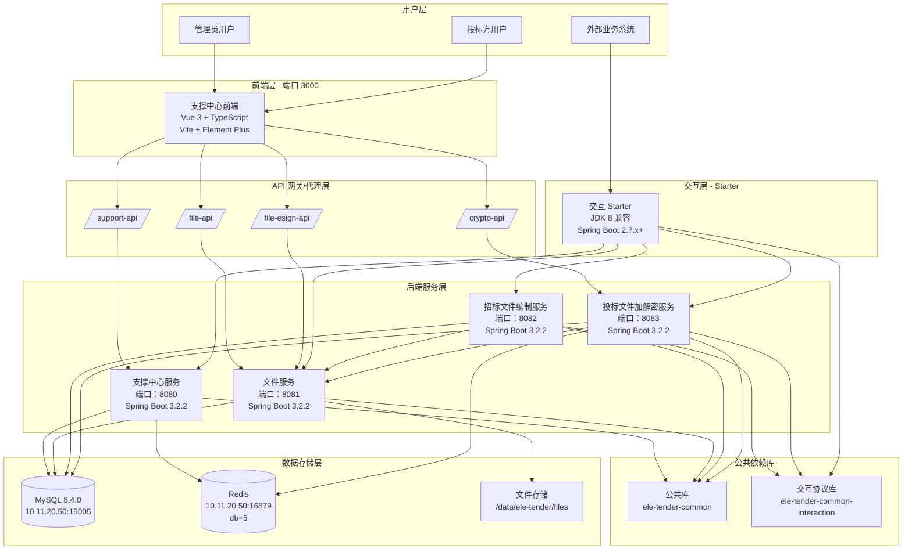
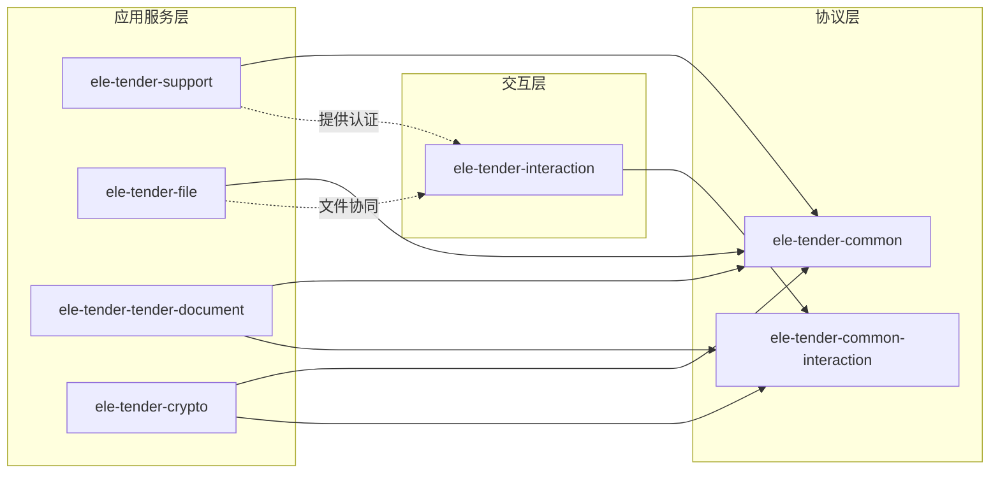
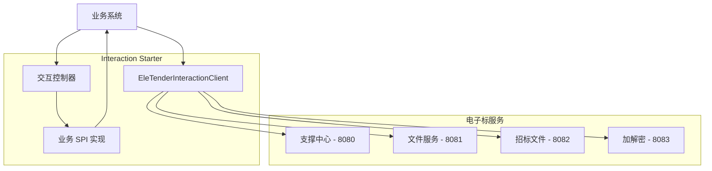
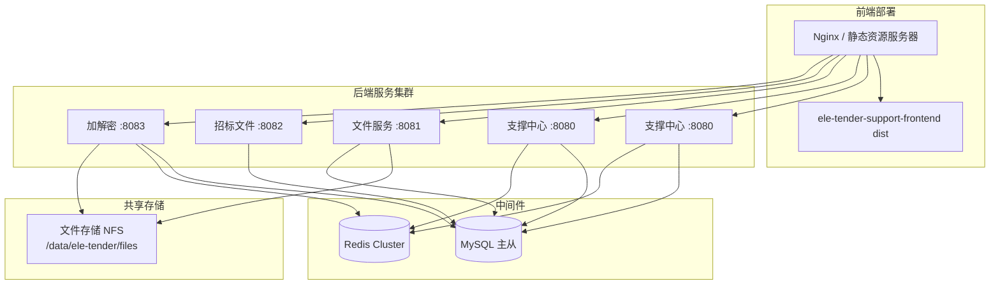
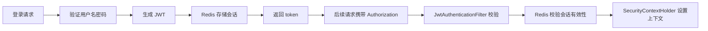

# EleTender 电子招标平台系统架构设计文档

## 1. 系统概述

### 1.1 系统定位

EleTender 是一个电子招标平台，提供招标文件编制、投标文件加解密、文件管理、用户权限管理等核心能力。系统采用前后端分离架构，支持多业务系统接入。

### 1.2 核心业务能力

- **支撑中心**：用户认证、权限管理、菜单管理、版本管理、外部系统接入
- **文件服务**：通用文件上传、下载、签章文件管理
- **招标文件编制**：项目/标段级招标文件编制、步骤流转、评审规则配置、文件生成与回传
- **投标文件加解密**：投标文件预存、解密请求处理、状态查询、异步回调
- **业务系统交互**：为标准业务系统提供统一的接入协议和回调接口

---

## 2. 整体架构

### 2.1 系统架构图



### 2.2 技术栈总览

| 层级 | 技术选型 | 版本 |
|------|---------|------|
| **前端** | Vue 3 | 3.5.25 |
| | TypeScript | 5.9.3 |
| | Vite | 7.3.1 |
| | Element Plus | 2.13.2 |
| | Pinia | 3.0.4 |
| | Vue Router | 4.6.4 |
| **后端** | JDK | 21 (交互层兼容 JDK 8) |
| | Spring Boot | 3.2.2 |
| | MyBatis-Plus | 3.5.5 |
| | MySQL Connector | 8.4.0 |
| | JWT (JJWT) | 0.12.5 |
| | Hutool | 5.8.25 |
| **中间件** | MySQL | 8.4.0 |
| | Redis | - |
| **构建工具** | Maven | - |
| | npm | - |

---

## 3. 模块结构详解

### 3.1 模块清单与职责

| 模块名称 | 类型 | 端口 | 职责 | 数据库表前缀 |
|---------|------|------|------|-------------|
| `ele-tender-support-frontend` | 前端 | 3000 | 支撑中心管理界面 | - |
| `ele-tender-common` | 公共库 | - | 公共实体、工具类、异常、响应、安全、日志 | - |
| `ele-tender-common-interaction` | 协议库 | - | 交互协议 DTO、SPI 接口、路径常量 | - |
| `ele-tender-support` | 后端服务 | 8080 | 认证、用户、角色、菜单、版本、外部系统、访问日志、crypto 管理 | `sup_*` |
| `ele-tender-file` | 后端服务 | 8081 | 文件上传、下载、查询、删除、签章上传 | `file_*` |
| `ele-tender-tender-document` | 后端服务 | 8082 | 招标文件编制、步骤流转、评审规则、生成回传 | `td_*` |
| `ele-tender-crypto` | 后端服务 | 8083 | 投标文件预存、解密调度、Redis Stream 消费、回调 | `bdc_*` |
| `ele-tender-interaction` | Starter | - | 业务系统接入协议、客户端、自动装配、回调接口 | - |
| `ele-tender-dev-tools` | 开发工具 | - | 开发联调 CLI（生成/解密招投标文件） | - |

### 3.2 模块依赖关系



### 3.3 核心模块详细架构

#### 3.3.1 支撑中心 (ele-tender-support)

**核心能力**：
- 认证授权：登录/登出、JWT 签发、权限校验
- 用户管理：用户 CRUD、状态管理、密码重置
- 角色管理：角色 CRUD、菜单授权
- 菜单管理：菜单树、路由配置
- 版本管理：版本发布、插件管理
- 外部系统：接入系统管理、密钥管理、token 签发
- 访问日志：查询入口、日志落库
- Crypto 管理：解密请求管理、工件明细、人工重试

**关键控制器**：
- `AuthController`: `/api/auth/*`
- `UserController`: `/api/users/*`
- `RoleController`: `/api/roles/*`
- `MenuController`: `/api/menus/*`
- `VersionController`: `/api/versions/*`
- `ExternalSystemController`: `/api/external-systems/*`
- `ExternalAuthController`: `/api/external/*`
- `AccessLogController`: `/api/access-logs`
- `CryptoManageController`: `/api/crypto/manage/*`

**技术特点**：
- JWT + Redis 双校验
- 支持内部用户和外部系统两种认证模式
- 统一访问日志落库到 `sup_access_log`

#### 3.3.2 文件服务 (ele-tender-file)

**核心能力**：
- 通用文件上传：`POST /api/file/upload`
- Esign 专用上传：`POST /api/file/esign/upload`
- 文件下载：`GET /api/file/download/{fileId}`
- 文件信息查询：`GET /api/file/info/{fileId}`
- 文件删除：`DELETE /api/file/delete/{fileId}`

**文件类型白名单**：
- `.jar`, `.war`, `.zip`, `.tar.gz`
- `.pdf`
- `.HzctZbs` (招标文件)
- `.HzctTbs` (投标文件)
- 支持自定义后缀配置

**存储策略**：
- 元数据落库：`file_*` 表
- 物理文件：`/data/ele-tender/files`
- 文件摘要：SHA-256

**技术特点**：
- 最大文件大小：500MB
- Esign 接口认证走请求参数 `token`
- 文件服务只处理文件能力，不承接业务逻辑

#### 3.3.3 招标文件编制 (ele-tender-tender-document)

**核心能力**：
- 编制入口：`POST /api/tender-documents/entry`
- 基本信息管理：项目/标段信息同步
- 采购文件管理：文件绑定、签章文件绑定
- 开标标录管理：标录方案同步
- 评审规则管理：评审方法、评分节点、分值配置
- 检查项管理：步骤流转校验
- 生成与回传：文件生成、生成记录、回调业务系统

**编制流程**：


**关键数据表**：
- `td_project_lock`: 项目锁
- `td_tender_document`: 编制单主表
- `td_tender_document_step`: 步骤表
- `td_tender_rule_header`: 评审规则头表
- `td_tender_rule_node`: 评审规则节点表
- `td_tender_document_generation_record`: 生成记录
- `td_tender_document_callback`: 回传记录

**技术特点**：
- 公开类项目按项目级编制，邀请类项目按标段级编制
- 评审规则采用"头表 + 节点表"树形结构
- 生成完成后固化版本，支持重复回传

#### 3.3.4 投标文件加解密 (ele-tender-crypto)

**核心能力**：
- 投标文件预存：`POST /api/crypto/bid-document/push`
- 解密请求提交：`POST /api/crypto/bid-decrypt/submit`
- 解密状态查询：`GET /api/crypto/bid-decrypt/status/{recordId}`

**预存链路**：


**解密链路**：


**文件存储结构**：
- 加密文件（内容寻址）：`{appKey}/{sha256[0:2]}/{sha256[2:4]}/{sha256[4:6]}/{sha256}.HzctTbs`
- 解密文件（工件级）：`{artifactId}.json`
- 组织视图（项目/标段）：`{appKey}/{projectId}/{tenderId}/encrypted|decrypted/{bidRecordId}`

**技术特点**：
- 工件去重维度：`appKey + fileSha256 + bidderPwdFingerprint`
- 原始口令只缓存到 Redis，不落库
- Redis Stream 至少一次投递，幂等由 artifact 状态保证
- Native 加解密能力（C++ core + JNI bridge）

#### 3.3.5 交互 Starter (ele-tender-interaction)

**模块组成**：
- `ele-tender-interaction-core`: 核心客户端能力
- `ele-tender-interaction-autoconfigure`: 自动装配
- `ele-tender-interaction-spring-boot-starter`: Starter 聚合

**固定接口**（业务系统接入后暴露）：
- `GET /api/eleTender/interaction/identity/current`
- `POST /api/eleTender/interaction/projects/basic-info`
- `POST /api/eleTender/interaction/bid-record-schemes/query`
- `POST /api/eleTender/interaction/ca-keys/query`
- `POST /api/eleTender/interaction/callbacks/tender-pdf`
- `POST /api/eleTender/interaction/callbacks/tender-package`
- `POST /api/eleTender/interaction/callbacks/bid-document-result`
- `POST /api/eleTender/interaction/callbacks/bid-decrypt-result`

**业务系统必须实现的 SPI**：
- `InteractionIdentityService`: 当前外部用户信息
- `InteractionProjectInfoService`: 项目基础信息
- `InteractionBidRecordSchemeService`: 开标标录方案
- `InteractionCaKeysInfoService`: CA 锁信息
- `InteractionTenderPdfReceiveService`: 接收招标文件 PDF
- `InteractionTenderPackageReceiveService`: 接收招标文件包
- `InteractionBidDocumentResultReceiveService`: 接收投标文件结果
- `InteractionBidDecryptResultReceiveService`: 接收解密结果

**出站能力**（统一客户端）：
- `getExternalToken`: 获取外部 token
- `getCurrentExternalUser`: 获取当前用户
- `getFileInfo`: 文件信息查询
- `downloadFile`: 文件下载
- `pushBidDocument`: 投标文件预存
- `submitDecrypt`: 提交解密请求
- `queryDecryptStatus`: 查询解密状态
- `buildTenderDocumentEntryUrl`: 构造编制入口 URL

**技术特点**：
- JDK 8 + Spring Boot 2.7.x 兼容
- 协议 DTO 单源放在 `ele-tender-common-interaction`
- 统一签名校验、异常处理

---

## 4. 请求链路与部署架构

### 4.1 前端请求链路

```mermaid
graph TB
    Browser[浏览器 - 端口 3000]
    
    subgraph "Vite 开发代理"
        SupportProxy[/support-api/*]
        FileProxy[/file-api/*]
        EsignProxy[/file-esign-api/*]
        CryptoProxy[/crypto-api/*]
    end
    
    subgraph "后端服务"
        Support[支撑中心 - 8080]
        File[文件服务 - 8081]
        Crypto[加解密服务 - 8083]
    end
    
    subgraph "数据库与缓存"
        MySQL[(MySQL)]
        Redis[(Redis)]
    end
    
    subgraph "文件存储"
        Disk[本地磁盘]
    end
    
    Browser --> SupportProxy
    Browser --> FileProxy
    Browser --> EsignProxy
    Browser --> CryptoProxy
    
    SupportProxy -->|rewrite: /api/*| Support
    FileProxy --> File
    EsignProxy --> File
    CryptoProxy -->|rewrite: /api/crypto/*| Crypto
    
    Support --> MySQL
    Support --> Redis
    File --> MySQL
    File --> Disk
    Crypto --> MySQL
    Crypto --> Redis
    Crypto --> File
```

### 4.2 业务系统请求链路



### 4.3 部署架构



---

## 5. 基础设施与配置

### 5.1 数据库与中间件

| 资源 | 地址 | 配置 |
|------|------|------|
| MySQL | 10.11.20.50:15005 | 数据库：ele_tender |
| Redis | 10.11.20.50:16879 | db=5, password=test123 |
| 文件存储 | /data/ele-tender/files | 宿主机本地磁盘/NFS |

### 5.2 默认账户

- 管理员：`admin / admin123`

### 5.3 环境变量配置

**通用环境变量**：
- `SPRING_DATASOURCE_PASSWORD`
- `SPRING_REDIS_PASSWORD`
- `APP_JWT_SECRET`

**服务专属配置**：
- `FILE_STORAGE_BASE_PATH`: 文件服务存储路径
- `TENDER_DOCUMENT_FINAL_PACKAGE_AES_KEY_BASE64`: 招标文件 AES 密钥
- `CRYPTO_RSA_PRIVATE_KEY`: 解密私钥
- `CRYPTO_BIDDER_PWD_FINGERPRINT_SECRET`: 口令指纹 HMAC 密钥
- `CRYPTO_ORGANIZED_FILE_PATH`: 组织视图文件路径

**本地配置覆盖**（各服务均支持）：
```yaml
spring.config.import: optional:file:${user.home}/.ele-tender/{module}-local.yml
```

---

## 6. 安全架构

### 6.1 认证体系

**双轨认证**：
- **内部用户**：JWT (`type=INTERNAL`) + Redis 会话
- **外部系统**：JWT (`type=EXTERNAL`) + 签名校验

**认证流程**：


### 6.2 签名机制

- 算法：HMAC-SHA256
- 工具类：`SignatureUtil`
- 外部系统签名校验统一使用此工具

### 6.3 密码加密

- 算法：BCrypt
- 工具类：`PasswordUtil`

### 6.4 文件安全

- 文件摘要：SHA-256
- 招标文件加密：AES-GCM
- 投标文件加密：RSA + AES 混合加密

---

## 7. 日志与监控

### 7.1 日志规范

- 全系统透传 `X-Trace-Id`
- MDC 键：`traceId`
- HTTP 入站日志落库到 `sup_access_log`
- 禁止记录敏感信息（token、secret、文件二进制）

### 7.2 访问日志字段

- `traceId`: 链路追踪 ID
- `bizType`: 业务类型
- `bizId`: 业务 ID
- `projectId`: 项目 ID
- `tenderId`: 标段 ID
- `fileId`: 文件 ID
- 请求方法、路径、状态码、耗时

---

## 8. 开发工作流

### 8.1 本地开发启动

```bash
# 前端
cd ele-tender-support-frontend
npm install
npm run dev  # 端口 3000

# 后端（在 ele-tender-system/ 目录下）
mvn -pl ele-tender-support -am spring-boot:run  # :8080
mvn -pl ele-tender-file -am spring-boot:run     # :8081
mvn -pl ele-tender-tender-document -am spring-boot:run  # :8082
mvn -pl ele-tender-crypto -am spring-boot:run   # :8083
```

### 8.2 测试与打包

```bash
# 运行所有测试
mvn clean test

# 打包单模块
mvn -pl ele-tender-support -am package

# 构建交互 starter
mvn -pl ele-tender-common-interaction,ele-tender-interaction/ele-tender-interaction-core,ele-tender-interaction/ele-tender-interaction-autoconfigure,ele-tender-interaction/ele-tender-interaction-spring-boot-starter -am package -DskipTests
```

### 8.3 开发联调 CLI

```bash
# 构建 CLI
mvn -pl ele-tender-dev-tools -am install -DskipTests -q

# 生成招标文件
java -cp "$DEV_CP" com.jy.eletender.devtools.cli.EleTenderDevCli generate-tender -o ./dev-output

# 生成投标文件
java -cp "$DEV_CP" com.jy.eletender.devtools.cli.EleTenderDevCli generate-bid -o ./dev-output

# 解密招标文件
java -cp "$DEV_CP" com.jy.eletender.devtools.cli.EleTenderDevCli decrypt-tender -i <file> -k <key>

# 解密投标文件
java -cp "$DEV_CP" com.jy.eletender.devtools.cli.EleTenderDevCli decrypt-bid -i <file> -p <pwd>
```

---

## 9. 文档索引

### 9.1 规范文档

| 文档 | 路径 |
|------|------|
| 项目总规范 | [docs/rules/PROJECT_SPEC_FINAL.md](../rules/PROJECT_SPEC_FINAL.md) |
| 编码规范 | [docs/rules/CODE_CONVENTIONS.md](../rules/CODE_CONVENTIONS.md) |
| 支撑中心规范 | [docs/rules/SUPPORT_SYSTEM_SPEC.md](../rules/SUPPORT_SYSTEM_SPEC.md) |
| 文件服务规范 | [docs/rules/FILE_SERVICE_SPEC.md](../rules/FILE_SERVICE_SPEC.md) |
| 招标文件编制规范 | [docs/rules/TENDER_DOCUMENT_PROJECT_SPEC.md](../rules/TENDER_DOCUMENT_PROJECT_SPEC.md) |
| 加解密模块规范 | [docs/rules/ELE_TENDER_CRYPTO_SPEC.md](../rules/ELE_TENDER_CRYPTO_SPEC.md) |
| 交互集成规范 | [docs/rules/INTERACTION_INTEGRATION_SPEC.md](../rules/INTERACTION_INTEGRATION_SPEC.md) |
| 招标文件格式规范 | [docs/rules/TENDER_DOCUMENT_FORMAT_SPEC.md](../rules/TENDER_DOCUMENT_FORMAT_SPEC.md) |
| 投标文件格式规范 | [docs/rules/BID_DOCUMENT_FORMAT_SPEC.md](../rules/BID_DOCUMENT_FORMAT_SPEC.md) |
| 开标流程规范 | [docs/rules/BID_OPENING_FLOW_SPEC.md](../rules/BID_OPENING_FLOW_SPEC.md) |

### 9.2 使用指南

| 指南 | 路径 |
|------|------|
| 业务系统接入手册 | [docs/guides/业务系统接入手册.md](业务系统接入手册.md) |
| 业务系统接入解密服务 | [docs/guides/业务系统接入解密服务指南.md](业务系统接入解密服务指南.md) |
| 本地加解密工具（Java CLI） | [docs/guides/本地加解密工具指南（Java CLI）.md](本地加解密工具指南（Java%20CLI）.md) |
| Electron 客户端加解密 | [docs/guides/Electron 客户端加解密指南.md](Electron%20客户端加解密指南.md) |
| 开发联调 CLI 工具 | [docs/guides/开发联调 CLI 工具使用说明.md](开发联调 CLI 工具使用说明.md) |
| Native 测试向量导出 | [docs/guides/NativeVectorExportCli-使用说明.md](NativeVectorExportCli-使用说明.md) |
| Electron Native 交付清单 | [docs/guides/Electron-native-交付清单.md](Electron-native-交付清单.md) |

---

## 10. 术语表

| 中文 | 代码术语 | 说明 |
|------|----------|------|
| 电子标 | ele-tender | 电子招标系统 |
| 招标文件 | TenderDocument | 招标方编制的文件 |
| 投标文件 | BidDocument | 投标方提交的文件 |
| 招标方 | Tenderer | 发起招标的单位 |
| 投标方 | Bidder | 参与投标的单位 |
| 项目 | project | 招标项目 |
| 标段 | tender | 项目下的标段 |
| 标段标的金额 | tenderAmount | 标段的预算金额 |
| 开标标录 | bidRecord | 开标记录 |
| 标录方案 | schemeContent | 标录方案内容 |
| 标录数据 | bidFormData | 标录数据 |
| 资格审查 | qualifications | 投标人资格审核 |
| 资信评分 | credit_score | 资信评审得分 |
| 技术评分 | tec_score | 技术评审得分 |
| 商务评分 | business_score | 商务评审得分 |
| 最低评标价法 | - | 评审方法之一 |
| 综合评分法 | - | 评审方法之一 |
| 招标文件后缀 | .HzctZbs | 默认后缀，可配置 |
| 投标文件后缀 | .HzctTbs | 默认后缀，可配置 |

---

## 11. 总结

EleTender 电子招标平台采用微服务架构，包含以下核心特点：

1. **前后端分离**：Vue 3 前端 + Spring Boot 后端
2. **模块化设计**：8 个后端模块职责清晰，依赖关系明确
3. **标准化交互**：通过 Starter 提供统一的业务系统接入协议
4. **安全可控**：JWT + Redis 双认证、签名校验、文件加密
5. **高可扩展性**：支持多业务系统并行接入、文件服务独立部署
6. **完整的日志追踪**：全链路 X-Trace-Id 透传、访问日志落库

系统支持招标文件编制、投标文件加解密、文件管理、用户权限管理等核心业务场景，适用于电子招标投标全流程管理。
