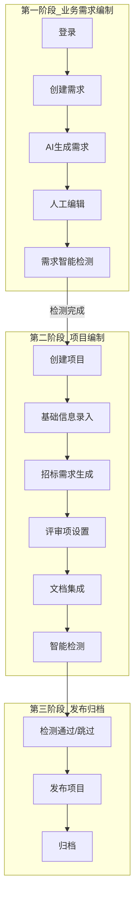
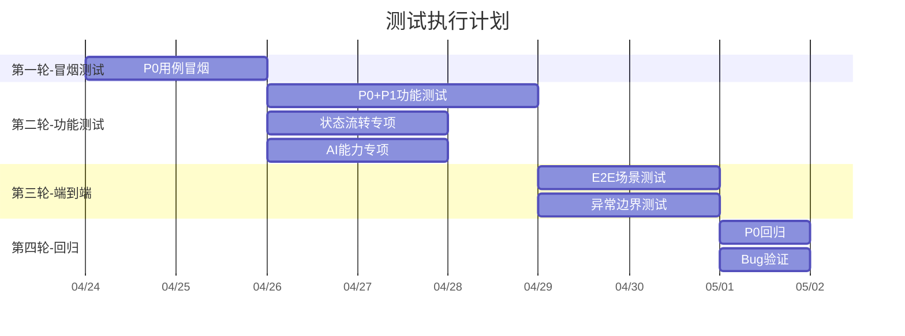

# 招标文件AI编制系统 — 全流程测试计划

> 覆盖范围：从业务需求编制到项目招标文件编制完成的全流程
> 编写日期：2026-04-15
> 更新日期：2026-04-23（基于代码实现校准）
> 依据文档：需求文档V1.0、原型设计索引、API接口文档（4份OpenAPI YAML）、系统规范

---

## 一、测试范围与目标

### 1.1 测试目标

验证从「业务需求编制」到「项目招标文件编制完成」的端到端全流程，确保：

- **正向主流程**：每个环节功能可用、数据流转正确、状态推进合法
- **AI能力集成**：SSE流式响应、异步任务、模型路由、降级机制正常工作
- **异常与边界**：非法输入、网络中断、AI不可用等场景有合理兜底
- **数据一致性**：跨模块调用（core ↔ ai ↔ file ↔ support）数据不丢失、不冲突

### 1.2 测试范围总览



### 1.3 不在测试范围

| 排除项 | 原因 |
|--------|------|
| 统计分析模块 | 首版排除，前端对齐计划明确排除 |
| 系统设置（支撑中心管理后台） | 属于支撑中心范畴，非编制主流程 |
| 知识库向量化/Milvus/Tika | 阶段三明确排除 |
| 交互集成Starter | 第三方接入，非本系统主流程 |

### 1.4 代码实现校准变更记录（2026-04-23）

> 基于后端4模块30个Controller、前端2项目35+页面、14个API文件的逐项对比，以下为测试计划与实际代码的偏差修正：

| 偏差项 | 测试计划原文 | 实际代码 | 修正措施 |
|--------|------------|---------|---------|
| 需求状态 | 含PENDING_REVIEW状态 | TbRequirement.status仅有IN_PROGRESS/COMPLETED | 移除PENDING_REVIEW相关用例，调整状态流转 |
| AI任务接口 | 有retry接口(POST /{id}/retry) | AiTaskController精简为3个接口(getStatus/skip/getLatest)，无retry | 移除retry用例，补充getLatest用例 |
| AI任务-项目任务列表 | GET /project/{projectId} | 不存在，已精简 | 移除该接口用例 |
| 导出Word | T-PROJ-DOC-004导出Word为P0 | ProjectController.export为TODO未实现 | 降级为P2/待实现 |
| 文档集成-导出 | 测试计划中文档集成有独立导出 | DocumentIntegrationController无导出接口，仅integrate/preview/edit | 修正API矩阵 |
| AI检测接口 | ai模块有/start/result/confirm 3个端点 | 后端ai模块Controller无detection端点，前端ai.ts调用/ai-api/v1/detection/* | 标注为前端预留、后端未实现 |
| 需求检测流程 | 测试计划较粗 | 实际有独立accept/reject/finish/records接口 | 补充需求检测用例 |
| AI内容反馈 | 测试计划未覆盖 | AiContentFeedbackController已实现(submit/getUserFeedback) | 新增模块测试用例 |
| 项目模板绑定 | 测试计划未覆盖 | ProjectTemplateController已实现(bind/getByProject) | 新增模块测试用例 |
| 匹配文件预览 | 测试计划未覆盖 | 前端有previewMatchFile API | 新增用例（后端端点未实现则标注） |
| 需求文档导出 | 测试计划未覆盖 | 前端有exportDocument API | 新增用例（后端端点未实现则标注） |
| 消息删除 | 测试计划未覆盖 | UserMessageController有deleteById接口 | 补充用例 |

---

## 二、测试环境

### 2.1 环境配置

| 组件 | 地址 | 说明 |
|------|------|------|
| AI编制前端 | localhost:5173 | Vue 3 + Vite dev |
| 支撑中心前端 | localhost:3060 | 管理后台 |
| 支撑中心(support) | localhost:8080 | 认证/用户/模型配置 |
| 文件服务(file) | localhost:8081 | 文件上传下载 |
| 核心业务(core) | localhost:8082 | 项目/需求/检测/文档 |
| AI服务(ai) | localhost:8083 | 对话/匹配 |
| MySQL | 10.11.20.50:15005 | db=6 |
| Redis | 10.11.20.50:16879 | db=6 |

### 2.2 测试账号

| 角色 | 账号                | 用途 |
|------|-------------------|------|
| 管理员 | admin / 123456    | 全功能测试 |
| 普通用户 | testuser / 123456 | 权限边界测试 |

### 2.3 AI服务前置条件

- 至少配置一个可用的LOCAL模型（用于生成类任务）
- 至少配置一个可用的CLOUD模型（用于优化/检测类任务）
- 模型路由规则已配置 GENERATION/OPTIMIZATION/DETECTION 三场景
- 确认AI API Key有效且Token额度充足

---

## 三、全流程测试用例

### 3.1 登录模块（1个场景，6条用例）

> 涉及页面：Login.vue → support模块 AuthController
> 后端接口：POST /api/auth/login、POST /api/auth/phone-login、POST /api/auth/logout、GET /api/auth/info、GET /api/auth/public-key

| 用例ID | 用例名称 | 操作步骤 | 预期结果 | 优先级 |
|--------|----------|----------|----------|--------|
| T-LOGIN-001 | 账号密码登录-正常 | 输入admin/123456，点击登录（密码RSA加密传输） | 跳转到首页，localStorage存储token | P0 |
| T-LOGIN-002 | 手机验证码登录-正常 | 输入手机号 → 获取验证码 → 输入验证码 → 登录 | 跳转到首页 | P0 |
| T-LOGIN-003 | 登录失败-密码错误 | 输入admin/错误密码，点击登录 | 提示错误信息，不跳转 | P1 |
| T-LOGIN-004 | 登录状态保持 | 登录成功后刷新页面 | 自动识别登录状态，不跳回登录页 | P1 |
| T-LOGIN-005 | 登出 | 点击登出（POST /api/auth/logout） | 清除token，跳转到登录页 | P1 |
| T-LOGIN-006 | 获取用户信息 | 登录后调用 GET /api/auth/info | 返回用户信息含角色、权限 | P1 |

---

### 3.2 业务需求编制模块（5个场景，24条用例）

> 涉及页面：RequirementList/Create/Edit/Editor/Generate/Detect.vue
> 涉及后端：core模块(RequirementController) + ai模块(AiChatController/DocumentMatchController)
> 需求状态：IN_PROGRESS → COMPLETED（无PENDING_REVIEW状态）

#### 场景A：业务需求列表

| 用例ID | 用例名称 | 操作步骤 | 预期结果 | 优先级 |
|--------|----------|----------|----------|--------|
| T-REQ-LIST-001 | 查看需求列表 | 登录后进入业务需求列表 | 显示需求列表，含需求名称/项目类别/项目类型/状态/进度/创建时间 | P0 |
| T-REQ-LIST-002 | 按名称搜索 | 输入关键词搜索 | 列表仅显示匹配的需求 | P1 |
| T-REQ-LIST-003 | 按状态筛选 | 选择"进行中"状态 | 列表仅显示IN_PROGRESS状态的需求 | P1 |
| T-REQ-LIST-004 | 删除需求 | 点击某条需求的删除按钮 | 删除成功，列表刷新 | P1 |

#### 场景B：创建业务需求

| 用例ID | 用例名称 | 操作步骤 | 预期结果 | 优先级 |
|--------|----------|----------|----------|--------|
| T-REQ-CREATE-001 | 创建需求-自动匹配模式 | 填写需求名称/项目类别/项目类型 → 选择"自动匹配"(AUTO_MATCH) → 提交 | 创建成功，状态为IN_PROGRESS，跳转到生成页 | P0 |
| T-REQ-CREATE-002 | 创建需求-手动选择模式 | 选择"手动选择"(MANUAL_SELECT) → 系统返回候选列表(GET /match-files) → 选择一个 → 提交 | 创建成功，matchedFileId有值 | P0 |
| T-REQ-CREATE-003 | 创建需求-上传文件模式 | 选择"上传"(UPLOAD) → 上传docx文件(≤50MB) → 提交 | 文件上传成功(file模块)，需求创建成功，uploadedFileId有值 | P0 |
| T-REQ-CREATE-004 | 上传文件-格式校验 | 上传.exe文件 | 提示"仅支持doc/docx/pdf格式" | P1 |
| T-REQ-CREATE-005 | 上传文件-大小校验 | 上传60MB文件 | 提示"文件大小不能超过50MB" | P1 |
| T-REQ-CREATE-006 | 必填项校验 | 不填需求名称直接提交 | 提示"请输入需求名称" | P1 |
| T-REQ-CREATE-007 | 获取匹配文件列表 | 创建需求时调用 GET /requirements/match-files | 返回匹配文件列表，含文件名、相似度等 | P1 |

#### 场景C：AI生成业务需求

| 用例ID | 用例名称 | 操作步骤 | 预期结果 | 优先级 |
|--------|----------|----------|----------|--------|
| T-REQ-GEN-001 | AI生成需求-正常 | 点击"AI生成"（POST /{id}/generate） | 创建REQUIREMENT_GENERATE类型AiTask，任务状态PENDING→PROCESSING→COMPLETED | P0 |
| T-REQ-GEN-002 | AI生成-人工编辑 | 生成完成后在编辑器(RequirementEditor)中修改内容 | 内容可编辑，修改可保存(PUT /{id}) | P0 |
| T-REQ-GEN-003 | AI生成-自动保存 | 编辑后等待自动保存触发（POST /{id}/auto-save） | 自动保存触发，autoSaveContent更新 | P1 |
| T-REQ-GEN-004 | AI生成-草稿恢复 | 刷新页面后返回编辑页（GET /{id}/auto-save） | 检测到自动保存的草稿，提示是否恢复 | P1 |
| T-REQ-GEN-005 | AI对话-辅助生成 | 在AI对话面板输入"请优化第二段"（SSE /ai/chat） | AI返回优化建议，SSE流式输出 | P0 |
| T-REQ-GEN-006 | AI文本优化 | 选中一段文本 → 点击"AI优化"（SSE /ai/optimize） | 优化内容SSE流式返回 | P0 |
| T-REQ-GEN-007 | 完成需求 | 编辑完成后点击"完成" | 需求状态变为COMPLETED | P0 |

#### 场景D：业务需求智能检测

| 用例ID | 用例名称 | 操作步骤 | 预期结果 | 优先级 |
|--------|----------|----------|----------|--------|
| T-REQ-DET-001 | 提交需求检测 | 在需求编辑页点击"提交检测"（POST /{id}/detect） | 创建2项检测任务（SENSITIVE_WORD+TYPO），返回{recordId1, recordId2} | P0 |
| T-REQ-DET-002 | 查看检测记录 | 调用GET /{id}/detect/records | 返回检测记录列表，含检测类型/状态/结果 | P1 |
| T-REQ-DET-003 | 接受检测建议 | 点击某条"接受建议"（POST /{id}/detect/{recordId}/accept?issueIndex=N） | 建议被采纳，内容自动修正 | P0 |
| T-REQ-DET-004 | 拒绝检测建议 | 点击某条"拒绝建议"（POST /{id}/detect/{recordId}/reject?issueIndex=N） | 建议被拒绝，内容不变 | P1 |
| T-REQ-DET-005 | 完成需求检测 | 检测处理完毕后调用POST /{id}/detect/finish | 检测流程结束 | P1 |

#### 场景E：需求到项目的衔接

| 用例ID | 用例名称 | 操作步骤 | 预期结果 | 优先级 |
|--------|----------|----------|----------|--------|
| T-REQ-PROJ-001 | 从需求创建项目 | 需求完成后创建项目，关联需求ID | 项目创建成功，requirementId关联，requirementSource=REFERENCE，requirementContent从需求复制 | P0 |
| T-REQ-PROJ-002 | 直接创建项目（不经过需求） | 从项目列表直接新建 | 创建成功，项目状态DRAFT，无关联需求，requirementSource=SYSTEM_GENERATE | P1 |

---

### 3.3 项目编制模块（6个场景，29条用例）

> 涉及页面：ProjectList/Create/Detail/Wizard.vue 及 phases子组件(PhaseBasicInfo/PhaseRequirement/PhaseReviewItem/PhaseDocument/PhaseDetection)
> 涉及后端：core模块(ProjectController/ReviewItemController/DocumentIntegrationController/DetectionController/AiTaskController/ProjectTemplateController)

#### 场景A：项目创建与基础信息

| 用例ID | 用例名称 | 操作步骤 | 预期结果 | 优先级 |
|--------|----------|----------|----------|--------|
| T-PROJ-CREATE-001 | 创建项目-完整信息 | 填写项目名称/类别/类型/预算/评审方式 → 提交 | 创建成功，状态DRAFT，阶段BASIC_INFO(1→20%) | P0 |
| T-PROJ-CREATE-002 | 项目类别-限额以下 | 选择"限额以下" | 表单适配，无服务子类型字段 | P1 |
| T-PROJ-CREATE-003 | 项目类别-政府采购+服务类型 | 选择"政府采购"+"服务" | 显示服务子类型(serviceSubType)下拉框 | P1 |
| T-PROJ-CREATE-004 | 必填项校验 | 不填项目名称提交 | 提示"请输入项目名称" | P1 |
| T-PROJ-CREATE-005 | 项目模板绑定 | 创建项目时绑定模板（POST /project-templates/bind） | 项目模板快照创建成功 | P1 |
| T-PROJ-PHASE-001 | 推进阶段-基础信息到需求生成 | 完成基础信息填写 → 推进阶段（PUT /{id}/phase, targetPhase=2） | 阶段变为REQUIREMENT(2→40%)，项目状态变为IN_PROGRESS | P0 |

#### 场景B：招标需求生成

| 用例ID | 用例名称 | 操作步骤 | 预期结果 | 优先级 |
|--------|----------|----------|----------|--------|
| T-PROJ-REQ-001 | AI生成招标需求 | 点击"AI生成"（POST /{id}/requirement-generate） | 创建PROJECT_REQUIREMENT_GENERATE任务，任务状态PENDING→PROCESSING→COMPLETED | P0 |
| T-PROJ-REQ-002 | AI生成-任务轮询 | 轮询AI任务状态（GET /ai-tasks/{taskId}） | 轮询间隔3秒，生成完成后停止轮询，内容渲染到编辑器 | P0 |
| T-PROJ-REQ-003 | AI生成-查询最新任务 | 页面加载时调用GET /ai-tasks/latest | 返回该业务实体最新的AI任务（含终态），避免重复提交 | P0 |
| T-PROJ-REQ-004 | AI生成-AI不可用 | AI服务不可用时 | 任务状态变为AI_UNAVAILABLE，显示告警，提供"手动输入"按钮 | P0 |
| T-PROJ-REQ-005 | AI任务-跳过 | AI不可用时点击"跳过"（POST /ai-tasks/{id}/skip） | 任务状态变为SKIPPED，降级为手动输入模式 | P1 |
| T-PROJ-REQ-006 | 自动保存 | 编辑需求内容后等待自动保存 | 自动保存触发 | P1 |
| T-PROJ-PHASE-002 | 推进阶段-需求到评审项 | 完成需求编辑 → 推进阶段（targetPhase=3） | 阶段变为REVIEW_ITEM(3→60%) | P0 |

#### 场景C：评审项设置

| 用例ID | 用例名称 | 操作步骤 | 预期结果 | 优先级 |
|--------|----------|----------|----------|--------|
| T-PROJ-REV-001 | AI生成评审项 | 点击"AI生成评审项"（POST /review-items/{projectId}/generate） | 创建REVIEW_ITEM_GENERATE任务，生成三级评审项树 | P0 |
| T-PROJ-REV-002 | 手动添加评审项 | 点击"添加根项" → 输入名称/内容 → 保存（POST /review-items） | 评审项树新增一条level=1的根项 | P0 |
| T-PROJ-REV-003 | 编辑评审项 | 修改某条评审项的内容（PUT /review-items/{id}） | 修改成功，树结构刷新 | P1 |
| T-PROJ-REV-004 | 删除评审项-有子项 | 删除有子项的评审项（DELETE /review-items/{id}） | 提示"存在子项，不可删除" | P1 |
| T-PROJ-REV-005 | 删除评审项-叶子节点 | 删除无子项的评审项 | 删除成功，树结构刷新 | P1 |
| T-PROJ-REV-006 | 评审项三级结构验证 | AI生成后检查评审项树（GET /review-items/{projectId}） | 存在level=1/2/3级结构，parentId关系正确 | P0 |
| T-PROJ-REV-007 | 批量创建评审项 | 调用POST /review-items/batch | 批量创建成功 | P2 |
| T-PROJ-REV-008 | 批量更新评审项 | 调用PUT /review-items/batch | 批量更新成功 | P2 |
| T-PROJ-PHASE-003 | 推进阶段-评审项到文档集成 | 完成评审项设置 → 推进阶段（targetPhase=4） | 阶段变为DOCUMENT(4→80%) | P0 |

#### 场景D：文档集成

| 用例ID | 用例名称 | 操作步骤 | 预期结果 | 优先级 |
|--------|----------|----------|----------|--------|
| T-PROJ-DOC-001 | 执行文档集成 | 点击"执行集成"（POST /documents/integrate/{projectId}） | 将需求内容+评审项按模板结构组装为完整文档，返回DocumentPreviewVO | P0 |
| T-PROJ-DOC-002 | 文档预览 | 集成完成后获取预览（GET /documents/preview/{projectId}） | 返回DocumentPreviewVO，含HTML/Markdown内容 | P0 |
| T-PROJ-DOC-003 | 编辑文档内容 | 修改Markdown内容 → 保存（PUT /documents/edit/{projectId}） | 修改后内容可重新预览 | P1 |
| T-PROJ-DOC-004 | 导出Word | 点击"导出Word"（POST /projects/{id}/export） | **⚠️ 后端TODO未实现**，预计下载.docx文件 | P2 |
| T-PROJ-PHASE-004 | 推进阶段-文档集成到检测 | 完成文档集成 → 推进阶段（targetPhase=5） | 阶段变为DETECTION(5→100%)，项目状态变为PENDING_DETECTION | P0 |

#### 场景E：智能检测

| 用例ID | 用例名称 | 操作步骤 | 预期结果 | 优先级 |
|--------|----------|----------|----------|--------|
| T-PROJ-DET-001 | 提交检测-全类型 | 选择政策文件 → 点击"提交检测"（POST /detection/submit/{projectId}） | 项目状态PENDING_DETECTION→DETECTING，创建4项检测任务（SENSITIVE_WORD/TYPO/POLICY_REVIEW/FORMAT_CHECK） | P0 |
| T-PROJ-DET-002 | 检测进度-轮询 | 轮询检测进度（GET /detection/progress/{projectId}） | 4项检测逐项完成，返回DetectionProgressVO | P0 |
| T-PROJ-DET-003 | 检测通过 | 4项检测均无问题 | 项目状态变为DETECTION_PASSED，可发布 | P0 |
| T-PROJ-DET-004 | 检测失败-有问题 | 检测发现问题 | 项目状态变为DETECTION_FAILED，显示问题列表 | P0 |
| T-PROJ-DET-005 | 接受建议 | 检测报告中点击某条"接受建议"（POST /detection/{recordId}/accept?issueIndex=N） | 建议被采纳，内容自动修改 | P0 |
| T-PROJ-DET-006 | 拒绝建议 | 检测报告中点击某条"拒绝建议"（POST /detection/{recordId}/reject?issueIndex=N） | 建议被拒绝 | P1 |
| T-PROJ-DET-007 | 一键接受所有 | 点击"一键接受所有建议"（POST /detection/accept-all/{projectId}） | 所有建议被采纳，项目状态可推进 | P0 |
| T-PROJ-DET-008 | 跳过检测 | 点击"跳过检测"（POST /detection/skip/{projectId}） | 项目状态变为DETECTION_SKIPPED，发送警告通知到消息中心 | P0 |
| T-PROJ-DET-009 | 重新检测 | 修改后点击"重新检测"（POST /detection/retry/{projectId}） | 项目状态回到DETECTING，重新创建4项检测任务 | P1 |
| T-PROJ-DET-010 | 选择政策文件 | 检测前选择关联的政策文件 | 政策审查检测基于选中文件执行 | P1 |

#### 场景F：项目列表与详情

| 用例ID | 用例名称 | 操作步骤 | 预期结果 | 优先级 |
|--------|----------|----------|----------|--------|
| T-PROJ-LIST-001 | 项目列表-查看 | 进入项目列表 | 显示项目列表，含项目编号/名称/类别/类型/状态/进度 | P0 |
| T-PROJ-LIST-002 | 按状态筛选 | 选择"编制中" | 列表仅显示IN_PROGRESS状态的项目 | P1 |
| T-PROJ-LIST-003 | 按项目类别筛选 | 选择"政府采购" | 列表仅显示GOVERNMENT_PROCUREMENT类别的项目 | P1 |
| T-PROJ-LIST-004 | 批量删除 | 勾选多个DRAFT项目 → 批量删除（DELETE /projects, body={ids:[]})） | 二次确认后删除 | P1 |
| T-PROJ-DETAIL-001 | 项目详情-基本信息 | 点击项目名称 → ProjectDetail | 显示项目完整信息，含进度条 | P0 |
| T-PROJ-DETAIL-002 | 项目详情-版本历史 | 切换到版本管理（GET /{id}/versions） | 显示版本列表，含版本号/变更描述/时间 | P1 |
| T-PROJ-DETAIL-003 | 项目详情-模板信息 | 查看项目绑定的模板（GET /project-templates/project/{projectId}） | 返回项目模板快照信息 | P1 |

---

### 3.4 发布与归档模块（3条用例）

> 涉及后端：core模块(ProjectController)

| 用例ID | 用例名称 | 操作步骤 | 预期结果 | 优先级 |
|--------|----------|----------|----------|--------|
| T-PUB-001 | 发布项目-检测通过后 | 检测通过 → 点击"发布"（POST /{id}/publish） | 项目状态DETECTION_PASSED→PUBLISHED，生成版本快照 | P0 |
| T-PUB-002 | 发布项目-跳过检测后 | 跳过检测 → 点击"发布" | 项目状态DETECTION_SKIPPED→PUBLISHED，消息中心有警告通知 | P0 |
| T-PUB-003 | 归档项目 | 发布后点击"归档"（POST /{id}/archive） | 项目状态PUBLISHED→ARCHIVED（终态） | P1 |

---

### 3.5 模板管理模块（4条用例）

> 涉及后端：core模块(TemplateController) + support模块(TemplateConfigController)
> 前端：编制前端调用core模块接口，支撑中心前端调用support模块接口

| 用例ID | 用例名称 | 操作步骤 | 预期结果 | 优先级 |
|--------|----------|----------|----------|--------|
| T-TPL-001 | 获取默认模板 | 创建项目时自动获取默认模板（GET /templates/default?projectCategory=X&projectType=Y） | 根据项目类别+类型返回对应的默认模板 | P0 |
| T-TPL-002 | 模板列表查询 | 查看模板列表（GET /templates） | 显示模板列表，含模板编码/名称/类别/类型/版本/默认标识 | P1 |
| T-TPL-003 | 模板详情 | 点击模板名称（GET /templates/{id}） | 显示模板详情，含基本信息/structureDefinition | P1 |
| T-TPL-004 | 项目模板绑定与快照 | 项目绑定模板后查看快照（POST /project-templates/bind + GET /project-templates/project/{projectId}） | 绑定成功，快照数据与模板一致 | P1 |

---

### 3.6 政策文件管理模块（5条用例）

> 涉及后端：core模块(PolicyFileController) + file模块(FileController)

| 用例ID | 用例名称 | 操作步骤 | 预期结果 | 优先级 |
|--------|----------|----------|----------|--------|
| T-POL-001 | 上传政策文件 | 上传PDF政策文件 → 填写分类信息 → 创建（POST /policy-files） | 文件上传成功(file模块)，政策文件记录创建成功 | P0 |
| T-POL-002 | 启用/禁用政策文件 | 点击"禁用"（PUT /policy-files/{id}/status?status=0） | 政策文件状态变为0(禁用)，检测时不可选 | P1 |
| T-POL-003 | 删除用户上传的政策文件 | 删除自己上传的政策文件（DELETE /policy-files/{id}） | 删除成功 | P1 |
| T-POL-004 | 获取全部可用政策文件 | 调用GET /policy-files/all | 返回系统级+用户级合并的政策文件列表，区分来源 | P1 |
| T-POL-005 | 获取知识库政策文档 | 调用GET /policy-files/knowledge-policy | 返回知识库中POLICY类别的文档列表 | P2 |

---

### 3.7 消息中心模块（4条用例）

> 涉及后端：core模块(UserMessageController)

| 用例ID | 用例名称 | 操作步骤 | 预期结果 | 优先级 |
|--------|----------|----------|----------|--------|
| T-MSG-001 | 检测通知 | 提交检测后等待完成 | 消息中心收到检测完成通知 | P1 |
| T-MSG-002 | 标记已读 | 点击某条消息的"标记已读"（PUT /messages/{id}/read） | 消息已读状态变更，未读数-1 | P2 |
| T-MSG-003 | 全部已读 | 点击"全部标记已读"（PUT /messages/read-all） | 所有消息变为已读，未读数归零 | P2 |
| T-MSG-004 | 删除消息 | 点击删除某条消息（DELETE /messages/{id}） | 消息删除成功 | P2 |

---

### 3.8 AI内容反馈模块（2条用例）

> 涉及后端：core模块(AiContentFeedbackController)
> 说明：测试计划初版未覆盖，代码实际已实现

| 用例ID | 用例名称 | 操作步骤 | 预期结果 | 优先级 |
|--------|----------|----------|----------|--------|
| T-FEEDBACK-001 | 提交AI内容反馈 | AI生成内容后提交反馈（POST /feedback） | 反馈记录创建，含taskId/feedbackScene/rating | P2 |
| T-FEEDBACK-002 | 查询反馈状态 | 查询当前用户对某目标的反馈（GET /feedback?taskId=X&feedbackScene=Y） | 返回FeedbackVO，含反馈状态和内容 | P2 |

---

## 四、状态流转专项测试

### 4.1 项目状态流转

```mermaid
stateDiagram-v2
    [*] --> DRAFT: T-STATE-001 创建项目
    DRAFT --> IN_PROGRESS: T-STATE-002 开始编制
    IN_PROGRESS --> PENDING_DETECTION: T-STATE-003 提交检测
    PENDING_DETECTION --> DETECTING: T-STATE-004 开始检测
    DETECTING --> DETECTION_PASSED: T-STATE-005 检测通过
    DETECTING --> DETECTION_FAILED: T-STATE-006 检测失败
    DETECTION_FAILED --> IN_PROGRESS: T-STATE-007 返回修改
    DETECTION_PASSED --> PUBLISHED: T-STATE-008 发布
    PUBLISHED --> ARCHIVED: T-STATE-009 归档
    DRAFT --> CANCELLED: T-STATE-010 取消
    IN_PROGRESS --> CANCELLED: T-STATE-011 取消

    note right of DETECTION_SKIPPED
        T-STATE-012 跳过检测
    end note

    DETECTING --> DETECTION_SKIPPED: 跳过
    DETECTION_SKIPPED --> PUBLISHED: T-STATE-013 跳过后发布
```

| 用例ID | 用例名称 | 前置状态 | 操作 | 预期状态 | 优先级 |
|--------|----------|----------|------|----------|--------|
| T-STATE-001 | 创建项目→DRAFT | — | 创建项目 | DRAFT | P0 |
| T-STATE-002 | DRAFT→IN_PROGRESS | DRAFT | 推进阶段到REQUIREMENT | IN_PROGRESS | P0 |
| T-STATE-003 | IN_PROGRESS→PENDING_DETECTION | IN_PROGRESS | 提交检测 | PENDING_DETECTION | P0 |
| T-STATE-004 | PENDING_DETECTION→DETECTING | PENDING_DETECTION | 自动进入检测 | DETECTING | P0 |
| T-STATE-005 | DETECTING→DETECTION_PASSED | DETECTING | 检测全部通过 | DETECTION_PASSED | P0 |
| T-STATE-006 | DETECTING→DETECTION_FAILED | DETECTING | 检测发现问题 | DETECTION_FAILED | P0 |
| T-STATE-007 | DETECTION_FAILED→IN_PROGRESS | DETECTION_FAILED | 返回修改 | IN_PROGRESS | P0 |
| T-STATE-008 | DETECTION_PASSED→PUBLISHED | DETECTION_PASSED | 发布 | PUBLISHED | P0 |
| T-STATE-009 | PUBLISHED→ARCHIVED | PUBLISHED | 归档 | ARCHIVED | P1 |
| T-STATE-010 | DRAFT→CANCELLED | DRAFT | 取消 | CANCELLED | P1 |
| T-STATE-011 | IN_PROGRESS→CANCELLED | IN_PROGRESS | 取消 | CANCELLED | P1 |
| T-STATE-012 | 跳过检测→DETECTION_SKIPPED | DETECTING | 跳过 | DETECTION_SKIPPED | P0 |
| T-STATE-013 | DETECTION_SKIPPED→PUBLISHED | DETECTION_SKIPPED | 跳过后发布 | PUBLISHED | P0 |

### 4.2 非法状态流转

| 用例ID | 非法操作 | 预期结果 | 优先级 |
|--------|----------|----------|--------|
| T-STATE-ERR-001 | DRAFT直接→PUBLISHED | 拒绝，提示"当前状态不允许此操作" | P0 |
| T-STATE-ERR-002 | DRAFT直接→DETECTING | 拒绝，提示状态不合法 | P0 |
| T-STATE-ERR-003 | ARCHIVED→任何状态 | 拒绝，终态不可变更 | P0 |
| T-STATE-ERR-004 | CANCELLED→任何状态 | 拒绝，终态不可变更 | P0 |
| T-STATE-ERR-005 | PUBLISHED→IN_PROGRESS | 拒绝，不可回退 | P1 |

### 4.3 项目阶段推进

| 用例ID | 阶段推进 | 预期进度 | 优先级 |
|--------|----------|----------|--------|
| T-PHASE-001 | 创建项目 | BASIC_INFO(1→20%) | P0 |
| T-PHASE-002 | →REQUIREMENT | 2→40% | P0 |
| T-PHASE-003 | →REVIEW_ITEM | 3→60% | P0 |
| T-PHASE-004 | →DOCUMENT | 4→80% | P0 |
| T-PHASE-005 | →DETECTION | 5→100% | P0 |

### 4.4 需求状态流转

> 校准：实际代码中需求状态仅有 IN_PROGRESS / COMPLETED 两种，无 PENDING_REVIEW

| 用例ID | 用例名称 | 前置状态 | 操作 | 预期状态 | 优先级 |
|--------|----------|----------|------|----------|--------|
| T-REQ-STATE-001 | 创建需求→IN_PROGRESS | — | 创建需求 | IN_PROGRESS | P0 |
| T-REQ-STATE-002 | IN_PROGRESS→COMPLETED | IN_PROGRESS | 完成需求 | COMPLETED | P0 |

---

## 五、AI能力专项测试

### 5.1 SSE流式响应

| 用例ID | 用例名称 | 操作步骤 | 预期结果 | 优先级 |
|--------|----------|----------|----------|--------|
| T-SSE-001 | AI对话-正常流式输出 | 发送"请帮我优化这段需求描述"（POST /ai/chat, SSE） | SSE逐字输出，前端实时渲染Markdown | P0 |
| T-SSE-002 | AI文本优化-流式 | 选中一段文本点击"AI优化"（POST /ai/optimize, SSE） | 优化建议逐字输出 | P0 |
| T-SSE-003 | SSE-客户端断开 | 生成过程中关闭浏览器标签 | 后端检测到连接断开，释放资源 | P1 |
| T-SSE-004 | SSE-超时处理 | 发送超长请求等待60秒+ | SseEmitter 60s超时，正常关闭连接 | P1 |

### 5.2 AI任务队列

> 校准：AiTaskController已精简为3个接口（getStatus/skip/getLatest），无retry接口

| 用例ID | 用例名称 | 操作步骤 | 预期结果 | 优先级 |
|--------|----------|----------|----------|--------|
| T-TASK-001 | 任务创建→PENDING | 提交AI生成任务 | 任务记录创建，状态PENDING | P0 |
| T-TASK-002 | 任务执行→PROCESSING→COMPLETED | AI服务可用时 | 任务状态流转PENDING→PROCESSING→COMPLETED | P0 |
| T-TASK-003 | 任务失败→FAILED | AI服务异常时 | 任务状态变为FAILED，记录errorMsg | P0 |
| T-TASK-004 | AI不可用→AI_UNAVAILABLE | AI服务完全不可用时 | 任务状态变为AI_UNAVAILABLE | P0 |
| T-TASK-005 | 跳过任务 | 点击"跳过"（POST /ai-tasks/{id}/skip） | 任务状态变为SKIPPED，降级手动模式 | P1 |
| T-TASK-006 | 查询最新任务 | 页面加载时调用GET /ai-tasks/latest | 返回业务实体最新的AI任务，含终态任务 | P0 |
| T-TASK-007 | 超时任务自动标记 | 任务执行超过配置的超时时间 | 自动标记为AI_UNAVAILABLE | P1 |

### 5.3 模型路由

| 用例ID | 用例名称 | 操作步骤 | 预期结果 | 优先级 |
|--------|----------|----------|----------|--------|
| T-ROUTE-001 | 生成类任务→本地模型 | 提交需求生成任务 | ModelRouter路由到LOCAL类型模型 | P0 |
| T-ROUTE-002 | 优化类任务→云端模型 | 提交文本优化任务 | ModelRouter路由到CLOUD类型模型 | P0 |
| T-ROUTE-003 | 检测类任务→云端模型 | 提交检测任务 | ModelRouter路由到CLOUD类型模型 | P0 |
| T-ROUTE-004 | 优先模型不可用→降级 | 优先模型配置失效 | 自动降级到备用模型 | P0 |

### 5.4 文档匹配

| 用例ID | 用例名称 | 操作步骤 | 预期结果 | 优先级 |
|--------|----------|----------|----------|--------|
| T-MATCH-001 | 自动匹配-正常 | 提交需求信息 → 调用自动匹配（POST /ai/match/auto） | 返回相似需求列表，含相似度评分 | P0 |
| T-MATCH-002 | 手动选择-搜索关键词 | 输入关键词 → 手动匹配（POST /ai/match/manual） | 返回匹配候选列表 | P1 |

---

## 六、端到端全流程场景测试

### 场景E2E-001：完整正向流程（AI可用）

```
登录 → 创建需求 → AI生成需求 → 人工编辑 → 需求检测 → 创建项目 →
基础信息 → AI生成招标需求 → AI生成评审项 → 文档集成 →
提交检测(4项) → 检测通过 → 发布 → 归档
```

| 步骤 | 操作 | 验证点 |
|------|------|--------|
| 1 | 账号密码登录（RSA加密） | token存储，跳转首页 |
| 2 | 创建需求（自动匹配，政府采购+服务） | 需求创建成功，状态IN_PROGRESS |
| 3 | AI生成需求内容（REQUIREMENT_GENERATE任务） | SSE流式输出，内容为Markdown |
| 4 | 人工编辑审核 | 修改内容，点击完成，状态→COMPLETED |
| 5 | 提交需求检测 | 创建2项检测任务（SENSITIVE_WORD+TYPO） |
| 6 | 接受/拒绝检测建议，完成检测 | 检测流程结束 |
| 7 | 从需求创建项目 | 项目创建，关联需求ID，requirementSource=REFERENCE，状态DRAFT |
| 8 | 录入基础信息并推进 | 阶段→REQUIREMENT(2→40%)，状态→IN_PROGRESS |
| 9 | AI生成招标需求（PROJECT_REQUIREMENT_GENERATE任务） | 任务完成，requirementContent填充 |
| 10 | 推进到评审项 | 阶段→REVIEW_ITEM(3→60%) |
| 11 | AI生成评审项（REVIEW_ITEM_GENERATE任务） | 任务完成，三级结构 |
| 12 | 推进到文档集成 | 阶段→DOCUMENT(4→80%) |
| 13 | 执行文档集成 | HTML预览正常，Markdown可编辑 |
| 14 | 推进到检测 | 阶段→DETECTION(5→100%)，状态→PENDING_DETECTION |
| 15 | 提交4项检测 | 4项检测任务创建，状态→DETECTING |
| 16 | 检测通过 | 状态→DETECTION_PASSED |
| 17 | 发布 | 状态→PUBLISHED，版本快照生成 |
| 18 | 归档 | 状态→ARCHIVED（终态） |

### 场景E2E-002：AI不可用降级流程

```
登录 → 创建项目 → AI不可用 → 跳过AI任务 → 手动输入 →
跳过检测 → 发布（含警告） → 归档
```

| 步骤 | 操作 | 验证点 |
|------|------|--------|
| 1 | 登录 | 正常 |
| 2 | 创建项目 | 状态DRAFT |
| 3 | 推进到需求生成阶段 | 阶段REQUIREMENT |
| 4 | AI生成失败 | 任务状态→AI_UNAVAILABLE |
| 5 | 跳过AI任务（POST /ai-tasks/{id}/skip） | 降级为手动输入，任务状态→SKIPPED |
| 6 | 手动输入需求内容 | 内容保存成功 |
| 7 | 手动添加评审项 | 评审项树结构正确 |
| 8 | 文档集成 → 预览 | 正常 |
| 9 | 跳过检测 | 状态→DETECTION_SKIPPED，消息中心收到警告 |
| 10 | 发布 | 状态→PUBLISHED |
| 11 | 归档 | 状态→ARCHIVED |

### 场景E2E-003：检测失败→修改→重新检测→通过

```
... → 提交检测 → 检测失败 → 返回修改 → 重新检测 → 检测通过 → 发布
```

| 步骤 | 操作 | 验证点 |
|------|------|--------|
| 1 | 执行到检测步骤 | 状态DETECTING |
| 2 | 检测发现问题 | 状态→DETECTION_FAILED |
| 3 | 查看检测报告（GET /detection/report/{projectId}） | 显示问题列表（HIGH/MEDIUM/LOW） |
| 4 | 接受部分建议（POST /detection/{recordId}/accept） | 内容自动修改 |
| 5 | 拒绝部分建议（POST /detection/{recordId}/reject） | 内容不变 |
| 6 | 返回修改 | 状态→IN_PROGRESS |
| 7 | 修改需求内容 | 修改保存成功 |
| 8 | 重新提交检测（POST /detection/retry/{projectId}） | 状态→DETECTING |
| 9 | 检测通过 | 状态→DETECTION_PASSED |
| 10 | 发布 | 状态→PUBLISHED |

---

## 七、异常与边界测试

### 7.1 并发与竞态

| 用例ID | 用例名称 | 操作步骤 | 预期结果 | 优先级 |
|--------|----------|----------|----------|--------|
| T-CONC-001 | 同一项目同时提交检测 | 两个浏览器窗口同时点击"提交检测" | 只有第一个请求成功，第二个返回错误提示 | P1 |
| T-CONC-002 | 自动保存与手动保存并发 | 自动保存触发同时手动保存 | 乐观锁(ver字段)保证数据一致性，后保存者得到冲突提示 | P1 |
| T-CONC-003 | AI任务并发执行 | 同一用户同时生成2个项目的需求 | 两个任务独立执行，互不影响 | P1 |

### 7.2 网络异常

| 用例ID | 用例名称 | 操作步骤 | 预期结果 | 优先级 |
|--------|----------|----------|----------|--------|
| T-NET-001 | SSE连接中断 | AI生成过程中断开网络 | 前端提示"连接中断"，提供重试选项 | P0 |
| T-NET-002 | 上传文件中断 | 上传大文件过程中断网 | 提示上传失败，不产生脏数据 | P1 |
| T-NET-003 | API请求超时 | 后端响应缓慢 | 前端超时提示，不无限等待 | P1 |

### 7.3 数据边界

| 用例ID | 用例名称 | 操作步骤 | 预期结果 | 优先级 |
|--------|----------|----------|----------|--------|
| T-BOUND-001 | 需求名称超长 | 输入200+字符的需求名称 | 校验拦截或截断 | P1 |
| T-BOUND-002 | 预算金额为零 | 输入预算0 | 提示"预算金额必须大于0" | P1 |
| T-BOUND-003 | 预算金额极大 | 输入99999999999 | 正常存储，显示不溢出 | P2 |
| T-BOUND-004 | Markdown内容超长 | AI生成超长内容(10万字) | 编辑器不卡顿，保存不超时 | P2 |
| T-BOUND-005 | 评审项深度超限 | 尝试创建第4级评审项 | 拒绝，提示"最多支持三级" | P1 |

### 7.4 安全性

| 用例ID | 用例名称 | 操作步骤 | 预期结果 | 优先级 |
|--------|----------|----------|----------|--------|
| T-SEC-001 | 未登录访问 | 不带token访问core/ai接口 | 返回401，前端跳转登录页 | P0 |
| T-SEC-002 | 越权访问他人项目 | 用A用户token访问B用户项目 | 返回403或数据不可见 | P0 |
| T-SEC-003 | XSS注入 | 需求名称输入`<script>alert(1)</script>` | 内容被转义，不执行脚本 | P1 |
| T-SEC-004 | SQL注入 | 搜索框输入`'; DROP TABLE tb_project; --` | 无SQL注入，正常返回空结果 | P1 |
| T-SEC-005 | Token过期 | 使用过期token请求 | 返回401，前端跳转登录页 | P0 |

---

## 八、API接口测试矩阵

### 8.1 core模块 (8082) — 10个Controller, 54个端点

| 接口 | 方法 | 路径 | 正常用例 | 异常用例 | 优先级 |
|------|------|------|----------|----------|--------|
| **RequirementController** | | /api/v1/requirements | | | |
| 查询需求列表 | GET | /api/v1/requirements | T-REQ-LIST-001 | 空/无效参数 | P0 |
| 获取匹配文件列表 | GET | /api/v1/requirements/match-files | T-REQ-CREATE-007 | — | P1 |
| 获取需求详情 | GET | /api/v1/requirements/{id} | 正常返回 | 不存在的ID返回404 | P1 |
| 创建需求 | POST | /api/v1/requirements | T-REQ-CREATE-001 | 缺必填项 | P0 |
| 更新需求 | PUT | /api/v1/requirements/{id} | 正常更新 | — | P1 |
| 删除需求 | DELETE | /api/v1/requirements/{id} | T-REQ-LIST-004 | 非IN_PROGRESS状态删除 | P1 |
| 匹配历史模板 | POST | /api/v1/requirements/{id}/match | T-REQ-CREATE-002 | 无匹配结果 | P1 |
| AI生成需求 | POST | /api/v1/requirements/{id}/generate | T-REQ-GEN-001 | AI不可用 | P0 |
| 自动保存 | POST | /api/v1/requirements/{id}/auto-save | T-REQ-GEN-003 | — | P1 |
| 获取自动保存 | GET | /api/v1/requirements/{id}/auto-save | 正常返回 | 无草稿返回空 | P2 |
| 清除自动保存 | DELETE | /api/v1/requirements/{id}/auto-save | 正常清除 | — | P2 |
| 需求检测 | POST | /api/v1/requirements/{id}/detect | T-REQ-DET-001 | — | P0 |
| 接受需求检测建议 | POST | /api/v1/requirements/{id}/detect/{recordId}/accept | T-REQ-DET-003 | 不存在的recordId | P1 |
| 拒绝需求检测建议 | POST | /api/v1/requirements/{id}/detect/{recordId}/reject | T-REQ-DET-004 | — | P1 |
| 获取需求检测记录 | GET | /api/v1/requirements/{id}/detect/records | T-REQ-DET-002 | — | P1 |
| 完成需求检测 | POST | /api/v1/requirements/{id}/detect/finish | T-REQ-DET-005 | — | P1 |
| **ProjectController** | | /api/v1/projects | | | |
| 查询项目列表 | GET | /api/v1/projects | T-PROJ-LIST-001 | 空/无效筛选 | P0 |
| 获取项目详情 | GET | /api/v1/projects/{id} | T-PROJ-DETAIL-001 | 不存在的ID | P1 |
| 创建项目 | POST | /api/v1/projects | T-PROJ-CREATE-001 | 缺必填项 | P0 |
| 更新项目 | PUT | /api/v1/projects/{id} | 正常更新 | — | P1 |
| 批量删除项目 | DELETE | /api/v1/projects | T-PROJ-LIST-004 | 非DRAFT项目 | P1 |
| 获取版本历史 | GET | /api/v1/projects/{id}/versions | T-PROJ-DETAIL-002 | — | P1 |
| 导出项目招标文件 | POST | /api/v1/projects/{id}/export | ⚠️ TODO未实现 | — | P2 |
| 获取项目当前阶段 | GET | /api/v1/projects/{id}/phase | 正常返回 | — | P1 |
| 推进项目阶段 | PUT | /api/v1/projects/{id}/phase | T-PHASE-002 | 非法阶段跳转 | P0 |
| 变更项目状态 | PUT | /api/v1/projects/{id}/status | T-STATE-002 | 非法状态转换 | P0 |
| AI生成需求 | POST | /api/v1/projects/{id}/requirement-generate | T-PROJ-REQ-001 | AI不可用 | P0 |
| 取消项目 | POST | /api/v1/projects/{id}/cancel | T-STATE-010 | 不可取消的状态 | P1 |
| 发布项目 | POST | /api/v1/projects/{id}/publish | T-PUB-001 | 未检测就发布 | P0 |
| 归档项目 | POST | /api/v1/projects/{id}/archive | T-PUB-003 | 非PUBLISHED状态归档 | P1 |
| **DetectionController** | | /api/v1/detection | | | |
| 提交检测 | POST | /api/v1/detection/submit/{projectId} | T-PROJ-DET-001 | 重复提交 | P0 |
| 检测进度 | GET | /api/v1/detection/progress/{projectId} | T-PROJ-DET-002 | — | P0 |
| 检测报告 | GET | /api/v1/detection/report/{projectId} | T-PROJ-DET-005 | 无检测结果 | P1 |
| 接受建议 | POST | /api/v1/detection/{recordId}/accept | T-PROJ-DET-005 | 不存在的recordId | P1 |
| 拒绝建议 | POST | /api/v1/detection/{recordId}/reject | T-PROJ-DET-006 | — | P1 |
| 一键接受 | POST | /api/v1/detection/accept-all/{projectId} | T-PROJ-DET-007 | 无待处理建议 | P1 |
| 跳过检测 | POST | /api/v1/detection/skip/{projectId} | T-PROJ-DET-008 | 非检测中状态 | P0 |
| 重新检测 | POST | /api/v1/detection/retry/{projectId} | T-PROJ-DET-009 | 非检测失败状态 | P1 |
| **ReviewItemController** | | /api/v1/review-items | | | |
| 创建评审项 | POST | /api/v1/review-items | T-PROJ-REV-002 | — | P0 |
| 获取评审项树 | GET | /api/v1/review-items/{projectId} | T-PROJ-REV-001 | 空项目 | P0 |
| 更新评审项 | PUT | /api/v1/review-items/{id} | T-PROJ-REV-003 | — | P1 |
| 删除评审项 | DELETE | /api/v1/review-items/{id} | T-PROJ-REV-005 | 有子项的评审项 | P1 |
| AI生成评审项 | POST | /api/v1/review-items/{projectId}/generate | T-PROJ-REV-001 | AI不可用 | P0 |
| 批量创建评审项 | POST | /api/v1/review-items/batch | T-PROJ-REV-007 | — | P2 |
| 批量更新评审项 | PUT | /api/v1/review-items/batch | T-PROJ-REV-008 | — | P2 |
| **DocumentIntegrationController** | | /api/v1/documents | | | |
| 执行文档集成 | POST | /api/v1/documents/integrate/{projectId} | T-PROJ-DOC-001 | 需求内容为空 | P0 |
| 获取集成预览 | GET | /api/v1/documents/preview/{projectId} | T-PROJ-DOC-002 | 未集成的项目 | P1 |
| 编辑文档内容 | PUT | /api/v1/documents/edit/{projectId} | T-PROJ-DOC-003 | 超长内容 | P1 |
| **AiTaskController** | | /api/v1/ai-tasks | | | |
| 查询任务状态 | GET | /api/v1/ai-tasks/{id} | T-TASK-001 | 不存在的taskId | P1 |
| 跳过任务 | POST | /api/v1/ai-tasks/{id}/skip | T-TASK-005 | 已完成的任务跳过 | P1 |
| 查询最新任务 | GET | /api/v1/ai-tasks/latest | T-TASK-006 | — | P0 |
| **TemplateController** | | /api/v1/templates | | | |
| 分页查询模板 | GET | /api/v1/templates | T-TPL-002 | — | P1 |
| 获取模板详情 | GET | /api/v1/templates/{id} | T-TPL-003 | — | P1 |
| 获取默认模板 | GET | /api/v1/templates/default | T-TPL-001 | 无匹配模板 | P0 |
| **PolicyFileController** | | /api/v1/policy-files | | | |
| 分页查询 | GET | /api/v1/policy-files | T-POL-001 | — | P1 |
| 创建政策文件 | POST | /api/v1/policy-files | T-POL-001 | — | P0 |
| 查看详情 | GET | /api/v1/policy-files/{id} | 正常返回 | — | P2 |
| 删除政策文件 | DELETE | /api/v1/policy-files/{id} | T-POL-003 | — | P1 |
| 启用/禁用 | PUT | /api/v1/policy-files/{id}/status | T-POL-002 | — | P1 |
| 全部可用文件 | GET | /api/v1/policy-files/all | T-POL-004 | — | P1 |
| 知识库政策文档 | GET | /api/v1/policy-files/knowledge-policy | T-POL-005 | — | P2 |
| **UserMessageController** | | /api/v1/messages | | | |
| 分页查询消息 | GET | /api/v1/messages | T-MSG-001 | — | P1 |
| 标记已读 | PUT | /api/v1/messages/{id}/read | T-MSG-002 | — | P2 |
| 全部标记已读 | PUT | /api/v1/messages/read-all | T-MSG-003 | — | P2 |
| 未读消息数 | GET | /api/v1/messages/unread-count | 正常返回 | — | P2 |
| 删除消息 | DELETE | /api/v1/messages/{id} | T-MSG-004 | — | P2 |
| **ProjectTemplateController** | | /api/v1/project-templates | | | |
| 项目绑定模板 | POST | /api/v1/project-templates/bind | T-PROJ-CREATE-005 | — | P1 |
| 获取项目模板 | GET | /api/v1/project-templates/project/{projectId} | T-PROJ-DETAIL-003 | — | P1 |
| **AiContentFeedbackController** | | /api/v1/feedback | | | |
| 提交反馈 | POST | /api/v1/feedback | T-FEEDBACK-001 | — | P2 |
| 查询反馈 | GET | /api/v1/feedback | T-FEEDBACK-002 | — | P2 |

### 8.2 ai模块 (8083) — 3个Controller, 9个端点

| 接口 | 方法 | 路径 | 正常用例 | 异常用例 | 优先级 |
|------|------|------|----------|----------|--------|
| **AiChatController** | | /api/v1/ai | | | |
| AI对话 | POST(SSE) | /api/v1/ai/chat | T-SSE-001 | 空消息 | P0 |
| 文本优化 | POST(SSE) | /api/v1/ai/optimize | T-SSE-002 | 空内容 | P0 |
| AI建议 | POST | /api/v1/ai/suggest | 正常返回 | 无效type | P1 |
| **DocumentMatchController** | | /api/v1/ai/match | | | |
| 自动匹配 | POST | /api/v1/ai/match/auto | T-MATCH-001 | 空内容 | P0 |
| 手动匹配 | POST | /api/v1/ai/match/manual | T-MATCH-002 | 无匹配 | P1 |
| **KnowledgeController** | | /api/v1/knowledge/documents | | | |
| 知识库文档列表 | GET | /api/v1/knowledge/documents | 正常返回 | — | P2 |
| 知识库文档详情 | GET | /api/v1/knowledge/documents/{id} | 正常返回 | — | P2 |
| 创建知识库文档 | POST | /api/v1/knowledge/documents | 正常创建 | — | P2 |
| 删除知识库文档 | DELETE | /api/v1/knowledge/documents/{id} | 正常删除 | — | P2 |

> ⚠️ 前端 ai.ts 中调用了 `/ai-api/v1/detection/start`、`result`、`confirm` 三个接口，但后端 ai 模块 Controller 中未发现对应端点实现，标注为**前端预留、后端未实现**。

### 8.3 support模块 (8080) — 仅列出与主流程相关的认证接口

| 接口 | 方法 | 路径 | 正常用例 | 异常用例 | 优先级 |
|------|------|------|----------|----------|--------|
| 获取RSA公钥 | GET | /api/auth/public-key | 登录页加载 | — | P0 |
| 账号密码登录 | POST | /api/auth/login | T-LOGIN-001 | 密码错误 | P0 |
| 发送验证码 | POST | /api/auth/send-sms-code | T-LOGIN-002 | — | P1 |
| 手机验证码登录 | POST | /api/auth/phone-login | T-LOGIN-002 | 验证码错误 | P0 |
| 登出 | POST | /api/auth/logout | T-LOGIN-005 | — | P1 |
| 获取用户信息 | GET | /api/auth/info | T-LOGIN-006 | — | P1 |
| 获取用户菜单 | GET | /api/auth/menus | 正常返回 | — | P1 |
| 修改密码 | POST | /api/auth/change-password | 正常修改 | 旧密码错误 | P2 |

### 8.4 file模块 (8081) — 1个Controller, 6个端点

| 接口 | 方法 | 路径 | 正常用例 | 异常用例 | 优先级 |
|------|------|------|----------|----------|--------|
| 文件上传 | POST | /api/file/upload | T-REQ-CREATE-003 | 格式/大小校验 | P0 |
| 文件下载 | GET | /api/file/download/{fileId} | 正常下载 | 不存在的fileId | P1 |
| 文件信息 | GET | /api/file/info/{fileId} | 正常返回 | — | P2 |
| 删除文件 | DELETE | /api/file/delete/{fileId} | 正常删除 | — | P2 |
| 获取文件结构 | GET | /api/file/structure/{fileId} | Word模板解析 | — | P1 |
| 生成文档 | POST | /api/file/generate-doc | Markdown→Word | 模板不存在 | P0 |

---

## 九、测试优先级与执行策略

### 9.1 优先级定义

| 优先级 | 含义 | 执行要求 |
|--------|------|----------|
| P0 | 核心功能，阻塞性 | 每轮必测，必须通过 |
| P1 | 重要功能，影响体验 | 每轮必测，允许延期修复 |
| P2 | 次要功能，可容忍 | 每轮抽测 |

### 9.2 待实现接口清单

> 以下接口在测试计划中涉及但后端尚未实现，测试时需跳过或Mock

| 接口 | 位置 | 说明 |
|------|------|------|
| POST /api/v1/projects/{id}/export | ProjectController:88 | TODO注释，导出Word文档 |
| POST /ai-api/v1/detection/start | 前端ai.ts调用 | 后端ai模块无对应Controller |
| GET /ai-api/v1/detection/{id}/result | 前端ai.ts调用 | 后端ai模块无对应Controller |
| POST /ai-api/v1/detection/{id}/confirm | 前端ai.ts调用 | 后端ai模块无对应Controller |
| GET /core-api/v1/requirements/match-files/{fileId}/preview | 前端requirement.ts调用 | 后端RequirementController无对应端点 |
| GET /core-api/v1/requirements/{id}/export | 前端requirement.ts调用 | 后端RequirementController无对应端点 |

### 9.3 测试轮次规划



### 9.4 用例统计

| 模块 | P0 | P1 | P2 | 合计 |
|------|----|----|----|----|
| 登录 | 2 | 3 | 1 | 6 |
| 业务需求编制 | 8 | 12 | 4 | 24 |
| 项目编制 | 12 | 14 | 3 | 29 |
| 发布归档 | 2 | 1 | 0 | 3 |
| 模板管理 | 1 | 3 | 0 | 4 |
| 政策文件管理 | 1 | 3 | 1 | 5 |
| 消息中心 | 0 | 1 | 3 | 4 |
| AI内容反馈 | 0 | 0 | 2 | 2 |
| 状态流转专项 | 10 | 3 | 0 | 13 |
| 非法状态流转 | 3 | 2 | 0 | 5 |
| 需求状态流转 | 2 | 0 | 0 | 2 |
| AI能力专项 | 7 | 5 | 0 | 12 |
| 端到端场景 | 3 | 0 | 0 | 3 |
| 异常边界 | 3 | 8 | 3 | 14 |
| **合计** | **54** | **55** | **17** | **126** |

---

## 十、缺陷管理

### 10.1 缺陷等级

| 等级 | 定义 | 示例 |
|------|------|------|
| 致命 | 功能完全不可用，阻塞测试流程 | 项目创建失败、登录失败、AI生成无响应 |
| 严重 | 核心功能异常，但有绕过方式 | 检测结果不显示、文档集成失败 |
| 一般 | 非核心功能异常或体验问题 | 筛选不生效、进度条不准确 |
| 轻微 | UI显示问题、文案错误 | 对齐偏移、错别字 |

### 10.2 缺陷跟踪

每个缺陷记录：

- 用例ID关联
- 复现步骤
- 实际结果 vs 预期结果
- 环境信息（浏览器/后端版本）
- 严重等级
- 截图/日志

---

## 附录A：测试数据准备

| 数据类型 | 数量 | 说明 |
|----------|------|------|
| 测试用户 | 2 | admin + 普通用户 |
| 业务需求 | 5 | 覆盖3种项目类别×3种项目类型 |
| 模板 | 3 | 限额以下/产权交易/政府采购各1个默认模板 |
| 政策文件 | 5 | 系统级3个 + 用户上传2个，覆盖LAW/REGULATION/POLICY |
| 历史需求（匹配用） | 10 | 不同类别/类型/预算区间，用于匹配测试 |

## 附录B：关键校验规则速查

| 字段 | 校验规则 |
|------|----------|
| 需求名称 | 必填，≤100字 |
| 项目名称 | 必填，≤100字 |
| 项目类别 | 必填，LIMITED_BELOW/PROPERTY_TRADE/GOVERNMENT_PROCUREMENT |
| 项目类型 | 必填，ENGINEERING/GOODS/SERVICE |
| 预算金额 | 选填，>0 |
| 上传文件 | 仅doc/docx/pdf，≤50MB |
| 评审项层级 | 最多3级 |
| 密码传输 | RSA加密（GET /api/auth/public-key获取公钥） |

## 附录C：后端实现校准细节（2026-04-23）

> 以下为代码逐文件对比的详细发现，供测试执行时参考

### C.1 AiTaskController 精简变更

| 移除的接口 | 原路径 | 说明 |
|-----------|--------|------|
| 项目任务列表 | GET /ai-tasks/project/{projectId} | 改用GET /latest按bizType+bizId查询 |
| 重试任务 | POST /ai-tasks/{id}/retry | 移除，任务失败后通过skip降级 |
| 最大重试限制 | — | 由ai_task.max_retry字段控制，但无暴露API |

### C.2 RequirementController 新增接口

| 新增接口 | 路径 | 说明 |
|---------|------|------|
| 获取匹配文件列表 | GET /requirements/match-files | 替代原match接口中的候选列表返回 |
| 接受需求检测建议 | POST /requirements/{id}/detect/{recordId}/accept | 需求级检测的独立建议操作 |
| 拒绝需求检测建议 | POST /requirements/{id}/detect/{recordId}/reject | 需求级检测的独立建议操作 |
| 获取需求检测记录 | GET /requirements/{id}/detect/records | 查看需求的检测历史 |
| 完成需求检测 | POST /requirements/{id}/detect/finish | 结束需求检测流程 |

### C.3 新增 Controller

| Controller | 路径 | 说明 |
|-----------|------|------|
| ProjectTemplateController | /api/v1/project-templates | 项目模板绑定与快照管理 |
| AiContentFeedbackController | /api/v1/feedback | AI内容反馈(点赞/点踩) |

### C.4 前端调用但后端未实现的端点

| 前端API | 调用路径 | 说明 |
|---------|---------|------|
| ai.startDetection | POST /ai-api/v1/detection/start | AI检测启动，后端ai模块无实现 |
| ai.getDetectionResult | GET /ai-api/v1/detection/{id}/result | AI检测结果，后端ai模块无实现 |
| ai.confirmDetection | POST /ai-api/v1/detection/{id}/confirm | AI检测确认，后端ai模块无实现 |
| requirement.previewMatchFile | GET /core-api/v1/requirements/match-files/{fileId}/preview | 匹配文件预览 |
| requirement.exportDocument | GET /core-api/v1/requirements/{id}/export | 需求文档导出 |

---

*文档版本: V1.1 | 编写日期: 2026-04-15 | 更新日期: 2026-04-23*
