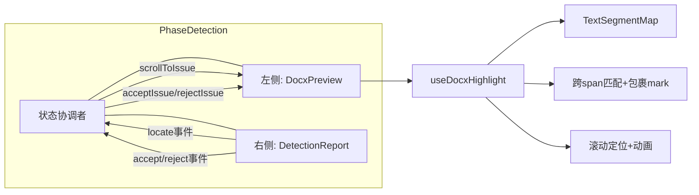

# 检测问题在文档预览中高亮显示

## Context

智能检测阶段（PhaseDetection）当前只有提交检测、进度、报告三个区域，检测报告与文档预览是分离的。用户需要在检测报告中看到问题原文后，手动对照文档找到对应位置。需求：在文档预览中直接高亮显示检测问题，点击报告中的问题项可定位到文档对应位置。

核心挑战：`docx-preview` 将 Word 渲染为 HTML DOM，同一词组可能被拆分到多个 `<span>`，需要跨 span 文本匹配。

## 整体架构



## 实施步骤

### Step 1: 新建 `useDocxHighlight.ts` 高亮引擎

**文件**: `ele-ai-tender-frontend/src/composables/useDocxHighlight.ts`

核心数据结构：

```typescript
interface TextSegment {
  node: Text          // 文本节点
  start: number       // 在拼接文本中的起始偏移
  end: number         // 在拼接文本中的结束偏移
}

interface TextSegmentMap {
  paragraphEl: HTMLElement
  fullText: string
  segments: TextSegment[]
}
```

核心方法：

| 方法 | 功能 |
|------|------|
| `buildIndex()` | 遍历容器内所有 `<p>`/`<h1>`~`<h6>`，构建段落文本索引 |
| `applyHighlights(issues)` | 为所有 handleStatus=0 的 issue 应用高亮：先搜索匹配→再从后往前包裹 `<mark>` |
| `scrollToIssue(issueKey)` | 定位 `mark[data-issue-key]` → scrollIntoView + 闪烁动画 |
| `acceptIssue(issueKey)` | 绿色闪烁 → unwrapMark |
| `rejectIssue(issueKey)` | 直接 unwrapMark |
| `updateHighlights(issues)` | 增量更新：新增高亮 / 移除已处理项 |
| `clearAll()` | 清除所有高亮 |

**跨 span 匹配算法**：
1. 遍历段落构建 `fullText = span1.text + span2.text + ...`
2. `fullText.indexOf(original)` 找到匹配位置
3. 二分查找定位受影响的 span 范围
4. 对每个受影响 span，按从后往前顺序拆分 Text 节点并包裹 `<mark>`

**空白字符处理**：构建索引时将 ` ` 归一化为空格，匹配时对 `original` 做同样处理。

### Step 2: 修改 `DocxPreview.vue` — 集成高亮引擎

**文件**: `ele-ai-tender-frontend/src/components/document/DocxPreview.vue`

修改点：
1. 新增 `issues` prop（`DetectionIssueVO[]`）
2. 新增 `rendered` 事件
3. 引入 `useDocxHighlight(containerRef)`
4. `renderAsync` 完成后 `emit('rendered')` + `applyHighlights(issues)`
5. `watch(issues)` 变化时调用 `updateHighlights`
6. `defineExpose({ scrollToIssue, acceptIssue, rejectIssue })`
7. 新增非 scoped `<style>` 块定义高亮样式

### Step 3: 高亮样式

**位置**: `DocxPreview.vue` 的非 scoped `<style>` 块

```
mark.detection-highlight  — 基础样式（圆角、内边距、cursor:help）
mark.detection-high       — 红色背景 + 红色波浪下划线（HIGH 严重度）
mark.detection-medium     — 橙色背景 + 橙色波浪下划线（MEDIUM 严重度）
mark.detection-low        — 蓝色背景 + 蓝色波浪下划线（LOW 严重度）
mark.detection-highlight-flash      — 定位闪烁动画（box-shadow 脉冲 ×3）
mark.detection-highlight-accepted   — 接受动画（绿色→透明 + 下划线消失）
```

悬浮显示 tooltip（`::after` 伪元素，`attr(data-tooltip)`）。

主题适配：docx-preview 区域始终白底，高亮色用半透明 rgba 确保 white 背景可读。tooltip 背景用 CSS 变量适配深浅主题。

### Step 4: 修改 `DetectionReport.vue` — 新增 locate 事件

**文件**: `ele-ai-tender-frontend/src/components/detection/DetectionReport.vue`

修改点：
1. 新增 `issues` prop（可选），外部传入时使用 props 数据，否则自己加载
2. 新增 `locate` 事件：`emit('locate', issue)`
3. issue-card 添加 `@click="handleIssueClick(issue)"`，仅 handleStatus=0 时触发定位
4. cursor: pointer 样式

### Step 5: 重构 `PhaseDetection.vue` — 左右分栏布局

**文件**: `ele-ai-tender-frontend/src/views/project/phases/PhaseDetection.vue`

布局变化：

```
检测前：单栏提交区域（保持不变）
检测中：单栏进度（保持不变）
检测完成：左右分栏
  ├── 左侧 (flex:3) — DocxPreview + 工具栏
  └── 右侧 (flex:2, max-width:480px) — DetectionReport
```

核心逻辑：
1. 持有 `issues: Ref<DetectionIssueVO[]>` 作为单一数据源
2. `loadProject` 中检测完成时并行加载报告 + 文档预览
3. 接受建议：`api.accept()` → 更新本地 issues → `docxPreviewRef.acceptIssue(key)` → `loadProject()` 刷新项目状态
4. 拒绝建议：`api.reject()` → 更新本地 issues → `docxPreviewRef.rejectIssue(key)`
5. 点击定位：`report@locate` → `docxPreviewRef.scrollToIssue(key)`

## 关键文件清单

| 操作 | 文件 |
|------|------|
| **新建** | `src/composables/useDocxHighlight.ts` — 高亮引擎核心 |
| **修改** | `src/components/document/DocxPreview.vue` — 集成高亮引擎 |
| **修改** | `src/components/detection/DetectionReport.vue` — 新增 locate 事件 |
| **修改** | `src/views/project/phases/PhaseDetection.vue` — 左右分栏布局 |

## 验证方案

1. 启动前端 + 后端，创建项目完成前4阶段
2. 进入智能检测 → 提交检测 → 等待完成
3. 确认左右分栏布局正常显示
4. 确认文档预览中检测问题以对应颜色高亮
5. 点击右侧报告中的问题 → 左侧滚动到对应位置并闪烁
6. 悬浮高亮文字 → 显示问题描述 tooltip
7. 点击"接受建议" → 高亮变绿闪烁 → 消失
8. 点击"拒绝建议" → 高亮直接消失
9. 处理完所有问题 → 项目自动转为 DETECTION_PASSED
10. 切换深色/浅色主题 → 确认高亮和 tooltip 样式正常
