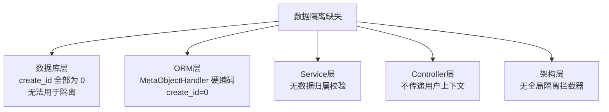
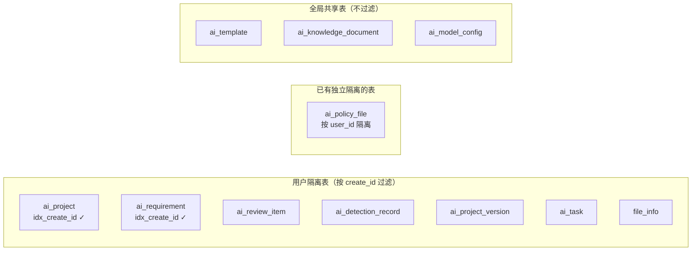
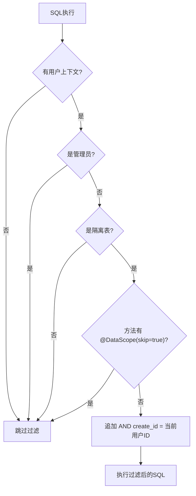
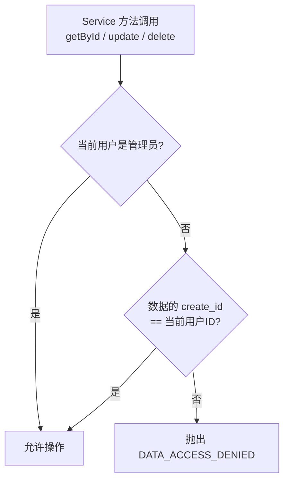

# 数据隔离实施计划

## 问题概述

招标文件AI编制系统缺少按用户维度的数据隔离，任何登录用户可以查看/修改/删除其他用户的所有业务数据。

## 根因分析



5个层面全部缺失，形成系统性安全漏洞。

## 设计决策

| 决策项 | 结论 | 原因 |
|--------|------|------|
| 隔离字段 | 直接使用 `create_id` | 所有表已有此字段 + 已有索引，无需新增字段 |
| 管理员 | 跳过隔离，可查看所有用户数据 | 统计分析、运维管理需要 |
| 模板 | 全局共享 | 用户确认 |
| 知识库 | 全局共享 | 用户确认 |
| 模型配置 | 全局共享(管理资源) | 仅管理员操作 |
| 隔离方式 | MyBatis-Plus 自定义拦截器 + Service层归属校验 | 方案A为主 + 方案B为辅 |

## 数据隔离分类



> **注意**: ai_policy_file 使用 `user_id` 隔离（已有索引 idx_user_id），不在 create_id 隔离范围内，其现有逻辑保持不变，仅补全缺失的归属校验。

## 实施步骤

### 阶段一：基础设施（4个任务）

#### 任务1：新增 DataScope 注解和工具类

**文件**: `ele-ai-tender-common/src/main/java/com/jy/eleaitender/common/datascope/`

创建数据隔离核心组件：

```
datascope/
├── DataScope.java              — 注解：标记跳过数据隔离的 Mapper 方法
├── DataScopeHelper.java        — 工具类：判断管理员、获取用户ID、归属校验
└── DataScopeTable.java         — 常量类：声明哪些表需要隔离
```

**DataScope 注解**：
```java
@Target({ElementType.METHOD, ElementType.TYPE})
@Retention(RetentionPolicy.RUNTIME)
public @interface DataScope {
    /** 是否跳过数据隔离（用于管理后台统计、跨用户匹配等场景） */
    boolean skip() default false;
}
```

**DataScopeTable 常量类**：
```java
public final class DataScopeTable {
    public static final String SCOPE_COLUMN = "create_id";

    /** 需要按 create_id 隔离的表名集合 */
    public static final Set<String> ISOLATED_TABLES = Set.of(
        "ai_project",
        "ai_requirement",
        "ai_review_item",
        "ai_detection_record",
        "ai_project_version",
        "ai_task",
        "file_info"
    );

    // ai_template, ai_knowledge_document, ai_model_config, ai_policy_file 不在此列
    // ai_policy_file 使用 user_id 隔离，不走 create_id 拦截器
}
```

**DataScopeHelper**：
```java
public class DataScopeHelper {
    /** 判断当前用户是否管理员（ADMIN角色） */
    public static boolean isAdmin();

    /** 获取当前用户ID（从 SecurityContextHolder） */
    public static Long getCurrentUserId();

    /** 判断表是否需要隔离 */
    public static boolean isDataScopeTable(String tableName);

    /** 是否跳过隔离（管理员 / 无用户上下文 / 非隔离表 / 方法标记skip） */
    public static boolean shouldSkipDataScope(String tableName, MappedStatement ms);

    /** 校验数据归属，非管理员只能操作自己的数据 */
    public static void checkOwnership(Long dataCreateId);
}
```

#### 任务2：实现 DataScopeInnerInterceptor

**文件**: `ele-ai-tender-common/src/main/java/com/jy/eleaitender/common/datascope/DataScopeInnerInterceptor.java`



核心逻辑：
- 解析 SQL 的 WHERE 子句
- 对隔离表追加 `AND create_id = #{currentUserId}` 条件
- 支持 `@DataScope(skip = true)` 跳过特定方法
- 无用户上下文时（后台任务）跳过过滤

#### 任务3：新增 DATA_ACCESS_DENIED 错误码

**文件**: `ele-ai-tender-common/src/main/java/com/jy/eleaitender/common/enums/ResponseCode.java`

```java
DATA_ACCESS_DENIED(2004, "无权访问该数据"),
```

#### 任务4：SecurityContextHolder 新增 isAdmin()

**文件**: `ele-ai-tender-common/src/main/java/com/jy/eleaitender/common/security/SecurityContextHolder.java`

```java
public static boolean isAdmin() {
    LoginUser user = getLoginUser();
    return user != null && user.getRoles() != null && user.getRoles().contains("ADMIN");
}
```

### 阶段二：修复 MetaObjectHandler（3个任务）

> 这是数据隔离的**根基**。create_id 正确填充后，拦截器才能生效。

#### 任务5：修复 core 模块的 MetaObjectHandler

**文件**: `ele-ai-tender-core/src/main/java/com/jy/eleaitender/core/handler/MetaObjectHandlerImpl.java`

```java
@Override
public void insertFill(MetaObject metaObject) {
    Date now = new Date();
    Long userId = SecurityContextHolder.getUserId();
    String userName = SecurityContextHolder.getRealName();
    if (userId == null) { userId = 0L; }
    if (userName == null) { userName = "system"; }

    this.strictInsertFill(metaObject, "createTime", Date.class, now);
    this.strictInsertFill(metaObject, "modifyTime", Date.class, now);
    this.strictInsertFill(metaObject, "ver", Integer.class, CommonConstant.DEFAULT_VERSION);
    this.strictInsertFill(metaObject, "isDelete", Integer.class, CommonConstant.NOT_DELETED);
    this.strictInsertFill(metaObject, "createId", Long.class, userId);
    this.strictInsertFill(metaObject, "createName", String.class, userName);
    this.strictInsertFill(metaObject, "modifyId", Long.class, userId);
    this.strictInsertFill(metaObject, "modifyName", String.class, userName);
}

@Override
public void updateFill(MetaObject metaObject) {
    Long userId = SecurityContextHolder.getUserId();
    String userName = SecurityContextHolder.getRealName();
    if (userId == null) { userId = 0L; }
    if (userName == null) { userName = "system"; }

    this.strictUpdateFill(metaObject, "modifyTime", Date.class, new Date());
    this.strictUpdateFill(metaObject, "modifyId", Long.class, userId);
    this.strictUpdateFill(metaObject, "modifyName", String.class, userName);
}
```

#### 任务6：修复 ai 模块的 MetaObjectHandler

**文件**: `ele-ai-tender-ai/src/main/java/com/jy/eleaitender/ai/handler/MetaObjectHandlerImpl.java`

逻辑与任务5一致。

#### 任务7：修复 file 模块的 MetaObjectHandler

**文件**: `ele-ai-tender-file/src/main/java/com/jy/eleaitender/file/config/MyBatisPlusConfig.java`

逻辑与任务5一致（file模块的 MetaObjectHandler 内联在 MyBatisPlusConfig 中）。

### 阶段三：注册拦截器（2个任务）

#### 任务8：core 模块注册 DataScopeInterceptor

**文件**: `ele-ai-tender-core/src/main/java/com/jy/eleaitender/core/config/MyBatisPlusConfig.java`

```java
@Bean
public MybatisPlusInterceptor mybatisPlusInterceptor() {
    MybatisPlusInterceptor interceptor = new MybatisPlusInterceptor();
    // 数据隔离拦截器（必须在分页拦截器之前）
    interceptor.addInnerInterceptor(new DataScopeInnerInterceptor());
    interceptor.addInnerInterceptor(new PaginationInnerInterceptor(DbType.MYSQL));
    interceptor.addInnerInterceptor(new OptimisticLockerInnerInterceptor());
    return interceptor;
}
```

#### 任务9：ai 模块注册 DataScopeInterceptor

同样修改 `ele-ai-tender-ai` 的 MyBatisPlusConfig。

> file 模块是独立文件服务，由调用方（core/ai）控制数据访问权限，不需要注册拦截器。

### 阶段四：数据库索引补全 + 测试数据修复（1个任务）

#### 任务10：编写迁移SQL

**文件**: `ele-ai-tender-system/sql/data-isolation-migration.sql`

现有索引情况：

| 表名 | idx_create_id | 需要补索引? |
|------|:---:|:---:|
| ai_project | ✓ | 否 |
| ai_requirement | ✓ | 否 |
| ai_review_item | ✗ | **是** |
| ai_detection_record | ✗ | **是** |
| ai_project_version | ✗ | **是** |
| ai_task | ✗ | **是** |
| file_info | ✗ | **是** |

迁移SQL内容：
```sql
-- 1. 补全缺失的 create_id 索引
ALTER TABLE ai_review_item ADD INDEX idx_create_id (create_id);
ALTER TABLE ai_detection_record ADD INDEX idx_create_id (create_id);
ALTER TABLE ai_project_version ADD INDEX idx_create_id (create_id);
ALTER TABLE ai_task ADD INDEX idx_create_id (create_id);
ALTER TABLE file_info ADD INDEX idx_create_id (create_id);

-- 2. 修复现有测试数据的 create_id（将 create_id=0 的数据关联到管理员用户）
-- 先查询管理员用户ID: SELECT id FROM sup_user WHERE username = 'admin';
-- UPDATE ai_project SET create_id = {adminUserId} WHERE create_id = 0;
-- UPDATE ai_requirement SET create_id = {adminUserId} WHERE create_id = 0;
-- 注意：这步需要根据实际管理员ID执行
```

### 阶段五：Service 层数据归属校验（6个任务）

对关键操作（getById/update/delete）增加归属校验，使用 `DataScopeHelper.checkOwnership()`。



#### 任务11：ProjectServiceImpl 归属校验

- `getPage`: 拦截器自动处理
- `getById`: 调用 `DataScopeHelper.checkOwnership(project.getCreateId())`
- `update/deleteByIds/changeStatus/advancePhase/cancelProject/publishProject/archiveProject`: 同上
- `create`: 通过 MetaObjectHandler 自动填充 createId

#### 任务12：RequirementServiceImpl 归属校验

同任务11模式。

#### 任务13：ReviewItemServiceImpl 归属校验

评审项通过 projectId 关联项目，校验项目的 createId：
```java
public List<AiReviewItem> getByProjectId(Long projectId) {
    AiProject project = projectService.getById(projectId); // 内部已做归属校验
    return reviewItemMapper.selectByProjectId(projectId);
}
```

#### 任务14：DetectionServiceImpl 归属校验

检测记录通过 projectId 关联项目，校验项目的 createId。

#### 任务15：ProjectVersionServiceImpl 归属校验

版本通过 projectId 关联项目，校验项目的 createId。

#### 任务16：PolicyFileServiceImpl 补全归属校验

- `getById`: 补充用户校验
- `setStatus`: 补充归属校验
- 此表用 `user_id` 隔离，不走拦截器，需手动校验

### 阶段六：FileController 安全加固（2个任务）

#### 任务17：FileController 添加 @RequireLogin

**文件**: `ele-ai-tender-file/src/main/java/com/jy/eleaitender/file/controller/FileController.java`

- 所有方法添加 `@RequireLogin` 注解
- 确认 file 模块配置了 JwtAuthenticationFilter

#### 任务18：FileService 添加用户隔离

- 上传时 createId 通过 MetaObjectHandler 自动填充
- 下载/查看/删除时校验 `fileInfo.getCreateId()` 归属

### 阶段七：修复跨用户查询（1个任务）

#### 任务19：修复 AiRequirementMatchMapper 跨用户查询

**文件**: `ele-ai-tender-ai/src/main/java/com/jy/eleaitender/ai/mapper/AiRequirementMatchMapper.java`

- `selectCandidateRequirements` 方法添加 `@DataScope(skip = true)` 注解
- 需求匹配是全局行为（匹配所有用户的需求模板），不应受数据隔离限制

### 阶段八：前端适配（1个任务）

#### 任务20：前端列表接口适配

- 项目列表：后端已自动按 create_id 过滤，前端无需改动
- 统计页面：管理员看全局，普通用户看自己的（后端调整 StatisticsServiceImpl）

## 实施优先级

```mermaid
gantt
    title 数据隔离实施甘特图
    dateFormat X
    axisFormat %s

    section 基础设施
    任务1-4: 注解/拦截器/错误码/工具类     :1, 4

    section MetaObjectHandler
    任务5-7: 修复三个模块的Handler          :5, 7

    section 拦截器注册
    任务8-9: 注册拦截器                     :8, 9

    section 数据库
    任务10: 索引补全+数据修复               :10, 10

    section Service校验
    任务11-16: 归属校验                     :11, 16

    section 文件安全
    任务17-18: FileController加固           :17, 18

    section 跨用户修复
    任务19: Mapper修复                      :19, 19

    section 前端适配
    任务20: 前端适配                        :20, 20
```

## 关键技术点

### 1. DataScopeInnerInterceptor 核心逻辑

```java
public class DataScopeInnerInterceptor extends JsqlParserSupport implements InnerInterceptor {

    @Override
    public void beforeQuery(Executor executor, MappedStatement ms,
                           Object parameter, RowBounds rowBounds,
                           ResultHandler resultHandler, BoundSql boundSql) {
        if (DataScopeHelper.shouldSkipDataScope(ms)) {
            return;
        }
        PluginUtils.MPBoundSql mpBs = PluginUtils.mpBoundSql(boundSql);
        mpBs.sql(parserSingle(mpBs.sql(), null));
    }

    @Override
    protected void processSelect(Select select, int index, String sql, Object obj) {
        SelectBody selectBody = select.getSelectBody();
        if (selectBody instanceof PlainSelect) {
            processPlainSelect((PlainSelect) selectBody);
        }
    }

    private void processPlainSelect(PlainSelect plainSelect) {
        FromItem fromItem = plainSelect.getFromItem();
        if (fromItem instanceof Table) {
            Table table = (Table) fromItem;
            String tableName = table.getName();
            if (DataScopeTable.ISOLATED_TABLES.contains(tableName)) {
                Long userId = DataScopeHelper.getCurrentUserId();
                EqualsTo equalsTo = new EqualsTo();
                equalsTo.setLeftExpression(new Column(DataScopeTable.SCOPE_COLUMN));
                equalsTo.setRightExpression(new LongValue(userId));
                Expression where = plainSelect.getWhere();
                plainSelect.setWhere(where != null
                    ? new AndExpression(where, equalsTo)
                    : equalsTo);
            }
        }
    }
}
```

### 2. 归属校验工具方法

```java
public static void checkOwnership(Long dataCreateId) {
    if (isAdmin()) return;
    Long currentUserId = getCurrentUserId();
    if (currentUserId == null || !currentUserId.equals(dataCreateId)) {
        throw new BusinessException(ResponseCode.DATA_ACCESS_DENIED);
    }
}
```

### 3. 子表归属校验模式

```java
// ReviewItemServiceImpl 示例
public List<AiReviewItem> getByProjectId(Long projectId) {
    // 先校验项目归属（getById 内部调用了 checkOwnership）
    AiProject project = projectService.getById(projectId);
    return reviewItemMapper.selectByProjectId(projectId);
}
```

## 风险点

| 风险 | 应对策略 |
|------|---------|
| 后台异步任务无用户上下文 | 拦截器在无用户上下文时跳过过滤，异步任务通过ID精确查询 |
| 服务间调用无用户上下文 | JWT Token 在服务间转发，SecurityContextHolder 有用户信息 |
| 现有测试数据 create_id = 0 | 迁移SQL将 create_id=0 的数据关联到管理员用户ID |
| SQL 解析复杂性（子查询、JOIN） | 拦截器只处理主表简单查询，复杂查询用 @DataScope(skip=true) 跳过 |
| 性能影响 | WHERE create_id = ? 走索引，性能影响极小 |
| ai_policy_file 使用 user_id 而非 create_id | 不走拦截器，保持现有手动隔离逻辑，仅补全缺失的校验 |
