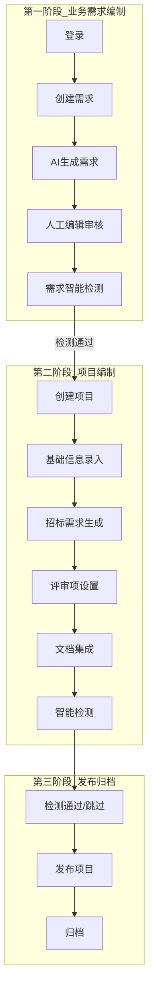
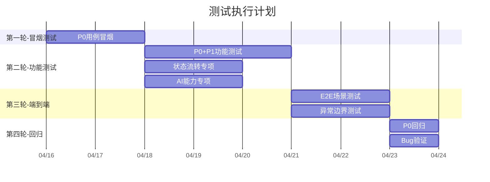

# 招标文件AI编制系统 — 全流程测试计划

> 覆盖范围：从业务需求编制到项目招标文件编制完成的全流程
> 编写日期：2026-04-15
> 依据文档：需求文档V1.0、原型设计索引、API接口文档（4份OpenAPI YAML）、系统规范

---

## 一、测试范围与目标

### 1.1 测试目标

验证从「业务需求编制」到「项目招标文件编制完成」的端到端全流程，确保：

- **正向主流程**：每个环节功能可用、数据流转正确、状态推进合法
- **AI能力集成**：SSE流式响应、异步任务、模型路由、降级机制正常工作
- **异常与边界**：非法输入、网络中断、AI不可用等场景有合理兜底
- **数据一致性**：跨模块调用（core ↔ ai ↔ file ↔ support）数据不丢失、不冲突

### 1.2 测试范围总览



### 1.3 不在测试范围

| 排除项 | 原因 |
|--------|------|
| 统计分析模块 | 首版排除，前端对齐计划明确排除 |
| 系统设置（支撑中心管理后台） | 属于支撑中心范畴，非编制主流程 |
| 知识库向量化/Milvus/Tika | 阶段三明确排除 |
| 交互集成Starter | 第三方接入，非本系统主流程 |

---

## 二、测试环境

### 2.1 环境配置

| 组件 | 地址 | 说明 |
|------|------|------|
| AI编制前端 | localhost:5173 | Vue 3 + Vite dev |
| 支撑中心前端 | localhost:5174 | 管理后台 |
| 支撑中心(support) | localhost:8080 | 认证/用户/模型配置 |
| 文件服务(file) | localhost:8081 | 文件上传下载 |
| 核心业务(core) | localhost:8082 | 项目/需求/检测/文档 |
| AI服务(ai) | localhost:8083 | 对话/检测/匹配 |
| MySQL | 10.11.20.50:15005 | db=6 |
| Redis | 10.11.20.50:16879 | db=6 |

### 2.2 测试账号

| 角色 | 账号 | 用途 |
|------|------|------|
| 管理员 | admin / admin123 | 全功能测试 |
| 普通用户 | 需创建 | 权限边界测试 |

### 2.3 AI服务前置条件

- 至少配置一个可用的LOCAL模型（用于生成类任务）
- 至少配置一个可用的CLOUD模型（用于优化/检测类任务）
- 模型路由规则已配置 GENERATION/OPTIMIZATION/DETECTION 三场景
- 确认AI API Key有效且Token额度充足

---

## 三、全流程测试用例

### 3.1 登录模块（1个场景，5条用例）

> 涉及页面：login.html → support模块

| 用例ID | 用例名称 | 操作步骤 | 预期结果 | 优先级 |
|--------|----------|----------|----------|--------|
| T-LOGIN-001 | 账号密码登录-正常 | 输入admin/admin123，点击登录 | 跳转到业务需求列表页，localStorage存储token | P0 |
| T-LOGIN-002 | 手机验证码登录-正常 | 输入手机号 → 获取验证码 → 输入验证码 → 登录 | 跳转到业务需求列表页 | P0 |
| T-LOGIN-003 | 登录失败-密码错误 | 输入admin/错误密码，点击登录 | 提示"用户名或密码错误"，不跳转 | P1 |
| T-LOGIN-004 | 登录状态保持 | 登录成功后刷新页面 | 自动识别登录状态，不跳回登录页 | P1 |
| T-LOGIN-005 | 登出 | 点击登出 | 清除token，跳转到登录页 | P1 |

---

### 3.2 业务需求编制模块（5个场景，22条用例）

> 涉及页面：business-requirement-list/create/edit/generate/review.html
> 涉及后端：core模块(RequirementController) + ai模块(AiChatController/DocumentMatchController/DetectionController)

#### 场景A：业务需求列表

| 用例ID | 用例名称 | 操作步骤 | 预期结果 | 优先级 |
|--------|----------|----------|----------|--------|
| T-REQ-LIST-001 | 查看需求列表 | 登录后进入业务需求列表 | 显示需求列表，含需求名称/项目类别/项目类型/状态/进度/创建时间 | P0 |
| T-REQ-LIST-002 | 按名称搜索 | 输入关键词搜索 | 列表仅显示匹配的需求 | P1 |
| T-REQ-LIST-003 | 按状态筛选 | 选择"草稿"状态 | 列表仅显示草稿状态的需求 | P1 |
| T-REQ-LIST-004 | 按项目类型筛选 | 选择"工程"类型 | 列表仅显示工程类型的需求 | P1 |
| T-REQ-LIST-005 | 删除需求 | 点击某条草稿需求的删除按钮 | 二次确认后删除，列表刷新 | P1 |

#### 场景B：创建业务需求

| 用例ID | 用例名称 | 操作步骤 | 预期结果 | 优先级 |
|--------|----------|----------|----------|--------|
| T-REQ-CREATE-001 | 创建需求-自动匹配模式 | 填写需求名称/项目类别/项目类型 → 选择"自动匹配" → 提交 | 创建成功，状态为DRAFT，跳转到生成页 | P0 |
| T-REQ-CREATE-002 | 创建需求-手动选择模式 | 选择"手动选择" → 系统返回候选列表 → 选择一个 → 提交 | 创建成功，matchedFileId有值 | P0 |
| T-REQ-CREATE-003 | 创建需求-上传文件模式 | 选择"上传文件" → 上传docx文件(≤50MB) → 提交 | 文件上传成功，需求创建成功 | P0 |
| T-REQ-CREATE-004 | 上传文件-格式校验 | 上传.exe文件 | 提示"仅支持doc/docx/pdf格式" | P1 |
| T-REQ-CREATE-005 | 上传文件-大小校验 | 上传60MB文件 | 提示"文件大小不能超过50MB" | P1 |
| T-REQ-CREATE-006 | 必填项校验 | 不填需求名称直接提交 | 提示"请输入需求名称" | P1 |

#### 场景C：AI生成业务需求

| 用例ID | 用例名称 | 操作步骤 | 预期结果 | 优先级 |
|--------|----------|----------|----------|--------|
| T-REQ-GEN-001 | AI生成需求-正常 | 点击"AI生成" | SSE流式输出Markdown内容，进度条实时更新 | P0 |
| T-REQ-GEN-002 | AI生成-人工编辑 | 生成完成后在编辑器中修改内容 | 内容可编辑，修改可保存 | P0 |
| T-REQ-GEN-003 | AI生成-自动保存 | 等待2分钟不操作 | 自动保存触发，提示"已自动保存" | P1 |
| T-REQ-GEN-004 | AI对话-辅助生成 | 在AI对话面板输入"请优化第二段" | AI返回优化建议，SSE流式输出 | P0 |
| T-REQ-GEN-005 | AI文本优化 | 选中一段文本 → 点击"AI优化" | 优化内容SSE流式返回，可接受或拒绝 | P0 |
| T-REQ-GEN-006 | 提交审核 | 编辑完成后点击"提交审核" | 需求状态变为PENDING_REVIEW | P0 |

#### 场景D：业务需求智能检测

| 用例ID | 用例名称 | 操作步骤 | 预期结果 | 优先级 |
|--------|----------|----------|----------|--------|
| T-REQ-DET-001 | 提交需求检测 | 在需求编辑页点击"提交检测" | 创建2项检测任务（敏感词+错别字），任务状态为PENDING | P0 |
| T-REQ-DET-002 | 查看检测进度 | 轮询任务状态 | 敏感词和错别字检测任务逐步完成 | P1 |
| T-REQ-DET-003 | 查看检测结果 | 检测完成后查看 | 显示检测问题列表，含位置/描述/建议/严重度 | P1 |

#### 场景E：需求到项目的衔接

| 用例ID | 用例名称 | 操作步骤 | 预期结果 | 优先级 |
|--------|----------|----------|----------|--------|
| T-REQ-PROJ-001 | 从需求创建项目 | 需求审核通过后点击"创建项目" | 自动创建项目，需求内容关联到项目，项目状态为DRAFT | P0 |
| T-REQ-PROJ-002 | 直接创建项目（不经过需求） | 从项目列表直接新建 | 创建成功，项目状态为DRAFT，无关联需求 | P1 |

---

### 3.3 项目编制模块（6个场景，30条用例）

> 涉及页面：project-list/create/detail/wizard及phases子组件
> 涉及后端：core模块(ProjectController/ReviewItemController/DocumentIntegrationController/DetectionController/AiTaskController)

#### 场景A：项目创建与基础信息

| 用例ID | 用例名称 | 操作步骤 | 预期结果 | 优先级 |
|--------|----------|----------|----------|--------|
| T-PROJ-CREATE-001 | 创建项目-完整信息 | 填写项目名称/类别/类型/预算/评审方式 → 提交 | 创建成功，状态DRAFT，阶段BASIC_INFO(20%) | P0 |
| T-PROJ-CREATE-002 | 项目类别-限额以下 | 选择"限额以下" | 表单适配，无服务子类型字段 | P1 |
| T-PROJ-CREATE-003 | 项目类别-政府采购+服务类型 | 选择"政府采购"+"服务" | 显示服务子类型下拉框 | P1 |
| T-PROJ-CREATE-004 | 必填项校验 | 不填项目名称提交 | 提示"请输入项目名称" | P1 |
| T-PROJ-PHASE-001 | 推进阶段-基础信息到需求生成 | 完成基础信息填写 → 推进阶段 | 阶段变为REQUIREMENT(40%)，项目状态变为IN_PROGRESS | P0 |

#### 场景B：招标需求生成

| 用例ID | 用例名称 | 操作步骤 | 预期结果 | 优先级 |
|--------|----------|----------|----------|--------|
| T-PROJ-REQ-001 | AI生成招标需求 | 点击"AI生成" | 创建REQUIREMENT_GENERATE任务，任务状态PENDING→PROCESSING→COMPLETED | P0 |
| T-PROJ-REQ-002 | AI生成-任务轮询 | 等待AI生成完成 | 轮询间隔3秒，生成完成后停止轮询，内容渲染到编辑器 | P0 |
| T-PROJ-REQ-003 | AI生成-AI不可用 | 断开AI服务后点击"AI生成" | 任务状态变为AI_UNAVAILABLE，显示告警"AI服务暂不可用"，提供"手动输入"按钮 | P0 |
| T-PROJ-REQ-004 | AI生成-重试 | AI不可用后恢复服务 → 点击"重试" | 任务重新执行，状态变为PROCESSING→COMPLETED | P1 |
| T-PROJ-REQ-005 | AI生成-跳过 | AI不可用时点击"跳过" | 任务状态变为SKIPPED，降级为手动输入模式 | P1 |
| T-PROJ-REQ-006 | 自动保存 | 编辑需求内容后等待2分钟 | 自动保存触发 | P1 |
| T-PROJ-REQ-007 | 草稿恢复 | 刷新页面后返回编辑页 | 提示"检测到自动保存的草稿，是否恢复？" | P1 |
| T-PROJ-PHASE-002 | 推进阶段-需求到评审项 | 完成需求编辑 → 推进阶段 | 阶段变为REVIEW_ITEM(60%) | P0 |

#### 场景C：评审项设置

| 用例ID | 用例名称 | 操作步骤 | 预期结果 | 优先级 |
|--------|----------|----------|----------|--------|
| T-PROJ-REV-001 | AI生成评审项 | 点击"AI生成评审项" | 创建REVIEW_ITEM_GENERATE任务，生成三级评审项树 | P0 |
| T-PROJ-REV-002 | 手动添加评审项 | 点击"添加根项" → 输入名称/内容 → 保存 | 评审项树新增一条level=1的根项 | P0 |
| T-PROJ-REV-003 | 编辑评审项 | 修改某条评审项的内容 | 修改成功，树结构刷新 | P1 |
| T-PROJ-REV-004 | 删除评审项-有子项 | 删除有子项的评审项 | 提示"存在子项，不可删除" | P1 |
| T-PROJ-REV-005 | 删除评审项-叶子节点 | 删除无子项的评审项 | 删除成功，树结构刷新 | P1 |
| T-PROJ-REV-006 | 评审项三级结构验证 | AI生成后检查评审项树 | 存在level=1/2/三级结构，parent_id关系正确 | P0 |
| T-PROJ-PHASE-003 | 推进阶段-评审项到文档集成 | 完成评审项设置 → 推进阶段 | 阶段变为DOCUMENT(80%) | P0 |

#### 场景D：文档集成

| 用例ID | 用例名称 | 操作步骤 | 预期结果 | 优先级 |
|--------|----------|----------|----------|--------|
| T-PROJ-DOC-001 | 执行文档集成 | 点击"执行集成" | 将需求内容+评审项按模板结构组装为完整文档 | P0 |
| T-PROJ-DOC-002 | 文档预览-HTML | 集成完成后切换到"预览"Tab | HTML格式渲染完整招标文件 | P0 |
| T-PROJ-DOC-003 | 文档编辑-Markdown | 切换到"编辑"Tab | 显示Markdown源码，可编辑修改 | P1 |
| T-PROJ-DOC-004 | 导出Word | 点击"导出Word" | 下载.docx文件，内容与预览一致 | P0 |
| T-PROJ-DOC-005 | 政策文件匹配 | 在集成页面查看政策文件推荐 | 列出匹配的政策文件，来源区分SYSTEM/USER | P1 |
| T-PROJ-DOC-006 | 编辑文档内容 | 修改Markdown内容 → 保存 | 修改后内容可重新预览和导出 | P1 |
| T-PROJ-PHASE-004 | 推进阶段-文档集成到检测 | 完成文档集成 → 推进阶段 | 阶段变为DETECTION(100%)，项目状态变为PENDING_DETECTION | P0 |

#### 场景E：智能检测

| 用例ID | 用例名称 | 操作步骤 | 预期结果 | 优先级 |
|--------|----------|----------|----------|--------|
| T-PROJ-DET-001 | 提交检测-全类型 | 选择政策文件 → 点击"提交检测" | 项目状态PENDING_DETECTION→DETECTING，创建4项检测任务（敏感词/错别字/政策审查/格式检查） | P0 |
| T-PROJ-DET-002 | 检测进度-轮询 | 等待检测完成 | 4项检测逐项完成，进度条实时更新 | P0 |
| T-PROJ-DET-003 | 检测通过 | 4项检测均无问题 | 项目状态变为DETECTION_PASSED，可发布 | P0 |
| T-PROJ-DET-004 | 检测失败-有问题 | 检测发现问题 | 项目状态变为DETECTION_FAILED，显示问题列表 | P0 |
| T-PROJ-DET-005 | 接受建议 | 检测报告中点击某条"接受建议" | 建议被采纳，内容自动修改，handleStatus变为ACCEPTED | P0 |
| T-PROJ-DET-006 | 拒绝建议 | 检测报告中点击某条"拒绝建议" | 建议被拒绝，handleStatus变为REJECTED | P1 |
| T-PROJ-DET-007 | 一键接受所有 | 点击"一键接受所有建议" | 所有建议被采纳，项目状态可推进 | P0 |
| T-PROJ-DET-008 | 跳过检测 | 点击"跳过检测" | 项目状态变为DETECTION_SKIPPED，发送警告通知到消息中心 | P0 |
| T-PROJ-DET-009 | 重新检测 | 修改后点击"重新检测" | 项目状态回到DETECTING，重新创建4项检测任务 | P1 |
| T-PROJ-DET-010 | 选择政策文件 | 检测前选择关联的政策文件 | 政策审查检测基于选中文件执行 | P1 |

#### 场景F：项目列表与详情

| 用例ID | 用例名称 | 操作步骤 | 预期结果 | 优先级 |
|--------|----------|----------|----------|--------|
| T-PROJ-LIST-001 | 项目列表-查看 | 进入项目列表 | 显示项目列表，含项目编号/名称/类别/类型/状态/进度 | P0 |
| T-PROJ-LIST-002 | 按状态筛选 | 选择"编制中" | 列表仅显示IN_PROGRESS状态的项目 | P1 |
| T-PROJ-LIST-003 | 批量删除 | 勾选多个DRAFT项目 → 批量删除 | 二次确认后删除 | P1 |
| T-PROJ-DETAIL-001 | 项目详情-基本信息Tab | 点击项目名称 → 基本信息 | 显示项目完整信息，含进度条 | P0 |
| T-PROJ-DETAIL-002 | 项目详情-版本历史 | 切换到版本管理Tab | 显示版本列表，含版本号/变更描述/时间 | P1 |

---

### 3.4 发布与归档模块（3条用例）

> 涉及后端：core模块(ProjectController)

| 用例ID | 用例名称 | 操作步骤 | 预期结果 | 优先级 |
|--------|----------|----------|----------|--------|
| T-PUB-001 | 发布项目-检测通过后 | 检测通过 → 点击"发布" | 项目状态DETECTION_PASSED→PUBLISHED，生成版本快照 | P0 |
| T-PUB-002 | 发布项目-跳过检测后 | 跳过检测 → 点击"发布" | 项目状态DETECTION_SKIPPED→PUBLISHED，消息中心有警告通知 | P0 |
| T-PUB-003 | 归档项目 | 发布后点击"归档" | 项目状态PUBLISHED→ARCHIVED（终态） | P1 |

---

### 3.5 模板管理模块（4条用例）

> 涉及后端：core模块(TemplateController) + support模块(TemplateConfigController)

| 用例ID | 用例名称 | 操作步骤 | 预期结果 | 优先级 |
|--------|----------|----------|----------|--------|
| T-TPL-001 | 获取默认模板 | 创建项目时自动获取默认模板 | 根据项目类别+类型返回对应的默认模板 | P0 |
| T-TPL-002 | 模板列表查询 | 查看模板列表 | 显示模板列表，含模板编码/名称/类别/类型/版本/默认标识 | P1 |
| T-TPL-003 | 模板详情 | 点击模板名称 | 显示模板详情，含基本信息/模板预览/变量列表 | P1 |
| T-TPL-004 | 模板内容验证 | 查看模板Markdown内容 | 包含正确的变量占位符，如`{{projectName}}`、`{{budget}}` | P1 |

---

### 3.6 政策文件管理模块（4条用例）

> 涉及后端：core模块(PolicyFileController) + file模块(FileController)

| 用例ID | 用例名称 | 操作步骤 | 预期结果 | 优先级 |
|--------|----------|----------|----------|--------|
| T-POL-001 | 上传政策文件 | 上传PDF政策文件 → 填写分类信息 | 文件上传成功，政策文件记录创建成功 | P0 |
| T-POL-002 | 启用/禁用政策文件 | 点击"禁用" | 政策文件状态变为DISABLED，检测时不可选 | P1 |
| T-POL-003 | 删除用户上传的政策文件 | 删除自己上传的政策文件 | 删除成功 | P1 |
| T-POL-004 | 系统级政策文件不可删除 | 尝试删除来源为SYSTEM的政策文件 | 删除按钮不可点击或提示"系统文件不可删除" | P1 |

---

### 3.7 消息中心模块（3条用例）

> 涉及后端：core模块(UserMessageController)

| 用例ID | 用例名称 | 操作步骤 | 预期结果 | 优先级 |
|--------|----------|----------|----------|--------|
| T-MSG-001 | 检测通知 | 提交检测后等待完成 | 消息中心收到检测完成通知 | P1 |
| T-MSG-002 | 标记已读 | 点击某条消息的"标记已读" | 消息已读状态变更，未读数-1 | P2 |
| T-MSG-003 | 全部已读 | 点击"全部标记已读" | 所有消息变为已读，未读数归零 | P2 |

---

## 四、状态流转专项测试

### 4.1 项目状态流转

```mermaid
stateDiagram-v2
    [*] --> DRAFT: T-STATE-001 创建项目
    DRAFT --> IN_PROGRESS: T-STATE-002 开始编制
    IN_PROGRESS --> PENDING_DETECTION: T-STATE-003 提交检测
    PENDING_DETECTION --> DETECTING: T-STATE-004 开始检测
    DETECTING --> DETECTION_PASSED: T-STATE-005 检测通过
    DETECTING --> DETECTION_FAILED: T-STATE-006 检测失败
    DETECTION_FAILED --> IN_PROGRESS: T-STATE-007 返回修改
    DETECTION_PASSED --> PUBLISHED: T-STATE-008 发布
    PUBLISHED --> ARCHIVED: T-STATE-009 归档
    DRAFT --> CANCELLED: T-STATE-010 取消
    IN_PROGRESS --> CANCELLED: T-STATE-011 取消

    note right of DETECTION_SKIPPED
        T-STATE-012 跳过检测
    end note

    DETECTING --> DETECTION_SKIPPED: 跳过
    DETECTION_SKIPPED --> PUBLISHED: T-STATE-013 跳过后发布
```

| 用例ID | 用例名称 | 前置状态 | 操作 | 预期状态 | 优先级 |
|--------|----------|----------|------|----------|--------|
| T-STATE-001 | 创建项目→DRAFT | — | 创建项目 | DRAFT | P0 |
| T-STATE-002 | DRAFT→IN_PROGRESS | DRAFT | 推进阶段到REQUIREMENT | IN_PROGRESS | P0 |
| T-STATE-003 | IN_PROGRESS→PENDING_DETECTION | IN_PROGRESS | 提交检测 | PENDING_DETECTION | P0 |
| T-STATE-004 | PENDING_DETECTION→DETECTING | PENDING_DETECTION | 自动进入检测 | DETECTING | P0 |
| T-STATE-005 | DETECTING→DETECTION_PASSED | DETECTING | 检测全部通过 | DETECTION_PASSED | P0 |
| T-STATE-006 | DETECTING→DETECTION_FAILED | DETECTING | 检测发现问题 | DETECTION_FAILED | P0 |
| T-STATE-007 | DETECTION_FAILED→IN_PROGRESS | DETECTION_FAILED | 返回修改 | IN_PROGRESS | P0 |
| T-STATE-008 | DETECTION_PASSED→PUBLISHED | DETECTION_PASSED | 发布 | PUBLISHED | P0 |
| T-STATE-009 | PUBLISHED→ARCHIVED | PUBLISHED | 归档 | ARCHIVED | P1 |
| T-STATE-010 | DRAFT→CANCELLED | DRAFT | 取消 | CANCELLED | P1 |
| T-STATE-011 | IN_PROGRESS→CANCELLED | IN_PROGRESS | 取消 | CANCELLED | P1 |
| T-STATE-012 | 跳过检测→DETECTION_SKIPPED | DETECTING | 跳过 | DETECTION_SKIPPED | P0 |
| T-STATE-013 | DETECTION_SKIPPED→PUBLISHED | DETECTION_SKIPPED | 跳过后发布 | PUBLISHED | P0 |

### 4.2 非法状态流转

| 用例ID | 非法操作 | 预期结果 | 优先级 |
|--------|----------|----------|--------|
| T-STATE-ERR-001 | DRAFT直接→PUBLISHED | 拒绝，提示"当前状态不允许此操作" | P0 |
| T-STATE-ERR-002 | DRAFT直接→DETECTING | 拒绝，提示状态不合法 | P0 |
| T-STATE-ERR-003 | ARCHIVED→任何状态 | 拒绝，终态不可变更 | P0 |
| T-STATE-ERR-004 | CANCELLED→任何状态 | 拒绝，终态不可变更 | P0 |
| T-STATE-ERR-005 | PUBLISHED→IN_PROGRESS | 拒绝，不可回退 | P1 |

### 4.3 项目阶段推进

| 用例ID | 阶段推进 | 预期进度 | 优先级 |
|--------|----------|----------|--------|
| T-PHASE-001 | 创建项目 | BASIC_INFO(20%) | P0 |
| T-PHASE-002 | →REQUIREMENT | 40% | P0 |
| T-PHASE-003 | →REVIEW_ITEM | 60% | P0 |
| T-PHASE-004 | →DOCUMENT | 80% | P0 |
| T-PHASE-005 | →DETECTION | 100% | P0 |

---

## 五、AI能力专项测试

### 5.1 SSE流式响应

| 用例ID | 用例名称 | 操作步骤 | 预期结果 | 优先级 |
|--------|----------|----------|----------|--------|
| T-SSE-001 | AI对话-正常流式输出 | 发送"请帮我优化这段需求描述" | SSE逐字输出，前端实时渲染Markdown | P0 |
| T-SSE-002 | AI文本优化-流式 | 选中一段文本点击"AI优化" | 优化建议逐字输出 | P0 |
| T-SSE-003 | SSE-客户端断开 | 生成过程中关闭浏览器标签 | 后端检测到连接断开，释放资源 | P1 |
| T-SSE-004 | SSE-超时处理 | 发送超长请求等待60秒+ | 后端设置合理超时，超时后正常关闭连接 | P1 |

### 5.2 AI任务队列

| 用例ID | 用例名称 | 操作步骤 | 预期结果 | 优先级 |
|--------|----------|----------|----------|--------|
| T-TASK-001 | 任务创建→PENDING | 提交AI生成任务 | 任务记录创建，状态PENDING | P0 |
| T-TASK-002 | 任务执行→PROCESSING→COMPLETED | AI服务可用时 | 任务状态流转PENDING→PROCESSING→COMPLETED | P0 |
| T-TASK-003 | 任务失败→FAILED | AI服务异常时 | 任务状态变为FAILED，记录errorMsg | P0 |
| T-TASK-004 | AI不可用→AI_UNAVAILABLE | AI服务完全不可用时 | 任务状态变为AI_UNAVAILABLE | P0 |
| T-TASK-005 | 重试FAILED任务 | 点击"重试" | 重新执行任务，retryCount+1 | P1 |
| T-TASK-006 | 跳过任务 | 点击"跳过" | 任务状态变为SKIPPED，降级手动模式 | P1 |
| T-TASK-007 | 超时任务自动标记 | 任务执行超过配置的超时时间 | 自动标记为AI_UNAVAILABLE | P1 |
| T-TASK-008 | 最大重试次数限制 | 连续重试超过maxRetry次 | 不允许继续重试 | P2 |

### 5.3 模型路由

| 用例ID | 用例名称 | 操作步骤 | 预期结果 | 优先级 |
|--------|----------|----------|----------|--------|
| T-ROUTE-001 | 生成类任务→本地模型 | 提交需求生成任务 | ModelRouter路由到LOCAL类型模型 | P0 |
| T-ROUTE-002 | 优化类任务→云端模型 | 提交文本优化任务 | ModelRouter路由到CLOUD类型模型 | P0 |
| T-ROUTE-003 | 检测类任务→云端模型 | 提交检测任务 | ModelRouter路由到CLOUD类型模型 | P0 |
| T-ROUTE-004 | 优先模型不可用→降级 | 优先模型配置失效 | 自动降级到备用模型 | P0 |

### 5.4 文档匹配

| 用例ID | 用例名称 | 操作步骤 | 预期结果 | 优先级 |
|--------|----------|----------|----------|--------|
| T-MATCH-001 | 自动匹配-正常 | 提交需求信息 → 调用自动匹配 | 返回Top5相似需求，含相似度评分 | P0 |
| T-MATCH-002 | 手动选择-搜索关键词 | 输入关键词 → 手动匹配 | 返回匹配候选列表 | P1 |
| T-MATCH-003 | 匹配评分验证 | 对比自动匹配结果 | 评分维度合理：类型40%+类别20%+预算20%+关键词20% | P1 |

---

## 六、端到端全流程场景测试

### 场景E2E-001：完整正向流程（AI可用）

```
登录 → 创建需求 → AI生成需求 → 人工审核 → 需求检测 → 创建项目 →
基础信息 → AI生成招标需求 → AI生成评审项 → 文档集成 →
导出Word → 提交检测(4项) → 检测通过 → 发布 → 归档
```

| 步骤 | 操作 | 验证点 |
|------|------|--------|
| 1 | 账号密码登录 | token存储，跳转需求列表 |
| 2 | 创建需求（自动匹配，政府采购+服务） | 需求创建成功，状态DRAFT |
| 3 | AI生成需求内容 | SSE流式输出，内容为Markdown |
| 4 | 人工编辑审核 | 修改内容，点击提交审核，状态→PENDING_REVIEW |
| 5 | 提交需求检测 | 创建2项检测任务（敏感词+错别字） |
| 6 | 检测通过 | 需求状态更新 |
| 7 | 从需求创建项目 | 项目创建，关联需求ID，状态DRAFT |
| 8 | 录入基础信息并推进 | 阶段→REQUIREMENT(40%)，状态→IN_PROGRESS |
| 9 | AI生成招标需求 | REQUIREMENT_GENERATE任务完成 |
| 10 | 推进到评审项 | 阶段→REVIEW_ITEM(60%) |
| 11 | AI生成评审项 | REVIEW_ITEM_GENERATE任务完成，三级结构 |
| 12 | 推进到文档集成 | 阶段→DOCUMENT(80%) |
| 13 | 执行文档集成 | HTML预览正常，Markdown可编辑 |
| 14 | 导出Word | 下载.docx文件 |
| 15 | 推进到检测 | 阶段→DETECTION(100%)，状态→PENDING_DETECTION |
| 16 | 提交4项检测 | 4项检测任务创建，状态→DETECTING |
| 17 | 检测通过 | 状态→DETECTION_PASSED |
| 18 | 发布 | 状态→PUBLISHED，版本快照生成 |
| 19 | 归档 | 状态→ARCHIVED（终态） |

### 场景E2E-002：AI不可用降级流程

```
登录 → 创建项目 → AI不可用 → 跳过AI生成 → 手动输入 →
跳过检测 → 发布（含警告） → 归档
```

| 步骤 | 操作 | 验证点 |
|------|------|--------|
| 1 | 登录 | 正常 |
| 2 | 创建项目 | 状态DRAFT |
| 3 | 推进到需求生成阶段 | 阶段REQUIREMENT |
| 4 | AI生成失败 | 任务状态→AI_UNAVAILABLE |
| 5 | 跳过AI任务 | 降级为手动输入，任务状态→SKIPPED |
| 6 | 手动输入需求内容 | 内容保存成功 |
| 7 | 手动添加评审项 | 评审项树结构正确 |
| 8 | 文档集成 → 导出 | 正常 |
| 9 | 跳过检测 | 状态→DETECTION_SKIPPED，消息中心收到警告 |
| 10 | 发布 | 状态→PUBLISHED |
| 11 | 归档 | 状态→ARCHIVED |

### 场景E2E-003：检测失败→修改→重新检测→通过

```
... → 提交检测 → 检测失败 → 返回修改 → 重新检测 → 检测通过 → 发布
```

| 步骤 | 操作 | 验证点 |
|------|------|--------|
| 1 | 执行到检测步骤 | 状态DETECTING |
| 2 | 检测发现问题 | 状态→DETECTION_FAILED |
| 3 | 查看检测报告 | 显示问题列表（HIGH/MEDIUM/LOW） |
| 4 | 接受部分建议 | handleStatus→ACCEPTED，内容自动修改 |
| 5 | 拒绝部分建议 | handleStatus→REJECTED |
| 6 | 返回修改 | 状态→IN_PROGRESS |
| 7 | 修改需求内容 | 修改保存成功 |
| 8 | 重新提交检测 | 状态→DETECTING |
| 9 | 检测通过 | 状态→DETECTION_PASSED |
| 10 | 发布 | 状态→PUBLISHED |

---

## 七、异常与边界测试

### 7.1 并发与竞态

| 用例ID | 用例名称 | 操作步骤 | 预期结果 | 优先级 |
|--------|----------|----------|----------|--------|
| T-CONC-001 | 同一项目同时提交检测 | 两个浏览器窗口同时点击"提交检测" | 只有第一个请求成功，第二个返回错误提示 | P1 |
| T-CONC-002 | 自动保存与手动保存并发 | 自动保存触发同时手动保存 | 乐观锁(ver字段)保证数据一致性，后保存者得到冲突提示 | P1 |
| T-CONC-003 | AI任务并发执行 | 同一用户同时生成2个项目的需求 | 两个任务独立执行，互不影响 | P1 |

### 7.2 网络异常

| 用例ID | 用例名称 | 操作步骤 | 预期结果 | 优先级 |
|--------|----------|----------|----------|--------|
| T-NET-001 | SSE连接中断 | AI生成过程中断开网络 | 前端提示"连接中断"，提供重试选项 | P0 |
| T-NET-002 | 上传文件中断 | 上传大文件过程中断网 | 提示上传失败，不产生脏数据 | P1 |
| T-NET-003 | API请求超时 | 后端响应缓慢 | 前端超时提示，不无限等待 | P1 |

### 7.3 数据边界

| 用例ID | 用例名称 | 操作步骤 | 预期结果 | 优先级 |
|--------|----------|----------|----------|--------|
| T-BOUND-001 | 需求名称超长 | 输入200+字符的需求名称 | 校验拦截或截断 | P1 |
| T-BOUND-002 | 预算金额为零 | 输入预算0 | 提示"预算金额必须大于0" | P1 |
| T-BOUND-003 | 预算金额极大 | 输入99999999999 | 正常存储，显示不溢出 | P2 |
| T-BOUND-004 | Markdown内容超长 | AI生成超长内容(10万字) | 编辑器不卡顿，保存不超时 | P2 |
| T-BOUND-005 | 评审项深度超限 | 尝试创建第4级评审项 | 拒绝，提示"最多支持三级" | P1 |

### 7.4 安全性

| 用例ID | 用例名称 | 操作步骤 | 预期结果 | 优先级 |
|--------|----------|----------|----------|--------|
| T-SEC-001 | 未登录访问 | 不带token访问core/ai接口 | 返回401，前端跳转登录页 | P0 |
| T-SEC-002 | 越权访问他人项目 | 用A用户token访问B用户项目 | 返回403或数据不可见 | P0 |
| T-SEC-003 | XSS注入 | 需求名称输入`<script>alert(1)</script>` | 内容被转义，不执行脚本 | P1 |
| T-SEC-004 | SQL注入 | 搜索框输入`'; DROP TABLE ai_project; --` | 无SQL注入，正常返回空结果 | P1 |
| T-SEC-005 | Token过期 | 使用过期token请求 | 返回401，前端跳转登录页 | P0 |

---

## 八、API接口测试矩阵

### 8.1 core模块 (8082)

| 接口 | 方法 | 路径 | 正常用例 | 异常用例 | 优先级 |
|------|------|------|----------|----------|--------|
| 创建需求 | POST | /api/v1/requirements | T-REQ-CREATE-001 | T-REQ-CREATE-006 | P0 |
| 查询需求列表 | GET | /api/v1/requirements | T-REQ-LIST-001 | 空/无效参数 | P0 |
| 获取需求详情 | GET | /api/v1/requirements/{id} | 正常返回 | 不存在的ID返回404 | P1 |
| 更新需求 | PUT | /api/v1/requirements/{id} | 正常更新 | 已删除的ID | P1 |
| 删除需求 | DELETE | /api/v1/requirements/{id} | 正常删除 | 非DRAFT状态删除 | P1 |
| 匹配历史模板 | POST | /api/v1/requirements/{id}/match | T-REQ-CREATE-001 | 无匹配结果 | P1 |
| AI生成需求 | POST | /api/v1/requirements/{id}/generate | T-REQ-GEN-001 | AI不可用 | P0 |
| 自动保存 | POST | /api/v1/requirements/{id}/auto-save | T-REQ-GEN-003 | — | P1 |
| 获取自动保存 | GET | /api/v1/requirements/{id}/auto-save | 正常返回 | 无草稿返回空 | P2 |
| 清除自动保存 | DELETE | /api/v1/requirements/{id}/auto-save | 正常清除 | — | P2 |
| 需求检测 | POST | /api/v1/requirements/{id}/detect | T-REQ-DET-001 | — | P0 |
| 创建项目 | POST | /api/v1/projects | T-PROJ-CREATE-001 | 缺必填项 | P0 |
| 查询项目列表 | GET | /api/v1/projects | T-PROJ-LIST-001 | 空/无效筛选 | P0 |
| 获取项目详情 | GET | /api/v1/projects/{id} | T-PROJ-DETAIL-001 | 不存在的ID | P1 |
| 更新项目 | PUT | /api/v1/projects/{id} | 正常更新 | — | P1 |
| 批量删除项目 | DELETE | /api/v1/projects | T-PROJ-LIST-003 | 非DRAFT项目 | P1 |
| 推进阶段 | PUT | /api/v1/projects/{id}/phase | T-PHASE-002 | 非法阶段跳转 | P0 |
| 变更状态 | PUT | /api/v1/projects/{id}/status | T-STATE-002 | 非法状态转换 | P0 |
| 取消项目 | POST | /api/v1/projects/{id}/cancel | T-STATE-010 | 不可取消的状态 | P1 |
| 发布项目 | POST | /api/v1/projects/{id}/publish | T-PUB-001 | 未检测就发布 | P0 |
| 归档项目 | POST | /api/v1/projects/{id}/archive | T-PUB-003 | 非PUBLISHED状态归档 | P1 |
| 提交检测 | POST | /api/v1/detection/submit/{projectId} | T-PROJ-DET-001 | 重复提交 | P0 |
| 检测进度 | GET | /api/v1/detection/progress/{projectId} | T-PROJ-DET-002 | — | P0 |
| 检测报告 | GET | /api/v1/detection/report/{projectId} | T-PROJ-DET-005 | 无检测结果 | P1 |
| 接受建议 | POST | /api/v1/detection/{recordId}/accept | T-PROJ-DET-005 | 不存在的recordId | P1 |
| 拒绝建议 | POST | /api/v1/detection/{recordId}/reject | T-PROJ-DET-006 | — | P1 |
| 一键接受 | POST | /api/v1/detection/accept-all/{projectId} | T-PROJ-DET-007 | 无待处理建议 | P1 |
| 跳过检测 | POST | /api/v1/detection/skip/{projectId} | T-PROJ-DET-008 | 非检测中状态 | P0 |
| 重新检测 | POST | /api/v1/detection/retry/{projectId} | T-PROJ-DET-009 | 非检测失败状态 | P1 |
| 文档集成 | POST | /api/v1/documents/integrate/{projectId} | T-PROJ-DOC-001 | 需求内容为空 | P0 |
| 文档预览 | GET | /api/v1/documents/preview/{projectId} | T-PROJ-DOC-002 | 未集成的项目 | P1 |
| 导出Word | GET | /api/v1/documents/export/{projectId} | T-PROJ-DOC-004 | — | P0 |
| 编辑文档 | PUT | /api/v1/documents/edit/{projectId} | T-PROJ-DOC-006 | 超长内容 | P1 |
| 评审项树 | GET | /api/v1/review-items/{projectId} | T-PROJ-REV-001 | 空项目 | P0 |
| AI生成评审项 | POST | /api/v1/review-items/{projectId}/generate | T-PROJ-REV-001 | AI不可用 | P0 |
| 任务状态查询 | GET | /api/v1/ai-tasks/{id} | T-TASK-001 | 不存在的taskId | P1 |
| 项目任务列表 | GET | /api/v1/ai-tasks/project/{projectId} | 正常返回 | — | P1 |
| 重试任务 | POST | /api/v1/ai-tasks/{id}/retry | T-TASK-005 | 已完成的任务重试 | P1 |
| 跳过任务 | POST | /api/v1/ai-tasks/{id}/skip | T-TASK-006 | 已完成的任务跳过 | P1 |

### 8.2 ai模块 (8083)

| 接口 | 方法 | 路径 | 正常用例 | 异常用例 | 优先级 |
|------|------|------|----------|----------|--------|
| AI对话 | POST(SSE) | /api/v1/ai/chat | T-SSE-001 | 空消息 | P0 |
| 文本优化 | POST(SSE) | /api/v1/ai/optimize | T-SSE-002 | 空内容 | P0 |
| AI建议 | POST | /api/v1/ai/suggest | 正常返回 | 无效type | P1 |
| 启动检测 | POST | /api/v1/detection/start | T-PROJ-DET-001 | 重复启动 | P0 |
| 检测结果 | GET | /api/v1/detection/{id}/result | T-PROJ-DET-003 | 未完成时查询 | P1 |
| 确认检测 | POST | /api/v1/detection/{id}/confirm | 正常确认 | — | P1 |
| 自动匹配 | POST | /api/v1/ai/match/auto | T-MATCH-001 | 空内容 | P0 |
| 手动匹配 | POST | /api/v1/ai/match/manual | T-MATCH-002 | 无匹配 | P1 |

---

## 九、测试优先级与执行策略

### 9.1 优先级定义

| 优先级 | 含义 | 执行要求 |
|--------|------|----------|
| P0 | 核心功能，阻塞性 | 每轮必测，必须通过 |
| P1 | 重要功能，影响体验 | 每轮必测，允许延期修复 |
| P2 | 次要功能，可容忍 | 每轮抽测 |

### 9.2 测试轮次规划



### 9.3 用例统计

| 模块 | P0 | P1 | P2 | 合计 |
|------|----|----|----|----|
| 登录 | 1 | 3 | 1 | 5 |
| 业务需求编制 | 9 | 11 | 2 | 22 |
| 项目编制 | 14 | 14 | 2 | 30 |
| 发布归档 | 2 | 1 | 0 | 3 |
| 模板管理 | 1 | 3 | 0 | 4 |
| 政策文件管理 | 1 | 3 | 0 | 4 |
| 消息中心 | 0 | 1 | 2 | 3 |
| 状态流转专项 | 10 | 3 | 0 | 13 |
| 非法状态流转 | 3 | 2 | 0 | 5 |
| AI能力专项 | 8 | 7 | 1 | 16 |
| 端到端场景 | 3 | 0 | 0 | 3 |
| 异常边界 | 3 | 8 | 3 | 14 |
| **合计** | **55** | **56** | **11** | **122** |

---

## 十、缺陷管理

### 10.1 缺陷等级

| 等级 | 定义 | 示例 |
|------|------|------|
| 致命 | 功能完全不可用，阻塞测试流程 | 项目创建失败、登录失败、AI生成无响应 |
| 严重 | 核心功能异常，但有绕过方式 | 检测结果不显示、文档导出空白 |
| 一般 | 非核心功能异常或体验问题 | 筛选不生效、进度条不准确 |
| 轻微 | UI显示问题、文案错误 | 对齐偏移、错别字 |

### 10.2 缺陷跟踪

每个缺陷记录：

- 用例ID关联
- 复现步骤
- 实际结果 vs 预期结果
- 环境信息（浏览器/后端版本）
- 严重等级
- 截图/日志

---

## 附录A：测试数据准备

| 数据类型 | 数量 | 说明 |
|----------|------|------|
| 测试用户 | 2 | admin + 普通用户 |
| 业务需求 | 5 | 覆盖3种项目类别×3种项目类型 |
| 模板 | 3 | 限额以下/产权交易/政府采购各1个默认模板 |
| 政策文件 | 5 | 系统级3个 + 用户上传2个，覆盖法律法规/规章制度/政策文件 |
| 历史需求（匹配用） | 10 | 不同类别/类型/预算区间，用于匹配测试 |

## 附录B：关键校验规则速查

| 字段 | 校验规则 |
|------|----------|
| 需求名称 | 必填，≤100字 |
| 项目名称 | 必填，≤100字 |
| 项目类别 | 必填，LIMITED_BELOW/PROPERTY_TRADE/GOVERNMENT_PROCUREMENT |
| 项目类型 | 必填，ENGINEERING/GOODS/SERVICE |
| 预算金额 | 选填，>0 |
| 上传文件 | 仅doc/docx/pdf，≤50MB |
| 评审项层级 | 最多3级 |
| AI任务最大重试 | maxRetry=3 |

---

*文档版本: V1.0 | 编写日期: 2026-04-15*
