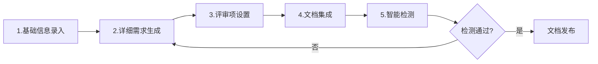
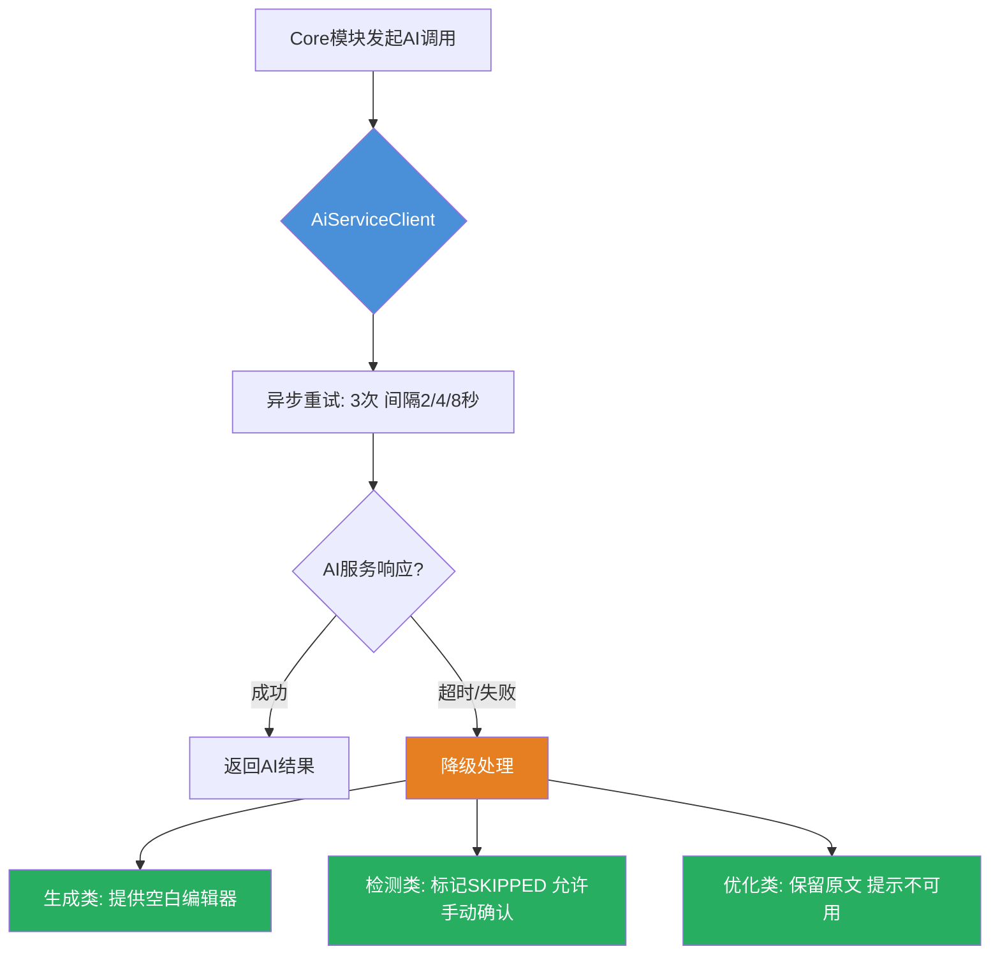
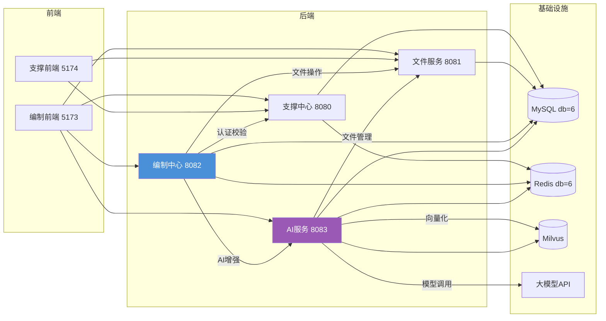

# 招标文件AI编制工具平台 - 开发计划

## Context

招标文件AI编制工具平台已完成项目初始化（阶段一），7个Maven模块框架搭建完毕，数据库表结构定义完成，基础认证/权限/文件服务已实现。当前需要推进阶段二：业务功能开发，将框架代码转化为可运行的完整系统。

**核心原则**：AI服务为编制中心提供增强能力，AI不可用时编制中心业务流程不受影响（异步重试+降级为手动模式）。

**开发优先级**：支撑中心 → 编制中心 → AI能力

---

## 阶段一：支撑中心完善（Priority 1）

> 目标：补齐支撑中心缺失的业务功能，支撑中心前端同步开发

### 1.1 系统政策文件管理（后端）

**现状**：无政策文件相关实体/接口，需求文档要求管理员可上传/分类/查看/删除政策文件

**新建表** `sup_policy_file`：
```sql
CREATE TABLE sup_policy_file (
  id BIGINT PRIMARY KEY,
  file_name VARCHAR(200) NOT NULL COMMENT '文件名称',
  file_category TINYINT NOT NULL COMMENT '文件分类: 1=法律法规 2=规章制度 3=政策文件',
  applicable_category TINYINT COMMENT '适用项目类别: 1=限额以下 2=产权交易 3=政府采购',
  file_id BIGINT COMMENT '关联file_info的id',
  file_size BIGINT COMMENT '文件大小(字节)',
  file_type VARCHAR(20) COMMENT '文件格式: PDF/DOCX/XLSX',
  status TINYINT DEFAULT 1 COMMENT '状态: 0=禁用 1=启用',
  -- BaseEntity标准字段
  create_time DATETIME, create_id BIGINT, create_name VARCHAR(50),
  modify_time DATETIME, modify_id BIGINT, modify_name VARCHAR(50),
  ver INT DEFAULT 1, is_delete TINYINT DEFAULT 0
);
```

**新建文件清单**：
| 文件 | 路径 | 说明 |
|------|------|------|
| `SupPolicyFile` | `common/src/.../entity/SupPolicyFile.java` | 实体类 |
| `PolicyFileRequest` | `common/src/.../dto/PolicyFileRequest.java` | 请求DTO |
| `PolicyFileVO` | `common/src/.../vo/PolicyFileVO.java` | 响应VO |
| `IPolicyFileService` | `support/src/.../service/IPolicyFileService.java` | 服务接口 |
| `PolicyFileServiceImpl` | `support/src/.../service/impl/PolicyFileServiceImpl.java` | 服务实现 |
| `PolicyFileMapper` | `support/src/.../mapper/PolicyFileMapper.java` | Mapper |
| `PolicyFileController` | `support/src/.../controller/PolicyFileController.java` | 控制器 |

**API端点**：
```
GET    /api/policy-file              - 分页查询（支持按分类、适用类别、名称筛选）
POST   /api/policy-file              - 上传政策文件（调用文件服务）
GET    /api/policy-file/{id}         - 查看详情
DELETE /api/policy-file/{id}         - 删除（二次确认）
PUT    /api/policy-file/{id}/status  - 启用/禁用
```

### 1.2 操作日志管理（后端）

**现状**：`sup_access_log`表和`AccessLogController`已存在，但缺少业务操作日志

**改造内容**：
- 新建 `sup_operation_log` 表（如不存在），记录业务操作（创建项目、提交检测等）
- 在核心业务操作处添加 `@OperationLog` 注解或AOP切面
- 提供操作日志查询接口

**新建/修改文件**：
| 文件 | 说明 |
|------|------|
| `OperationLog` 实体 | 操作日志实体 |
| `OperationLogMapper` | Mapper |
| `IOperationLogService` + Impl | 操作日志服务 |
| `OperationLogController` | 操作日志查询接口 |
| `@OperationLog` 注解 | 操作日志注解 |
| `OperationLogAspect` | AOP切面，自动记录操作 |

### 1.3 消息中心（后端）

**现状**：`sup_message`表已定义，但无Controller/Service

**新建文件**：
| 文件 | 说明 |
|------|------|
| `SupMessage` 实体 | 已在common中定义，确认字段完整性 |
| `MessageVO` | 消息响应VO（含已读/未读状态） |
| `IMessageService` + Impl | 消息服务（查询、标记已读、全部已读、删除） |
| `MessageMapper` | Mapper |
| `MessageController` | 消息中心API |

**API端点**：
```
GET    /api/message                  - 分页查询消息（支持按类型筛选）
PUT    /api/message/{id}/read        - 标记已读
PUT    /api/message/read-all         - 全部标记已读
GET    /api/message/unread-count     - 未读消息数
DELETE /api/message/{id}             - 删除消息
```

### 1.4 统计分析（后端）

**现状**：无统计接口

**新建文件**：
| 文件 | 说明 |
|------|------|
| `StatisticsVO` | 统计数据VO |
| `IStatisticsService` + Impl | 统计服务（聚合查询） |
| `StatisticsController` | 统计API |

**API端点**：
```
GET    /api/statistics/overview      - 总览数据（项目数、检测通过率等）
GET    /api/statistics/project       - 项目统计（按类别/类型/状态分布）
GET    /api/statistics/template      - 模板使用统计
GET    /api/statistics/detection     - 检测统计（通过率、问题分布）
```

### 1.5 支撑中心前端同步（5174端口）

**新建页面**：
| 页面 | 文件 | 对应API |
|------|------|---------|
| 政策文件管理 | `views/policy/PolicyFileList.vue` | policy-file API |
| 统计分析 | `views/statistics/index.vue` | statistics API |
| 消息中心 | `views/message/MessageCenter.vue` | message API |
| 操作日志 | `views/system/operation-log/index.vue` | operation-log API |

**新建API文件**：
| 文件 | 说明 |
|------|------|
| `src/api/policy-file.ts` | 政策文件API |
| `src/api/statistics.ts` | 统计API |
| `src/api/message.ts` | 消息API |
| `src/api/operation-log.ts` | 操作日志API |

**路由更新**：在 `src/router/index.ts` 添加4个新路由

---

## 阶段二：编制中心核心业务（Priority 2）

> 目标：实现编制中心的5阶段文件编制流程、业务需求AI生成流、文档导出

### 2.1 编制中心政策文件管理（后端）

**与1.1的区别**：支撑中心管理的是系统级政策文件，编制中心管理的是用户级政策文件

**新建表** `ai_policy_file`：
```sql
CREATE TABLE ai_policy_file (
  id BIGINT PRIMARY KEY,
  file_name VARCHAR(200) NOT NULL,
  file_category TINYINT NOT NULL COMMENT '1=法律法规 2=规章制度 3=政策文件',
  applicable_category TINYINT COMMENT '适用项目类别',
  file_id BIGINT,
  file_size BIGINT,
  file_type VARCHAR(20),
  user_id BIGINT COMMENT '上传用户ID',
  status TINYINT DEFAULT 1,
  -- BaseEntity标准字段
  create_time DATETIME, create_id BIGINT, create_name VARCHAR(50),
  modify_time DATETIME, modify_id BIGINT, modify_name VARCHAR(50),
  ver INT DEFAULT 1, is_delete TINYINT DEFAULT 0
);
```

**新建文件**：参照1.1，在core模块中创建对应的实体/DTO/VO/Service/Mapper/Controller

### 2.2 用户消息中心（后端 - core模块）

**说明**：编制中心的消息与支撑中心共享 `sup_message` 表，但通过core模块的接口访问

**新建文件**：
| 文件 | 说明 |
|------|------|
| `UserMessageController` | 编制中心消息接口 |
| 复用 `IMessageService` | 调用support模块的消息服务（通过Feign或直接数据库查询） |

**消息类型定义**：
- 项目检测通知
- 文档集成通知
- 项目创建通知
- 模板更新通知
- 系统维护通知

### 2.3 五阶段文件编制流程（后端 - core模块核心）

这是编制中心的核心功能。项目创建后进入5阶段流程：



**2.3.1 阶段1：基础信息录入**

**现状**：`ProjectController` 已有基础CRUD，需扩展

**改造内容**：
- 项目创建时选择模板（template_id关联）
- 历史招标文件匹配（3种模式：自动/手动/上传）
- 项目状态从 DRAFT → IN_PROGRESS

**修改文件**：
| 文件 | 改动 |
|------|------|
| `ProjectController` | 新增 `/api/core/project/{id}/init` 初始化接口 |
| `IProjectService` + Impl | 新增 `initProject()` 方法 |
| `ProjectRequest` | 增加 templateId、matchMode、matchedFileId 字段 |
| `AiProject` 实体 | 确认已有 templateId、requirementSource 等字段 |

**新建文件**：
| 文件 | 说明 |
|------|------|
| `ProjectInitRequest` | 基础信息录入请求DTO（含模板选择、匹配模式） |
| `ProjectInitVO` | 初始化结果VO（含匹配的历史文件列表） |

**2.3.2 阶段2：详细需求生成**

**核心逻辑**：
- 若引用模式：直接使用引用的业务需求内容，可编辑修改
- 若AI生成模式：调用AI服务生成需求内容（SSE流式响应）
- **AI降级**：AI不可用时，提供空白编辑器让用户手动填写

**新建/修改文件**：
| 文件 | 说明 |
|------|------|
| `RequirementController` | 新增 `/api/core/requirement/{id}/generate` 生成接口 |
| `IRequirementService` + Impl | 新增 `generateRequirement()` 方法 |
| `AiSseController` (core) | SSE转发控制器，包装AI服务的SSE响应 |
| `AiServiceClient` | AI服务调用客户端（RestTemplate + 降级策略） |

**AI降级策略实现**（`AiServiceClient`）：
```java
// 伪代码 - AI服务调用客户端
public class AiServiceClient {
    // 调用AI生成，失败时降级
    public SseEmitter generateRequirement(RequirementGenerateRequest request) {
        SseEmitter emitter = new SseEmitter(300000L); // 5分钟超时
        asyncRetryWithFallback(
            () -> callAiService("/api/ai/generate/requirement", request, emitter),
            () -> fallbackManualMode(emitter, "AI服务暂时不可用，请手动编辑需求内容"),
            3, 2000  // 重试3次，间隔2秒
        );
        return emitter;
    }
}
```

**2.3.3 阶段3：评审项设置**

**现状**：`ReviewItemController` 已有三级嵌套CRUD，需扩展

**改造内容**：
- AI辅助生成评审项（调用AI服务）
- 评分建议展示（根据项目类型显示建议分值区间）
- 四类评审内容：符合性审查、技术标评审、资信标评审、商务评审
- AI降级：AI不可用时提供空白模板让用户手动填写

**修改文件**：
| 文件 | 改动 |
|------|------|
| `ReviewItemController` | 新增 `/api/core/review-item/{projectId}/generate` AI生成接口 |
| `IReviewItemService` + Impl | 新增 `generateReviewItems()` 方法 |
| `ReviewItemRequest` | 增加 reviewType（符合性/技术/资信/商务）、score、weight 字段 |
| `AiReviewItem` 实体 | 增加 reviewType、score、weight、isRequired 字段 |

**2.3.4 阶段4：文档集成**

**核心逻辑**：Markdown模板 + 需求内容 + 评审项 → 填充Word模板 → 生成.docx

**新建文件**：
| 文件 | 说明 |
|------|------|
| `DocumentIntegrationController` | 文档集成API |
| `IDocumentIntegrationService` + Impl | 文档集成服务 |
| `MarkdownTemplateEngine` | 扩展现有框架，实现Markdown→HTML转换 |
| `WordDocumentGenerator` | 使用poi-tl生成Word文档 |
| `DocumentPreviewVO` | 文档预览VO |

**API端点**：
```
POST   /api/core/document/integrate/{projectId}  - 执行文档集成
GET    /api/core/document/preview/{projectId}     - 预览集成结果
GET    /api/core/document/export/{projectId}      - 导出Word文档
PUT    /api/core/document/edit/{projectId}        - 编辑集成文档
```

**文档生成流程**：
```
1. 读取项目关联的模板（Markdown格式）
2. 用flexmark-java解析Markdown为HTML
3. 提取需求内容、评审项数据
4. 使用poi-tl填充Word模板
5. 生成.docx文件，通过文件服务存储
6. 返回文件ID供下载
```

**2.3.5 阶段5：智能检测**

**核心逻辑**：调用AI服务进行4项检测，AI不可用时允许跳过

**改造内容**：
- 扩展现有 `DetectionController`（core模块代理AI服务）
- 政策文件选择（系统政策 + 用户政策）
- 检测进度跟踪
- 检测结果展示（问题列表 + 接受/拒绝建议）
- **AI降级**：AI不可用时，标记为 `DETECTION_SKIPPED`，允许用户手动确认后发布

**新建/修改文件**：
| 文件 | 说明 |
|------|------|
| `DetectionController` (core) | 新增政策文件选择、提交检测、获取结果接口 |
| `IDetectionService` (core) + Impl | 检测流程编排（调用AI服务） |
| `AiServiceClient` | AI检测调用 + 降级策略 |
| `DetectionProgressVO` | 检测进度VO |
| `DetectionReportVO` | 检测报告VO（含问题列表） |

**检测流程**：
```
1. 用户选择政策文件（系统+个人）
2. 提交检测 → 状态改为 DETECTING
3. 并行执行4项检测（公平性、合规性、错别字、敏感词）
4. 汇总检测结果
5. 全部通过 → DETECTION_PASSED
6. 存在问题 → DETECTION_FAILED，展示问题列表
7. AI不可用 → DETECTION_SKIPPED，用户可手动确认
```

### 2.4 业务需求编制流程（后端 - core模块）

**现状**：`RequirementController` 已有基础CRUD，需扩展AI生成和检测流程

**扩展内容**：
- AI辅助生成需求（3种匹配模式）
- AI生成对话式微调（SSE）
- 智能检测（敏感词+错别字）
- 自动保存机制（每2分钟）

**修改文件**：
| 文件 | 改动 |
|------|------|
| `RequirementController` | 新增生成、检测、自动保存接口 |
| `IRequirementService` + Impl | 新增AI生成、检测编排方法 |
| `AiRequirement` 实体 | 增加 content（LONGTEXT）、autoSaveContent 字段 |
| `RequirementMatchRequest` | 完善3种匹配模式请求 |

### 2.5 项目状态流转完善

**现状**：项目状态枚举已定义完整，需在各阶段流转点实现状态变更

**改造文件**：
| 文件 | 改动 |
|------|------|
| `ProjectServiceImpl` | 在各阶段操作后更新项目状态 |
| `IProjectService` | 新增状态流转方法 |

**状态流转触发点**：
- 创建项目 → DRAFT
- 基础信息录入 → IN_PROGRESS
- 提交检测 → PENDING_DETECTION → DETECTING
- 检测通过 → DETECTION_PASSED
- 检测失败 → DETECTION_FAILED
- 检测跳过 → DETECTION_SKIPPED
- 发布文档 → PUBLISHED
- 归档/取消 → ARCHIVED / CANCELLED

### 2.6 编制中心前端（5173端口）

**新建/修改页面**：

| 页面 | 文件 | 说明 | 对应阶段 |
|------|------|------|----------|
| 业务需求列表 | `views/requirement/RequirementList.vue` | 改造现有页面 | - |
| 业务需求新增 | `views/requirement/RequirementCreate.vue` | 3种匹配模式 | - |
| 业务需求编辑 | `views/requirement/RequirementEdit.vue` | 改造现有页面 | - |
| 业务需求生成 | `views/requirement/RequirementGenerate.vue` | **新建** - AI编辑器+SSE | - |
| 业务需求检测 | `views/requirement/RequirementReview.vue` | **新建** - 检测面板 | - |
| 项目创建 | `views/project/ProjectCreate.vue` | 改造现有页面 | - |
| 基础信息录入 | `views/project/ProjectInit.vue` | **新建** | 阶段1 |
| 详细需求生成 | `views/project/ProjectRequirement.vue` | **新建** - AI编辑器 | 阶段2 |
| 评审项设置 | `views/project/ProjectReview.vue` | 改造现有页面 | 阶段3 |
| 文档集成 | `views/project/ProjectIntegration.vue` | **新建** - 文档预览 | 阶段4 |
| 智能检测进度 | `views/project/ReviewProgress.vue` | **新建** | 阶段5 |
| 检测报告 | `views/project/ReviewReport.vue` | **新建** | 阶段5 |
| AI助手侧边栏 | `components/AiAssistant.vue` | **新建** - 全局组件 | 全局 |
| SSE处理工具 | `utils/sse.ts` | **新建** - SSE客户端 | 全局 |
| 政策文件管理 | `views/policy/PolicyFileList.vue` | **新建** | - |
| 用户消息中心 | `views/message/MessageCenter.vue` | **新建** | - |

**新建API文件**：
| 文件 | 说明 |
|------|------|
| `src/api/detection.ts` | 检测相关API |
| `src/api/document.ts` | 文档集成API |
| `src/api/ai.ts` | AI服务API（SSE流式） |
| `src/api/policy-file.ts` | 政策文件API |
| `src/api/message.ts` | 消息API |

**核心组件**：
| 组件 | 说明 | 关键依赖 |
|------|------|----------|
| `MdEditor` | Markdown编辑器 | md-editor-v3 |
| `DocxPreview` | Word文档预览 | docx-preview |
| `DiffViewer` | 版本对比 | diff2html |
| `AiAssistant` | AI助手侧边栏 | SSE + 自定义 |
| `DetectionPanel` | 检测结果面板 | 自定义 |
| `ReviewItemTree` | 评审项树形编辑器 | Element Plus Tree |

---

## 阶段三：AI能力实现（Priority 3）

> 目标：实现AI服务的核心能力，通过Spring AI接入大模型，实现知识库检索和智能检测

### 3.1 Spring AI 1.1.0 集成

> **注意**: 项目使用 Spring AI 1.1.0（非 0.8.1），API 有较大变化。1.1.0 中 ChatClient 为推荐入口，StreamingChatModel 通过 ChatClient.streaming() 获取。

**Maven 依赖**（已在父 POM `<dependencyManagement>` 中声明）：
```xml
<dependency>
    <groupId>org.springframework.ai</groupId>
    <artifactId>spring-ai-openai-spring-boot-starter</artifactId>
    <version>1.1.0</version>
</dependency>
```

**新建文件**：
| 文件 | 说明 |
|------|------|
| `SpringAiConfig` | Spring AI配置类，注册 ChatClient Bean（支持多模型切换） |
| `application-ai.yml` | AI模型连接配置（DeepSeek兼容OpenAI协议/本地Ollama模型） |
| `AiModelProperties` | AI配置属性类（多模型endpoint/apiKey/scenario映射） |

**Spring AI 1.1.0 关键API**：
```java
// ChatClient 是推荐入口
ChatClient chatClient = ChatClient.builder(chatModel).build();

// 同步调用
String result = chatClient.prompt()
    .system(systemPrompt)
    .user(userPrompt)
    .call()
    .content();

// 流式调用（SSE）
Flux<String> stream = chatClient.prompt()
    .system(systemPrompt)
    .user(userPrompt)
    .stream()
    .content();
```

**配置内容**（DeepSeek 兼容 OpenAI 协议，使用 spring-ai-openai-spring-boot-starter）：
```yaml
# application-ai.yml 示例
spring:
  ai:
    openai:
      api-key: ${DEEPSEEK_API_KEY:}
      base-url: https://api.deepseek.com
      chat:
        options:
          model: deepseek-chat
          temperature: 0.7
    # 本地模型通过 Ollama 部署
    ollama:
      base-url: ${LOCAL_MODEL_URL:http://localhost:11434}
      chat:
        options:
          model: qwen2.5
          temperature: 0.5
```

### 3.2 AI助手服务

**新建文件**：
| 文件 | 说明 |
|------|------|
| `AiChatController` | AI对话接口（SSE流式） |
| `IAiChatService` + Impl | AI对话服务 |
| `ChatMessage` | 对话消息DTO |
| `AiConversation` 实体 | 对话历史实体（新建表） |
| `AiConversationMapper` | 对话历史Mapper |

**新建表** `ai_conversation`：
```sql
CREATE TABLE ai_conversation (
  id BIGINT PRIMARY KEY,
  user_id BIGINT NOT NULL,
  project_id BIGINT COMMENT '关联项目ID',
  title VARCHAR(200) COMMENT '对话标题',
  messages JSON COMMENT '对话消息列表',
  -- BaseEntity标准字段
  create_time DATETIME, create_id BIGINT, create_name VARCHAR(50),
  modify_time DATETIME, modify_id BIGINT, modify_name VARCHAR(50),
  ver INT DEFAULT 1, is_delete TINYINT DEFAULT 0
);
```

**API端点**：
```
POST   /api/ai/chat                   - 发送消息（SSE流式响应）
GET    /api/ai/chat/history           - 获取对话历史
POST   /api/ai/chat/optimize          - 文本优化（SSE流式）
```

### 3.3 知识库向量化与检索

**现状**：`KnowledgeDocumentServiceImpl` 已有框架，需补齐向量化逻辑

**改造文件**：
| 文件 | 改动 |
|------|------|
| `KnowledgeDocumentServiceImpl` | 实现Tika解析、文本分块、Embedding、Milvus存储 |
| `MilvusConfig` | Milvus连接配置 |
| `EmbeddingService` | 向量化服务（调用Embedding API） |

**向量化流程**：
```
文档上传 → Apache Tika提取文本 → 按500-1000字分块
→ 调用Embedding API向量化 → 存储到Milvus → 返回向量ID列表
```

**检索流程**：
```
用户查询 → 调用Embedding API向量化 → Milvus相似度检索 → Top-K返回
```

### 3.4 文档匹配服务

**新建文件**：
| 文件 | 说明 |
|------|------|
| `DocumentMatchController` | 文档匹配API |
| `IDocumentMatchService` + Impl | 文档匹配服务 |

**API端点**：
```
POST   /api/ai/match/auto             - 自动匹配历史文件
POST   /api/ai/match/manual           - 手动选择匹配
GET    /api/ai/match/history           - 获取历史文件列表（按匹配度排序）
```

### 3.5 需求生成服务

**新建文件**：
| 文件 | 说明 |
|------|------|
| `RequirementGenerateController` | 需求生成API（SSE流式） |
| `IRequirementGenerateService` + Impl | 需求生成服务 |
| `GenerateRequest` | 生成请求DTO（含项目信息、参考内容） |

**API端点**：
```
POST   /api/ai/generate/requirement   - AI生成业务需求（SSE流式）
POST   /api/ai/generate/review-item   - AI生成评审项（SSE流式）
```

**生成Prompt设计**：
- 系统角色：招标文件编制专家
- 输入：项目信息 + 参考文档 + 知识库检索结果
- 输出：结构化的业务需求/评审项内容

### 3.6 智能检测服务

**改造文件**：
| 文件 | 改动 |
|------|------|
| `DetectionServiceImpl` | 实现真正的AI检测逻辑 |

**4项检测实现**：

| 检测类型 | 实现方式 | Prompt策略 |
|----------|----------|-----------|
| 敏感词检测 | 调用AI模型分析文本 | 标记敏感词汇+提供替换建议 |
| 错别字检查 | 调用AI模型检查文本 | 标记错别字+提供修正建议 |
| 公平性检测 | AI分析+规则引擎 | 检测歧视性条款、不合理条件 |
| 合规性检查 | AI分析+政策文件比对 | 比对政策文件，检查合规性 |

**新建文件**：
| 文件 | 说明 |
|------|------|
| `DetectionEngine` | 检测引擎（编排4项检测） |
| `SensitiveWordDetector` | 敏感词检测器 |
| `TypoDetector` | 错别字检测器 |
| `FairnessDetector` | 公平性检测器 |
| `ComplianceDetector` | 合规性检测器 |
| `DetectionIssueVO` | 检测问题VO（位置、原文、建议、类型） |

**检测降级策略**：
```java
// 异步重试+降级模式
public DetectionResult detect(DetectionRequest request) {
    try {
        return asyncRetryWithFallback(
            () -> callAiDetection(request),
            () -> DetectionResult.skipped("AI检测服务暂时不可用，已跳过自动检测"),
            3, 5000  // 重试3次，间隔5秒
        );
    } catch (Exception e) {
        return DetectionResult.skipped("检测服务异常: " + e.getMessage());
    }
}
```

### 3.7 模型路由服务

**新建文件**：
| 文件 | 说明 |
|------|------|
| `ModelRouter` | 模型路由器（根据场景选择本地/云端模型） |
| `ModelRouteStrategy` | 路由策略接口 |
| `GenerationStrategy` | 生成类任务 → 本地模型 |
| `OptimizationStrategy` | 优化类任务 → 云端模型 |
| `DetectionStrategy` | 检测类任务 → 云端模型 |

**路由规则**：
```
生成类（需求编制、评审项生成）→ 优先本地模型（降低Token成本）
优化类（文本优化、润色）→ 云端模型（DeepSeek，保证质量）
检测类（公平性、合规性等）→ 云端模型（DeepSeek，保证准确度）
本地模型不可用 → 自动切换到云端模型
```

---

## 阶段四：集成联调与优化

> 目标：全链路联调、性能优化、用户体验打磨

### 4.1 服务间调用集成

**改造文件**：
| 文件 | 说明 |
|------|------|
| `AiServiceClient` (core模块) | 完善AI服务调用客户端（重试、超时、降级） |
| `SupportServiceClient` (core模块) | 支撑中心认证校验调用 |
| `FileServiceClient` (core/ai模块) | 文件服务调用 |

**降级策略实现**：
```
调用AI服务 → 超时5秒 → 重试3次(间隔2/4/8秒) → 仍失败 → 降级为手动模式
调用文件服务 → 超时10秒 → 重试2次 → 失败 → 返回错误提示
调用支撑中心 → 超时3秒 → 重试2次 → 失败 → 返回认证失败
```

### 4.2 前端SSE流式响应处理

**新建工具**：
| 文件 | 说明 |
|------|------|
| `src/utils/sse.ts` | SSE客户端封装（支持重连、降级提示） |
| `src/composables/useAiStream.ts` | AI流式响应组合式函数 |

**SSE处理逻辑**：
```
建立EventSource连接 → 接收流式数据 → 实时渲染到编辑器
→ 连接异常 → 显示重试提示 → 自动重连3次
→ 重连失败 → 提示AI服务不可用，切换手动模式
```

### 4.3 自动保存机制

**实现方式**：
- 前端：每2分钟自动调用保存接口
- 后端：自动保存内容到 `autoSaveContent` 字段（不覆盖正式内容）
- 恢复：页面加载时检查是否有未保存的自动保存内容，提示恢复

### 4.4 文档导出完善

**Word模板设计**：
- 创建标准招标文件Word模板（.docx）
- 使用poi-tl的变量语法 `{{变量名}}`
- 模板变量映射：项目信息、需求内容、评审项、检测结论

---

## 关键架构设计

### AI降级策略架构



### 服务调用关系



---

## 数据库变更汇总

### 新建表
| 表名 | 模块 | 说明 |
|------|------|------|
| `sup_policy_file` | support | 系统政策文件 |
| `ai_policy_file` | core | 用户政策文件 |
| `sup_operation_log` | support | 操作日志 |
| `ai_conversation` | ai | AI对话历史 |

### 已有表可能需要的字段扩展
| 表名 | 新增字段 | 说明 |
|------|----------|------|
| `ai_review_item` | review_type, score, weight, is_required | 评审类型和评分 |
| `ai_requirement` | auto_save_content | 自动保存内容 |
| `ai_project` | review_type | 评审方式（智能/人工） |
| `ai_detection_record` | policy_file_ids | 关联的政策文件 |

---

## 验证方案

### 阶段一验证（支撑中心）
1. 政策文件上传/分类/查看/删除功能测试
2. 操作日志记录和查询验证
3. 消息中心收发和已读标记测试
4. 统计数据准确性验证
5. 支撑中心前端所有页面交互测试

### 阶段二验证（编制中心）
1. 项目5阶段流程完整性测试
2. 业务需求3种匹配模式测试
3. 文档集成和Word导出验证
4. 检测流程（提交→进度→报告）测试
5. 项目状态流转正确性验证
6. **AI降级测试**：停止AI服务后，编制中心仍可正常操作

### 阶段三验证（AI能力）
1. AI对话SSE流式响应测试
2. 需求生成质量和流式输出测试
3. 知识库向量化→检索→匹配全链路测试
4. 4项智能检测准确性测试
5. 模型路由切换测试（本地↔云端）
6. AI服务恢复后自动切换回AI增强模式

### 阶段四验证（集成联调）
1. 全链路：创建项目→5阶段→检测→发布
2. 第三方系统跳转创建项目测试
3. 自动保存和恢复测试
4. 并发场景下SSE响应测试
5. 前端构建无报错 (`npm run build`)
6. 后端测试通过 (`mvn clean test`)

---

## 任务依赖关系

```mermaid
gantt
    title 开发阶段依赖关系
    dateFormat X
    axisFormat %s

    section 阶段一-支撑中心
    政策文件管理(后端)          :a1, 0, 1
    操作日志(后端)              :a2, 0, 1
    消息中心(后端)              :a3, 0, 1
    统计分析(后端)              :a4, 0, 1
    支撑前端页面               :a5, 1, 2

    section 阶段二-编制中心
    政策文件+消息(后端)         :b1, 1, 2
    5阶段流程(后端)             :b2, 1, 3
    AI降级客户端(后端)          :b3, 1, 2
    编制前端页面               :b4, 2, 4

    section 阶段三-AI能力
    Spring AI集成              :c1, 3, 4
    AI助手+知识库              :c2, 4, 5
    文档匹配+生成              :c3, 4, 5
    智能检测                   :c4, 5, 6
    模型路由                   :c5, 4, 5

    section 阶段四-联调
    服务间集成                 :d1, 6, 7
    SSE+自动保存              :d2, 6, 7
    文档导出                   :d3, 6, 7
    全链路测试                 :d4, 7, 8
```


