# 阶段三：AI能力实现 - 业务开发计划

## 1. 现状分析

### 1.1 已完成的基础设施

| 组件 | 完成度 | 说明 |
|------|--------|------|
| AI任务队列框架 | 80% | Core创建任务(PENDING) → AI轮询(5s) → CAS抢占 → 处理 → 标记完成/失败 |
| AiTaskProcessor | 骨架 | 7个dispatch方法均为TODO占位符，无实际AI调用 |
| 超时/重试机制 | 100% | 10分钟超时自动标记AI_UNAVAILABLE，支持手动重试/跳过 |
| 检测记录CRUD | 100% | DetectionController + Service 基础接口已实现 |
| 知识库文档CRUD | 100% | KnowledgeController + Service 已实现（**本阶段不实现向量化**） |
| Maven依赖 | 100% | spring-ai-openai 1.1.0、milvus-sdk、tika-core 已声明 |
| 空目录预留 | 已创建 | checker/、generator/、knowledge/、model/、prompt/ |
| **模型配置管理(Support)** | **100%** | `ModelConfigController` + Service + Mapper 完整CRUD已实现 |
| **路由规则管理(Support)** | **100%** | `ModelRouteRuleController` + Service + Mapper 完整CRUD已实现 |
| **ai_model_config表** | **已建** | 模型名称/类型/端点/密钥/参数/场景/启用状态/Token统计 |
| **sup_model_route_rule表** | **已建** | 场景→优先模型→降级模型，按优先级排序 |

### 1.2 需要实现的核心能力

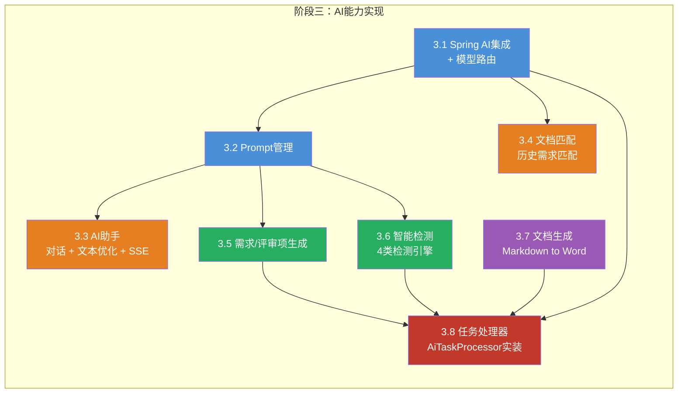

### 1.3 排除范围

- **知识库向量化**：Milvus集成、Tika文档解析、文本分块、Embedding调用暂不实现
- **知识库检索**：POST `/knowledge/retrieve`、POST `/knowledge/vectorize` 暂不实现
- 文档匹配暂时采用数据库关键字匹配，不走向量相似度

---

## 2. 整体架构

### 2.1 AI任务异步解耦流程

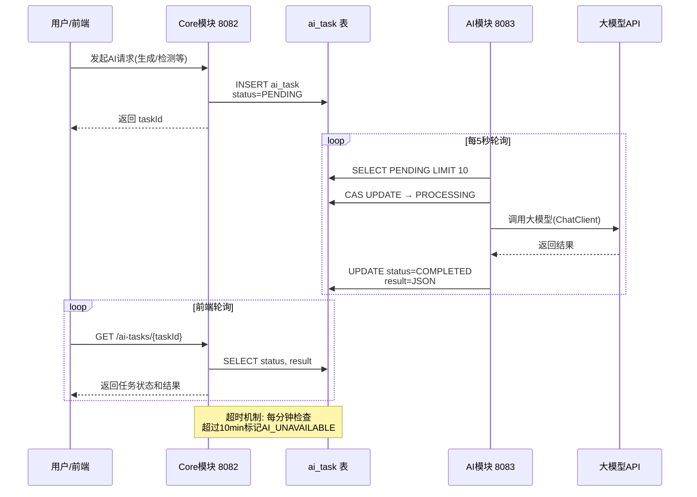

### 2.2 AI助手SSE直连流程（非任务队列）

AI助手对话和文本优化需要实时流式响应，不走任务队列，直接SSE：

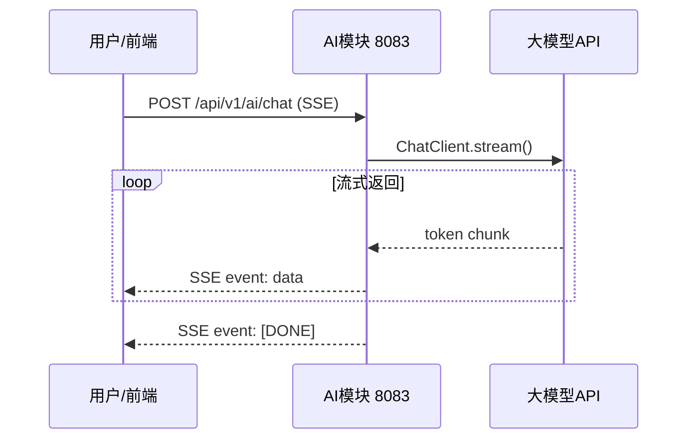

### 2.3 模型路由策略（数据库驱动）

**核心原则**：模型配置和路由规则全部从数据库获取，不写死在配置文件中。支撑中心管理配置，AI模块读取并缓存，通过Redis Pub/Sub实现动态刷新。

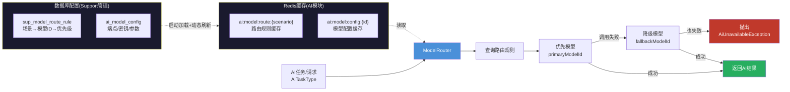

**动态刷新机制**：

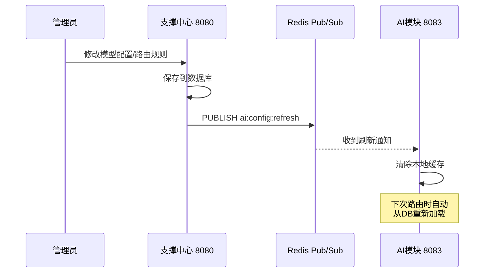

---

## 3. 详细开发任务

### 3.1 Spring AI集成 + 模型路由（数据库驱动）

**目标**：基于 Spring AI 1.1.0 接入多模型，模型配置和路由规则从数据库（`ai_model_config` + `sup_model_route_rule`）获取，支持动态刷新。

#### 3.1.1 Spring AI基础配置

**说明**：`application.yml` 中只保留 Spring AI 的**最小启动配置**（占位符），实际的端点、密钥、模型参数全部从数据库加载。

**修改文件**：

| 文件 | 路径 | 说明 |
|------|------|------|
| `application.yml` | `ai/resources/application.yml` | **改造**：增加spring.ai占位配置，防止自动装配报错 |

**新建文件**：

| 文件 | 路径 | 说明 |
|------|------|------|
| `DynamicChatClientFactory` | `ai/model/DynamicChatClientFactory.java` | 根据数据库配置动态创建ChatClient |
| `ModelConfigCacheService` | `ai/model/ModelConfigCacheService.java` | 模型配置缓存服务（Redis缓存+DB兜底） |
| `ModelConfigRefreshListener` | `ai/model/ModelConfigRefreshListener.java` | Redis Pub/Sub监听，接收配置刷新通知 |

**application.yml 最小配置（仅防止Spring AI自动装配报错）**：

```yaml
spring:
  ai:
    openai:
      api-key: ${DEEPSEEK_API_KEY:placeholder}
      base-url: ${DEEPSEEK_BASE_URL:https://api.deepseek.com}
      chat:
        options:
          model: deepseek-chat
```

> 注意：这里的配置仅作为 Spring AI 自动装配的默认值兜底。实际运行时 `ModelRouter` 通过 `DynamicChatClientFactory` 根据数据库配置创建 ChatClient，不依赖此配置。

#### 3.1.2 DynamicChatClientFactory（动态ChatClient工厂）

**核心职责**：根据 `ai_model_config` 表中的配置信息，动态创建不同模型的 ChatClient 实例。

```java
@Component
public class DynamicChatClientFactory {

    /**
     * 根据模型配置动态创建ChatClient
     * @param config 数据库中的模型配置
     * @return ChatClient实例
     */
    public ChatClient createChatClient(AiModelConfig config) {
        String modelType = config.getModelType(); // LOCAL / CLOUD / PRIVATE
        
        // 根据模型类型创建不同的ChatModel
        // CLOUD/PRIVATE: 使用OpenAI兼容协议（DeepSeek等）
        // LOCAL: 使用Ollama协议
        
        // 解析modelParams JSON获取temperature、maxTokens等参数
        // 解密apiKey（AES）
        // 构建ChatClient并返回
    }
}
```

**支持的模型类型**：

| modelType | 协议 | 创建方式 | 典型场景 |
|-----------|------|----------|----------|
| CLOUD | OpenAI兼容 | `OpenAiApi` + `OpenAiChatModel` | DeepSeek、GPT等 |
| LOCAL | Ollama | `OllamaApi` + `OllamaChatModel` | Qwen、Llama等本地模型 |
| PRIVATE | OpenAI兼容 | 同CLOUD，私有部署端点 | 私有化部署模型 |

**modelParams JSON格式**：

```json
{
  "temperature": 0.7,
  "maxTokens": 4096,
  "topP": 0.95,
  "model": "deepseek-chat"
}
```

#### 3.1.3 ModelConfigCacheService（配置缓存服务）

**核心职责**：管理 `ai_model_config` 和 `sup_model_route_rule` 的缓存，减少数据库查询。

```java
@Service
public class ModelConfigCacheService {

    private static final String ROUTE_CACHE_KEY = "ai:model:route:";
    private static final String CONFIG_CACHE_KEY = "ai:model:config:";
    private static final long CACHE_TTL = 30; // 分钟

    /**
     * 获取指定场景的路由规则（优先缓存）
     * @param scenario 使用场景 GENERATION/OPTIMIZATION/DETECTION
     * @return 按优先级排序的路由规则列表
     */
    public List<SupModelRouteRule> getActiveRouteRules(String scenario) {
        // 1. 查Redis缓存
        // 2. 缓存未命中 → 查数据库(is_active=1, ORDER BY priority ASC)
        // 3. 写入缓存(TTL 30分钟)
        // 4. 返回结果
    }

    /**
     * 获取模型配置详情（优先缓存）
     * @param modelId 模型配置ID
     * @return 模型配置（含端点、密钥、参数）
     */
    public AiModelConfig getModelConfig(Long modelId) {
        // 1. 查Redis缓存
        // 2. 缓存未命中 → 查数据库
        // 3. 写入缓存
        // 4. 返回（不存在或isActive=0则返回null）
    }

    /**
     * 清除所有缓存（由刷新监听器调用）
     */
    public void evictAll() {
        // 删除 ai:model:route:* 和 ai:model:config:* 缓存
    }
}
```

**Redis缓存结构**：

```
ai:model:route:GENERATION      → JSON List<SupModelRouteRule>  TTL=30min
ai:model:route:OPTIMIZATION    → JSON List<SupModelRouteRule>  TTL=30min
ai:model:route:DETECTION       → JSON List<SupModelRouteRule>  TTL=30min
ai:model:config:{modelId}      → JSON AiModelConfig            TTL=30min
```

#### 3.1.4 ModelConfigRefreshListener（配置刷新监听）

**核心职责**：监听Redis Pub/Sub通道，收到支撑中心发出的刷新通知后清除本地缓存。

```java
@Component
public class ModelConfigRefreshListener {

    private static final String REFRESH_CHANNEL = "ai:config:refresh";

    @Autowired
    private ModelConfigCacheService cacheService;

    /**
     * 注册Redis消息监听
     */
    @Bean
    public RedisMessageListenerContainer configRefreshContainer(
            RedisConnectionFactory factory) {
        // 订阅 ai:config:refresh 通道
        // 收到消息后调用 cacheService.evictAll()
    }
}
```

**支撑中心需配合的改动**（最小化修改）：

在 `ModelConfigServiceImpl` 和 `ModelRouteRuleServiceImpl` 的增删改方法中，操作完成后发布Redis通知：

```java
// 在 Support 模块的 Service 实现中添加（改动极小）
@Autowired
private StringRedisTemplate redisTemplate;

// 在 create/update/delete/setActive 方法末尾添加:
redisTemplate.convertAndSend("ai:config:refresh", "updated");
```

#### 3.1.5 ModelRouter（模型路由器 - 核心）

**新建文件**：

| 文件 | 路径 | 说明 |
|------|------|------|
| `ModelRouter` | `ai/model/ModelRouter.java` | 模型路由器（核心入口） |

**核心逻辑**：

```java
@Component
public class ModelRouter {

    @Autowired
    private ModelConfigCacheService cacheService;
    @Autowired
    private DynamicChatClientFactory clientFactory;

    /**
     * 根据任务类型路由到合适的ChatClient
     */
    public ChatClient route(AiTaskType taskType) {
        AiUsageScenario scenario = resolveScenario(taskType);
        return route(scenario);
    }

    /**
     * 根据使用场景路由到合适的ChatClient
     */
    public ChatClient route(AiUsageScenario scenario) {
        // 1. 从缓存获取该场景的路由规则列表（按priority升序）
        List<SupModelRouteRule> rules = cacheService.getActiveRouteRules(scenario.getCode());
        
        if (rules.isEmpty()) {
            throw new AiUnavailableException("场景[" + scenario.getLabel() + "]无可用路由规则");
        }

        // 2. 按优先级遍历规则，尝试primaryModel
        for (SupModelRouteRule rule : rules) {
            // 2a. 尝试优先模型
            AiModelConfig primary = cacheService.getModelConfig(rule.getPrimaryModelId());
            if (primary != null && primary.getIsActive() == 1) {
                return clientFactory.createChatClient(primary);
            }
            
            // 2b. 优先模型不可用，尝试降级模型
            if (rule.getFallbackModelId() != null) {
                AiModelConfig fallback = cacheService.getModelConfig(rule.getFallbackModelId());
                if (fallback != null && fallback.getIsActive() == 1) {
                    return clientFactory.createChatClient(fallback);
                }
            }
        }

        // 3. 所有规则的模型都不可用
        throw new AiUnavailableException("场景[" + scenario.getLabel() + "]所有模型均不可用");
    }

    /**
     * 任务类型 → 使用场景映射
     */
    private AiUsageScenario resolveScenario(AiTaskType taskType) {
        return switch (taskType) {
            case REQUIREMENT_GENERATE, REVIEW_ITEM_GENERATE -> AiUsageScenario.GENERATION;
            case TEXT_OPTIMIZE -> AiUsageScenario.OPTIMIZATION;
            case DETECTION_SENSITIVE_WORD, DETECTION_TYPO, 
                 DETECTION_POLICY_REVIEW, DETECTION_FORMAT_CHECK -> AiUsageScenario.DETECTION;
        };
    }
}
```

**路由决策流程**：

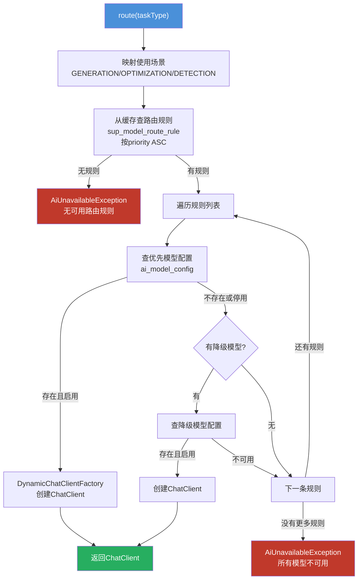

#### 3.1.6 AI模块需要的Mapper（只读）

AI模块需要**只读**访问 `ai_model_config` 和 `sup_model_route_rule` 两张表：

**新建文件**：

| 文件 | 路径 | 说明 |
|------|------|------|
| `AiModelConfigReadMapper` | `ai/mapper/AiModelConfigReadMapper.java` | 模型配置只读Mapper |
| `ModelRouteRuleReadMapper` | `ai/mapper/ModelRouteRuleReadMapper.java` | 路由规则只读Mapper |

> 命名加 `Read` 后缀，区别于Support模块的写Mapper，强调AI模块对这两张表只读不写。

---

### 3.2 Prompt管理

**目标**：统一管理各场景的Prompt模板，便于调优和维护。

**新建文件**：

| 文件 | 路径 | 说明 |
|------|------|------|
| `PromptTemplates` | `ai/prompt/PromptTemplates.java` | Prompt常量/模板集合 |
| `PromptBuilder` | `ai/prompt/PromptBuilder.java` | 动态Prompt构建器 |

**Prompt模板设计**：

| 场景 | System Prompt（核心要点） | User Prompt输入 |
|------|--------------------------|-----------------|
| 需求生成 | 你是招标文件编制专家，根据项目信息生成结构化的业务需求，输出Markdown格式 | 项目名称、类型、预算、描述、参考文档内容 |
| 评审项生成 | 你是评标专家，根据项目信息和需求内容生成评审标准体系，包含评分建议 | 项目信息、需求内容、评审方式、分值建议规则 |
| 敏感词检测 | 分析文本中的敏感词汇（歧视性、限制性、排他性表述），输出JSON格式的问题列表 | 待检测文本内容 |
| 错别字检测 | 检查文本中的错别字和语法错误，输出JSON格式的问题列表 | 待检测文本内容 |
| 政策审查 | 对照政策文件检查合规性，输出JSON格式的不合规项列表 | 待检测文本 + 政策文件内容 |
| 格式检测 | 检查招标文件格式规范（标题层级、编号规则、必要章节），输出JSON格式 | 待检测文本内容 |
| 文本优化 | 优化招标文件文本，提升专业性和规范性，保持原意 | 待优化文本 + 优化要求 |
| AI对话 | 你是招标文件编制助手，帮助用户解答招标相关问题、优化文本、提供建议 | 用户对话消息 |

**PromptBuilder 示例**：

```java
public class PromptBuilder {
    
    public static String buildRequirementGenerate(
            String projectName, String projectType, 
            String budget, String description, 
            String referenceContent) {
        return String.format(PromptTemplates.REQUIREMENT_GENERATE,
                projectName, projectType, budget, description, 
                referenceContent != null ? referenceContent : "无参考文档");
    }
}
```

---

### 3.3 AI助手服务（SSE直连）

**目标**：实现AI对话、文本优化的SSE流式响应接口，不走任务队列。

**新建文件**：

| 文件 | 路径 | 说明 |
|------|------|------|
| `AiChatController` | `ai/controller/AiChatController.java` | AI对话和优化接口 |
| `IAiChatService` | `ai/service/IAiChatService.java` | AI对话服务接口 |
| `AiChatServiceImpl` | `ai/service/impl/AiChatServiceImpl.java` | AI对话服务实现 |
| `ChatRequest` | `ai/dto/request/ChatRequest.java` | 对话请求DTO |
| `OptimizeRequest` | `ai/dto/request/OptimizeRequest.java` | 文本优化请求DTO |

**API端点**：

```
POST   /api/v1/ai/chat             - 对话式AI助手（SSE流式响应）
POST   /api/v1/ai/optimize         - 文本优化（SSE流式响应）
POST   /api/v1/ai/suggest          - 获取AI建议（同步响应）
```

**ChatRequest DTO**：

```java
public class ChatRequest {
    @NotBlank
    private String message;          // 用户消息
    private Long projectId;          // 关联项目ID（可选）
    private String context;          // 上下文内容（选中的文本等）
    private List<ChatMessage> history; // 对话历史（最近N轮）
}
```

**AiChatController 核心逻辑**：

```java
@RestController
@RequestMapping("/api/v1/ai")
public class AiChatController {

    @PostMapping(value = "/chat", produces = MediaType.TEXT_EVENT_STREAM_VALUE)
    @RequireLogin
    public SseEmitter chat(@RequestBody @Valid ChatRequest request) {
        SseEmitter emitter = new SseEmitter(60_000L); // 60秒超时
        aiChatService.streamChat(request, emitter);
        return emitter;
    }

    @PostMapping(value = "/optimize", produces = MediaType.TEXT_EVENT_STREAM_VALUE)
    @RequireLogin
    public SseEmitter optimize(@RequestBody @Valid OptimizeRequest request) {
        SseEmitter emitter = new SseEmitter(60_000L);
        aiChatService.streamOptimize(request, emitter);
        return emitter;
    }
    
    @PostMapping("/suggest")
    @RequireLogin
    public Result<String> suggest(@RequestBody @Valid ChatRequest request) {
        return Result.success(aiChatService.suggest(request));
    }
}
```

**AiChatServiceImpl 核心逻辑**：

```java
@Service
public class AiChatServiceImpl implements IAiChatService {

    @Autowired
    private ModelRouter modelRouter;

    @Override
    public void streamChat(ChatRequest request, SseEmitter emitter) {
        ChatClient chatClient = modelRouter.route(AiUsageScenario.OPTIMIZATION);
        
        // 构建对话Prompt
        String systemPrompt = PromptTemplates.AI_ASSISTANT;
        String userPrompt = buildChatPrompt(request);

        // 异步流式调用
        CompletableFuture.runAsync(() -> {
            try {
                Flux<String> stream = chatClient.prompt()
                        .system(systemPrompt)
                        .user(userPrompt)
                        .stream()
                        .content();

                stream.subscribe(
                    chunk -> sendSseEvent(emitter, chunk),
                    error -> completeSseWithError(emitter, error),
                    () -> emitter.complete()
                );
            } catch (Exception e) {
                completeSseWithError(emitter, e);
            }
        });

        // 注册断开连接回调
        emitter.onTimeout(emitter::complete);
        emitter.onCompletion(() -> log.debug("SSE连接关闭"));
    }
}
```

**SSE事件格式**：

```
event: message
data: {"content": "根据您的"}

event: message
data: {"content": "项目信息，"}

event: done
data: {"content": "[DONE]"}
```

---

### 3.4 文档匹配服务

**目标**：根据项目信息匹配历史业务需求，支持3种匹配模式。

**新建文件**：

| 文件 | 路径 | 说明 |
|------|------|------|
| `DocumentMatchController` | `ai/controller/DocumentMatchController.java` | 文档匹配接口 |
| `IDocumentMatchService` | `ai/service/IDocumentMatchService.java` | 匹配服务接口 |
| `DocumentMatchServiceImpl` | `ai/service/impl/DocumentMatchServiceImpl.java` | 匹配服务实现 |
| `MatchRequest` | `ai/dto/request/MatchRequest.java` | 匹配请求DTO |
| `MatchResultVO` | `ai/dto/response/MatchResultVO.java` | 匹配结果VO |

**API端点**：

```
POST   /api/v1/ai/match/auto       - 自动匹配历史需求
POST   /api/v1/ai/match/manual     - 手动选择匹配（返回候选列表）
```

**匹配策略**（暂不用向量检索，基于数据库查询）：

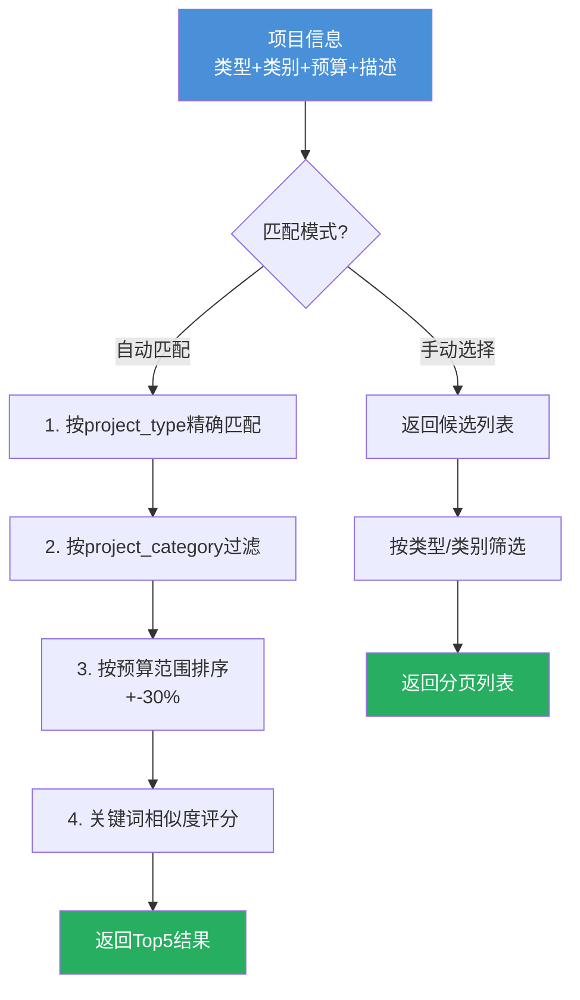

**匹配评分规则**（简单实现）：

| 维度 | 权重 | 计算方式 |
|------|------|----------|
| 项目类型完全匹配 | 40% | 相同=40分，不同=0分 |
| 项目类别完全匹配 | 20% | 相同=20分，不同=0分 |
| 预算范围相近 | 20% | 差异<10%=20分，<30%=10分，>30%=0分 |
| 关键词匹配 | 20% | 项目名称/描述的关键词重叠率 * 20 |

**MatchResultVO**：

```java
public class MatchResultVO {
    private Long requirementId;      // 历史需求ID
    private String requirementName;  // 需求名称
    private String projectName;      // 关联项目名称
    private String projectType;      // 项目类型
    private Integer similarity;      // 匹配度(0-100)
    private String contentPreview;   // 内容预览(前200字)
}
```

---

### 3.5 需求生成 + 评审项生成

**目标**：通过AI模型生成结构化的业务需求和评审项内容。

**说明**：这两个功能通过**任务队列异步处理**，不走SSE。前端通过轮询任务状态获取结果。

**新建文件**：

| 文件 | 路径 | 说明 |
|------|------|------|
| `RequirementGenerator` | `ai/generator/RequirementGenerator.java` | 需求生成器 |
| `ReviewItemGenerator` | `ai/generator/ReviewItemGenerator.java` | 评审项生成器 |
| `GenerateResultParser` | `ai/generator/GenerateResultParser.java` | AI输出JSON解析器 |

**需求生成流程（通过任务队列）**：

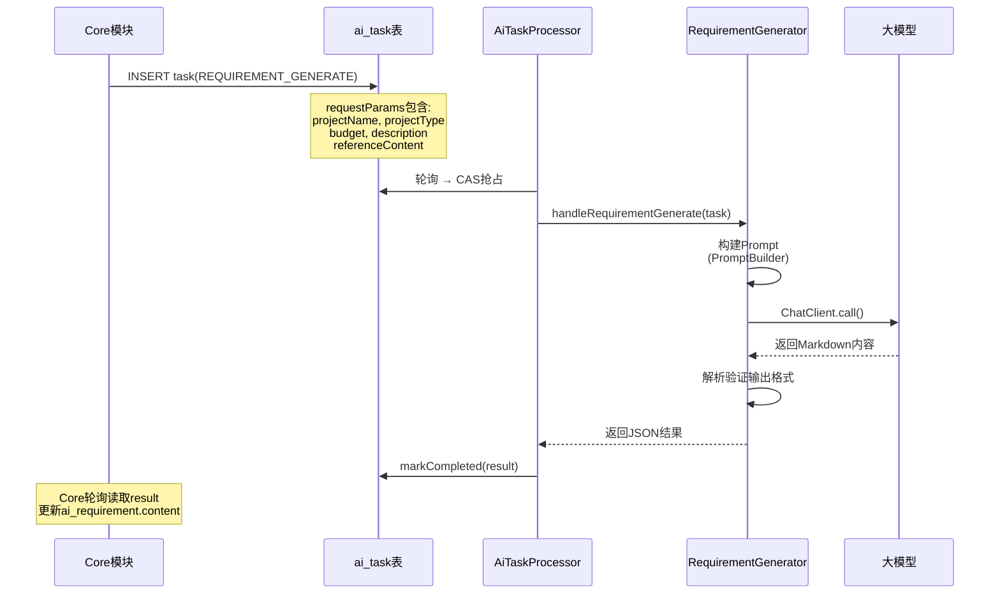

**RequirementGenerator 核心逻辑**：

```java
@Component
public class RequirementGenerator {

    @Autowired
    private ModelRouter modelRouter;

    public String generate(AiTask task) {
        Map<String, Object> params = parseRequestParams(task.getRequestParams());
        
        // 构建Prompt
        String prompt = PromptBuilder.buildRequirementGenerate(
            (String) params.get("projectName"),
            (String) params.get("projectType"),
            (String) params.get("budget"),
            (String) params.get("description"),
            (String) params.get("referenceContent")
        );
        
        // 路由到合适的模型
        ChatClient client = modelRouter.route(AiTaskType.REQUIREMENT_GENERATE);
        
        // 同步调用
        String content = client.prompt()
                .system(PromptTemplates.REQUIREMENT_GENERATE_SYSTEM)
                .user(prompt)
                .call()
                .content();
        
        // 包装结果
        return JsonUtil.toJson(Map.of("content", content));
    }
}
```

**评审项生成 - ReviewItemGenerator**：

输入参数：
- 项目信息（类型、类别、预算）
- 需求内容
- 评审方式（INTELLIGENT/MANUAL）
- 评分建议规则（如：货物类商务30-60分，资信10-25分）

输出格式：
```json
{
  "reviewItems": [
    {
      "name": "符合性审查",
      "level": 1,
      "children": [
        {
          "name": "营业执照",
          "level": 2,
          "content": "投标人须提供有效的营业执照副本...",
          "isRequired": true
        }
      ]
    },
    {
      "name": "技术标评审",
      "level": 1,
      "children": [
        {
          "name": "技术方案",
          "level": 2,
          "score": 30,
          "subjectivity": "SUBJECTIVE",
          "children": [
            {
              "name": "总体方案设计",
              "level": 3,
              "content": "...",
              "score": 15
            }
          ]
        }
      ]
    }
  ]
}
```

---

### 3.6 智能检测服务

**目标**：实现4类检测引擎，通过AI模型分析文本并返回结构化的问题列表。

#### 3.6.1 检测引擎架构

**新建文件**：

| 文件 | 路径 | 说明 |
|------|------|------|
| `DetectionEngine` | `ai/checker/DetectionEngine.java` | 检测引擎（编排器） |
| `BaseDetector` | `ai/checker/BaseDetector.java` | 检测器基类 |
| `SensitiveWordDetector` | `ai/checker/SensitiveWordDetector.java` | 敏感词检测器 |
| `TypoDetector` | `ai/checker/TypoDetector.java` | 错别字检测器 |
| `PolicyReviewDetector` | `ai/checker/PolicyReviewDetector.java` | 政策审查检测器 |
| `FormatCheckDetector` | `ai/checker/FormatCheckDetector.java` | 格式规范检测器 |
| `DetectionIssueVO` | `ai/dto/response/DetectionIssueVO.java` | 检测问题VO |

**类图**：

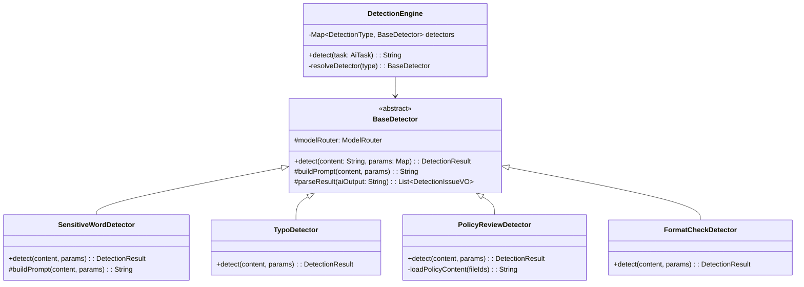

#### 3.6.2 检测类型详细设计

**敏感词检测 (SensitiveWordDetector)**：

| 项目 | 说明 |
|------|------|
| 输入 | 待检测文本（Markdown格式） |
| AI指令 | 检测歧视性、限制性、排他性、倾向性表述 |
| 输出格式 | `{issues: [{position, original, suggestion, reason, severity}], score}` |
| 评分规则 | 0个问题=100分，每个严重问题-10分，每个一般问题-5分 |

**错别字检测 (TypoDetector)**：

| 项目 | 说明 |
|------|------|
| 输入 | 待检测文本 |
| AI指令 | 检测错别字、语法错误、标点符号错误 |
| 输出格式 | `{issues: [{position, original, suggestion, reason}], score}` |
| 评分规则 | 0个问题=100分，每个错别字-3分 |

**政策审查 (PolicyReviewDetector)**：

| 项目 | 说明 |
|------|------|
| 输入 | 待检测文本 + 所选政策文件内容 |
| AI指令 | 对照政策文件检查合规性，列出不合规条款 |
| 输出格式 | `{issues: [{position, original, suggestion, policyReference, severity}], score}` |
| 特殊处理 | 需从file_ids加载政策文件内容作为参考 |

**格式检测 (FormatCheckDetector)**：

| 项目 | 说明 |
|------|------|
| 输入 | 待检测文本 |
| AI指令 | 检查标题层级规范、编号格式、必要章节完整性、字体格式建议 |
| 输出格式 | `{issues: [{position, original, suggestion, ruleViolated}], score}` |

#### 3.6.3 DetectionIssueVO

```java
public class DetectionIssueVO {
    private String position;       // 问题位置描述（如"第3段第2行"）
    private String original;       // 原文内容
    private String suggestion;     // 修改建议
    private String reason;         // 问题原因说明
    private String severity;       // 严重程度: HIGH/MEDIUM/LOW
    private String detectionType;  // 检测类型
    private String policyReference;// 相关政策引用（政策审查专用）
}
```

#### 3.6.4 检测结果汇总

检测引擎自动根据检测内容生成检查项（而非固定的4项），根据内容特征决定执行哪些检测：

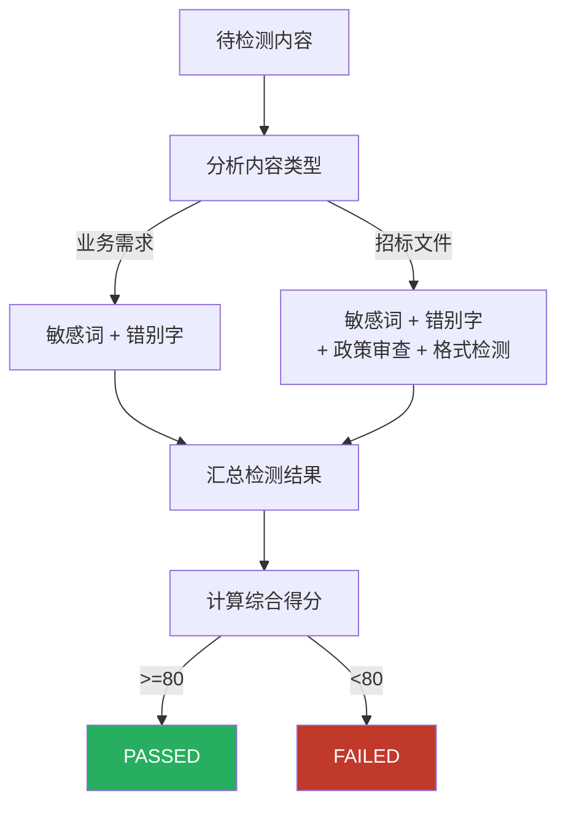

---

### 3.7 文档生成服务

**目标**：实现 Markdown → Word 的文档转换，生成完整招标文件。

**说明**：文档生成逻辑放在AI模块（`ai WordGenerator`），由Core模块通过任务队列触发。但由于需要读取模板和需求数据（都在同一个数据库），当前阶段先在Core模块内实现，后续需要分离时再迁移。

**改造文件**：

| 文件 | 路径 | 说明 |
|------|------|------|
| `MarkdownTemplateEngine` | `core/engine/MarkdownTemplateEngine.java` | **改造**：实现Markdown→HTML→Word |
| `WordDocumentGenerator` | `core/engine/WordDocumentGenerator.java` | **新建**：poi-tl Word生成器 |
| `DocumentIntegrationService` | `core/service/IDocumentIntegrationService.java` | **新建**：文档集成服务接口 |
| `DocumentIntegrationServiceImpl` | `core/service/impl/DocumentIntegrationServiceImpl.java` | **新建**：文档集成服务实现 |

**文档生成流程**：

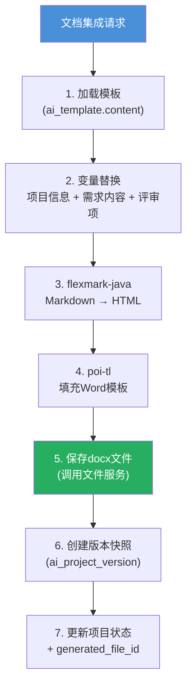

**变量替换规则**：

| 模板变量 | 数据来源 | 示例 |
|----------|----------|------|
| `{{projectName}}` | ai_project.project_name | "XX工程招标项目" |
| `{{projectCode}}` | ai_project.project_code | "ZBXM-2026-001" |
| `{{budget}}` | ai_project.budget | "1000.00万元" |
| `{{requirementContent}}` | ai_requirement.content | Markdown需求文本 |
| `{{reviewItems}}` | ai_review_item树形结构 | 格式化的评审标准表格 |
| `{{detectionSummary}}` | 检测结果汇总 | "检测通过，综合得分95分" |

---

### 3.8 AiTaskProcessor 实装

**目标**：将AiTaskProcessor中的7个TODO占位符替换为真实的AI调用逻辑。

**改造文件**：

| 文件 | 说明 |
|------|------|
| `AiTaskProcessor.java` | 注入各Generator/Detector，替换TODO为实际调用 |

**改造后的分发逻辑**：

```java
@Component
public class AiTaskProcessor {

    @Autowired private RequirementGenerator requirementGenerator;
    @Autowired private ReviewItemGenerator reviewItemGenerator;
    @Autowired private DetectionEngine detectionEngine;
    @Autowired private TextOptimizer textOptimizer;

    private String dispatch(AiTask task) {
        AiTaskType taskType = AiTaskType.fromCode(task.getTaskType());
        return switch (taskType) {
            case REQUIREMENT_GENERATE -> requirementGenerator.generate(task);
            case REVIEW_ITEM_GENERATE -> reviewItemGenerator.generate(task);
            case DETECTION_SENSITIVE_WORD,
                 DETECTION_TYPO,
                 DETECTION_POLICY_REVIEW,
                 DETECTION_FORMAT_CHECK -> detectionEngine.detect(task);
            case TEXT_OPTIMIZE -> textOptimizer.optimize(task);
        };
    }
}
```

**错误处理增强**：

```java
try {
    String result = dispatch(task);
    aiTaskMapper.markCompleted(task.getId(), result);
} catch (AiUnavailableException e) {
    // AI模型不可用，标记为AI_UNAVAILABLE
    aiTaskMapper.markFailed(task.getId(), "AI_UNAVAILABLE:" + e.getMessage());
    // 更新状态为AI_UNAVAILABLE（区别于普通FAILED）
} catch (Exception e) {
    if (task.getRetryCount() < task.getMaxRetry()) {
        // 还可重试，标记为FAILED
        aiTaskMapper.markFailed(task.getId(), e.getMessage());
    } else {
        // 超过最大重试次数，标记为FAILED终态
        aiTaskMapper.markFailed(task.getId(), "超过最大重试次数: " + e.getMessage());
    }
}
```

---

## 4. 新建文件清单汇总

### 4.1 AI模块 (ele-ai-tender-ai)

```
src/main/java/com/jy/eleaitender/ai/
├── model/
│   ├── ModelRouter.java                 [新建] 模型路由器（核心入口）
│   ├── DynamicChatClientFactory.java    [新建] 动态ChatClient工厂
│   ├── ModelConfigCacheService.java     [新建] 配置缓存服务(Redis+DB)
│   └── ModelConfigRefreshListener.java  [新建] Redis Pub/Sub刷新监听
├── prompt/
│   ├── PromptTemplates.java             [新建] Prompt模板常量
│   └── PromptBuilder.java              [新建] Prompt动态构建
├── controller/
│   ├── AiChatController.java            [新建] AI对话+优化接口(SSE)
│   └── DocumentMatchController.java     [新建] 文档匹配接口
├── service/
│   ├── IAiChatService.java              [新建] AI对话服务接口
│   ├── IDocumentMatchService.java       [新建] 匹配服务接口
│   └── impl/
│       ├── AiChatServiceImpl.java       [新建] AI对话服务实现
│       └── DocumentMatchServiceImpl.java [新建] 匹配服务实现
├── generator/
│   ├── RequirementGenerator.java        [新建] 需求生成器
│   ├── ReviewItemGenerator.java         [新建] 评审项生成器
│   ├── TextOptimizer.java               [新建] 文本优化器
│   └── GenerateResultParser.java        [新建] AI输出解析器
├── checker/
│   ├── DetectionEngine.java             [新建] 检测引擎(编排器)
│   ├── BaseDetector.java                [新建] 检测器基类
│   ├── SensitiveWordDetector.java       [新建] 敏感词检测器
│   ├── TypoDetector.java                [新建] 错别字检测器
│   ├── PolicyReviewDetector.java        [新建] 政策审查检测器
│   └── FormatCheckDetector.java         [新建] 格式规范检测器
├── dto/
│   ├── request/
│   │   ├── ChatRequest.java             [新建] 对话请求
│   │   ├── OptimizeRequest.java         [新建] 文本优化请求
│   │   └── MatchRequest.java            [新建] 匹配请求
│   └── response/
│       ├── MatchResultVO.java           [新建] 匹配结果
│       └── DetectionIssueVO.java        [新建] 检测问题
├── processor/
│   └── AiTaskProcessor.java             [改造] 注入实际处理器
└── mapper/
    ├── AiRequirementMapper.java         [新建] 需求Mapper(匹配查询)
    ├── AiModelConfigReadMapper.java     [新建] 模型配置只读Mapper
    └── ModelRouteRuleReadMapper.java    [新建] 路由规则只读Mapper
```

### 4.2 Core模块 (ele-ai-tender-core)

```
src/main/java/com/jy/eleaitender/core/
├── engine/
│   ├── MarkdownTemplateEngine.java      [改造] 实现Markdown→HTML
│   └── WordDocumentGenerator.java       [新建] poi-tl Word生成
├── service/
│   ├── IDocumentIntegrationService.java [新建] 文档集成服务接口
│   └── impl/
│       └── DocumentIntegrationServiceImpl.java [新建] 文档集成服务实现
```

### 4.3 Common模块 (ele-ai-tender-common)

```
src/main/java/com/jy/eleaitender/common/
├── exception/
│   └── AiUnavailableException.java      [新建] AI不可用异常
```

**总计**：新建约27个文件，改造3个文件（AiTaskProcessor + MarkdownTemplateEngine + Support Service发布刷新通知）。

---

## 5. 数据库变更

### 5.1 无新建表

本阶段**不新建数据库表**，所有表结构在Phase 1/2已创建完毕。

### 5.2 可能需要的字段扩展

| 表名 | 字段 | 类型 | 说明 |
|------|------|------|------|
| `ai_detection_record` | `issues` | JSON | 存储结构化的问题列表（当前result字段已覆盖，评估是否需要拆分） |

---

## 6. 实施步骤

### Step 1: 基础设施层（数据库驱动模型路由）

| 序号 | 任务 | 模块 | 依赖 |
|------|------|------|------|
| 1.1 | 实现 `AiUnavailableException` | common | 无 |
| 1.2 | 创建 `AiModelConfigReadMapper` 只读Mapper | ai | 无 |
| 1.3 | 创建 `ModelRouteRuleReadMapper` 只读Mapper | ai | 无 |
| 1.4 | 实现 `ModelConfigCacheService` 缓存服务（Redis+DB兜底） | ai | 1.2, 1.3 |
| 1.5 | 实现 `DynamicChatClientFactory` 动态ChatClient工厂 | ai | 无 |
| 1.6 | 实现 `ModelRouter` 模型路由器 | ai | 1.4, 1.5 |
| 1.7 | 实现 `ModelConfigRefreshListener` Redis Pub/Sub监听 | ai | 1.4 |
| 1.8 | Support模块最小改动：Service增删改后发布Redis刷新通知 | support | 1.7 |

### Step 2: Prompt管理

| 序号 | 任务 | 模块 | 依赖 |
|------|------|------|------|
| 2.1 | 编写 `PromptTemplates` 所有场景的Prompt | ai | 无 |
| 2.2 | 实现 `PromptBuilder` 动态构建器 | ai | 2.1 |

### Step 3: AI助手（SSE直连）

| 序号 | 任务 | 模块 | 依赖 |
|------|------|------|------|
| 3.1 | 创建 `ChatRequest`、`OptimizeRequest` DTO | ai | 无 |
| 3.2 | 实现 `IAiChatService` + `AiChatServiceImpl` | ai | 1.5, 2.2 |
| 3.3 | 实现 `AiChatController`（SSE接口） | ai | 3.2 |

### Step 4: 文档匹配

| 序号 | 任务 | 模块 | 依赖 |
|------|------|------|------|
| 4.1 | 创建 `MatchRequest`、`MatchResultVO` | ai | 无 |
| 4.2 | 创建 `AiRequirementMapper`（匹配查询SQL） | ai | 无 |
| 4.3 | 实现 `IDocumentMatchService` + Impl | ai | 4.2 |
| 4.4 | 实现 `DocumentMatchController` | ai | 4.3 |

### Step 5: 生成器

| 序号 | 任务 | 模块 | 依赖 |
|------|------|------|------|
| 5.1 | 实现 `GenerateResultParser` AI输出解析 | ai | 无 |
| 5.2 | 实现 `RequirementGenerator` 需求生成器 | ai | 1.5, 2.2, 5.1 |
| 5.3 | 实现 `ReviewItemGenerator` 评审项生成器 | ai | 1.5, 2.2, 5.1 |
| 5.4 | 实现 `TextOptimizer` 文本优化器 | ai | 1.5, 2.2 |

### Step 6: 检测引擎

| 序号 | 任务 | 模块 | 依赖 |
|------|------|------|------|
| 6.1 | 创建 `DetectionIssueVO` | ai | 无 |
| 6.2 | 实现 `BaseDetector` 基类 | ai | 1.5, 2.2 |
| 6.3 | 实现 `SensitiveWordDetector` | ai | 6.2 |
| 6.4 | 实现 `TypoDetector` | ai | 6.2 |
| 6.5 | 实现 `PolicyReviewDetector` | ai | 6.2 |
| 6.6 | 实现 `FormatCheckDetector` | ai | 6.2 |
| 6.7 | 实现 `DetectionEngine` 编排器 | ai | 6.3-6.6 |

### Step 7: 文档生成

| 序号 | 任务 | 模块 | 依赖 |
|------|------|------|------|
| 7.1 | 改造 `MarkdownTemplateEngine` | core | 无 |
| 7.2 | 实现 `WordDocumentGenerator` | core | 7.1 |
| 7.3 | 实现 `IDocumentIntegrationService` + Impl | core | 7.2 |

### Step 8: 任务处理器实装

| 序号 | 任务 | 模块 | 依赖 |
|------|------|------|------|
| 8.1 | 改造 `AiTaskProcessor`，注入实际处理器 | ai | 5.2-5.4, 6.7 |
| 8.2 | 增强错误处理和AI不可用降级 | ai | 8.1, 1.4 |

### Step 9: 集成测试

| 序号 | 任务 | 说明 |
|------|------|------|
| 9.1 | AI助手SSE流式响应测试 | 验证对话、文本优化的流式输出 |
| 9.2 | 需求生成端到端测试 | Core创建任务 → AI处理 → 结果回写 |
| 9.3 | 评审项生成端到端测试 | 验证三级结构的JSON解析 |
| 9.4 | 4类智能检测测试 | 验证问题检出率和输出格式 |
| 9.5 | 文档匹配测试 | 验证匹配评分准确性 |
| 9.6 | 文档生成测试 | Markdown→Word导出验证 |
| 9.7 | 模型路由测试 | 验证场景→模型的正确路由 |
| 9.8 | 降级测试 | 停止AI模型，验证降级策略 |
| 9.9 | 后端编译检查 | `mvn clean test` |

---

## 7. 10条Case预期结果

| 序号 | Case | 输入 | 预期结果 |
|------|------|------|----------|
| 1 | AI助手对话 | POST /ai/chat, message="招标文件格式要求是什么" | SSE流式返回招标格式说明，状态200 |
| 2 | 文本优化 | POST /ai/optimize, content="此次采购设备若干台" | SSE返回优化后的专业表述 |
| 3 | 自动匹配 | POST /ai/match/auto, projectType=ENGINEERING, budget=500 | 返回Top5相似历史需求，含匹配度评分 |
| 4 | 需求生成 | Core创建REQUIREMENT_GENERATE任务 | 5秒后任务变为PROCESSING，模型返回后COMPLETED，result含Markdown内容 |
| 5 | 评审项生成 | Core创建REVIEW_ITEM_GENERATE任务 | COMPLETED，result含三级树形JSON |
| 6 | 敏感词检测 | 文本含"仅限本地企业参与" | 检测出1条敏感词问题，severity=HIGH，score<100 |
| 7 | 错别字检测 | 文本含"招标文建编制" | 检测出"建"应为"件"，提供修改建议 |
| 8 | 政策审查 | 文本+政策文件ID | 对照政策文件输出不合规项列表 |
| 9 | AI不可用降级 | 模型API无法访问 | 任务10分钟后标记AI_UNAVAILABLE，前端提示可重试/跳过 |
| 10 | 文档生成 | 项目含完整需求+评审项+模板 | 生成.docx文件，变量正确替换，文件ID写入项目 |
| 11 | 动态配置刷新 | 管理员在支撑中心停用某模型 | AI模块秒级感知，路由自动切换到降级模型 |
| 12 | 路由规则生效 | GENERATION场景配置了本地模型优先+云端降级 | 需求生成任务优先走本地模型，失败后自动走云端 |

---

## 8. 依赖关系图

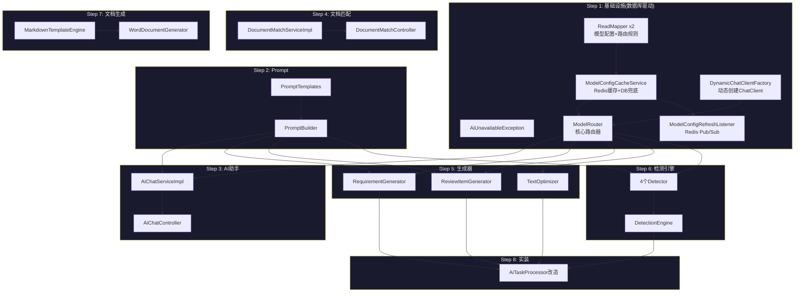

---

## 9. 关键设计决策

### 9.1 SSE vs 任务队列的选择

| 功能 | 通信方式 | 原因 |
|------|----------|------|
| AI对话 | SSE直连 | 需要实时流式响应，用户等待交互 |
| 文本优化 | SSE直连 | 同上 |
| AI建议 | 同步HTTP | 响应短，可同步等待 |
| 需求生成 | 任务队列 | 耗时长(可能30秒+)，异步不阻塞 |
| 评审项生成 | 任务队列 | 同上 |
| 智能检测 | 任务队列 | 4类检测串行执行，耗时长 |
| 文本优化(批量) | 任务队列 | 大段文本优化走任务队列 |

### 9.2 文档生成放Core还是AI

当前方案：**放Core模块**。原因：
- 文档生成需要读取模板、需求、评审项数据（都在同一数据库）
- flexmark-java和poi-tl是纯工具库，不需要AI模型
- 避免Core→AI的额外网络调用
- 后续如需分离，只需将引擎类迁移到AI模块

### 9.3 模型配置数据库驱动（而非配置文件）

当前方案：**模型配置和路由规则全部从数据库获取**。原因：
- 支撑中心管理员可在界面上动态增删改模型配置和路由规则，无需重启服务
- 通过 Redis Pub/Sub 实现配置变更实时通知，AI模块秒级刷新
- `sup_model_route_rule` 表支持按场景配置优先模型和降级模型，灵活度高
- `ai_model_config` 表存储端点、密钥（AES加密）、参数，集中管理安全性好
- `application.yml` 仅保留 Spring AI 自动装配所需的占位默认值，不承载业务配置

**已有基础**（Support模块已完整实现）：
- `ModelConfigController` — 模型配置 CRUD（GET/POST/PUT/DELETE/active）
- `ModelRouteRuleController` — 路由规则 CRUD + 按场景查询生效规则
- `AiModelConfig` 实体 + `SupModelRouteRule` 实体 + `ModelRouteRuleVO`
- AI模块只需**只读**访问这两张表

### 9.4 文档匹配不走向量检索

当前阶段采用**数据库关键字匹配 + 规则评分**，原因：
- 知识库向量化暂不实现
- 数据库匹配足够满足基本匹配需求
- 后续接入向量检索只需替换匹配算法，接口不变

---

## 10. 风险与应对

| 风险 | 影响 | 应对措施 |
|------|------|----------|
| 大模型API不稳定 | 任务频繁失败 | 重试3次 + 超时降级 + 用户可跳过 |
| AI输出格式不标准 | JSON解析失败 | GenerateResultParser做容错解析，提取关键内容 |
| Prompt效果不佳 | 生成质量低 | PromptTemplates集中管理，便于迭代调优 |
| SSE连接超时 | 用户体验差 | 60秒超时 + 前端断线重连 |
| 检测误报率高 | 用户信任度低 | 支持单条接受/拒绝，后续根据反馈优化Prompt |
| Token消耗过快 | 成本不可控 | ai_model_config记录token_usage，支持限额 |
