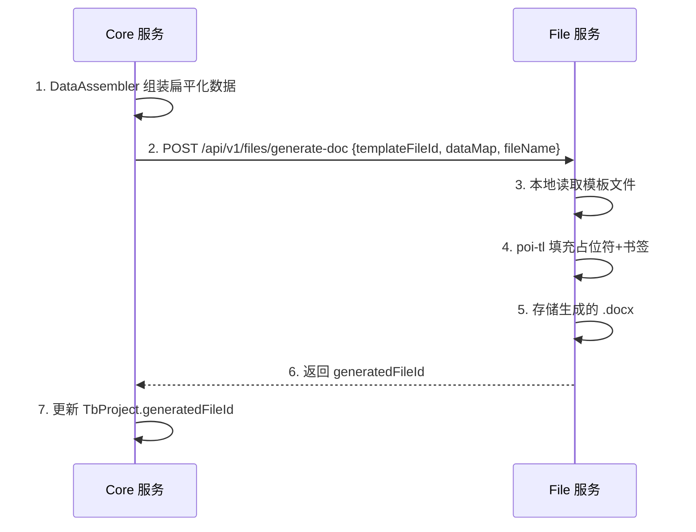
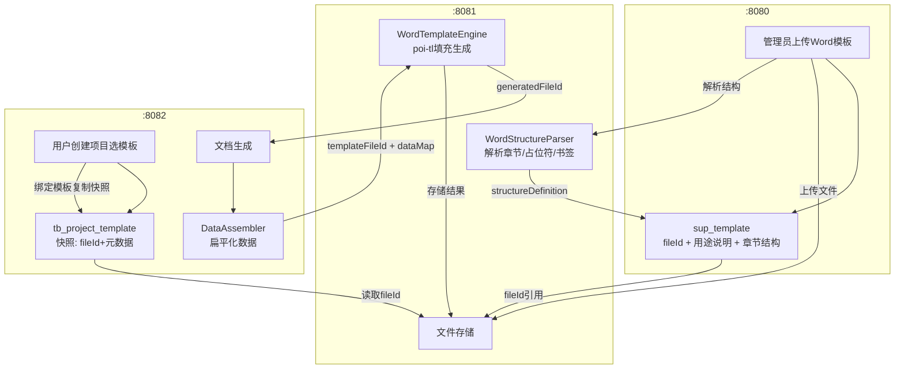

# 模板模块重构设计

> 日期: 2026-04-22
> 状态: 待实施

## 背景

当前模板模块存在以下问题：

1. **模板格式不适用**：模板以 Markdown 格式存储和编辑，但实际业务需要 Word 模板预留占位符进行文档集成
2. **项目与模板耦合**：`tb_project.template_id` 直接外键引用 `sup_template`，sup_template 变更直接影响已有项目
3. **文档生成硬编码**：`DocumentIntegrationServiceImpl.buildMarkdownDocument()` 硬编码生成 Markdown，未使用模板内容

## 需求

1. `sup_template` 新增 `fileId` 字段，支撑中心上传 Word 模板文件替代手填 Markdown
2. `content` 字段改为"模板用途说明"，`structureDefinition` 改为"Word 章节结构 JSON"（上传时后端解析）
3. 新建 `tb_project_template` 表，项目引用模板时复制快照到该表，与 `sup_template` 隔离
4. 文档生成改为 Word 模板填充：poi-tl 填充 `{{变量名}}` + Word 书签
5. Word 章节结构解析和文档生成引擎均放在 File 服务

## 数据库变更

### sup_template 表

```sql
-- 新增字段
ALTER TABLE sup_template ADD COLUMN file_id BIGINT DEFAULT NULL COMMENT '模板文件ID(关联file_info)' AFTER project_type;
ALTER TABLE sup_template ADD INDEX idx_file_id (file_id);

-- content 改为可空（语义从"模板内容(Markdown)"改为"模板用途说明"）
ALTER TABLE sup_template MODIFY COLUMN content LONGTEXT DEFAULT NULL COMMENT '模板用途说明';
```

实体 `SupTemplate` 新增 `fileId`(Long) 字段，`content`/`structureDefinition` 更新 Schema 描述。

### tb_project_template 表（新建）

```sql
CREATE TABLE IF NOT EXISTS tb_project_template (
    id                    BIGINT       NOT NULL AUTO_INCREMENT COMMENT '主键',
    project_id            BIGINT       NOT NULL COMMENT '项目ID',
    template_id           BIGINT       NOT NULL COMMENT '源模板ID(sup_template.id)',
    template_code         VARCHAR(50)  NOT NULL COMMENT '模板编码(快照)',
    template_name         VARCHAR(100) NOT NULL COMMENT '模板名称(快照)',
    project_category      VARCHAR(30)  NOT NULL COMMENT '适用项目类别(快照)',
    project_type          VARCHAR(30)  NOT NULL COMMENT '适用项目类型(快照)',
    file_id               BIGINT       DEFAULT NULL COMMENT '模板文件ID(快照，引用sup_template.file_id)',
    content               TEXT         DEFAULT NULL COMMENT '模板用途说明(快照)',
    structure_definition  JSON         DEFAULT NULL COMMENT 'Word章节结构JSON(快照)',
    version_no            INT          NOT NULL DEFAULT 1 COMMENT '模板版本号(快照)',
    create_time           DATETIME     NOT NULL COMMENT '创建时间',
    create_id             BIGINT       NOT NULL DEFAULT 0 COMMENT '创建人ID',
    create_name           VARCHAR(50)  NOT NULL DEFAULT '' COMMENT '创建人名称',
    modify_time           DATETIME     NOT NULL COMMENT '修改时间',
    modify_id             BIGINT       NOT NULL DEFAULT 0 COMMENT '修改人ID',
    modify_name           VARCHAR(50)  NOT NULL DEFAULT '' COMMENT '修改人名称',
    ver                   INT          NOT NULL DEFAULT 1 COMMENT '乐观锁版本号',
    is_delete             TINYINT      NOT NULL DEFAULT 0 COMMENT '逻辑删除: 0-未删除 1-已删除',
    PRIMARY KEY (id),
    UNIQUE INDEX uk_project_id (project_id),
    INDEX idx_template_id (template_id)
) ENGINE=InnoDB DEFAULT CHARSET=utf8mb4 COLLATE=utf8mb4_general_ci COMMENT='项目模板表(只读快照)';
```

设计要点：
- 唯一索引 `uk_project_id`：一个项目只引用一个模板
- 快照字段：从 sup_template 复制，项目只读不可修改
- 无 `status`/`isDefault`：这些是 sup_template 管理属性

### tb_project 表

```sql
-- template_id 语义从引用 sup_template.id 改为引用 tb_project_template.id
ALTER TABLE tb_project MODIFY COLUMN template_id BIGINT DEFAULT NULL COMMENT '项目模板ID(关联tb_project_template)';
```

## 后端变更

### 实体层

**新增** `TbProjectTemplate`（`ele-ai-tender-common/entity/core/`）：

| 字段 | 类型 | 说明 |
|------|------|------|
| projectId | Long | 项目ID |
| templateId | Long | 源模板ID |
| templateCode | String | 模板编码(快照) |
| templateName | String | 模板名称(快照) |
| projectCategory | String | 适用项目类别(快照) |
| projectType | String | 适用项目类型(快照) |
| fileId | Long | 模板文件ID(快照) |
| content | String | 模板用途说明(快照) |
| structureDefinition | String | Word章节结构JSON(快照) |
| versionNo | Integer | 模板版本号(快照) |

**修改** `SupTemplate`：新增 `fileId`，更新 `content`/`structureDefinition` 描述。

### Mapper 层

- 新增 `ProjectTemplateMapper`（`ele-ai-tender-core/mapper/`），继承 `BaseMapper<TbProjectTemplate>`
- `SupTemplateMapper` 不变

### Service 层

**新增** `IProjectTemplateService`（`ele-ai-tender-core/service/`）：

```java
public interface IProjectTemplateService {
    /** 项目引用模板 — 从sup_template快照到tb_project_template */
    TbProjectTemplate bindTemplate(Long projectId, Long supTemplateId);

    /** 获取项目的模板引用 */
    TbProjectTemplate getByProjectId(Long projectId);

    /** 删除项目的模板引用（项目删除时级联） */
    void deleteByProjectId(Long projectId);
}
```

实现要点：
- `bindTemplate()`：读取 sup_template → 复制字段到 tb_project_template → 更新 TbProject.templateId 指向新记录
- 唯一约束保证一个项目只有一条记录，重复绑定时先删旧再建新

**修改** `ITemplateConfigService`（Support 模块）：
- create()/update() 处理 fileId
- 保存时调 file 服务解析 Word 结构，写入 structureDefinition

### Controller 层

**Support 模块** `TemplateConfigController`：
- 创建/更新模板接口新增 fileId 参数

**Core 模块** 新增 `ProjectTemplateController`：

| 方法 | 路径 | 功能 |
|------|------|------|
| POST | /api/v1/project-templates/bind | 项目绑定模板 |
| GET | /api/v1/project-templates/project/{projectId} | 获取项目模板 |

### File 服务新增

| 组件 | 路径 | 职责 |
|------|------|------|
| WordStructureParser | ele-ai-tender-file/engine/ | 解析 Word 章节/占位符/书签结构 |
| WordTemplateEngine | ele-ai-tender-file/engine/ | poi-tl 模板填充，支持 {{变量名}} + 书签 |

**新增端点**：

| 方法 | 路径 | 功能 |
|------|------|------|
| GET | /api/v1/files/{id}/structure | 获取 Word 文档章节结构 |
| POST | /api/v1/files/generate-doc | 生成文档（传入 templateFileId + dataMap + fileName） |

**WordStructureParser 输出结构**：

```json
{
  "chapters": [
    { "level": 1, "title": "招标公告", "bookmarks": ["projectName", "projectCode"] },
    { "level": 2, "title": "项目基本信息", "bookmarks": ["budget", "tenderUnit"] }
  ],
  "placeholders": ["projectName", "budget", "contactPerson"],
  "bookmarks": ["projectName", "projectCode"]
}
```

**InternalFileServiceClient 新增方法**：

```java
/** 获取Word文档章节结构 */
WordStructureVO getFileStructure(Long fileId);

/** 基于模板生成文档 */
Long generateDocument(Long templateFileId, Map<String, Object> data, String fileName);
```

### 文档生成流程改造

**DocumentDataAssembler 变更**：输出转为 poi-tl 友好的扁平结构

```java
// 旧: 直接放领域实体
data.put("complianceItems", List<TbProjectReviewItem>);

// 新: 扁平化为 Map
data.put("complianceItems", List<Map<String, String>>);
// 每个 Map: {itemName, itemContent, score, level}
```

**DocumentIntegrationServiceImpl.integrate() 改为**：

```java
Map<String, Object> data = dataAssembler.assemble(projectId);
TbProjectTemplate pt = projectTemplateService.getByProjectId(projectId);
Long generatedFileId = fileServiceClient.generateDocument(
    pt.getFileId(), data, project.getProjectName() + ".docx");
project.setGeneratedFileId(generatedFileId);
projectMapper.updateById(project);
```

**调用链路**：



**现有组件处置**：

| 组件 | 处置 | 原因 |
|------|------|------|
| MarkdownTemplateEngine | 保留 | HTML 预览场景仍需要 |
| WordDocumentGenerator | 废弃 | HTML→Word 方式不再使用 |
| buildMarkdownDocument() | 废弃 | 硬编码 Markdown 生成不再使用 |

## 前端变更

### 支撑中心前端 (ele-ai-tender-support-frontend)

**TemplateList.vue 变更**：

| 变更项 | 旧 | 新 |
|--------|----|----|
| 模板内容编辑 | Markdown 编辑器 | 文件上传组件（上传 .docx） |
| 新增模板表单 | 填写 Markdown | 上传 Word 文件 + 填写用途说明 |
| 编辑模板表单 | 编辑 Markdown | 可替换 Word 文件 + 编辑用途说明 |
| 模板预览 | Markdown 渲染预览 | 展示文档结构树（从 structureDefinition 解析） |

**类型定义更新**（`src/types/template.ts`）：

```typescript
export interface TemplateInfo {
  // ... 保留原有字段
  fileId?: number           // 新增: 模板文件ID
  content?: string          // 语义变更: 模板用途说明
  structureDefinition?: {   // 语义变更: Word章节结构
    chapters: { level: number; title: string; bookmarks?: string[] }[]
    placeholders: string[]
    bookmarks: string[]
  }
}
```

**新增/编辑模板流程**：

1. 用户上传 Word 文件 → file 服务返回 fileId
2. 用户填写模板名称、类别、类型、用途说明
3. 提交表单 → Support 后端保存模板 + 调 file 服务解析结构
4. 后端返回模板详情（含 structureDefinition）

### AI编制前端 (ele-ai-tender-frontend)

**PhaseBasicInfo.vue 模板选择**：

| 变更项 | 旧 | 新 |
|--------|----|----|
| 模板卡片内容 | Markdown 预览 | 显示文档结构树 + 用途说明 |
| 模板详情弹窗 | Markdown 渲染 | 展示章节结构 + 占位符列表 |

**ProjectCreate.vue**：下拉选项显示模板名称 + 类别标签（无大改动）

**文档预览页面**：

| 变更项 | 旧 | 新 |
|--------|----|----|
| 预览方式 | Markdown 编辑器渲染 | docx-preview 组件预览生成的 .docx |
| 编辑方式 | Markdown 文本编辑 | 在线编辑暂不支持（后续迭代） |

## 边界情况

| 场景 | 处理策略 |
|------|----------|
| 项目创建时未选模板 | templateId 为空，文档生成阶段提示"请先选择模板" |
| sup_template 被删除/禁用 | 已绑定项目不受影响（读 tb_project_template 快照），新建项目选不到该模板 |
| sup_template 更新文件 | 已绑定项目仍用旧快照，新项目绑定时复制最新数据 |
| Word 模板无占位符/书签 | WordTemplateEngine 原样输出，structureDefinition 记录空结构 |
| 模板文件损坏/丢失 | 文档生成时 file 服务报错，Core 捕获异常返回友好提示 |
| 项目重新选择模板 | 删除旧 tb_project_template 记录，重新绑定新模板 |

## 数据迁移

```sql
-- 1. sup_template 新增 file_id 列
ALTER TABLE sup_template ADD COLUMN file_id BIGINT DEFAULT NULL COMMENT '模板文件ID(关联file_info)' AFTER project_type;

-- 2. content 改为可空
ALTER TABLE sup_template MODIFY COLUMN content LONGTEXT DEFAULT NULL COMMENT '模板用途说明';

-- 3. 迁移 tb_project.template_id: 将引用的 sup_template 记录复制到 tb_project_template
-- 遍历 tb_project 中 template_id 非空的记录，复制快照，更新 template_id 指向新表
```

迁移脚本逻辑（一次性执行）：

```
FOR EACH project WHERE template_id IS NOT NULL:
    supTemplate = SELECT * FROM sup_template WHERE id = project.template_id
    INSERT INTO tb_project_template
      (project_id, template_id, template_code, template_name,
       project_category, project_type, file_id, content,
       structure_definition, version_no, ...)
    VALUES
      (project.id, supTemplate.id, supTemplate.template_code, supTemplate.template_name,
       supTemplate.project_category, supTemplate.project_type, supTemplate.file_id, supTemplate.content,
       supTemplate.structure_definition, supTemplate.version_no, ...)
    UPDATE tb_project SET template_id = LAST_INSERT_ID() WHERE id = project.id
END FOR
```

## 整体数据流


