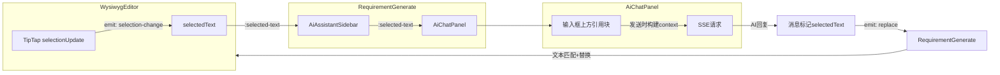

# AI聊天选中内容带入与替换 — 功能设计

## 概述

用户在详细需求生成页面中选中文字后，选中内容自动带入AI聊天面板，随用户消息一起发送给后端。AI回复后，自动替换编辑器中的选中原文，需用户确认。

## 交互流程

```mermaid
flowchart TD
    A[用户在编辑器中选中文字] -->|TipTap selectionUpdate 300ms防抖| B[selectedText 更新]
    B --> C[聊天面板输入框上方显示引用块]
    C --> D{用户操作}
    D -->|点击 ✕ 关闭引用| E[清除 selectedText]
    D -->|用户输入消息| F[发送: context=selectedText]
    D -->|快捷操作按钮| G[发送: context=selectedText || 完整内容]
    F --> H[AI流式回复]
    G --> H
    H --> I{selectedText 是否为空?}
    I -->|是| J[普通消息, 无替换]
    I -->|否| K[消息气泡底部显示 替换/取消 操作栏]
    K -->|点击 应用替换| L[编辑器中查找 selectedText]
    K -->|点击 取消| M[操作栏消失, AI回复保留]
    L -->|唯一匹配| N[替换 + 成功提示]
    L -->|多处匹配| O[替换第一处 + 提示存在多处]
    L -->|未找到| P[提示 原文已被修改 请手动替换]
```

## 数据流与组件变更



## 组件变更清单

| 层级 | 文件 | 变更 |
|------|------|------|
| 类型 | `types/ai.ts` | AiChatMessage 新增 `selectedText?: string` |
| 编辑器 | `WysiwygEditor.vue` | 监听 TipTap `selectionUpdate`，emit `selection-change` 事件 |
| 页面 | `RequirementGenerate.vue` | 新增 `selectedText` ref，接收编辑器选中 → 传给 Sidebar → 处理 replace 事件 |
| 侧边栏 | `AiAssistantSidebar.vue` | 透传 `selectedText` prop，透传 `replace` emit |
| 聊天面板 | `AiChatPanel.vue` | 引用块UI + 区分发送逻辑 + 替换操作栏 + emit `replace` |

## 详细设计

### 1. WysiwygEditor — 选中事件

监听 TipTap `selectionUpdate`，300ms 防抖：

- 选中文本 ≥ 5 字符 → emit `selection-change` 传递选中文本
- 选中文本 < 5 字符或无选中 → emit `selection-change` 传递空字符串

```typescript
// 新增 emit
const emit = defineEmits<{
  'selection-change': [text: string]
}>()

// 在 editor 初始化后监听
editor.on('selectionUpdate', ({ editor }) => {
  clearTimeout(selectionTimer)
  selectionTimer = setTimeout(() => {
    const text = editor.state.selection.empty
      ? ''
      : editor.state.doc.textBetween(
          editor.state.selection.from,
          editor.state.selection.to,
          '\n'
        )
    emit('selection-change', text.length >= 5 ? text : '')
  }, 300)
})
```

### 2. AiChatMessage 类型扩展

```typescript
export interface AiChatMessage {
  role: 'user' | 'assistant'
  content: string
  timestamp: number
  error?: boolean
  uid?: string
  isGreeting?: boolean
  /** 用户选中的原文，用于后续替换定位。仅用户消息携带，AI回复通过相邻位置关联 */
  selectedText?: string
}
```

### 3. AiChatPanel — 引用块 UI

输入框上方、快捷操作下方，有 selectedText 时显示：

- 左侧图标 + "选中的内容" 标题 + 右上角 ✕ 关闭按钮
- 内容区域最多 3 行，超出截断 + 省略号
- 发送消息后自动清除引用块
- selectedText 为空时不显示

### 4. AiChatPanel — 用户消息气泡

带 selectedText 发送的用户消息，气泡内展示引用：

- 引用部分左侧竖线标识，背景色区分
- 下方显示用户实际输入
- 普通消息（不带选中内容）显示不变

### 5. AiChatPanel — context 构建逻辑

两种场景区分处理：

| 场景 | context 值 | 理由 |
|------|-----------|------|
| 快捷操作 | `selectedText \|\| props.context` | 预设提示词需要上下文，没选中用全文 |
| 用户输入 | `selectedText \|\| ''` | 用户主动输入，没选中即普通对话 |

替换规则：**只要 selectedText 不为空，AI 回复就触发替换确认流程**，不区分触发方式。

### 6. AiChatPanel — 替换操作栏

AI 回复完成且消息关联 selectedText 时，消息气泡底部显示操作栏：

- "应用替换" 按钮 → emit `replace` 事件，携带 `{ selectedText, replacement }`
- "取消" 按钮 → 操作栏消失，AI 回复保留在聊天记录
- 用户操作后操作栏消失

### 7. RequirementGenerate — 替换逻辑

接收 `replace` 事件后：

```
在 content 中查找 selectedText
    ├── 找到（唯一匹配）→ 替换 + ElMessage.success
    ├── 找到（多处匹配）→ 替换第一处 + ElMessage.warning("存在多处相同内容，已替换第一处")
    └── 未找到 → ElMessage.warning("原文已被修改，请手动替换")
```

替换通过修改 `content` ref 实现（v-model 双向绑定，TipTap 自动同步）。

## 边界情况

| 场景 | 处理 |
|------|------|
| AI 回复包含 Markdown 格式 | 替换时直接用 AI 回复原文，TipTap Markdown 扩展自动渲染 |
| 选中后用户又手动修改了编辑器 | 匹配失败 → 提示"原文已被修改" |
| 选中内容在编辑器中出现多次 | 替换第一处 + 提示"存在多处相同内容" |
| 连续选中新内容 | 后选中的覆盖先前的，引用块实时更新 |
| 发送中用户又选中了新内容 | 忽略，发送完成后才处理新选中 |
| 选中文本 < 5 字符 | 不视为有效选中，不显示引用块 |

## 不影响现有功能

- 检测高亮（DetectionHighlight）不受影响
- 消息反馈（like/dislike）不受影响
- 无选中内容时，行为与现在完全一致
- 后端零改动，context 字段语义不变
