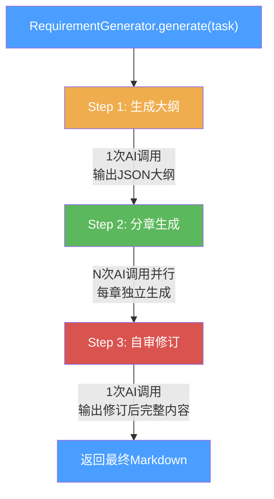
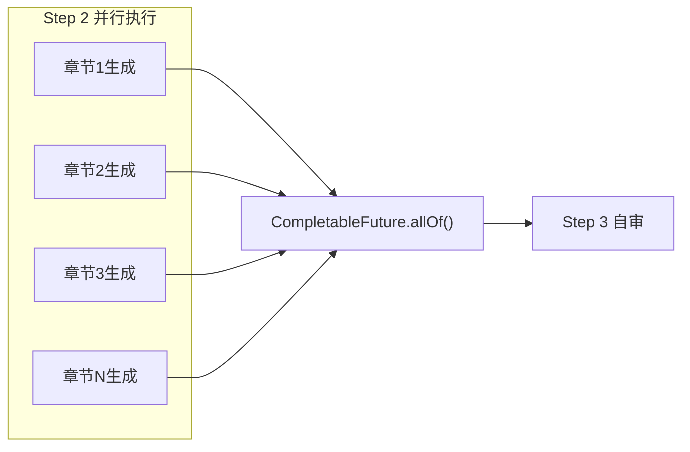

# 需求生成器 Agent 化改造设计

> 日期: 2026-06-14
> 状态: 已批准

## 1. 背景与问题

当前 `RequirementGenerator` 采用单次 AI 调用生成需求内容，存在以下问题：

1. **输出内容短**：单次调用通常只能输出 2-3 千字，远达不到正式招标文件级别
2. **内容泛泛**：Prompt 只传基础项目信息（名称、类型、预算、描述），缺乏结构化指导
3. **无自审**：生成后没有审查和修订环节，内容质量无法保证
4. **System Prompt 写 "不少于10000字" 但 AI 实际做不到**

## 2. 目标

将需求生成器从"单次调用"改造为"Agent 三步式编排"，生成正式招标文件级别的详细业务需求（几十页）。

### 成功标准

- 生成的需求内容达到正式招标需求书级别（项目概况、采购清单、技术规格参数、商务要求、验收标准等完整章节）
- 总字数 8000-15000 字（Markdown 格式）
- 章节结构清晰、条款编号规范、技术参数具体可量化
- 章节间无重复/矛盾内容

## 3. 方案选型

| 方案 | 描述 | 优点 | 缺点 | 结论 |
|------|------|------|------|------|
| A: Generator 内部编排 | 三步逻辑封装在 RequirementGenerator 内部 | 改动集中、风险低、完全兼容现有架构 | Generator 变复杂 | **采用** |
| B: 多个 AiTask 子任务 | 拆成 3 种 AiTaskType | 进度追踪清晰 | 改动大、破坏任务语义、风险高 | 不采用 |
| C: 外部编排 | 前端/core 编排多次调用 | Generator 不变 | 破坏异步解耦架构 | 不采用 |

## 4. 架构设计

### 4.1 三步式流程



### 4.2 Step 1 - 生成大纲

**职责**：AI 根据项目信息生成结构化的章节大纲

**输入**：项目名称、项目类型、项目类别、预算、描述

**输出**：JSON 格式的大纲结构

```json
{
  "projectOverview": "项目概况摘要（用于Step2每个章节的上下文）",
  "chapters": [
    {
      "chapterKey": "project_overview",
      "chapterTitle": "项目概况与采购范围",
      "corePoints": "项目背景、采购目标、采购范围、项目预算及资金来源...",
      "estimatedWords": 3000
    },
    {
      "chapterKey": "technical_specs",
      "chapterTitle": "技术规格与参数要求",
      "corePoints": "核心技术指标、性能参数、配置要求...",
      "estimatedWords": 4000
    }
  ]
}
```

**章节数量与类型**根据项目类型动态生成：
- **工程类**：项目概况、采购范围、技术规格、施工要求、质量验收、商务要求、服务要求、其他要求（8章）
- **货物类**：项目概况、采购清单、技术规格参数、质量标准、商务要求、交货验收、售后服务、其他要求（8章）
- **服务类**：项目概况、服务范围、服务内容与要求、人员配备、服务质量、商务要求、其他要求（7章）

### 4.3 Step 2 - 分章生成

**职责**：按大纲并行生成每个章节的详细内容

**并行策略**：`CompletableFuture` 并行发起所有章节的 AI 调用

**每个章节调用的上下文**：
- 完整大纲目录（让 AI 知道该章节在全文中的位置，避免与其他章节内容重复）
- 本章节的 `corePoints`（核心要点）
- `projectOverview`（项目概况摘要）
- 项目基础信息（名称、类型、预算等）
- 参考文档内容（如有 fileIds）

**失败处理**：
- 单章节失败重试 1 次
- 仍失败则用占位文本：`> ⚠️ 本章节内容生成失败，请手动补充`

**拼接规则**：按大纲顺序拼接，章节间用 `---` 分隔

### 4.4 Step 3 - 审查与局部修订

**职责**：对全文进行审查，发现问题后输出局部修订指令，代码层执行替换

**审查维度**：
1. 章节间是否有内容重复或矛盾
2. 技术参数是否前后一致
3. 条款是否足够具体可量化
4. 是否有歧视性/限制性/排他性表述
5. 章节间逻辑衔接是否自然
6. 编号是否连续一致

**修订方式**：AI 输出修订列表（JSON），每项包含原文片段和替换文本，Java 代码按原文匹配替换。避免 AI 重写全文导致截断和 token 浪费。

## 5. Prompt 设计

### 5.1 Step 1 - 大纲生成 Prompt

**System Prompt**：

```
你是招标文件规划专家。根据项目信息，规划招标需求文档的章节大纲。

规划原则：
1. 根据项目类型（工程/货物/服务）选择对应的章节模板
2. 每个章节的corePoints要具体到该章节应涵盖哪些子主题
3. 根据项目预算和复杂度合理分配各章节预估字数
4. 确保章节之间无内容重叠
5. 章节顺序应符合招标文件规范

输出JSON格式（不要添加markdown代码块标记）：
{
  "projectOverview": "项目概况摘要（50-100字，用于后续章节生成时提供上下文）",
  "chapters": [
    {
      "chapterKey": "英文标识",
      "chapterTitle": "章节标题",
      "corePoints": "核心要点，描述该章节需要涵盖的具体子主题和内容方向",
      "estimatedWords": 预估字数
    }
  ]
}

总预估字数应为8000-15000字，章节数量6-10个。
```

**User Prompt**：

```
请根据以下项目信息规划招标需求文档的大纲：

项目名称：{projectName}
项目类型：{projectType}
项目类别：{projectCategory}
项目预算：{budget}元
项目描述：{description}
```

### 5.2 Step 2 - 分章生成 Prompt

**System Prompt**：

```
你是资深招标文件编制专家，专门负责编写招标需求文档的特定章节。

编写要求：
1. 严格按照给定的核心要点展开，不要遗漏任何要点
2. 输出Markdown格式，使用###作为小节标题
3. 每个需求条款必须编号（如 1.1、1.2、1.3）
4. 技术参数必须明确数值范围，不能使用"适当""合理"等模糊表述
5. 条款表述要严谨、可验证、符合招投标法规
6. 避免歧视性、限制性、排他性表述
7. 字数不少于该章节的预估字数
8. 不要输出本章节以外的内容，其他章节由其他专家编写

输出要求：
- 直接输出章节正文内容（不需要重复章节标题）
- 使用Markdown标题层级（###、####）
- 关键参数用表格呈现时使用Markdown表格
```

**User Prompt**：

```
项目概况：{projectOverview}

完整大纲目录：
{outlineDirectory}

当前需要编写的章节：
章节标题：{chapterTitle}
核心要点：{corePoints}
预估字数：{estimatedWords}字

请编写本章节的详细内容：
```

### 5.3 Step 3 - 审查与局部修订 Prompt

**System Prompt**：

```
你是招标文件审稿专家。审查以下招标需求文档，找出需要修订的问题。

审查要点：
1. 章节间内容重复或矛盾
2. 技术参数前后不一致
3. 条款模糊、不够具体可量化
4. 歧视性、限制性、排他性表述
5. 编号不连续或不一致
6. 严重的逻辑衔接问题

输出JSON格式（不要添加markdown代码块标记）：
{
  "revisions": [
    {
      "original": "原文中需要修改的片段（必须逐字复制原文）",
      "revised": "修改后的文本",
      "reason": "修改原因"
    }
  ]
}

重要规则：
- original字段必须从原文中逐字复制，不得添加、删除或修改任何字符
- 只输出确实需要修订的问题，不需要修改的地方不要列出
- 如果文档质量良好无需修订，输出 {"revisions": []}
- 不要为了修改而修改，仅修复实质性错误和合规问题
```

**User Prompt**：

```
项目信息：{projectName}，{projectType}，{projectCategory}，预算{budget}元

请审查以下招标需求文档：

{fullContent}
```

**代码层替换逻辑**：遍历 `revisions` 列表，对每个 revision 在全文中查找 `original` 文本，替换为 `revised` 文本。若 `original` 在全文中找不到匹配，跳过该修订并记录警告日志。

## 6. 并行与超时设计

### 6.1 并行执行



- 使用 `CompletableFuture.supplyAsync()` 并行发起章节生成
- 线程池复用 `DynamicThreadPoolManager` 的线程池
- `CompletableFuture.allOf()` 等待所有章节完成

### 6.2 超时控制

| 步骤 | 超时时间 | 说明 |
|------|----------|------|
| Step 1 | 3 分钟 | 大纲生成较快 |
| Step 2（整体） | 20 分钟 | 并行执行，取最慢的章节 |
| Step 3 | 5 分钟 | 自审修订 |
| **任务总超时** | **30 分钟** | 从 10 分钟调大到 30 分钟 |

各步骤有独立超时检测，使用 `CompletableFuture.get(timeout, TimeUnit)` 实现。

### 6.3 进度汇报

在 `ai_task` 表的 `progress` 字段更新进度：
- Step 1 完成 → 20%
- Step 2 每完成一个章节 → 20% + (完成数/总数) × 60%
- Step 3 完成 → 100%

## 7. 改动范围清单

| 文件 | 改动类型 | 说明 |
|------|----------|------|
| `RequirementGenerator.java` | **重写** | 三步式编排逻辑，新增 AiTaskMapper 依赖用于进度更新 |
| `SystemPromptTemplates.java` | **新增 3 个常量** | OUTLINE_GENERATE / CHAPTER_GENERATE / REQUIREMENT_REVIEW |
| `UserPromptTemplates.java` | **新增 3 个常量** | 大纲/分章/自审的 User Prompt |
| `PromptBuilder.java` | **新增 3 个方法** | buildOutline / buildChapter / buildReview |
| `OutlineResult.java` | **新增** | 大纲结构 DTO（common 模块） |
| `RequirementOutline.java` | **新增** | 章节结构 DTO（common 模块） |
| `AiTaskResultSyncHandler.java` | **小改** | 需求生成任务超时调整 |
| `ProjectServiceImpl.java` | **小改** | 超时时间从 10→30 分钟 |
| `RequirementServiceImpl.java` | **小改** | 超时时间从 10→30 分钟 |

**不改动**：AiTaskType 枚举、AiTaskProcessor 调度逻辑、ai_task 表结构、前端

## 8. 风险与缓解

| 风险 | 影响 | 缓解措施 |
|------|------|----------|
| Step 1 大纲 JSON 解析失败 | 无法进入 Step 2 | 降级使用 FallbackOutlineProvider 预设章节模板（按项目类型提供固定8章大纲），日志记录解析失败原因 |
| Step 2 某章节生成失败 | 该章节内容缺失 | 重试 1 次 + 占位文本兜底 |
| Step 3 自审输出被截断 | 全文不完整 | Step 3 改为输出修订列表（JSON），而非重写全文，大幅减少输出量 |
| 总体耗时过长 | 用户体验差 | 进度实时更新 + 超时控制 |
| AI 调用 token 消耗增加 | 成本上升 | 章节并行执行减少 wall-clock 时间，Step 3 Prompt 限制修订范围 |
