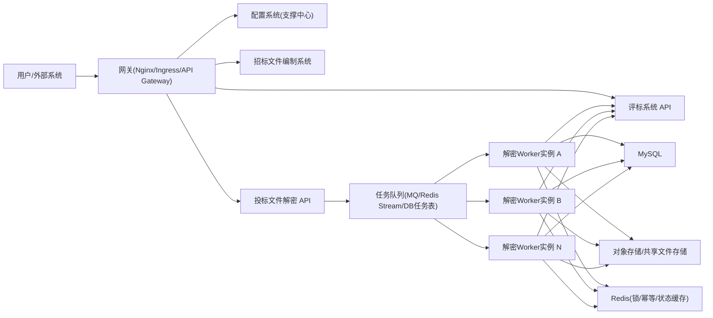

# 2026-03-24 总体架构规划（非 Spring Cloud 方案）

## 1. 背景

当前系统阶段：
- 已有：配置系统、招标文件编制系统
- 在建：投标文件解密系统
- 后续：评标系统

现状与约束：
- 项目尚未上线，可进行架构调整
- 当前以单体模式为主
- 解密系统上线后预计压力较高，需要支持多实例分担

## 2. 结论

- 现阶段不必为了“解密高并发”立即引入 Spring Cloud 全家桶。
- 建议优先采用“非 Spring Cloud + 解密服务独立部署 + 任务并发消费”的方案。
- 先把高并发处理能力、幂等与可恢复机制做稳，再评估是否引入 Cloud 治理组件。

明确决策：
- 当前阶段不引入 Spring Cloud（含注册中心、配置中心、Feign/Ribbon/Gateway 全套）。
- 直接采用“`Nginx 负载均衡 + 消息队列异步化 + 解密服务多实例`”路线（方案 C）。
- 服务间调用先使用 HTTP（`RestTemplate/WebClient`）+ 有边界的重试机制。

## 3. 总体拓扑（推荐）

## 4. 系统边界划分

1. 配置系统
- 用户、权限、字典、系统参数、审计查询。

2. 招标文件编制系统
- 业务流程编排、编制数据管理、产生“可解密任务”。

3. 投标文件解密系统（高并发核心）
- 任务消费、文件解密、规则校验、结构化解析、落库、回推评标。

4. 评标系统
- 接收结构化数据并进入评审流程。

## 5. 不使用 Spring Cloud 的负载分担方案

1. 解密服务无状态化
- 任意实例可处理任意任务，支持水平扩容。

2. 请求负载均衡
- 入口由 Nginx/Ingress/SLB 做四层或七层负载均衡。

3. 任务负载均衡（核心）
- 采用任务队列或任务表争抢机制。
- 标准状态流转：`INIT -> PROCESSING -> SUCCESS/FAIL`。
- 使用 CAS 条件更新（或 `for update skip locked`）保证同一任务仅被一个实例领取。

4. 文件与产物存储解耦
- 不依赖单机本地磁盘。
- 统一放对象存储或共享文件存储。

5. 幂等与补偿
- 任务幂等键建议：`tenderId + netBidId + version`。
- 重试策略 + 死信队列 + 人工补偿入口。

6. 可观测性
- 指标：队列堆积、任务吞吐、平均耗时、失败率、重试次数。
- 日志：全链路 `traceId`，关键状态变更留痕。

### 5.1 三种可选实现（按复杂度递增）

方案 A：Nginx 负载均衡（先行方案）
- 通过 `upstream` + `least_conn` 将 `/decrypt-api/*` 分发到多个解密实例。
- 适用于同步接口、改造成本最低、可快速上线。

方案 B：消息队列异步化（解密长耗时时启用）
- 提交请求后入队，多个 Worker 实例并发消费，结果落库并由前端轮询或回调通知。
- 适合 CPU 密集或大文件耗时解密场景，具备削峰填谷能力。

方案 C：A+B 结合（目标形态）
- Nginx 处理同步查询类接口（状态、进度、结果下载）。
- MQ 处理真正耗时的解密任务。
- 同一实例可同时提供 HTTP 能力与消费能力（或拆分为 API 节点 + Worker 节点）。

### 5.2 最终采用建议

- 立即采用：方案 C（Nginx + MQ + 多实例），同步满足接口负载与计算削峰。
- 同步保留：对短平快场景可走同步接口，对耗时任务默认异步入队处理。
- 数据一致性前提：解密服务必须无状态，状态统一落 MySQL/Redis，文件放共享存储。

## 6. 什么时候再考虑 Spring Cloud

建议在以下条件满足后再引入：
- 服务规模明显扩大，跨团队协作复杂度上升；
- 对服务发现、熔断限流、灰度发布、统一治理有明确刚需；
- 运维体系已具备 Nacos/Gateway/Feign 的稳定托管能力。
- 当前 5-6 个服务规模下，Spring Cloud 基础设施与治理成本通常大于收益。

## 7. 分阶段落地路线

1. 第一阶段：能力闭环
- 解密任务链路跑通：领取任务 -> 解密 -> 校验 -> 落库 -> 推送评标。
- 先单实例稳定。

2. 第二阶段：水平扩展
- 引入 Nginx `upstream`，上线多实例解密节点（查询类接口负载）。
- 引入 MQ，打通“提交任务 -> 入队 -> Worker 消费 -> 结果落库/通知”闭环。
- 完成任务争抢、失败重试、补偿与幂等。

3. 第三阶段：弹性与治理
- 建立扩缩容策略（按队列堆积、耗时、CPU）。
- 完善监控告警和运维面板。

## 8. 风险与关键设计点

- 风险 1：文件仍落本地，导致多实例不可用
- 风险 2：任务状态机不严谨，导致重复处理或丢任务
- 风险 3：缺少幂等与重试边界，导致数据不一致

关键设计点：
- 先统一任务状态机和幂等规则，再扩实例；
- 先统一存储再扩实例；
- 先建立可观测指标再压测调参。

## 9. 本方案对当前项目的价值

- 不引入额外复杂度即可实现解密系统高并发分担；
- 与现有单体模式兼容，改造路径平滑；
- 保留未来向 Spring Cloud 演进的空间。

## 10. 与 CC 建议融合后的最终口径

1. 采纳：当前不引入 Spring Cloud。
2. 采纳：解密系统直接采用“MQ 异步 + Nginx 查询”混合模式（方案 C）上线。
3. 采纳：Nginx 承担查询类与管理类接口负载，MQ 承担实际解密任务分发与削峰。
4. 采纳：服务间调用先用 HTTP 客户端 + 重试策略，不引入 Feign/Ribbon。
5. 保留：未来在服务规模和治理复杂度上升后，再评估 Spring Cloud（不是当前阶段阻塞项）。
