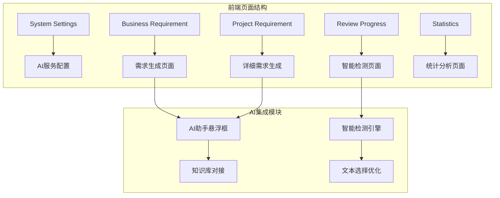
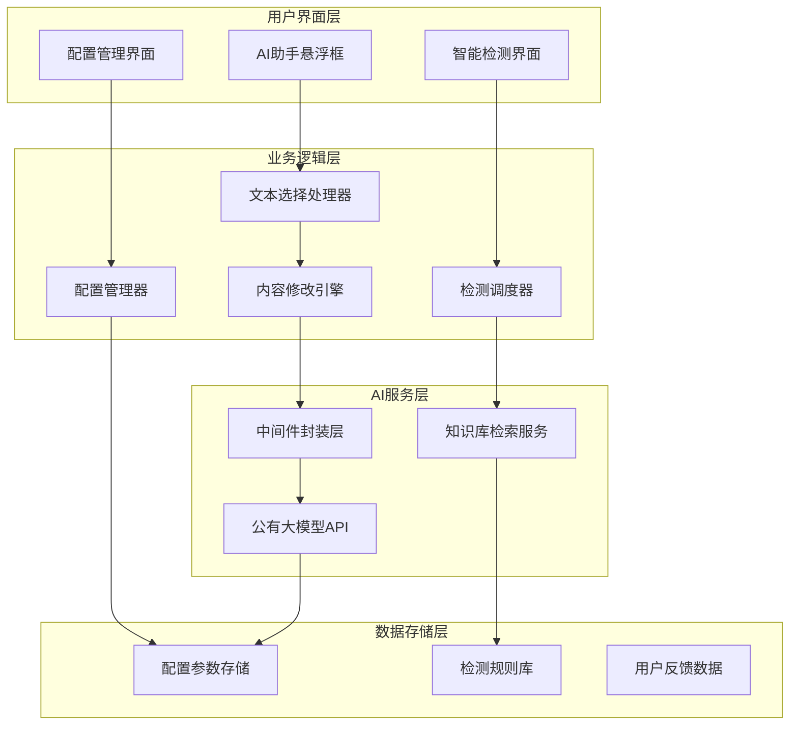
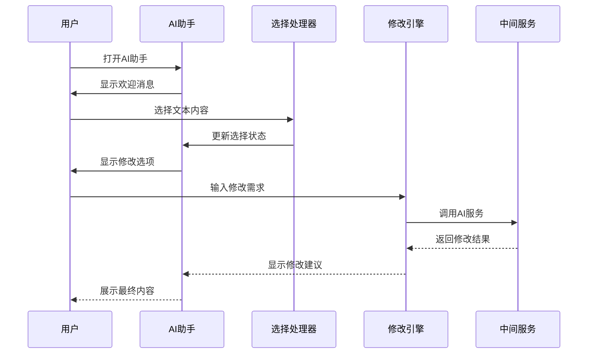
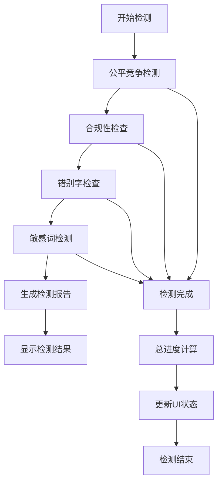
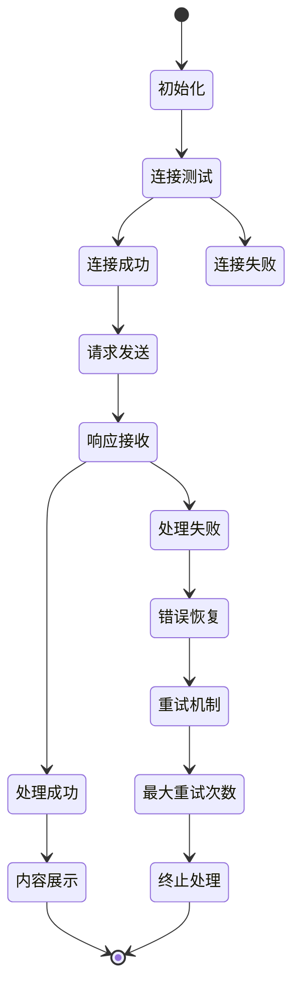
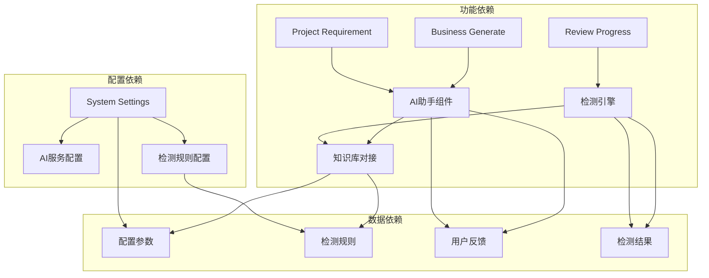

# AI集成架构

<cite>
**本文档引用的文件**
- [system-settings.html](file://pages/system-settings.html)
- [business-requirement-generate.html](file://pages/business-requirement-generate.html)
- [project-requirement.html](file://pages/project-requirement.html)
- [review-progress.html](file://pages/review-progress.html)
- [statistics.html](file://pages/statistics.html)
</cite>

## 目录
1. [引言](#引言)
2. [项目结构](#项目结构)
3. [核心组件](#核心组件)
4. [架构概览](#架构概览)
5. [详细组件分析](#详细组件分析)
6. [依赖关系分析](#依赖关系分析)
7. [性能考虑](#性能考虑)
8. [故障排查指南](#故障排查指南)
9. [结论](#结论)

## 引言

本项目是一个基于Web的AI集成架构系统，专注于招标文件的智能化编制。系统集成了AI助手、智能检测、知识库对接等功能模块，为用户提供从业务需求生成到最终文档发布的完整AI辅助工作流。

该系统采用前后端分离的设计模式，前端使用纯HTML/CSS/JavaScript实现，后端通过RESTful API与AI服务进行交互。系统支持多种AI模型调用，具备智能检测、文本选择优化、内容反馈等高级功能。

## 项目结构

项目采用模块化的页面结构设计，每个功能模块都有独立的HTML页面：

**图表来源**
- [system-settings.html:599-879](file://pages/system-settings.html#L599-L879)
- [business-requirement-generate.html:916-944](file://pages/business-requirement-generate.html#L916-L944)
- [project-requirement.html:1180-1208](file://pages/project-requirement.html#L1180-L1208)

**章节来源**
- [system-settings.html:1-1025](file://pages/system-settings.html#L1-L1025)
- [business-requirement-generate.html:1-1132](file://pages/business-requirement-generate.html#L1-L1132)

## 核心组件

### AI服务配置组件

系统提供了完善的AI服务配置界面，支持多种参数的动态配置：

- **服务地址配置**：支持自定义AI服务API端点
- **认证机制**：API密钥管理，支持安全的令牌验证
- **模型参数**：温度系数、最大Token数、请求超时时间等
- **检测规则**：公平竞争检测、合规性检查等规则配置

### AI助手交互组件

系统集成了浮动式AI助手，提供实时的人机交互体验：

- **文本选择优化**：支持段落级别的文本选择和修改
- **智能对话**：基于上下文的对话理解和响应
- **内容反馈**：用户对AI生成内容的质量评估机制
- **多场景适配**：支持业务需求生成和详细需求编辑两种模式

### 智能检测组件

系统实现了多层次的智能检测机制：

- **公平竞争检测**：检查是否存在指定特定品牌或不合理门槛
- **合规性检查**：验证是否符合相关法律法规和格式规范
- **错别字检查**：自动识别和纠正文档中的语言错误
- **敏感词检测**：识别可能存在的敏感或不当内容

**章节来源**
- [system-settings.html:813-879](file://pages/system-settings.html#L813-L879)
- [business-requirement-generate.html:1012-1130](file://pages/business-requirement-generate.html#L1012-L1130)
- [project-requirement.html:1272-1362](file://pages/project-requirement.html#L1272-L1362)

## 架构概览

系统采用分层架构设计，实现了AI服务与业务逻辑的有效分离：

**图表来源**
- [system-settings.html:813-879](file://pages/system-settings.html#L813-L879)
- [business-requirement-generate.html:1012-1130](file://pages/business-requirement-generate.html#L1012-L1130)
- [project-requirement.html:1272-1362](file://pages/project-requirement.html#L1272-L1362)

## 详细组件分析

### AI助手交互设计

AI助手采用了现代化的悬浮框设计，提供了直观的用户体验：

**图表来源**
- [business-requirement-generate.html:1016-1094](file://pages/business-requirement-generate.html#L1016-L1094)
- [project-requirement.html:1288-1330](file://pages/project-requirement.html#L1288-L1330)

#### 文本选择优化功能

系统实现了智能的文本选择机制：

- **段落级选择**：支持整段内容的快速选择和修改
- **精确选择**：允许用户进行细粒度的文本选择
- **上下文感知**：根据选择内容自动调整修改建议
- **历史记录**：保存用户的修改历史和偏好设置

#### 智能检测机制

智能检测系统采用多阶段并行处理模式：

**图表来源**
- [review-progress.html:926-1040](file://pages/review-progress.html#L926-L1040)

**章节来源**
- [business-requirement-generate.html:1012-1130](file://pages/business-requirement-generate.html#L1012-L1130)
- [project-requirement.html:1272-1362](file://pages/project-requirement.html#L1272-L1362)
- [review-progress.html:895-1069](file://pages/review-progress.html#L895-L1069)

### AI模型选择逻辑

系统支持灵活的AI模型选择和配置：

| 参数名称 | 默认值 | 取值范围 | 作用说明 |
|---------|--------|----------|----------|
| 模型名称 | gpt-4 | 可配置 | AI模型类型选择 |
| 温度参数 | 0.7 | 0.0-1.0 | 控制输出随机性 |
| 最大Token数 | 4000 | 100-16384 | 控制响应长度 |
| 请求超时时间 | 60秒 | 10-300秒 | API调用超时控制 |

### 响应处理和错误恢复机制

系统实现了完善的响应处理和错误恢复机制：

**图表来源**
- [system-settings.html:996-1002](file://pages/system-settings.html#L996-L1002)

**章节来源**
- [system-settings.html:992-1002](file://pages/system-settings.html#L992-L1002)

## 依赖关系分析

系统各组件之间的依赖关系如下：

**图表来源**
- [system-settings.html:813-879](file://pages/system-settings.html#L813-L879)
- [business-requirement-generate.html:916-944](file://pages/business-requirement-generate.html#L916-L944)
- [project-requirement.html:1180-1208](file://pages/project-requirement.html#L1180-L1208)

**章节来源**
- [system-settings.html:813-879](file://pages/system-settings.html#L813-L879)

## 性能考虑

### 并发处理优化

系统采用异步处理机制，避免阻塞用户界面：

- **非阻塞UI更新**：检测进度采用渐进式更新，不阻塞用户操作
- **并行检测任务**：多个检测任务可以同时执行，提高整体效率
- **智能缓存策略**：对常用配置和规则进行缓存，减少重复加载

### 资源管理

- **内存优化**：及时清理不再使用的DOM元素和事件监听器
- **网络优化**：合理设置请求超时和重试机制
- **渲染优化**：使用虚拟滚动等技术处理大量检测结果

## 故障排查指南

### 常见问题诊断

| 问题类型 | 症状表现 | 解决方案 |
|---------|----------|----------|
| AI连接失败 | 测试连接提示失败 | 检查AI服务地址和API密钥配置 |
| 检测进度停滞 | 某项检测长时间停留在50% | 检查网络连接和服务器状态 |
| 文本选择无效 | 无法选择或修改文本 | 确认浏览器兼容性和JavaScript启用状态 |
| 响应超时 | API调用超过设定时间 | 调整请求超时参数或检查服务器负载 |

### 调试工具

系统提供了内置的调试和监控功能：

- **连接测试**：验证AI服务连通性
- **配置验证**：检查各项配置参数的有效性
- **性能监控**：跟踪AI调用次数和响应时间
- **错误日志**：记录详细的错误信息和堆栈跟踪

**章节来源**
- [system-settings.html:996-1002](file://pages/system-settings.html#L996-L1002)

## 结论

本AI集成架构系统通过模块化设计和分层架构，成功实现了AI服务与业务逻辑的有效整合。系统具备以下优势：

1. **高度集成性**：AI助手、智能检测、知识库对接等功能无缝集成
2. **灵活配置性**：支持多种AI模型和参数的动态配置
3. **用户体验友好**：提供直观的交互界面和流畅的操作体验
4. **可扩展性强**：模块化设计便于功能扩展和维护

系统在招标文件编制场景中展现了强大的AI辅助能力，通过智能检测和内容优化，显著提升了文档质量和编制效率。未来可以在知识库深度集成、多模态AI支持等方面进一步增强系统的智能化水平。