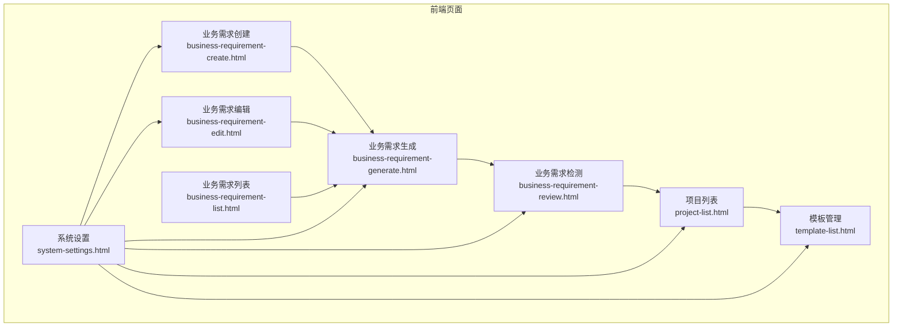
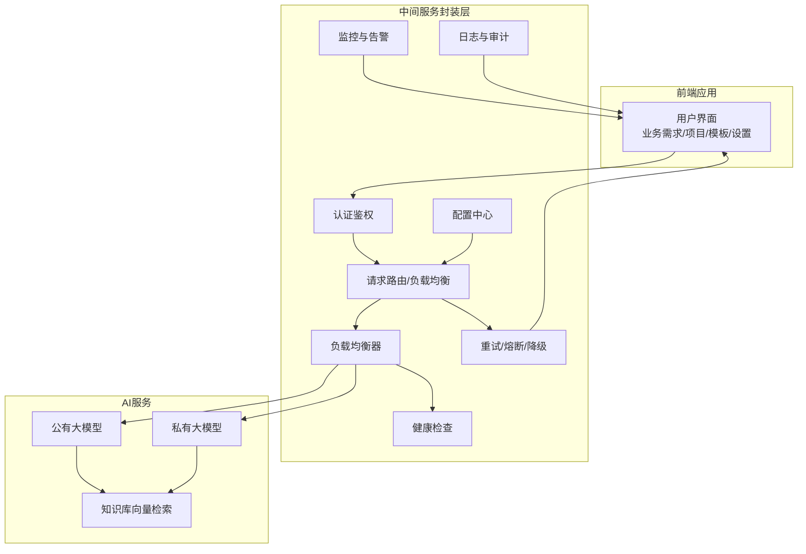
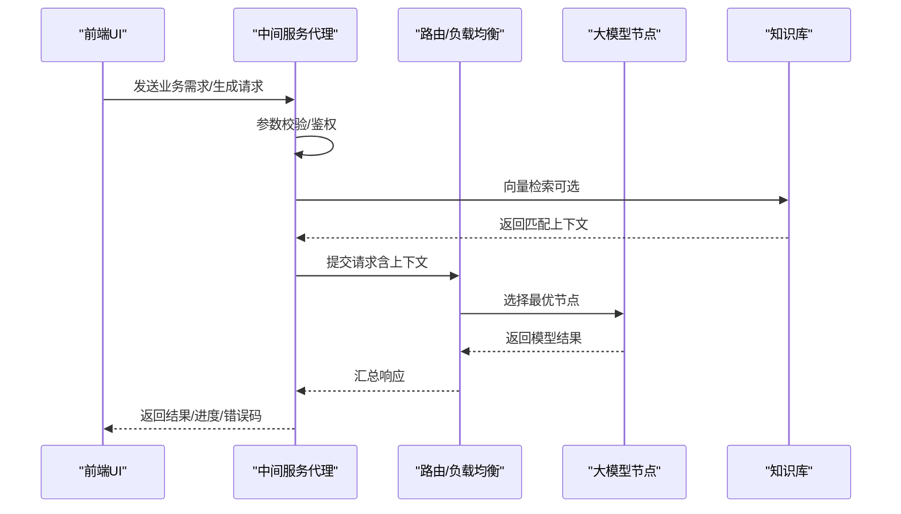
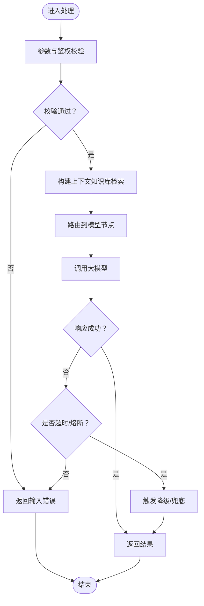
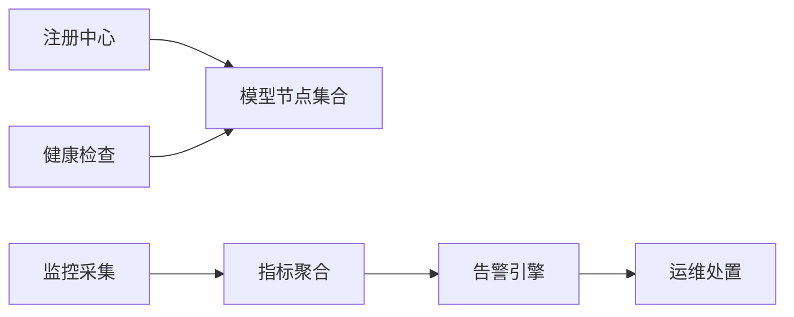
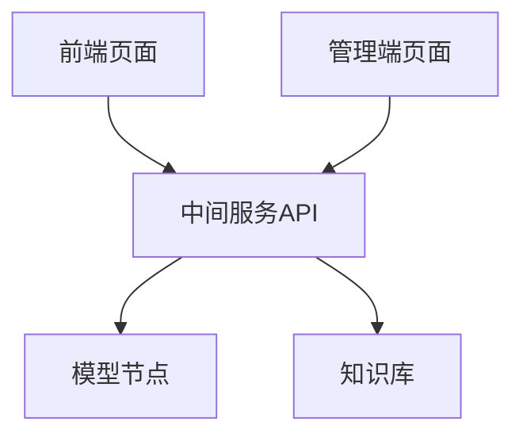

# 中间服务封装

<cite>
**本文引用的文件**
- [pages/business-requirement-create.html](file://pages/business-requirement-create.html)
- [pages/business-requirement-edit.html](file://pages/business-requirement-edit.html)
- [pages/business-requirement-generate.html](file://pages/business-requirement-generate.html)
- [pages/business-requirement-list.html](file://pages/business-requirement-list.html)
- [pages/business-requirement-review.html](file://pages/business-requirement-review.html)
- [pages/project-list.html](file://pages/project-list.html)
- [pages/template-list.html](file://pages/template-list.html)
- [pages/system-settings.html](file://pages/system-settings.html)
- [2026-04-10-招标文件AI编制会议纪要.md](file04-10-招标文件AI编制会议纪要.md)
</cite>

## 目录
1. [引言](#引言)
2. [项目结构](#项目结构)
3. [核心组件](#核心组件)
4. [架构总览](#架构总览)
5. [详细组件分析](#详细组件分析)
6. [依赖关系分析](#依赖关系分析)
7. [性能考虑](#性能考虑)
8. [故障排查指南](#故障排查指南)
9. [结论](#结论)
10. [附录](#附录)

## 引言
本文件面向“中间服务封装层”的技术文档目标，围绕AI服务的中间层架构设计进行系统化阐述，重点覆盖服务代理、请求路由与负载均衡、错误处理与降级、服务发现与健康检查、监控告警、安全与访问控制、配置管理、日志与性能优化、扩容与灾备等主题。  
结合仓库中的前端页面与会议纪要，我们明确了系统由“用户端（业务需求编制）与管理端（模板/知识库/统计）”构成，AI能力通过中间服务进行统一封装与调度，既可对接公有大模型，也可为未来私有模型预留通道。

## 项目结构
- 页面组织采用按功能模块划分的静态HTML结构，便于前后端分离与独立演进。
- 关键页面包括：业务需求创建/编辑/生成/列表/检测、项目管理、模板管理、系统设置等。
- 会议纪要明确了知识库、AI模型调用、智能检测、模板生成与评审项管理等核心链路。

**图表来源**
- [pages/business-requirement-create.html](file://pages/business-requirement-create.html)
- [pages/business-requirement-edit.html](file://pages/business-requirement-edit.html)
- [pages/business-requirement-generate.html](file://pages/business-requirement-generate.html)
- [pages/business-requirement-list.html](file://pages/business-requirement-list.html)
- [pages/business-requirement-review.html](file://pages/business-requirement-review.html)
- [pages/project-list.html](file://pages/project-list.html)
- [pages/template-list.html](file://pages/template-list.html)
- [pages/system-settings.html](file://pages/system-settings.html)

**章节来源**
- [pages/business-requirement-create.html](file://pages/business-requirement-create.html)
- [pages/business-requirement-edit.html](file://pages/business-requirement-edit.html)
- [pages/business-requirement-generate.html](file://pages/business-requirement-generate.html)
- [pages/business-requirement-list.html](file://pages/business-requirement-list.html)
- [pages/business-requirement-review.html](file://pages/business-requirement-review.html)
- [pages/project-list.html](file://pages/project-list.html)
- [pages/template-list.html](file://pages/template-list.html)
- [pages/system-settings.html](file://pages/system-settings.html)
- [2026-04-10-招标文件AI编制会议纪要.md](file://2026-04-10-招标文件AI编制会议纪要.md)

## 核心组件
- 用户端工作流组件
  - 业务需求录入与编辑：负责收集项目基础信息与需求描述，支持多种参考模式（自动匹配、人工选择、本地上传）。
  - AI助手侧边栏：提供对话式交互与文本优化建议，支持局部覆盖式修改。
  - 智能检测：基于公有大模型进行合规性与完整性检测，输出问题清单与建议。
  - 生成与导出：将模板与AI填充内容转换为Markdown并导出为Word。
- 管理端组件
  - 模板管理：模板分类、状态管理、导入导出与默认模板标记。
  - 系统设置：用户/角色管理、系统参数、功能开关（如AI对话、智能检测、消息通知）。
- 中间服务封装层（面向AI）
  - 服务代理：统一接入公有/私有大模型，屏蔽底层差异。
  - 请求路由与负载均衡：按模型类型/可用性/延迟策略进行路由与分流。
  - 错误处理与降级：超时/熔断/兜底提示，保障用户体验。
  - 服务发现与健康检查：动态感知模型节点状态，剔除不健康实例。
  - 监控告警：关键指标采集与阈值告警，支撑容量与SLA治理。
  - 安全与访问控制：鉴权、限流、敏感信息脱敏、传输加密。
  - 配置管理与日志：集中化配置、可观测性日志、审计追踪。
  - 性能优化：缓存热点、并发控制、异步化与批量化处理。
  - 扩容与灾备：弹性伸缩、多活部署、故障转移与数据备份。

**章节来源**
- [pages/business-requirement-create.html](file://pages/business-requirement-create.html)
- [pages/business-requirement-edit.html](file://pages/business-requirement-edit.html)
- [pages/business-requirement-generate.html](file://pages/business-requirement-generate.html)
- [pages/business-requirement-review.html](file://pages/business-requirement-review.html)
- [pages/template-list.html](file://pages/template-list.html)
- [pages/system-settings.html](file://pages/system-settings.html)
- [2026-04-10-招标文件AI编制会议纪要.md](file://2026-04-10-招标文件AI编制会议纪要.md)

## 架构总览
中间服务封装层位于前端与AI模型之间，承担统一接入、路由、监控与治理职责。整体链路从用户端发起请求，经中间服务进行鉴权与参数校验，再路由至合适的模型节点（公有/私有），并将结果回传给前端。

**图表来源**
- [pages/business-requirement-create.html](file://pages/business-requirement-create.html)
- [pages/business-requirement-generate.html](file://pages/business-requirement-generate.html)
- [pages/business-requirement-review.html](file://pages/business-requirement-review.html)
- [pages/system-settings.html](file://pages/system-settings.html)
- [2026-04-10-招标文件AI编制会议纪要.md](file://2026-04-10-招标文件AI编制会议纪要.md)

## 详细组件分析

### 组件A：服务代理与请求路由
- 职责
  - 接收前端请求，进行参数清洗与必要校验。
  - 根据模型类型、可用性与SLA策略进行路由决策。
  - 对接知识库进行向量化检索，拼接上下文后调用模型。
- 关键流程
  - 参数校验 → 上下文构建（知识库检索）→ 路由选择 → 调用模型 → 结果回传。
- 负载均衡策略
  - 基于权重/延迟/健康状态的动态轮询或最少连接。
  - 支持灰度/蓝绿发布与A/B测试路由。

**图表来源**
- [pages/business-requirement-create.html](file://pages/business-requirement-create.html)
- [pages/business-requirement-generate.html](file://pages/business-requirement-generate.html)
- [2026-04-10-招标文件AI编制会议纪要.md](file://2026-04-10-招标文件AI编制会议纪要.md)

**章节来源**
- [pages/business-requirement-create.html](file://pages/business-requirement-create.html)
- [pages/business-requirement-generate.html](file://pages/business-requirement-generate.html)
- [2026-04-10-招标文件AI编制会议纪要.md](file://2026-04-10-招标文件AI编制会议纪要.md)

### 组件B：错误处理、异常捕获与降级
- 错误分类
  - 输入错误：参数缺失/格式不符。
  - 服务错误：模型不可用/超时/限流。
  - 业务错误：检测不通过/合规性问题。
- 处理策略
  - 输入错误：即时返回明确错误信息与修复建议。
  - 服务错误：指数退避重试、熔断保护、降级提示（如兜底文案/示例模板）。
  - 业务错误：将检测结果与建议返回前端，引导用户修正。
- 降级机制
  - 降级文案/模板回退、只读模式展示、离线缓存命中。
  - 降级期间记录审计日志，便于后续补偿处理。

**图表来源**
- [pages/business-requirement-generate.html](file://pages/business-requirement-generate.html)
- [pages/business-requirement-review.html](file://pages/business-requirement-review.html)
- [2026-04-10-招标文件AI编制会议纪要.md](file://2026-04-10-招标文件AI编制会议纪要.md)

**章节来源**
- [pages/business-requirement-generate.html](file://pages/business-requirement-generate.html)
- [pages/business-requirement-review.html](file://pages/business-requirement-review.html)
- [2026-04-10-招标文件AI编制会议纪要.md](file://2026-04-10-招标文件AI编制会议纪要.md)

### 组件C：服务发现、健康检查与监控告警
- 服务发现
  - 注册中心订阅模型节点，动态感知上线/下线。
- 健康检查
  - 定期探活（HTTP/TCP/自定义探测），剔除不健康实例。
- 监控与告警
  - 关键指标：QPS、P95/P99延迟、错误率、熔断触发次数、节点存活率。
  - 告警策略：阈值/趋势/变更检测，分级通知。

**图表来源**
- [pages/system-settings.html](file://pages/system-settings.html)
- [2026-04-10-招标文件AI编制会议纪要.md](file://2026-04-10-招标文件AI编制会议纪要.md)

**章节来源**
- [pages/system-settings.html](file://pages/system-settings.html)
- [2026-04-10-招标文件AI编制会议纪要.md](file://2026-04-10-招标文件AI编制会议纪要.md)

### 组件D：安全机制、访问控制与数据加密
- 访问控制
  - 基于角色的权限控制（RBAC），区分用户端与管理端。
  - 会话管理与超时策略，支持强制登出与二次验证。
- 数据安全
  - 传输加密（TLS）、敏感字段脱敏（如密钥/口令）。
  - 日志脱敏与最小化采集，审计追踪关键操作。
- API安全
  - 限流/风控、签名/Token校验、防重放与CSRF防护。

**章节来源**
- [pages/system-settings.html](file://pages/system-settings.html)
- [2026-04-10-招标文件AI编制会议纪要.md](file://2026-04-10-招标文件AI编制会议纪要.md)

### 组件E：配置管理、日志与性能优化
- 配置管理
  - 集中式配置中心，支持热更新（模型参数、开关、阈值）。
- 日志
  - 分层日志（请求/业务/系统），结构化输出，支持检索与聚合。
- 性能优化
  - 缓存热点上下文/模板；并发池与队列；异步批处理；CDN加速静态资源。

**章节来源**
- [pages/system-settings.html](file://pages/system-settings.html)
- [pages/template-list.html](file://pages/template-list.html)

### 组件F：扩容策略、故障转移与灾备
- 扩容
  - 弹性伸缩：CPU/内存/请求量触发；多副本部署。
- 故障转移
  - 主备/多活部署，跨机房冗余；自动切换与手动接管。
- 灾备
  - 数据备份与快照；跨区域复制；RTO/RPO目标明确。

**章节来源**
- [pages/system-settings.html](file://pages/system-settings.html)
- [2026-04-10-招标文件AI编制会议纪要.md](file://2026-04-10-招标文件AI编制会议纪要.md)

## 依赖关系分析
- 前端页面依赖中间服务提供的统一API，形成清晰的边界。
- 中间服务依赖模型节点与知识库，二者通过中间层解耦。
- 管理端（模板/系统设置）与业务端（需求/生成/检测）共享中间服务能力。

**图表来源**
- [pages/business-requirement-create.html](file://pages/business-requirement-create.html)
- [pages/business-requirement-generate.html](file://pages/business-requirement-generate.html)
- [pages/business-requirement-review.html](file://pages/business-requirement-review.html)
- [pages/template-list.html](file://pages/template-list.html)
- [pages/system-settings.html](file://pages/system-settings.html)
- [2026-04-10-招标文件AI编制会议纪要.md](file://2026-04-10-招标文件AI编制会议纪要.md)

**章节来源**
- [pages/business-requirement-create.html](file://pages/business-requirement-create.html)
- [pages/business-requirement-generate.html](file://pages/business-requirement-generate.html)
- [pages/business-requirement-review.html](file://pages/business-requirement-review.html)
- [pages/template-list.html](file://pages/template-list.html)
- [pages/system-settings.html](file://pages/system-settings.html)
- [2026-04-10-招标文件AI编制会议纪要.md](file://2026-04-10-招标文件AI编制会议纪要.md)

## 性能考虑
- 延迟优化
  - 预热热点模型与上下文；CDN缓存模板与静态资源。
- 吞吐提升
  - 连接池与并发限制；批量请求与流水线处理。
- 成本控制
  - 模型选择与调用策略优化；缓存命中率与重试成本平衡。

## 故障排查指南
- 常见问题定位
  - 请求失败：检查中间服务日志与模型节点存活状态。
  - 检测异常：核对输入参数与知识库检索结果。
  - 权限问题：确认会话状态与角色授权。
- 快速恢复
  - 熔断开关与降级预案；快速回滚与版本切换。
  - 告警联动与值班流程，缩短MTTR。

**章节来源**
- [pages/business-requirement-generate.html](file://pages/business-requirement-generate.html)
- [pages/business-requirement-review.html](file://pages/business-requirement-review.html)
- [pages/system-settings.html](file://pages/system-settings.html)

## 结论
中间服务封装层是AI能力在本系统中的关键枢纽，通过统一代理、路由与治理，实现了对公有/私有模型的平滑接入与可控扩展。结合完善的错误处理、健康检查、监控告警与安全机制，可有效保障业务连续性与用户体验。建议在后续迭代中持续完善知识库与模型能力，强化A/B测试与灰度发布策略，逐步实现多活与灾备能力。

## 附录
- 术语
  - 中间服务：位于前端与AI模型之间的统一接入与治理层。
  - 知识库：结构化存储政策文件与历史模板，支持向量检索。
  - 公有/私有模型：分别指云厂商大模型与内部部署模型。
- 参考页面
  - 业务需求相关页面用于理解前端工作流与AI交互入口。
  - 系统设置页面体现权限、参数与功能开关的集中化管理。

**章节来源**
- [pages/business-requirement-create.html](file://pages/business-requirement-create.html)
- [pages/business-requirement-edit.html](file://pages/business-requirement-edit.html)
- [pages/business-requirement-generate.html](file://pages/business-requirement-generate.html)
- [pages/business-requirement-list.html](file://pages/business-requirement-list.html)
- [pages/business-requirement-review.html](file://pages/business-requirement-review.html)
- [pages/project-list.html](file://pages/project-list.html)
- [pages/template-list.html](file://pages/template-list.html)
- [pages/system-settings.html](file://pages/system-settings.html)
- [2026-04-10-招标文件AI编制会议纪要.md](file://2026-04-10-招标文件AI编制会议纪要.md)