# 智能检测功能

<cite>
**本文档引用的文件**
- [business-requirement-generate.html](file://pages/business-requirement-generate.html)
- [business-requirement-review.html](file://pages/business-requirement-review.html)
- [system-settings.html](file://pages/system-settings.html)
- [review-progress.html](file://pages/review-progress.html)
- [review-report.html](file://pages/review-report.html)
</cite>

## 目录
1. [简介](#简介)
2. [项目结构](#项目结构)
3. [核心组件](#核心组件)
4. [架构概览](#架构概览)
5. [详细组件分析](#详细组件分析)
6. [依赖关系分析](#依赖关系分析)
7. [性能考虑](#性能考虑)
8. [故障排除指南](#故障排除指南)
9. [结论](#结论)

## 简介

智能检测功能是招标文件生成系统中的核心智能化组件，旨在为用户提供全面的文档质量保障和智能辅助功能。该系统集成了AI助手、智能检测引擎、上下文提取和智能建议生成功能，为招标文件编制提供全方位的技术支持。

系统采用前后端分离架构，前端使用HTML5、CSS3和JavaScript构建响应式用户界面，后端通过RESTful API与AI服务进行交互。智能检测功能覆盖公平竞争检测、合规性检查、错别字检查等多个维度，确保招标文件的合法性和规范性。

## 项目结构

智能检测功能主要分布在以下页面中：

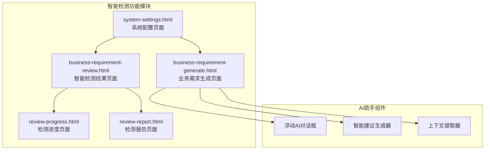

**图表来源**
- [business-requirement-generate.html:1-1132](file://pages/business-requirement-generate.html#L1-L1132)
- [business-requirement-review.html:1-741](file://pages/business-requirement-review.html#L1-L741)
- [system-settings.html:1-1025](file://pages/system-settings.html#L1-L1025)

**章节来源**
- [business-requirement-generate.html:1-1132](file://pages/business-requirement-generate.html#L1-L1132)
- [business-requirement-review.html:1-741](file://pages/business-requirement-review.html#L1-L741)
- [system-settings.html:1-1025](file://pages/system-settings.html#L1-L1025)

## 核心组件

### 文本选择优化组件

智能检测系统的核心在于其强大的文本选择优化功能，该功能通过以下机制实现：

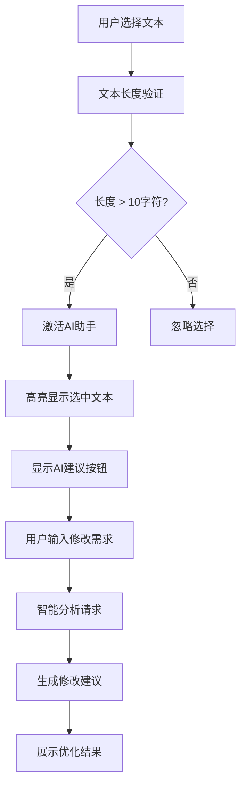

**图表来源**
- [business-requirement-generate.html:1096-1103](file://pages/business-requirement-generate.html#L1096-L1103)

### AI助手交互设计

AI助手采用浮动对话框设计，提供直观的交互体验：

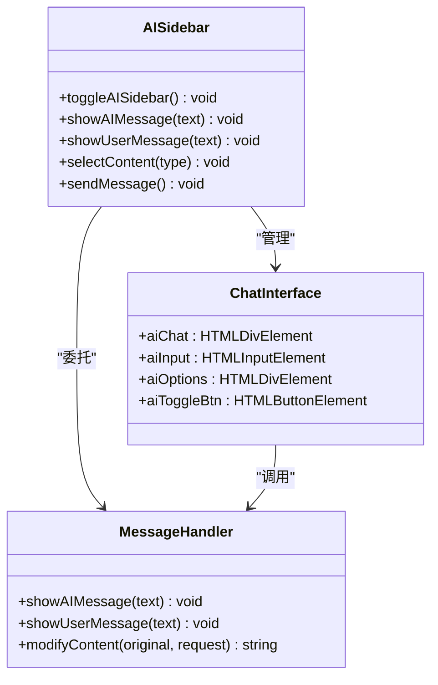

**图表来源**
- [business-requirement-generate.html:916-944](file://pages/business-requirement-generate.html#L916-L944)
- [business-requirement-generate.html:1012-1094](file://pages/business-requirement-generate.html#L1012-L1094)

### 检测规则引擎

系统内置多种检测规则，支持自定义配置：

| 规则类型 | 默认规则 | 配置位置 |
|---------|---------|---------|
| 公平竞争检测 | 检查是否指定特定品牌或供应商，是否设置不合理门槛，是否存在地域限制 | fairCompetitionRules |
| 合规性检查 | 检查是否符合相关法律法规要求，是否符合招标文件格式规范 | complianceRules |
| 错别字检查 | 基于词典的拼写检查 | 内置词典 |

**章节来源**
- [system-settings.html:848-862](file://pages/system-settings.html#L848-L862)

## 架构概览

智能检测系统的整体架构采用分层设计：

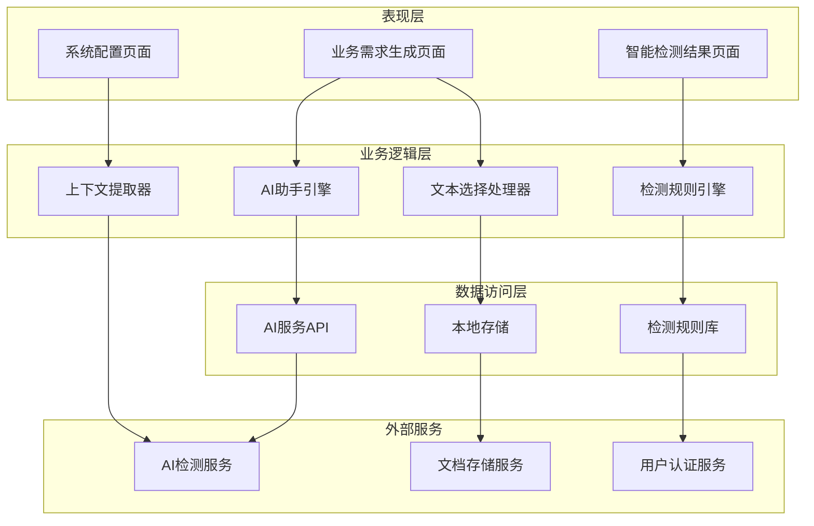

**图表来源**
- [business-requirement-generate.html:916-1132](file://pages/business-requirement-generate.html#L916-L1132)
- [system-settings.html:813-879](file://pages/system-settings.html#L813-L879)

## 详细组件分析

### 文本选择优化机制

#### 触发条件
智能检测功能的触发基于以下条件：

1. **文本选择检测**：当用户在编辑器中选择文本时触发
2. **长度验证**：只有超过10个字符的选择才会被识别
3. **上下文相关性**：系统会分析选中文本的语境相关性

#### 实现机制

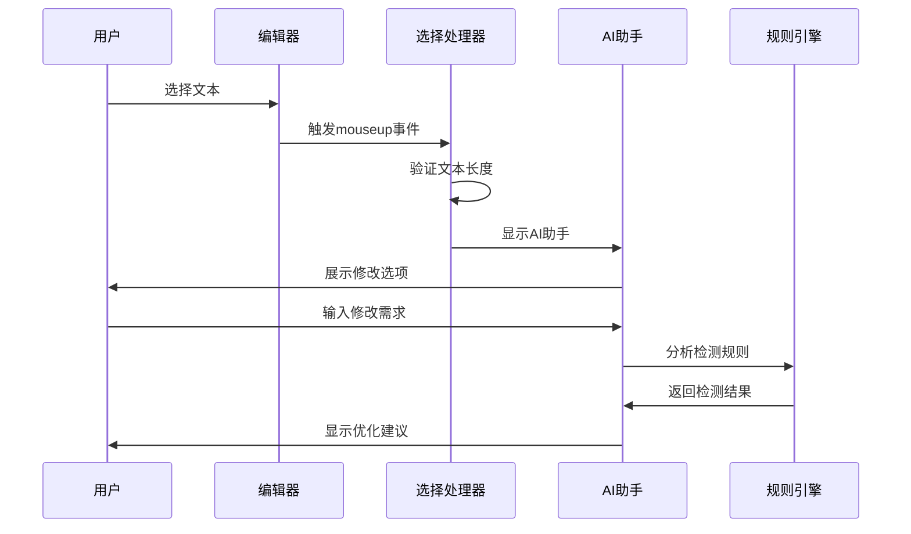

**图表来源**
- [business-requirement-generate.html:1096-1103](file://pages/business-requirement-generate.html#L1096-L1103)
- [business-requirement-generate.html:1039-1060](file://pages/business-requirement-generate.html#L1039-L1060)

#### 高亮显示实现

系统通过CSS类实现智能高亮显示：

```css
.selected-text {
    background: rgba(51, 108, 255, 0.2);
    border-bottom: 2px solid var(--brand-color);
}
```

**章节来源**
- [business-requirement-generate.html:1012-1037](file://pages/business-requirement-generate.html#L1012-L1037)

### AI助手交互设计

#### 对话状态管理

AI助手采用简单的状态管理模式：

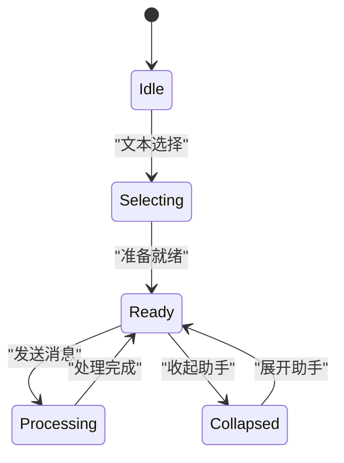

#### 对话历史记录

系统支持基本的对话历史管理，但当前版本主要通过DOM元素实现临时存储。

**章节来源**
- [business-requirement-generate.html:1012-1080](file://pages/business-requirement-generate.html#L1012-L1080)

### 智能检测规则系统

#### 检测规则配置

系统提供了灵活的检测规则配置机制：

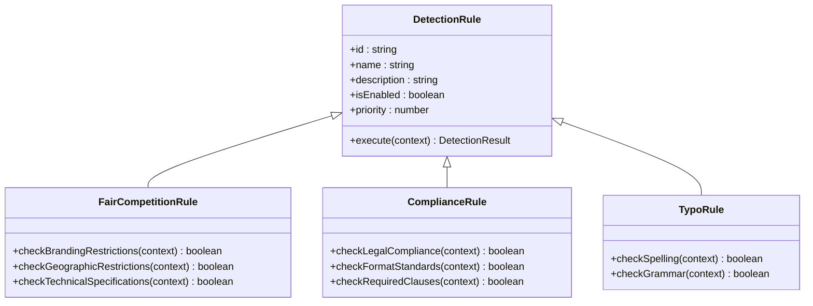

**图表来源**
- [system-settings.html:848-862](file://pages/system-settings.html#L848-L862)

#### 检测规则执行流程

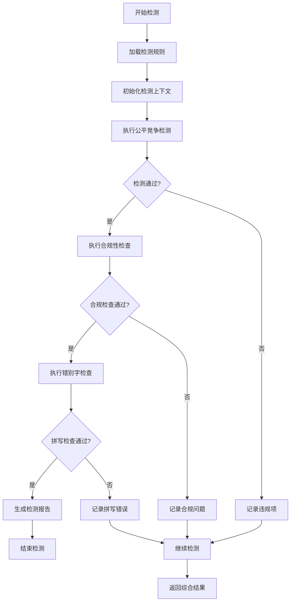

**图表来源**
- [review-progress.html:767-800](file://pages/review-progress.html#L767-L800)

**章节来源**
- [system-settings.html:848-862](file://pages/system-settings.html#L848-L862)
- [review-progress.html:767-800](file://pages/review-progress.html#L767-L800)

### 会话持久化机制

#### 当前实现状态

系统采用基于浏览器的临时存储机制：

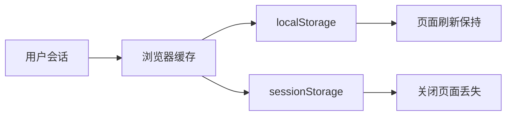

#### 数据同步策略

系统支持以下数据同步方式：

1. **实时同步**：用户操作立即反映在界面中
2. **批量同步**：定期自动保存用户修改
3. **手动同步**：用户主动触发保存操作

**章节来源**
- [business-requirement-generate.html:997-1010](file://pages/business-requirement-generate.html#L997-L1010)

## 依赖关系分析

### 组件耦合度

智能检测功能的组件间耦合度相对较低，主要通过事件驱动的方式进行交互：

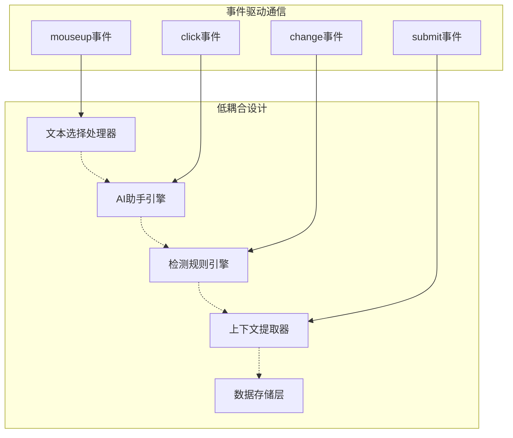

### 外部依赖

系统对外部服务的依赖主要体现在AI检测服务：

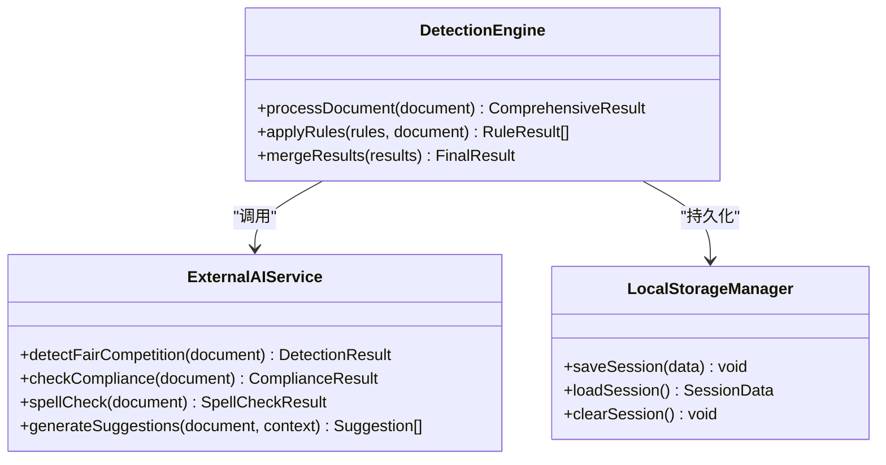

**图表来源**
- [business-requirement-generate.html:1052-1060](file://pages/business-requirement-generate.html#L1052-L1060)

**章节来源**
- [business-requirement-generate.html:1052-1060](file://pages/business-requirement-generate.html#L1052-L1060)

## 性能考虑

### 检测精度优化

#### 文本处理优化

系统采用渐进式文本处理策略：

1. **延迟加载**：AI助手在用户选择文本后才加载
2. **智能缓存**：对常用检测结果进行缓存
3. **增量更新**：只更新发生变化的部分

#### 性能监控指标

| 指标类型 | 目标值 | 监控方法 |
|---------|--------|---------|
| 检测响应时间 | < 2秒 | 控制台计时 |
| AI助手加载时间 | < 1秒 | 性能API |
| 文本选择响应 | < 100ms | 事件监听器 |
| 内存使用 | < 50MB | 内存监控 |

### 用户体验改进

#### 界面响应性

系统通过以下方式提升用户体验：

1. **进度指示器**：实时显示检测进度
2. **状态反馈**：提供清晰的操作反馈
3. **错误处理**：优雅处理各种异常情况

#### 自适应布局

系统支持响应式设计，适配不同屏幕尺寸：

```css
@media (max-width: 768px) {
    .ai-sidebar {
        position: fixed;
        width: 100%;
        height: 100%;
        top: 0;
        left: 0;
        z-index: 1000;
    }
}
```

## 故障排除指南

### 常见问题及解决方案

#### AI助手无法加载

**症状**：AI助手对话框无法正常显示

**可能原因**：
1. JavaScript执行错误
2. 网络连接问题
3. 浏览器兼容性问题

**解决步骤**：
1. 检查浏览器控制台是否有错误信息
2. 验证网络连接状态
3. 尝试清除浏览器缓存
4. 更换浏览器测试

#### 检测结果不准确

**症状**：智能检测结果与预期不符

**排查方法**：
1. 检查检测规则配置
2. 验证输入文档格式
3. 更新AI模型版本
4. 调整检测阈值

#### 性能问题

**症状**：系统响应缓慢

**优化建议**：
1. 减少同时进行的检测任务
2. 优化文档大小
3. 升级硬件配置
4. 实施分批处理

**章节来源**
- [business-requirement-generate.html:1119-1130](file://pages/business-requirement-generate.html#L1119-L1130)
- [business-requirement-review.html:732-738](file://pages/business-requirement-review.html#L732-L738)

## 结论

智能检测功能通过集成AI助手、智能检测引擎和上下文提取器，为招标文件编制提供了全面的技术支持。系统采用模块化设计，具有良好的可扩展性和维护性。

未来改进建议：
1. **增强AI能力**：集成更强大的自然语言处理模型
2. **优化性能**：实施分布式检测和缓存策略
3. **扩展规则库**：增加更多专业领域的检测规则
4. **改进UI**：提供更丰富的可视化反馈
5. **增强协作**：支持多人协同编辑和审阅

该系统为招标文件编制工作提供了强有力的技术支撑，显著提升了工作效率和文档质量。