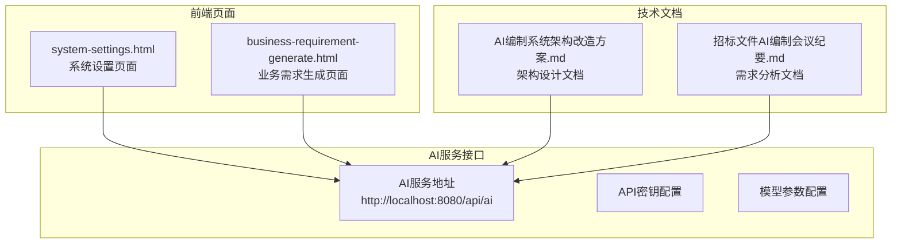
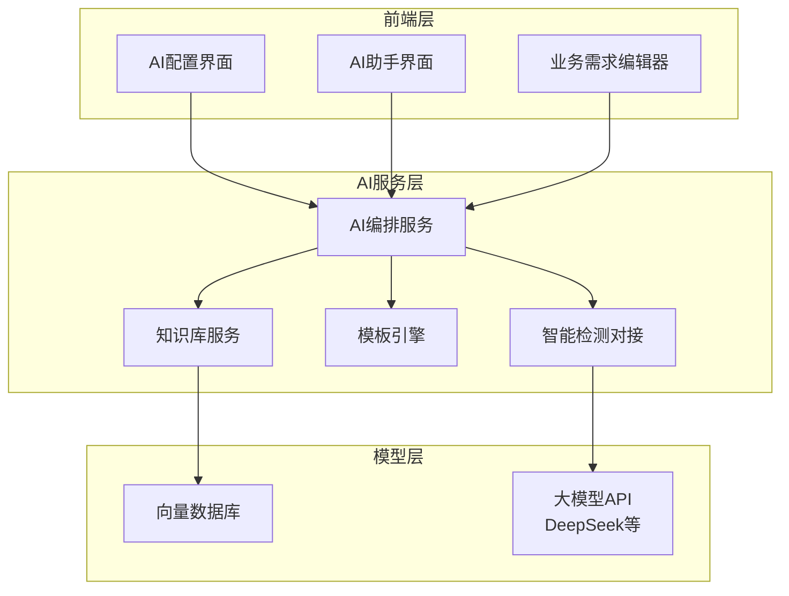
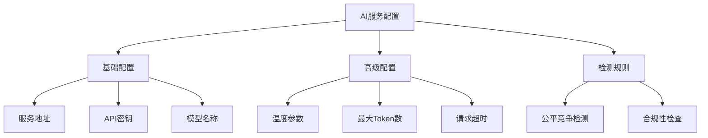
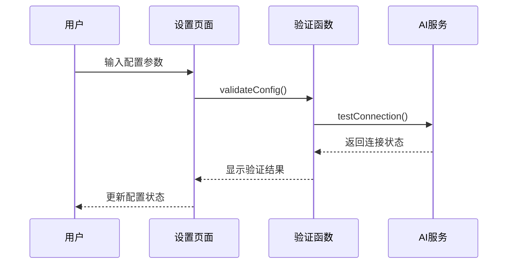
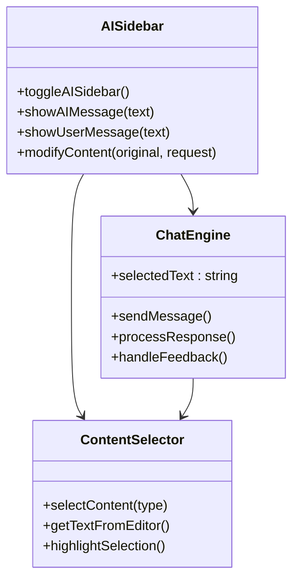
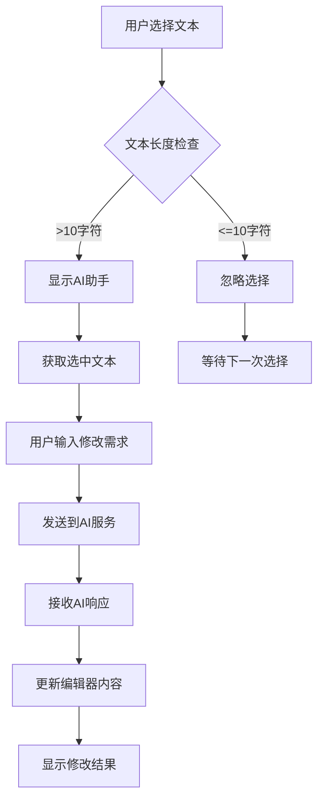
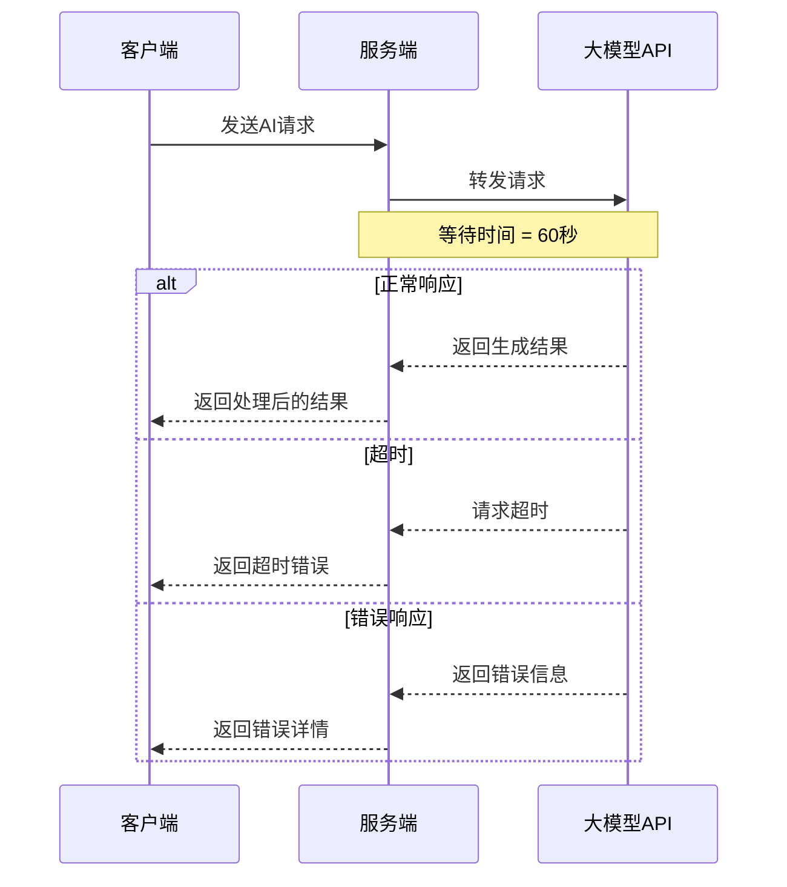
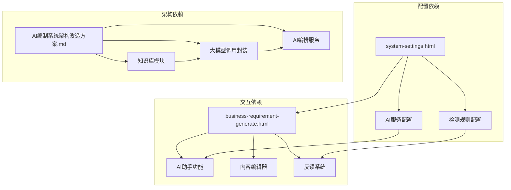

# 模型调用机制

<cite>
**本文档引用的文件**
- [system-settings.html](file://pages/system-settings.html)
- [business-requirement-generate.html](file://pages/business-requirement-generate.html)
- [AI编制系统架构改造方案.md](file://2026-04-10-AI编制系统架构改造方案.md)
- [招标文件AI编制会议纪要.md](file://2026-04-10-招标文件AI编制会议纪要.md)
</cite>

## 目录
1. [简介](#简介)
2. [项目结构](#项目结构)
3. [核心组件](#核心组件)
4. [架构概览](#架构概览)
5. [详细组件分析](#详细组件分析)
6. [依赖关系分析](#依赖关系分析)
7. [性能考虑](#性能考虑)
8. [故障排除指南](#故障排除指南)
9. [结论](#结论)

## 简介

本文档详细阐述了AI模型调用机制，特别是公有大模型（如DeepSeek）的集成方式。该系统基于现有的EleTender电子招标平台架构，通过前端页面展示AI助手的交互设计、实时聊天功能和消息传递机制，同时提供了完整的配置界面来管理AI服务参数。

系统支持多种AI服务提供商，包括DeepSeek等公有大模型，以及未来可接入的私有大模型。知识库与模型分离设计，确保公有模型无法直接访问知识库，必须通过中间服务封装后调用。

## 项目结构

该项目采用前后端分离的架构设计，主要包含以下核心文件：

**图表来源**
- [system-settings.html:813-879](file://pages/system-settings.html#L813-L879)
- [business-requirement-generate.html:916-944](file://pages/business-requirement-generate.html#L916-L944)

**章节来源**
- [system-settings.html:1-1025](file://pages/system-settings.html#L1-L1025)
- [business-requirement-generate.html:1-1132](file://pages/business-requirement-generate.html#L1-L1132)

## 核心组件

### AI服务配置组件

系统提供了完整的AI服务配置界面，支持以下关键参数：

| 配置项 | 默认值 | 数据类型 | 描述 |
|--------|--------|----------|------|
| AI服务地址 | http://localhost:8080/api/ai | 字符串 | AI服务的API端点地址 |
| API密钥 | sk-xxxxxxxxxxxxx | 字符串 | 大模型API访问凭证 |
| 模型名称 | gpt-4 | 字符串 | 使用的大模型标识符 |
| 温度参数 | 0.7 | 数字(0-1) | 控制生成内容的随机性和创造性 |
| 最大Token数 | 4000 | 数字 | 单次请求的最大Token限制 |
| 请求超时时间 | 60秒 | 数字 | API请求的超时阈值 |

### AI助手交互组件

业务需求生成页面集成了实时AI助手功能，提供以下交互特性：

- **浮动AI对话框**：右侧固定位置的AI助手界面
- **文本选择优化**：支持用户选中文本段落进行AI优化
- **实时聊天功能**：支持多轮对话和上下文保持
- **内容反馈机制**：用户可对AI生成内容进行评价

**章节来源**
- [system-settings.html:813-879](file://pages/system-settings.html#L813-L879)
- [business-requirement-generate.html:916-1132](file://pages/business-requirement-generate.html#L916-L1132)

## 架构概览

系统采用分层架构设计，实现了知识库与大模型调用的解耦：

**图表来源**
- [AI编制系统架构改造方案.md:7-35](file://2026-04-10-AI编制系统架构改造方案.md#L7-L35)
- [AI编制系统架构改造方案.md:70-75](file://2026-04-10-AI编制系统架构改造方案.md#L70-L75)

## 详细组件分析

### AI服务配置管理

#### 配置参数详解

系统提供了灵活的AI服务配置选项：

**图表来源**
- [system-settings.html:813-879](file://pages/system-settings.html#L813-L879)

#### 配置验证流程

**图表来源**
- [system-settings.html:996-1002](file://pages/system-settings.html#L996-L1002)

**章节来源**
- [system-settings.html:813-879](file://pages/system-settings.html#L813-L879)

### AI助手交互设计

#### 实时聊天功能

AI助手提供了完整的实时聊天体验：

**图表来源**
- [business-requirement-generate.html:1012-1132](file://pages/business-requirement-generate.html#L1012-L1132)

#### 文本选择优化机制

**图表来源**
- [business-requirement-generate.html:1096-1103](file://pages/business-requirement-generate.html#L1096-L1103)

**章节来源**
- [business-requirement-generate.html:916-1132](file://pages/business-requirement-generate.html#L916-L1132)

### 模型调用参数配置

#### 参数映射关系

| 前端参数 | 后端参数 | 取值范围 | 默认值 | 作用 |
|----------|----------|----------|--------|------|
| temperature | temperature | 0.0-1.0 | 0.7 | 控制生成内容的随机性 |
| max_tokens | max_tokens | 1-∞ | 4000 | 限制生成内容长度 |
| model | model_name | 字符串 | "gpt-4" | 指定使用的模型 |
| api_key | api_key | 字符串 | "sk-xxxxxxxxxxxxx" | API访问凭证 |

#### 超时机制设计

**图表来源**
- [system-settings.html:842-844](file://pages/system-settings.html#L842-L844)

**章节来源**
- [system-settings.html:813-879](file://pages/system-settings.html#L813-L879)

## 依赖关系分析

### 组件间依赖

**图表来源**
- [AI编制系统架构改造方案.md:7-35](file://2026-04-10-AI编制系统架构改造方案.md#L7-L35)

### 外部依赖

系统依赖以下外部组件：

- **向量数据库**：Milvus/Chroma用于知识库向量化存储
- **大模型SDK**：OpenAI兼容API封装 + DeepSeek适配
- **Markdown处理库**：flexmark-java用于模板处理
- **Word生成库**：poi-tl用于文档转换

**章节来源**
- [AI编制系统架构改造方案.md:126-129](file://2026-04-10-AI编制系统架构改造方案.md#L126-L129)

## 性能考虑

### 并发控制策略

1. **请求队列管理**：AI请求采用队列处理，避免并发过高导致的服务压力
2. **连接池优化**：合理配置HTTP连接池，提高API调用效率
3. **缓存机制**：对常用配置和模板进行缓存，减少重复请求

### 资源管理

1. **内存优化**：AI助手对话内容采用增量更新，避免内存泄漏
2. **网络优化**：支持断线重连和请求重试机制
3. **计算优化**：对长文本进行分片处理，避免单次请求过大

### 性能监控

- **响应时间监控**：记录每次AI调用的响应时间
- **错误率统计**：跟踪API调用失败率
- **资源使用监控**：监控内存和CPU使用情况

## 故障排除指南

### 常见问题及解决方案

#### AI服务连接问题

**问题症状**：测试连接失败，API密钥无效

**排查步骤**：
1. 检查AI服务地址是否正确
2. 验证API密钥格式是否正确
3. 确认网络连接正常
4. 检查防火墙设置

**解决方案**：
- 更新正确的服务地址
- 重新生成API密钥
- 配置代理服务器（如有需要）

#### 模型调用超时

**问题症状**：AI请求长时间无响应

**排查步骤**：
1. 检查请求超时时间设置
2. 监控网络延迟
3. 查看服务器负载情况

**解决方案**：
- 增加超时时间
- 优化网络连接
- 调整并发请求限制

#### 内容生成质量不佳

**问题症状**：AI生成内容不符合预期

**排查步骤**：
1. 调整温度参数
2. 检查提示词设计
3. 验证上下文完整性

**解决方案**：
- 降低温度参数提高确定性
- 优化提示词结构
- 提供更详细的上下文信息

**章节来源**
- [system-settings.html:996-1002](file://pages/system-settings.html#L996-L1002)
- [business-requirement-generate.html:1082-1094](file://pages/business-requirement-generate.html#L1082-L1094)

## 结论

该AI模型调用机制展现了现代AI应用的最佳实践，通过以下关键特性实现了高效、可靠的AI服务集成：

1. **模块化设计**：知识库与模型调用分离，支持多种模型提供商
2. **用户友好**：提供直观的配置界面和实时交互功能
3. **可扩展性**：支持私有模型接入和功能扩展
4. **可靠性**：完善的错误处理和超时机制

系统架构充分考虑了性能优化和资源管理，在保证用户体验的同时，确保了系统的稳定性和可维护性。通过持续的迭代和优化，该机制能够满足不断增长的AI应用需求。