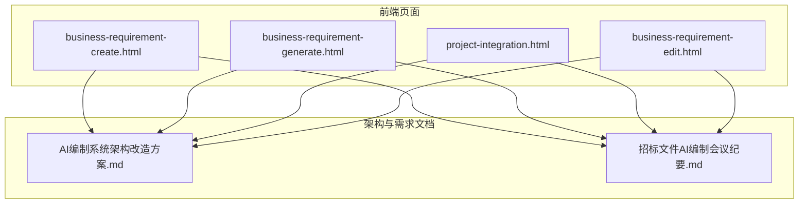
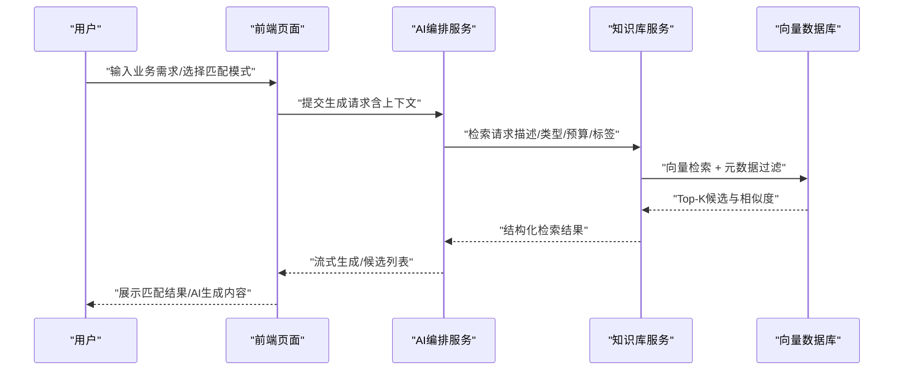
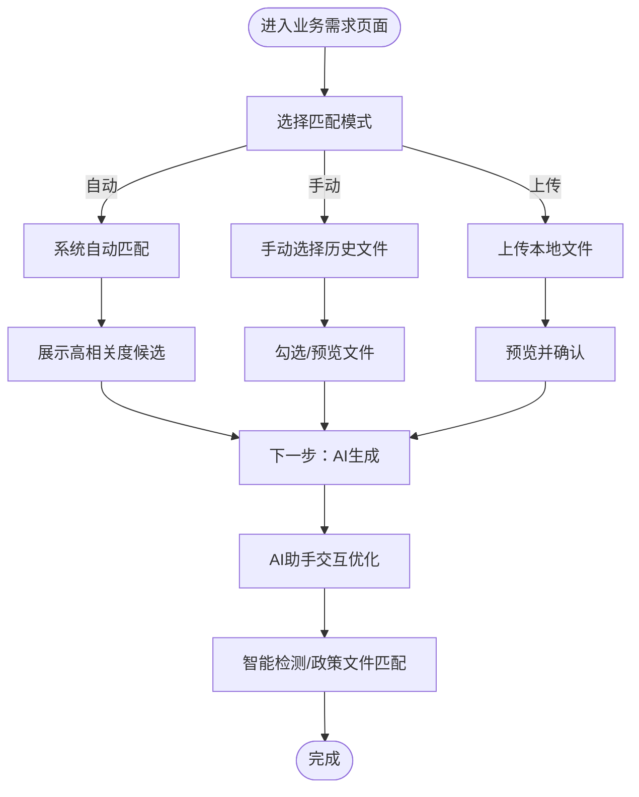
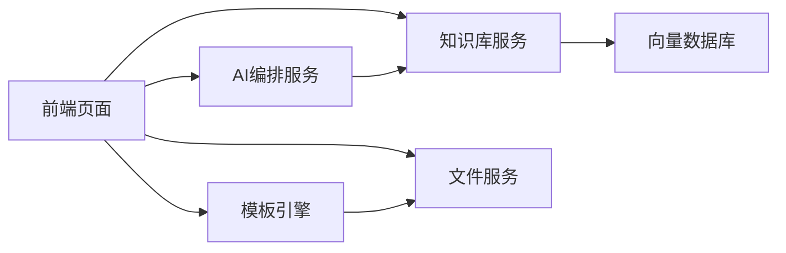

# 知识库对接

<cite>
**本文引用的文件**
- [2026-04-10-AI编制系统架构改造方案.md](file://2026-04-10-AI编制系统架构改造方案.md)
- [2026-04-10-招标文件AI编制会议纪要.md](file://2026-04-10-招标文件AI编制会议纪要.md)
- [business-requirement-create.html](file://pages/business-requirement-create.html)
- [business-requirement-generate.html](file://pages/business-requirement-generate.html)
- [project-integration.html](file://pages/project-integration.html)
- [business-requirement-edit.html](file://pages/business-requirement-edit.html)
</cite>

## 目录
1. [简介](#简介)
2. [项目结构](#项目结构)
3. [核心组件](#核心组件)
4. [架构总览](#架构总览)
5. [详细组件分析](#详细组件分析)
6. [依赖关系分析](#依赖关系分析)
7. [性能考量](#性能考量)
8. [故障排查指南](#故障排查指南)
9. [结论](#结论)
10. [附录](#附录)

## 简介
本技术文档面向“知识库对接系统”的设计与实现，聚焦于知识库与AI模型的分离架构、向量检索流程、内容过滤与相似度计算、数据结构与索引机制、查询优化、增量更新、缓存策略、性能监控、历史匹配机制、阈值与排序、配置与导入导出、版本管理、扩展与第三方集成、以及故障恢复等主题。文档以仓库中现有的前端页面与会议纪要、架构方案为依据，结合系统性分析与可视化图示，帮助读者从高层到细节全面理解知识库对接的设计与落地要点。

## 项目结构
本仓库以静态HTML页面为主，配合Markdown文档描述系统架构与业务流程。知识库对接相关的关键线索分布在：
- 架构方案文档：明确知识库模块职责、与大模型的解耦方式、向量数据库选型方向
- 会议纪要：定义知识库与AI交互边界、历史匹配与模板选择、智能检测等业务闭环
- 前端页面：体现业务需求生成、历史匹配、AI助手、文档集成与政策文件匹配等环节



图表来源
- [2026-04-10-AI编制系统架构改造方案.md](file://2026-04-10-AI编制系统架构改造方案.md)
- [2026-04-10-招标文件AI编制会议纪要.md](file://2026-04-10-招标文件AI编制会议纪要.md)
- [business-requirement-create.html](file://pages/business-requirement-create.html)
- [business-requirement-generate.html](file://pages/business-requirement-generate.html)
- [project-integration.html](file://pages/project-integration.html)
- [business-requirement-edit.html](file://pages/business-requirement-edit.html)

章节来源
- [2026-04-10-AI编制系统架构改造方案.md](file://2026-04-10-AI编制系统架构改造方案.md)
- [2026-04-10-招标文件AI编制会议纪要.md](file://2026-04-10-招标文件AI编制会议纪要.md)
- [business-requirement-create.html](file://pages/business-requirement-create.html)
- [business-requirement-generate.html](file://pages/business-requirement-generate.html)
- [project-integration.html](file://pages/project-integration.html)
- [business-requirement-edit.html](file://pages/business-requirement-edit.html)

## 核心组件
- 知识库服务（向量检索与文档管理）
  - 职责：存储政策文件、历史模板、结构化元数据；提供向量检索、过滤、排序与结果返回
  - 与模型解耦：不直接调用大模型，通过中间服务封装后被调用
- AI编排服务
  - 职责：提示词工程、模型调度、流式响应、与知识库对接
- 前端业务页面
  - 业务需求创建与匹配、AI助手、文档集成与政策文件匹配、评审项编辑等
- 文件服务与模板引擎
  - 文件上传/下载/秒传、SHA256校验、模板管理与Markdown→Word转换

章节来源
- [2026-04-10-AI编制系统架构改造方案.md](file://2026-04-10-AI编制系统架构改造方案.md)
- [2026-04-10-招标文件AI编制会议纪要.md](file://2026-04-10-招标文件AI编制会议纪要.md)

## 架构总览
系统采用“知识库与模型分离”的解耦架构：知识库负责内容存储与检索，AI编排服务负责提示词与模型调用，前端页面承载业务流程与交互。知识库通过向量检索返回上下文，再由AI编排服务进行语义增强与生成。

```mermaid
graph TB
FE["前端页面<br/>业务需求/生成/集成/匹配"]
KBS["知识库服务<br/>向量检索/文档管理"]
LLM["AI编排服务<br/>提示词/模型调度/流式响应"]
VDB["向量数据库<br/>Milvus/Chroma"]
FS["文件服务<br/>上传/下载/校验"]
TE["模板引擎<br/>Markdown→Word"]
FE --> KBS
FE --> LLM
FE --> FS
FE --> TE
KBS <- --> VDB
LLM --> KBS
```

图表来源
- [2026-04-10-AI编制系统架构改造方案.md](file://2026-04-10-AI编制系统架构改造方案.md)
- [business-requirement-create.html](file://pages/business-requirement-create.html)
- [business-requirement-generate.html](file://pages/business-requirement-generate.html)
- [project-integration.html](file://pages/project-integration.html)

## 详细组件分析

### 组件A：知识库与向量检索（核心）
- 数据结构与索引
  - 文档分片与元数据：标题、类型、预算、时间、类别、关键词标签
  - 向量维度：基于嵌入模型的稠密向量，支持批量索引与近似最近邻检索
  - 索引策略：HNSW/IVF等，结合倒排与向量混合索引，支持过滤字段加速
- 检索流程
  - 输入：业务需求描述、项目类型、预算、历史匹配模式
  - 预处理：清洗、分词、去停用词、向量化
  - 检索：向量检索 + 元数据过滤（类型/预算区间/时间范围/标签）
  - 排序：余弦相似度 + 多因子加权（时效性、匹配度、类型契合度）
  - 结果：返回Top-K候选与匹配度
- 内容过滤策略
  - 类别过滤：工程/服务/货物等
  - 预算区间：与当前需求预算相近优先
  - 时间衰减：近期文档权重更高
  - 标签一致性：关键词重叠度
- 相似度计算
  - 向量相似度：余弦/内积
  - 文本相似度：TF-IDF/Jaccard/编辑距离（可选）
  - 加权融合：向量相似度权重α，文本相似度权重β，α+β=1
- 增量更新机制
  - 增量入库：新增/更新/删除文档，增量构建索引
  - 版本快照：支持文档版本与索引版本对齐，保障一致性
  - 并发写入：乐观锁/队列化写入，避免检索抖动
- 缓存策略
  - 热点文档缓存：Top-K候选短期缓存
  - 向量向量缓存：热门查询向量与候选集缓存
  - LRU/LFU：结合命中率与新鲜度
- 性能监控
  - QPS/延迟/P95/P99、向量维度/索引大小、召回率@K、准确率@K
  - 检索耗时拆解：向量检索、过滤、排序、IO
- 历史匹配与阈值
  - 匹配模式：自动匹配/手动选择/上传
  - 阈值：相似度≥θ触发“高相关度”标签；θ可按项目类型/预算区间动态调整
  - 排序：相似度→时效性→预算接近度→标签重叠度
- 配置与导入导出
  - 配置项：嵌入模型、索引类型、过滤字段、阈值、排序因子
  - 导入：支持批量上传、元数据校验、向量化与入库
  - 导出：结构化元数据与向量备份
- 版本管理
  - 文档版本：语义版本或时间戳版本
  - 索引版本：版本对齐，回滚与灰度发布
- 扩展与第三方集成
  - 外部知识源：政策法规库、行业模板库
  - 协议：REST/SDK，鉴权与速率限制
- 故障恢复
  - 索引重建：失败回滚至上一版本索引
  - 降级：纯文本检索/关键词检索兜底
  - 监控告警：延迟/错误率/召回率异常



图表来源
- [2026-04-10-招标文件AI编制会议纪要.md](file://2026-04-10-招标文件AI编制会议纪要.md)
- [business-requirement-create.html](file://pages/business-requirement-create.html)
- [business-requirement-generate.html](file://pages/business-requirement-generate.html)

章节来源
- [2026-04-10-AI编制系统架构改造方案.md](file://2026-04-10-AI编制系统架构改造方案.md)
- [2026-04-10-招标文件AI编制会议纪要.md](file://2026-04-10-招标文件AI编制会议纪要.md)
- [business-requirement-create.html](file://pages/business-requirement-create.html)
- [business-requirement-generate.html](file://pages/business-requirement-generate.html)

### 组件B：前端业务流程与交互（匹配与生成）
- 历史匹配界面
  - 模式1：系统自动匹配（无交互）
  - 模式2：手动选择（单选/多选）
  - 模式3：上传本地文件（Word/PDF）
- AI助手
  - 选区交互：用户选中文本段落，AI提供优化建议
  - 选项引导：项目概况/目标/技术要求等预设修改方向
- 文档集成与政策文件匹配
  - 目录导航、缩放、打印、下载
  - 政策文件匹配弹窗：勾选应用的政策文件，提交检测



图表来源
- [business-requirement-create.html](file://pages/business-requirement-create.html)
- [business-requirement-generate.html](file://pages/business-requirement-generate.html)
- [project-integration.html](file://pages/project-integration.html)

章节来源
- [business-requirement-create.html](file://pages/business-requirement-create.html)
- [business-requirement-generate.html](file://pages/business-requirement-generate.html)
- [project-integration.html](file://pages/project-integration.html)

### 组件C：模板引擎与文档生成
- 模板管理：多类别（产权交易/政府采购）差异化模板
- 变量替换：将AI生成内容注入模板变量
- Markdown→Word：保持标题层级与表格结构，接受默认排版
- 版本快照：AI生成版本历史，支持回溯与对比

章节来源
- [2026-04-10-AI编制系统架构改造方案.md](file://2026-04-10-AI编制系统架构改造方案.md)
- [business-requirement-generate.html](file://pages/business-requirement-generate.html)

### 组件D：文件服务与权限控制
- 文件服务：上传/下载/秒传、SHA256校验
- 权限控制：知识库文档访问控制、用户数据隔离
- 存储路径：/data/ele-tender/files

章节来源
- [2026-04-10-AI编制系统架构改造方案.md](file://2026-04-10-AI编制系统架构改造方案.md)

## 依赖关系分析
- 前端页面依赖知识库与AI编排服务提供的检索与生成能力
- 知识库服务依赖向量数据库与文件服务
- 模板引擎与文件服务共同支撑文档生成与导出
- 权限与审计贯穿各模块，保障数据安全与合规



图表来源
- [2026-04-10-AI编制系统架构改造方案.md](file://2026-04-10-AI编制系统架构改造方案.md)
- [business-requirement-create.html](file://pages/business-requirement-create.html)
- [business-requirement-generate.html](file://pages/business-requirement-generate.html)
- [project-integration.html](file://pages/project-integration.html)

章节来源
- [2026-04-10-AI编制系统架构改造方案.md](file://2026-04-10-AI编制系统架构改造方案.md)

## 性能考量
- 检索性能
  - 索引类型与参数调优（HNSW/IVF）、过滤字段建立二级索引
  - 向量维度与压缩（PQ/IVFPQ）平衡精度与速度
- 生成性能
  - 流式响应与断点续传，降低首字节延迟
  - 并发限流与排队，避免峰值拥塞
- 缓存与热点
  - 热点候选与向量缓存，结合LRU/LFU淘汰策略
- 监控指标
  - QPS、P95/P99延迟、召回率@K、准确率@K、错误率、缓存命中率

## 故障排查指南
- 知识库检索异常
  - 检查向量数据库连通性与索引健康度
  - 核对过滤字段与阈值配置
- 生成异常
  - 检查AI编排服务日志与模型可用性
  - 观察流式响应中断点与超时设置
- 文档生成异常
  - 校验模板变量与内容注入
  - 检查Markdown→Word转换依赖
- 权限与安全
  - 核对用户权限与文档访问控制
  - 审计日志追踪敏感操作

## 结论
知识库对接系统以“知识库与模型分离”为核心，通过向量检索与多因子排序实现高效的历史匹配，结合AI编排服务与前端业务流程形成完整闭环。在保证性能与稳定性的同时，系统预留了版本管理、缓存与监控、扩展与第三方集成、以及故障恢复的机制，满足持续演进与生产级部署的要求。

## 附录
- 术语
  - 向量检索：基于嵌入向量的近似最近邻搜索
  - 相似度：余弦相似度/内积/TF-IDF等
  - 阈值：触发高相关度的相似度门槛
  - 版本快照：文档与索引版本对齐的快照机制
- 参考
  - 架构方案与会议纪要明确了知识库定位、与模型的解耦方式、模板与文档生成策略、政策文件匹配与智能检测等关键点