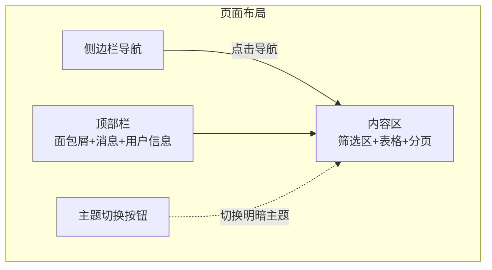
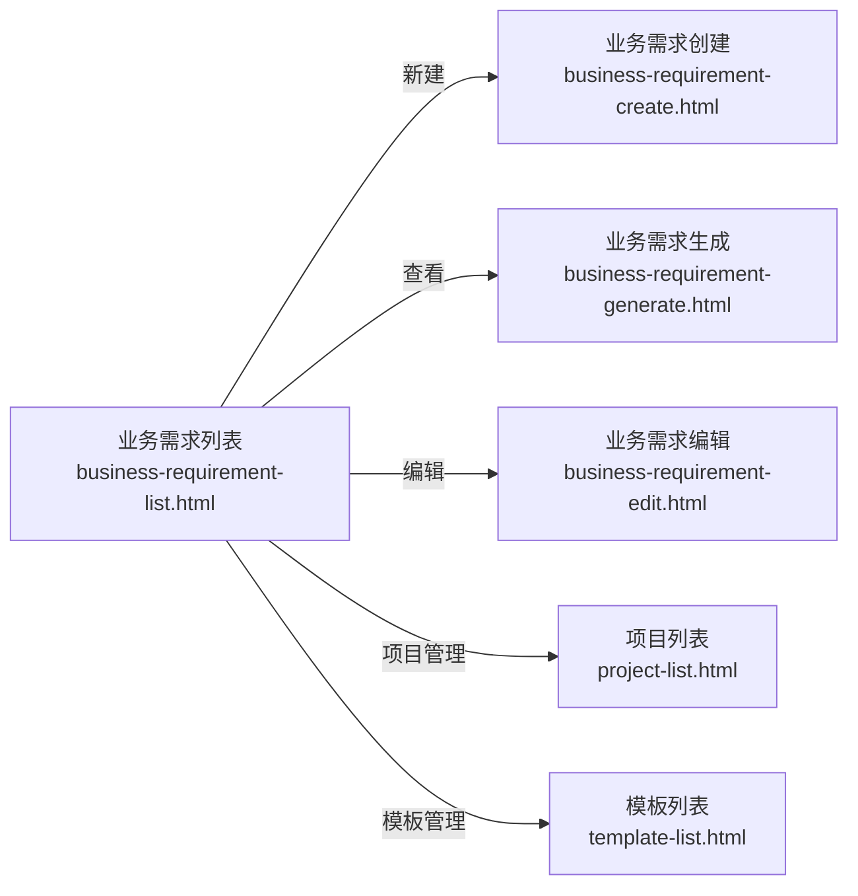
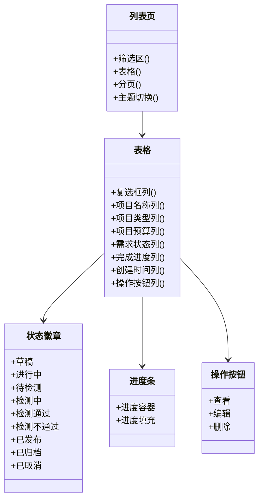
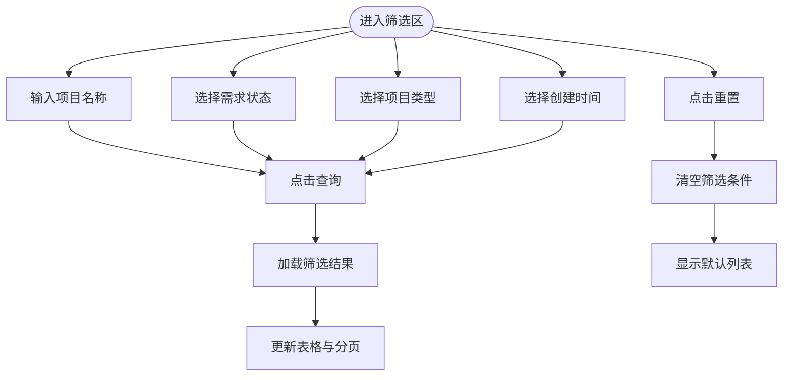
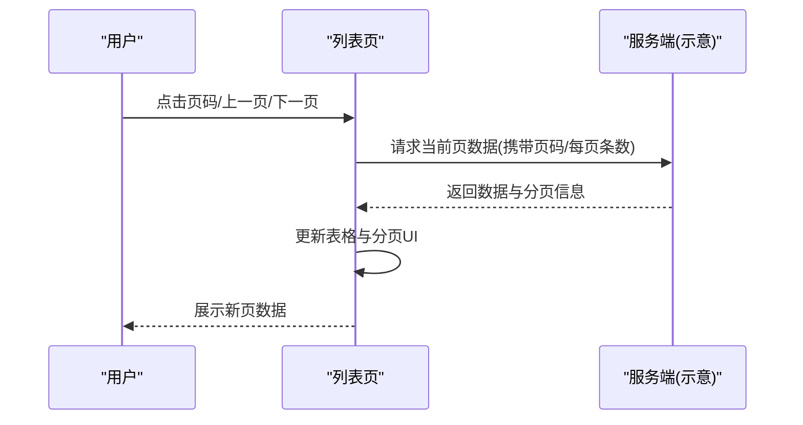
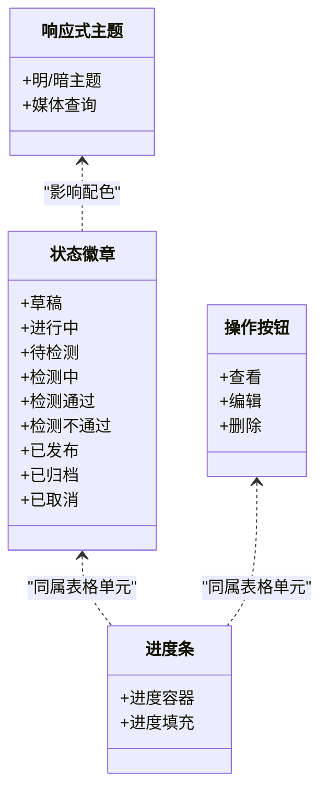
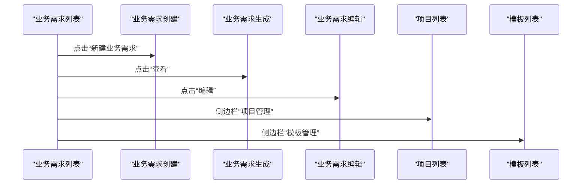
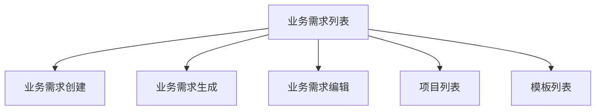

# 业务需求列表

<cite>
**本文引用的文件**
- [business-requirement-list.html](file://pages/business-requirement-list.html)
- [business-requirement-create.html](file://pages/business-requirement-create.html)
- [business-requirement-edit.html](file://pages/business-requirement-edit.html)
- [business-requirement-generate.html](file://pages/business-requirement-generate.html)
- [project-list.html](file://pages/project-list.html)
- [template-list.html](file://pages/template-list.html)
</cite>

## 目录
1. [简介](#简介)
2. [项目结构](#项目结构)
3. [核心组件](#核心组件)
4. [架构总览](#架构总览)
5. [详细组件分析](#详细组件分析)
6. [依赖分析](#依赖分析)
7. [性能考虑](#性能考虑)
8. [故障排查指南](#故障排查指南)
9. [结论](#结论)

## 简介
本文档面向“业务需求列表”页面，系统化阐述其数据展示机制、筛选与分页实现、UI 组件设计以及与业务需求创建、编辑、生成页面的导航关系。目标是帮助产品、前端与测试人员快速理解页面能力边界与使用方式，并为后续迭代提供一致的设计与交互参考。

## 项目结构
该页面属于“招标文件生成系统”的前端页面之一，采用统一的布局与主题体系：
- 侧边栏导航：包含“编制业务需求”“项目管理”“模板管理”等模块入口
- 顶部面包屑：清晰指示当前所在路径
- 内容区：业务需求列表、筛选区、表格、分页区与主题切换按钮

图表来源
- [business-requirement-list.html:509-764](file://pages/business-requirement-list.html#L509-L764)

章节来源
- [business-requirement-list.html:509-764](file://pages/business-requirement-list.html#L509-L764)

## 核心组件
- 筛选区：支持按“项目名称”“需求状态”“项目类型”“创建时间”进行筛选，并提供“查询/重置”按钮
- 表格：展示业务需求的关键字段，含状态徽章、进度条、操作按钮组
- 分页区：显示记录总数、当前页范围与页码控件
- 主题切换：支持明/暗主题切换

章节来源
- [business-requirement-list.html:546-761](file://pages/business-requirement-list.html#L546-L761)

## 架构总览
从页面到导航的关系如下：业务需求列表页通过侧边栏导航与其他页面建立连接；点击“新建业务需求”按钮跳转至创建页；在列表行内点击“查看/编辑/删除”等操作按钮分别跳转至生成页或编辑页。

图表来源
- [business-requirement-list.html:510-519](file://pages/business-requirement-list.html#L510-L519)
- [business-requirement-create.html:693-701](file://pages/business-requirement-create.html#L693-L701)
- [business-requirement-edit.html:612-620](file://pages/business-requirement-edit.html#L612-L620)
- [business-requirement-generate.html:697-707](file://pages/business-requirement-generate.html#L697-L707)
- [project-list.html:61-103](file://pages/project-list.html#L61-L103)
- [template-list.html:61-103](file://pages/template-list.html#L61-L103)

## 详细组件分析

### 数据展示机制
- 表格列定义：复选框、项目名称、项目类型、项目预算、需求状态、完成进度、创建时间、操作按钮
- 状态标识：使用状态徽章区分不同状态（草稿、进行中、待检测、检测中、检测通过、检测不通过、已发布、已归档、已取消）
- 进度条：以固定宽度的进度容器与填充元素展示百分比
- 操作按钮：查看、编辑、删除等图标按钮，悬停高亮

图表来源
- [business-requirement-list.html:591-745](file://pages/business-requirement-list.html#L591-L745)

章节来源
- [business-requirement-list.html:591-745](file://pages/business-requirement-list.html#L591-L745)

### 筛选功能实现
- 项目名称：文本输入框，支持模糊匹配
- 需求状态：下拉选择，包含全部与具体状态选项
- 项目类型：下拉选择，包含全部与工程类/货物类/服务类
- 创建时间：日期输入框
- 查询/重置：提交筛选条件或清空条件

图表来源
- [business-requirement-list.html:546-583](file://pages/business-requirement-list.html#L546-L583)

章节来源
- [business-requirement-list.html:546-583](file://pages/business-requirement-list.html#L546-L583)

### 分页系统与数据加载
- 分页信息：显示总记录数与当前显示范围
- 页码控件：上一页、页码按钮、下一页
- 当前页高亮：active 样式标识当前页
- 数据加载：当前页码变化时触发数据刷新（页面示例中为静态占位）

图表来源
- [business-requirement-list.html:747-760](file://pages/business-requirement-list.html#L747-L760)

章节来源
- [business-requirement-list.html:747-760](file://pages/business-requirement-list.html#L747-L760)

### UI 组件说明
- 状态徽章：用于标识需求状态，不同状态对应不同颜色与背景
- 进度条：固定宽度容器与填充，展示完成百分比
- 操作按钮组：查看、编辑、删除等图标按钮，支持悬停高亮
- 响应式设计：采用媒体查询适配明/暗主题，整体布局在桌面端保持侧边栏+主内容区结构

图表来源
- [business-requirement-list.html:353-437](file://pages/business-requirement-list.html#L353-L437)
- [business-requirement-list.html:380-393](file://pages/business-requirement-list.html#L380-L393)

章节来源
- [business-requirement-list.html:353-437](file://pages/business-requirement-list.html#L353-L437)
- [business-requirement-list.html:380-393](file://pages/business-requirement-list.html#L380-L393)

### 导航关系与页面联动
- 列表页 -> 创建页：点击“新建业务需求”
- 列表页 -> 生成页：点击行内“查看”
- 列表页 -> 编辑页：点击行内“编辑”
- 列表页 -> 项目管理/模板管理：侧边栏导航

图表来源
- [business-requirement-list.html](file://pages/business-requirement-list.html#L588)
- [business-requirement-list.html:619-741](file://pages/business-requirement-list.html#L619-L741)
- [business-requirement-create.html](file://pages/business-requirement-create.html#L730)
- [business-requirement-edit.html](file://pages/business-requirement-edit.html#L649)
- [business-requirement-generate.html](file://pages/business-requirement-generate.html#L736)

章节来源
- [business-requirement-list.html:588-741](file://pages/business-requirement-list.html#L588-L741)
- [business-requirement-create.html](file://pages/business-requirement-create.html#L730)
- [business-requirement-edit.html](file://pages/business-requirement-edit.html#L649)
- [business-requirement-generate.html](file://pages/business-requirement-generate.html#L736)

## 依赖分析
- 页面间依赖：列表页通过按钮与侧边栏导航与其他页面建立链接
- 样式依赖：所有页面共享同一套变量与主题切换逻辑
- 交互依赖：筛选、分页、主题切换均为纯前端交互（页面示例未包含真实 AJAX 调用）

图表来源
- [business-requirement-list.html:510-519](file://pages/business-requirement-list.html#L510-L519)
- [business-requirement-create.html:693-701](file://pages/business-requirement-create.html#L693-L701)
- [business-requirement-edit.html:612-620](file://pages/business-requirement-edit.html#L612-L620)
- [business-requirement-generate.html:697-707](file://pages/business-requirement-generate.html#L697-L707)
- [project-list.html:61-103](file://pages/project-list.html#L61-L103)
- [template-list.html:61-103](file://pages/template-list.html#L61-L103)

章节来源
- [business-requirement-list.html:510-519](file://pages/business-requirement-list.html#L510-L519)
- [business-requirement-create.html:693-701](file://pages/business-requirement-create.html#L693-L701)
- [business-requirement-edit.html:612-620](file://pages/business-requirement-edit.html#L612-L620)
- [business-requirement-generate.html:697-707](file://pages/business-requirement-generate.html#L697-L707)
- [project-list.html:61-103](file://pages/project-list.html#L61-L103)
- [template-list.html:61-103](file://pages/template-list.html#L61-L103)

## 性能考虑
- 静态页面：当前实现为静态 HTML/CSS/JS，无复杂计算
- 建议：若未来接入后端接口，建议对筛选与分页做防抖与缓存策略，避免频繁请求
- 视觉反馈：进度条与按钮 hover 效果使用过渡动画，注意在低端设备上的流畅性

## 故障排查指南
- 筛选无效：确认筛选项是否正确绑定事件（当前页面示例为静态占位）
- 分页不更新：检查页码控件是否正确更新当前页与数据渲染
- 主题切换异常：检查主题切换函数是否正确写入 CSS 变量
- 导航失效：检查侧边栏与面包屑中的链接地址是否正确

章节来源
- [business-requirement-list.html:766-784](file://pages/business-requirement-list.html#L766-L784)

## 结论
业务需求列表页面提供了清晰的数据展示与基础筛选、分页能力，配合统一的主题与导航体系，形成良好的用户体验。建议在后续版本中补充真实的数据加载与交互逻辑，以满足实际业务场景。