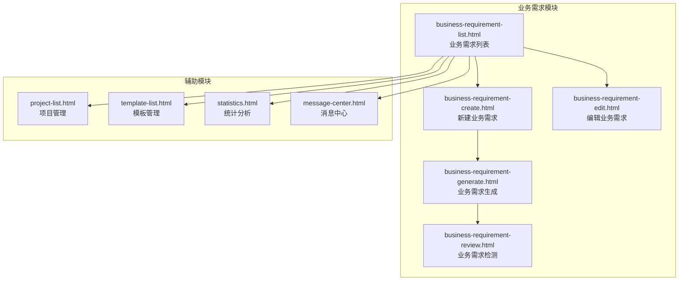
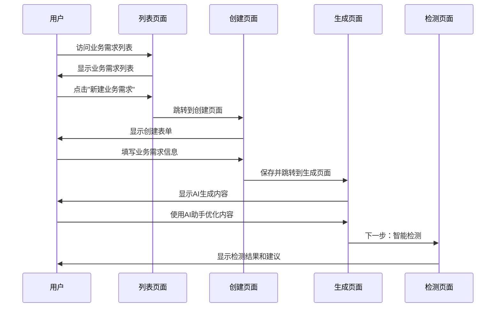
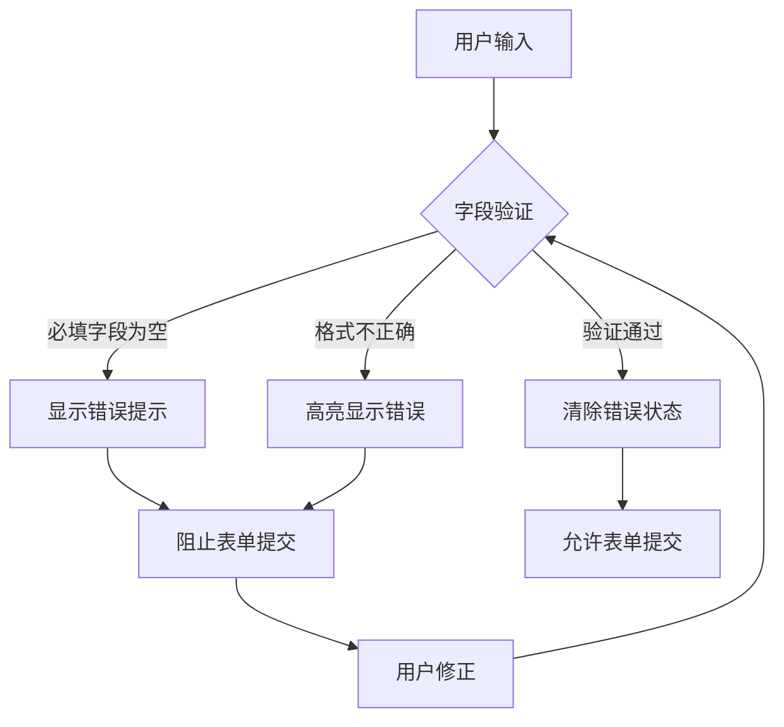
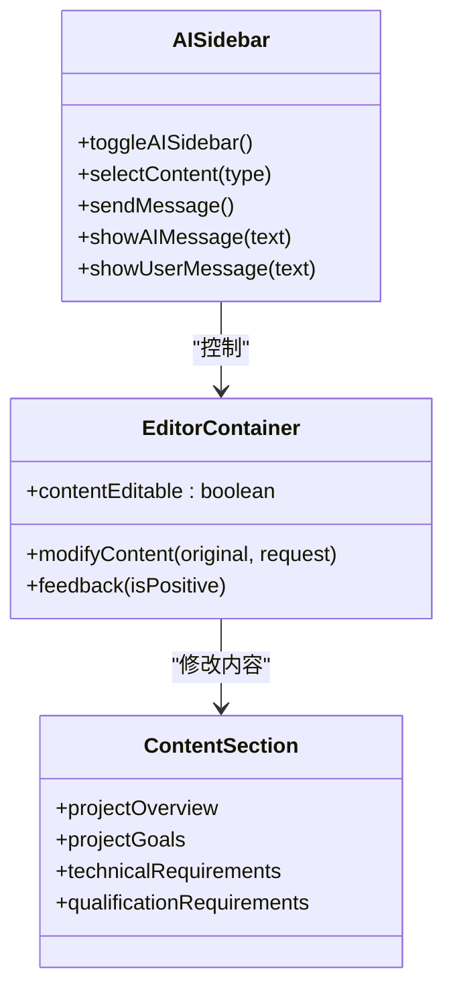
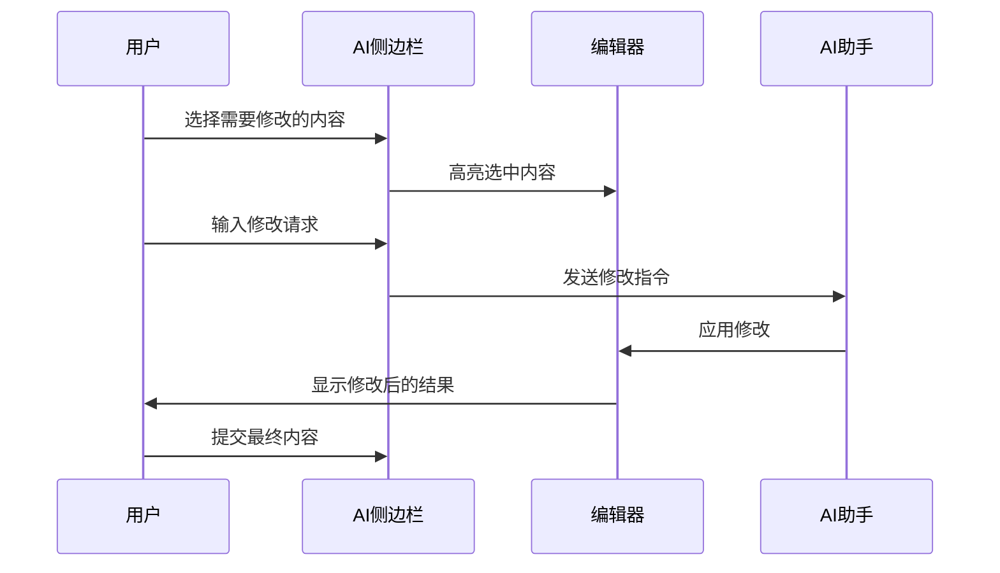
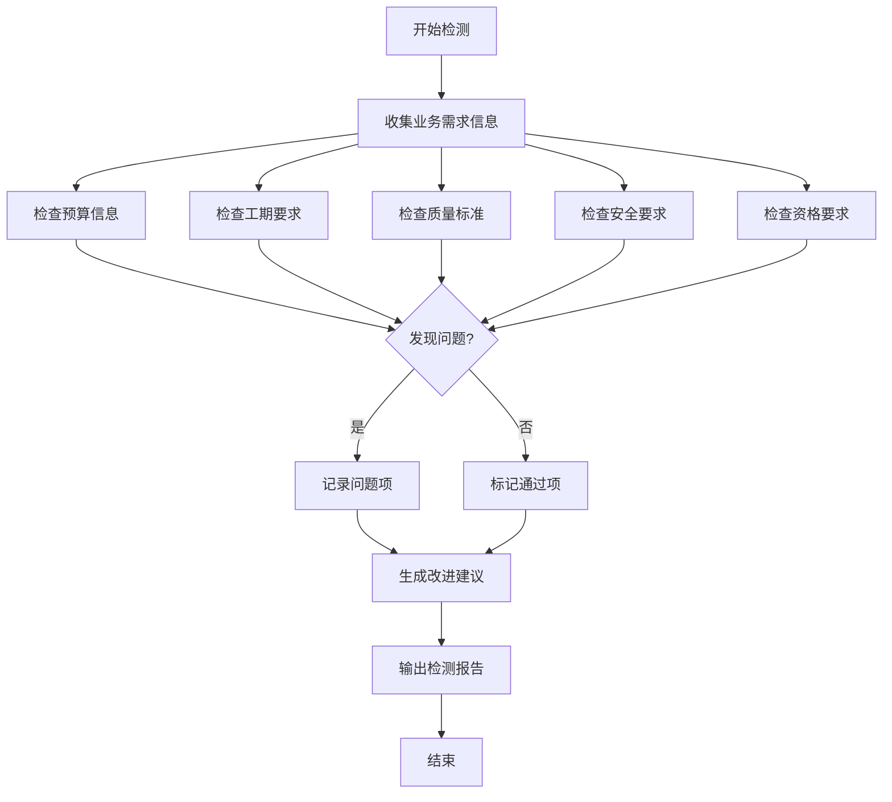
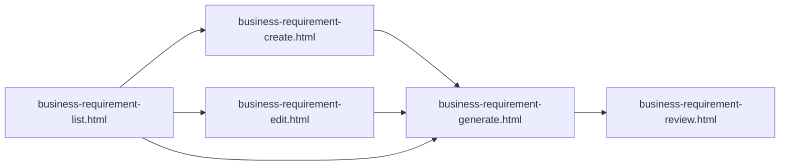
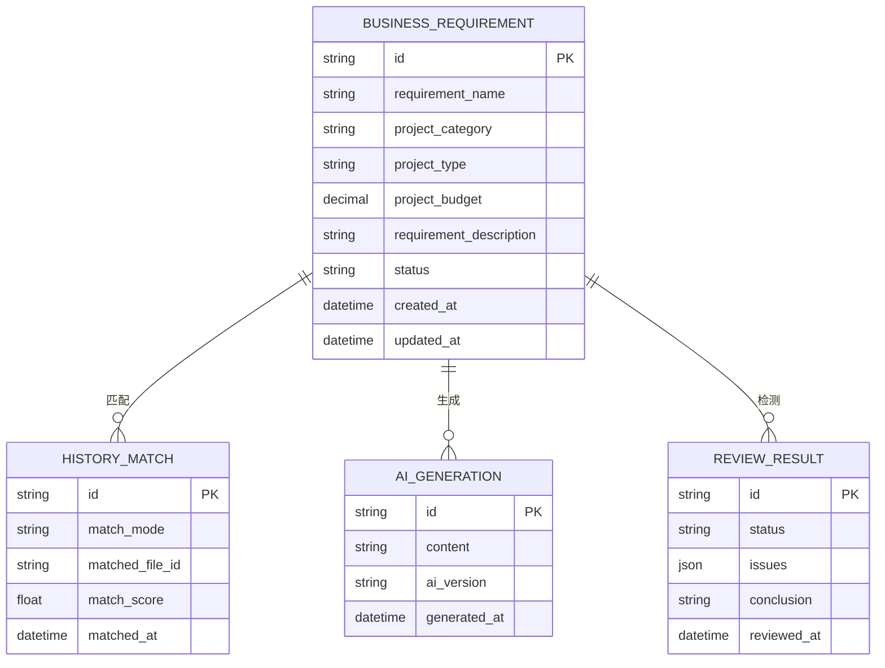

# 业务需求创建

<cite>
**本文档引用的文件**
- [business-requirement-create.html](file://pages/business-requirement-create.html)
- [business-requirement-edit.html](file://pages/business-requirement-edit.html)
- [business-requirement-generate.html](file://pages/business-requirement-generate.html)
- [business-requirement-list.html](file://pages/business-requirement-list.html)
- [business-requirement-review.html](file://pages/business-requirement-review.html)
</cite>

## 目录
1. [简介](#简介)
2. [项目结构](#项目结构)
3. [核心组件](#核心组件)
4. [架构概览](#架构概览)
5. [详细组件分析](#详细组件分析)
6. [依赖关系分析](#依赖关系分析)
7. [性能考虑](#性能考虑)
8. [故障排除指南](#故障排除指南)
9. [结论](#结论)

## 简介

业务需求创建页面是招标文件生成系统的核心功能模块，负责为用户提供完整的业务需求创建、编辑、生成和审核流程。该系统采用现代化的Web技术栈，提供了从需求录入到AI生成再到智能检测的完整工作流。

系统支持多种项目类型（工程类、货物类、服务类），具备智能历史需求匹配功能，集成了AI助手进行内容优化，并提供了完整的审核机制确保业务需求的质量。

## 项目结构

系统采用模块化的页面结构设计，每个功能页面都有独立的HTML文件，通过统一的导航系统连接各个功能模块。



**图表来源**
- [business-requirement-list.html:509-764](file://pages/business-requirement-list.html#L509-L764)
- [business-requirement-create.html:692-895](file://pages/business-requirement-create.html#L692-L895)

**章节来源**
- [business-requirement-list.html:1-787](file://pages/business-requirement-list.html#L1-L787)
- [business-requirement-create.html:1-1181](file://pages/business-requirement-create.html#L1-L1181)

## 核心组件

### 表单组件体系

系统采用统一的表单设计语言，包含以下核心组件：

- **基本信息表单**：需求名称、项目类别、项目类型、预算价格、需求描述
- **历史匹配组件**：三种匹配模式（自动匹配、手动选择、上传文件）
- **动态编辑器**：AI驱动的内容编辑和优化功能
- **智能检测面板**：业务需求质量评估和改进建议

### 数据验证机制

系统实现了多层次的数据验证策略：

- **前端即时验证**：实时字段检查和格式验证
- **业务规则约束**：项目类型与预算的逻辑关联
- **用户体验反馈**：直观的错误提示和修正建议

**章节来源**
- [business-requirement-create.html:740-891](file://pages/business-requirement-create.html#L740-L891)
- [business-requirement-edit.html:659-885](file://pages/business-requirement-edit.html#L659-L885)

## 架构概览

系统采用前后端分离的架构设计，前端使用纯HTML/CSS/JavaScript实现，后端通过RESTful API提供数据服务。



**图表来源**
- [business-requirement-create.html:905-935](file://pages/business-requirement-create.html#L905-L935)
- [business-requirement-generate.html:905-908](file://pages/business-requirement-generate.html#L905-L908)
- [business-requirement-review.html:703-707](file://pages/business-requirement-review.html#L703-L707)

## 详细组件分析

### 业务需求创建表单

#### 字段设计与验证

表单包含以下核心字段：

| 字段名称 | 类型 | 必填 | 验证规则 | 描述 |
|---------|------|------|----------|------|
| 需求名称 | 文本输入 | 是 | 1-100字符，唯一性检查 | 业务需求的标题名称 |
| 项目类别 | 下拉选择 | 是 | 选项验证 | 限额以下/产权交易/政府采购 |
| 项目类型 | 下拉选择 | 是 | 选项验证 | 工程类/货物类/服务类 |
| 预算价 | 数字输入 | 是 | 正数，保留2位小数 | 项目预算金额（万元） |
| 需求描述 | 多行文本 | 否 | ≤500字符 | 业务需求的详细说明 |

#### 实时验证机制



**图表来源**
- [business-requirement-create.html:905-935](file://pages/business-requirement-create.html#L905-L935)

#### 历史需求匹配系统

系统提供三种历史需求匹配模式：

1. **自动匹配模式**：系统根据当前需求自动匹配最相关的历史文件
2. **手动选择模式**：展示匹配度高的历史文件供用户选择
3. **上传模式**：支持用户上传自定义的业务需求文件

**章节来源**
- [business-requirement-create.html:804-885](file://pages/business-requirement-create.html#L804-L885)

### AI内容生成与编辑

#### AI助手功能



**图表来源**
- [business-requirement-generate.html:917-944](file://pages/business-requirement-generate.html#L917-L944)
- [business-requirement-generate.html:1012-1130](file://pages/business-requirement-generate.html#L1012-L1130)

#### 内容编辑流程



**图表来源**
- [business-requirement-generate.html:1016-1094](file://pages/business-requirement-generate.html#L1016-L1094)

**章节来源**
- [business-requirement-generate.html:825-909](file://pages/business-requirement-generate.html#L825-L909)

### 智能检测系统

#### 检测指标体系

| 检测类别 | 评分标准 | 影响程度 |
|---------|----------|----------|
| 预算完整性 | 预算分解详细程度 | 严重 |
| 工期明确性 | 开工/完工日期明确性 | 警告 |
| 质量标准 | 技术标准具体性 | 警告 |
| 安全要求 | 安全管理措施完整性 | 警告 |
| 资质要求 | 资格条件合理性 | 通过 |

#### 检测流程



**图表来源**
- [business-requirement-review.html:620-693](file://pages/business-requirement-review.html#L620-L693)

**章节来源**
- [business-requirement-review.html:596-707](file://pages/business-requirement-review.html#L596-L707)

### 用户交互体验设计

#### 主题切换功能

系统支持深色/浅色主题切换，通过CSS变量实现动态主题切换：

```javascript
function toggleTheme() {
    const body = document.body;
    const currentTheme = body.style.getPropertyValue('--bg-primary');
    
    if (currentTheme === '#FFFFFF') {
        // 切换到深色主题
        body.style.setProperty('--bg-primary', '#0F1419');
        body.style.setProperty('--text-primary', '#F0F2F5');
    } else {
        // 切换到浅色主题
        body.style.setProperty('--bg-primary', '#FFFFFF');
        body.style.setProperty('--text-primary', '#1F2937');
    }
}
```

#### 实时反馈机制

- **输入提示**：每个字段都配有详细的输入指导
- **格式验证**：实时显示输入格式是否正确
- **进度指示**：生成和检测过程都有可视化进度条
- **错误处理**：友好的错误提示和解决方案建议

**章节来源**
- [business-requirement-create.html:937-954](file://pages/business-requirement-create.html#L937-L954)
- [business-requirement-generate.html:946-964](file://pages/business-requirement-generate.html#L946-L964)

## 依赖关系分析

### 组件耦合度

系统采用松耦合设计，各页面间通过URL导航连接，减少了直接的代码依赖：



**图表来源**
- [business-requirement-create.html:934-935](file://pages/business-requirement-create.html#L934-L935)
- [business-requirement-generate.html:907-908](file://pages/business-requirement-generate.html#L907-L908)

### 数据流关系



**图表来源**
- [business-requirement-create.html:905-935](file://pages/business-requirement-create.html#L905-L935)
- [business-requirement-generate.html:1083-1094](file://pages/business-requirement-generate.html#L1083-L1094)

**章节来源**
- [business-requirement-list.html:585-761](file://pages/business-requirement-list.html#L585-L761)

## 性能考虑

### 前端性能优化

- **懒加载机制**：AI助手侧边栏默认折叠，减少初始渲染负担
- **事件委托**：使用事件委托处理大量按钮点击事件
- **虚拟滚动**：列表页面实现分页加载，避免一次性渲染大量DOM节点
- **缓存策略**：浏览器缓存静态资源，减少重复加载

### 数据传输优化

- **增量更新**：AI修改功能支持局部内容更新
- **压缩传输**：文本内容采用压缩格式传输
- **防抖处理**：输入验证采用防抖机制，避免频繁验证请求

## 故障排除指南

### 常见问题及解决方案

| 问题类型 | 症状 | 解决方案 |
|---------|------|----------|
| 表单验证失败 | 字段变红但无提示 | 检查浏览器JavaScript是否启用 |
| 文件上传失败 | 上传按钮无响应 | 确认文件格式和大小限制 |
| AI助手无响应 | 输入框无法发送消息 | 检查网络连接和浏览器兼容性 |
| 页面跳转异常 | 点击按钮无反应 | 刷新页面或清理浏览器缓存 |

### 调试工具

系统内置了简单的调试功能：
- 控制台日志输出关键操作信息
- 错误捕获和用户友好提示
- 状态码显示和错误追踪

**章节来源**
- [business-requirement-create.html:1034-1132](file://pages/business-requirement-create.html#L1034-L1132)
- [business-requirement-generate.html:1012-1130](file://pages/business-requirement-generate.html#L1012-L1130)

## 结论

业务需求创建系统通过精心设计的表单架构、智能化的AI辅助功能和严格的审核机制，为用户提供了完整的业务需求管理解决方案。系统不仅满足了基本的业务需求录入功能，还通过历史匹配、AI生成和智能检测等高级功能，显著提升了业务需求的质量和效率。

系统的模块化设计和松耦合架构确保了良好的可维护性和扩展性，为未来的功能增强和技术升级奠定了坚实的基础。通过统一的用户体验设计和完善的错误处理机制，系统为不同技术水平的用户提供了友好、高效的操作界面。