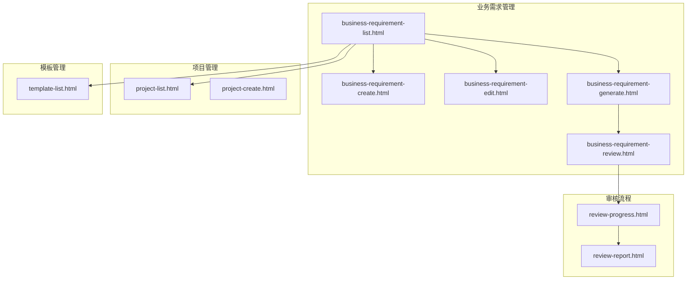
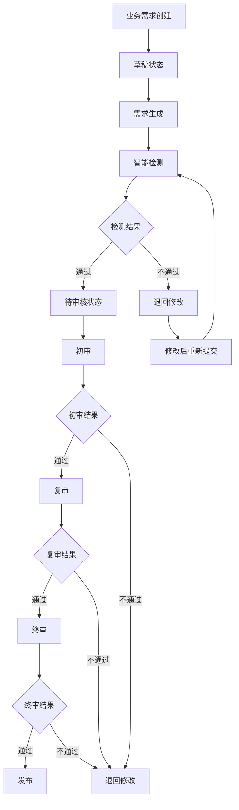
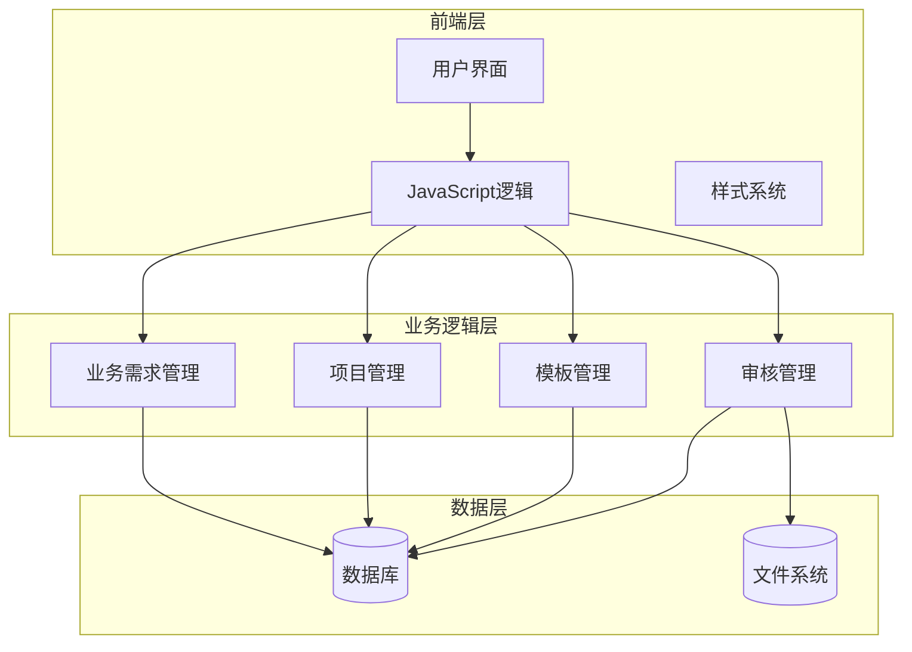
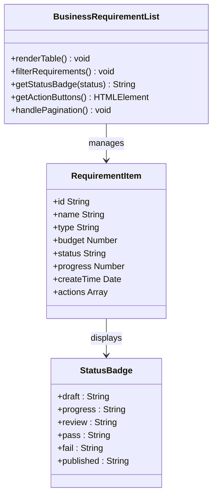
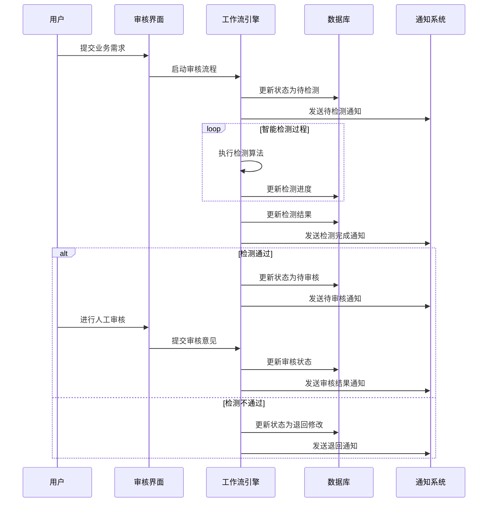
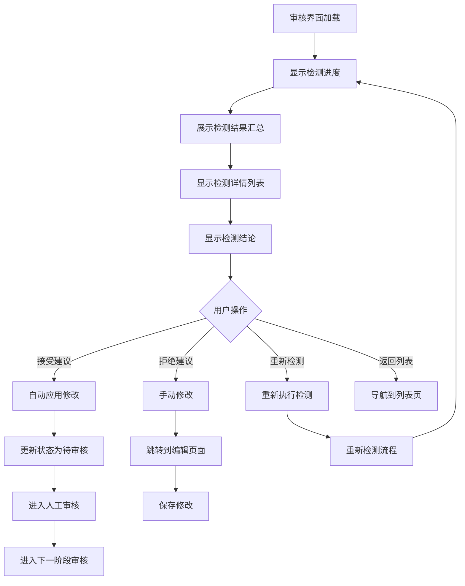
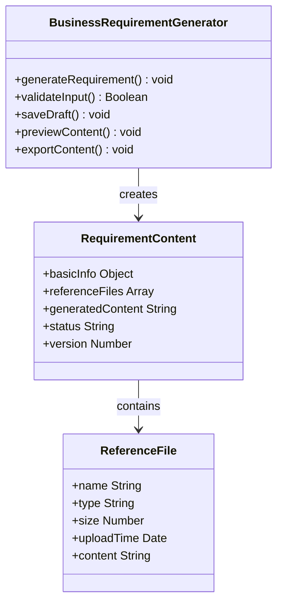
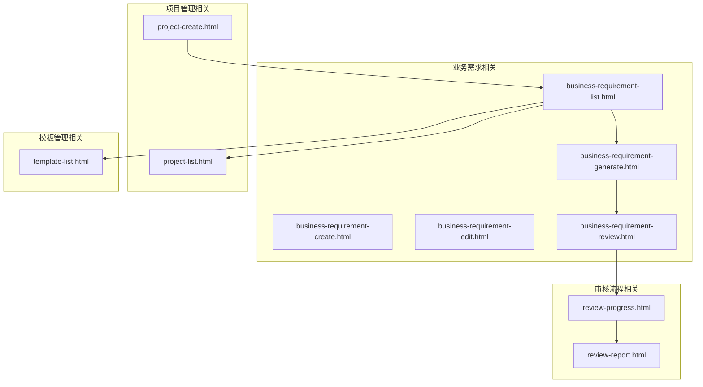

# 业务需求审核

<cite>
**本文引用的文件**
- [business-requirement-review.html](file://pages/business-requirement-review.html)
- [business-requirement-list.html](file://pages/business-requirement-list.html)
- [business-requirement-generate.html](file://pages/business-requirement-generate.html)
- [business-requirement-create.html](file://pages/business-requirement-create.html)
- [business-requirement-edit.html](file://pages/business-requirement-edit.html)
- [project-list.html](file://pages/project-list.html)
- [template-list.html](file://pages/template-list.html)
- [project-create.html](file://pages/project-create.html)
- [review-progress.html](file://pages/review-progress.html)
- [review-report.html](file://pages/review-report.html)
</cite>

## 目录
1. [简介](#简介)
2. [项目结构](#项目结构)
3. [核心组件](#核心组件)
4. [架构概览](#架构概览)
5. [详细组件分析](#详细组件分析)
6. [依赖分析](#依赖分析)
7. [性能考虑](#性能考虑)
8. [故障排除指南](#故障排除指南)
9. [结论](#结论)

## 简介

本文档为业务需求审核页面的全面管理文档，详细说明审核流程的设计和实现，包括审核状态管理、审批权限控制、审核意见填写和状态变更机制。文档深入解释审核界面的功能设计，包括需求内容展示、审核操作按钮、意见输入框和历史记录查看。涵盖多级审核流程的实现，包括初审、复审、终审的权限分配和流转规则，并提供完整的审核工作流说明，包括状态转换图、操作日志记录和通知机制。同时解释与项目管理、模板管理的关联关系和数据一致性保证。

## 项目结构

该项目采用基于HTML的前端页面架构，主要包含以下核心页面：

**图表来源**
- [business-requirement-list.html:1-787](file://pages/business-requirement-list.html#L1-L787)
- [business-requirement-create.html:1-1181](file://pages/business-requirement-create.html#L1-L1181)
- [business-requirement-edit.html:1-1028](file://pages/business-requirement-edit.html#L1-L1028)
- [business-requirement-generate.html:1-1132](file://pages/business-requirement-generate.html#L1-L1132)
- [business-requirement-review.html:1-741](file://pages/business-requirement-review.html#L1-L741)
- [review-progress.html:503-800](file://pages/review-progress.html#L503-L800)
- [review-report.html:1104-1199](file://pages/review-report.html#L1104-L1199)

**章节来源**
- [business-requirement-list.html:1-787](file://pages/business-requirement-list.html#L1-L787)
- [business-requirement-create.html:1-1181](file://pages/business-requirement-create.html#L1-L1181)

## 核心组件

### 审核状态管理系统

系统采用多级审核状态管理机制，支持以下状态流转：

| 状态代码 | 状态名称 | 描述 | 颜色标识 |
|---------|----------|------|----------|
| draft | 草稿 | 需求刚创建，尚未提交审核 | 灰色 |
| progress | 进行中 | 需求正在生成或编辑中 | 蓝色 |
| review | 待检测 | 需求已提交，等待智能检测 | 黄色 |
| pass | 检测通过 | 智能检测通过，可以进入正式审核 | 绿色 |
| fail | 检测不通过 | 智能检测失败，需要修改后重新提交 | 红色 |
| published | 已发布 | 审核通过，需求已发布 | 青蓝色 |

### 审核权限控制模型

系统采用基于角色的权限控制模型：

**图表来源**
- [business-requirement-list.html:353-367](file://pages/business-requirement-list.html#L353-L367)
- [business-requirement-review.html:616-693](file://pages/business-requirement-review.html#L616-L693)

### 审核界面功能设计

审核界面采用卡片式布局设计，主要包含以下功能模块：

1. **检测进度展示** - 实时显示检测进度条和完成状态
2. **检测结果汇总** - 统计严重问题、警告项和通过项的数量
3. **检测详情列表** - 详细展示每个检测项的问题级别、描述和建议
4. **检测结论** - 总结性建议和下一步操作指引
5. **操作按钮组** - 包含返回、重新检测等功能按钮

**章节来源**
- [business-requirement-review.html:596-708](file://pages/business-requirement-review.html#L596-L708)

## 架构概览

系统采用前后端分离的架构设计，前端使用纯HTML+CSS+JavaScript实现，后端通过RESTful API进行数据交互。

**图表来源**
- [business-requirement-list.html:509-764](file://pages/business-requirement-list.html#L509-L764)
- [project-list.html:509-797](file://pages/project-list.html#L509-L797)
- [template-list.html:565-800](file://pages/template-list.html#L565-L800)

## 详细组件分析

### 业务需求列表组件

业务需求列表组件提供完整的业务需求生命周期管理：

**图表来源**
- [business-requirement-list.html:585-746](file://pages/business-requirement-list.html#L585-L746)

#### 列表功能特性

1. **筛选功能** - 支持按项目名称、需求状态、项目类型、创建时间等条件筛选
2. **状态显示** - 使用彩色徽章显示不同状态，便于快速识别
3. **进度可视化** - 进度条直观展示任务完成情况
4. **批量操作** - 支持全选和批量处理功能
5. **分页管理** - 支持大数据量的分页浏览

**章节来源**
- [business-requirement-list.html:546-761](file://pages/business-requirement-list.html#L546-L761)

### 审核工作流组件

审核工作流组件实现完整的多级审核流程：

**图表来源**
- [review-progress.html:536-800](file://pages/review-progress.html#L536-L800)
- [review-report.html:1104-1199](file://pages/review-report.html#L1104-L1199)

#### 多级审核流程

系统支持三级审核机制：

1. **初审阶段** - 技术层面的初步审核
2. **复审阶段** - 业务层面的详细审核  
3. **终审阶段** - 最终决策审核

每级审核都有相应的权限控制和审批要求。

**章节来源**
- [review-progress.html:503-800](file://pages/review-progress.html#L503-L800)
- [review-report.html:1104-1199](file://pages/review-report.html#L1104-L1199)

### 审核界面组件

审核界面组件提供直观的审核操作环境：

**图表来源**
- [business-requirement-review.html:596-708](file://pages/business-requirement-review.html#L596-L708)

#### 界面元素设计

1. **进度指示器** - 实时显示审核进度
2. **结果统计面板** - 清晰展示各类检测结果数量
3. **问题详情卡片** - 每个问题都有独立的展示卡片
4. **操作按钮组** - 提供便捷的操作入口
5. **响应式布局** - 适配不同屏幕尺寸

**章节来源**
- [business-requirement-review.html:596-708](file://pages/business-requirement-review.html#L596-L708)

### 业务需求生成组件

业务需求生成组件负责需求内容的创建和管理：

**图表来源**
- [business-requirement-generate.html:756-800](file://pages/business-requirement-generate.html#L756-L800)

#### 生成流程特性

1. **智能生成** - 基于AI技术自动生成需求内容
2. **参考文件集成** - 支持多种参考文件模式
3. **实时预览** - 生成过程中的实时内容预览
4. **版本管理** - 自动版本控制和历史记录
5. **导出功能** - 支持多种格式的内容导出

**章节来源**
- [business-requirement-generate.html:756-800](file://pages/business-requirement-generate.html#L756-L800)

## 依赖分析

系统各组件之间的依赖关系如下：

**图表来源**
- [business-requirement-list.html:509-764](file://pages/business-requirement-list.html#L509-L764)
- [project-create.html:692-865](file://pages/project-create.html#L692-L865)

### 关联关系说明

1. **业务需求与项目管理** - 业务需求必须关联到具体的项目
2. **业务需求与模板管理** - 业务需求生成时需要使用模板
3. **审核流程与业务需求** - 审核流程围绕业务需求展开
4. **项目与业务需求** - 一个项目可以包含多个业务需求

**章节来源**
- [project-create.html:692-865](file://pages/project-create.html#L692-L865)

## 性能考虑

### 前端性能优化

1. **懒加载机制** - 对于大型表格和列表采用分页加载
2. **缓存策略** - 对常用数据进行本地缓存
3. **异步处理** - 审核检测采用异步方式进行
4. **资源压缩** - CSS和JavaScript文件进行压缩优化

### 数据一致性保证

1. **事务处理** - 关键业务操作采用事务保证数据一致性
2. **状态同步** - 多用户环境下确保状态同步
3. **冲突解决** - 提供冲突检测和解决机制
4. **审计日志** - 记录所有关键操作的日志信息

## 故障排除指南

### 常见问题及解决方案

1. **审核状态异常**
   - 检查数据库连接状态
   - 验证状态转换规则
   - 查看操作日志定位问题

2. **界面显示异常**
   - 检查CSS文件加载
   - 验证JavaScript执行环境
   - 确认浏览器兼容性

3. **数据同步问题**
   - 检查网络连接稳定性
   - 验证API接口可用性
   - 确认缓存机制正常工作

### 调试工具和方法

1. **浏览器开发者工具** - 用于前端调试和性能分析
2. **网络监控工具** - 监控API请求和响应
3. **日志分析工具** - 分析系统运行日志
4. **数据库监控工具** - 监控数据库性能和连接

**章节来源**
- [business-requirement-list.html:766-786](file://pages/business-requirement-list.html#L766-L786)

## 结论

业务需求审核系统通过合理的架构设计和完善的功能实现，为招标文件编制提供了高效的审核管理解决方案。系统采用多级审核机制，结合智能检测和人工审核，确保业务需求的质量和合规性。通过与项目管理和模板管理的深度集成，实现了从需求创建到发布的完整生命周期管理。

系统的成功实施需要关注以下关键点：
- 明确的审核流程和权限控制
- 完善的数据一致性和完整性保证
- 友好的用户体验和直观的操作界面
- 稳定的系统性能和可靠的故障恢复机制

通过持续优化和改进，该系统将为招标文件编制工作提供更加高效、准确和可靠的技术支撑。