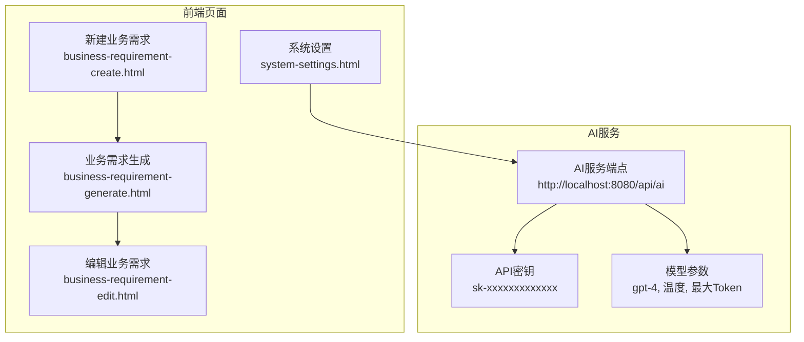
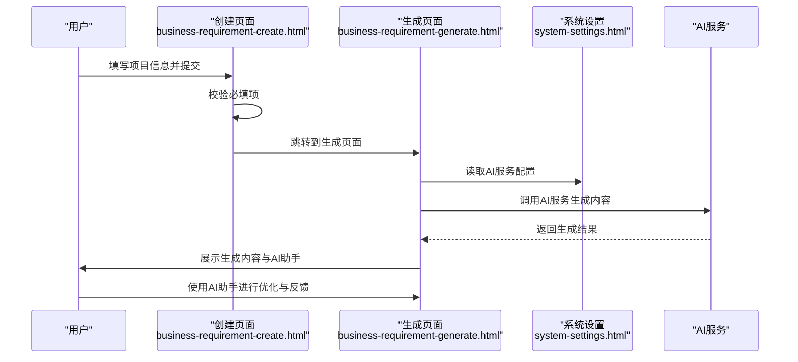
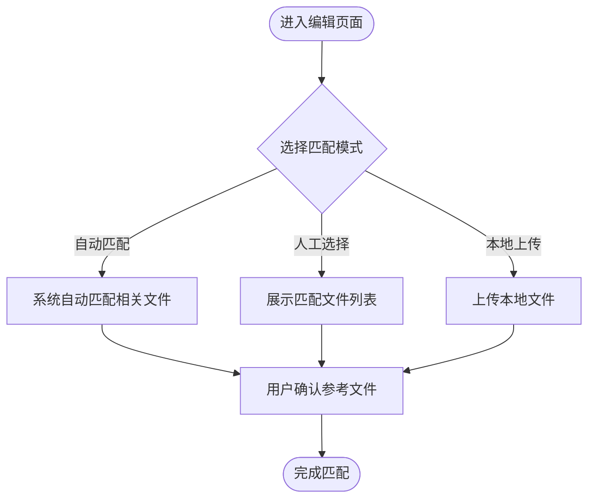
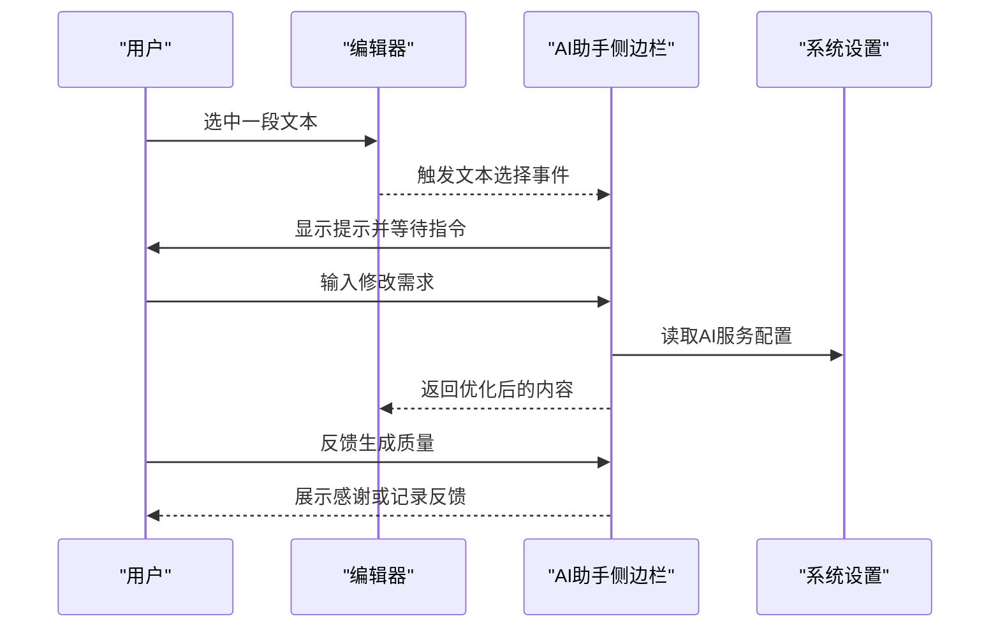
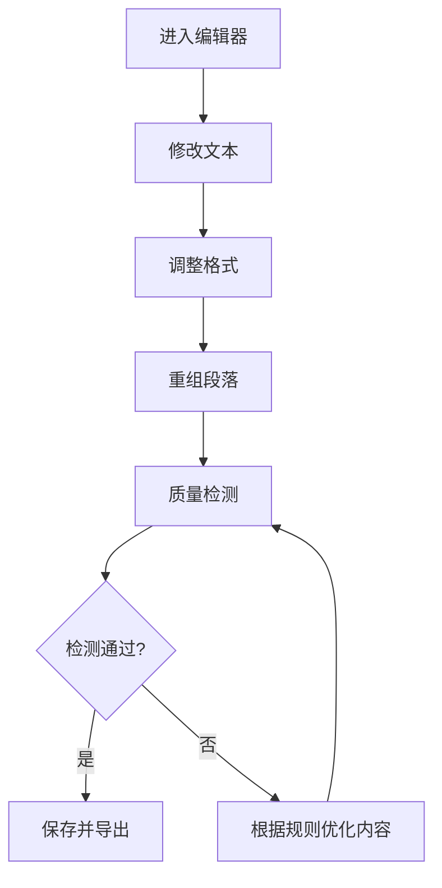
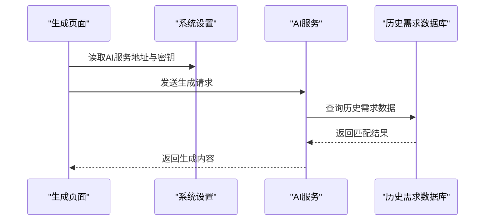
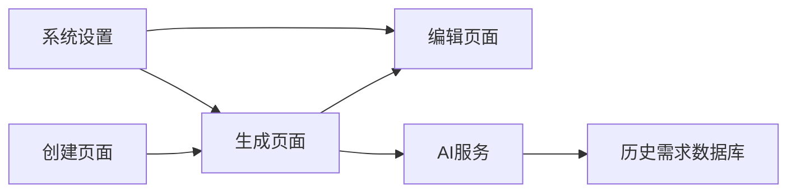

# 业务需求生成

<cite>
**本文引用的文件**
- [business-requirement-create.html](file://pages/business-requirement-create.html)
- [business-requirement-generate.html](file://pages/business-requirement-generate.html)
- [business-requirement-edit.html](file://pages/business-requirement-edit.html)
- [system-settings.html](file://pages/system-settings.html)
</cite>

## 目录
1. [简介](#简介)
2. [项目结构](#项目结构)
3. [核心组件](#核心组件)
4. [架构总览](#架构总览)
5. [详细组件分析](#详细组件分析)
6. [依赖关系分析](#依赖关系分析)
7. [性能考虑](#性能考虑)
8. [故障排查指南](#故障排查指南)
9. [结论](#结论)
10. [附录](#附录)

## 简介
本技术文档围绕“业务需求生成”模块，系统阐述AI智能生成在页面中的实现思路与交互设计，包括：
- 知识库匹配机制（历史需求检索与参考文件选择）
- 历史需求检索（系统自动匹配与人工选择）
- 模板选择逻辑（基于项目类型与预算的参考文件筛选）
- 内容优化策略（AI助手对话、文本选择、智能建议与实时反馈）
- 与历史需求数据库的连接方式（系统配置与AI服务调用）
- 生成结果的编辑、格式调整、段落重组与质量检测
- 完整的API接口说明与错误处理策略

## 项目结构
该模块由多个页面组成，分别负责业务需求的创建、生成、编辑与系统配置：
- 创建页面：收集项目基础信息，触发AI生成流程
- 生成页面：展示生成进度、内容编辑器与AI助手
- 编辑页面：支持参考文件选择与内容二次编辑
- 系统设置：配置AI服务地址、密钥、模型参数与检测规则

**图示来源**
- [business-requirement-create.html:1167-1178](file://pages/business-requirement-create.html#L1167-L1178)
- [business-requirement-generate.html:1083-1094](file://pages/business-requirement-generate.html#L1083-L1094)
- [business-requirement-edit.html:746-779](file://pages/business-requirement-edit.html#L746-L779)
- [system-settings.html:818-844](file://pages/system-settings.html#L818-L844)

**章节来源**
- [business-requirement-create.html:1-1181](file://pages/business-requirement-create.html#L1-L1181)
- [business-requirement-generate.html:1-1132](file://pages/business-requirement-generate.html#L1-L1132)
- [business-requirement-edit.html:1-1028](file://pages/business-requirement-edit.html#L1-L1028)
- [system-settings.html:800-999](file://pages/system-settings.html#L800-L999)

## 核心组件
- 业务需求创建表单：收集项目名称、类别、类型、预算与描述，触发AI生成流程
- 历史需求匹配区域：提供三种参考文件来源模式（自动匹配、人工选择、本地上传）
- AI助手侧边栏：聊天对话框、智能建议弹窗、文本选择与内容优化
- 内容编辑器：支持文本修改、格式调整、段落重组与质量检测
- 系统设置：配置AI服务地址、密钥、模型参数与检测规则

**章节来源**
- [business-requirement-create.html:740-800](file://pages/business-requirement-create.html#L740-L800)
- [business-requirement-generate.html:345-504](file://pages/business-requirement-generate.html#L345-L504)
- [business-requirement-edit.html:535-606](file://pages/business-requirement-edit.html#L535-L606)
- [system-settings.html:813-879](file://pages/system-settings.html#L813-L879)

## 架构总览
AI智能生成的整体流程如下：
- 用户在创建页面填写项目信息并提交
- 系统根据项目类型与预算，调用AI服务生成业务需求
- 生成完成后进入生成页面，用户可在编辑器中进行修改
- AI助手侧边栏提供对话、建议与反馈功能
- 参考文件可来自历史匹配或本地上传
- 系统设置中配置AI服务地址与密钥，保障调用安全与稳定性

**图示来源**
- [business-requirement-create.html:1167-1178](file://pages/business-requirement-create.html#L1167-L1178)
- [business-requirement-generate.html:1083-1094](file://pages/business-requirement-generate.html#L1083-L1094)
- [system-settings.html:818-844](file://pages/system-settings.html#L818-L844)

## 详细组件分析

### 组件A：知识库匹配机制与历史需求检索
- 自动匹配模式：系统根据项目类型与预算，自动匹配最相关的参考文件
- 人工选择模式：系统列出匹配结果供用户勾选，支持预览
- 本地上传模式：支持多文件上传，作为参考文件来源

**图示来源**
- [business-requirement-edit.html:714-779](file://pages/business-requirement-edit.html#L714-L779)

**章节来源**
- [business-requirement-edit.html:714-800](file://pages/business-requirement-edit.html#L714-L800)

### 组件B：AI助手交互界面设计
- 聊天对话框：支持用户输入与AI回复，区分用户消息与AI消息
- 文本选择功能：选中编辑器文本后显示提示，引导用户输入修改需求
- 智能建议弹窗：提供常见优化建议按钮，一键应用到内容
- 实时反馈机制：对AI生成内容进行点赞与差评反馈，支持填写改进建议

**图示来源**
- [business-requirement-generate.html:1096-1132](file://pages/business-requirement-generate.html#L1096-L1132)
- [system-settings.html:818-844](file://pages/system-settings.html#L818-L844)

**章节来源**
- [business-requirement-generate.html:345-504](file://pages/business-requirement-generate.html#L345-L504)
- [business-requirement-generate.html:1096-1132](file://pages/business-requirement-generate.html#L1096-L1132)

### 组件C：内容编辑与质量检测
- 文本修改：支持直接在编辑器中修改文本
- 格式调整：通过富文本容器保持格式一致性
- 段落重组：通过分节标题与段落结构组织内容
- 质量检测：结合检测规则配置，对内容进行合规性与公平竞争检查

**图示来源**
- [business-requirement-generate.html:555-572](file://pages/business-requirement-generate.html#L555-L572)
- [system-settings.html:848-862](file://pages/system-settings.html#L848-L862)

**章节来源**
- [business-requirement-generate.html:555-591](file://pages/business-requirement-generate.html#L555-L591)
- [system-settings.html:848-862](file://pages/system-settings.html#L848-L862)

### 组件D：与历史需求数据库的连接方式与AI服务调用
- 历史需求数据库：通过系统设置中的AI服务地址与密钥进行访问
- AI服务调用：在生成页面中读取配置并调用AI服务生成内容
- 生成结果存储：当前页面以静态内容展示，实际项目中应对接后端存储

**图示来源**
- [business-requirement-generate.html:1083-1094](file://pages/business-requirement-generate.html#L1083-L1094)
- [system-settings.html:818-844](file://pages/system-settings.html#L818-L844)

**章节来源**
- [business-requirement-generate.html:1083-1094](file://pages/business-requirement-generate.html#L1083-L1094)
- [system-settings.html:818-844](file://pages/system-settings.html#L818-L844)

## 依赖关系分析
- 页面间依赖：创建页面 → 生成页面 → 编辑页面
- 配置依赖：生成页面依赖系统设置中的AI服务配置
- 数据依赖：AI服务依赖历史需求数据库进行匹配与检索

**图示来源**
- [business-requirement-create.html:1167-1178](file://pages/business-requirement-create.html#L1167-L1178)
- [business-requirement-generate.html:1083-1094](file://pages/business-requirement-generate.html#L1083-L1094)
- [business-requirement-edit.html:746-779](file://pages/business-requirement-edit.html#L746-L779)
- [system-settings.html:818-844](file://pages/system-settings.html#L818-L844)

**章节来源**
- [business-requirement-create.html:1167-1178](file://pages/business-requirement-create.html#L1167-L1178)
- [business-requirement-generate.html:1083-1094](file://pages/business-requirement-generate.html#L1083-L1094)
- [business-requirement-edit.html:746-779](file://pages/business-requirement-edit.html#L746-L779)
- [system-settings.html:818-844](file://pages/system-settings.html#L818-L844)

## 性能考虑
- AI服务调用：合理设置请求超时时间与最大Token数，避免长时间阻塞
- 编辑器渲染：对长文本进行分段加载与懒渲染，提升交互流畅度
- 反馈机制：异步处理用户反馈，避免影响主要内容渲染

## 故障排查指南
- AI服务连接失败：检查系统设置中的AI服务地址与密钥是否正确
- 生成内容异常：确认模型参数与请求超时设置是否合理
- 参考文件无法匹配：检查历史需求数据库连通性与匹配规则
- 编辑器无响应：检查浏览器兼容性与编辑器初始化状态

**章节来源**
- [system-settings.html:996-998](file://pages/system-settings.html#L996-L998)
- [business-requirement-generate.html:1083-1094](file://pages/business-requirement-generate.html#L1083-L1094)

## 结论
本模块通过“创建-生成-编辑-反馈”的闭环流程，结合AI助手与历史需求匹配，实现了高效、可交互的业务需求生成体验。系统设置提供了灵活的AI服务配置，为后续扩展与优化奠定了基础。

## 附录

### API接口说明（示意）
- 生成业务需求
  - 方法：POST
  - 地址：{AI服务地址}/api/ai/generate
  - 请求头：Authorization: Bearer {API密钥}
  - 请求体字段：
    - projectName: 业务需求名称
    - category: 项目类别
    - type: 项目类型
    - budget: 预算价（万元）
    - description: 需求描述
  - 响应：生成的业务需求内容与参考文件列表

- 修改内容
  - 方法：POST
  - 地址：{AI服务地址}/api/ai/modify
  - 请求头：Authorization: Bearer {API密钥}
  - 请求体字段：
    - originalContent: 原始内容
    - modificationRequest: 修改需求（如“更详细”、“简化”、“修改预算”等）
  - 响应：优化后的文本

- 反馈内容
  - 方法：POST
  - 地址：{AI服务地址}/api/ai/feedback
  - 请求头：Authorization: Bearer {API密钥}
  - 请求体字段：
    - isPositive: 是否为正面反馈
    - reason: 反馈原因（可选）
  - 响应：反馈接收确认

**章节来源**
- [business-requirement-generate.html:1083-1094](file://pages/business-requirement-generate.html#L1083-L1094)
- [system-settings.html:818-844](file://pages/system-settings.html#L818-L844)