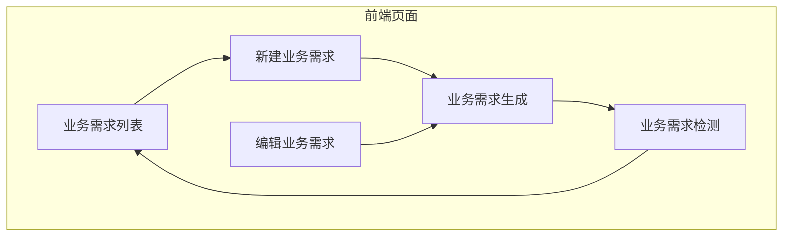
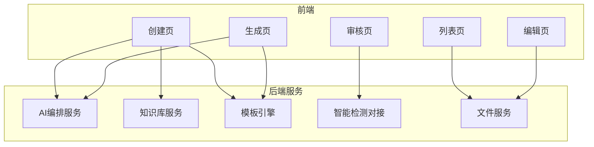
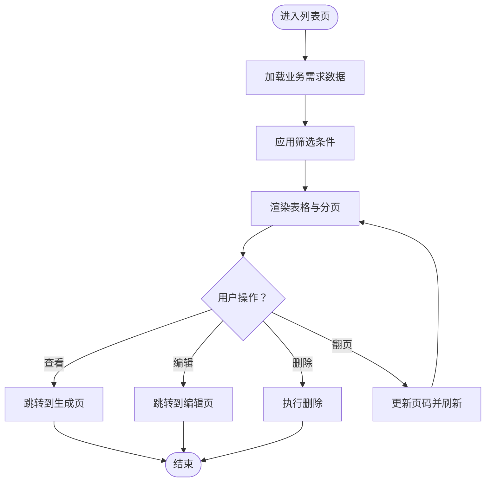
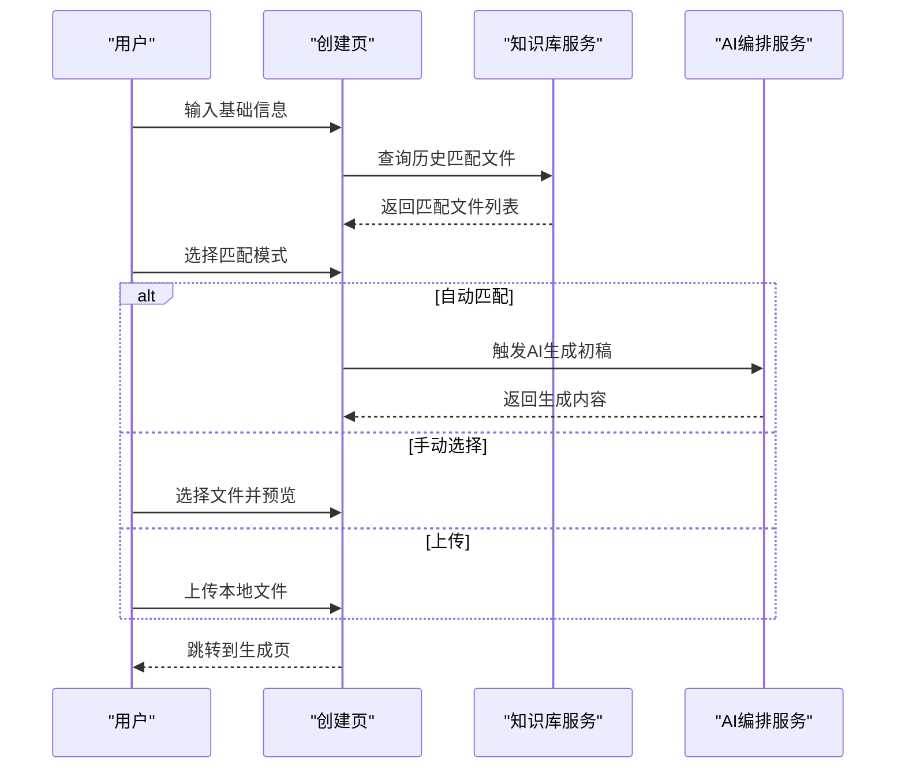
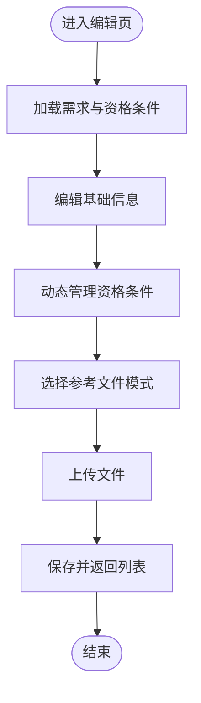
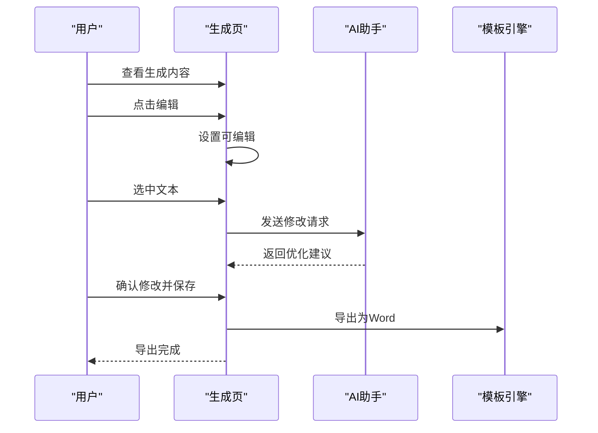
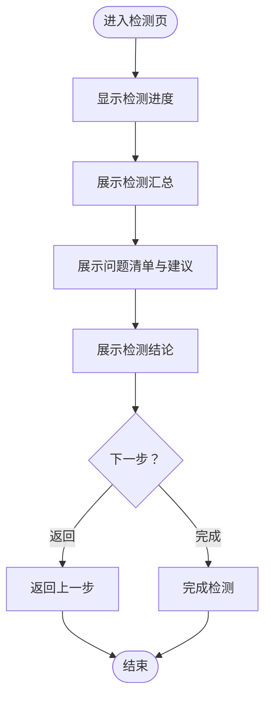
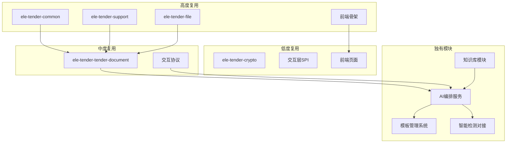

# 业务需求管理

<cite>
**本文引用的文件**
- [business-requirement-create.html](file://pages/business-requirement-create.html)
- [business-requirement-edit.html](file://pages/business-requirement-edit.html)
- [business-requirement-generate.html](file://pages/business-requirement-generate.html)
- [business-requirement-list.html](file://pages/business-requirement-list.html)
- [business-requirement-review.html](file://pages/business-requirement-review.html)
- [AI编制系统架构改造方案.md](file://2026-04-10-AI编制系统架构改造方案.md)
- [招标文件AI编制会议纪要.md](file://2026-04-10-招标文件AI编制会议纪要.md)
</cite>

## 目录
1. [简介](#简介)
2. [项目结构](#项目结构)
3. [核心组件](#核心组件)
4. [架构概览](#架构概览)
5. [详细组件分析](#详细组件分析)
6. [依赖关系分析](#依赖关系分析)
7. [性能考量](#性能考量)
8. [故障排查指南](#故障排查指南)
9. [结论](#结论)
10. [附录](#附录)

## 简介
本文件面向业务需求管理系统，系统提供从需求创建、信息录入、AI智能生成、历史匹配、内容编辑到审核流程的完整生命周期管理。系统采用前后端分离的HTML页面实现，配合轻量级JavaScript逻辑，支撑业务需求的高效编制与质量保障。同时，系统具备可扩展的AI能力，支持知识库匹配、模板选择与文本优化，并提供智能检测与导出能力。

## 项目结构
系统以页面为中心的前端架构组织，核心页面包括：
- 列表页：业务需求列表展示、筛选与分页
- 创建页：业务需求信息录入与参考文件匹配
- 编辑页：业务需求修订与资格条件动态编辑
- 生成页：AI生成内容展示、编辑与AI助手交互
- 审核页：智能检测结果展示与结论

图表来源
- [business-requirement-list.html:585-761](file://pages/business-requirement-list.html#L585-L761)
- [business-requirement-create.html:740-892](file://pages/business-requirement-create.html#L740-L892)
- [business-requirement-generate.html:756-914](file://pages/business-requirement-generate.html#L756-L914)
- [business-requirement-review.html:565-708](file://pages/business-requirement-review.html#L565-L708)

章节来源
- [business-requirement-list.html:509-764](file://pages/business-requirement-list.html#L509-L764)
- [business-requirement-create.html:689-895](file://pages/business-requirement-create.html#L689-L895)
- [business-requirement-generate.html:694-914](file://pages/business-requirement-generate.html#L694-L914)
- [business-requirement-review.html:526-708](file://pages/business-requirement-review.html#L526-L708)

## 核心组件
- 业务需求列表：支持筛选、分页、状态与进度展示、操作按钮（查看、编辑、删除）
- 业务需求创建：基础信息录入、项目类型联动、参考文件匹配（自动/手动/上传）
- 业务需求编辑：动态资格条件列表、参考文件模式切换、文件上传
- 业务需求生成：AI生成进度、内容展示与编辑、AI助手交互、导出与保存
- 业务需求检测：检测进度、结果汇总、问题清单与建议、结论与下一步

章节来源
- [business-requirement-list.html:543-761](file://pages/business-requirement-list.html#L543-L761)
- [business-requirement-create.html:740-892](file://pages/business-requirement-create.html#L740-L892)
- [business-requirement-edit.html:658-886](file://pages/business-requirement-edit.html#L658-L886)
- [business-requirement-generate.html:756-914](file://pages/business-requirement-generate.html#L756-L914)
- [business-requirement-review.html:565-708](file://pages/business-requirement-review.html#L565-L708)

## 架构概览
系统采用前端页面直连后端服务的架构，AI能力通过独立服务模块提供，知识库与模板引擎作为支撑模块。整体架构强调模块复用与扩展性，便于后续对接第三方平台与增强AI能力。

图表来源
- [AI编制系统架构改造方案.md:5-35](file://2026-04-10-AI编制系统架构改造方案.md#L5-L35)
- [AI编制系统架构改造方案.md:77-94](file://2026-04-10-AI编制系统架构改造方案.md#L77-L94)

章节来源
- [AI编制系统架构改造方案.md:1-140](file://2026-04-10-AI编制系统架构改造方案.md#L1-L140)
- [招标文件AI编制会议纪要.md:1-29](file://2026-04-10-招标文件AI编制会议纪要.md#L1-L29)

## 详细组件分析

### 业务需求列表（数据展示、筛选与排序）
- 数据展示：表格列包含项目名称、类型、预算、状态、进度、创建时间与操作按钮
- 筛选功能：支持项目名称、需求状态、项目类型、创建时间筛选
- 分页与导航：支持上一页/下一页与页码跳转
- 状态与进度：使用徽章与进度条直观展示状态与完成度
- 操作按钮：查看、编辑、删除，跳转至对应页面

图表来源
- [business-requirement-list.html:585-761](file://pages/business-requirement-list.html#L585-L761)

章节来源
- [business-requirement-list.html:543-761](file://pages/business-requirement-list.html#L543-L761)

### 新建业务需求（信息录入与参考文件匹配）
- 基础信息：需求名称、项目类别、项目类型、预算价、需求描述
- 项目类型联动：服务类包含多个子类型选项
- 参考文件匹配：三种模式
  - 自动匹配：系统根据项目信息自动匹配历史文件
  - 手动选择：展示高匹配度历史文件，单选
  - 上传：支持本地Word文件上传
- 表单验证：必填字段校验与提示
- 预览与选择：支持文件预览与选择，弹窗展示文件内容

图表来源
- [business-requirement-create.html:740-892](file://pages/business-requirement-create.html#L740-L892)
- [AI编制系统架构改造方案.md:68-76](file://2026-04-10-AI编制系统架构改造方案.md#L68-L76)

章节来源
- [business-requirement-create.html:740-892](file://pages/business-requirement-create.html#L740-L892)
- [AI编制系统架构改造方案.md:68-76](file://2026-04-10-AI编制系统架构改造方案.md#L68-L76)

### 编辑业务需求（修订与资格条件管理）
- 修订信息：需求名称、项目类型、预算、需求类型、需求描述
- 动态资格条件：支持添加、删除与编号更新
- 参考文件模式：与创建页一致的三种模式
- 文件上传：支持多文件上传并展示文件元信息
- 保存与返回：校验通过后保存并返回列表

图表来源
- [business-requirement-edit.html:658-886](file://pages/business-requirement-edit.html#L658-L886)

章节来源
- [business-requirement-edit.html:658-886](file://pages/business-requirement-edit.html#L658-L886)

### 业务需求生成（AI交互与内容编辑）
- 生成进度：进度条与状态展示
- 内容展示：项目基本信息、参考文件、业务需求详情
- 编辑功能：内容可编辑，支持保存与导出
- AI助手：侧边栏交互，支持选区优化与文本修改建议
- 关键标签：项目类型、预算等标签展示
- 反馈机制：对AI生成内容进行点赞/点踩反馈

图表来源
- [business-requirement-generate.html:756-914](file://pages/business-requirement-generate.html#L756-L914)
- [AI编制系统架构改造方案.md:68-76](file://2026-04-10-AI编制系统架构改造方案.md#L68-L76)

章节来源
- [business-requirement-generate.html:756-914](file://pages/business-requirement-generate.html#L756-L914)

### 业务需求检测（状态管理与审批流程）
- 检测进度：100%完成状态
- 结果汇总：通过项、警告项、问题项统计
- 问题清单：严重、警告、通过等级别展示与建议
- 检测结论：总结问题数量与修改建议
- 下一步：返回上一步或完成检测

图表来源
- [business-requirement-review.html:565-708](file://pages/business-requirement-review.html#L565-L708)

章节来源
- [business-requirement-review.html:565-708](file://pages/business-requirement-review.html#L565-L708)

## 依赖关系分析
- 模块复用
  - 高度复用：认证授权、文件服务、日志审计、权限管理、前端骨架
  - 中度复用：编制流程简化、JSON结构扩展、交互协议适配
  - 低度复用：加密框架、交互层SPI、前端页面布局
  - 独有模块：知识库、AI编排、模板引擎、智能检测、模板分类管理
- 技术栈
  - 现有：JDK 21 + Spring Boot 3.2.2 + MyBatis-Plus + MySQL + Redis
  - 新增：向量数据库、大模型SDK、Markdown处理库、Word生成库

图表来源
- [AI编制系统架构改造方案.md:37-76](file://2026-04-10-AI编制系统架构改造方案.md#L37-L76)

章节来源
- [AI编制系统架构改造方案.md:37-76](file://2026-04-10-AI编制系统架构改造方案.md#L37-L76)

## 性能考量
- 前端页面采用静态资源与轻量脚本，交互流畅
- AI生成与检测建议在后端服务中异步处理，前端通过进度条与状态提示用户
- 文件上传限制单文件大小与类型，避免过大文件影响性能
- 模板与Markdown转换建议在服务端进行，保证输出一致性

## 故障排查指南
- 表单验证失败
  - 检查必填字段是否填写完整
  - 检查预算输入格式与范围
- 参考文件匹配异常
  - 确认匹配模式选择正确
  - 检查上传文件格式与大小限制
- AI助手无响应
  - 确认已选中需要修改的文本区域
  - 检查网络连接与后端服务状态
- 检测结果异常
  - 确认检测流程已完成
  - 检查问题清单与建议是否符合预期

章节来源
- [business-requirement-create.html:905-935](file://pages/business-requirement-create.html#L905-L935)
- [business-requirement-generate.html:1040-1060](file://pages/business-requirement-generate.html#L1040-L1060)
- [business-requirement-review.html:732-738](file://pages/business-requirement-review.html#L732-L738)

## 结论
业务需求管理系统通过页面化的前端实现，提供了从需求创建到审核导出的完整流程。系统在现有EleTender平台基础上，复用认证、文件、权限等核心能力，新增AI编排与知识库模块，形成可扩展的智能编制体系。建议后续逐步完善AI能力与后端服务，提升生成质量与检测效率。

## 附录
- 实施节奏与协作分工：需求文档完成后立即启动技术设计，采用前后端分离模式，聚焦核心链路闭环
- 输出标准化：所有对外输出（如招标文件、评审办法）均支持标准化接口导出

章节来源
- [招标文件AI编制会议纪要.md:25-29](file://2026-04-10-招标文件AI编制会议纪要.md#L25-L29)