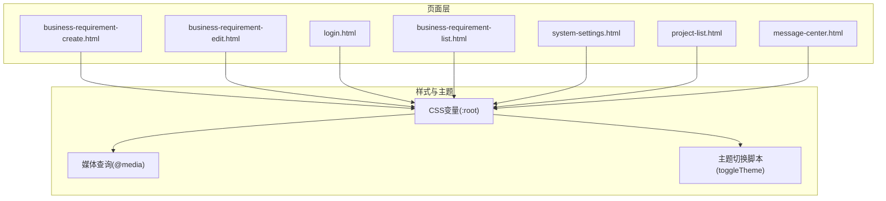
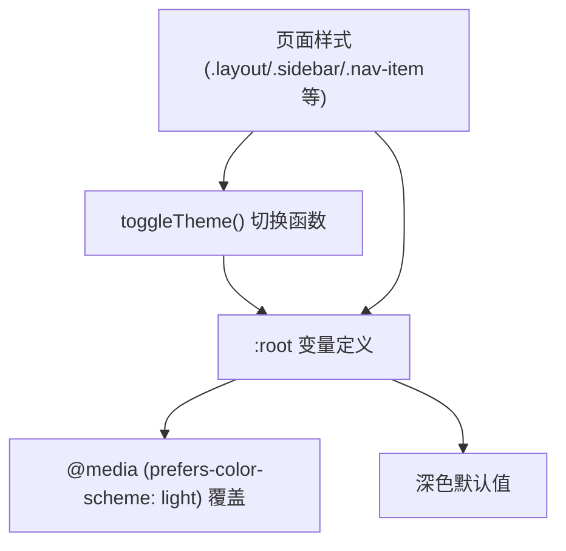
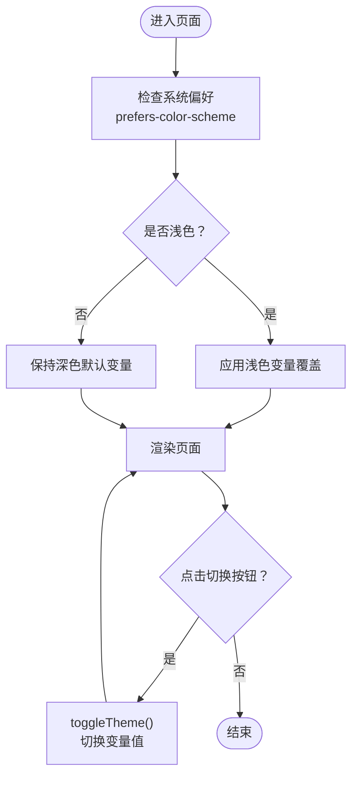
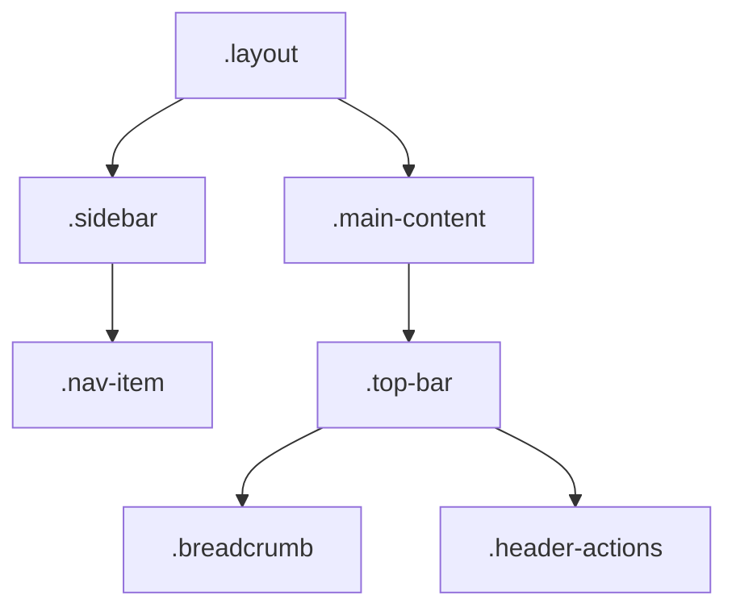
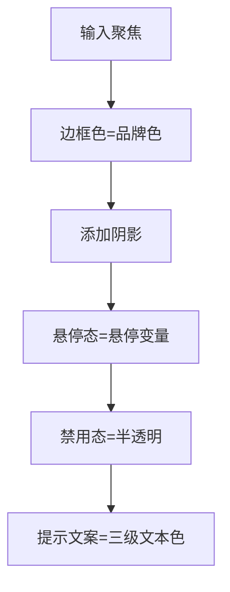
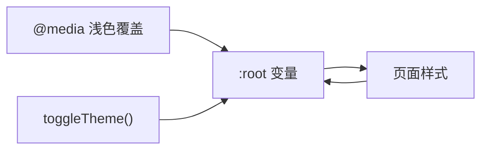

# 主题和样式系统

<cite>
**本文引用的文件**
- [business-requirement-create.html](file://pages/business-requirement-create.html)
- [business-requirement-edit.html](file://pages/business-requirement-edit.html)
- [login.html](file://pages/login.html)
- [business-requirement-list.html](file://pages/business-requirement-list.html)
- [system-settings.html](file://pages/system-settings.html)
- [project-list.html](file://pages/project-list.html)
- [message-center.html](file://pages/message-center.html)
</cite>

## 目录
1. [简介](#简介)
2. [项目结构](#项目结构)
3. [核心组件](#核心组件)
4. [架构总览](#架构总览)
5. [详细组件分析](#详细组件分析)
6. [依赖关系分析](#依赖关系分析)
7. [性能考量](#性能考量)
8. [故障排查指南](#故障排查指南)
9. [结论](#结论)
10. [附录](#附录)

## 简介
本技术文档聚焦于该HTML页面项目的“主题与样式系统”，系统性阐述以下内容：
- CSS变量主题系统：深色/浅色主题的变量定义与自动切换机制
- 样式继承与主题变量应用规则
- 响应式设计：媒体查询、断点与移动端适配策略
- 导航系统：侧边栏布局、菜单交互与面包屑
- 表单样式：统一规范、验证状态与用户体验优化
- 主题定制指南：变量说明、组件样式规范
- 浏览器兼容性、性能优化与样式调试技巧

## 项目结构
该项目采用“页面级HTML文件”组织方式，每个页面均内嵌独立的样式与脚本，形成轻量级前端单页应用风格。主题系统在各页面中以CSS变量与媒体查询为核心，配合少量JavaScript实现主题切换。

图表来源
- [business-requirement-create.html:10-51](file://pages/business-requirement-create.html#L10-L51)
- [business-requirement-edit.html:10-51](file://pages/business-requirement-edit.html#L10-L51)
- [login.html:10-51](file://pages/login.html#L10-L51)
- [business-requirement-list.html:10-51](file://pages/business-requirement-list.html#L10-L51)
- [system-settings.html:10-51](file://pages/system-settings.html#L10-L51)
- [project-list.html:10-51](file://pages/project-list.html#L10-L51)
- [message-center.html:10-51](file://pages/message-center.html#L10-L51)

章节来源
- [business-requirement-create.html:10-51](file://pages/business-requirement-create.html#L10-L51)
- [business-requirement-edit.html:10-51](file://pages/business-requirement-edit.html#L10-L51)
- [login.html:10-51](file://pages/login.html#L10-L51)
- [business-requirement-list.html:10-51](file://pages/business-requirement-list.html#L10-L51)
- [system-settings.html:10-51](file://pages/system-settings.html#L10-L51)
- [project-list.html:10-51](file://pages/project-list.html#L10-L51)
- [message-center.html:10-51](file://pages/message-center.html#L10-L51)

## 核心组件
- CSS变量主题系统：在页面根元素定义品牌色、背景、文本、边框、悬停态、阴影、卡片与输入等变量，并通过媒体查询在浅色模式下覆盖关键变量值，实现深浅主题的统一切换。
- 主题切换脚本：在多个页面中提供切换按钮与toggleTheme函数，通过读取当前主题变量并写入相反主题的变量值，实现即时主题切换。
- 导航与布局：固定侧边栏+主内容区的布局，顶部工具栏包含面包屑与用户信息；导航项支持悬停与激活态高亮。
- 表单体系：统一的输入框、选择框、文本域、单选/复选、按钮与提示文案样式，配套焦点态与禁用态视觉反馈。
- 响应式网格：表单与表格采用flex/grid布局，配合最小宽度与换行控制，保证在不同屏幕尺寸下的可用性。

章节来源
- [business-requirement-create.html:7-687](file://pages/business-requirement-create.html#L7-L687)
- [business-requirement-edit.html:7-606](file://pages/business-requirement-edit.html#L7-L606)
- [login.html:7-481](file://pages/login.html#L7-L481)
- [business-requirement-list.html:7-787](file://pages/business-requirement-list.html#L7-L787)
- [system-settings.html:7-1024](file://pages/system-settings.html#L7-L1024)
- [project-list.html:7-200](file://pages/project-list.html#L7-L200)
- [message-center.html:7-200](file://pages/message-center.html#L7-L200)

## 架构总览
主题系统围绕CSS变量与媒体查询构建，结合少量JavaScript实现动态切换。整体架构如下：

图表来源
- [business-requirement-create.html:10-51](file://pages/business-requirement-create.html#L10-L51)
- [business-requirement-create.html:688-690](file://pages/business-requirement-create.html#L688-L690)
- [business-requirement-edit.html:10-51](file://pages/business-requirement-edit.html#L10-L51)
- [business-requirement-edit.html:607-609](file://pages/business-requirement-edit.html#L607-L609)
- [login.html:10-51](file://pages/login.html#L10-L51)
- [login.html:460-478](file://pages/login.html#L460-L478)
- [business-requirement-list.html:10-51](file://pages/business-requirement-list.html#L10-L51)
- [business-requirement-list.html:766-784](file://pages/business-requirement-list.html#L766-L784)
- [system-settings.html:10-51](file://pages/system-settings.html#L10-L51)
- [system-settings.html:1015-1021](file://pages/system-settings.html#L1015-L1021)

## 详细组件分析

### CSS变量主题系统
- 变量分组
  - 品牌与辅助：品牌色、辅助色、装饰色
  - 背景层级：主背景、次级背景、三级背景、浮层背景
  - 文本层级：主文本、次文本、三级文本
  - 边框与悬停：边框轻/中、悬停态、阴影色
  - 卡片与输入：卡片背景、输入背景
  - 状态色：成功、警告、危险
- 浅色模式覆盖：当系统偏好为浅色时，通过媒体查询覆盖上述变量，使页面呈现浅色主题
- 主题切换逻辑：toggleTheme函数读取当前背景主色，若为浅色则切换为深色变量，否则切换为浅色变量

图表来源
- [business-requirement-create.html:32-51](file://pages/business-requirement-create.html#L32-L51)
- [business-requirement-create.html:10-30](file://pages/business-requirement-create.html#L10-L30)
- [business-requirement-create.html:688-690](file://pages/business-requirement-create.html#L688-L690)
- [business-requirement-edit.html:32-51](file://pages/business-requirement-edit.html#L32-L51)
- [business-requirement-edit.html:10-30](file://pages/business-requirement-edit.html#L10-L30)
- [business-requirement-edit.html:607-609](file://pages/business-requirement-edit.html#L607-L609)
- [login.html:32-51](file://pages/login.html#L32-L51)
- [login.html:10-29](file://pages/login.html#L10-L29)
- [login.html:460-478](file://pages/login.html#L460-L478)
- [business-requirement-list.html:32-51](file://pages/business-requirement-list.html#L32-L51)
- [business-requirement-list.html:10-29](file://pages/business-requirement-list.html#L10-L29)
- [business-requirement-list.html:766-784](file://pages/business-requirement-list.html#L766-L784)
- [system-settings.html:32-51](file://pages/system-settings.html#L32-L51)
- [system-settings.html:10-29](file://pages/system-settings.html#L10-L29)
- [system-settings.html:1015-1021](file://pages/system-settings.html#L1015-L1021)

章节来源
- [business-requirement-create.html:10-51](file://pages/business-requirement-create.html#L10-L51)
- [business-requirement-edit.html:10-51](file://pages/business-requirement-edit.html#L10-L51)
- [login.html:10-51](file://pages/login.html#L10-L51)
- [business-requirement-list.html:10-51](file://pages/business-requirement-list.html#L10-L51)
- [system-settings.html:10-51](file://pages/system-settings.html#L10-L51)

### 导航系统与侧边栏布局
- 固定侧边栏：宽度220px，固定定位，纵向滚动
- 顶部工具栏：包含面包屑导航与用户信息区域
- 导航项：支持悬停与激活态高亮，左侧有品牌色强调线
- 页面标题与返回按钮：标题区右侧提供返回按钮，增强操作闭环

图表来源
- [business-requirement-create.html:61-103](file://pages/business-requirement-create.html#L61-L103)
- [business-requirement-create.html:105-143](file://pages/business-requirement-create.html#L105-L143)
- [business-requirement-create.html:84-97](file://pages/business-requirement-create.html#L84-L97)
- [business-requirement-edit.html:61-103](file://pages/business-requirement-edit.html#L61-L103)
- [business-requirement-edit.html:105-143](file://pages/business-requirement-edit.html#L105-L143)
- [business-requirement-edit.html:84-97](file://pages/business-requirement-edit.html#L84-L97)
- [business-requirement-list.html:61-103](file://pages/business-requirement-list.html#L61-L103)
- [business-requirement-list.html:105-143](file://pages/business-requirement-list.html#L105-L143)
- [business-requirement-list.html:84-97](file://pages/business-requirement-list.html#L84-L97)
- [system-settings.html:61-103](file://pages/system-settings.html#L61-L103)
- [system-settings.html:105-143](file://pages/system-settings.html#L105-L143)
- [system-settings.html:84-97](file://pages/system-settings.html#L84-L97)

章节来源
- [business-requirement-create.html:61-143](file://pages/business-requirement-create.html#L61-L143)
- [business-requirement-edit.html:61-143](file://pages/business-requirement-edit.html#L61-L143)
- [business-requirement-list.html:61-143](file://pages/business-requirement-list.html#L61-L143)
- [system-settings.html:61-143](file://pages/system-settings.html#L61-L143)

### 表单样式与验证状态
- 统一输入控件：输入框、选择框、文本域均使用一致的圆角、边框与背景变量，获得一致的视觉与交互体验
- 焦点态：聚焦时边框色变为品牌色并带有轻微阴影，提升可发现性
- 提示文案：使用较小字号与三级文本色，提供上下文信息
- 验证状态：必填标记使用危险色，错误/成功消息使用对应状态色
- 动态列表与上传：支持动态增删、上传预览与状态徽标，交互反馈明确

图表来源
- [business-requirement-create.html:326-341](file://pages/business-requirement-create.html#L326-L341)
- [business-requirement-create.html:406-410](file://pages/business-requirement-create.html#L406-L410)
- [business-requirement-edit.html:326-341](file://pages/business-requirement-edit.html#L326-L341)
- [business-requirement-edit.html:433-464](file://pages/business-requirement-edit.html#L433-L464)
- [system-settings.html:311-365](file://pages/system-settings.html#L311-L365)
- [login.html:186-205](file://pages/login.html#L186-L205)

章节来源
- [business-requirement-create.html:326-341](file://pages/business-requirement-create.html#L326-L341)
- [business-requirement-create.html:406-410](file://pages/business-requirement-create.html#L406-L410)
- [business-requirement-edit.html:326-341](file://pages/business-requirement-edit.html#L326-L341)
- [business-requirement-edit.html:433-464](file://pages/business-requirement-edit.html#L433-L464)
- [system-settings.html:311-365](file://pages/system-settings.html#L311-L365)
- [login.html:186-205](file://pages/login.html#L186-L205)

### 响应式设计与移动端适配
- 视口设置：页面均包含viewport meta标签，确保移动端缩放与布局正确
- 布局弹性：表单行采用flex布局，列间留白与换行控制，保证在窄屏下仍具可读性
- 最小宽度：表单项设置最小宽度，避免在窄屏下过度压缩
- 网格与卡片：卡片容器与表格在不同页面中采用一致的边框与背景变量，确保主题一致性

章节来源
- [business-requirement-create.html:5](file://pages/business-requirement-create.html#L5)
- [business-requirement-create.html:296-304](file://pages/business-requirement-create.html#L296-L304)
- [business-requirement-list.html:254-259](file://pages/business-requirement-list.html#L254-L259)
- [system-settings.html:284-288](file://pages/system-settings.html#L284-L288)

## 依赖关系分析
- 主题变量依赖：所有页面样式均依赖:root中的变量，媒体查询决定初始主题
- 切换函数依赖：各页面的toggleTheme函数依赖当前body上的变量值进行判断与切换
- 组件依赖：导航、表单、按钮、卡片等组件样式均依赖统一变量，减少重复定义

图表来源
- [business-requirement-create.html:10-51](file://pages/business-requirement-create.html#L10-L51)
- [business-requirement-create.html:688-690](file://pages/business-requirement-create.html#L688-L690)
- [business-requirement-edit.html:10-51](file://pages/business-requirement-edit.html#L10-L51)
- [business-requirement-edit.html:607-609](file://pages/business-requirement-edit.html#L607-L609)
- [login.html:10-51](file://pages/login.html#L10-L51)
- [login.html:460-478](file://pages/login.html#L460-L478)
- [business-requirement-list.html:10-51](file://pages/business-requirement-list.html#L10-L51)
- [business-requirement-list.html:766-784](file://pages/business-requirement-list.html#L766-L784)
- [system-settings.html:10-51](file://pages/system-settings.html#L10-L51)
- [system-settings.html:1015-1021](file://pages/system-settings.html#L1015-L1021)

章节来源
- [business-requirement-create.html:10-51](file://pages/business-requirement-create.html#L10-L51)
- [business-requirement-create.html:688-690](file://pages/business-requirement-create.html#L688-L690)
- [business-requirement-edit.html:10-51](file://pages/business-requirement-edit.html#L10-L51)
- [business-requirement-edit.html:607-609](file://pages/business-requirement-edit.html#L607-L609)
- [login.html:10-51](file://pages/login.html#L10-L51)
- [login.html:460-478](file://pages/login.html#L460-L478)
- [business-requirement-list.html:10-51](file://pages/business-requirement-list.html#L10-L51)
- [business-requirement-list.html:766-784](file://pages/business-requirement-list.html#L766-L784)
- [system-settings.html:10-51](file://pages/system-settings.html#L10-L51)
- [system-settings.html:1015-1021](file://pages/system-settings.html#L1015-L1021)

## 性能考量
- CSS变量切换：通过修改:root变量实现主题切换，避免重排与重绘开销，切换流畅
- 动画与过渡：主题切换与组件hover/focus使用简短过渡，兼顾性能与体验
- 媒体查询：仅在浅色模式下覆盖变量，减少不必要的样式计算
- 建议：尽量避免在切换时频繁读写DOM属性，可将变量值缓存至内存，减少多次访问

## 故障排查指南
- 主题未生效
  - 检查页面是否包含:root变量定义与媒体查询覆盖
  - 确认toggleTheme函数是否被调用且未被覆盖
- 切换后颜色异常
  - 检查toggleTheme中变量赋值是否完整覆盖了关键变量
  - 确认body上是否存在其他样式覆盖
- 响应式问题
  - 检查视口meta标签是否正确设置
  - 确认表单与表格的最小宽度与换行策略是否合理

章节来源
- [business-requirement-create.html:688-690](file://pages/business-requirement-create.html#L688-L690)
- [business-requirement-edit.html:607-609](file://pages/business-requirement-edit.html#L607-L609)
- [login.html:460-478](file://pages/login.html#L460-L478)
- [business-requirement-list.html:766-784](file://pages/business-requirement-list.html#L766-L784)
- [system-settings.html:1015-1021](file://pages/system-settings.html#L1015-L1021)

## 结论
该主题与样式系统以CSS变量为核心，结合媒体查询与少量JavaScript，实现了简洁高效的深浅主题切换。页面采用统一的变量体系与组件规范，保证了跨页面的一致性与可维护性。通过合理的布局与响应式策略，系统在桌面端与移动端均具备良好的可用性。

## 附录

### 主题变量说明（摘自:root）
- 品牌与辅助：品牌色、辅助色、装饰色
- 背景层级：主背景、次级背景、三级背景、浮层背景
- 文本层级：主文本、次文本、三级文本
- 边框与悬停：边框轻/中、悬停态、阴影色
- 卡片与输入：卡片背景、输入背景
- 状态色：成功、警告、危险

章节来源
- [business-requirement-create.html:10-30](file://pages/business-requirement-create.html#L10-L30)
- [business-requirement-edit.html:10-30](file://pages/business-requirement-edit.html#L10-L30)
- [login.html:10-29](file://pages/login.html#L10-L29)
- [business-requirement-list.html:10-29](file://pages/business-requirement-list.html#L10-L29)
- [system-settings.html:10-29](file://pages/system-settings.html#L10-L29)
- [message-center.html:10-30](file://pages/message-center.html#L10-L30)

### 组件样式规范
- 导航与布局：侧边栏固定、主内容区自适应；导航项悬停与激活态高亮
- 表单：输入框、选择框、文本域统一圆角与边框；焦点态品牌色边框与阴影
- 按钮：主按钮品牌色背景，次按钮次级背景与边框；状态按钮使用对应状态色
- 卡片与表格：卡片与表格使用统一边框与背景变量，保持主题一致性

章节来源
- [business-requirement-create.html:61-143](file://pages/business-requirement-create.html#L61-L143)
- [business-requirement-create.html:326-341](file://pages/business-requirement-create.html#L326-L341)
- [business-requirement-create.html:219-269](file://pages/business-requirement-create.html#L219-L269)
- [business-requirement-create.html:271-285](file://pages/business-requirement-create.html#L271-L285)
- [business-requirement-edit.html:61-143](file://pages/business-requirement-edit.html#L61-L143)
- [business-requirement-edit.html:326-341](file://pages/business-requirement-edit.html#L326-L341)
- [business-requirement-edit.html:219-269](file://pages/business-requirement-edit.html#L219-L269)
- [business-requirement-edit.html:271-285](file://pages/business-requirement-edit.html#L271-L285)
- [business-requirement-list.html:61-143](file://pages/business-requirement-list.html#L61-L143)
- [business-requirement-list.html:246-299](file://pages/business-requirement-list.html#L246-L299)
- [system-settings.html:61-143](file://pages/system-settings.html#L61-L143)
- [system-settings.html:311-365](file://pages/system-settings.html#L311-L365)
- [system-settings.html:410-471](file://pages/system-settings.html#L410-L471)

### 主题定制指南
- 修改主题色：调整:root中的品牌色、辅助色、装饰色变量
- 调整背景层级：修改主/次/三级背景与卡片背景变量
- 调整文本层级：修改主/次/三级文本变量
- 调整边框与悬停：修改边框轻/中、悬停态变量
- 调整输入与卡片：修改输入背景与卡片背景变量
- 调整状态色：修改成功、警告、危险状态变量
- 浅色覆盖：在媒体查询中覆盖上述变量，实现浅色主题

章节来源
- [business-requirement-create.html:10-51](file://pages/business-requirement-create.html#L10-L51)
- [business-requirement-edit.html:10-51](file://pages/business-requirement-edit.html#L10-L51)
- [login.html:10-51](file://pages/login.html#L10-L51)
- [business-requirement-list.html:10-51](file://pages/business-requirement-list.html#L10-L51)
- [system-settings.html:10-51](file://pages/system-settings.html#L10-L51)
- [message-center.html:10-51](file://pages/message-center.html#L10-L51)