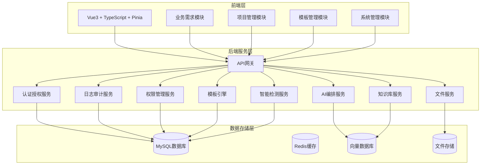
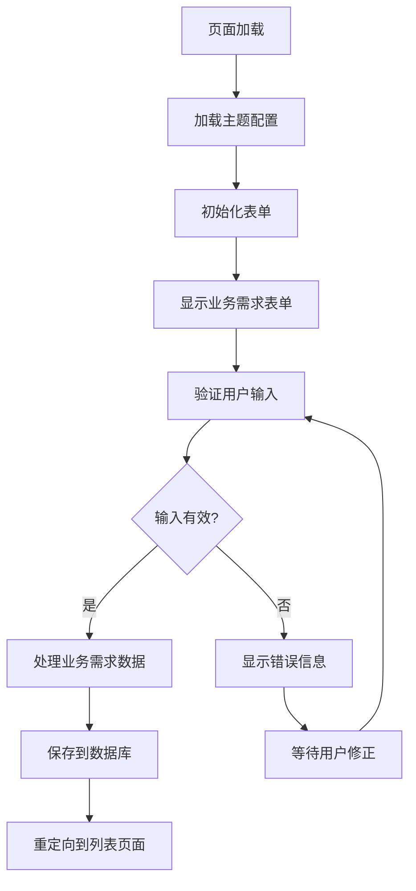
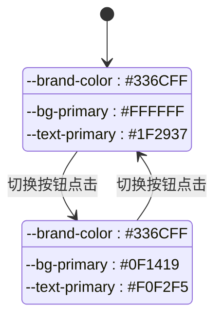
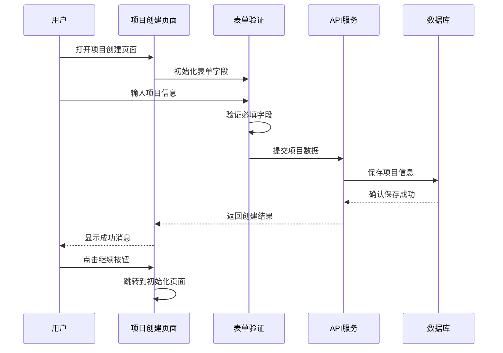
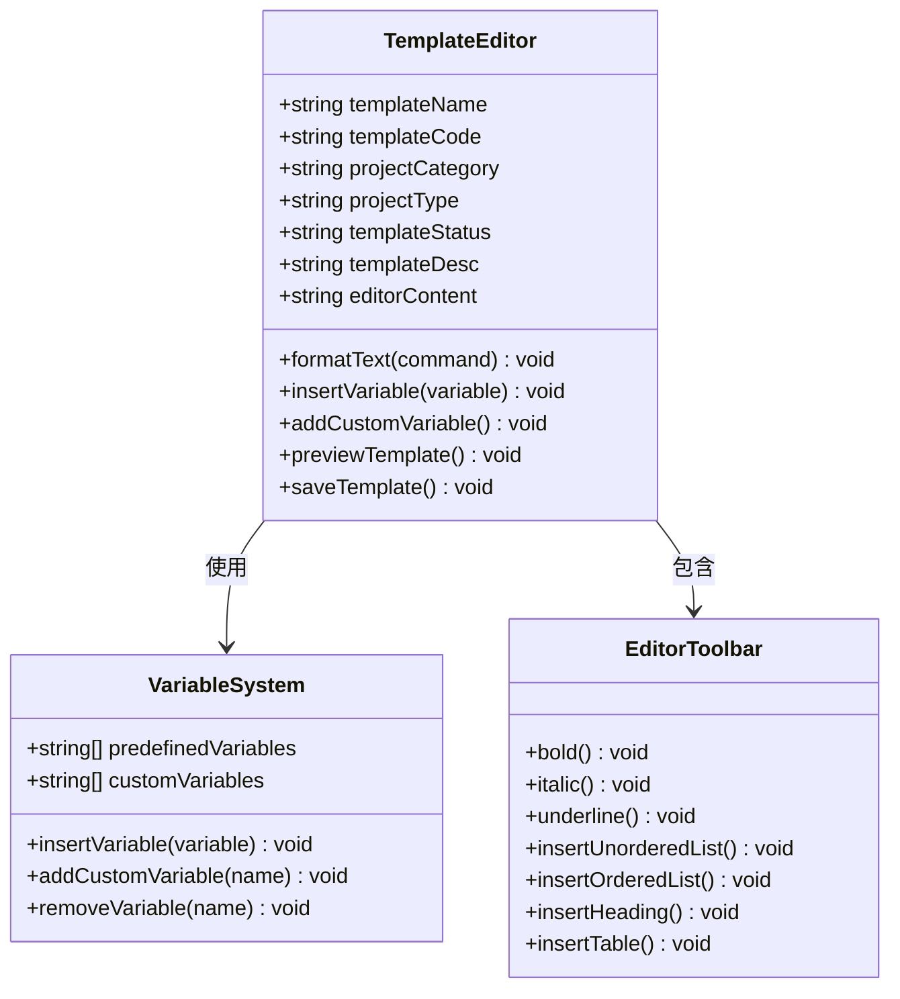
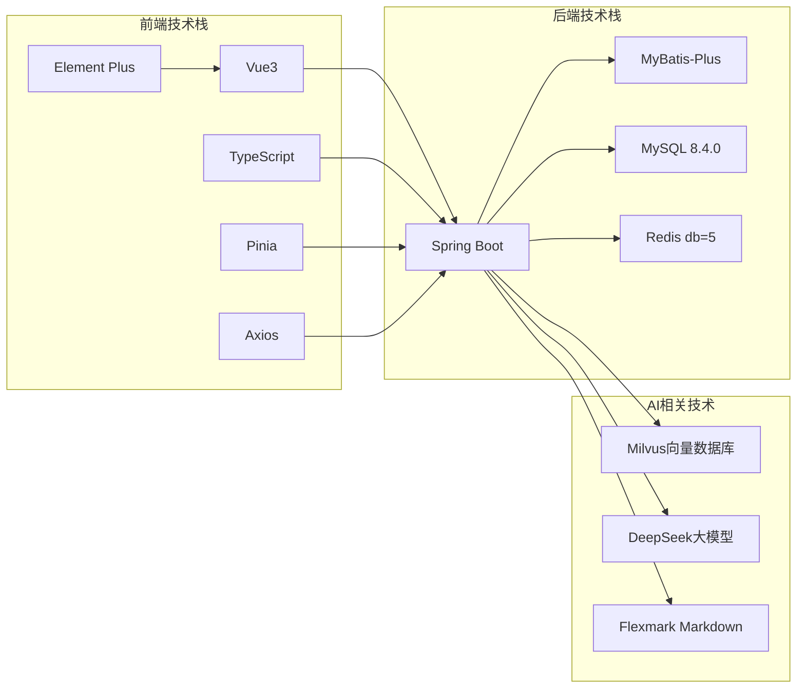

# Git工作流程

<cite>
**本文档引用的文件**
- [2026-04-10-招标文件AI编制会议纪要.md](file://2026-04-10-招标文件AI编制会议纪要.md)
- [2026-04-10-AI编制系统架构改造方案.md](file://2026-04-10-AI编制系统架构改造方案.md)
- [business-requirement-create.html](file://pages/business-requirement-create.html)
- [project-create.html](file://pages/project-create.html)
- [template-create.html](file://pages/template-create.html)
</cite>

## 目录
1. [简介](#简介)
2. [项目结构](#项目结构)
3. [核心组件](#核心组件)
4. [架构概览](#架构概览)
5. [详细组件分析](#详细组件分析)
6. [依赖关系分析](#依赖关系分析)
7. [性能考虑](#性能考虑)
8. [故障排除指南](#故障排除指南)
9. [结论](#结论)

## 简介

本文档为招标文件AI编制系统创建详细的Git工作流程文档。该系统是一个AI驱动的智能招标文件编制平台，支持业务需求生成、招标文件编制、知识库与大模型调用、智能检测、模板管理等功能。项目采用前后端分离架构，前端使用Vue3 + TypeScript + Pinia技术栈，后端基于Spring Boot框架。

## 项目结构

项目采用模块化的文件组织结构，主要包含以下目录和文件：

```mermaid
graph TB
subgraph "项目根目录"
Root[项目根目录]
Pages[pages/ 页面目录]
Docs[文档文件]
end
subgraph "页面目录(pages/)"
BRCreate[business-requirement-create.html<br/>业务需求创建页面]
BRList[business-requirement-list.html<br/>业务需求列表页面]
BRGenerate[business-requirement-generate.html<br/>业务需求生成页面]
BRReview[business-requirement-review.html<br/>业务需求审核页面]
ProjectCreate[project-create.html<br/>项目创建页面]
ProjectList[project-list.html<br/>项目列表页面]
TemplateCreate[template-create.html<br/>模板创建页面]
TemplateList[template-list.html<br/>模板列表页面]
PolicyFile[policy-file-list.html<br/>政策文件管理页面]
Statistics[statistics.html<br/>统计分析页面]
MessageCenter[message-center.html<br/>消息中心页面]
SystemSettings[system-settings.html<br/>系统设置页面]
end
subgraph "文档文件"
Meeting[2026-04-10-招标文件AI编制会议纪要.md]
Architecture[2026-04-10-AI编制系统架构改造方案.md]
end
Root --> Pages
Root --> Docs
Pages --> BRCreate
Pages --> BRList
Pages --> BRGenerate
Pages --> BRReview
Pages --> ProjectCreate
Pages --> ProjectList
Pages --> TemplateCreate
Pages --> TemplateList
Pages --> PolicyFile
Pages --> Statistics
Pages --> MessageCenter
Pages --> SystemSettings
Docs --> Meeting
Docs --> Architecture
```

**图表来源**
- [business-requirement-create.html](file://pages/business-requirement-create.html)
- [project-create.html](file://pages/project-create.html)
- [template-create.html](file://pages/template-create.html)
- [2026-04-10-招标文件AI编制会议纪要.md](file://2026-04-10-招标文件AI编制会议纪要.md)
- [2026-04-10-AI编制系统架构改造方案.md](file://2026-04-10-AI编制系统架构改造方案.md)

**章节来源**
- [business-requirement-create.html](file://pages/business-requirement-create.html)
- [project-create.html](file://pages/project-create.html)
- [template-create.html](file://pages/template-create.html)
- [2026-04-10-招标文件AI编制会议纪要.md](file://2026-04-10-招标文件AI编制会议纪要.md)
- [2026-04-10-AI编制系统架构改造方案.md](file://2026-04-10-AI编制系统架构改造方案.md)

## 核心组件

### 业务需求管理模块

业务需求管理是系统的核心功能之一，包含以下关键页面：

- **业务需求创建页面**：支持用户录入项目基本信息，包括需求名称、项目类别、项目类型、预算价、需求描述等
- **业务需求列表页面**：展示所有业务需求项目，支持搜索、筛选和状态管理
- **业务需求生成页面**：基于AI技术自动生成业务需求内容
- **业务需求审核页面**：提供业务需求的审核和管理功能

### 项目管理模块

项目管理模块负责整个招标项目的生命周期管理：

- **项目创建页面**：支持项目基本信息录入，包括项目名称、类别、类型、预算等
- **项目列表页面**：展示项目列表，支持项目状态跟踪
- **项目详情页面**：显示项目详细信息和进度
- **项目初始化页面**：项目创建后的初始化配置

### 模板管理模块

模板管理模块提供灵活的模板创建和管理功能：

- **模板创建页面**：支持Markdown模板编辑，内置变量系统
- **模板列表页面**：展示所有可用模板
- **模板详情页面**：显示模板详细信息和使用情况

### 系统管理模块

系统管理模块包含多个辅助功能：

- **政策文件管理**：管理相关的政策法规文件
- **统计分析**：提供系统使用情况的统计分析
- **消息中心**：系统通知和消息管理
- **系统设置**：系统配置和参数设置

**章节来源**
- [business-requirement-create.html](file://pages/business-requirement-create.html)
- [project-create.html](file://pages/project-create.html)
- [template-create.html](file://pages/template-create.html)

## 架构概览

系统采用前后端分离的微服务架构，整体架构如下：

**图表来源**
- [2026-04-10-AI编制系统架构改造方案.md](file://2026-04-10-AI编制系统架构改造方案.md)

## 详细组件分析

### 业务需求创建页面分析

业务需求创建页面采用现代化的UI设计，支持深色/浅色主题切换，包含以下核心功能：

**图表来源**
- [business-requirement-create.html](file://pages/business-requirement-create.html)

#### 表单字段设计

页面包含以下主要表单字段：

- **需求名称**：必填，长度限制1-100字符
- **项目类别**：必选项，支持限额以下、产权交易、政府采购
- **项目类型**：必选项，支持工程类、货物类、服务类等细分类型
- **预算价**：必填数值字段，支持两位小数
- **需求描述**：可选，支持最多500字符

#### 主题切换机制

系统支持深色和浅色两种主题模式，通过CSS变量实现动态主题切换：

**图表来源**
- [business-requirement-create.html](file://pages/business-requirement-create.html)

**章节来源**
- [business-requirement-create.html](file://pages/business-requirement-create.html)

### 项目创建页面分析

项目创建页面提供完整的项目生命周期管理功能：

**图表来源**
- [project-create.html](file://pages/project-create.html)

#### 评审类型选择

页面支持两种评审类型的选择：

- **人工评审**：完全由人工进行评审
- **智能评审**：基于AI技术的自动化评审

评审类型会根据项目预算和类型自动推荐，但用户可以手动调整。

#### 招标需求生成模式

系统提供两种招标需求生成模式：

- **模式1：引用**：从现有的业务需求项目中选择
- **模式2：系统生成**：基于项目描述自动生成

**章节来源**
- [project-create.html](file://pages/project-create.html)

### 模板创建页面分析

模板创建页面提供强大的Markdown编辑功能和变量管理系统：

**图表来源**
- [template-create.html](file://pages/template-create.html)

#### 编辑器功能

模板编辑器提供丰富的编辑功能：

- **文本格式化**：支持加粗、斜体、下划线
- **列表功能**：支持有序和无序列表
- **标题系统**：支持多级标题
- **表格插入**：支持自定义行列数的表格

#### 变量管理系统

系统内置变量系统，支持预置变量和自定义变量：

- **预置变量**：项目名称、项目类型、项目预算、资格要求等
- **自定义变量**：用户可以根据需要添加自定义变量

**章节来源**
- [template-create.html](file://pages/template-create.html)

## 依赖关系分析

### 技术栈依赖

系统采用现代化的技术栈组合：

**图表来源**
- [2026-04-10-AI编制系统架构改造方案.md](file://2026-04-10-AI编制系统架构改造方案.md)

### 模块复用关系

根据架构改造方案，系统采用模块化设计，支持不同程度的模块复用：

| 模块类别 | 模块名称 | 复用程度 | 复用内容 |
|---------|----------|----------|----------|
| 高度复用 | ele-tender-common | 直接可用 | JWT认证、BCrypt密码、HMAC签名、统一响应 |
| 高度复用 | ele-tender-support | 直接可用 | 用户管理、角色管理、菜单权限、操作日志 |
| 高度复用 | ele-tender-file | 直接可用 | 文件上传/下载/秒传、SHA256校验 |
| 高度复用 | 前端骨架 | 直接可用 | Vue3+TS+Pinia+Element Plus项目结构 |
| 中度复用 | ele-tender-tender-document | 需适配 | 编制流程状态机、步骤管理、规则树结构 |
| 中度复用 | ele-tender-common-interaction | 需适配 | 外部系统接入协议 |
| 低度复用 | ele-tender-crypto | 参考设计 | AES加密框架 |
| 低度复用 | 交互层SPI | 参考设计 | 回调机制 |
| 低度复用 | 前端页面 | 参考设计 | 管理页面布局 |

**章节来源**
- [2026-04-10-AI编制系统架构改造方案.md](file://2026-04-10-AI编制系统架构改造方案.md)

## 性能考虑

### 前端性能优化

- **主题切换优化**：使用CSS变量实现主题切换，避免DOM重绘
- **表单验证优化**：前端即时验证，减少无效请求
- **懒加载机制**：页面按需加载，提升首屏加载速度

### 后端性能优化

- **数据库连接池**：合理配置连接池大小，避免连接泄漏
- **缓存策略**：Redis缓存热点数据，减少数据库压力
- **异步处理**：AI生成等耗时操作采用异步处理

## 故障排除指南

### 常见问题及解决方案

#### 页面加载问题

**问题**：页面无法正常加载
**解决方案**：
1. 检查网络连接是否正常
2. 清除浏览器缓存
3. 确认服务器端口开放

#### 表单提交失败

**问题**：表单提交后无响应
**解决方案**：
1. 检查必填字段是否完整
2. 确认网络连接稳定
3. 查看浏览器控制台错误信息

#### 主题切换异常

**问题**：主题切换后样式不生效
**解决方案**：
1. 检查CSS变量是否正确加载
2. 确认浏览器支持CSS变量
3. 刷新页面重新加载样式

**章节来源**
- [business-requirement-create.html](file://pages/business-requirement-create.html)
- [project-create.html](file://pages/project-create.html)
- [template-create.html](file://pages/template-create.html)

## 结论

招标文件AI编制系统采用现代化的前后端分离架构，通过模块化设计实现了高度的可维护性和可扩展性。系统支持多种业务场景，包括业务需求管理、项目管理、模板管理等核心功能。通过合理的Git工作流程和代码管理规范，可以确保项目的持续发展和团队协作效率。

建议团队在实际开发中重点关注以下方面：
- 保持代码质量，遵循统一的编码规范
- 及时进行代码审查，确保功能正确性
- 建立完善的测试体系，保证系统稳定性
- 持续优化性能，提升用户体验