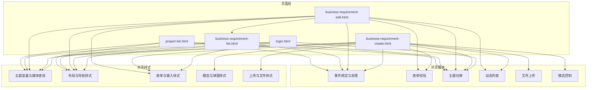
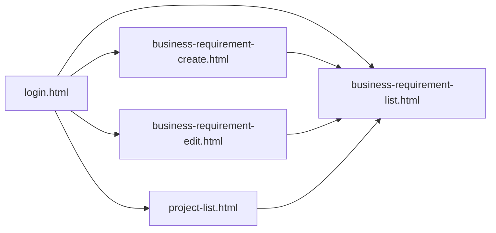

# 代码规范

<cite>
**本文引用的文件**
- [pages/business-requirement-create.html](file://pages/business-requirement-create.html)
- [pages/business-requirement-edit.html](file://pages/business-requirement-edit.html)
- [pages/login.html](file://pages/login.html)
- [pages/business-requirement-list.html](file://pages/business-requirement-list.html)
- [pages/project-list.html](file://pages/project-list.html)
- [2026-04-10-招标文件AI编制会议纪要.md](file://2026-04-10-招标文件AI编制会议纪要.md)
</cite>

## 目录
1. [引言](#引言)
2. [项目结构](#项目结构)
3. [核心组件](#核心组件)
4. [架构总览](#架构总览)
5. [详细组件分析](#详细组件分析)
6. [依赖关系分析](#依赖关系分析)
7. [性能考量](#性能考量)
8. [故障排查指南](#故障排查指南)
9. [结论](#结论)
10. [附录](#附录)

## 引言
本规范面向“招标文件AI编制系统”的前端开发，目标是统一HTML结构、CSS命名与JavaScript编码风格，提升可读性、可维护性与一致性。规范以现有页面为依据，总结出通用规则，并给出最佳实践示例路径，便于团队协同开发与长期演进。

## 项目结构
系统采用“页面级HTML文件”组织方式，每个页面包含内联样式与脚本，形成轻量级单页应用风格。页面按功能域划分，如业务需求、项目管理、模板管理、统计分析、系统设置等。

```mermaid
graph TB
subgraph "页面集合"
A["pages/login.html"]
B["pages/business-requirement-create.html"]
C["pages/business-requirement-edit.html"]
D["pages/business-requirement-list.html"]
E["pages/project-list.html"]
F["pages/policy-file-list.html"]
G["pages/template-list.html"]
H["pages/system-settings.html"]
I["pages/message-center.html"]
J["pages/statistics.html"]
K["pages/review-progress.html"]
L["pages/review-report.html"]
M["pages/project-detail.html"]
N["pages/project-create.html"]
O["pages/project-edit.html"]
P["pages/project-integration.html"]
Q["pages/project-requirement.html"]
R["pages/project-review.html"]
S["pages/template-create.html"]
T["pages/template-detail.html"]
U["pages/template-edit.html"]
end
subgraph "文档"
DOC["2026-04-10-招标文件AI编制会议纪要.md"]
end
A --> B
A --> C
A --> D
A --> E
A --> F
A --> G
A --> H
A --> I
A --> J
A --> K
A --> L
A --> M
A --> N
A --> O
A --> P
A --> Q
A --> R
A --> S
A --> T
A --> U
DOC -. 议题背景 .-> A
```

图表来源
- [pages/login.html:1-481](file://pages/login.html#L1-L481)
- [pages/business-requirement-create.html:1-1181](file://pages/business-requirement-create.html#L1-L1181)
- [pages/business-requirement-edit.html:1-1028](file://pages/business-requirement-edit.html#L1-L1028)
- [pages/business-requirement-list.html:1-787](file://pages/business-requirement-list.html#L1-L787)
- [pages/project-list.html:1-820](file://pages/project-list.html#L1-L820)
- [2026-04-10-招标文件AI编制会议纪要.md:1-29](file://2026-04-10-招标文件AI编制会议纪要.md#L1-L29)

章节来源
- [pages/login.html:1-481](file://pages/login.html#L1-L481)
- [pages/business-requirement-create.html:1-1181](file://pages/business-requirement-create.html#L1-L1181)
- [pages/business-requirement-edit.html:1-1028](file://pages/business-requirement-edit.html#L1-L1028)
- [pages/business-requirement-list.html:1-787](file://pages/business-requirement-list.html#L1-L787)
- [pages/project-list.html:1-820](file://pages/project-list.html#L1-L820)
- [2026-04-10-招标文件AI编制会议纪要.md:1-29](file://2026-04-10-招标文件AI编制会议纪要.md#L1-L29)

## 核心组件
- 页面布局与导航
  - 侧边栏导航：统一使用类名“.sidebar”、“.nav-item”、“.sidebar-title”，支持主题切换与激活态样式。
  - 顶部栏：包含面包屑导航“.breadcrumb”、消息徽标“.message-badge”、用户信息“.user-info”。
- 表单体系
  - 表单容器“.form-container”、分节“.form-section”、行“.form-row”、组“.form-group”、标签“.form-label”、输入控件“.form-input/.form-select/.form-textarea”。
  - 动态列表“.dynamic-list”与“.list-item”，支持增删改序号。
- 主题系统
  - 使用CSS自定义属性“:root”定义品牌色、背景、文本、边框等变量，配合媒体查询“prefers-color-scheme”实现深浅主题切换。
- 交互与行为
  - 事件绑定：内联onclick/onchange与addEventListener混合使用；建议逐步迁移到addEventListener以增强可维护性。
  - 模态弹窗：预览模态“.preview-modal”、遮罩“.modal-overlay”。
  - 文件上传：拖拽上传“.upload-box”、已上传列表“.uploaded-files”。

章节来源
- [pages/business-requirement-create.html:61-1181](file://pages/business-requirement-create.html#L61-L1181)
- [pages/business-requirement-edit.html:61-1028](file://pages/business-requirement-edit.html#L61-L1028)
- [pages/login.html:7-481](file://pages/login.html#L7-L481)

## 架构总览
系统采用“页面即应用”的前端架构，每个页面内联样式与脚本，通过类名与事件驱动交互。主题切换、表单校验、动态列表、文件上传、模态弹窗等能力在多个页面复用。

图表来源
- [pages/login.html:7-481](file://pages/login.html#L7-L481)
- [pages/business-requirement-create.html:7-1181](file://pages/business-requirement-create.html#L7-L1181)
- [pages/business-requirement-edit.html:7-1028](file://pages/business-requirement-edit.html#L7-L1028)
- [pages/business-requirement-list.html:1-787](file://pages/business-requirement-list.html#L1-L787)
- [pages/project-list.html:1-820](file://pages/project-list.html#L1-L820)

## 详细组件分析

### HTML结构规范
- 语义化标签使用
  - 使用语义化标题标签（h1-h6）组织页面层次，如“.page-title”对应主标题。
  - 使用列表与表格承载数据，如“.file-list/.file-item”、“.dynamic-list/.list-item”。
- 结构组织
  - 页面采用“.layout”包裹侧边栏与主内容区，主内容区“.main-content”通过左侧边距定位。
  - 顶部栏“.top-bar”包含“.breadcrumb”与“.header-actions”，右侧放置消息与用户信息。
- 可访问性
  - 表单元素提供“.form-label”与“required”属性，辅助屏幕阅读器识别必填项。
  - 图标使用SVG，具备可读的视口与描边属性，便于主题色替换。

章节来源
- [pages/business-requirement-create.html:692-737](file://pages/business-requirement-create.html#L692-L737)
- [pages/business-requirement-edit.html:611-656](file://pages/business-requirement-edit.html#L611-L656)
- [pages/login.html:319-360](file://pages/login.html#L319-L360)

### CSS命名约定
- 命名风格
  - 组件类名采用“点号前缀”的BEM风格，如“.form-container”、“.form-section”、“.form-row”、“.form-group”、“.form-label”、“.form-input”。
  - 状态类名以“.active/.hover/.disabled”等表示状态，避免内联style硬编码。
  - 功能类名以“.btn-*”、“.message-*”、“.user-*”、“.file-*”等区分职责。
- 变量与主题
  - 使用“:root”定义CSS变量，如“--brand-color/--bg-primary/--text-primary/--border-light”，并在媒体查询中切换深浅主题。
  - 颜色变量统一管理，减少颜色散落，便于主题扩展。
- 响应式与布局
  - 使用Flex布局与gap属性实现栅格化表单，如“.form-row”配合“.form-group.half”实现两列布局。
  - 上传区域“.upload-box”与“.upload-area”采用居中与悬停高亮，提升交互体验。

章节来源
- [pages/business-requirement-create.html:10-687](file://pages/business-requirement-create.html#L10-L687)
- [pages/business-requirement-edit.html:10-606](file://pages/business-requirement-edit.html#L10-L606)
- [pages/login.html:10-316](file://pages/login.html#L10-L316)

### JavaScript编码标准
- 事件绑定
  - 内联事件：如“onclick/onchange/onsubmit”在演示与快速原型中常见，但建议逐步迁移到“addEventListener”，以提高可测试性与可维护性。
  - 示例路径：[事件绑定示例:956-977](file://pages/business-requirement-create.html#L956-L977)
- 函数命名
  - 动作型函数以动词开头，如“toggleTheme”、“addItem”、“saveRequirement”、“showPreviewModal”。
  - 事件处理器以“handleXxx”命名，如“handleProjectTypeChange”、“handleTenderModeChange”。
- DOM操作
  - 优先使用“getElementById/querySelector/querySelectorAll”获取节点，避免频繁遍历。
  - 动态添加/移除类名时，使用classList方法，避免字符串拼接。
  - 示例路径：[动态列表与DOM更新:893-934](file://pages/business-requirement-edit.html#L893-L934)
- 表单验证
  - 在提交前进行字段校验，错误信息显示在对应“.error-message”容器中。
  - 示例路径：[登录表单验证:410-458](file://pages/login.html#L410-L458)
- 模态与弹窗
  - 通过“.modal-overlay”与“.preview-modal”控制显示/隐藏，点击遮罩关闭。
  - 示例路径：[模态控制:1118-1126](file://pages/business-requirement-create.html#L1118-L1126)

章节来源
- [pages/business-requirement-create.html:898-1181](file://pages/business-requirement-create.html#L898-L1181)
- [pages/business-requirement-edit.html:893-965](file://pages/business-requirement-edit.html#L893-L965)
- [pages/login.html:364-479](file://pages/login.html#L364-L479)

### 最佳实践示例（路径指引）
- 表单验证
  - 手机号与验证码校验：[登录表单验证:410-458](file://pages/login.html#L410-L458)
  - 项目类型变更联动：[项目类型变更处理:898-904](file://pages/business-requirement-create.html#L898-L904)
- 事件处理
  - 单选按钮切换参考模式：[参考模式切换:956-971](file://pages/business-requirement-create.html#L956-L971)
  - 动态列表增删改：[动态列表处理:893-934](file://pages/business-requirement-edit.html#L893-L934)
- DOM操作
  - 文件上传与列表渲染：[文件上传处理:977-1004](file://pages/business-requirement-create.html#L977-L1004)
  - 预览模态打开/关闭：[预览模态控制:1034-1126](file://pages/business-requirement-create.html#L1034-L1126)

章节来源
- [pages/business-requirement-create.html:898-1181](file://pages/business-requirement-create.html#L898-L1181)
- [pages/business-requirement-edit.html:893-965](file://pages/business-requirement-edit.html#L893-L965)
- [pages/login.html:364-479](file://pages/login.html#L364-L479)

## 依赖关系分析
- 组件耦合
  - 页面间通过相对链接跳转，无直接脚本依赖，降低耦合。
  - 共享样式集中于各页面的内联样式，主题变量统一，便于跨页面复用。
- 外部依赖
  - 未发现对第三方库的显式引入，全部使用原生DOM与CSS。
- 循环依赖
  - 页面间为单向导航，不存在循环依赖风险。

图表来源
- [pages/login.html:456-457](file://pages/login.html#L456-L457)
- [pages/business-requirement-create.html:694-700](file://pages/business-requirement-create.html#L694-L700)
- [pages/business-requirement-edit.html:613-620](file://pages/business-requirement-edit.html#L613-L620)
- [pages/business-requirement-list.html:1-787](file://pages/business-requirement-list.html#L1-L787)
- [pages/project-list.html:1-820](file://pages/project-list.html#L1-L820)

章节来源
- [pages/login.html:456-457](file://pages/login.html#L456-L457)
- [pages/business-requirement-create.html:694-700](file://pages/business-requirement-create.html#L694-L700)
- [pages/business-requirement-edit.html:613-620](file://pages/business-requirement-edit.html#L613-L620)
- [pages/business-requirement-list.html:1-787](file://pages/business-requirement-list.html#L1-L787)
- [pages/project-list.html:1-820](file://pages/project-list.html#L1-L820)

## 性能考量
- 样式与脚本内联
  - 页面内联样式与脚本，减少HTTP请求，适合单页应用与快速原型；若页面数量增长，建议拆分公共样式与脚本，按需加载。
- 主题切换
  - 使用CSS变量与媒体查询实现主题切换，避免重绘与回流，性能开销低。
- 事件绑定
  - 将内联事件迁移到addEventListener，减少内联表达式带来的解析成本，提升首屏渲染效率。
- DOM操作
  - 合理批量更新DOM，避免频繁读写布局；使用requestAnimationFrame优化动画与滚动。

## 故障排查指南
- 表单校验失败
  - 检查“.error-message”容器是否正确绑定，确保在提交前清空旧错误。
  - 参考路径：[登录表单校验:410-458](file://pages/login.html#L410-L458)
- 主题切换异常
  - 确认“:root”变量是否被正确覆盖，检查媒体查询生效条件。
  - 参考路径：[主题切换函数:460-478](file://pages/login.html#L460-L478)
- 动态列表错乱
  - 检查序号更新逻辑与DOM插入顺序，确保“.list-item”顺序与数据一致。
  - 参考路径：[动态列表更新:926-934](file://pages/business-requirement-edit.html#L926-L934)
- 文件上传未响应
  - 确认“.upload-box”点击事件与隐藏的“input[type='file']”绑定，检查change事件回调。
  - 参考路径：[文件上传事件:977-1004](file://pages/business-requirement-create.html#L977-L1004)

章节来源
- [pages/login.html:410-478](file://pages/login.html#L410-L478)
- [pages/business-requirement-edit.html:926-934](file://pages/business-requirement-edit.html#L926-L934)
- [pages/business-requirement-create.html:977-1004](file://pages/business-requirement-create.html#L977-L1004)

## 结论
本规范以现有页面为蓝本，总结了HTML结构、CSS命名与JavaScript编码的统一标准，并提供了最佳实践示例路径。建议团队在保持现有风格的基础上，逐步迁移内联事件到addEventListener、完善注释与类型提示，持续提升代码质量与可维护性。

## 附录

### 代码注释规范
- 函数注释
  - 使用简洁的自然语言描述函数目的、参数与返回值，必要时标注副作用。
- 行内注释
  - 对复杂逻辑或边界条件添加简短注释，避免过度注释。
- 标记注释
  - 使用“TODO/NOTE/FIXME”标记待办事项与注意事项，便于追踪。

### 缩进与格式
- 缩进
  - 使用2空格缩进，保持层级清晰。
- 空行
  - 逻辑块之间使用空行分隔，提高可读性。
- 属性与选择器
  - 属性与选择器分行书写，便于对比与维护。

### 文件组织结构建议
- 当前结构
  - 页面按功能域存放于“pages/”目录，便于快速定位。
- 迁移建议
  - 将公共样式抽取为独立CSS文件，公共脚本抽取为独立JS文件，按页面按需引入。
  - 使用构建工具（如Webpack/Vite）进行资源打包与按需加载。