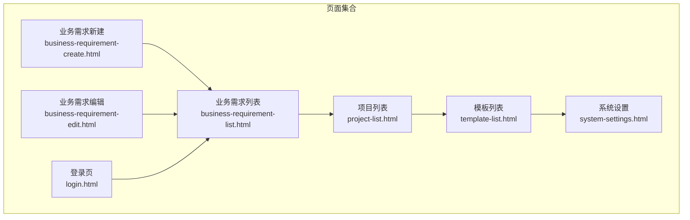
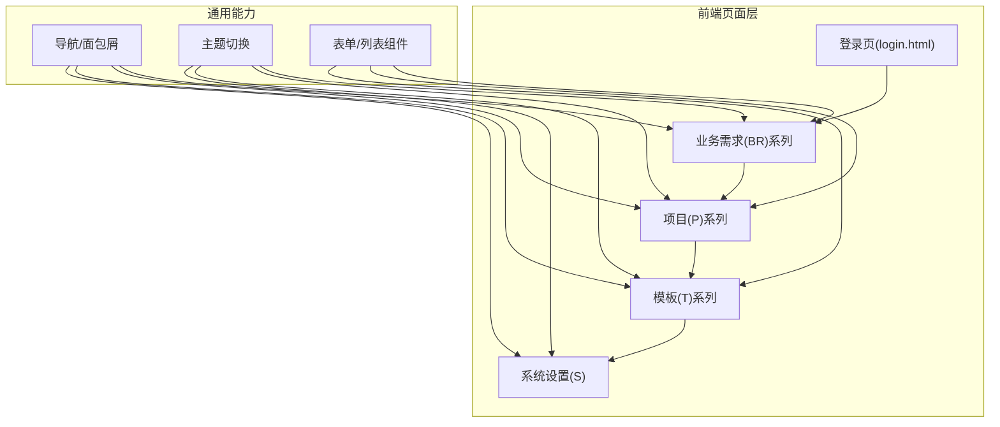
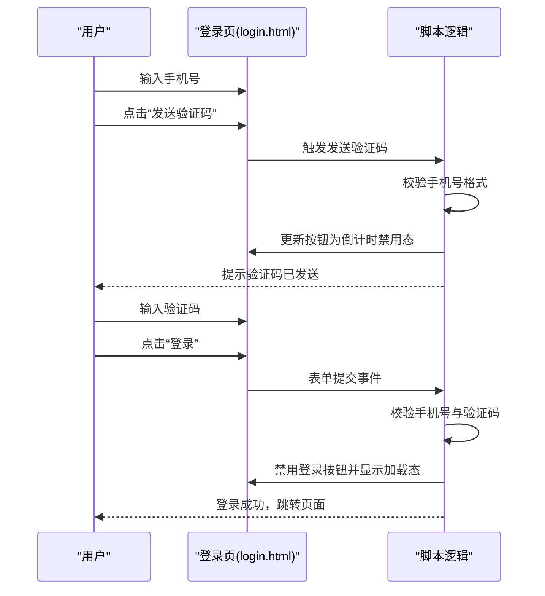
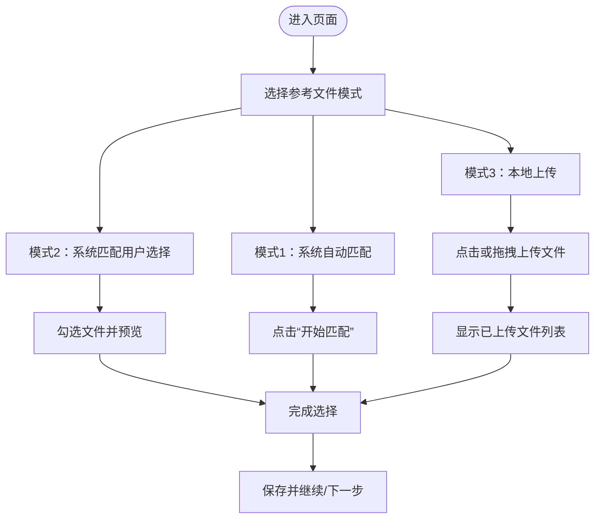
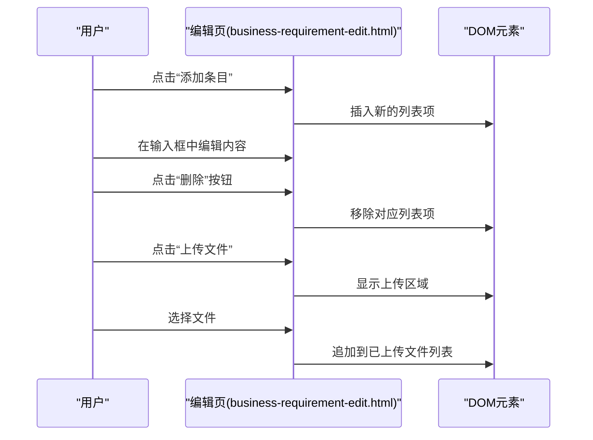
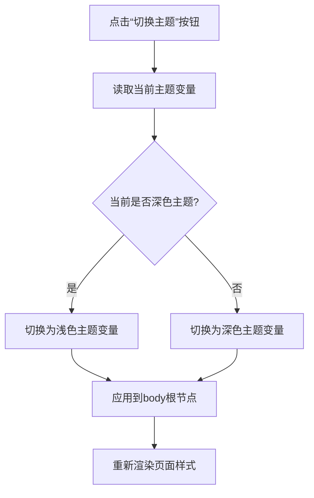

# 开发指南

<cite>
**本文档引用的文件**
- [business-requirement-create.html](file://pages/business-requirement-create.html)
- [business-requirement-edit.html](file://pages/business-requirement-edit.html)
- [login.html](file://pages/login.html)
- [business-requirement-list.html](file://pages/business-requirement-list.html)
- [project-list.html](file://pages/project-list.html)
- [template-list.html](file://pages/template-list.html)
- [system-settings.html](file://pages/system-settings.html)
- [2026-04-10-招标文件AI编制会议纪要.md](file://2026-04-10-招标文件AI编制会议纪要.md)
</cite>

## 目录
1. [简介](#简介)
2. [项目结构](#项目结构)
3. [核心组件](#核心组件)
4. [架构总览](#架构总览)
5. [详细组件分析](#详细组件分析)
6. [依赖关系分析](#依赖关系分析)
7. [性能考虑](#性能考虑)
8. [故障排查指南](#故障排查指南)
9. [结论](#结论)
10. [附录](#附录)

## 简介
本指南面向“招标文件AI编制系统”的前端开发团队，目标是帮助新老开发者快速理解项目结构、掌握页面开发最佳实践、建立一致的命名与代码风格，并提供调试、性能优化、版本管理与部署策略的实操建议。系统采用纯HTML/CSS/JavaScript实现，具备深浅色主题切换、响应式布局与组件化页面设计，覆盖业务需求管理、项目管理、模板管理、系统设置等核心功能模块。

## 项目结构
项目采用按页面维度的扁平目录结构，所有页面位于 pages 目录下，每个页面独立包含HTML结构、内联样式与脚本，便于快速迭代与独立部署。

图表来源
- [business-requirement-create.html:690-725](file://pages/business-requirement-create.html#L690-L725)
- [business-requirement-edit.html:610-644](file://pages/business-requirement-edit.html#L610-L644)
- [business-requirement-list.html:60-137](file://pages/business-requirement-list.html#L60-L137)
- [login.html:318-362](file://pages/login.html#L318-L362)
- [project-list.html:60-137](file://pages/project-list.html#L60-L137)
- [template-list.html:60-137](file://pages/template-list.html#L60-L137)
- [system-settings.html:60-137](file://pages/system-settings.html#L60-L137)

章节来源
- [business-requirement-create.html:1-1181](file://pages/business-requirement-create.html#L1-L1181)
- [business-requirement-edit.html:1-1028](file://pages/business-requirement-edit.html#L1-L1028)
- [login.html:1-481](file://pages/login.html#L1-L481)
- [business-requirement-list.html:1-787](file://pages/business-requirement-list.html#L1-L787)
- [project-list.html:1-820](file://pages/project-list.html#L1-L820)
- [template-list.html:1-974](file://pages/template-list.html#L1-L974)
- [system-settings.html:1-1025](file://pages/system-settings.html#L1-L1025)

## 核心组件
- 页面骨架与导航
  - 侧边栏导航：统一的左侧固定导航，包含“编制业务需求”“项目管理”“模板管理”“统计分析”“消息中心”“系统设置”等入口，支持点击跳转。
  - 顶部栏：面包屑导航与用户信息区域，包含消息徽章与用户头像。
  - 内容区：页面标题、操作按钮与表单/列表容器。
- 表单与输入控件
  - 输入框、选择框、文本域、单选/多选、动态列表、上传区域等，配合提示文案与校验状态。
- 主题切换
  - 通过CSS变量与内联脚本实现深浅主题切换，覆盖背景、文字、边框、卡片等颜色。
- 参考文件选择
  - 支持三种模式：系统自动匹配、系统匹配用户选择、本地上传，分别对应不同的UI与交互。
- 列表与卡片
  - 使用卡片/列表展示业务需求、项目、模板等实体，支持预览、选择、删除等操作。

章节来源
- [business-requirement-create.html:61-204](file://pages/business-requirement-create.html#L61-L204)
- [business-requirement-edit.html:61-200](file://pages/business-requirement-edit.html#L61-L200)
- [login.html:62-155](file://pages/login.html#L62-L155)

## 架构总览
系统采用“页面即应用”的前端架构，每个页面独立渲染，内部通过事件绑定与DOM操作实现交互。主题切换与导航跳转为跨页面通用能力，表单与列表为页面内通用组件。

图表来源
- [login.html:318-362](file://pages/login.html#L318-L362)
- [business-requirement-create.html:690-725](file://pages/business-requirement-create.html#L690-L725)
- [business-requirement-edit.html:610-644](file://pages/business-requirement-edit.html#L610-L644)
- [business-requirement-list.html:60-137](file://pages/business-requirement-list.html#L60-L137)
- [project-list.html:60-137](file://pages/project-list.html#L60-L137)
- [template-list.html:60-137](file://pages/template-list.html#L60-L137)
- [system-settings.html:60-137](file://pages/system-settings.html#L60-L137)

## 详细组件分析

### 组件A：登录页（登录与验证码）
- 功能要点
  - 手机号输入与6位验证码输入。
  - 发送验证码倒计时与禁用态。
  - 表单校验与错误提示。
  - 登录成功后跳转至政策文件列表页。
- 交互流程

图表来源
- [login.html:364-481](file://pages/login.html#L364-L481)

章节来源
- [login.html:337-458](file://pages/login.html#L337-L458)

### 组件B：业务需求新建页（表单与参考文件选择）
- 功能要点
  - 基本信息表单：需求名称、项目类别、项目类型、预算价、需求描述。
  - 参考文件选择：三种模式（自动匹配、系统匹配用户选择、本地上传）。
  - 动态列表与上传区域，支持预览与删除。
- 处理流程（参考文件选择）

图表来源
- [business-requirement-create.html:739-896](file://pages/business-requirement-create.html#L739-L896)

章节来源
- [business-requirement-create.html:739-896](file://pages/business-requirement-create.html#L739-L896)

### 组件C：业务需求编辑页（动态列表与上传）
- 功能要点
  - 基本信息编辑。
  - 动态列表项增删改。
  - 参考文件上传与删除。
- 交互流程（动态列表）

图表来源
- [business-requirement-edit.html:376-488](file://pages/business-requirement-edit.html#L376-L488)

章节来源
- [business-requirement-edit.html:376-488](file://pages/business-requirement-edit.html#L376-L488)

### 组件D：主题切换（CSS变量与脚本）
- 功能要点
  - 通过CSS变量定义主题色值，脚本在运行时切换根节点变量，实现全局主题切换。
  - 支持深色与浅色两种模式，覆盖背景、文字、边框、卡片等。
- 切换流程

图表来源
- [login.html:460-478](file://pages/login.html#L460-L478)
- [business-requirement-create.html:689-690](file://pages/business-requirement-create.html#L689-L690)
- [business-requirement-edit.html:609-610](file://pages/business-requirement-edit.html#L609-L610)

章节来源
- [login.html:460-478](file://pages/login.html#L460-L478)
- [business-requirement-create.html:689-690](file://pages/business-requirement-create.html#L689-L690)
- [business-requirement-edit.html:609-610](file://pages/business-requirement-edit.html#L609-L610)

## 依赖关系分析
- 页面间依赖
  - 登录页为入口，成功后跳转至业务需求列表页。
  - 业务需求列表页作为主入口，可跳转至项目管理、模板管理、系统设置等。
- 组件复用
  - 导航、主题切换、表单组件在多个页面内复用，形成统一的交互体验。
- 数据流
  - 页面内数据主要通过DOM与脚本交互，未见外部数据持久化或API调用，属于前端静态页面。

图表来源
- [login.html:456-456](file://pages/login.html#L456-L456)
- [business-requirement-list.html:694-694](file://pages/business-requirement-list.html#L694-L694)
- [project-list.html:613-613](file://pages/project-list.html#L613-L613)
- [template-list.html:613-613](file://pages/template-list.html#L613-L613)

章节来源
- [login.html:456-456](file://pages/login.html#L456-L456)
- [business-requirement-list.html:694-694](file://pages/business-requirement-list.html#L694-L694)
- [project-list.html:613-613](file://pages/project-list.html#L613-L613)
- [template-list.html:613-613](file://pages/template-list.html#L613-L613)

## 性能考虑
- 资源加载
  - 所有页面均为静态HTML，无外部资源依赖，首屏渲染快，适合本地部署与离线使用。
- 样式与脚本
  - 样式与脚本内联，避免额外HTTP请求，但不利于缓存复用；建议在生产环境拆分并启用压缩。
- 交互性能
  - 主题切换与DOM操作较为简单，性能开销低；复杂列表与上传建议节流/防抖与虚拟滚动优化。
- 响应式与兼容
  - 使用媒体查询与flex布局，适配不同屏幕尺寸；注意旧浏览器兼容性。

[本节为通用建议，无需特定文件来源]

## 故障排查指南
- 登录失败
  - 确认手机号格式正确（11位数字，以1开头）。
  - 验证码需为6位数字。
  - 测试环境提示“验证码已发送，测试环境请输入：123456”。
- 表单校验
  - 必填字段未填写会显示错误提示，修正后再提交。
- 主题切换无效
  - 检查脚本是否正常执行，确认CSS变量是否被正确写入body根节点。
- 文件上传
  - 上传区域支持点击或拖拽，注意文件类型与大小限制；删除按钮可移除已选文件。

章节来源
- [login.html:403-458](file://pages/login.html#L403-L458)
- [business-requirement-create.html:870-896](file://pages/business-requirement-create.html#L870-L896)
- [business-requirement-edit.html:781-800](file://pages/business-requirement-edit.html#L781-L800)

## 结论
本项目以页面为中心的前端架构简洁清晰，适合快速迭代与独立部署。通过统一的导航、主题与组件，实现了良好的用户体验一致性。建议在保持现有结构的基础上，逐步引入模块化与构建工具，提升可维护性与性能表现。

[本节为总结，无需特定文件来源]

## 附录

### 页面开发最佳实践
- HTML结构设计
  - 使用语义化标签，合理嵌套，避免过度div。
  - 为交互元素提供明确的可访问性属性（如aria-*）。
- CSS样式组织
  - 使用CSS变量集中管理主题色，便于主题切换与维护。
  - 采用BEM或类似命名约定，避免样式冲突。
  - 将公共样式抽取为可复用类，减少重复。
- JavaScript功能实现
  - 将事件处理函数集中在页面底部或独立模块，避免全局污染。
  - 对频繁触发的事件（如滚动、输入）进行节流/防抖。
  - 使用现代API（如fetch、URLSearchParams）替代传统XHR与字符串拼接。
- 组件化理念
  - 将常用UI抽象为组件（如表单、列表、模态框），统一参数与回调。
  - 通过数据驱动渲染，减少直接DOM操作。
- 模块间通信
  - 页面间通过URL参数传递轻量数据；复杂数据通过localStorage/sessionStorage共享。
  - 公共逻辑（如主题切换、导航）抽取为工具函数或混入。
- 数据流向
  - 页面内数据通过表单与DOM双向绑定；上传与下载通过原生API处理。
  - 无后端交互时，使用内存存储模拟数据流。

[本节为通用建议，无需特定文件来源]

### 代码注释规范
- HTML
  - 为重要结构添加注释，说明用途与交互逻辑。
- CSS
  - 为关键变量与复杂规则添加注释，说明作用域与变更原因。
- JavaScript
  - 为函数与事件处理添加简要注释，说明输入、输出与异常处理。

[本节为通用建议，无需特定文件来源]

### 调试技巧
- 控制台日志
  - 使用console.log/console.error记录关键流程与错误信息。
- 断点调试
  - 在事件回调与异步逻辑处设置断点，观察变量状态变化。
- 性能分析
  - 使用浏览器性能面板分析渲染与脚本执行耗时。

[本节为通用建议，无需特定文件来源]

### Git工作流程与版本管理
- 分支策略
  - 主分支保护，功能开发在特性分支进行，合并前进行代码审查。
- 提交规范
  - 使用清晰的提交信息，描述变更目的与影响范围。
- 版本标记
  - 采用语义化版本，发布前更新变更日志。
- 合并与回滚
  - 合并后及时同步远端；出现问题时准备回滚方案。

[本节为通用建议，无需特定文件来源]

### 部署策略
- 本地部署
  - 直接打开HTML文件即可运行，适合演示与测试。
- 静态站点托管
  - 推荐使用GitHub Pages、Vercel、Netlify等平台托管。
- 生产优化
  - 引入构建工具（如Webpack/Vite）进行压缩与模块化。
  - 启用CDN与缓存策略，提升加载速度。

[本节为通用建议，无需特定文件来源]

### 常见开发问题与解决方案
- 表单验证失败
  - 检查必填字段与正则表达式，确保错误提示文案友好。
- 主题切换闪烁
  - 预设主题变量，避免首次渲染时的颜色闪烁。
- 文件上传失败
  - 检查文件类型与大小限制，确保事件绑定正确。

[本节为通用建议，无需特定文件来源]

### 测试方法与质量保证
- 单元测试
  - 对纯函数与工具方法编写测试用例，覆盖边界条件。
- 端到端测试
  - 使用自动化测试框架（如Playwright）模拟用户操作。
- 代码质量
  - 使用ESLint/Prettier统一代码风格，开启严格模式。
- 可访问性
  - 确保键盘可操作与屏幕阅读器友好。

[本节为通用建议，无需特定文件来源]

### 新人入门指导
- 环境搭建
  - 准备现代浏览器与文本编辑器，无需额外依赖。
- 快速上手
  - 从登录页与业务需求列表页入手，理解页面结构与交互。
- 学习路径
  - 先掌握HTML/CSS/JavaScript基础，再学习组件化与模块化思想。
- 技术支持
  - 遇到问题时查阅会议纪要与页面注释，必要时寻求团队协助。

章节来源
- [2026-04-10-招标文件AI编制会议纪要.md:1-29](file://2026-04-10-招标文件AI编制会议纪要.md#L1-L29)