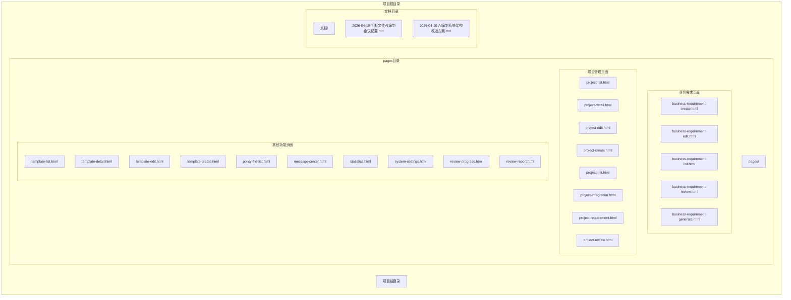
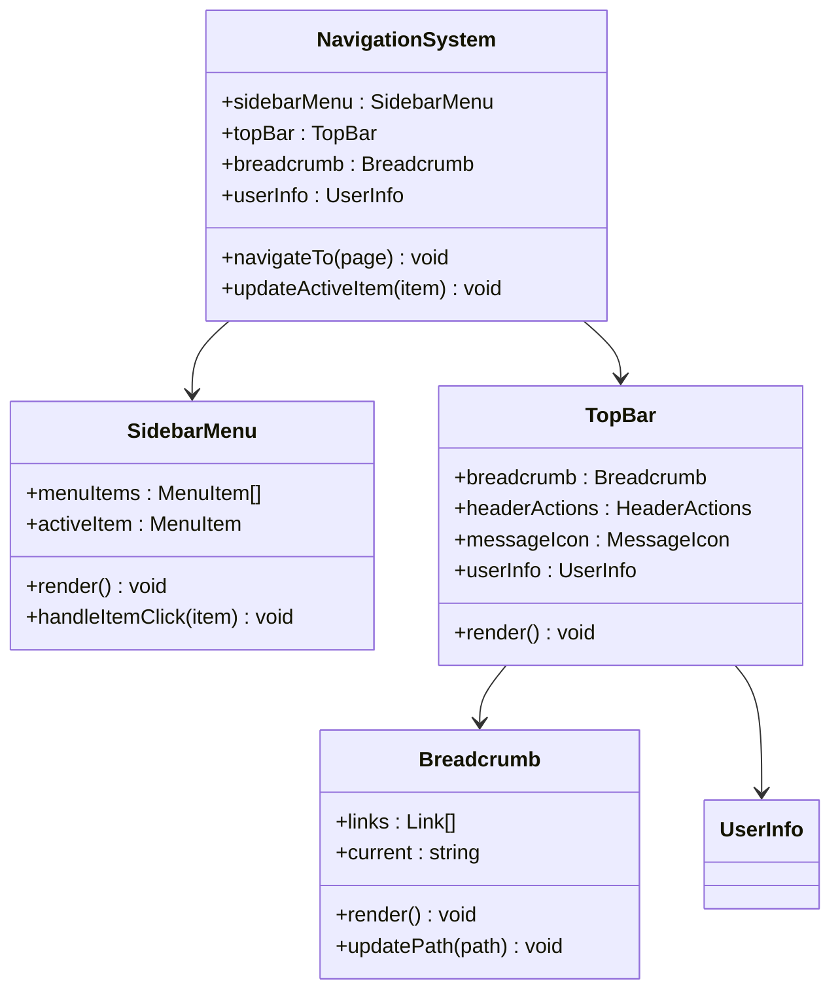
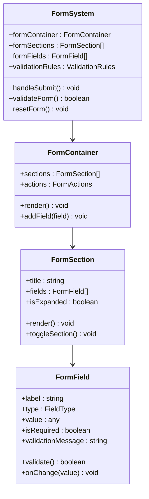
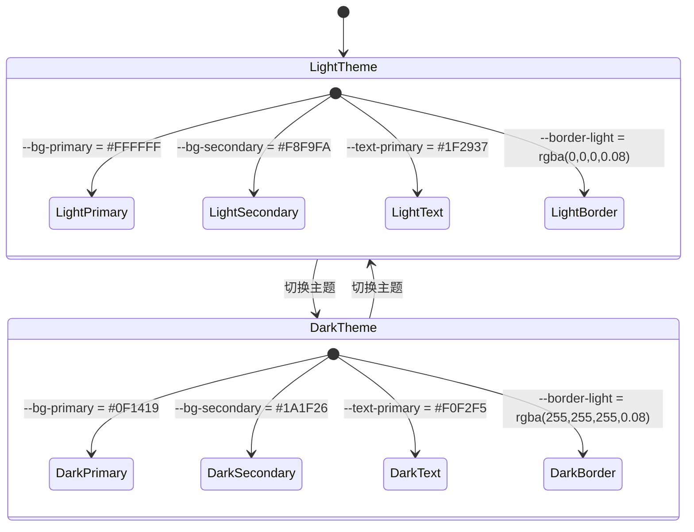
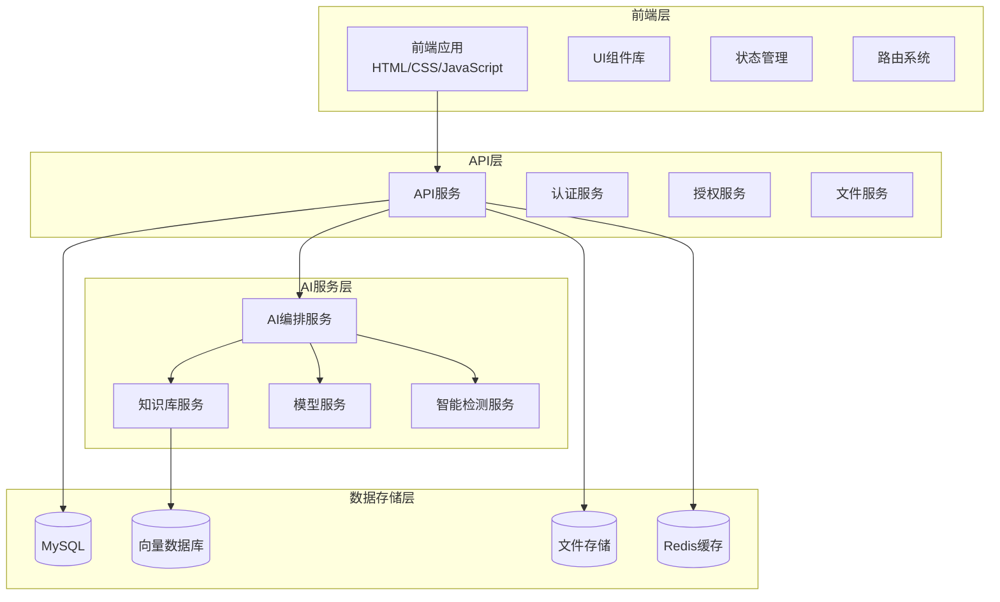
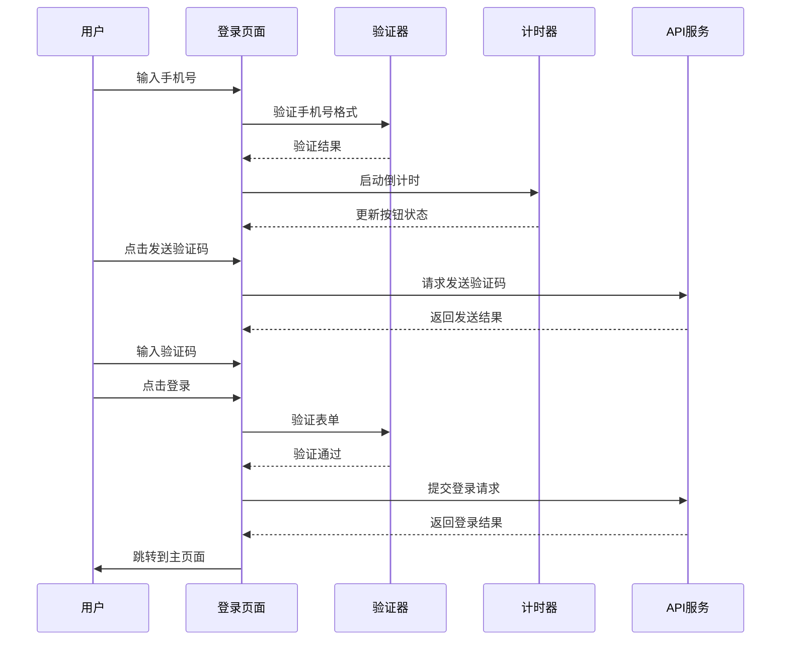
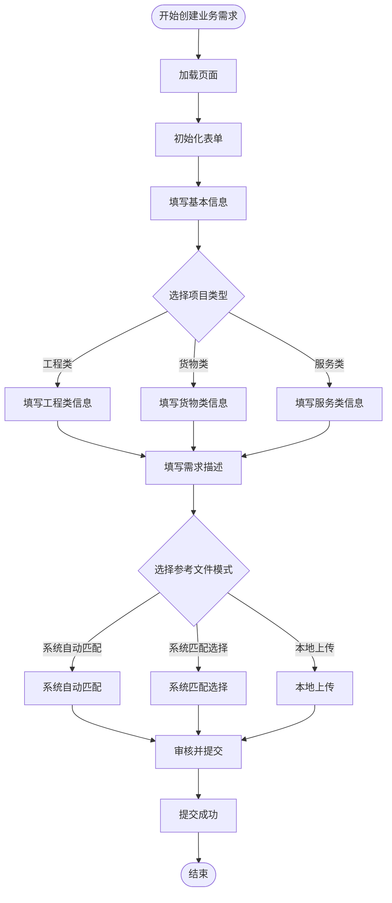
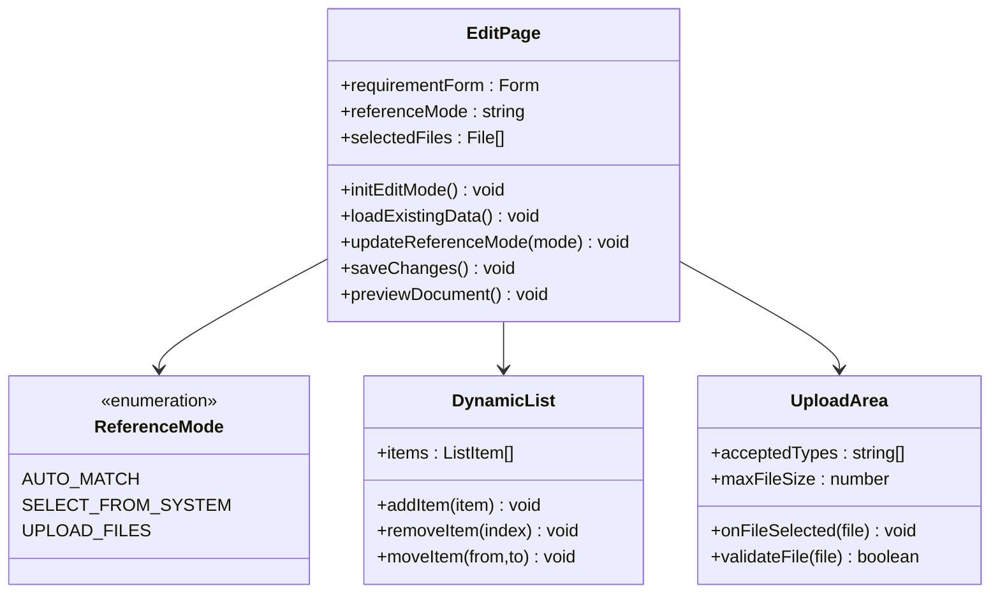
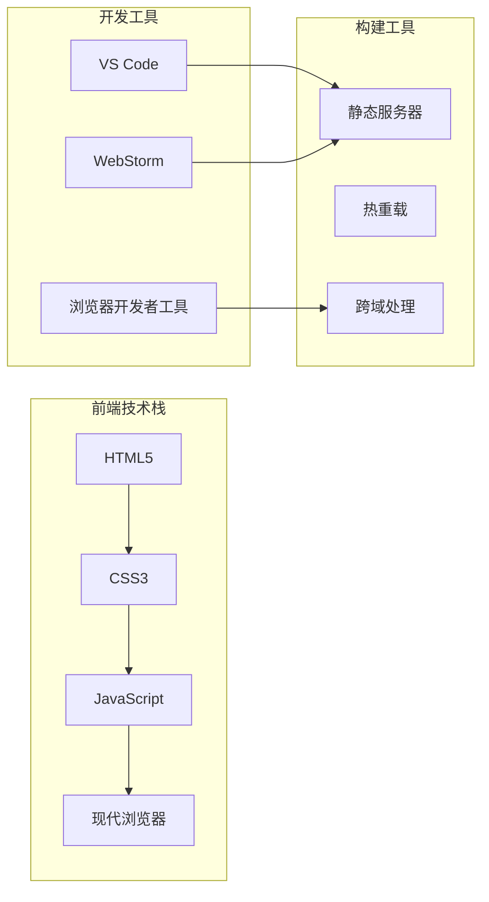

# 开发环境搭建

<cite>
**本文档引用的文件**
- [business-requirement-create.html](file://pages/business-requirement-create.html)
- [business-requirement-edit.html](file://pages/business-requirement-edit.html)
- [login.html](file://pages/login.html)
- [2026-04-10-招标文件AI编制会议纪要.md](file://2026-04-10-招标文件AI编制会议纪要.md)
- [2026-04-10-AI编制系统架构改造方案.md](file://2026-04-10-AI编制系统架构改造方案.md)
</cite>

## 目录
1. [简介](#简介)
2. [项目结构](#项目结构)
3. [核心组件](#核心组件)
4. [架构概览](#架构概览)
5. [详细组件分析](#详细组件分析)
6. [依赖关系分析](#依赖关系分析)
7. [性能考虑](#性能考虑)
8. [故障排除指南](#故障排除指南)
9. [结论](#结论)
10. [附录](#附录)

## 简介

招标文件AI编制系统是一个基于HTML/CSS/JavaScript的前端应用，旨在为用户提供智能化的招标文件编制体验。该系统采用现代化的前端技术栈，支持深色/浅色主题切换、响应式设计和丰富的交互功能。

系统的核心目标是通过AI技术辅助用户快速生成高质量的招标文件，包括业务需求生成、智能检测、模板管理和文档导出等功能。项目采用前后端分离架构，前端负责用户界面展示和交互逻辑，后端提供API服务和数据管理。

## 项目结构

该项目采用基于页面的组织结构，每个功能模块对应一个独立的HTML页面：

**图表来源**
- [business-requirement-create.html:1-1181](file://pages/business-requirement-create.html#L1-L1181)
- [business-requirement-edit.html:1-1028](file://pages/business-requirement-edit.html#L1-L1028)
- [login.html:1-481](file://pages/login.html#L1-L481)

**章节来源**
- [business-requirement-create.html:1-1181](file://pages/business-requirement-create.html#L1-L1181)
- [business-requirement-edit.html:1-1028](file://pages/business-requirement-edit.html#L1-L1028)
- [login.html:1-481](file://pages/login.html#L1-L481)

## 核心组件

### 页面导航系统

系统采用统一的导航布局，包含侧边栏菜单和顶部导航栏：

**图表来源**
- [business-requirement-create.html:692-725](file://pages/business-requirement-create.html#L692-L725)
- [business-requirement-edit.html:611-644](file://pages/business-requirement-edit.html#L611-L644)
- [login.html:318-360](file://pages/login.html#L318-L360)

### 表单系统

系统包含多种表单组件，支持复杂的业务需求录入和编辑：

**图表来源**
- [business-requirement-create.html:739-800](file://pages/business-requirement-create.html#L739-L800)
- [business-requirement-edit.html:658-712](file://pages/business-requirement-edit.html#L658-L712)

### 主题切换系统

系统支持深色和浅色主题切换，提供良好的用户体验：

**图表来源**
- [business-requirement-create.html:32-51](file://pages/business-requirement-create.html#L32-L51)
- [business-requirement-edit.html:32-51](file://pages/business-requirement-edit.html#L32-L51)
- [login.html:32-51](file://pages/login.html#L32-L51)

**章节来源**
- [business-requirement-create.html:1-1181](file://pages/business-requirement-create.html#L1-L1181)
- [business-requirement-edit.html:1-1028](file://pages/business-requirement-edit.html#L1-L1028)
- [login.html:1-481](file://pages/login.html#L1-L481)

## 架构概览

基于会议纪要和架构方案，系统采用分层架构设计：

**图表来源**
- [2026-04-10-AI编制系统架构改造方案.md:5-35](file://2026-04-10-AI编制系统架构改造方案.md#L5-L35)
- [2026-04-10-招标文件AI编制会议纪要.md:1-29](file://2026-04-10-招标文件AI编制会议纪要.md#L1-L29)

## 详细组件分析

### 登录页面组件

登录页面提供了手机号验证码登录功能，包含完整的表单验证和交互逻辑：

**图表来源**
- [login.html:364-458](file://pages/login.html#L364-L458)

### 业务需求创建组件

业务需求创建页面支持多种项目类型的录入和参考文件的选择：

**图表来源**
- [business-requirement-create.html:740-800](file://pages/business-requirement-create.html#L740-L800)
- [business-requirement-edit.html:714-780](file://pages/business-requirement-edit.html#L714-L780)

### 编辑页面组件

编辑页面支持对现有业务需求的修改和参考文件的更新：

**图表来源**
- [business-requirement-edit.html:658-800](file://pages/business-requirement-edit.html#L658-L800)

**章节来源**
- [login.html:364-458](file://pages/login.html#L364-L458)
- [business-requirement-create.html:740-800](file://pages/business-requirement-create.html#L740-L800)
- [business-requirement-edit.html:658-800](file://pages/business-requirement-edit.html#L658-L800)

## 依赖关系分析

### 技术栈依赖

系统采用纯前端技术栈，主要依赖关系如下：

### 浏览器兼容性

系统支持以下浏览器版本：

| 浏览器 | 最低支持版本 | 特殊要求 |
|--------|-------------|----------|
| Chrome | 80+ | 完全支持 |
| Firefox | 70+ | 完全支持 |
| Safari | 13+ | 完全支持 |
| Edge | 80+ | 完全支持 |
| IE | 不支持 | 使用现代浏览器 |

**章节来源**
- [2026-04-10-AI编制系统架构改造方案.md:1-140](file://2026-04-10-AI编制系统架构改造方案.md#L1-L140)

## 性能考虑

### 加载性能优化

1. **资源压缩**: 所有CSS和JavaScript文件应进行压缩和合并
2. **图片优化**: SVG图标优于位图，使用适当的图片格式
3. **字体优化**: 使用系统字体，减少字体加载时间
4. **缓存策略**: 合理设置HTTP缓存头

### 运行时性能

1. **DOM操作优化**: 减少频繁的DOM查询和修改
2. **事件委托**: 使用事件委托处理大量元素的事件
3. **虚拟滚动**: 对长列表使用虚拟滚动技术
4. **懒加载**: 图片和组件的懒加载

## 故障排除指南

### 常见问题及解决方案

#### 1. 页面无法正常显示

**症状**: 页面空白或样式错乱
**原因**: CSS文件加载失败或浏览器兼容性问题
**解决方案**:
- 检查CSS文件路径是否正确
- 确认浏览器版本满足最低要求
- 清除浏览器缓存

#### 2. 表单验证不工作

**症状**: 表单提交时验证无效
**原因**: JavaScript文件未正确加载
**解决方案**:
- 检查JavaScript文件路径
- 确认浏览器JavaScript功能已启用
- 查看浏览器控制台错误信息

#### 3. 主题切换失效

**症状**: 切换主题后样式未改变
**原因**: CSS变量未正确更新
**解决方案**:
- 检查toggleTheme函数是否正确执行
- 确认CSS变量定义完整
- 验证浏览器对CSS变量的支持

#### 4. 导航链接失效

**症状**: 点击导航链接无反应
**原因**: HTML文件路径错误
**解决方案**:
- 检查相对路径是否正确
- 确认目标文件存在
- 验证文件命名一致性

### 调试技巧

1. **浏览器开发者工具**: 使用Elements面板检查DOM结构
2. **Console面板**: 查看JavaScript错误和警告
3. **Network面板**: 检查资源加载状态
4. **Sources面板**: 设置断点调试JavaScript代码

**章节来源**
- [login.html:364-458](file://pages/login.html#L364-L458)
- [business-requirement-create.html:688-725](file://pages/business-requirement-create.html#L688-L725)
- [business-requirement-edit.html:606-644](file://pages/business-requirement-edit.html#L606-L644)

## 结论

招标文件AI编制系统是一个功能完整、架构清晰的前端应用。通过合理的页面组织、完善的表单系统和灵活的主题切换机制，为用户提供了优秀的使用体验。

系统采用的技术栈简单明确，易于维护和扩展。建议在开发过程中重点关注：
- 保持代码结构的一致性
- 注重用户体验的细节优化
- 建立完善的测试和调试流程
- 关注浏览器兼容性和性能优化

## 附录

### 开发环境配置清单

#### 必需工具
- 现代浏览器（Chrome/Firefox/Safari/Edge）
- 文本编辑器（VS Code/WebStorm）
- Git版本控制系统

#### 推荐插件
- VS Code: Prettier、ESLint、Live Server
- WebStorm: Live Edit、CodeGlance

#### 开发服务器配置
- 端口: 8080
- 自动刷新: 启用
- 跨域支持: 配置允许本地开发