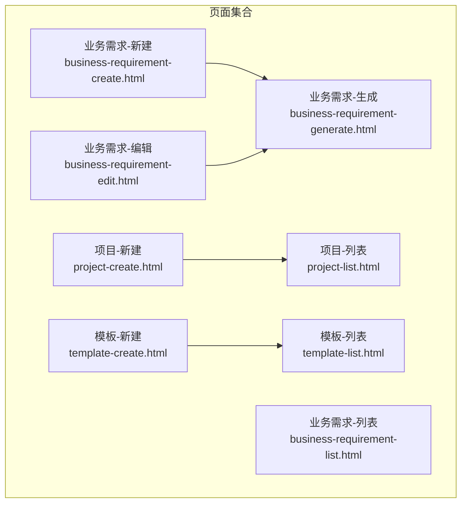
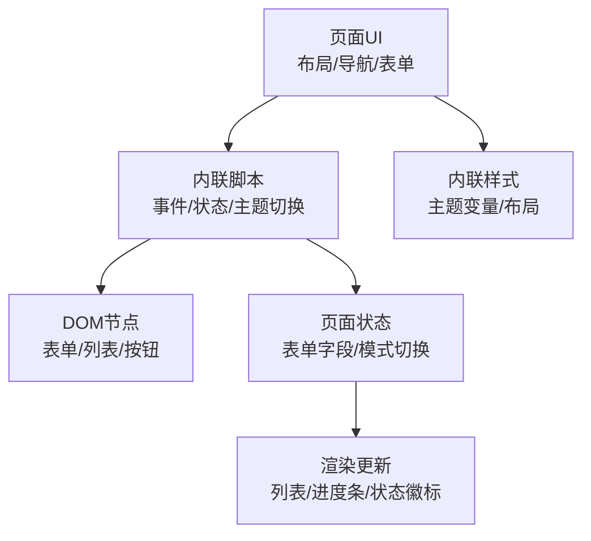
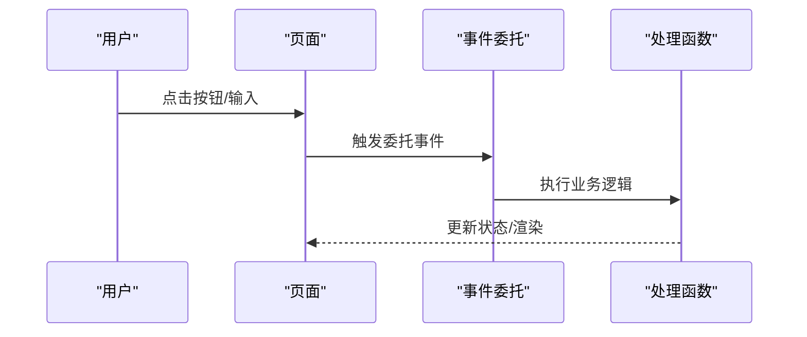
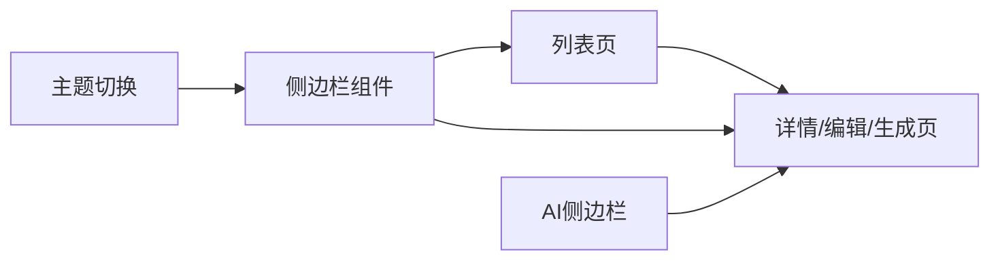

# 性能优化

<cite>
**本文引用的文件**
- [business-requirement-create.html](file://pages/business-requirement-create.html)
- [business-requirement-edit.html](file://pages/business-requirement-edit.html)
- [business-requirement-generate.html](file://pages/business-requirement-generate.html)
- [business-requirement-list.html](file://pages/business-requirement-list.html)
- [project-create.html](file://pages/project-create.html)
- [project-list.html](file://pages/project-list.html)
- [template-create.html](file://pages/template-create.html)
- [template-list.html](file://pages/template-list.html)
</cite>

## 目录
1. [简介](#简介)
2. [项目结构](#项目结构)
3. [核心组件](#核心组件)
4. [架构总览](#架构总览)
5. [详细组件分析](#详细组件分析)
6. [依赖关系分析](#依赖关系分析)
7. [性能考量](#性能考量)
8. [故障排查指南](#故障排查指南)
9. [结论](#结论)
10. [附录](#附录)

## 简介
本指南面向“招标文件AI编制系统”的前端性能优化，聚焦HTML结构、CSS渲染、JavaScript执行效率、图片与字体加载、第三方资源管理、内存与DOM优化、事件处理、页面加载与首屏渲染、交互响应性、缓存与CDN、压缩技术以及性能监控与指标分析。文档以系统内各页面为载体，结合实际代码结构与交互模式，给出可落地的优化建议。

## 项目结构
系统采用多页面静态HTML架构，页面按功能模块划分，包含业务需求、项目管理、模板管理等页面。页面普遍采用内联样式与少量内联脚本，具备统一的布局结构（侧边栏、顶部导航、面包屑、内容区）与主题切换能力。

图表来源
- [business-requirement-create.html:1-1200](file://pages/business-requirement-create.html#L1-L1200)
- [business-requirement-edit.html:1-1200](file://pages/business-requirement-edit.html#L1-L1200)
- [business-requirement-generate.html:1-1200](file://pages/business-requirement-generate.html#L1-L1200)
- [business-requirement-list.html:1-800](file://pages/business-requirement-list.html#L1-L800)
- [project-create.html:1-900](file://pages/project-create.html#L1-L900)
- [project-list.html:1-900](file://pages/project-list.html#L1-L900)
- [template-create.html:1-900](file://pages/template-create.html#L1-L900)
- [template-list.html:1-1000](file://pages/template-list.html#L1-L1000)

章节来源
- [business-requirement-create.html:1-1200](file://pages/business-requirement-create.html#L1-L1200)
- [business-requirement-edit.html:1-1200](file://pages/business-requirement-edit.html#L1-L1200)
- [business-requirement-generate.html:1-1200](file://pages/business-requirement-generate.html#L1-L1200)
- [business-requirement-list.html:1-800](file://pages/business-requirement-list.html#L1-L800)
- [project-create.html:1-900](file://pages/project-create.html#L1-L900)
- [project-list.html:1-900](file://pages/project-list.html#L1-L900)
- [template-create.html:1-900](file://pages/template-create.html#L1-L900)
- [template-list.html:1-1000](file://pages/template-list.html#L1-L1000)

## 核心组件
- 统一布局与导航
  - 侧边栏导航：固定宽度、滚动容器，承载模块入口。
  - 顶部栏：面包屑、消息徽标、用户信息。
  - 内容区：最大宽度约束、栅格化表单与卡片布局。
- 主题切换机制
  - 通过根CSS变量控制主题色板，切换时批量更新变量值。
- 表单与交互
  - 多页面包含复杂表单、动态列表、文件上传、AI侧边栏、富文本编辑器等交互元素。
- 数据表格与分页
  - 列表页采用表格+分页控件，包含筛选、排序、状态标签等。

章节来源
- [business-requirement-create.html:61-200](file://pages/business-requirement-create.html#L61-L200)
- [business-requirement-edit.html:61-200](file://pages/business-requirement-edit.html#L61-L200)
- [business-requirement-generate.html:61-200](file://pages/business-requirement-generate.html#L61-L200)
- [business-requirement-list.html:506-580](file://pages/business-requirement-list.html#L506-L580)
- [project-create.html:50-120](file://pages/project-create.html#L50-L120)
- [project-list.html:50-120](file://pages/project-list.html#L50-L120)
- [template-create.html:490-560](file://pages/template-create.html#L490-L560)
- [template-list.html:560-640](file://pages/template-list.html#L560-L640)

## 架构总览
系统前端为多页面SPA式结构（单页应用风格的多HTML页面），通过页面间跳转实现模块切换。交互层以内联脚本为主，配合CSS变量实现主题切换；数据层以页面内表单与状态变量承载，部分页面包含AI对话与富文本编辑器。

图表来源
- [business-requirement-create.html:740-800](file://pages/business-requirement-create.html#L740-L800)
- [business-requirement-edit.html:760-820](file://pages/business-requirement-edit.html#L760-L820)
- [business-requirement-generate.html:690-760](file://pages/business-requirement-generate.html#L690-L760)
- [template-create.html:760-820](file://pages/template-create.html#L760-L820)

## 详细组件分析

### HTML结构优化
- 语义化与可访问性
  - 使用语义化标签（表单、表格、列表）提升SEO与可访问性。
  - 为交互元素提供aria-label或title属性，增强屏幕阅读器支持。
- 结构扁平化
  - 减少深层嵌套，避免过度div包裹，降低渲染成本。
- 资源路径与外链
  - 图片与字体采用相对路径或CDN，避免跨域阻塞。
- 关键路径最小化
  - 将非关键CSS移至外部样式表，关键CSS内联，减少阻塞。

章节来源
- [business-requirement-create.html:1-120](file://pages/business-requirement-create.html#L1-L120)
- [business-requirement-list.html:590-650](file://pages/business-requirement-list.html#L590-L650)
- [template-list.html:680-740](file://pages/template-list.html#L680-L740)

### CSS渲染优化
- CSS变量与主题切换
  - 使用CSS变量集中管理颜色与层级，主题切换仅需更新变量，避免重排重绘。
- 动画与过渡
  - 控制transition-duration与timing-function，避免长耗时动画影响首屏。
- Flex/Grid布局
  - 使用现代布局减少float与position，提高渲染性能。
- 响应式设计
  - 使用媒体查询与相对单位，减少断点数量，降低匹配开销。

章节来源
- [business-requirement-create.html:10-60](file://pages/business-requirement-create.html#L10-L60)
- [business-requirement-generate.html:320-420](file://pages/business-requirement-generate.html#L320-L420)
- [template-create.html:320-420](file://pages/template-create.html#L320-L420)

### JavaScript执行效率提升
- 事件委托
  - 对动态列表与按钮组使用事件委托，减少监听器数量。
- 防抖与节流
  - 对resize、scroll、输入框实时校验等高频事件进行防抖/节流。
- 懒执行与延迟初始化
  - AI侧边栏、富文本编辑器等重型组件按需初始化。
- 函数拆分与缓存
  - 提取公共逻辑，缓存DOM查询结果与计算结果。

图表来源
- [business-requirement-create.html:740-800](file://pages/business-requirement-create.html#L740-L800)
- [business-requirement-edit.html:760-820](file://pages/business-requirement-edit.html#L760-L820)
- [business-requirement-generate.html:400-480](file://pages/business-requirement-generate.html#L400-L480)

章节来源
- [business-requirement-create.html:740-800](file://pages/business-requirement-create.html#L740-L800)
- [business-requirement-edit.html:760-820](file://pages/business-requirement-edit.html#L760-L820)
- [business-requirement-generate.html:400-480](file://pages/business-requirement-generate.html#L400-L480)

### 图片资源优化
- 格式选择
  - 优先使用WebP/JPEG2000等现代格式，降级到JPEG/PNG。
- 尺寸与密度
  - 为不同视口与像素密度提供合适尺寸，避免超大图占用带宽。
- 懒加载
  - 非首屏图片采用loading=lazy，减少初始渲染压力。
- 压缩与去重
  - 使用工具压缩体积，合并重复资源。

章节来源
- [business-requirement-generate.html:550-620](file://pages/business-requirement-generate.html#L550-L620)

### 字体加载优化
- 子集化与预加载
  - 使用子集字体，关键路径字体预加载。
- 字体回退
  - 设置合适的fallback字体，避免FOIT/FOFT。
- 字体权衡
  - 中文字体较大，考虑使用系统字体栈或在线CDN。

章节来源
- [business-requirement-create.html:54-58](file://pages/business-requirement-create.html#L54-L58)

### 第三方资源管理
- CDN与缓存
  - 将常用库托管至CDN，利用浏览器缓存与HTTP缓存头。
- 异步加载
  - 对非关键第三方脚本采用async/defer或动态加载。
- 降级策略
  - 当第三方资源失败时提供降级体验。

章节来源
- [business-requirement-generate.html:340-420](file://pages/business-requirement-generate.html#L340-L420)

### 内存使用优化
- DOM复用
  - 列表渲染采用虚拟滚动或分页，避免一次性渲染大量节点。
- 事件解绑
  - 页面切换时解绑未使用的事件监听器。
- 大对象清理
  - 清理富文本编辑器实例与AI会话缓存。

章节来源
- [business-requirement-list.html:585-760](file://pages/business-requirement-list.html#L585-L760)
- [template-create.html:650-760](file://pages/template-create.html#L650-L760)

### DOM操作优化
- 批量更新
  - 使用DocumentFragment或模板字符串拼接后一次性插入。
- 最小化重排
  - 合并样式变更，避免频繁读写混合。
- 虚拟化
  - 大列表采用虚拟化，只渲染可视区域。

章节来源
- [business-requirement-list.html:590-760](file://pages/business-requirement-list.html#L590-L760)
- [template-list.html:680-820](file://pages/template-list.html#L680-L820)

### 事件处理优化
- 事件委托
  - 将多个子元素事件委托到父容器。
- 自定义事件
  - 对复杂交互使用自定义事件，解耦模块。

章节来源
- [business-requirement-create.html:740-800](file://pages/business-requirement-create.html#L740-L800)
- [business-requirement-edit.html:760-820](file://pages/business-requirement-edit.html#L760-L820)

### 页面加载速度优化
- 关键渲染路径
  - 将关键CSS内联，非关键CSS异步加载。
- 资源优先级
  - 使用rel=preload/preconnect优化关键资源加载。
- Gzip/Brotli压缩
  - 开启服务器端压缩，减小传输体积。

章节来源
- [business-requirement-create.html:7-120](file://pages/business-requirement-create.html#L7-L120)
- [business-requirement-generate.html:690-760](file://pages/business-requirement-generate.html#L690-L760)

### 首屏渲染优化
- 骨架屏与占位符
  - 列表与富文本区域使用骨架屏占位。
- 渲染优先级
  - 保证头部导航与面包屑先渲染，内容区延后。

章节来源
- [business-requirement-list.html:540-620](file://pages/business-requirement-list.html#L540-L620)
- [template-list.html:600-700](file://pages/template-list.html#L600-L700)

### 交互响应性优化
- 响应式布局
  - 使用CSS媒体查询与flexbox，适配移动端。
- 按钮与表单反馈
  - 提交按钮禁用与加载指示，提升感知速度。

章节来源
- [business-requirement-create.html:210-280](file://pages/business-requirement-create.html#L210-L280)
- [project-create.html:730-780](file://pages/project-create.html#L730-L780)

### 缓存策略与CDN
- 缓存头配置
  - 静态资源设置长缓存，HTML短缓存。
- CDN分发
  - 图片、字体、第三方库走CDN，就近加速。
- 版本化
  - 资源URL加入哈希，便于失效与缓存控制。

章节来源
- [business-requirement-generate.html:340-420](file://pages/business-requirement-generate.html#L340-L420)

### 压缩技术
- 代码压缩
  - HTML/CSS/JS压缩，去除空白与注释。
- 图片压缩
  - 使用自动化工具压缩与格式转换。

章节来源
- [business-requirement-create.html:7-120](file://pages/business-requirement-create.html#L7-L120)

### 性能监控与指标
- 指标采集
  - FP/FCP/LCP/FID/CLS等核心指标监控。
- 工具使用
  - Lighthouse、WebPageTest、浏览器开发者工具。
- 指标分析
  - 分析瓶颈页面与交互，制定优化计划。

章节来源
- [business-requirement-create.html:688-700](file://pages/business-requirement-create.html#L688-L700)
- [business-requirement-generate.html:690-700](file://pages/business-requirement-generate.html#L690-L700)

## 依赖关系分析
- 页面间依赖
  - 列表页 -> 详情页/编辑页/生成页，存在强依赖。
- 组件复用
  - 侧边栏、顶部栏、表单组件在多页面复用，利于统一优化。
- 资源依赖
  - 主题切换依赖CSS变量，AI侧边栏依赖脚本与DOM。

图表来源
- [business-requirement-list.html:506-580](file://pages/business-requirement-list.html#L506-L580)
- [business-requirement-generate.html:340-420](file://pages/business-requirement-generate.html#L340-L420)

章节来源
- [business-requirement-list.html:506-580](file://pages/business-requirement-list.html#L506-L580)
- [business-requirement-generate.html:340-420](file://pages/business-requirement-generate.html#L340-L420)

## 性能考量
- 渲染性能
  - 控制重排重绘次数，使用transform与opacity动画。
- 网络性能
  - 合理拆分资源，使用HTTP/2多路复用。
- 存储与缓存
  - 利用localStorage/sessionStorage缓存轻量数据，避免频繁请求。
- 可靠性
  - 对网络异常与第三方资源失败提供降级提示。

## 故障排查指南
- 白屏与长时间无响应
  - 检查关键CSS是否阻塞、是否存在大计算任务。
- 卡顿与滚动抖动
  - 检查是否有频繁重排、事件未节流、列表未虚拟化。
- 主题切换异常
  - 检查CSS变量是否正确更新、是否存在覆盖冲突。
- 表单提交失败
  - 检查必填校验、按钮禁用逻辑、网络状态。

章节来源
- [business-requirement-create.html:760-800](file://pages/business-requirement-create.html#L760-L800)
- [business-requirement-generate.html:400-480](file://pages/business-requirement-generate.html#L400-L480)

## 结论
通过结构化优化（HTML语义化、CSS变量、事件委托）、资源优化（图片/字体/第三方）、缓存与CDN、压缩与关键路径优化，以及性能监控与指标分析，可显著提升系统前端性能与用户体验。建议优先解决阻塞渲染与交互卡顿问题，并持续监测核心指标以迭代优化。

## 附录
- 优化清单
  - 关键CSS内联、非关键CSS异步加载
  - 图片格式与尺寸优化、懒加载
  - 字体子集化与预加载
  - 事件委托与防抖/节流
  - 列表虚拟化与分页
  - 主题切换仅更新CSS变量
  - CDN与缓存头配置
  - Lighthouse与浏览器工具定期检查