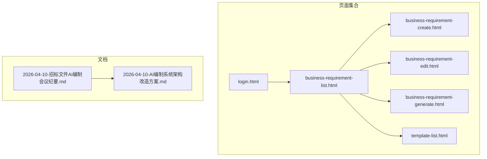
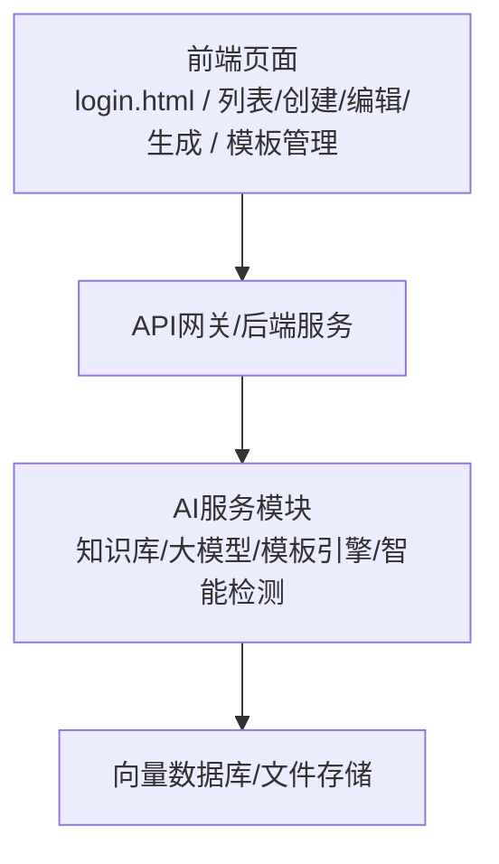
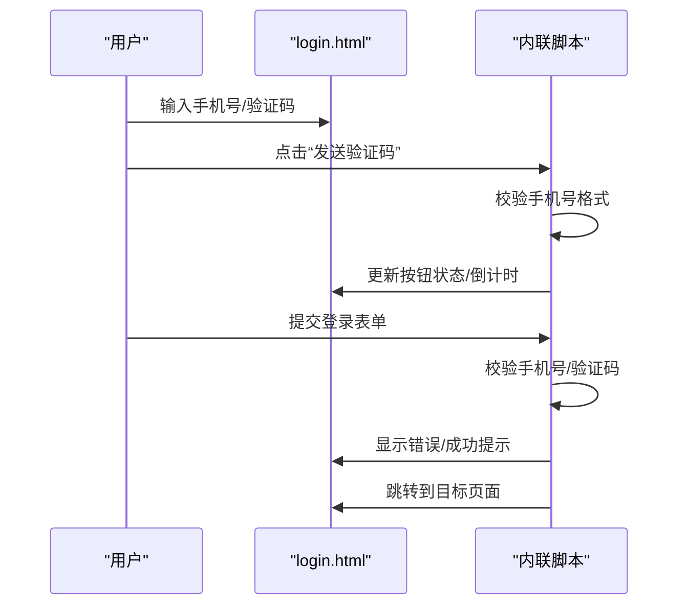
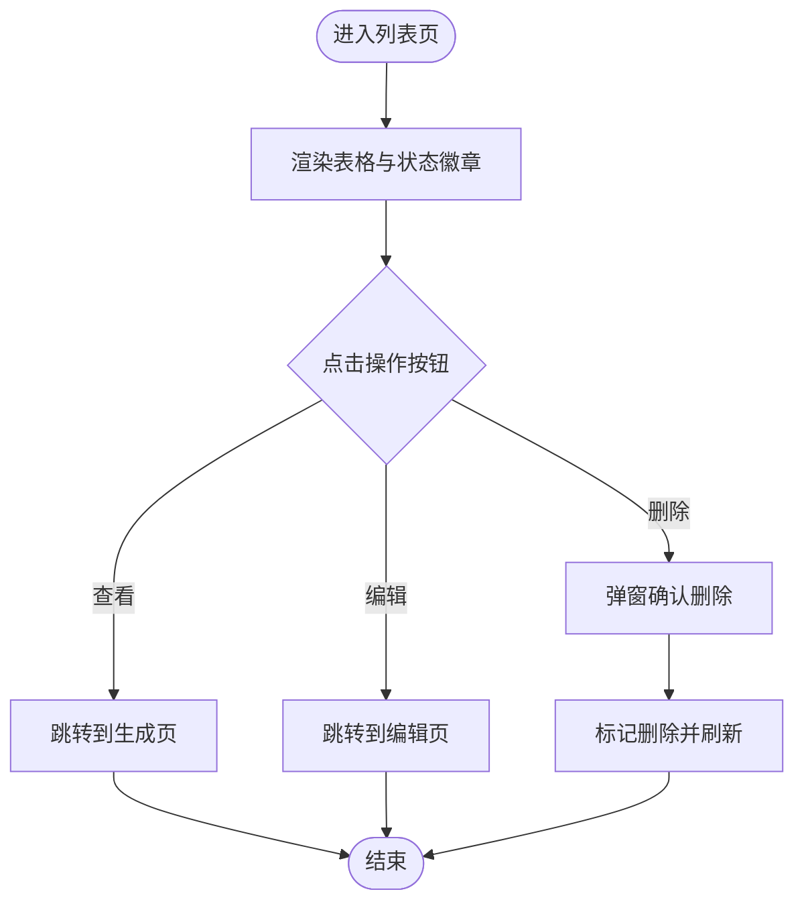
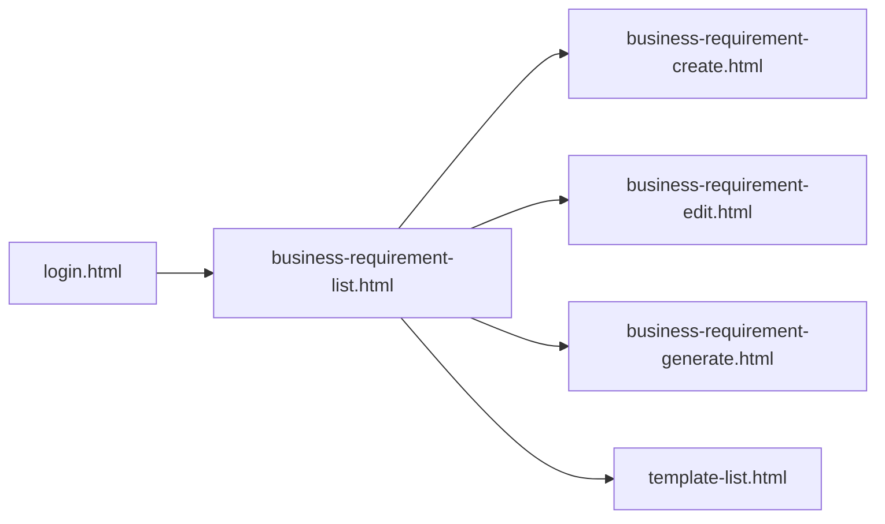

# 调试与测试

<cite>
**本文引用的文件**
- [pages/business-requirement-create.html](file://pages/business-requirement-create.html)
- [pages/business-requirement-edit.html](file://pages/business-requirement-edit.html)
- [pages/business-requirement-generate.html](file://pages/business-requirement-generate.html)
- [pages/business-requirement-list.html](file://pages/business-requirement-list.html)
- [pages/login.html](file://pages/login.html)
- [pages/template-list.html](file://pages/template-list.html)
- [2026-04-10-招标文件AI编制会议纪要.md](file://2026-04-10-招标文件AI编制会议纪要.md)
- [2026-04-10-AI编制系统架构改造方案.md](file://2026-04-10-AI编制系统架构改造方案.md)
</cite>

## 目录
1. [简介](#简介)
2. [项目结构](#项目结构)
3. [核心组件](#核心组件)
4. [架构总览](#架构总览)
5. [详细组件分析](#详细组件分析)
6. [依赖关系分析](#依赖关系分析)
7. [性能考量](#性能考量)
8. [故障排查指南](#故障排查指南)
9. [结论](#结论)
10. [附录](#附录)

## 简介
本指南面向“招标文件AI编制系统”的前端与交互调试与测试，聚焦浏览器开发者工具的实战使用（Elements、Console、Network）、JavaScript错误排查、CSS样式调试与响应式布局测试，以及单元/集成测试与自动化测试、持续集成流程的配置思路。文档同时给出性能优化、内存泄漏检测与用户体验测试的方法与工具建议，帮助研发团队在真实浏览器环境中高效定位问题、验证功能与保障质量。

## 项目结构
本仓库包含多个业务页面（HTML），覆盖登录、业务需求管理、模板管理、项目管理、统计分析、消息中心、系统设置等模块。每个页面均内嵌样式与脚本，便于独立运行与调试。

图表来源
- [pages/login.html](file://pages/login.html)
- [pages/business-requirement-list.html](file://pages/business-requirement-list.html)
- [pages/business-requirement-create.html](file://pages/business-requirement-create.html)
- [pages/business-requirement-edit.html](file://pages/business-requirement-edit.html)
- [pages/business-requirement-generate.html](file://pages/business-requirement-generate.html)
- [pages/template-list.html](file://pages/template-list.html)
- [2026-04-10-招标文件AI编制会议纪要.md](file://2026-04-10-招标文件AI编制会议纪要.md)
- [2026-04-10-AI编制系统架构改造方案.md](file://2026-04-10-AI编制系统架构改造方案.md)

章节来源
- [pages/login.html](file://pages/login.html)
- [pages/business-requirement-list.html](file://pages/business-requirement-list.html)
- [pages/business-requirement-create.html](file://pages/business-requirement-create.html)
- [pages/business-requirement-edit.html](file://pages/business-requirement-edit.html)
- [pages/business-requirement-generate.html](file://pages/business-requirement-generate.html)
- [pages/template-list.html](file://pages/template-list.html)
- [2026-04-10-招标文件AI编制会议纪要.md](file://2026-04-10-招标文件AI编制会议纪要.md)
- [2026-04-10-AI编制系统架构改造方案.md](file://2026-04-10-AI编制系统架构改造方案.md)

## 核心组件
- 页面级组件：登录页、业务需求列表/创建/编辑/生成页、模板列表页等，均包含完整的导航、面包屑、内容区域与动作按钮。
- 交互行为：主题切换、表单校验、动态加载、分页、文件上传区域、AI侧边栏与聊天交互等。
- 样式系统：基于 CSS 自定义属性的主题变量、媒体查询与暗/亮主题切换；大量使用 Flex 布局与响应式断点。
- 数据与状态：部分页面通过内联脚本模拟数据与交互（如业务需求列表中的状态徽章、进度条、操作按钮）。

章节来源
- [pages/business-requirement-create.html](file://pages/business-requirement-create.html)
- [pages/business-requirement-edit.html](file://pages/business-requirement-edit.html)
- [pages/business-requirement-generate.html](file://pages/business-requirement-generate.html)
- [pages/business-requirement-list.html](file://pages/business-requirement-list.html)
- [pages/login.html](file://pages/login.html)
- [pages/template-list.html](file://pages/template-list.html)

## 架构总览
系统采用前后端分离思路，前端页面通过浏览器直连后端服务（在当前仓库中为静态HTML页面，实际系统会通过API对接）。AI相关能力（知识库、大模型、智能检测、模板引擎）在后端以服务形式提供，前端负责展示与交互。

图表来源
- [2026-04-10-AI编制系统架构改造方案.md](file://2026-04-10-AI编制系统架构改造方案.md)
- [2026-04-10-招标文件AI编制会议纪要.md](file://2026-04-10-招标文件AI编制会议纪要.md)

章节来源
- [2026-04-10-AI编制系统架构改造方案.md](file://2026-04-10-AI编制系统架构改造方案.md)
- [2026-04-10-招标文件AI编制会议纪要.md](file://2026-04-10-招标文件AI编制会议纪要.md)

## 详细组件分析

### 登录页（登录与主题切换）
- 功能要点：手机号输入、验证码发送倒计时、表单校验、登录提交、主题切换。
- 调试关注点：输入校验逻辑、倒计时状态、登录成功后的页面跳转、主题切换对 CSS 变量的影响。
- 常见问题：手机号格式校验失败、验证码长度校验失败、倒计时未重置、主题切换后颜色不一致。

图表来源
- [pages/login.html](file://pages/login.html)

章节来源
- [pages/login.html](file://pages/login.html)

### 业务需求列表页（状态与进度）
- 功能要点：列表渲染、状态徽章、进度条、分页、操作按钮（查看/编辑/删除）。
- 调试关注点：状态徽章的颜色与文案一致性、进度条宽度计算、分页控件交互、链接跳转是否正确。
- 常见问题：状态与进度不匹配、分页按钮不可用、图标点击无响应。

图表来源
- [pages/business-requirement-list.html](file://pages/business-requirement-list.html)

章节来源
- [pages/business-requirement-list.html](file://pages/business-requirement-list.html)

### 业务需求创建/编辑页（表单与参考文件）
- 功能要点：表单字段、必填校验、项目类型联动、参考文件三种模式（自动匹配/用户选择/本地上传）。
- 调试关注点：表单字段联动、必填项提示、参考文件模式切换、上传区域交互。
- 常见问题：联动事件未触发、必填项未提示、模式切换后内容未更新。

章节来源
- [pages/business-requirement-create.html](file://pages/business-requirement-create.html)
- [pages/business-requirement-edit.html](file://pages/business-requirement-edit.html)

### 业务需求生成页（AI侧边栏与内容展示）
- 功能要点：生成进度、AI侧边栏、内容编辑/保存/导出、标签与参考文件列表。
- 调试关注点：侧边栏折叠/展开、消息气泡样式、内容编辑器焦点与样式、导出按钮交互。
- 常见问题：侧边栏动画卡顿、消息气泡溢出、编辑器失去焦点样式异常。

章节来源
- [pages/business-requirement-generate.html](file://pages/business-requirement-generate.html)

### 模板列表页（筛选与状态切换）
- 功能要点：搜索、筛选、创建/导入/导出、状态切换、默认模板设置。
- 调试关注点：筛选条件传递、状态切换确认、默认模板设置提示、分页信息。
- 常见问题：筛选条件未生效、状态切换后页面未刷新、确认对话框未触发。

章节来源
- [pages/template-list.html](file://pages/template-list.html)

## 依赖关系分析
- 页面间依赖：登录页 -> 业务需求列表页；列表页 -> 创建/编辑/生成/模板管理页。
- 样式依赖：各页面共享主题变量与通用样式，主题切换通过 CSS 变量实现。
- 交互依赖：部分页面通过内联脚本实现主题切换与简单交互，复杂逻辑建议迁移到独立模块以便测试。

图表来源
- [pages/login.html](file://pages/login.html)
- [pages/business-requirement-list.html](file://pages/business-requirement-list.html)
- [pages/business-requirement-create.html](file://pages/business-requirement-create.html)
- [pages/business-requirement-edit.html](file://pages/business-requirement-edit.html)
- [pages/business-requirement-generate.html](file://pages/business-requirement-generate.html)
- [pages/template-list.html](file://pages/template-list.html)

章节来源
- [pages/login.html](file://pages/login.html)
- [pages/business-requirement-list.html](file://pages/business-requirement-list.html)
- [pages/business-requirement-create.html](file://pages/business-requirement-create.html)
- [pages/business-requirement-edit.html](file://pages/business-requirement-edit.html)
- [pages/business-requirement-generate.html](file://pages/business-requirement-generate.html)
- [pages/template-list.html](file://pages/template-list.html)

## 性能考量
- 渲染性能
  - 使用 CSS 变量与媒体查询减少重复样式，避免频繁重排重绘。
  - 控制列表渲染数量，必要时采用虚拟滚动或分页加载。
- 交互性能
  - 防抖/节流：对输入校验、搜索、筛选等高频事件进行防抖/节流。
  - 异步加载：图片/图标懒加载，大列表分批渲染。
- 存储与缓存
  - 合理使用 localStorage/sessionStorage 缓存轻量状态，避免阻塞主线程。
- 资源优化
  - 图片与 SVG 内联或按需加载，减少请求数量。
  - 压缩与合并 CSS/JS（生产构建），开启 Gzip/Brotli。

## 故障排查指南

### 浏览器开发者工具使用
- Elements 面板
  - 快速定位元素：使用选择器或按住 Ctrl/Cmd 点击元素查看 DOM 结构。
  - 样式检查：查看伪类状态（:hover/:focus）、盒模型、Flex 布局参数。
  - 主题调试：切换暗/亮主题，观察 CSS 变量变化与元素颜色是否一致。
- Console 面板
  - 错误与警告：定位语法错误、未定义变量、API 调用异常。
  - 断点调试：在关键函数入口设置断点，逐步执行，观察变量与调用栈。
  - 性能分析：使用 Performance 面板录制交互，定位长任务与重排重绘热点。
- Network 面板
  - 请求监控：过滤 XHR/Fetch，查看请求头、响应体、状态码与耗时。
  - 缓存策略：检查 Cache-Control/ETag 是否命中缓存。
  - 资源分析：统计资源体积、加载顺序与瓶颈。

### JavaScript 错误排查
- 常见问题
  - 未捕获异常：使用 try/catch 包裹异步逻辑，避免页面崩溃。
  - 事件绑定失效：确保 DOM 加载后再绑定事件，或使用事件委托。
  - 闭包与作用域：避免循环中直接绑定匿名函数导致的上下文丢失。
- 调试技巧
  - 在关键函数入口打印入参与返回值，核对预期行为。
  - 使用 Source Maps 定位到原始源码行号，便于定位问题。
  - 使用断言（assert）在测试环境下验证前置条件。

### CSS 样式调试
- 响应式布局
  - 使用 Device Toolbar 切换设备与断点，观察布局变化。
  - Flex/Grid 布局：检查主轴/交叉轴对齐、换行与最小尺寸。
  - 媒体查询：确认断点与样式覆盖顺序，避免意外回退。
- 主题一致性
  - 检查 CSS 变量是否被正确覆盖，主题切换后颜色是否一致。
  - SVG 图标与文本颜色对比度，确保可读性。

### 单元测试与集成测试
- 测试框架选择
  - 单元测试：Jest 或 Vitest（推荐），适合纯函数与工具函数。
  - 集成测试：Playwright 或 Cypress（推荐），覆盖端到端流程。
- 测试用例设计
  - 表单校验：手机号格式、验证码长度、必填项缺失。
  - 交互流程：主题切换、分页导航、状态切换、文件上传。
  - 边界与异常：空数据、超长输入、网络失败、权限不足。
- 测试组织
  - 按页面/功能模块划分测试文件，便于定位与维护。
  - 使用 Mock 与 Stub 隔离外部依赖，保证测试稳定性。

### 自动化测试与持续集成
- CI/CD 流程
  - 触发条件：push/pr/merge。
  - 步骤：安装依赖、代码检查（ESLint/Prettier）、单元测试、集成测试、打包构建。
  - 结果：报告覆盖率、测试失败详情、构建产物。
- 工具与配置
  - GitHub Actions/Azure DevOps/Jenkins。
  - Playwright/Cypress 的并行执行与截图/视频录制。
  - 代码覆盖率：Istanbul/NYC，阈值保护。

### 性能优化测试
- 关键指标
  - FCP/LCP/INP/CLS/TBT 等 Web Vitals。
  - 首屏渲染时间、交互延迟、内存占用峰值。
- 工具与方法
  - Lighthouse：自动化审计与报告。
  - WebPageTest：跨地区/设备测试。
  - Chrome DevTools Performance：录制与分析长任务。

### 内存泄漏检测
- 方法
  - 使用 Performance Memory 面板快照对比，识别未释放对象。
  - 监控事件监听器与定时器，确保页面卸载时清理。
  - 避免全局变量与闭包持有 DOM 引用。
- 常见原因
  - 未移除的事件监听器、未清理的定时器、缓存未过期、第三方库未释放。

### 用户体验测试
- 可用性
  - 任务完成率、错误率、用户满意度调查。
  - 无障碍：键盘导航、屏幕阅读器支持、颜色对比度。
- 反馈与迭代
  - 收集用户反馈，优先修复影响面广的问题。
  - A/B 测试验证改进效果。

## 结论
本指南提供了从浏览器工具到测试与性能优化的完整调试与测试方法论。建议在开发过程中坚持“先本地调试、再自动化测试、最后CI/CD”的流程，结合性能与用户体验测试，持续提升系统稳定性与质量。

## 附录
- 快速检查清单
  - 所有页面主题切换正常，颜色一致。
  - 表单校验与提示准确，边界输入处理正确。
  - 列表/分页/状态切换交互流畅。
  - AI侧边栏与内容编辑器样式与交互稳定。
  - 测试用例覆盖关键路径与异常场景。
  - CI流水线通过，覆盖率达标。