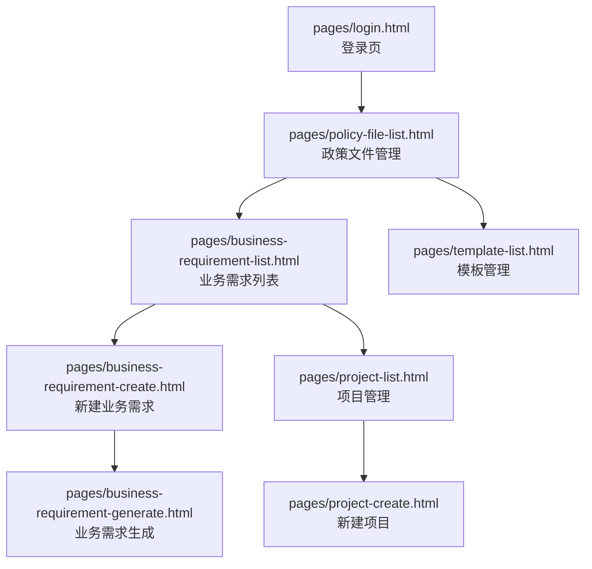
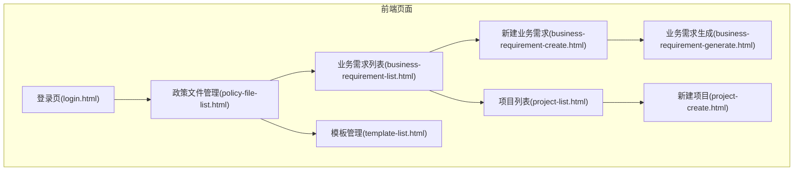
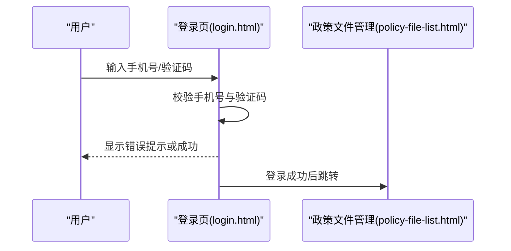
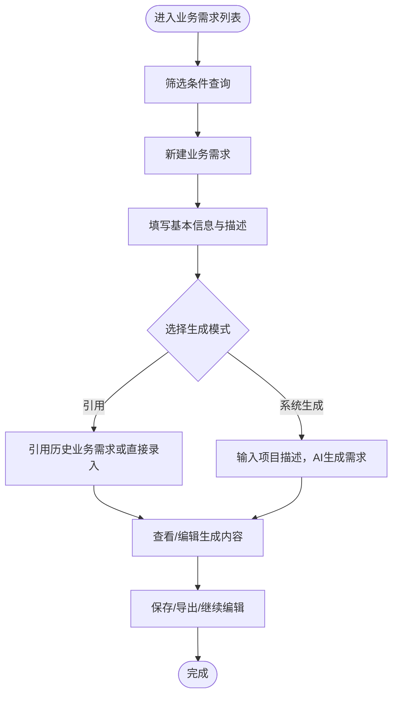
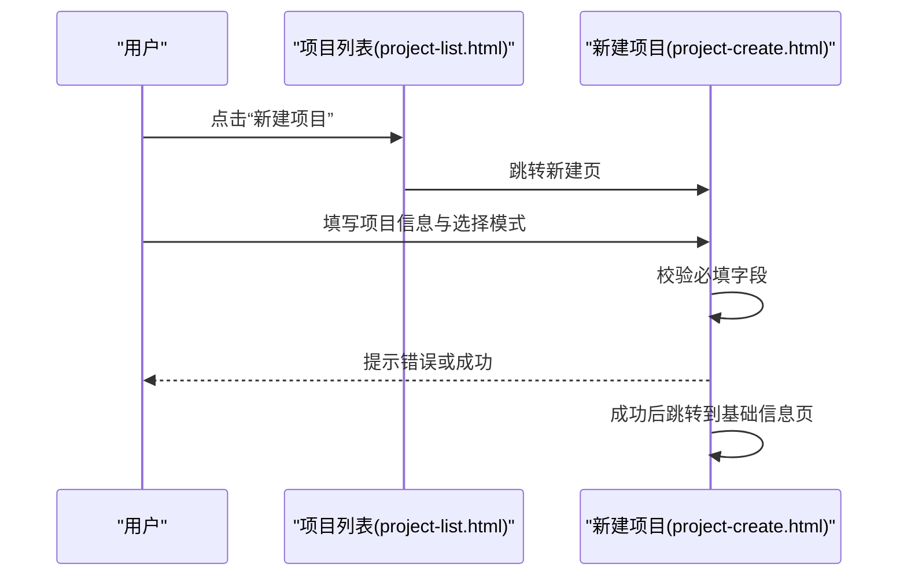
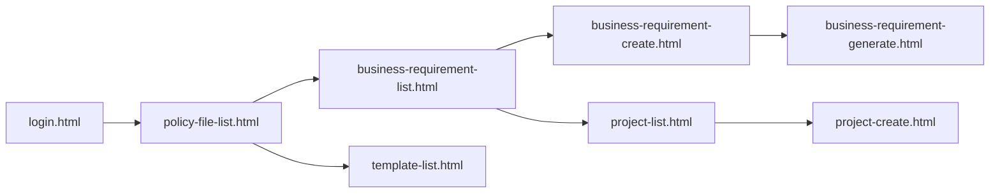

# 快速开始

<cite>
**本文引用的文件**
- [pages/login.html](file://pages/login.html)
- [pages/business-requirement-list.html](file://pages/business-requirement-list.html)
- [pages/business-requirement-create.html](file://pages/business-requirement-create.html)
- [pages/business-requirement-generate.html](file://pages/business-requirement-generate.html)
- [pages/project-list.html](file://pages/project-list.html)
- [pages/project-create.html](file://pages/project-create.html)
- [pages/policy-file-list.html](file://pages/policy-file-list.html)
- [pages/template-list.html](file://pages/template-list.html)
- [2026-04-10-招标文件AI编制会议纪要.md](file://2026-04-10-招标文件AI编制会议纪要.md)
</cite>

## 目录
1. [简介](#简介)
2. [项目结构](#项目结构)
3. [核心组件](#核心组件)
4. [架构总览](#架构总览)
5. [详细组件分析](#详细组件分析)
6. [依赖关系分析](#依赖关系分析)
7. [性能考虑](#性能考虑)
8. [故障排查指南](#故障排查指南)
9. [结论](#结论)
10. [附录](#附录)

## 简介
本指南面向首次接触“招标文件AI编制系统”的用户，帮助你在本地快速运行并完成从登录到业务需求创建、再到项目管理的完整操作路径。系统为纯前端静态页面，无需服务器即可直接打开HTML文件运行。

## 项目结构
系统采用纯前端静态页面组织，主要页面集中在 pages 目录，包含登录页、业务需求管理、项目管理、模板管理、政策文件管理等模块。根目录下的会议纪要文档提供了系统功能定位与设计要点，便于理解各页面职责与工作流。

图示来源
- [pages/login.html](file://pages/login.html)
- [pages/business-requirement-list.html](file://pages/business-requirement-list.html)
- [pages/business-requirement-create.html](file://pages/business-requirement-create.html)
- [pages/business-requirement-generate.html](file://pages/business-requirement-generate.html)
- [pages/project-list.html](file://pages/project-list.html)
- [pages/project-create.html](file://pages/project-create.html)
- [pages/policy-file-list.html](file://pages/policy-file-list.html)
- [pages/template-list.html](file://pages/template-list.html)

章节来源
- [pages/login.html](file://pages/login.html)
- [pages/business-requirement-list.html](file://pages/business-requirement-list.html)
- [pages/business-requirement-create.html](file://pages/business-requirement-create.html)
- [pages/business-requirement-generate.html](file://pages/business-requirement-generate.html)
- [pages/project-list.html](file://pages/project-list.html)
- [pages/project-create.html](file://pages/project-create.html)
- [pages/policy-file-list.html](file://pages/policy-file-list.html)
- [pages/template-list.html](file://pages/template-list.html)
- [2026-04-10-招标文件AI编制会议纪要.md](file://2026-04-10-招标文件AI编制会议纪要.md)

## 核心组件
- 登录与认证
  - 手机号+验证码登录，支持主题切换，登录后进入政策文件管理页。
- 业务需求管理
  - 列表筛选与分页、新建业务需求、AI生成与编辑、导出与保存。
- 项目管理
  - 列表筛选与分页、新建项目、编辑与删除、进度条与状态标签。
- 模板管理
  - 模板列表、筛选、新建/导入/导出、启用/禁用、预览与编辑。
- 政策文件管理
  - 文件列表、分类、上传、状态与操作按钮。
- AI助手与生成流程
  - 在业务需求生成页集成侧边AI助手，支持文本选择与优化建议。

章节来源
- [pages/login.html](file://pages/login.html)
- [pages/business-requirement-list.html](file://pages/business-requirement-list.html)
- [pages/business-requirement-create.html](file://pages/business-requirement-create.html)
- [pages/business-requirement-generate.html](file://pages/business-requirement-generate.html)
- [pages/project-list.html](file://pages/project-list.html)
- [pages/project-create.html](file://pages/project-create.html)
- [pages/policy-file-list.html](file://pages/policy-file-list.html)
- [pages/template-list.html](file://pages/template-list.html)

## 架构总览
系统为纯前端应用，页面之间通过相对链接跳转，无后端依赖。登录成功后默认进入政策文件管理页，随后可按需访问业务需求与项目管理模块。

图示来源
- [pages/login.html](file://pages/login.html)
- [pages/policy-file-list.html](file://pages/policy-file-list.html)
- [pages/business-requirement-list.html](file://pages/business-requirement-list.html)
- [pages/business-requirement-create.html](file://pages/business-requirement-create.html)
- [pages/business-requirement-generate.html](file://pages/business-requirement-generate.html)
- [pages/project-list.html](file://pages/project-list.html)
- [pages/project-create.html](file://pages/project-create.html)
- [pages/template-list.html](file://pages/template-list.html)

## 详细组件分析

### 登录与认证
- 功能要点
  - 手机号输入校验、验证码发送倒计时、登录表单验证、主题切换。
  - 登录成功后跳转至政策文件管理页。
- 使用建议
  - 测试环境验证码为固定值，便于快速体验。
  - 如需夜间模式，可点击右下角“切换主题”。

图示来源
- [pages/login.html](file://pages/login.html)
- [pages/policy-file-list.html](file://pages/policy-file-list.html)

章节来源
- [pages/login.html](file://pages/login.html)

### 业务需求管理
- 列表页
  - 支持按项目名称、需求状态、项目类型、创建时间筛选；分页导航；状态标签与进度条。
- 新建业务需求
  - 填写需求名称、项目类别、项目类型、预算、需求描述等字段；支持必填校验与提示。
- 业务需求生成
  - 展示生成进度、内容区、AI助手侧边栏、保存/编辑/导出操作；支持引用或系统生成两种模式。

图示来源
- [pages/business-requirement-list.html](file://pages/business-requirement-list.html)
- [pages/business-requirement-create.html](file://pages/business-requirement-create.html)
- [pages/business-requirement-generate.html](file://pages/business-requirement-generate.html)

章节来源
- [pages/business-requirement-list.html](file://pages/business-requirement-list.html)
- [pages/business-requirement-create.html](file://pages/business-requirement-create.html)
- [pages/business-requirement-generate.html](file://pages/business-requirement-generate.html)

### 项目管理
- 列表页
  - 支持按项目编号/名称、状态、类别、类型、创建时间筛选；分页导航；状态标签与进度条；批量操作按钮。
- 新建项目
  - 填写项目名称、类别、类型、预算、评审类型；选择招标需求模式（引用/生成）；保存后跳转到基础信息输入页。

图示来源
- [pages/project-list.html](file://pages/project-list.html)
- [pages/project-create.html](file://pages/project-create.html)

章节来源
- [pages/project-list.html](file://pages/project-list.html)
- [pages/project-create.html](file://pages/project-create.html)

### 模板管理
- 功能要点
  - 模板列表、按类别/类型/状态筛选；支持新建、导入、导出；启用/禁用、预览与编辑。
- 使用建议
  - 默认模板适用于常见项目类型；可根据需要启用/禁用模板或新建自定义模板。

章节来源
- [pages/template-list.html](file://pages/template-list.html)

### 政策文件管理
- 功能要点
  - 政策文件列表、按分类筛选；支持上传文件、状态管理与操作按钮；分页导航。
- 使用建议
  - 上传的政策文件将作为业务需求生成的知识来源之一，有助于AI生成更贴合实际的业务需求。

章节来源
- [pages/policy-file-list.html](file://pages/policy-file-list.html)

## 依赖关系分析
- 页面间依赖
  - 登录页 → 政策文件管理页 → 业务需求/项目管理/模板管理页。
  - 业务需求列表 → 新建业务需求 → 业务需求生成。
  - 项目列表 → 新建项目。
- 外部依赖
  - 系统为纯前端，无后端依赖；AI生成与检测能力在页面中以模拟/占位形式呈现，实际对接需后续完善。

图示来源
- [pages/login.html](file://pages/login.html)
- [pages/policy-file-list.html](file://pages/policy-file-list.html)
- [pages/business-requirement-list.html](file://pages/business-requirement-list.html)
- [pages/business-requirement-create.html](file://pages/business-requirement-create.html)
- [pages/business-requirement-generate.html](file://pages/business-requirement-generate.html)
- [pages/project-list.html](file://pages/project-list.html)
- [pages/project-create.html](file://pages/project-create.html)
- [pages/template-list.html](file://pages/template-list.html)

章节来源
- [pages/login.html](file://pages/login.html)
- [pages/policy-file-list.html](file://pages/policy-file-list.html)
- [pages/business-requirement-list.html](file://pages/business-requirement-list.html)
- [pages/business-requirement-create.html](file://pages/business-requirement-create.html)
- [pages/business-requirement-generate.html](file://pages/business-requirement-generate.html)
- [pages/project-list.html](file://pages/project-list.html)
- [pages/project-create.html](file://pages/project-create.html)
- [pages/template-list.html](file://pages/template-list.html)

## 性能考虑
- 纯前端优势
  - 无需服务器部署，直接打开HTML即可使用，加载速度快、部署简单。
- 交互优化
  - 表单校验与提示即时反馈，减少无效提交；分页与筛选降低大数据量下的渲染压力。
- 建议
  - 首次使用建议使用现代浏览器（Chrome/Firefox/Edge），以获得最佳兼容性与交互体验。

## 故障排查指南
- 登录失败
  - 检查手机号格式是否正确；验证码输入是否为6位；测试环境验证码固定为指定值。
- 页面空白或资源加载失败
  - 确认所有HTML文件在同一目录下，且未被安全策略阻止本地文件访问。
- 表单无法提交
  - 检查必填字段是否填写完整；部分页面的保存逻辑为模拟，不会产生真实数据持久化。
- AI生成/检测功能无响应
  - 当前页面为演示形态，相关功能为占位；请关注后续版本的实际对接。

章节来源
- [pages/login.html](file://pages/login.html)
- [pages/business-requirement-create.html](file://pages/business-requirement-create.html)
- [pages/business-requirement-generate.html](file://pages/business-requirement-generate.html)
- [pages/project-create.html](file://pages/project-create.html)

## 结论
本系统以纯前端方式提供完整的业务需求与项目管理体验，配合政策文件与模板管理，形成从信息录入到AI生成、编辑与导出的闭环。建议新用户先完成登录，再依次体验政策文件管理、业务需求创建与项目管理，逐步熟悉各模块的功能与操作流程。

## 附录

### 环境要求与运行方式
- 浏览器兼容性
  - 推荐使用最新版 Chrome/Firefox/Edge；确保JavaScript与本地文件访问权限正常。
- 运行方式
  - 将仓库克隆到本地，双击任一HTML文件即可在浏览器中打开；无需安装服务器或数据库。
- 网络要求
  - 纯前端应用，无需联网即可使用；AI生成与检测功能为演示形态，实际对接需后续完善。

章节来源
- [pages/login.html](file://pages/login.html)
- [2026-04-10-招标文件AI编制会议纪要.md](file://2026-04-10-招标文件AI编制会议纪要.md)