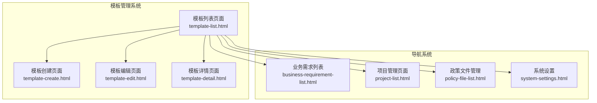
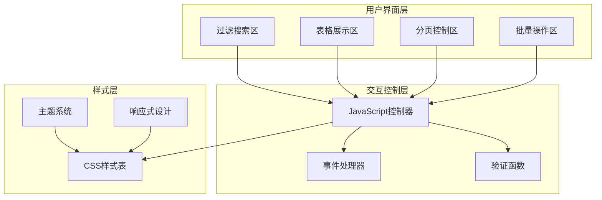
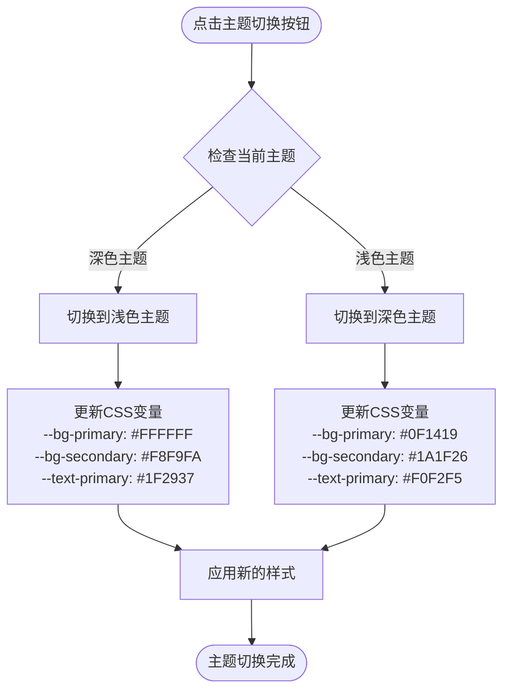
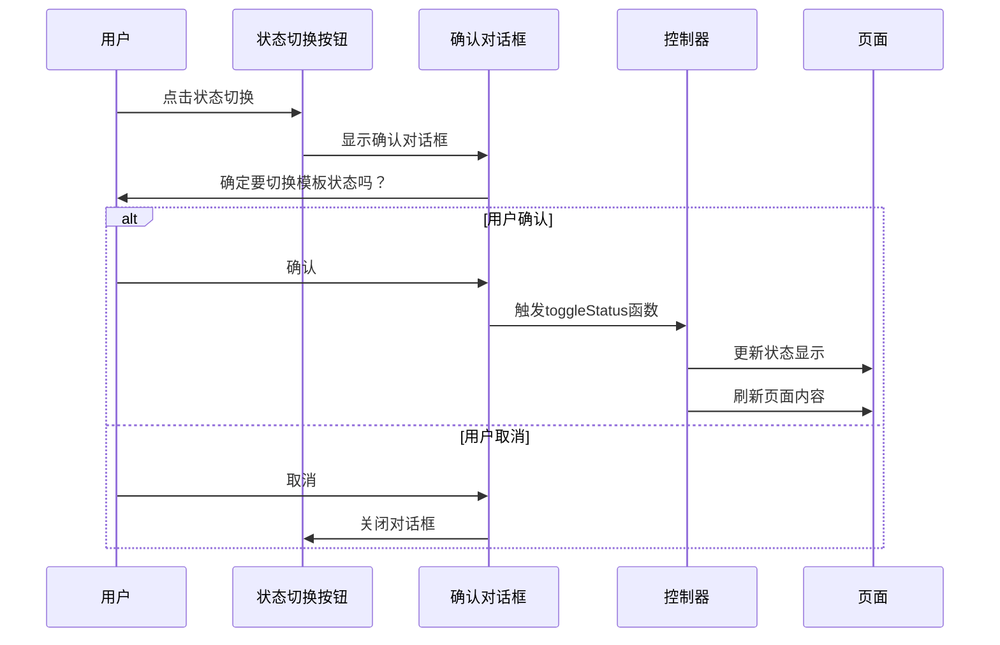
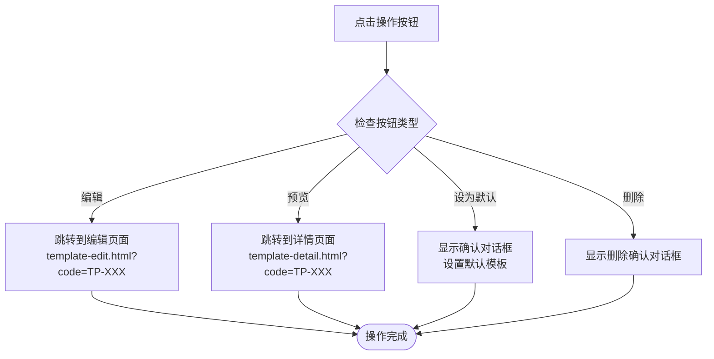
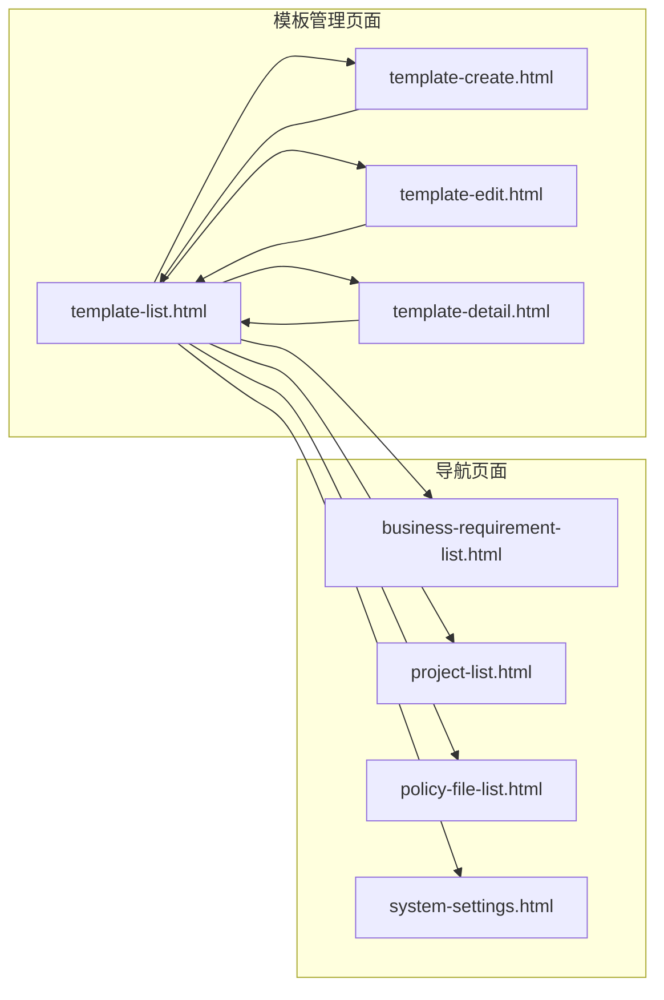

# 模板列表

<cite>
**本文档引用的文件**
- [template-list.html](file://pages/template-list.html)
- [template-create.html](file://pages/template-create.html)
- [template-edit.html](file://pages/template-edit.html)
- [template-detail.html](file://pages/template-detail.html)
</cite>

## 目录
1. [简介](#简介)
2. [项目结构](#项目结构)
3. [核心组件](#核心组件)
4. [架构概览](#架构概览)
5. [详细组件分析](#详细组件分析)
6. [依赖关系分析](#依赖关系分析)
7. [性能考虑](#性能考虑)
8. [故障排除指南](#故障排除指南)
9. [结论](#结论)

## 简介

模板列表页面是招标文件AI编制系统中的核心管理界面，负责展示和管理所有可用的招标文件模板。该页面实现了完整的模板生命周期管理功能，包括模板的查询、筛选、状态管理、版本控制等核心业务逻辑。页面采用现代化的响应式设计，支持深色/浅色主题切换，为用户提供优质的视觉体验和操作便利性。

## 项目结构

模板列表页面作为系统的重要组成部分，与其他页面形成了完整的功能体系：

**图表来源**
- [template-list.html:1-974](file://pages/template-list.html#L1-L974)
- [template-create.html:1-867](file://pages/template-create.html#L1-L867)
- [template-edit.html:1-870](file://pages/template-edit.html#L1-L870)
- [template-detail.html:1-412](file://pages/template-detail.html#L1-L412)

**章节来源**
- [template-list.html:1-974](file://pages/template-list.html#L1-L974)

## 核心组件

### 数据表格组件

模板列表的核心是一个高度定制化的数据表格，包含以下关键特性：

#### 表格列定义
- **序号**: 显示模板在列表中的排序编号
- **模板名称**: 可点击的链接，支持模板预览和查看详情
- **模板编码**: 唯一标识符，用于模板识别和操作
- **适用项目类别**: 展示模板适用的项目分类（限额以下、产权交易、政府采购）
- **适用项目类型**: 展示模板适用的项目类型（工程类、货物类、服务类）
- **版本**: 显示模板当前版本号
- **状态**: 实时显示模板启用/禁用状态
- **创建时间**: 显示模板创建的具体时间
- **创建人**: 显示模板的创建者信息
- **操作**: 提供编辑、预览、状态切换等操作按钮

#### 状态徽章系统
页面实现了完整的状态管理机制：
- **启用状态**: 使用绿色背景和成功色文字
- **禁用状态**: 使用灰色背景和中性色文字
- **默认模板**: 特殊的默认徽章标识

#### 类型徽章系统
针对不同项目类型的可视化标识：
- **工程类**: 蓝色主题配色
- **货物类**: 绿色主题配色  
- **服务类**: 橙色主题配色

**章节来源**
- [template-list.html:681-881](file://pages/template-list.html#L681-L881)
- [template-list.html:436-486](file://pages/template-list.html#L436-L486)

### 过滤和搜索系统

页面提供了多维度的模板搜索和筛选功能：

#### 搜索条件
- **模板名称/编码**: 支持模糊匹配的文本搜索
- **项目类别**: 下拉选择框，支持限额以下、产权交易、政府采购
- **项目类型**: 下拉选择框，支持工程类、货物类、服务类
- **模板状态**: 下拉选择框，支持启用、禁用

#### 操作按钮
- **查询**: 执行当前筛选条件的搜索
- **重置**: 清空所有筛选条件

**章节来源**
- [template-list.html:604-649](file://pages/template-list.html#L604-L649)
- [template-list.html:896-912](file://pages/template-list.html#L896-L912)

### 分页系统

页面实现了完整的分页功能：
- **分页信息**: 显示总记录数和当前页码
- **导航控件**: 支持上一页、下一页的页面跳转
- **页码显示**: 动态显示可点击的页码按钮

**章节来源**
- [template-list.html:883-890](file://pages/template-list.html#L883-L890)

## 架构概览

模板列表页面采用了模块化的设计架构，各组件之间通过清晰的接口进行交互：

**图表来源**
- [template-list.html:896-971](file://pages/template-list.html#L896-L971)

## 详细组件分析

### 主题切换系统

页面实现了完整的深色/浅色主题切换功能：

#### 主题变量系统
- **品牌色彩**: 主色调（蓝色系）
- **辅助色彩**: 次要强调色（青色系）
- **装饰色彩**: 强调色（橙色系）
- **背景层次**: 多级背景色（主背景、次背景、三级背景）
- **文本色彩**: 多级文本色（主要、次要、三级）
- **边框色彩**: 不同透明度的边框色
- **悬停状态**: 高亮效果的悬停状态

#### 主题切换逻辑

**图表来源**
- [template-list.html:953-970](file://pages/template-list.html#L953-L970)

**章节来源**
- [template-list.html:10-51](file://pages/template-list.html#L10-L51)
- [template-list.html:953-970](file://pages/template-list.html#L953-L970)

### 模板状态管理

页面实现了完整的模板状态切换机制：

#### 状态切换流程

**图表来源**
- [template-list.html:940-945](file://pages/template-list.html#L940-L945)

**章节来源**
- [template-list.html:940-945](file://pages/template-list.html#L940-L945)

### 模板操作入口

页面提供了多种模板操作入口：

#### 操作按钮功能
- **编辑按钮**: 跳转到模板编辑页面，支持模板修改
- **预览按钮**: 跳转到模板详情页面，支持模板预览
- **设为默认**: 将模板设置为默认模板
- **删除按钮**: 删除模板（需要确认）

#### 操作流程

**图表来源**
- [template-list.html:926-951](file://pages/template-list.html#L926-L951)

**章节来源**
- [template-list.html:926-951](file://pages/template-list.html#L926-L951)

### 响应式设计实现

页面采用了完整的响应式设计方案：

#### 布局系统
- **固定侧边栏**: 220px宽度的固定导航栏
- **自适应主内容区**: 占据剩余空间的主内容区域
- **弹性网格系统**: 基于Flexbox的弹性布局

#### 媒体查询策略
虽然具体的媒体查询代码未在当前文件中显示，但页面结构支持：
- 移动端适配（屏幕宽度小于768px）
- 平板端适配（屏幕宽度768px-1024px）
- 桌面端适配（屏幕宽度大于1024px）

**章节来源**
- [template-list.html:61-103](file://pages/template-list.html#L61-L103)

## 依赖关系分析

模板列表页面与其他页面存在明确的依赖关系：

**图表来源**
- [template-list.html:1-974](file://pages/template-list.html#L1-L974)
- [template-create.html:1-867](file://pages/template-create.html#L1-L867)
- [template-edit.html:1-870](file://pages/template-edit.html#L1-L870)
- [template-detail.html:1-412](file://pages/template-detail.html#L1-L412)

**章节来源**
- [template-list.html:566-575](file://pages/template-list.html#L566-L575)

## 性能考虑

### 加载优化
- **内联样式**: 关键样式直接内联在HTML中，减少HTTP请求
- **懒加载**: 非关键资源延迟加载
- **缓存策略**: 合理利用浏览器缓存

### 交互优化
- **事件委托**: 使用事件委托减少事件监听器数量
- **防抖处理**: 对频繁触发的操作进行防抖处理
- **虚拟滚动**: 大数据量时考虑虚拟滚动技术

### 响应式优化
- **图片优化**: 使用适当的图片格式和尺寸
- **字体优化**: 使用系统字体栈，减少字体加载时间
- **CSS优化**: 压缩和合并CSS文件

## 故障排除指南

### 常见问题及解决方案

#### 主题切换失效
**问题描述**: 点击主题切换按钮无反应
**可能原因**:
- CSS变量未正确更新
- JavaScript执行错误
- 浏览器兼容性问题

**解决方法**:
1. 检查浏览器控制台是否有JavaScript错误
2. 验证CSS变量是否正确设置
3. 确认浏览器支持CSS自定义属性

#### 模板状态切换异常
**问题描述**: 点击状态切换按钮后页面不刷新
**可能原因**:
- AJAX请求失败
- 页面刷新逻辑错误
- 服务器响应异常

**解决方法**:
1. 检查网络请求状态
2. 验证服务器响应数据
3. 确认页面刷新逻辑

#### 搜索功能异常
**问题描述**: 输入搜索条件后无结果
**可能原因**:
- 搜索参数传递错误
- 数据库查询异常
- 前端过滤逻辑错误

**解决方法**:
1. 检查搜索参数格式
2. 验证数据库连接
3. 确认前端过滤逻辑

**章节来源**
- [template-list.html:896-971](file://pages/template-list.html#L896-L971)

## 结论

模板列表页面作为招标文件AI编制系统的核心管理界面，展现了现代Web应用的最佳实践。页面不仅实现了完整的模板管理功能，还提供了优秀的用户体验和视觉设计。

### 主要优势
- **功能完整**: 涵盖模板管理的所有核心功能
- **用户体验优秀**: 响应式设计和主题切换提升使用体验
- **代码结构清晰**: 模块化设计便于维护和扩展
- **视觉设计专业**: 完整的主题系统和徽章标识

### 技术亮点
- **完整的状态管理**: 支持模板的全生命周期管理
- **灵活的搜索过滤**: 多维度的筛选和搜索功能
- **响应式布局**: 适配多种设备和屏幕尺寸
- **主题系统**: 深色/浅色主题自由切换

### 改进建议
- 实现真正的数据持久化存储
- 添加模板导入导出功能
- 优化大数据量下的性能表现
- 增强错误处理和用户反馈机制

该页面为整个系统的模板管理提供了坚实的基础，为后续的功能扩展和优化奠定了良好的技术基础。