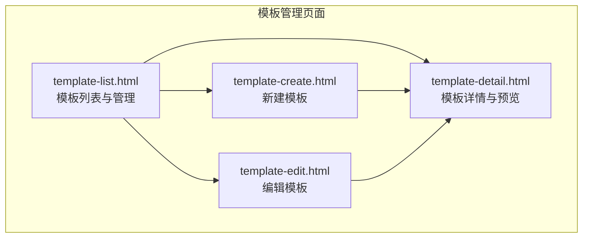
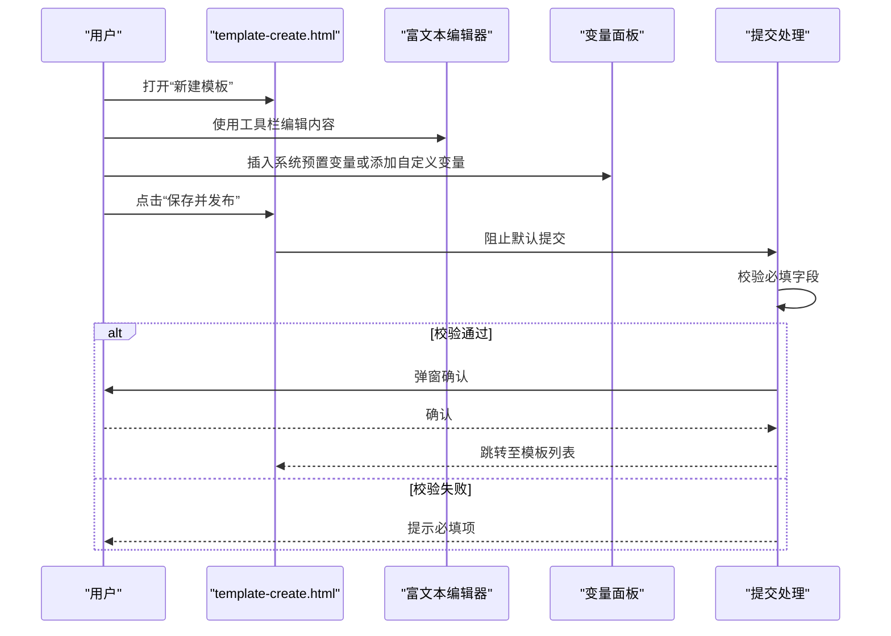
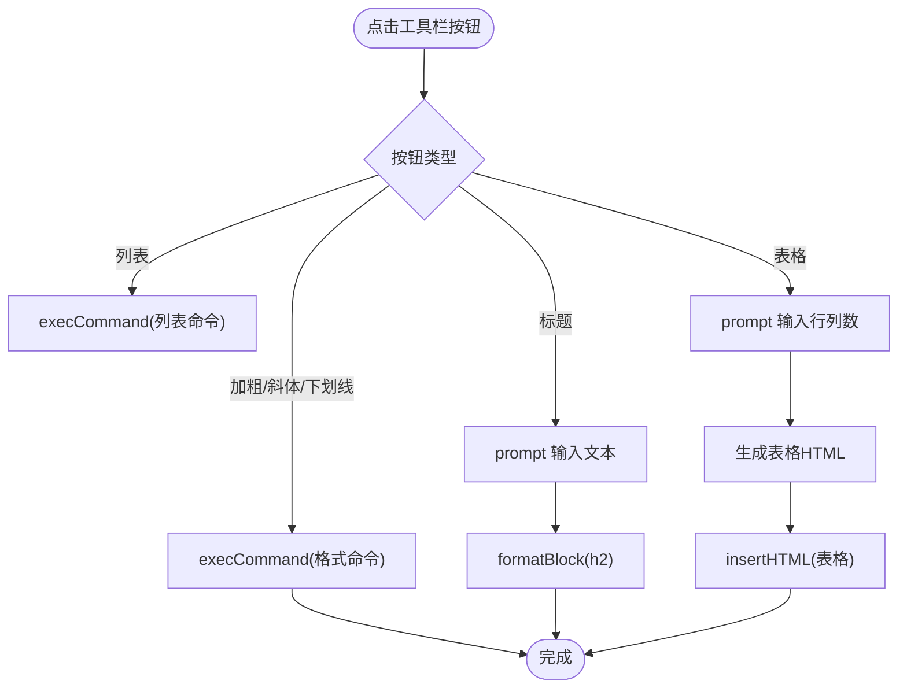
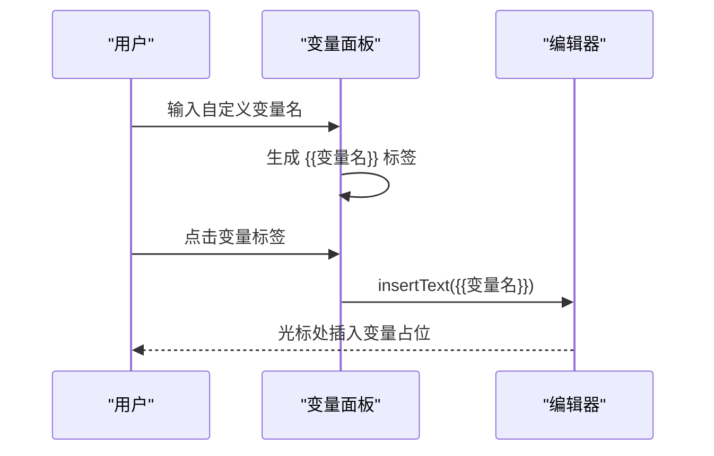
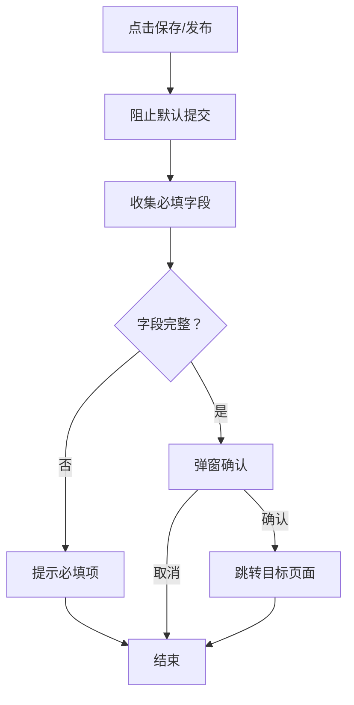
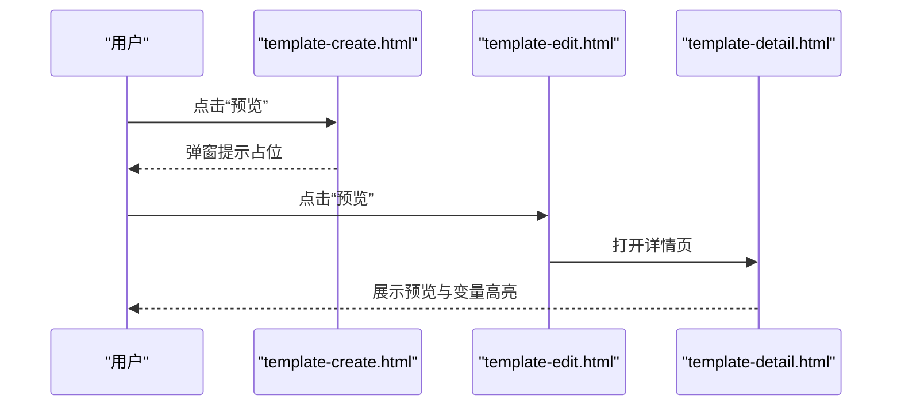
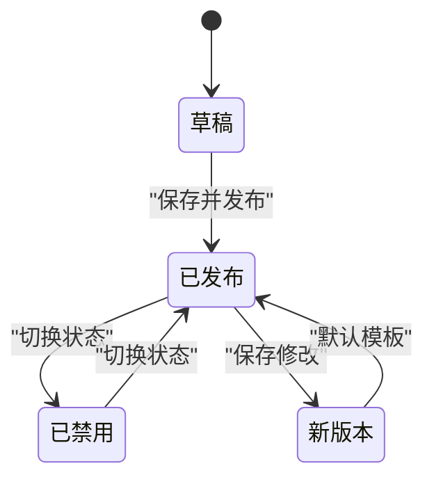
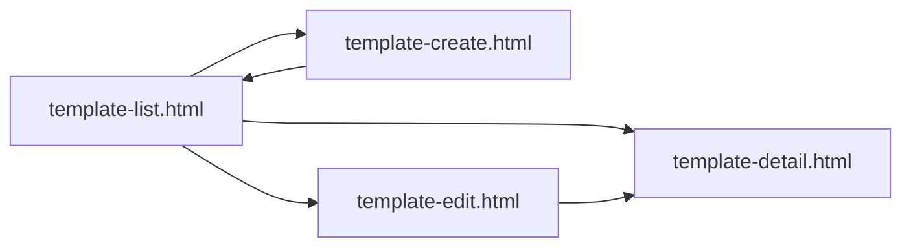

# 模板创建

<cite>
**本文引用的文件**
- [template-create.html](file://pages/template-create.html)
- [template-edit.html](file://pages/template-edit.html)
- [template-detail.html](file://pages/template-detail.html)
- [template-list.html](file://pages/template-list.html)
</cite>

## 目录
1. [简介](#简介)
2. [项目结构](#项目结构)
3. [核心组件](#核心组件)
4. [架构总览](#架构总览)
5. [详细组件分析](#详细组件分析)
6. [依赖关系分析](#依赖关系分析)
7. [性能考量](#性能考量)
8. [故障排查指南](#故障排查指南)
9. [结论](#结论)
10. [附录](#附录)

## 简介
本文件面向“模板创建”页面，系统性梳理模板从创建、编辑、预览到发布的全流程设计与实现要点，覆盖以下方面：
- 模板基本信息录入：模板名称、模板编码、适用项目类别、适用项目类型、模板状态、模板描述
- 模板内容编辑：基于富文本编辑器的可视化编辑、变量插入、表格与标题插入
- 模板变量管理：系统预置变量与自定义变量的展示与插入
- 表单验证与提交流程：必填项校验、确认对话框、保存与发布
- 版本控制与发布机制：版本号、版本历史、状态切换、默认模板设置
- 用户体验与最佳实践：主题切换、交互反馈、错误处理建议

## 项目结构
模板相关页面位于 pages 目录，采用纯前端静态页面实现，无外部依赖，便于部署与维护。

图表来源
- [template-list.html:651-891](file://pages/template-list.html#L651-L891)
- [template-create.html:536-757](file://pages/template-create.html#L536-L757)
- [template-edit.html:550-766](file://pages/template-edit.html#L550-L766)
- [template-detail.html:646-847](file://pages/template-detail.html#L646-L847)

章节来源
- [template-list.html:1-974](file://pages/template-list.html#L1-L974)
- [template-create.html:1-868](file://pages/template-create.html#L1-L868)
- [template-edit.html:1-871](file://pages/template-edit.html#L1-L871)
- [template-detail.html:1-899](file://pages/template-detail.html#L1-L899)

## 核心组件
- 基本信息表单区：模板名称、模板编码、适用项目类别、适用项目类型、模板状态、模板描述
- 模板内容编辑区：富文本编辑器容器、工具栏按钮（加粗、斜体、下划线、列表、标题、表格）
- 变量管理区：系统预置变量列表、自定义变量输入与展示
- 表单动作区：返回列表、保存草稿、预览、保存并发布（或保存修改）

章节来源
- [template-create.html:536-757](file://pages/template-create.html#L536-L757)
- [template-edit.html:550-766](file://pages/template-edit.html#L550-L766)

## 架构总览
模板创建页面采用“页面内脚本 + 内联样式”的单页应用模式，通过事件监听与 DOM 操作完成表单交互、富文本编辑与变量插入。提交流程通过表单事件阻止默认行为，执行本地校验与确认逻辑，最终跳转至模板列表或详情页。

图表来源
- [template-create.html:763-845](file://pages/template-create.html#L763-L845)

章节来源
- [template-create.html:763-845](file://pages/template-create.html#L763-L845)

## 详细组件分析

### 组件一：模板基本信息录入
- 字段说明
  - 模板名称：必填
  - 模板编码：必填（创建时可输入；编辑时禁用）
  - 适用项目类别：必选项（限额以下、产权交易、政府采购）
  - 适用项目类型：必选项（工程类、货物类、服务类、物业）
  - 模板状态：可选（启用/禁用）
  - 模板描述：可选
- 设计要点
  - 必填项使用 HTML5 required 属性与 JS 校验双重保障
  - 编码字段在编辑页禁用，防止误改
  - 状态与描述字段提供直观选择与多行输入

章节来源
- [template-create.html:539-584](file://pages/template-create.html#L539-L584)
- [template-edit.html:554-587](file://pages/template-edit.html#L554-L587)

### 组件二：模板内容编辑区（富文本编辑器）
- 功能特性
  - 工具栏按钮：加粗、斜体、下划线、无序/有序列表、标题、表格
  - 内容可编辑区域：支持直接编辑与粘贴
  - 表格插入：弹窗输入行列数，动态生成表格 HTML
  - 标题插入：弹窗输入文本，使用 formatBlock 插入 h2
- 实现方式
  - 使用 document.execCommand 进行富文本命令执行
  - 表格与标题通过 prompt 获取参数后以 insertHTML/insertText 注入

图表来源
- [template-create.html:764-791](file://pages/template-create.html#L764-L791)
- [template-edit.html:773-800](file://pages/template-edit.html#L773-L800)

章节来源
- [template-create.html:591-677](file://pages/template-create.html#L591-L677)
- [template-edit.html:594-686](file://pages/template-edit.html#L594-L686)

### 组件三：模板变量管理
- 系统预置变量：项目名称、项目类型、项目预算、资格要求、交易需求、评审项、各章节内容变量等
- 自定义变量：输入变量名，生成带 {{}} 的标签，点击可插入编辑器
- 展示与交互
  - 变量标签点击即插入到编辑器光标位置
  - 自定义变量列表支持重复插入与后续编辑

图表来源
- [template-create.html:799-818](file://pages/template-create.html#L799-L818)
- [template-edit.html:708-730](file://pages/template-edit.html#L708-L730)

章节来源
- [template-create.html:681-721](file://pages/template-create.html#L681-L721)
- [template-edit.html:690-731](file://pages/template-edit.html#L690-L731)

### 组件四：表单验证与提交流程
- 验证规则
  - 创建页：模板名称、模板编码、适用项目类别、适用项目类型为必填
  - 编辑页：模板名称、适用项目类型为必填
- 提交流程
  - 阻止默认提交
  - 校验通过后弹窗确认
  - 确认后跳转至目标页面（列表或详情）

图表来源
- [template-create.html:828-845](file://pages/template-create.html#L828-L845)
- [template-edit.html:833-848](file://pages/template-edit.html#L833-L848)

章节来源
- [template-create.html:828-845](file://pages/template-create.html#L828-L845)
- [template-edit.html:833-848](file://pages/template-edit.html#L833-L848)

### 组件五：模板预览与详情
- 预览功能
  - 创建页：点击“预览”弹窗提示（当前为占位）
  - 编辑页：点击“预览”打开详情页
- 详情页能力
  - 基本信息展示与切换标签页（基本信息、模板预览、变量列表、版本历史）
  - 预览内容高亮显示变量占位
  - 版本历史卡片与对比功能入口

图表来源
- [template-create.html:824-826](file://pages/template-create.html#L824-L826)
- [template-edit.html:829-831](file://pages/template-edit.html#L829-L831)
- [template-detail.html:701-731](file://pages/template-detail.html#L701-L731)

章节来源
- [template-create.html:742-748](file://pages/template-create.html#L742-L748)
- [template-edit.html:751-757](file://pages/template-edit.html#L751-L757)
- [template-detail.html:646-731](file://pages/template-detail.html#L646-L731)

### 组件六：版本控制与发布机制
- 版本号与状态
  - 列表页展示当前版本号（如 v2.0）
  - 支持启用/禁用切换
  - 默认模板标记与设置
- 发布与修改
  - 创建页：保存并发布后跳转列表
  - 编辑页：保存修改后生成新版本（示例：v2.1），跳转详情
- 版本历史
  - 详情页“版本历史”标签页展示历史版本，支持查看与对比

图表来源
- [template-create.html:841-844](file://pages/template-create.html#L841-L844)
- [template-edit.html:844-847](file://pages/template-edit.html#L844-L847)
- [template-detail.html:787-847](file://pages/template-detail.html#L787-L847)

章节来源
- [template-list.html:696-804](file://pages/template-list.html#L696-L804)
- [template-create.html:841-844](file://pages/template-create.html#L841-L844)
- [template-edit.html:844-847](file://pages/template-edit.html#L844-L847)
- [template-detail.html:787-847](file://pages/template-detail.html#L787-L847)

## 依赖关系分析
- 页面间导航
  - 列表页 -> 创建页、编辑页、详情页
  - 创建页 -> 列表页
  - 编辑页 -> 详情页
- 交互依赖
  - 富文本编辑依赖 document.execCommand
  - 变量插入依赖 contenteditable 容器与 insertText/insertHTML
  - 预览依赖详情页路由或窗口打开

图表来源
- [template-list.html:914-932](file://pages/template-list.html#L914-L932)
- [template-create.html](file://pages/template-create.html#L843)
- [template-edit.html](file://pages/template-edit.html#L846)

章节来源
- [template-list.html:914-932](file://pages/template-list.html#L914-L932)
- [template-create.html](file://pages/template-create.html#L843)
- [template-edit.html](file://pages/template-edit.html#L846)

## 性能考量
- 富文本编辑器
  - 使用原生 execCommand，无需额外库，加载轻量
  - 表格生成采用字符串拼接，复杂度 O(r*c)，对中小规模表格友好
- 变量管理
  - 自定义变量列表为 DOM 动态增删，建议避免频繁大列表渲染
- 预览
  - 当前为页面跳转或弹窗提示，无复杂计算
- 建议
  - 对超长模板内容，考虑分段加载或懒渲染
  - 对大量变量标签，可引入虚拟滚动或分页展示

## 故障排查指南
- 表单未提交或报错
  - 检查必填字段是否为空
  - 确认浏览器未禁用 JS 或弹窗拦截
- 富文本编辑无效
  - 确认编辑器容器具备 contenteditable 属性
  - 检查 execCommand 是否被浏览器策略限制
- 变量未插入
  - 确认编辑器已聚焦
  - 检查变量标签的点击事件绑定
- 预览空白或异常
  - 创建页预览为占位提示，需在编辑页进行预览
  - 详情页预览需确保变量占位正确

章节来源
- [template-create.html:828-845](file://pages/template-create.html#L828-L845)
- [template-edit.html:833-848](file://pages/template-edit.html#L833-L848)

## 结论
模板创建页面以简洁的表单与富文本编辑为核心，结合变量管理与版本控制，形成完整的模板生命周期管理闭环。通过本地校验与确认流程，保证关键操作的安全性；通过主题切换与标签高亮提升用户体验。建议在后续迭代中引入更完善的富文本编辑器与版本对比工具，进一步增强可维护性与协作效率。

## 附录
- 最佳实践
  - 在创建模板时，先规划章节结构与变量清单，减少后期修改成本
  - 使用“保存草稿”按钮定期保存进度，避免意外丢失
  - 对重要模板启用“默认模板”，统一项目模板口径
- 常见错误
  - 忘记填写必填项导致提交失败
  - 变量名未加 {{}} 导致集成时无法替换
  - 表格行列数输入非数字导致插入失败
- 用户体验优化建议
  - 增强富文本编辑器的撤销/重做能力
  - 提供 Markdown 语法高亮与实时预览（可在现有基础上扩展）
  - 增加模板导入/导出功能，便于复用与迁移