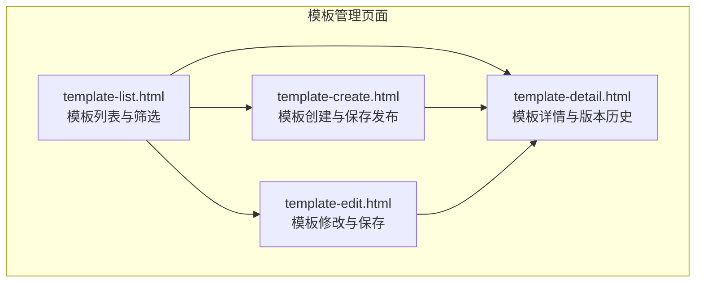
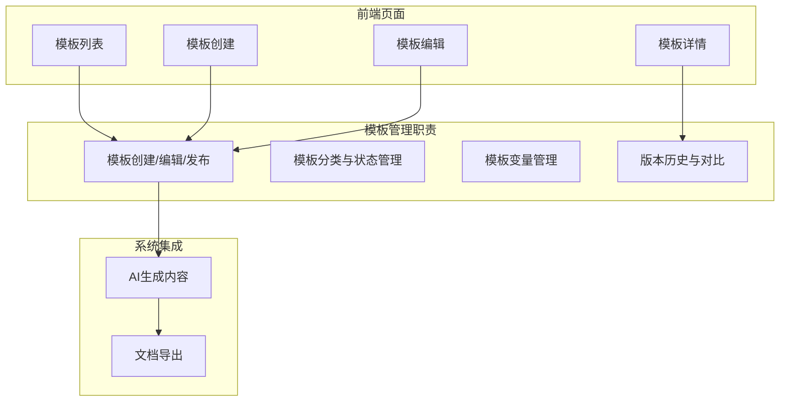
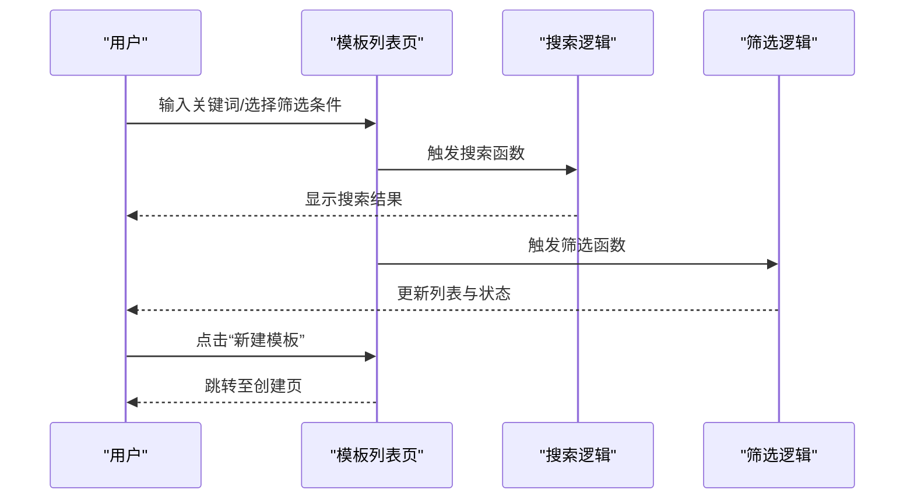
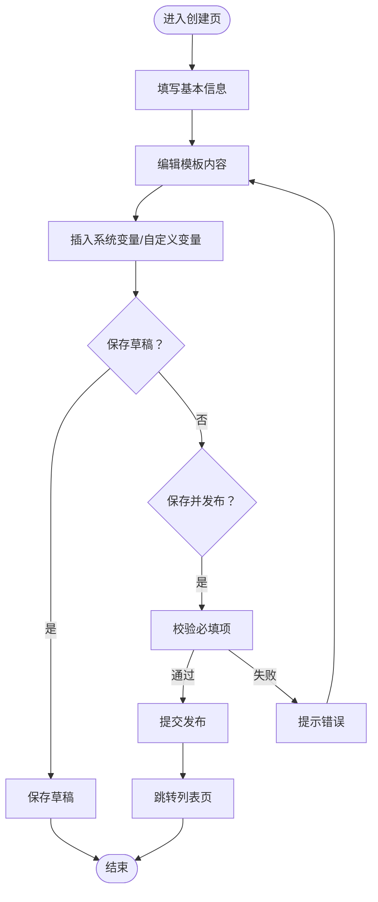
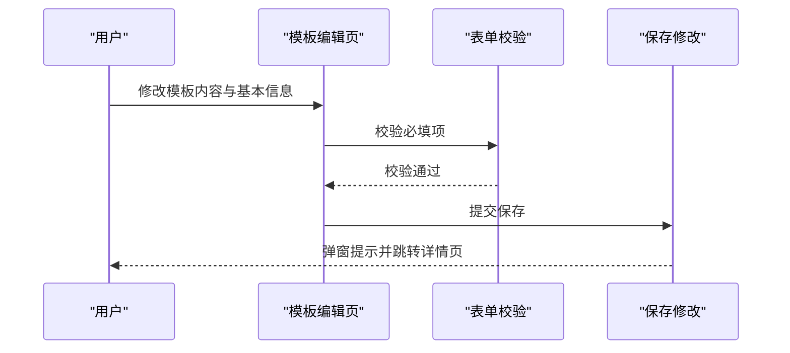
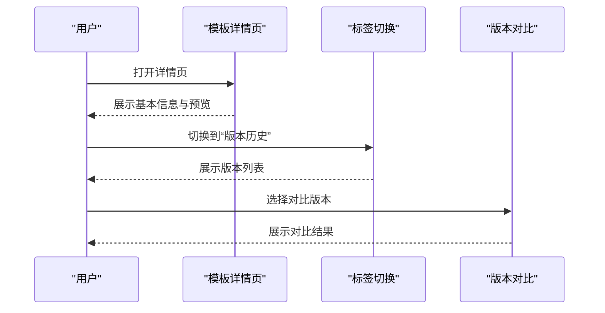
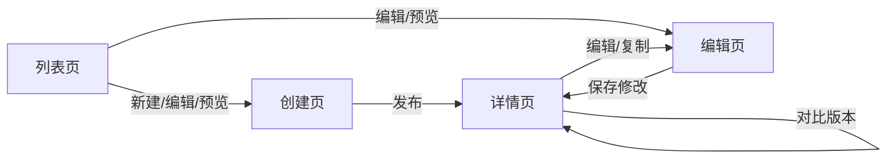

# 模板管理

<cite>
**本文引用的文件**
- [template-list.html](file://pages/template-list.html)
- [template-create.html](file://pages/template-create.html)
- [template-edit.html](file://pages/template-edit.html)
- [template-detail.html](file://pages/template-detail.html)
- [2026-04-10-招标文件AI编制会议纪要.md](file://2026-04-10-招标文件AI编制会议纪要.md)
- [2026-04-10-AI编制系统架构改造方案.md](file://2026-04-10-AI编制系统架构改造方案.md)
</cite>

## 目录
1. [简介](#简介)
2. [项目结构](#项目结构)
3. [核心组件](#核心组件)
4. [架构总览](#架构总览)
5. [详细组件分析](#详细组件分析)
6. [依赖关系分析](#依赖关系分析)
7. [性能考量](#性能考量)
8. [故障排查指南](#故障排查指南)
9. [结论](#结论)
10. [附录](#附录)

## 简介
本文件面向“模板管理系统”的前端页面与交互流程，基于仓库中的模板相关页面进行技术文档梳理，覆盖模板的创建、编辑、发布、版本管理与详情展示等全流程。文档同时结合会议纪要与架构改造方案，明确模板系统在整体AI编制系统中的定位与职责边界，给出模板格式规范、Markdown语法支持、分类体系与版本策略建议，并提供最佳实践与常见问题解决方案。

## 项目结构
模板管理相关页面位于 pages 目录下，包含：
- 模板列表页：template-list.html
- 模板创建页：template-create.html
- 模板编辑页：template-edit.html
- 模板详情页：template-detail.html

图表来源
- [template-list.html:1-974](file://pages/template-list.html#L1-L974)
- [template-create.html:1-868](file://pages/template-create.html#L1-L868)
- [template-edit.html:1-871](file://pages/template-edit.html#L1-L871)
- [template-detail.html:1-899](file://pages/template-detail.html#L1-L899)

章节来源
- [template-list.html:1-974](file://pages/template-list.html#L1-L974)
- [template-create.html:1-868](file://pages/template-create.html#L1-L868)
- [template-edit.html:1-871](file://pages/template-edit.html#L1-L871)
- [template-detail.html:1-899](file://pages/template-detail.html#L1-L899)

## 核心组件
- 模板列表页：提供模板筛选、分页、状态管理、导入导出、默认模板设置与状态切换等操作入口。
- 模板创建页：提供基本信息填写、富文本编辑器、变量插入与自定义变量管理、草稿保存与发布提交。
- 模板编辑页：提供模板内容修改、变量管理、预览与保存修改。
- 模板详情页：提供模板基本信息、内容预览、变量列表、版本历史与对比、复制模板与编辑入口。

章节来源
- [template-list.html:604-974](file://pages/template-list.html#L604-L974)
- [template-create.html:535-868](file://pages/template-create.html#L535-L868)
- [template-edit.html:550-871](file://pages/template-edit.html#L550-L871)
- [template-detail.html:586-899](file://pages/template-detail.html#L586-L899)

## 架构总览
模板管理在整体系统中的定位与职责：
- 作为“管理端”模块之一，负责模板的生命周期管理（创建、编辑、发布、版本控制、状态管理）。
- 与“业务需求生成”“AI生成”“智能检测”“文档导出”等模块协同工作，模板是“模板+AI填充内容→Markdown→Word”的关键输入。
- 优先采用Markdown模板方案，兼顾灵活性与可维护性；模板由系统统一管理，支持多类别（如产权交易、政府采购）差异化适配。

图表来源
- [2026-04-10-招标文件AI编制会议纪要.md:16-18](file://2026-04-10-招标文件AI编制会议纪要.md#L16-L18)
- [2026-04-10-AI编制系统架构改造方案.md:66-76](file://2026-04-10-AI编制系统架构改造方案.md#L66-L76)

章节来源
- [2026-04-10-招标文件AI编制会议纪要.md:1-29](file://2026-04-10-招标文件AI编制会议纪要.md#L1-L29)
- [2026-04-10-AI编制系统架构改造方案.md:1-140](file://2026-04-10-AI编制系统架构改造方案.md#L1-L140)

## 详细组件分析

### 模板列表页（template-list.html）
- 展示逻辑：模板列表按序号、名称、编码、适用项目类别、适用项目类型、版本、状态、创建时间、创建人等字段呈现；支持“默认”“启用/禁用”等状态标识。
- 分类与搜索：提供关键词搜索、项目类别过滤、项目类型过滤、状态过滤；支持重置筛选条件。
- 操作按钮：新建模板、导入、导出；对每条记录提供编辑、预览、禁用/启用等操作。
- 分页与主题切换：支持分页信息与翻页控件；支持深浅主题切换。

图表来源
- [template-list.html:900-974](file://pages/template-list.html#L900-L974)

章节来源
- [template-list.html:604-974](file://pages/template-list.html#L604-L974)

### 模板创建页（template-create.html）
- 基本信息：模板名称、模板编码、适用项目类别、适用项目类型、模板状态、模板描述。
- 内容编辑：富文本编辑器，支持加粗、斜体、下划线、无序/有序列表、标题、表格插入；支持变量插入与自定义变量添加。
- 提交流程：表单校验必填项；保存草稿、预览、保存并发布三种提交路径；发布成功后跳转至列表页。

图表来源
- [template-create.html:828-845](file://pages/template-create.html#L828-L845)

章节来源
- [template-create.html:535-868](file://pages/template-create.html#L535-L868)

### 模板编辑页（template-edit.html）
- 基本信息：模板名称、模板编码（禁用）、适用项目类型、模板状态、模板描述。
- 内容编辑：富文本编辑器，支持格式化、插入标题/表格、变量插入与自定义变量管理。
- 提交流程：表单校验必填项；保存修改后生成新版本并跳转详情页。

图表来源
- [template-edit.html:833-848](file://pages/template-edit.html#L833-L848)

章节来源
- [template-edit.html:550-871](file://pages/template-edit.html#L550-L871)

### 模板详情页（template-detail.html）
- 基本信息卡片：模板名称、状态、默认模板标识、模板编码、适用项目类型、当前版本、创建/更新时间与人员、使用次数等。
- 标签页：基本信息、模板预览、变量列表、版本历史。
- 预览：高亮显示变量占位符，便于识别可替换内容。
- 变量列表：系统预置变量与模板自定义变量分组展示。
- 版本历史：展示版本号、更新时间与人员、更新摘要；支持查看与对比版本。

图表来源
- [template-detail.html:850-899](file://pages/template-detail.html#L850-L899)

章节来源
- [template-detail.html:586-899](file://pages/template-detail.html#L586-L899)

## 依赖关系分析
- 页面间依赖：列表页提供创建、编辑、预览入口；创建/编辑完成后跳转详情页；详情页提供编辑与复制入口。
- 功能依赖：模板变量插入依赖编辑器；版本对比依赖版本历史数据；状态切换依赖列表页的开关逻辑。
- 主题切换：各页面均内置主题切换逻辑，通过修改CSS变量实现深浅主题切换。

图表来源
- [template-list.html:914-951](file://pages/template-list.html#L914-L951)
- [template-create.html:828-845](file://pages/template-create.html#L828-L845)
- [template-edit.html:833-848](file://pages/template-edit.html#L833-L848)
- [template-detail.html:859-876](file://pages/template-detail.html#L859-L876)

章节来源
- [template-list.html:914-951](file://pages/template-list.html#L914-L951)
- [template-create.html:828-845](file://pages/template-create.html#L828-L845)
- [template-edit.html:833-848](file://pages/template-edit.html#L833-L848)
- [template-detail.html:859-876](file://pages/template-detail.html#L859-L876)

## 性能考量
- 页面渲染：模板列表采用静态表格与状态徽标，渲染开销较低；富文本编辑器在移动端可能影响性能，建议在PC端使用。
- 交互响应：主题切换与标签切换均为本地JS操作，响应迅速；搜索与筛选目前为本地模拟，建议在真实后端接入时优化为服务端分页与筛选。
- 数据加载：详情页的版本历史与变量列表建议采用懒加载或分页展示，避免一次性渲染大量节点。

## 故障排查指南
- 表单校验失败：检查必填项是否完整；创建页与编辑页均有表单校验逻辑，未通过会弹窗提示。
- 模板状态切换无效：列表页的状态切换为本地模拟，确认是否正确触发事件与刷新页面。
- 预览功能：创建页与编辑页的预览为本地模拟，实际预览应跳转详情页或打开新窗口。
- 版本对比：详情页的版本对比为本地模拟，确认版本号与对比逻辑是否正确。

章节来源
- [template-create.html:828-845](file://pages/template-create.html#L828-L845)
- [template-edit.html:833-848](file://pages/template-edit.html#L833-L848)
- [template-list.html:940-945](file://pages/template-list.html#L940-L945)
- [template-detail.html:870-876](file://pages/template-detail.html#L870-L876)

## 结论
模板管理系统以页面为中心，围绕“创建—编辑—发布—版本管理—详情展示”的闭环构建，配合Markdown模板与变量系统，支撑AI生成内容的结构化填充与导出。结合会议纪要与架构方案，模板管理在整体系统中承担“模板输入与版本治理”的关键职责，建议后续在真实后端接入时完善搜索、筛选、导入导出与版本对比的后端支持。

## 附录

### 模板格式规范与Markdown支持
- 模板格式：推荐使用Markdown模板，便于维护与版本控制；支持标题、列表、表格等常用结构。
- 变量格式：使用双花括号占位符，如“{{变量名}}”，在文档集成时自动替换为实际内容。
- 编辑器支持：富文本编辑器支持基本格式化与表格插入，便于快速构建模板结构。

章节来源
- [2026-04-10-招标文件AI编制会议纪要.md:16-18](file://2026-04-10-招标文件AI编制会议纪要.md#L16-L18)
- [template-create.html:656-676](file://pages/template-create.html#L656-L676)
- [template-edit.html:659-685](file://pages/template-edit.html#L659-L685)
- [template-detail.html:704-729](file://pages/template-detail.html#L704-L729)

### 模板分类体系
- 适用项目类别：限额以下、产权交易、政府采购。
- 适用项目类型：工程类、货物类、服务类、物业等。
- 默认模板：支持将某类型模板设为默认，便于项目快速选用。

章节来源
- [template-list.html:612-626](file://pages/template-list.html#L612-L626)
- [template-create.html:552-567](file://pages/template-create.html#L552-L567)
- [template-edit.html:567-572](file://pages/template-edit.html#L567-L572)
- [template-detail.html:610-618](file://pages/template-detail.html#L610-L618)

### 版本管理策略
- 版本命名：采用语义化版本号，如 v1.0、v1.5、v2.0 等。
- 版本生成：保存修改将生成新版本；版本历史页展示更新摘要与操作入口。
- 版本对比：支持查看与对比不同版本差异，便于回溯与审计。

章节来源
- [template-detail.html:787-844](file://pages/template-detail.html#L787-L844)

### 最佳实践
- 模板命名：使用清晰、可识别的模板名称与编码，便于检索与归档。
- 变量设计：尽量使用系统预置变量，减少重复；自定义变量需保持简洁与可读性。
- 版本控制：每次重要修改均生成新版本，并在版本历史中记录更新摘要。
- 模板分类：根据项目类别与类型合理分类，确保默认模板与业务场景匹配。

### 常见问题与解决方案
- 搜索与筛选无效：确认筛选条件是否正确；建议在真实后端接入时优化为服务端筛选。
- 预览为空：确认编辑器内容是否包含有效结构与变量占位符。
- 版本对比无结果：确认版本号是否正确，或等待后端提供对比接口。