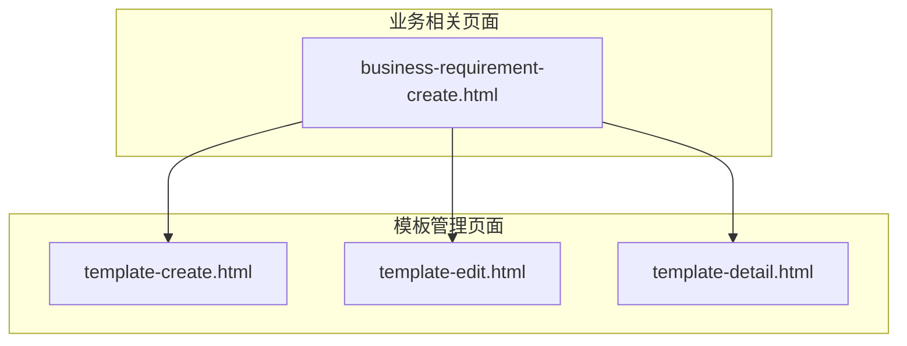
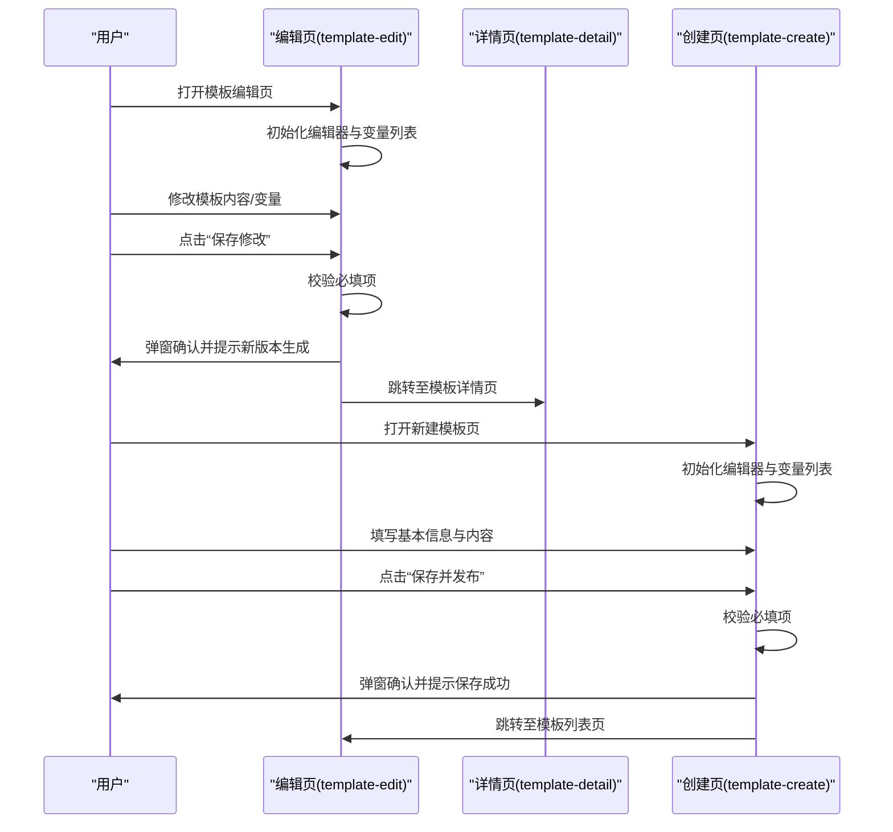
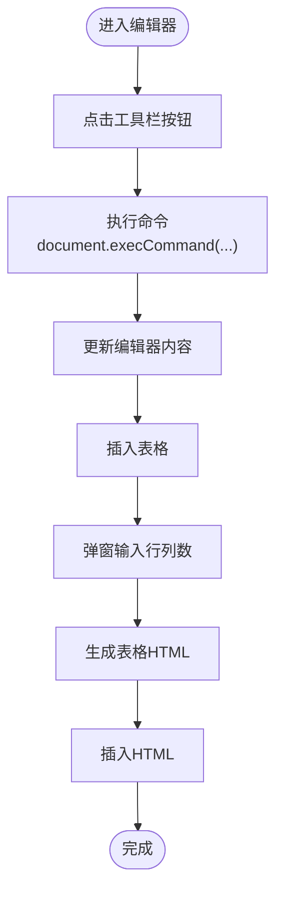
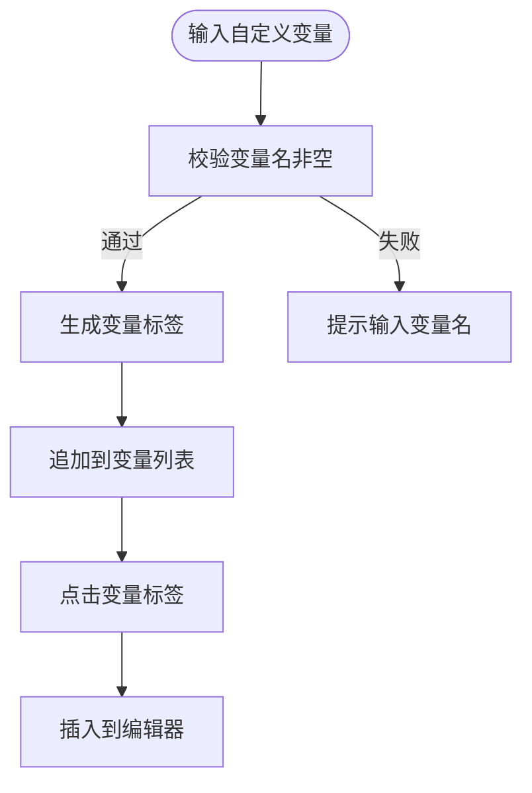
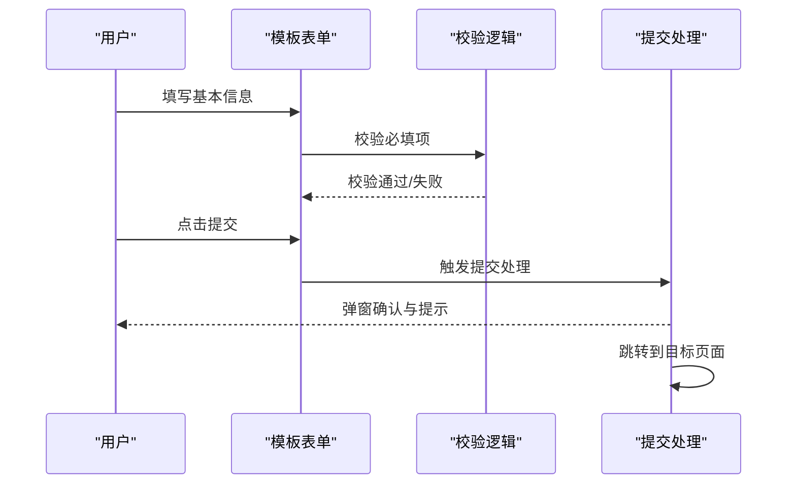
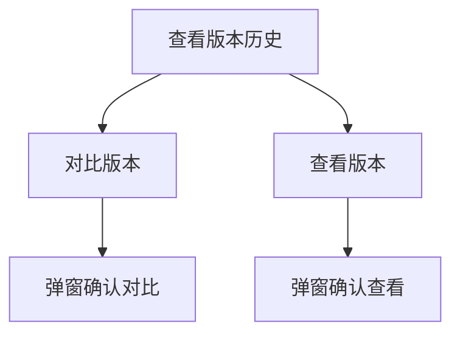
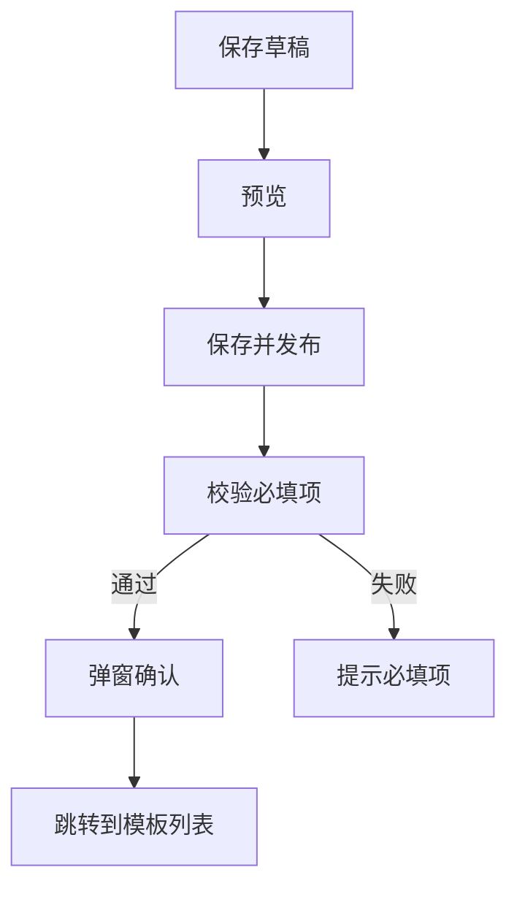

# 模板编辑

<cite>
**本文引用的文件**
- [template-edit.html](file://pages/template-edit.html)
- [template-detail.html](file://pages/template-detail.html)
- [template-create.html](file://pages/template-create.html)
- [business-requirement-create.html](file://pages/business-requirement-create.html)
- [2026-04-10-招标文件AI编制会议纪要.md](file://2026-04-10-招标文件AI编制会议纪要.md)
</cite>

## 目录
1. [简介](#简介)
2. [项目结构](#项目结构)
3. [核心组件](#核心组件)
4. [架构总览](#架构总览)
5. [详细组件分析](#详细组件分析)
6. [依赖关系分析](#依赖关系分析)
7. [性能考量](#性能考量)
8. [故障排查指南](#故障排查指南)
9. [结论](#结论)
10. [附录](#附录)

## 简介
本文件面向“模板编辑页面”的技术文档，聚焦于模板内容的加载与显示、编辑模式切换、内容修改的实时保存、模板版本对比与历史版本管理、版本回滚机制、模板修改权限控制、并发编辑冲突处理、草稿保存与发布流程、模板编辑器的高级功能（结构化编辑、批量修改、模板导入导出）、安全性保障、数据完整性检查与编辑体验优化方案。本文基于仓库中现有的前端页面实现进行分析与总结，并结合系统会议纪要对模板管理的整体目标与边界进行说明。

## 项目结构
模板编辑相关页面位于 pages 目录下，包含模板创建、编辑、详情三个页面，以及与之相关的业务需求页面。模板编辑页面采用纯前端 HTML/CSS/JS 实现，未见后端接口或数据库访问代码，因此本文将从前端实现角度进行分析。

图表来源
- [template-create.html:1-120](file://pages/template-create.html#L1-L120)
- [template-edit.html:1-120](file://pages/template-edit.html#L1-L120)
- [template-detail.html:1-120](file://pages/template-detail.html#L1-L120)
- [business-requirement-create.html:1-120](file://pages/business-requirement-create.html#L1-L120)

章节来源
- [template-create.html:1-120](file://pages/template-create.html#L1-L120)
- [template-edit.html:1-120](file://pages/template-edit.html#L1-L120)
- [template-detail.html:1-120](file://pages/template-detail.html#L1-L120)
- [business-requirement-create.html:1-120](file://pages/business-requirement-create.html#L1-L120)

## 核心组件
- 模板编辑器（富文本编辑区）
  - 支持加粗、斜体、下划线、列表、标题、表格等基础格式化操作。
  - 支持变量插入与自定义变量管理。
- 模板表单（基本信息、内容、变量）
  - 基本信息：模板名称、模板编码、适用项目类型、模板状态、模板描述。
  - 模板内容：富文本编辑器，支持结构化编辑。
  - 变量列表：系统预置变量与自定义变量，支持一键插入。
- 版本管理（详情页）
  - 版本历史卡片、版本对比、版本查看。
- 草稿与发布（创建页）
  - 草稿保存、预览、保存并发布。
- 权限与导航
  - 页面侧边导航、面包屑、用户信息与消息徽章。
- 主题切换
  - 深色/浅色主题切换逻辑。

章节来源
- [template-edit.html:590-767](file://pages/template-edit.html#L590-L767)
- [template-create.html:535-757](file://pages/template-create.html#L535-L757)
- [template-detail.html:646-844](file://pages/template-detail.html#L646-L844)

## 架构总览
模板编辑页面采用前端单页应用风格，通过按钮事件与表单提交触发行为，未见 AJAX 或后端接口调用。页面之间通过 window.location.href 进行跳转，形成轻量级的前端路由。

图表来源
- [template-edit.html:833-848](file://pages/template-edit.html#L833-L848)
- [template-create.html:828-845](file://pages/template-create.html#L828-L845)
- [template-detail.html:859-868](file://pages/template-detail.html#L859-L868)

## 详细组件分析

### 组件A：模板编辑器（富文本）
- 功能点
  - 文本格式化：加粗、斜体、下划线、无序/有序列表。
  - 结构化插入：标题、表格。
  - 内容可编辑区域：contenteditable 容器。
- 交互流程
  - 点击工具栏按钮 -> 执行 document.execCommand(...) -> 更新编辑器内容。
  - 插入表格时弹窗输入行列数，动态生成表格 HTML 并插入。
- 数据流
  - 用户输入 -> 编辑器 DOM -> 提交时读取编辑器内容值 -> 表单提交。
- 性能与可用性
  - 使用原生 execCommand，兼容性好但缺乏细粒度控制；建议后续引入现代富文本库以提升可控性与可扩展性。

图表来源
- [template-edit.html:772-800](file://pages/template-edit.html#L772-L800)
- [template-create.html:763-791](file://pages/template-create.html#L763-L791)

章节来源
- [template-edit.html:590-688](file://pages/template-edit.html#L590-L688)
- [template-create.html:587-679](file://pages/template-create.html#L587-L679)

### 组件B：变量系统（预置变量与自定义变量）
- 功能点
  - 预置变量：系统内置变量标签，点击即插入到编辑器。
  - 自定义变量：输入变量名，生成变量标签，点击插入。
- 交互流程
  - 输入自定义变量名 -> 校验非空 -> 生成 {{变量名}} -> 追加到变量列表 -> 点击标签插入到编辑器。
- 数据流
  - 用户输入 -> DOM 操作 -> 插入到编辑器内容。
- 安全性
  - 变量格式为 {{变量名}}，建议在后端渲染时进行白名单校验与转义，避免注入风险。

图表来源
- [template-edit.html:808-827](file://pages/template-edit.html#L808-L827)
- [template-create.html:799-818](file://pages/template-create.html#L799-L818)

章节来源
- [template-edit.html:689-731](file://pages/template-edit.html#L689-L731)
- [template-create.html:681-721](file://pages/template-create.html#L681-L721)

### 组件C：模板表单与提交（基本信息）
- 功能点
  - 基本信息字段：模板名称、模板编码、适用项目类型、模板状态、模板描述。
  - 提交行为：保存修改（编辑页）、保存并发布（创建页）。
- 交互流程
  - 填写必填项 -> 点击提交 -> 弹窗确认 -> 成功提示 -> 跳转。
- 数据流
  - 表单字段 -> 校验 -> 提交 -> 跳转页面。

图表来源
- [template-edit.html:833-848](file://pages/template-edit.html#L833-L848)
- [template-create.html:828-845](file://pages/template-create.html#L828-L845)

章节来源
- [template-edit.html:550-588](file://pages/template-edit.html#L550-L588)
- [template-create.html:535-585](file://pages/template-create.html#L535-L585)

### 组件D：版本管理（详情页）
- 功能点
  - 版本历史卡片：展示版本号、更新时间、更新人、更新摘要。
  - 版本对比：对比旧版本与新版本。
  - 版本查看：查看指定版本内容。
- 交互流程
  - 点击“对比” -> 弹窗提示对比版本。
  - 点击“查看” -> 弹窗提示查看版本。
- 数据流
  - 页面渲染版本列表 -> 用户操作 -> 弹窗提示。

图表来源
- [template-detail.html:787-844](file://pages/template-detail.html#L787-L844)
- [template-detail.html:874-876](file://pages/template-detail.html#L874-L876)

章节来源
- [template-detail.html:646-844](file://pages/template-detail.html#L646-L844)

### 组件E：草稿保存与发布（创建页）
- 功能点
  - 草稿保存：本地提示草稿已保存。
  - 预览：本地提示打开模板预览。
  - 保存并发布：校验必填项后确认并跳转。
- 交互流程
  - 点击“保存草稿” -> 弹窗提示。
  - 点击“预览” -> 弹窗提示。
  - 点击“保存并发布” -> 校验 -> 弹窗确认 -> 跳转。

图表来源
- [template-create.html:734-755](file://pages/template-create.html#L734-L755)
- [template-create.html:820-845](file://pages/template-create.html#L820-L845)

章节来源
- [template-create.html:723-757](file://pages/template-create.html#L723-L757)

### 组件F：权限控制与导航
- 导航与面包屑：模板管理、业务需求、政策文件管理、统计分析、消息中心、系统设置。
- 用户信息与消息徽章：右上角用户头像与消息数量。
- 权限控制：页面侧边导航项根据当前角色/权限显示不同菜单项（例如“模板管理”当前页为激活态）。

章节来源
- [template-edit.html:509-543](file://pages/template-edit.html#L509-L543)
- [template-detail.html:536-570](file://pages/template-detail.html#L536-L570)
- [template-create.html:494-528](file://pages/template-create.html#L494-L528)

### 组件G：主题切换
- 功能点
  - 切换深色/浅色主题，通过修改 CSS 变量实现。
- 交互流程
  - 点击“切换主题” -> 读取当前主题 -> 设置对应 CSS 变量。

章节来源
- [template-edit.html:850-867](file://pages/template-edit.html#L850-L867)
- [template-detail.html:878-895](file://pages/template-detail.html#L878-L895)
- [template-create.html:847-864](file://pages/template-create.html#L847-L864)

## 依赖关系分析
- 页面间依赖
  - 创建页 -> 列表页（保存并发布成功后跳转）。
  - 编辑页 -> 详情页（保存修改后跳转）。
  - 详情页 -> 编辑页（点击“编辑模板”跳转）。
- 组件内依赖
  - 编辑器依赖 document.execCommand 与 contenteditable。
  - 变量系统依赖 DOM 操作与事件绑定。
  - 表单提交依赖浏览器弹窗确认与页面跳转。
- 外部依赖
  - 未发现 AJAX 请求或后端接口调用，所有交互为本地模拟。

图表来源
- [template-create.html:843-845](file://pages/template-create.html#L843-L845)
- [template-edit.html:846-848](file://pages/template-edit.html#L846-L848)
- [template-detail.html:859-861](file://pages/template-detail.html#L859-L861)

章节来源
- [template-create.html:828-845](file://pages/template-create.html#L828-L845)
- [template-edit.html:833-848](file://pages/template-edit.html#L833-L848)
- [template-detail.html:859-868](file://pages/template-detail.html#L859-L868)

## 性能考量
- 编辑器性能
  - 使用 contenteditable 与 execCommand 的组合，简单易用但缺乏细粒度控制与可序列化能力。建议引入现代富文本库（如 Quill、Draft.js、Slate）以提升性能与可维护性。
- DOM 操作
  - 自定义变量列表通过动态创建元素追加，建议使用虚拟 DOM 或模板引擎减少重排重绘。
- 主题切换
  - 通过 CSS 变量切换主题，性能良好；建议将主题状态持久化到 localStorage，避免每次刷新重算。

[本节为通用指导，无需特定文件来源]

## 故障排查指南
- 表单校验失败
  - 现象：提交时弹窗提示必填项。
  - 排查：检查必填字段是否为空，确保模板名称、模板编码、适用项目类型等字段已填写。
- 编辑器无法插入表格
  - 现象：点击“表格”按钮无响应。
  - 排查：确认浏览器支持 document.execCommand；检查弹窗输入的行列数是否为有效数字。
- 变量插入无效
  - 现象：点击变量标签未插入到编辑器。
  - 排查：确认编辑器处于 focus 状态；检查变量标签的点击事件绑定是否生效。
- 版本对比/查看无响应
  - 现象：点击“对比”或“查看”按钮无反应。
  - 排查：确认弹窗提示函数已定义且未被覆盖；检查版本号参数传递是否正确。
- 草稿保存/预览无响应
  - 现象：点击“保存草稿”或“预览”按钮无反应。
  - 排查：确认按钮事件绑定是否正确；检查 alert 是否被拦截。

章节来源
- [template-edit.html:833-848](file://pages/template-edit.html#L833-L848)
- [template-create.html:820-845](file://pages/template-create.html#L820-L845)
- [template-detail.html:874-876](file://pages/template-detail.html#L874-L876)

## 结论
模板编辑页面以纯前端实现，提供了基础的富文本编辑、变量管理、版本历史与对比、草稿保存与发布等能力。由于未发现后端接口与数据库访问代码，当前实现为本地模拟。若要满足生产环境的复杂需求（如实时保存、并发冲突处理、权限控制、版本回滚、导入导出等），建议引入现代化富文本库、后端接口与数据库、权限与并发控制机制，并完善安全与数据完整性检查。

[本节为总结，无需特定文件来源]

## 附录

### A. 模板编辑功能实现机制
- 模板内容加载与显示
  - 编辑器初始内容在页面中直接渲染，支持结构化标题、段落与变量占位符。
- 编辑模式切换
  - 通过工具栏按钮切换格式；未见“只读/编辑”模式切换逻辑，当前为全编辑态。
- 内容修改的实时保存
  - 未发现自动保存或实时同步逻辑；提交时一次性保存。

章节来源
- [template-edit.html:659-685](file://pages/template-edit.html#L659-L685)
- [template-create.html:656-676](file://pages/template-create.html#L656-L676)

### B. 模板版本对比与历史版本管理
- 版本历史展示
  - 详情页提供版本历史卡片，包含版本号、更新时间、更新人与摘要。
- 版本对比
  - 支持对比旧版本与当前版本，弹窗提示对比结果。
- 版本回滚机制
  - 详情页未提供回滚按钮或回滚逻辑；当前实现为查看与对比。

章节来源
- [template-detail.html:787-844](file://pages/template-detail.html#L787-L844)
- [template-detail.html:874-876](file://pages/template-detail.html#L874-L876)

### C. 模板修改权限控制与并发编辑
- 权限控制
  - 页面侧边导航体现不同权限域（模板管理、业务需求、政策文件管理等），但未见具体权限校验逻辑。
- 并发编辑冲突处理
  - 未发现并发锁、冲突检测或冲突解决机制；当前为本地模拟。

章节来源
- [template-edit.html:509-543](file://pages/template-edit.html#L509-L543)
- [template-detail.html:536-570](file://pages/template-detail.html#L536-L570)

### D. 草稿保存与发布流程
- 草稿保存
  - 创建页提供“保存草稿”按钮，本地提示草稿已保存。
- 发布流程
  - “保存并发布”按钮提交表单，校验必填项后确认并跳转。

章节来源
- [template-create.html:734-755](file://pages/template-create.html#L734-L755)
- [template-create.html:828-845](file://pages/template-create.html#L828-L845)

### E. 模板编辑器的高级功能
- 结构化编辑
  - 支持标题、列表、表格等结构化元素插入。
- 批量修改
  - 未发现批量修改功能；可通过变量系统批量插入占位符。
- 模板导入导出
  - 未发现导入导出功能；当前为本地编辑与预览。

章节来源
- [template-edit.html:590-688](file://pages/template-edit.html#L590-L688)
- [template-create.html:587-679](file://pages/template-create.html#L587-L679)

### F. 安全性保障与数据完整性检查
- 安全性
  - 变量格式为 {{变量名}}，建议在后端渲染时进行白名单校验与转义。
- 数据完整性
  - 表单提交前进行必填项校验；建议在后端增加更严格的格式与长度校验。

章节来源
- [template-edit.html:839-842](file://pages/template-edit.html#L839-L842)
- [template-create.html:836-839](file://pages/template-create.html#L836-L839)

### G. 编辑体验优化方案
- 富文本库迁移：引入现代化富文本库，提升可控性与可扩展性。
- 自动保存：增加防抖与自动保存，减少丢失风险。
- 版本对比可视化：提供差异高亮与对比视图。
- 变量管理增强：支持变量搜索、分类与批量插入。
- 主题持久化：将主题状态保存到 localStorage。

[本节为通用指导，无需特定文件来源]

### H. 与系统整体目标的关联
- 会议纪要明确了模板管理的目标与边界：优先采用 Markdown 模板方案，支持多类别差异化适配，生成逻辑为“模板+AI填充内容→转为 Markdown→转为 Word”。模板编辑页面作为前端实现，与系统整体目标保持一致。

章节来源
- [2026-04-10-招标文件AI编制会议纪要.md:16-18](file://2026-04-10-招标文件AI编制会议纪要.md#L16-L18)