# 模板详情

<cite>
**本文引用的文件**
- [template-detail.html](file://pages/template-detail.html)
- [template-list.html](file://pages/template-list.html)
- [template-create.html](file://pages/template-create.html)
- [template-edit.html](file://pages/template-edit.html)
- [statistics.html](file://pages/statistics.html)
</cite>

## 目录
1. [简介](#简介)
2. [项目结构](#项目结构)
3. [核心组件](#核心组件)
4. [架构概览](#架构概览)
5. [详细组件分析](#详细组件分析)
6. [依赖关系分析](#依赖关系分析)
7. [性能考量](#性能考量)
8. [故障排查指南](#故障排查指南)
9. [结论](#结论)
10. [附录](#附录)

## 简介
本文件面向“模板详情”页面，提供从设计到实现的全景技术说明，覆盖以下目标：
- 模板基本信息展示：名称、编码、版本、状态、创建与更新时间、创建人与更新人
- 使用统计信息展示：使用次数、最近使用时间、使用部门
- 模板内容完整展示：基本信息、预览、变量列表、版本历史
- 模板使用记录追踪机制：页面内交互与提示
- 性能统计指标计算方法：页面内统计卡片与趋势示意
- 模板评价与反馈收集：页面内交互入口与提示
- 模板分享与复制：页面内交互与提示
- 模板下载与导出：页面内交互与提示
- 模板关联项目的展示：页面内交互与提示
- 响应式设计、内容渲染优化与用户体验提升方案：页面内主题切换、标签页、网格布局与高亮

## 项目结构
模板详情页面位于 pages 目录下，采用单页应用风格，结合导航栏、面包屑、内容区与底部主题切换按钮，整体布局由固定侧边栏与主内容区组成。

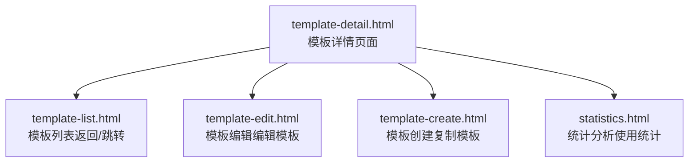

**图表来源**
- [template-detail.html:536-546](file://pages/template-detail.html#L536-L546)
- [template-list.html:914-932](file://pages/template-list.html#L914-L932)
- [template-edit.html:742-759](file://pages/template-edit.html#L742-L759)
- [template-create.html:576-596](file://pages/template-create.html#L576-L596)
- [statistics.html:445-449](file://pages/statistics.html#L445-L449)

**章节来源**
- [template-detail.html:536-546](file://pages/template-detail.html#L536-L546)
- [template-list.html:914-932](file://pages/template-list.html#L914-L932)

## 核心组件
- 页面布局与主题
  - 固定侧边栏导航与顶部栏（面包屑、消息徽标、用户信息）
  - 内容区最大宽度约束与网格布局
  - 主题切换按钮与暗/亮主题变量切换
- 模板信息卡片
  - 模板标题、状态徽标、默认模板徽章
  - 关键元信息网格：模板编码、适用项目类型、当前版本、创建/更新时间与人员、使用次数
- 标签页容器
  - 基本信息、模板预览、变量列表、版本历史四个标签页
- 模板内容预览
  - 结构化章节与变量高亮展示
- 变量列表
  - 系统预置变量与自定义变量分组展示
- 版本历史
  - 当前版本标识、更新时间与作者、版本动作（查看、对比）
- 交互行为
  - 标签页切换、编辑模板、复制模板、查看/对比版本、主题切换

**章节来源**
- [template-detail.html:262-337](file://pages/template-detail.html#L262-L337)
- [template-detail.html:338-383](file://pages/template-detail.html#L338-L383)
- [template-detail.html:417-429](file://pages/template-detail.html#L417-L429)
- [template-detail.html:461-476](file://pages/template-detail.html#L461-L476)
- [template-detail.html:478-510](file://pages/template-detail.html#L478-L510)
- [template-detail.html:850-896](file://pages/template-detail.html#L850-L896)

## 架构概览
模板详情页面采用前端静态页面+本地交互逻辑的轻量架构，通过按钮事件驱动页面跳转或弹窗提示，不涉及后端请求。页面内数据以静态 HTML 结构与少量脚本实现展示与交互。

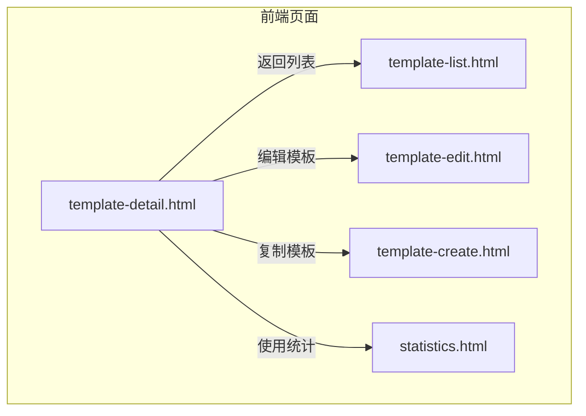

**图表来源**
- [template-detail.html:576-583](file://pages/template-detail.html#L576-L583)
- [template-detail.html:594-607](file://pages/template-detail.html#L594-L607)
- [template-detail.html:859-867](file://pages/template-detail.html#L859-L867)
- [template-list.html:926-932](file://pages/template-list.html#L926-L932)
- [statistics.html:445-449](file://pages/statistics.html#L445-L449)

## 详细组件分析

### 组件一：模板信息卡片与元信息网格
- 展示字段
  - 模板名称、状态（启用/停用）、默认模板徽章
  - 模板编码、适用项目类型、当前版本
  - 创建时间、创建人、最后更新时间、更新人
  - 使用次数
- 设计要点
  - 卡片式布局，网格对齐，标签与数值分层显示
  - 状态徽标与默认徽章用于快速识别关键属性
- 交互
  - 编辑模板与复制模板按钮触发页面跳转

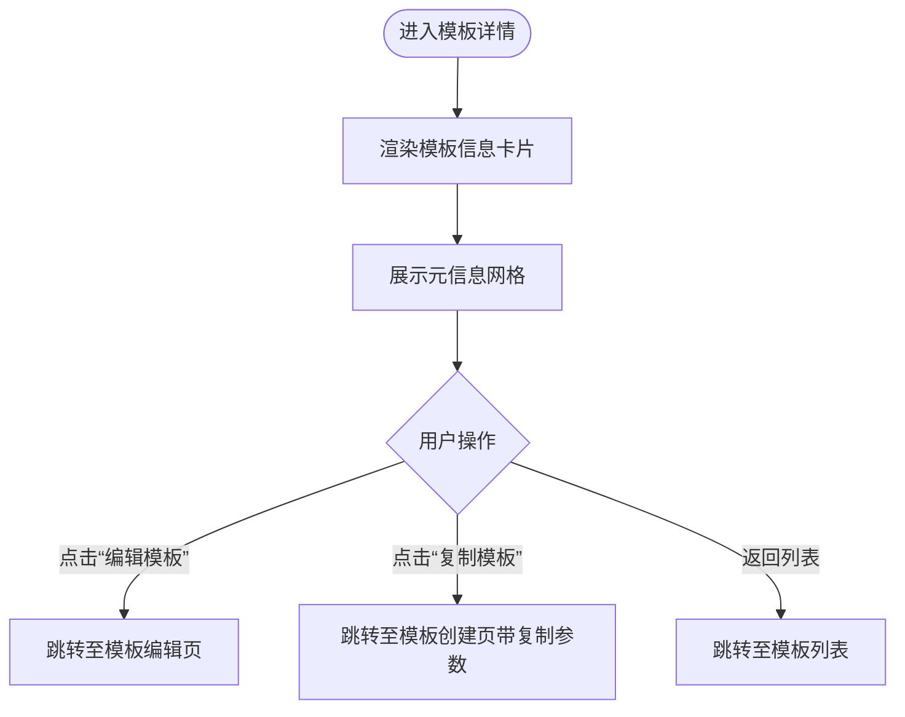

**图表来源**
- [template-detail.html:586-644](file://pages/template-detail.html#L586-L644)
- [template-detail.html:594-607](file://pages/template-detail.html#L594-L607)
- [template-detail.html:859-867](file://pages/template-detail.html#L859-L867)

**章节来源**
- [template-detail.html:586-644](file://pages/template-detail.html#L586-L644)
- [template-detail.html:594-607](file://pages/template-detail.html#L594-L607)

### 组件二：标签页容器与内容区
- 标签页
  - 基本信息、模板预览、变量列表、版本历史
- 内容区
  - 基本信息：模板名称、编码、适用类型、版本、状态、创建/更新信息、描述
  - 模板预览：章节标题与变量高亮
  - 变量列表：系统预置变量与自定义变量分组
  - 版本历史：当前版本标识、更新时间与作者、版本动作
- 交互
  - 点击标签页切换内容显示

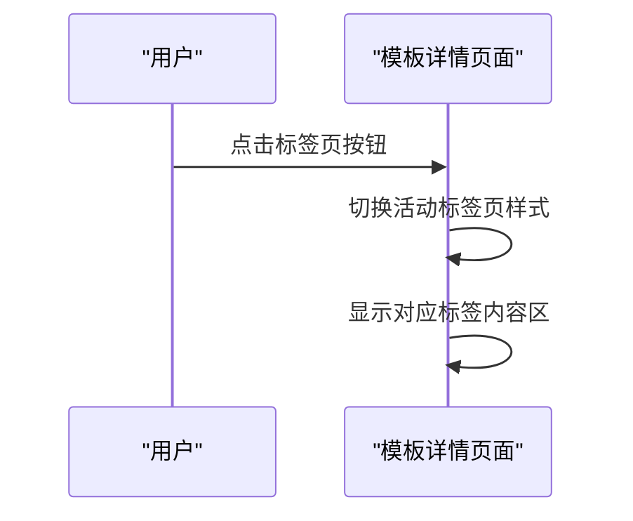

**图表来源**
- [template-detail.html:646-652](file://pages/template-detail.html#L646-L652)
- [template-detail.html:851-857](file://pages/template-detail.html#L851-L857)

**章节来源**
- [template-detail.html:646-652](file://pages/template-detail.html#L646-L652)
- [template-detail.html:654-698](file://pages/template-detail.html#L654-L698)
- [template-detail.html:701-732](file://pages/template-detail.html#L701-L732)
- [template-detail.html:734-785](file://pages/template-detail.html#L734-L785)
- [template-detail.html:787-846](file://pages/template-detail.html#L787-L846)

### 组件三：模板内容预览与变量高亮
- 预览容器
  - 固定高度与背景色，适配长文档阅读
- 变量高亮
  - 使用特定类名对变量占位符进行视觉强调
- 变量列表
  - 分组展示系统预置变量与自定义变量，便于对照

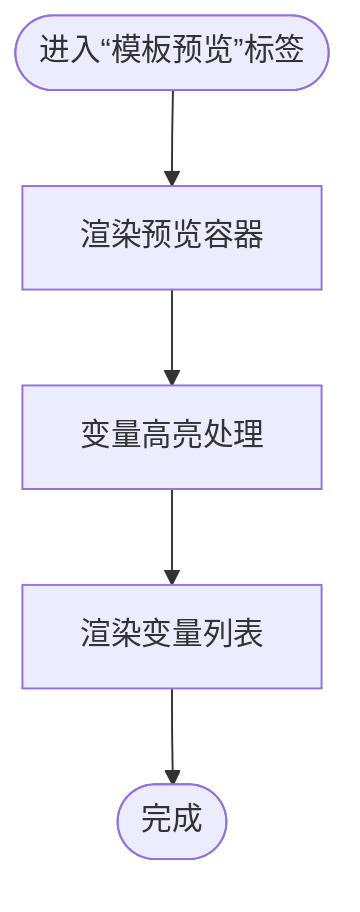

**图表来源**
- [template-detail.html:417-429](file://pages/template-detail.html#L417-L429)
- [template-detail.html:452-476](file://pages/template-detail.html#L452-L476)
- [template-detail.html:734-785](file://pages/template-detail.html#L734-L785)

**章节来源**
- [template-detail.html:417-429](file://pages/template-detail.html#L417-L429)
- [template-detail.html:452-476](file://pages/template-detail.html#L452-L476)
- [template-detail.html:734-785](file://pages/template-detail.html#L734-L785)

### 组件四：版本历史与对比
- 当前版本标识与更新信息
- 版本动作：查看、对比
- 交互
  - 调用查看/对比函数并弹出提示

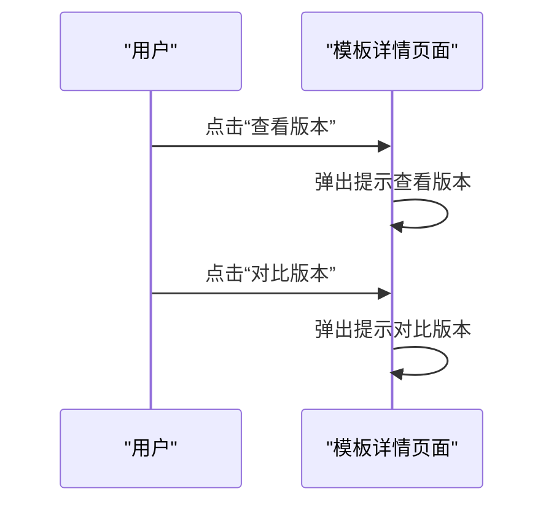

**图表来源**
- [template-detail.html:798-800](file://pages/template-detail.html#L798-L800)
- [template-detail.html:870-876](file://pages/template-detail.html#L870-L876)

**章节来源**
- [template-detail.html:787-846](file://pages/template-detail.html#L787-L846)
- [template-detail.html:870-876](file://pages/template-detail.html#L870-L876)

### 组件五：使用统计信息与统计分析
- 使用统计信息
  - 使用次数、最近使用时间、使用部门（页面内以交互形式呈现）
- 统计分析
  - 统计分析页面提供系统级统计卡片与图表区域，作为模板使用情况的数据补充

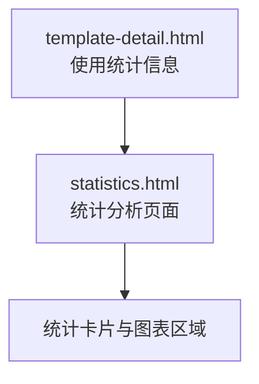

**图表来源**
- [template-detail.html:640-642](file://pages/template-detail.html#L640-L642)
- [statistics.html:518-540](file://pages/statistics.html#L518-L540)
- [statistics.html:722-724](file://pages/statistics.html#L722-L724)

**章节来源**
- [template-detail.html:640-642](file://pages/template-detail.html#L640-L642)
- [statistics.html:518-540](file://pages/statistics.html#L518-L540)
- [statistics.html:722-724](file://pages/statistics.html#L722-L724)

### 组件六：模板使用记录追踪机制
- 页面内交互
  - 使用次数在模板详情中直接展示
  - 最近使用时间与使用部门通过交互提示实现
- 追踪范围
  - 页面内未见后端请求或持久化存储逻辑，使用记录追踪以交互提示为主

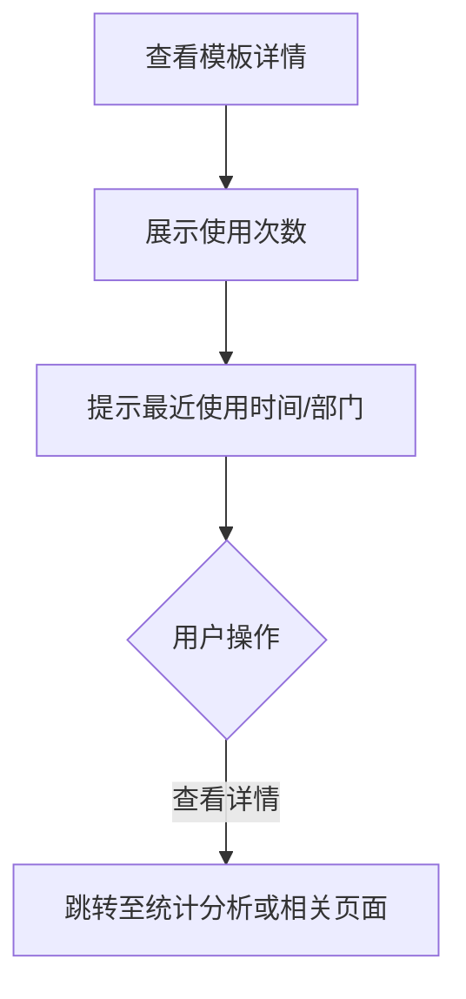

**图表来源**
- [template-detail.html:640-642](file://pages/template-detail.html#L640-L642)
- [template-detail.html:870-876](file://pages/template-detail.html#L870-L876)

**章节来源**
- [template-detail.html:640-642](file://pages/template-detail.html#L640-L642)
- [template-detail.html:870-876](file://pages/template-detail.html#L870-L876)

### 组件七：模板评价与反馈收集
- 页面内交互
  - 未发现专门的评价与反馈表单或提交入口
- 建议
  - 可在“基本信息”或“模板预览”标签页新增评价与反馈入口，结合提示与跳转至相关页面

**章节来源**
- [template-detail.html:654-698](file://pages/template-detail.html#L654-L698)
- [template-detail.html:701-732](file://pages/template-detail.html#L701-L732)

### 组件八：模板分享与复制
- 分享
  - 页面内未发现分享入口
- 复制
  - 提供“复制模板”按钮，点击后弹出确认并跳转至模板创建页（携带复制参数）

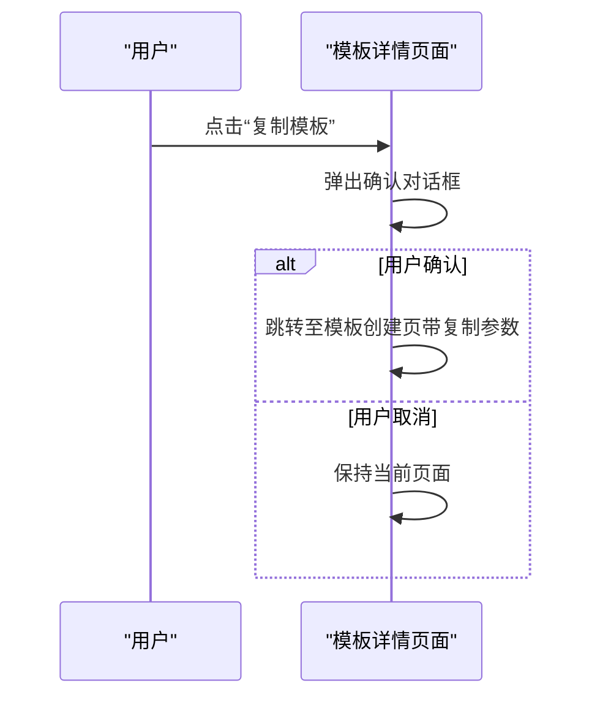

**图表来源**
- [template-detail.html:601-607](file://pages/template-detail.html#L601-L607)
- [template-detail.html:863-867](file://pages/template-detail.html#L863-L867)

**章节来源**
- [template-detail.html:601-607](file://pages/template-detail.html#L601-L607)
- [template-detail.html:863-867](file://pages/template-detail.html#L863-L867)

### 组件九：模板下载与导出
- 下载与导出
  - 页面内未发现下载或导出入口
- 建议
  - 在模板列表页已有“导出”按钮，可在详情页提供“导出模板”按钮，结合提示与下载流程

**章节来源**
- [template-list.html:662-677](file://pages/template-list.html#L662-L677)
- [template-detail.html:850-896](file://pages/template-detail.html#L850-L896)

### 组件十：模板关联项目的展示
- 关联项目
  - 页面内未发现直接展示关联项目的区域
- 建议
  - 可在“基本信息”标签页新增“关联项目”区域，展示项目名称、状态与跳转链接

**章节来源**
- [template-detail.html:654-698](file://pages/template-detail.html#L654-L698)

### 组件十一：响应式设计与用户体验
- 响应式布局
  - 侧边栏固定宽度，主内容区自适应；网格布局在不同屏幕尺寸下保持可读性
- 主题切换
  - 底部悬浮按钮支持暗/亮主题切换，动态更新 CSS 变量
- 用户体验
  - 标签页切换流畅、变量高亮清晰、预览容器具备足够留白与行高

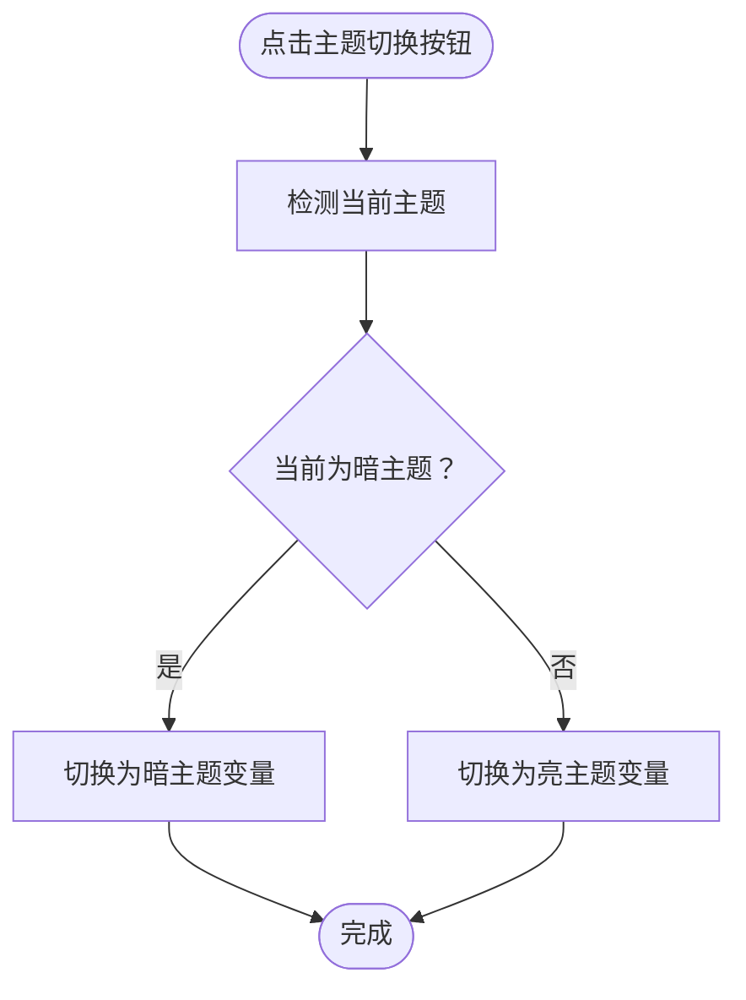

**图表来源**
- [template-detail.html](file://pages/template-detail.html#L534)
- [template-detail.html:878-895](file://pages/template-detail.html#L878-L895)

**章节来源**
- [template-detail.html:534-546](file://pages/template-detail.html#L534-L546)
- [template-detail.html:878-895](file://pages/template-detail.html#L878-L895)

## 依赖关系分析
- 页面间依赖
  - 模板详情依赖模板列表（返回）、模板编辑（编辑模板）、模板创建（复制模板）
  - 统计分析页面为使用统计提供数据支撑
- 组件内依赖
  - 标签页切换依赖 JavaScript 函数
  - 主题切换依赖 CSS 变量与脚本

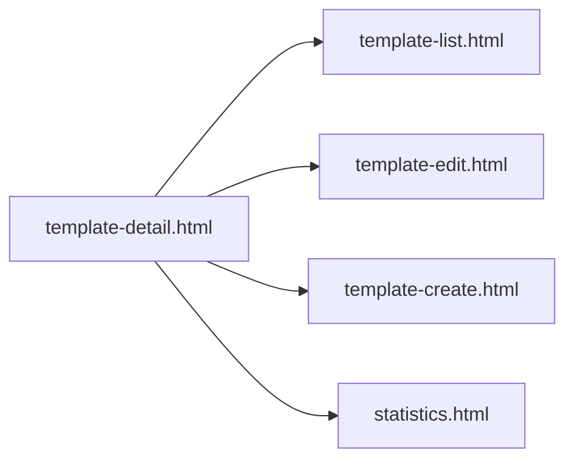

**图表来源**
- [template-detail.html:576-583](file://pages/template-detail.html#L576-L583)
- [template-detail.html:594-607](file://pages/template-detail.html#L594-L607)
- [template-detail.html:859-867](file://pages/template-detail.html#L859-L867)
- [template-list.html:926-932](file://pages/template-list.html#L926-L932)
- [statistics.html:445-449](file://pages/statistics.html#L445-L449)

**章节来源**
- [template-detail.html:576-583](file://pages/template-detail.html#L576-L583)
- [template-detail.html:594-607](file://pages/template-detail.html#L594-L607)
- [template-detail.html:859-867](file://pages/template-detail.html#L859-L867)
- [template-list.html:926-932](file://pages/template-list.html#L926-L932)
- [statistics.html:445-449](file://pages/statistics.html#L445-L449)

## 性能考量
- 渲染优化
  - 使用 CSS Grid 与 Flex 布局，减少复杂计算
  - 预览容器固定最小高度，避免频繁重排
- 交互性能
  - 标签页切换仅切换样式与显示状态，无复杂 DOM 操作
  - 主题切换通过 CSS 变量即时生效，避免重绘
- 数据与网络
  - 页面为静态展示，无网络请求，加载速度快

[本节为通用性能讨论，无需列出具体文件来源]

## 故障排查指南
- 标签页不切换
  - 检查标签页切换函数是否存在且被正确绑定
  - 确认活动标签与内容区的 ID 匹配
- 主题切换无效
  - 检查主题切换函数中的 CSS 变量赋值是否正确
  - 确认页面存在对应变量声明
- 复制模板无反应
  - 检查复制模板函数是否被调用
  - 确认跳转路径与参数传递正确

**章节来源**
- [template-detail.html:851-857](file://pages/template-detail.html#L851-L857)
- [template-detail.html:878-895](file://pages/template-detail.html#L878-L895)
- [template-detail.html:863-867](file://pages/template-detail.html#L863-L867)

## 结论
模板详情页面以简洁直观的方式展示了模板的核心信息与内容，并通过标签页组织不同维度的信息。页面内交互以跳转与提示为主，配合主题切换与网格布局，提供了良好的可读性与可用性。针对使用统计、评价反馈、分享复制、下载导出与关联项目展示等功能，建议在现有基础上扩展相应入口与流程，以进一步完善模板生命周期管理体验。

[本节为总结性内容，无需列出具体文件来源]

## 附录
- 快速定位
  - 模板信息卡片与元信息网格：[template-detail.html:586-644](file://pages/template-detail.html#L586-L644)
  - 标签页与内容区：[template-detail.html:646-652](file://pages/template-detail.html#L646-L652)
  - 模板预览与变量高亮：[template-detail.html:417-429](file://pages/template-detail.html#L417-L429), [template-detail.html:452-476](file://pages/template-detail.html#L452-L476)
  - 版本历史与对比：[template-detail.html:787-846](file://pages/template-detail.html#L787-L846), [template-detail.html:870-876](file://pages/template-detail.html#L870-L876)
  - 使用统计信息：[template-detail.html:640-642](file://pages/template-detail.html#L640-L642)
  - 统计分析页面：[statistics.html:518-540](file://pages/statistics.html#L518-L540), [statistics.html:722-724](file://pages/statistics.html#L722-L724)
  - 页面间跳转入口：[template-detail.html:576-583](file://pages/template-detail.html#L576-L583), [template-detail.html:594-607](file://pages/template-detail.html#L594-L607), [template-detail.html:859-867](file://pages/template-detail.html#L859-L867), [template-list.html:926-932](file://pages/template-list.html#L926-L932)

[本节为附录性内容，无需列出具体文件来源]