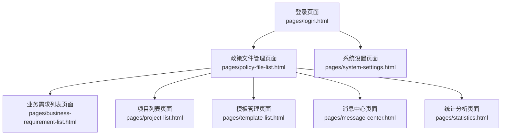
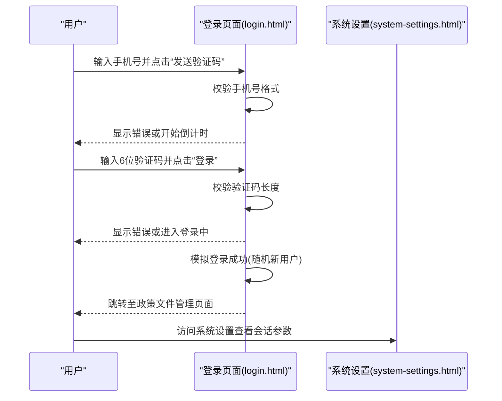
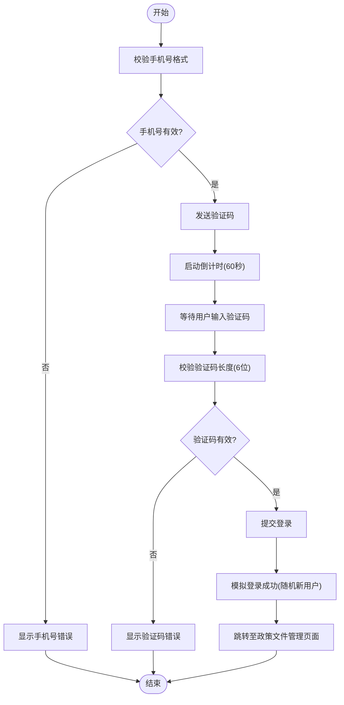
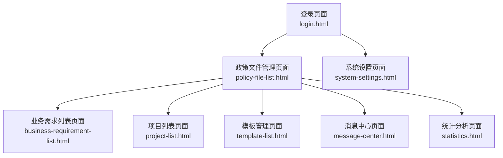

# 用户认证系统

<cite>
**本文档引用的文件**
- [login.html](file://pages/login.html)
- [policy-file-list.html](file://pages/policy-file-list.html)
- [system-settings.html](file://pages/system-settings.html)
- [business-requirement-list.html](file://pages/business-requirement-list.html)
- [project-list.html](file://pages/project-list.html)
- [template-list.html](file://pages/template-list.html)
- [message-center.html](file://pages/message-center.html)
- [statistics.html](file://pages/statistics.html)
</cite>

## 目录
1. [简介](#简介)
2. [项目结构](#项目结构)
3. [核心组件](#核心组件)
4. [架构总览](#架构总览)
5. [详细组件分析](#详细组件分析)
6. [依赖关系分析](#依赖关系分析)
7. [性能考量](#性能考量)
8. [故障排查指南](#故障排查指南)
9. [结论](#结论)
10. [附录](#附录)

## 简介
本项目是一个基于纯前端技术栈的“招标文件生成系统”，其中用户认证采用手机号验证码登录模式。登录页面实现了完整的前端表单校验、验证码发送倒计时、登录流程模拟与跳转，并在系统设置中提供了会话超时等安全参数配置入口。本文档将从架构、组件、数据流、处理逻辑、错误处理、安全与最佳实践等方面进行全面解析，帮助开发者理解并扩展认证功能。

## 项目结构
系统采用多页面单页应用风格，登录页面位于 pages/login.html，登录成功后跳转至政策文件管理页面；系统设置页面提供会话超时、检测不通过上限次数等参数配置，用于支撑用户状态管理与会话控制。

图表来源
- [login.html:337-358](file://pages/login.html#L337-L358)
- [policy-file-list.html:695-705](file://pages/policy-file-list.html#L695-L705)
- [system-settings.html:760-769](file://pages/system-settings.html#L760-L769)

章节来源
- [login.html:1-481](file://pages/login.html#L1-L481)
- [policy-file-list.html:1-1106](file://pages/policy-file-list.html#L1-L1106)
- [system-settings.html:1-1025](file://pages/system-settings.html#L1-L1025)

## 核心组件
- 登录表单组件：包含手机号输入、验证码输入与发送按钮、登录按钮，以及对应的错误提示区域。
- 验证码发送组件：负责手机号格式校验、倒计时控制与发送提示。
- 登录提交组件：负责表单二次校验、登录状态模拟与页面跳转。
- 主题切换组件：支持明暗主题切换，提升用户体验。
- 导航与布局组件：统一的侧边栏导航、顶部栏与面包屑，贯穿多个页面。

章节来源
- [login.html:337-358](file://pages/login.html#L337-L358)
- [login.html:364-479](file://pages/login.html#L364-L479)

## 架构总览
系统采用纯前端静态页面架构，登录流程如下：
- 前端表单校验：手机号格式校验、验证码长度校验。
- 验证码发送：触发发送验证码逻辑，启动倒计时。
- 登录提交：二次校验通过后，模拟登录成功，随机判断新用户并跳转至目标页面。

图表来源
- [login.html:369-401](file://pages/login.html#L369-L401)
- [login.html:410-458](file://pages/login.html#L410-L458)
- [system-settings.html:760-769](file://pages/system-settings.html#L760-L769)

## 详细组件分析

### 登录表单与交互逻辑
- 表单字段
  - 手机号码：必填，输入类型为电话号码，占位符提示输入手机号。
  - 验证码：必填，输入长度需为6位。
  - 发送验证码按钮：触发发送验证码逻辑，带倒计时禁用态。
  - 登录按钮：提交表单，进行二次校验并模拟登录。
- 交互逻辑
  - 手机号格式校验：使用正则表达式校验中国大陆手机号格式。
  - 验证码长度校验：确保输入6位数字。
  - 倒计时控制：发送验证码后按钮禁用并显示剩余秒数，结束后恢复可用。
  - 登录中状态：提交后按钮禁用并显示“登录中...”。
  - 新用户提示：登录成功后随机判断是否为新用户并弹窗提示。
  - 页面跳转：登录成功后跳转至政策文件管理页面。

图表来源
- [login.html:369-401](file://pages/login.html#L369-L401)
- [login.html:410-458](file://pages/login.html#L410-L458)

章节来源
- [login.html:337-358](file://pages/login.html#L337-L358)
- [login.html:369-401](file://pages/login.html#L369-L401)
- [login.html:410-458](file://pages/login.html#L410-L458)

### 验证码发送流程
- 触发条件：用户点击“发送验证码”按钮。
- 校验步骤：先校验手机号格式，失败则显示错误信息。
- 倒计时逻辑：按钮禁用并显示“X秒后重发”，每秒递减，直至0恢复可用。
- 提示信息：在测试环境中提示验证码已发送，并建议输入固定验证码。

章节来源
- [login.html:369-401](file://pages/login.html#L369-L401)

### 登录提交与页面跳转
- 校验步骤：再次校验手机号与验证码，失败则显示对应错误。
- 登录中状态：按钮禁用并显示“登录中...”。
- 登录成功：模拟登录成功，随机判断是否为新用户并弹窗提示。
- 页面跳转：登录成功后跳转至政策文件管理页面。

章节来源
- [login.html:410-458](file://pages/login.html#L410-L458)

### 错误处理机制
- 手机号错误：当手机号格式不正确时，显示错误提示并阻止继续流程。
- 验证码错误：当验证码为空或长度不为6时，显示错误提示并阻止继续流程。
- 登录中状态：防止重复提交，提升用户体验。
- 倒计时禁用：避免频繁发送验证码。

章节来源
- [login.html:410-458](file://pages/login.html#L410-L458)

### UI组件设计与样式
- 登录卡片：居中布局，深色背景与科技感网格背景，支持明暗主题切换。
- 表单控件：统一的输入框、按钮样式，聚焦态高亮与悬停效果。
- 错误与成功提示：使用颜色区分错误与成功信息。
- 主题切换：右下角固定按钮，一键切换明暗主题。

章节来源
- [login.html:7-316](file://pages/login.html#L7-L316)
- [login.html:317-481](file://pages/login.html#L317-L481)

### 用户状态管理与会话管理
- 用户状态：登录成功后，系统以“已登录”状态运行，后续页面可基于此状态进行导航与功能展示。
- 会话参数：系统设置页面提供“会话超时时间（分钟）”与“检测不通过上限次数”等参数，用于支撑会话控制与安全策略。
- 页面导航：登录成功后跳转至政策文件管理页面，该页面包含统一的侧边栏导航与顶部栏，便于用户在各功能模块间切换。

章节来源
- [system-settings.html:760-769](file://pages/system-settings.html#L760-L769)
- [policy-file-list.html:695-705](file://pages/policy-file-list.html#L695-L705)

## 依赖关系分析
- 登录页面依赖于系统设置页面中的会话参数配置，用于指导会话超时策略。
- 登录成功后跳转至政策文件管理页面，该页面作为主功能入口，进一步依赖业务需求列表、项目列表、模板管理、消息中心、统计分析等页面。
- 各页面共享统一的导航与布局组件，保证一致的用户体验。

图表来源
- [login.html:337-358](file://pages/login.html#L337-L358)
- [policy-file-list.html:695-705](file://pages/policy-file-list.html#L695-L705)
- [system-settings.html:760-769](file://pages/system-settings.html#L760-L769)

## 性能考量
- 前端渲染：所有页面均为静态HTML+CSS+JavaScript，无需后端渲染，加载速度快。
- 动画与主题切换：使用CSS动画与变量切换，性能开销低。
- 表单校验：本地即时校验，减少无效提交与网络请求。
- 建议优化
  - 将倒计时逻辑封装为可复用模块，避免重复代码。
  - 对输入框增加防抖与节流，减少频繁校验带来的性能消耗。
  - 使用更高效的DOM选择器与事件委托，降低事件处理成本。

## 故障排查指南
- 登录按钮无法点击
  - 检查表单是否通过校验，确认手机号与验证码均满足要求。
  - 查看按钮是否处于“登录中”禁用状态。
- 验证码按钮无法点击
  - 检查手机号格式是否正确。
  - 查看倒计时是否仍在进行中。
- 登录成功但未跳转
  - 确认浏览器未拦截跳转。
  - 检查控制台是否有错误信息。
- 主题切换异常
  - 检查CSS变量是否被覆盖。
  - 确认切换函数是否正确执行。

章节来源
- [login.html:369-401](file://pages/login.html#L369-L401)
- [login.html:410-458](file://pages/login.html#L410-L458)
- [login.html:460-479](file://pages/login.html#L460-L479)

## 结论
本认证系统以手机号验证码登录为核心，结合前端表单校验、倒计时控制与页面跳转，构建了简洁高效的登录体验。系统设置页面提供的会话参数为后续扩展会话管理与安全策略提供了基础。通过本文档的架构与组件分析，开发者可以快速理解登录流程并在此基础上进行功能扩展与优化。

## 附录
- 表单字段说明
  - 手机号码：必填，支持中国大陆手机号格式。
  - 验证码：必填，必须为6位数字。
- 安全考虑
  - 前端仅做基础校验，实际生产环境需配合后端接口与加密传输。
  - 建议引入验证码图形识别、短信通道鉴权与风控策略。
- 最佳实践
  - 将倒计时与校验逻辑模块化，便于复用与测试。
  - 在系统设置中提供会话超时与安全策略配置入口。
  - 使用统一的主题变量与样式规范，保持视觉一致性。