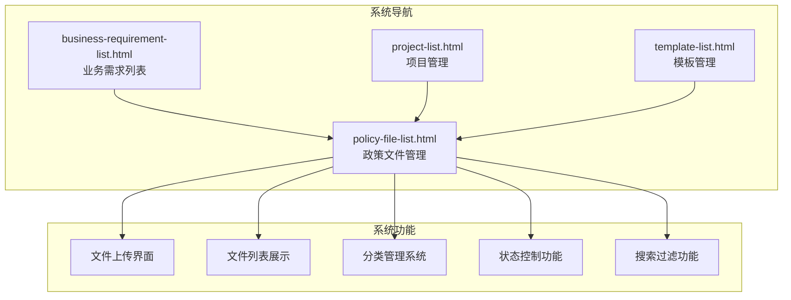
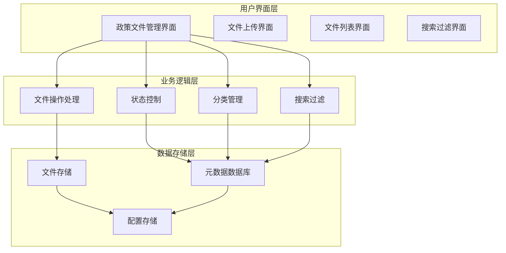
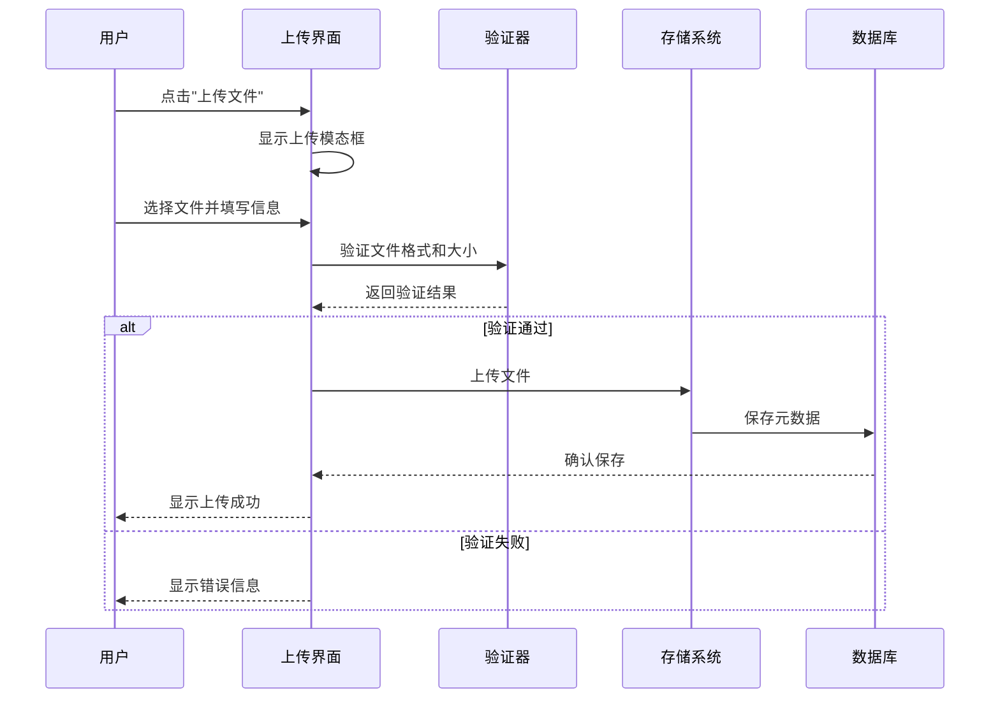
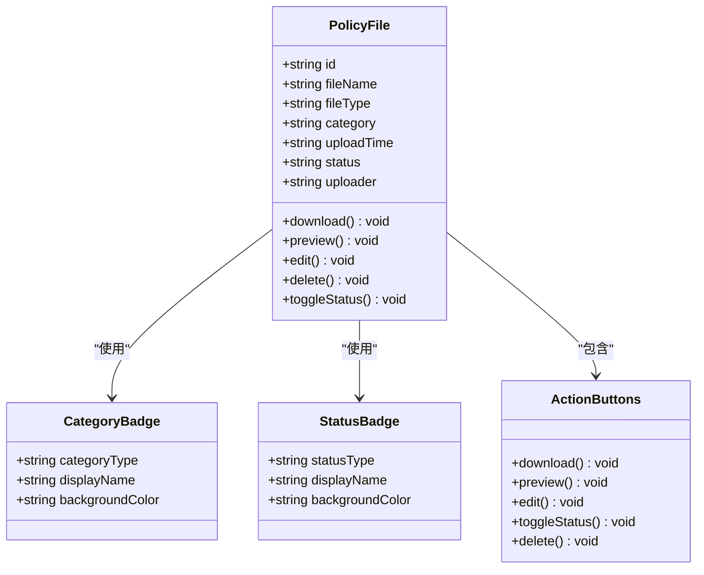
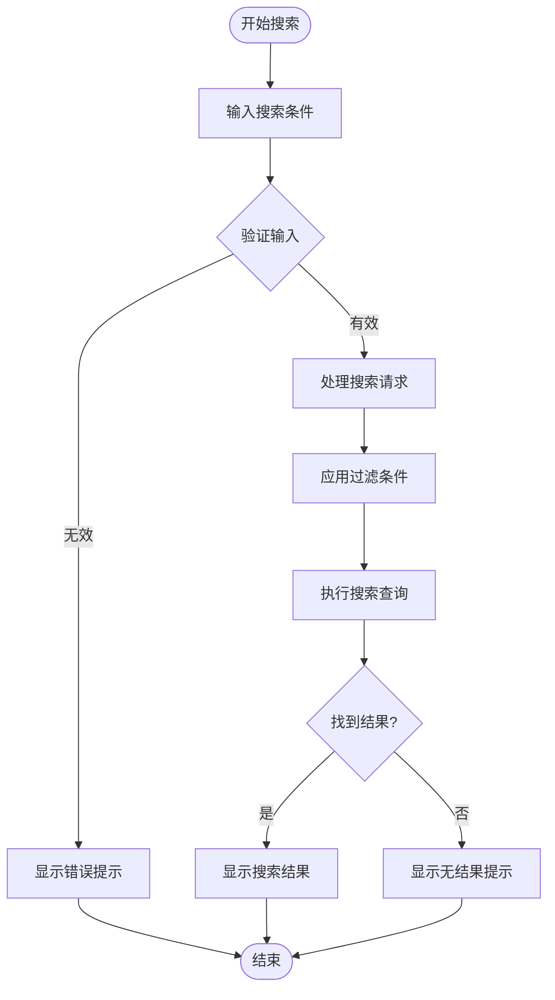
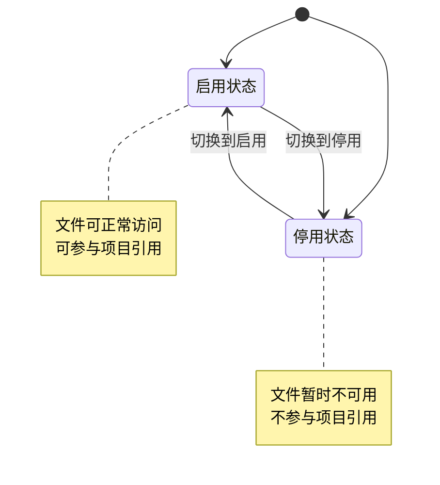
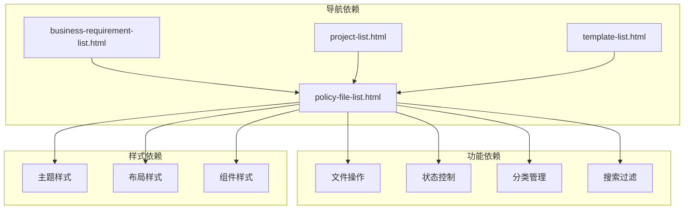

# 政策文件管理

<cite>
**本文档引用的文件**
- [policy-file-list.html](file://pages/policy-file-list.html)
- [business-requirement-list.html](file://pages/business-requirement-list.html)
- [business-requirement-generate.html](file://pages/business-requirement-generate.html)
- [business-requirement-review.html](file://pages/business-requirement-review.html)
- [project-list.html](file://pages/project-list.html)
- [project-detail.html](file://pages/project-detail.html)
- [template-list.html](file://pages/template-list.html)
</cite>

## 目录
1. [简介](#简介)
2. [项目结构](#项目结构)
3. [核心组件](#核心组件)
4. [架构概览](#架构概览)
5. [详细组件分析](#详细组件分析)
6. [依赖关系分析](#依赖关系分析)
7. [性能考虑](#性能考虑)
8. [故障排除指南](#故障排除指南)
9. [结论](#结论)

## 简介

政策文件管理系统是招标文件生成系统的重要组成部分，负责维护和管理各类政策法规文件。该系统提供了完整的文件生命周期管理功能，包括文件上传、分类管理、状态控制、搜索过滤等核心功能。系统采用现代化的Web技术栈构建，具有响应式设计和深色/浅色主题切换功能。

## 项目结构

政策文件管理功能位于系统的页面层，通过HTML页面实现用户界面和交互逻辑。整个项目采用模块化的设计思路，各个功能页面相互独立又保持一致的用户体验。

**图表来源**
- [policy-file-list.html:700-705](file://pages/policy-file-list.html#L700-L705)
- [business-requirement-list.html:514](file://pages/business-requirement-list.html#L514)
- [project-list.html:514](file://pages/project-list.html#L514)

**章节来源**
- [policy-file-list.html:1-1106](file://pages/policy-file-list.html#L1-L1106)

## 核心组件

政策文件管理系统包含以下核心组件：

### 1. 文件上传组件
- 支持PDF、DOCX、XLSX格式文件
- 单文件大小限制20MB
- 拖拽上传和点击上传两种方式
- 文件元数据收集（名称、分类、描述）

### 2. 文件列表组件
- 分页显示所有政策文件
- 实时搜索和过滤功能
- 文件状态可视化展示
- 操作按钮集成（下载、预览、编辑、删除）

### 3. 分类管理系统
- 法律法规分类
- 规章制度分类  
- 政策文件分类

### 4. 状态控制系统
- 启用/停用状态切换
- 状态可视化标识
- 影响范围控制

**章节来源**
- [policy-file-list.html:734-763](file://pages/policy-file-list.html#L734-L763)
- [policy-file-list.html:970-1012](file://pages/policy-file-list.html#L970-L1012)

## 架构概览

系统采用前后端分离的架构设计，前端使用纯HTML/CSS/JavaScript实现，后端通过模拟接口提供数据服务。

**图表来源**
- [policy-file-list.html:1014-1104](file://pages/policy-file-list.html#L1014-L1104)

## 详细组件分析

### 文件上传界面

文件上传界面提供了完整的文件上传功能，支持多种文件格式和大小限制。

#### 上传界面布局
- 文件名称输入框
- 文件分类选择器
- 文件选择区域
- 文件描述文本域
- 提交和取消按钮

#### 支持的文件格式
- PDF格式：用于法律条文、政策文件
- DOCX格式：用于规章制度、操作手册
- XLSX格式：用于统计数据、报表模板

#### 文件大小限制
- 单个文件最大20MB
- 超过限制将显示错误提示

**图表来源**
- [policy-file-list.html:970-1012](file://pages/policy-file-list.html#L970-L1012)
- [policy-file-list.html:1090-1095](file://pages/policy-file-list.html#L1090-L1095)

**章节来源**
- [policy-file-list.html:970-1012](file://pages/policy-file-list.html#L970-L1012)

### 文件列表展示

文件列表界面提供了直观的文件信息展示和操作功能。

#### 列表字段说明
- 序号：文件在列表中的编号
- 文件名称：可点击的文件链接
- 文件分类：以颜色标签显示分类
- 文件类型：PDF/DOCX/XLSX
- 上传时间：文件上传的具体时间
- 状态：启用/停用状态
- 上传人：文件上传者信息
- 操作：文件相关操作按钮

#### 状态标识系统
- 启用状态：绿色背景，表示文件当前有效
- 停用状态：灰色背景，表示文件暂时无效

#### 分类标识系统
- 法律法规：蓝色背景标签
- 规章制度：绿色背景标签  
- 政策文件：橙色背景标签

**图表来源**
- [policy-file-list.html:780-955](file://pages/policy-file-list.html#L780-L955)

**章节来源**
- [policy-file-list.html:780-955](file://pages/policy-file-list.html#L780-L955)

### 搜索过滤功能

系统提供了强大的搜索和过滤功能，帮助用户快速定位所需的政策文件。

#### 过滤条件
- 关键词搜索：支持按文件名称和内容搜索
- 文件分类：按法律法规、规章制度、政策文件分类过滤
- 状态过滤：按启用/停用状态过滤

#### 搜索算法
- 支持模糊匹配
- 多条件组合搜索
- 实时搜索结果更新

**图表来源**
- [policy-file-list.html:1014-1028](file://pages/policy-file-list.html#L1014-L1028)

**章节来源**
- [policy-file-list.html:1014-1028](file://pages/policy-file-list.html#L1014-L1028)

### 文件状态管理

文件状态管理系统允许管理员对政策文件进行启用/停用控制。

#### 状态切换流程
1. 点击状态切换按钮
2. 系统弹出确认对话框
3. 确认后执行状态切换
4. 页面自动刷新显示新状态

#### 状态影响范围
- 启用状态：文件可在系统中正常使用
- 停用状态：文件暂时不可用，但保留历史记录

**图表来源**
- [policy-file-list.html:1058-1063](file://pages/policy-file-list.html#L1058-L1063)

**章节来源**
- [policy-file-list.html:1058-1063](file://pages/policy-file-list.html#L1058-L1063)

## 依赖关系分析

政策文件管理功能与系统其他模块存在紧密的依赖关系。

**图表来源**
- [policy-file-list.html:700-705](file://pages/policy-file-list.html#L700-L705)
- [business-requirement-list.html:514](file://pages/business-requirement-list.html#L514)
- [project-list.html:514](file://pages/project-list.html#L514)

**章节来源**
- [policy-file-list.html:700-705](file://pages/policy-file-list.html#L700-L705)

## 性能考虑

系统在设计时充分考虑了性能优化：

### 前端性能优化
- 使用CSS变量实现主题切换，避免重复渲染
- 图标使用SVG格式，保证清晰度同时减小体积
- 按需加载JavaScript功能，减少初始加载时间

### 用户体验优化
- 实时搜索功能，提升查找效率
- 分页显示大量数据，避免页面卡顿
- 响应式设计，适配不同设备

## 故障排除指南

### 常见问题及解决方案

#### 文件上传失败
**问题现象**：文件上传后无响应或显示错误
**可能原因**：
- 文件格式不支持
- 文件大小超过限制
- 网络连接异常

**解决步骤**：
1. 检查文件格式是否为PDF/DOCX/XLSX
2. 确认文件大小不超过20MB
3. 刷新页面重新尝试上传

#### 搜索结果异常
**问题现象**：搜索无结果或结果不准确
**解决步骤**：
1. 检查搜索关键词是否正确
2. 尝试简化搜索条件
3. 清除浏览器缓存后重试

#### 状态切换无效
**问题现象**：点击启用/停用按钮无反应
**解决步骤**：
1. 确认网络连接正常
2. 刷新页面查看状态是否更新
3. 检查浏览器JavaScript是否被禁用

**章节来源**
- [policy-file-list.html:1046-1069](file://pages/policy-file-list.html#L1046-L1069)

## 结论

政策文件管理系统是一个功能完整、界面友好的文件管理解决方案。系统提供了完善的文件上传、分类管理、状态控制和搜索过滤功能，能够满足管理员日常维护政策文件的各种需求。

### 主要优势
- **用户友好**：直观的界面设计和操作流程
- **功能完善**：覆盖文件管理的全生命周期
- **扩展性强**：模块化设计便于功能扩展
- **性能稳定**：优化的前端架构确保良好体验

### 发展建议
- 增加文件版本管理功能
- 完善权限控制机制
- 添加文件预览功能
- 优化移动端用户体验

该系统为招标文件生成提供了坚实的政策文件基础，是整个系统不可或缺的重要组成部分。