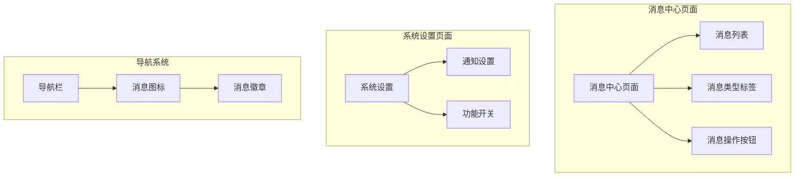
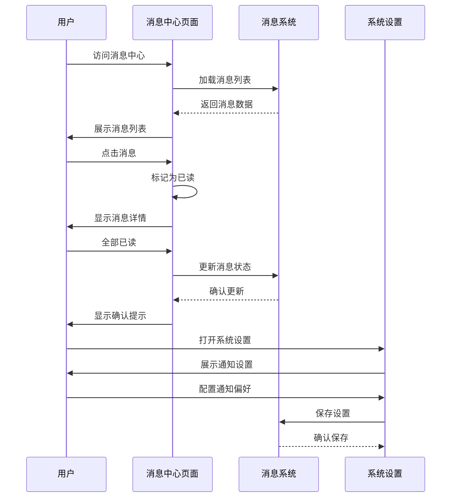
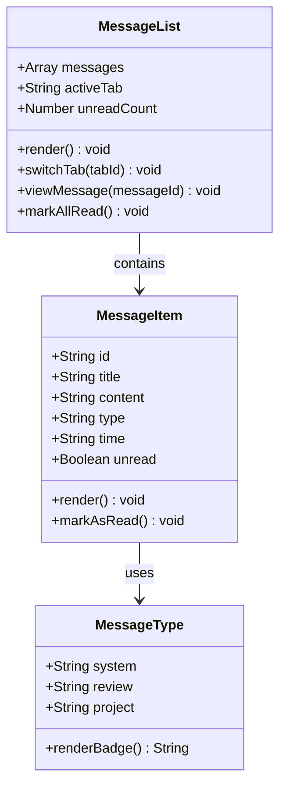
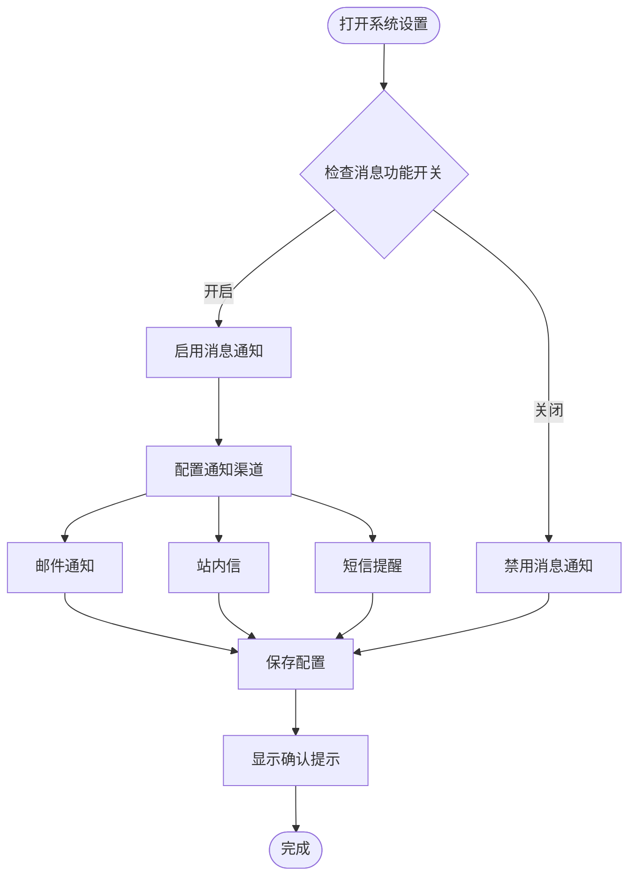
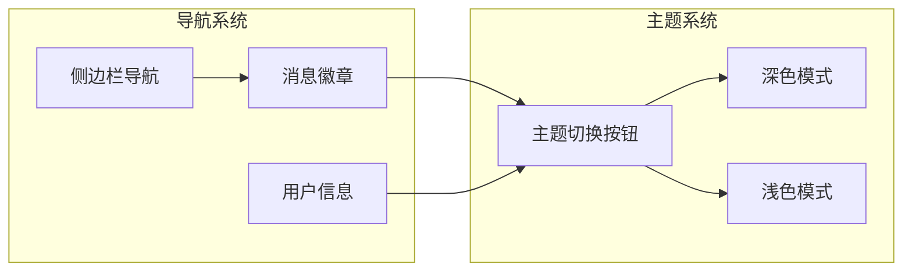
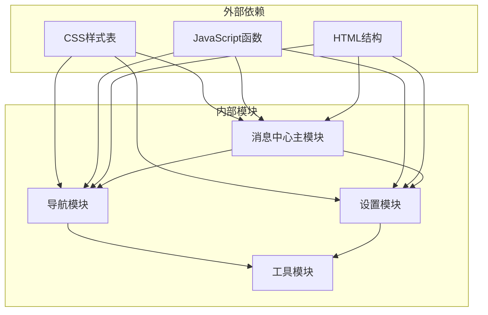

# 消息中心

<cite>
**本文引用的文件**
- [message-center.html](file://pages/message-center.html)
- [system-settings.html](file://pages/system-settings.html)
- [business-requirement-create.html](file://pages/business-requirement-create.html)
- [project-list.html](file://pages/project-list.html)
</cite>

## 目录
1. [简介](#简介)
2. [项目结构](#项目结构)
3. [核心组件](#核心组件)
4. [架构概览](#架构概览)
5. [详细组件分析](#详细组件分析)
6. [依赖关系分析](#依赖关系分析)
7. [性能考虑](#性能考虑)
8. [故障排除指南](#故障排除指南)
9. [结论](#结论)
10. [附录](#附录)

## 简介
消息中心是招标文件生成系统中的重要功能模块，负责统一管理系统的消息通知、消息查看、消息分类和消息设置。该模块提供了完整的消息生命周期管理，包括消息的接收、展示、分类、标记已读、批量操作等功能，并支持用户个性化通知偏好的配置。

## 项目结构
消息中心功能主要分布在以下文件中：
- 页面级组件：消息中心页面、系统设置页面
- 功能级组件：消息列表、消息类型标签、消息操作按钮
- 样式级组件：主题切换、响应式布局、消息样式

**图表来源**
- [message-center.html:432-721](file://pages/message-center.html#L432-L721)
- [system-settings.html:555-587](file://pages/system-settings.html#L555-L587)

**章节来源**
- [message-center.html:1-783](file://pages/message-center.html#L1-L783)
- [system-settings.html:1-1025](file://pages/system-settings.html#L1-L1025)

## 核心组件
消息中心包含以下核心组件：

### 消息列表组件
- 支持多种消息类型的分类展示
- 实时显示未读消息数量
- 提供消息状态的视觉反馈

### 消息类型系统
- 系统通知：系统维护、版本更新等系统级消息
- 检测通知：项目检测结果、审核状态等
- 项目通知：项目创建、进度更新等项目相关信息

### 操作控制组件
- 全部已读功能
- 消息分类筛选
- 主题切换功能

**章节来源**
- [message-center.html:303-406](file://pages/message-center.html#L303-L406)
- [message-center.html:369-390](file://pages/message-center.html#L369-L390)
- [message-center.html:469-475](file://pages/message-center.html#L469-L475)

## 架构概览
消息中心采用前端单页应用架构，结合HTML、CSS和JavaScript实现完整的消息管理功能。

**图表来源**
- [message-center.html:723-780](file://pages/message-center.html#L723-L780)
- [system-settings.html:795-800](file://pages/system-settings.html#L795-L800)

## 详细组件分析

### 消息列表组件分析
消息列表是消息中心的核心展示组件，采用卡片式设计，支持多种交互功能。

**图表来源**
- [message-center.html:490-718](file://pages/message-center.html#L490-L718)
- [message-center.html:369-390](file://pages/message-center.html#L369-L390)

#### 消息类型分类系统
系统支持三种主要的消息类型，每种类型都有独特的视觉标识和处理逻辑：

| 消息类型 | CSS类名 | 颜色标识 | 用途 |
|---------|---------|----------|------|
| 系统通知 | `.message-type.system` | 蓝色系 | 系统维护、版本更新、平台公告 |
| 检测通知 | `.message-type.review` | 橙色系 | 项目检测结果、审核状态 |
| 项目通知 | `.message-type.project` | 绿色系 | 项目创建、进度更新、状态变更 |

#### 消息状态管理
消息采用双层状态管理机制：
- **视觉状态**：通过CSS类名控制外观变化
- **逻辑状态**：通过JavaScript函数管理消息状态

**章节来源**
- [message-center.html:377-390](file://pages/message-center.html#L377-L390)
- [message-center.html:323-325](file://pages/message-center.html#L323-L325)
- [message-center.html:732-742](file://pages/message-center.html#L732-L742)

### 通知设置组件分析
系统设置页面提供了消息通知的全局配置功能。

**图表来源**
- [system-settings.html:795-800](file://pages/system-settings.html#L795-L800)

#### 通知渠道配置
系统支持多种通知渠道的配置，用户可以根据个人偏好选择合适的通知方式。

**章节来源**
- [system-settings.html:795-800](file://pages/system-settings.html#L795-L800)

### 导航与主题系统
消息中心集成了完整的导航系统和主题切换功能。

**图表来源**
- [message-center.html:433-463](file://pages/message-center.html#L433-L463)
- [message-center.html:407-427](file://pages/message-center.html#L407-L427)

**章节来源**
- [message-center.html:407-427](file://pages/message-center.html#L407-L427)
- [message-center.html:433-463](file://pages/message-center.html#L433-L463)

## 依赖关系分析
消息中心功能模块之间的依赖关系如下：

**图表来源**
- [message-center.html:7-427](file://pages/message-center.html#L7-L427)
- [system-settings.html:7-550](file://pages/system-settings.html#L7-L550)

### 组件耦合度分析
- **低耦合设计**：各功能模块相对独立，便于维护和扩展
- **事件驱动**：通过JavaScript事件处理实现模块间通信
- **样式隔离**：CSS变量和作用域限定避免样式冲突

**章节来源**
- [message-center.html:723-780](file://pages/message-center.html#L723-L780)
- [system-settings.html:551-550](file://pages/system-settings.html#L551-L550)

## 性能考虑
消息中心在设计时充分考虑了性能优化：

### 前端性能优化
- **懒加载机制**：消息内容按需加载，减少初始渲染时间
- **虚拟滚动**：长列表采用虚拟滚动技术，提升大数据量场景下的性能
- **事件委托**：使用事件委托减少DOM事件监听器数量

### 样式性能优化
- **CSS变量缓存**：通过CSS自定义属性实现主题快速切换
- **最小化重绘**：避免频繁的DOM操作导致的重排重绘
- **响应式设计**：适配不同屏幕尺寸，提升移动端用户体验

## 故障排除指南

### 常见问题及解决方案

#### 消息无法标记为已读
**问题现象**：点击消息后未显示已读状态
**可能原因**：
- JavaScript函数未正确绑定
- DOM元素选择器错误
- 浏览器兼容性问题

**解决步骤**：
1. 检查viewMessage函数是否正确执行
2. 验证DOM元素是否存在
3. 确认浏览器控制台无JavaScript错误

#### 消息徽章显示异常
**问题现象**：消息数量徽章显示不正确
**可能原因**：
- 未读消息计数逻辑错误
- 徽章元素未正确更新
- 页面刷新后状态丢失

**解决步骤**：
1. 检查markAllRead函数的徽章更新逻辑
2. 验证消息计数的计算方法
3. 确认状态持久化机制

#### 主题切换失效
**问题现象**：主题切换按钮无响应
**可能原因**：
- toggleTheme函数未正确实现
- CSS变量未正确设置
- 浏览器不支持CSS变量

**解决步骤**：
1. 检查toggleTheme函数的实现
2. 验证CSS变量的兼容性
3. 确认浏览器支持情况

**章节来源**
- [message-center.html:732-760](file://pages/message-center.html#L732-L760)
- [message-center.html:762-779](file://pages/message-center.html#L762-L779)

## 结论
消息中心作为招标文件生成系统的重要组成部分，提供了完整的消息管理解决方案。通过模块化的架构设计、丰富的功能特性和良好的用户体验，有效提升了系统的消息处理能力和用户满意度。

### 主要优势
- **功能完整性**：涵盖消息的接收、查看、分类、标记、设置等全流程
- **用户体验友好**：直观的界面设计和流畅的交互体验
- **扩展性强**：模块化设计便于后续功能扩展和维护
- **性能优化**：采用多种前端优化技术确保良好性能表现

### 改进建议
- 增加消息搜索和过滤功能
- 实现消息历史的分页加载
- 添加消息导出功能
- 优化移动端响应式设计

## 附录

### 使用指南

#### 用户操作指南
1. **查看消息**：点击左侧导航栏的"消息中心"进入消息页面
2. **分类浏览**：使用顶部标签切换不同的消息类型
3. **标记已读**：点击具体消息或使用"全部已读"功能
4. **配置通知**：通过系统设置页面配置个人通知偏好

#### 管理员操作指南
1. **消息监控**：定期检查各类消息的发送情况
2. **用户管理**：通过系统设置页面管理用户通知权限
3. **功能配置**：根据需要调整消息功能的启用状态
4. **性能监控**：关注消息系统的性能指标和用户反馈

### 技术规范
- **浏览器兼容性**：支持主流现代浏览器
- **响应式设计**：适配桌面端和移动端设备
- **可访问性**：遵循WCAG 2.1可访问性标准
- **安全性**：确保消息内容的安全传输和存储