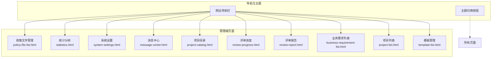
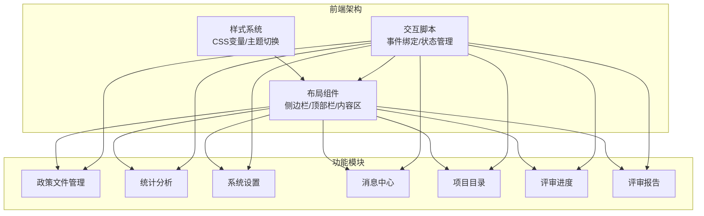
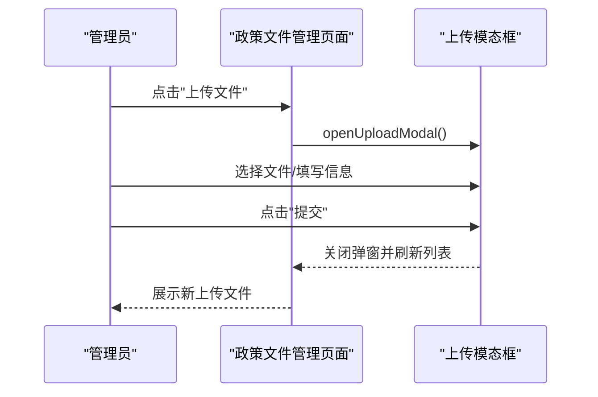
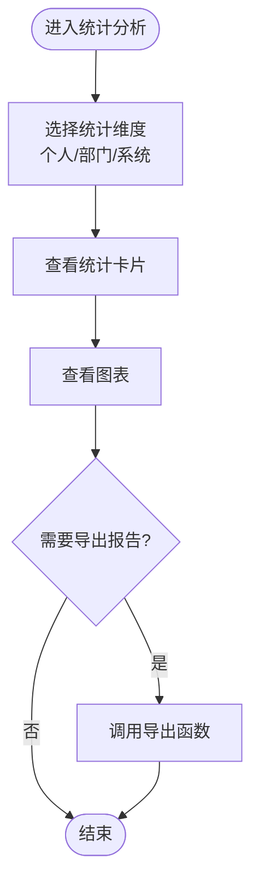
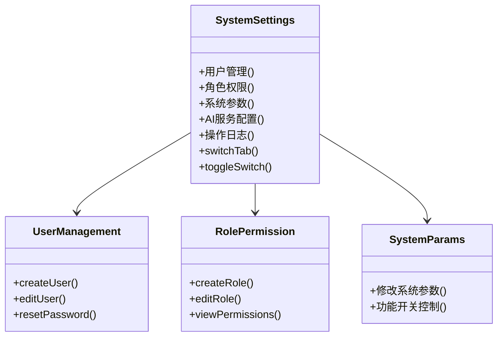
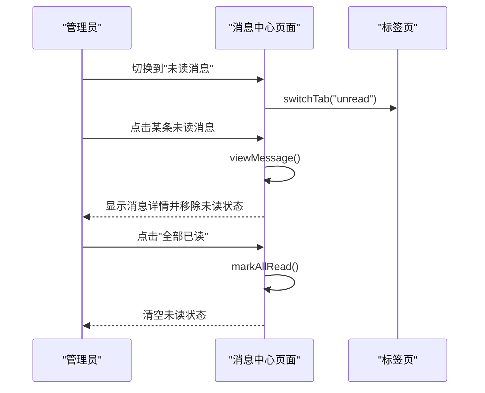
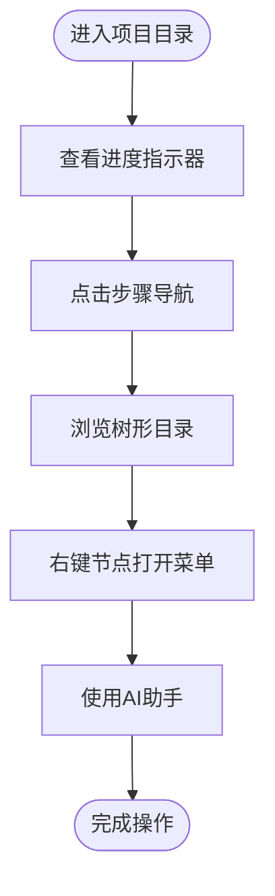
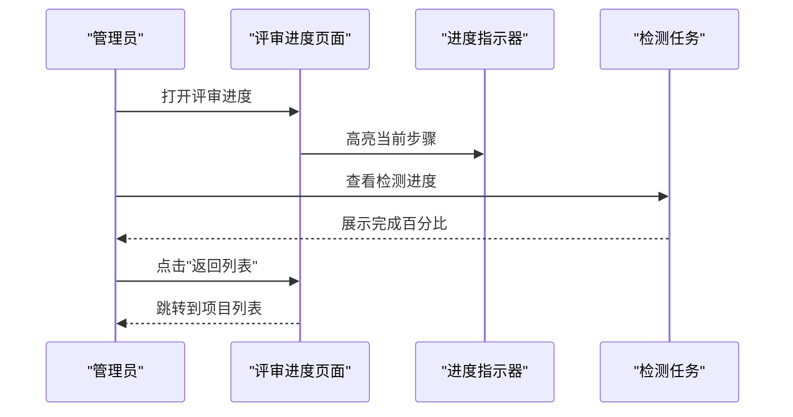
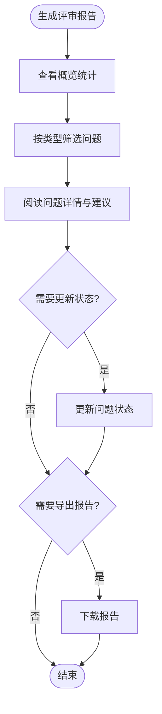
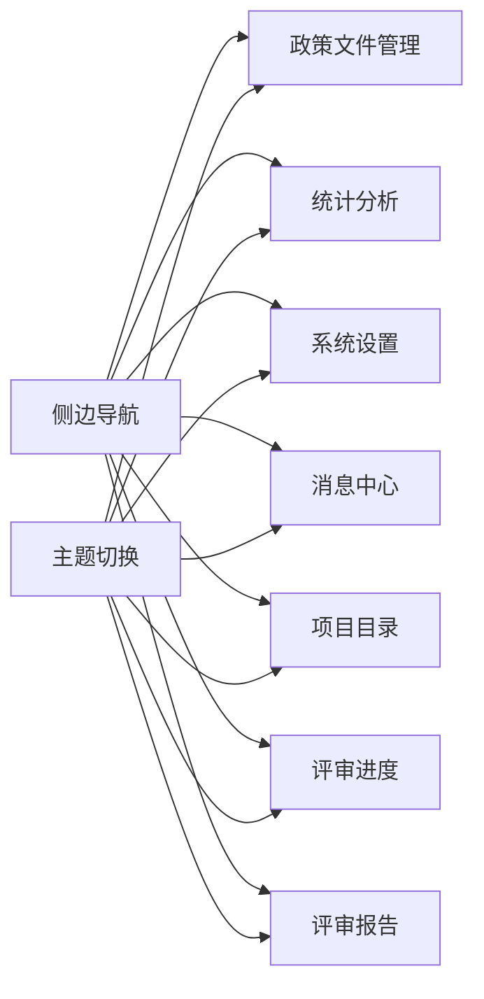

# 系统管理

<cite>
**本文档引用的文件**
- [policy-file-list.html](file://pages/policy-file-list.html)
- [statistics.html](file://pages/statistics.html)
- [system-settings.html](file://pages/system-settings.html)
- [message-center.html](file://pages/message-center.html)
- [project-catalog.html](file://pages/project-catalog.html)
- [review-progress.html](file://pages/review-progress.html)
- [review-report.html](file://pages/review-report.html)
- [business-requirement-list.html](file://pages/business-requirement-list.html)
- [project-list.html](file://pages/project-list.html)
- [template-list.html](file://pages/template-list.html)
</cite>

## 目录
1. [引言](#引言)
2. [项目结构](#项目结构)
3. [核心组件](#核心组件)
4. [架构概览](#架构概览)
5. [详细组件分析](#详细组件分析)
6. [依赖分析](#依赖分析)
7. [性能考虑](#性能考虑)
8. [故障排除指南](#故障排除指南)
9. [结论](#结论)
10. [附录](#附录)

## 引言
本文件面向系统管理员，系统性梳理"系统管理模块"的功能范围与操作流程，覆盖政策文件管理、统计分析、系统设置、消息中心、项目目录、评审进度跟踪与评审报告生成等核心功能。文档基于前端页面实现进行功能说明，帮助管理员快速掌握各模块的配置方法、操作步骤与最佳实践。

## 项目结构
系统采用多页面单页应用风格，管理端各功能以独立HTML页面呈现，统一使用深色/浅色主题切换机制与侧边导航栏，便于在不同功能间跳转与操作。

**图表来源**
- [policy-file-list.html](file://pages/policy-file-list.html)
- [statistics.html](file://pages/statistics.html)
- [system-settings.html](file://pages/system-settings.html)
- [message-center.html](file://pages/message-center.html)
- [project-catalog.html](file://pages/project-catalog.html)
- [review-progress.html](file://pages/review-progress.html)
- [review-report.html](file://pages/review-report.html)
- [business-requirement-list.html](file://pages/business-requirement-list.html)
- [project-list.html](file://pages/project-list.html)
- [template-list.html](file://pages/template-list.html)

**章节来源**
- [policy-file-list.html](file://pages/policy-file-list.html)
- [statistics.html](file://pages/statistics.html)
- [system-settings.html](file://pages/system-settings.html)
- [message-center.html](file://pages/message-center.html)
- [project-catalog.html](file://pages/project-catalog.html)
- [review-progress.html](file://pages/review-progress.html)
- [review-report.html](file://pages/review-report.html)
- [business-requirement-list.html](file://pages/business-requirement-list.html)
- [project-list.html](file://pages/project-list.html)
- [template-list.html](file://pages/template-list.html)

## 核心组件
- 政策文件管理：支持政策文件的上传、分类筛选、状态管理与分页展示，提供文件版本化与状态标识。
- 统计分析：提供个人/部门/系统三个维度的统计卡片、趋势图表与报表导出能力。
- 系统设置：涵盖用户管理、角色权限、系统参数、AI服务配置与操作日志等后台配置。
- 消息中心：集中展示系统通知、检测通知与项目通知，支持按类型筛选与批量标记已读。
- 项目目录：提供项目流程进度指示器、步骤导航与树形目录结构，支持上下文菜单与悬浮AI助手。
- 评审进度：展示智能检测的步骤流程、实时状态与单项检测进度条，支持返回列表。
- 评审报告：汇总检测结果、问题分类与处理建议，支持问题状态与严重程度标注。

**章节来源**
- [policy-file-list.html](file://pages/policy-file-list.html)
- [statistics.html](file://pages/statistics.html)
- [system-settings.html](file://pages/system-settings.html)
- [message-center.html](file://pages/message-center.html)
- [project-catalog.html](file://pages/project-catalog.html)
- [review-progress.html](file://pages/review-progress.html)
- [review-report.html](file://pages/review-report.html)

## 架构概览
系统采用静态页面+本地交互脚本的前端架构，页面内通过JavaScript函数实现筛选、切换、状态更新与主题切换等交互逻辑。各模块页面共享统一的布局结构与样式变量，确保视觉一致性与可维护性。

**图表来源**
- [policy-file-list.html](file://pages/policy-file-list.html)
- [statistics.html](file://pages/statistics.html)
- [system-settings.html](file://pages/system-settings.html)
- [message-center.html](file://pages/message-center.html)
- [project-catalog.html](file://pages/project-catalog.html)
- [review-progress.html](file://pages/review-progress.html)
- [review-report.html](file://pages/review-report.html)

## 详细组件分析

### 政策文件管理
- 功能要点
  - 文件上传：支持拖拽上传与点击选择，包含文件名、类型、分类、状态等字段展示。
  - 筛选与查询：支持按文件名关键词、文件分类（法律法规/规章制度/政策文件）进行筛选。
  - 列表管理：提供启用/禁用状态标识、操作按钮（编辑/删除/预览），支持分页导航。
- 操作流程
  1) 进入页面后，使用筛选条件缩小范围；
  2) 点击"上传文件"打开上传模态框，选择文件并填写必要信息；
  3) 查看上传列表，对文件进行状态管理与操作。
- 关键交互
  - openUploadModal()：打开上传弹窗
  - searchFiles()/resetFilters()：查询与重置筛选
  - 分页控件：页码切换与信息提示

**图表来源**
- [policy-file-list.html](file://pages/policy-file-list.html)

**章节来源**
- [policy-file-list.html](file://pages/policy-file-list.html)

### 统计分析
- 功能要点
  - 多维度统计：个人统计、部门统计、系统统计三类卡片展示关键指标。
  - 图表可视化：包含趋势图与分布图，直观反映数据变化。
  - 报表导出：提供导出报告按钮，便于离线存档与分享。
- 操作流程
  1) 在标签页间切换查看不同维度统计；
  2) 浏览统计卡片与图表；
  3) 点击"导出报告"生成报表。
- 关键交互
  - switchTab(tabId)：切换统计维度
  - exportReport()：导出当前统计结果

**图表来源**
- [statistics.html](file://pages/statistics.html)

**章节来源**
- [statistics.html](file://pages/statistics.html)

### 系统设置
- 功能要点
  - 用户管理：用户列表、新建用户、编辑用户、重置密码等。
  - 角色权限：角色列表、新建角色、编辑角色、查看权限。
  - 系统参数：系统名称、版本、文件存储路径、最大文件大小、会话超时、检测上限等。
  - 功能开关：AI对话、智能检测、消息通知等开关控制。
  - 操作日志：记录关键操作行为，便于审计与追踪。
- 操作流程
  1) 在标签页中选择目标配置项；
  2) 填写或修改参数，保存更改；
  3) 对用户与角色进行增删改查操作。
- 关键交互
  - switchTab(tabId)：切换配置标签
  - toggleSwitch(element)：切换功能开关
  - 各种CRUD操作按钮

**图表来源**
- [system-settings.html](file://pages/system-settings.html)

**章节来源**
- [system-settings.html](file://pages/system-settings.html)

### 消息中心
- 功能要点
  - 消息分类：全部消息、未读消息、系统通知、检测通知、项目通知。
  - 消息列表：支持标记已读、查看详情、批量标记等功能。
  - 未读提醒：未读消息数量徽标与红点提示。
- 操作流程
  1) 选择消息标签页查看对应类型；
  2) 点击消息查看详情并自动标记为已读；
  3) 使用"全部已读"一键清空未读状态。
- 关键交互
  - switchTab(tabId)：切换消息类型
  - viewMessage(messageId)：查看消息详情并移除未读状态
  - markAllRead()：批量标记已读

**图表来源**
- [message-center.html](file://pages/message-center.html)

**章节来源**
- [message-center.html](file://pages/message-center.html)

### 项目目录
- 功能要点
  - 进度指示器：五步流程的完成/进行中状态展示。
  - 步骤导航：左侧步骤列表，支持点击跳转。
  - 树形目录：文件/章节的层级展开与收起。
  - 上下文菜单：右键菜单支持复制、重命名、删除等操作。
  - 悬浮AI助手：右侧浮动聊天窗口，提供智能问答与建议。
- 操作流程
  1) 查看进度指示器了解当前所处阶段；
  2) 点击步骤导航跳转到对应流程；
  3) 在树形目录中展开/折叠节点，定位文件位置；
  4) 右键节点打开上下文菜单执行操作；
  5) 使用AI助手获取智能建议。
- 关键交互
  - 进度步骤切换
  - 树节点展开/收起
  - 上下文菜单显示/隐藏
  - AI助手展开/折叠

**图表来源**
- [project-catalog.html](file://pages/project-catalog.html)

**章节来源**
- [project-catalog.html](file://pages/project-catalog.html)

### 评审进度
- 功能要点
  - 流程进度：基础信息录入、详细需求生成、评审项设置、文档集成、智能检测五个步骤。
  - 实时状态：当前步骤高亮显示，已完成步骤显示完成图标。
  - 检测状态：展示各项检测任务的完成百分比与状态。
- 操作流程
  1) 查看进度指示器确认当前步骤；
  2) 在右侧查看具体检测任务的进度；
  3) 点击"返回列表"回到项目管理界面。
- 关键交互
  - 步骤高亮与完成状态切换
  - 检测进度条动画效果
  - 返回按钮跳转

**图表来源**
- [review-progress.html](file://pages/review-progress.html)

**章节来源**
- [review-progress.html](file://pages/review-progress.html)

### 评审报告
- 功能要点
  - 概览统计：问题总数、各类问题数量与通过率等关键指标。
  - 问题分类：公平竞争、合规性、错别字等类型标签。
  - 处理建议：针对每个问题提供修复建议与严重程度标注。
  - 状态管理：接受/拒绝状态，支持问题状态变更。
- 操作流程
  1) 查看整体报告概览；
  2) 按问题类型筛选查看；
  3) 阅读问题详情与修复建议；
  4) 更新问题状态并导出报告。
- 关键交互
  - 报告概览卡片切换
  - 问题分组与展开
  - 状态更新与导出

**图表来源**
- [review-report.html](file://pages/review-report.html)

**章节来源**
- [review-report.html](file://pages/review-report.html)

## 依赖分析
- 页面间依赖
  - 侧边导航统一链接到各功能页面，形成清晰的导航关系。
  - 主题切换按钮存在于所有页面，提供一致的用户体验。
- 组件复用
  - 表格组件、分页组件、状态徽章、按钮样式在多个页面重复使用，保证视觉与交互一致性。
- 交互依赖
  - 各页面均依赖switchTab()、toggleTheme()等通用函数，减少重复代码。

**图表来源**
- [policy-file-list.html](file://pages/policy-file-list.html)
- [statistics.html](file://pages/statistics.html)
- [system-settings.html](file://pages/system-settings.html)
- [message-center.html](file://pages/message-center.html)
- [project-catalog.html](file://pages/project-catalog.html)
- [review-progress.html](file://pages/review-progress.html)
- [review-report.html](file://pages/review-report.html)

**章节来源**
- [policy-file-list.html](file://pages/policy-file-list.html)
- [statistics.html](file://pages/statistics.html)
- [system-settings.html](file://pages/system-settings.html)
- [message-center.html](file://pages/message-center.html)
- [project-catalog.html](file://pages/project-catalog.html)
- [review-progress.html](file://pages/review-progress.html)
- [review-report.html](file://pages/review-report.html)

## 性能考虑
- 页面加载优化
  - 采用静态资源与内联样式，减少HTTP请求。
  - 图表区域预留占位符，避免阻塞首屏渲染。
- 交互响应
  - 进度条与状态切换使用CSS过渡动画，保证流畅体验。
  - 分页与筛选采用前端过滤，降低服务器压力。
- 数据展示
  - 统计卡片与表格采用虚拟滚动策略，提升大数据量下的渲染性能。

## 故障排除指南
- 主题切换异常
  - 现象：点击主题切换按钮无反应
  - 排查：检查toggleTheme()函数是否被正确调用，确认CSS变量是否被正确设置
  - 处理：刷新页面后重试，如仍失败检查浏览器控制台错误
- 文件上传失败
  - 现象：上传弹窗无法打开或上传后列表不更新
  - 排查：检查openUploadModal()函数绑定，确认网络连接正常
  - 处理：清理浏览器缓存，更换浏览器重试
- 消息未读状态异常
  - 现象：点击消息后未读点未消失或"全部已读"无效
  - 排查：检查viewMessage()与markAllRead()函数逻辑
  - 处理：手动刷新页面，重新登录系统
- 评审进度卡顿
  - 现象：进度指示器切换缓慢或检测进度条不更新
  - 排查：检查动画CSS与JavaScript定时器
  - 处理：关闭其他标签页释放内存，重启浏览器

**章节来源**
- [policy-file-list.html](file://pages/policy-file-list.html)
- [message-center.html](file://pages/message-center.html)
- [review-progress.html](file://pages/review-progress.html)

## 结论
系统管理模块通过清晰的功能划分与统一的UI设计，为管理员提供了完整的后台管理能力。各模块既相对独立又相互关联，形成了从政策文件维护到评审报告输出的完整管理闭环。建议管理员根据职责分工合理使用各功能模块，并定期维护系统参数与权限配置，确保系统的稳定运行与高效管理。

## 附录
- 快速操作清单
  - 政策文件：上传/筛选/状态管理/分页查看
  - 统计分析：维度切换/图表查看/报告导出
  - 系统设置：用户管理/角色权限/参数配置/功能开关
  - 消息中心：标签切换/消息查看/批量标记
  - 项目目录：进度查看/步骤跳转/树形浏览/AI助手
  - 评审进度：步骤查看/检测监控/状态更新
  - 评审报告：概览查看/问题筛选/状态更新/报告导出