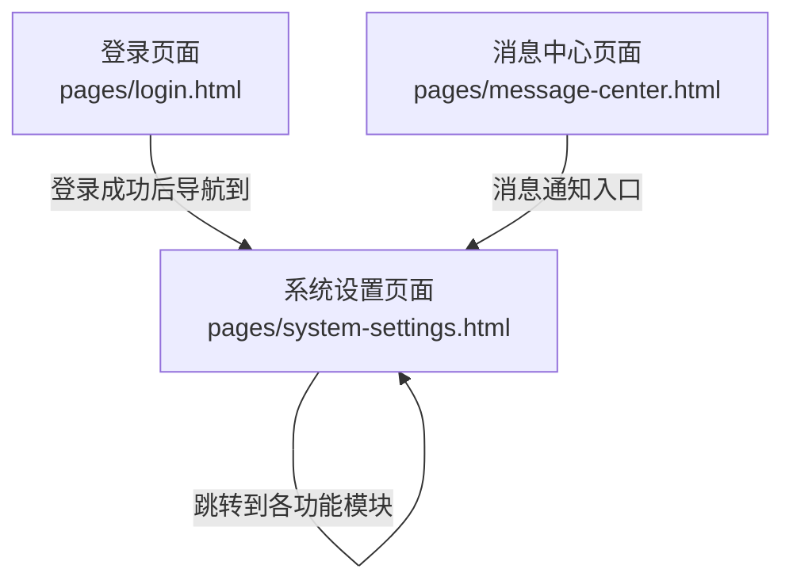
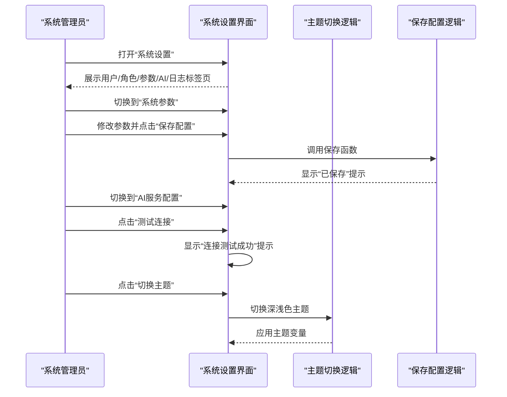
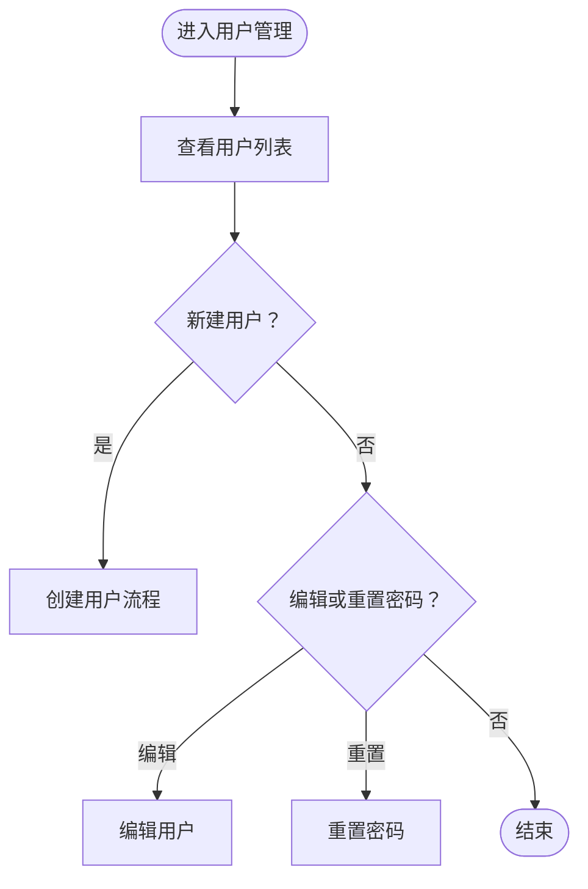
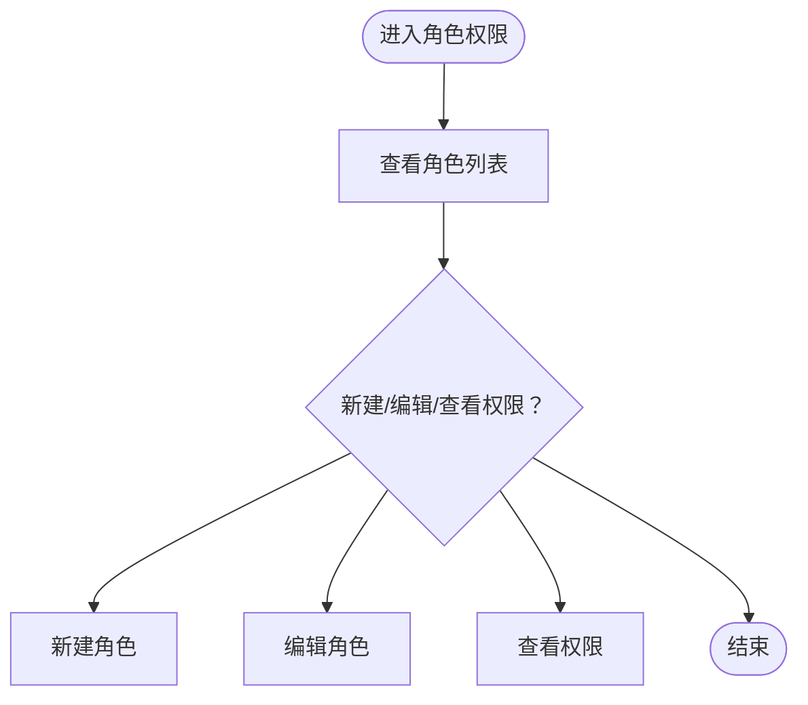
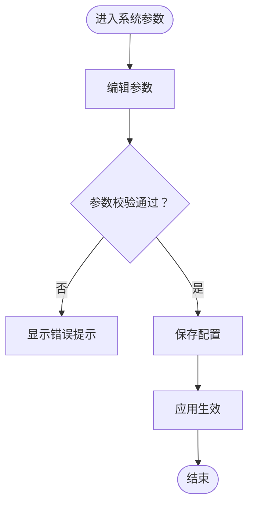
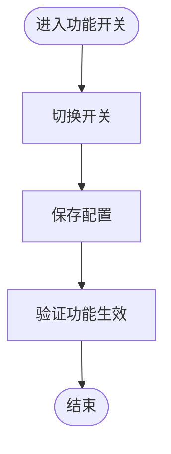
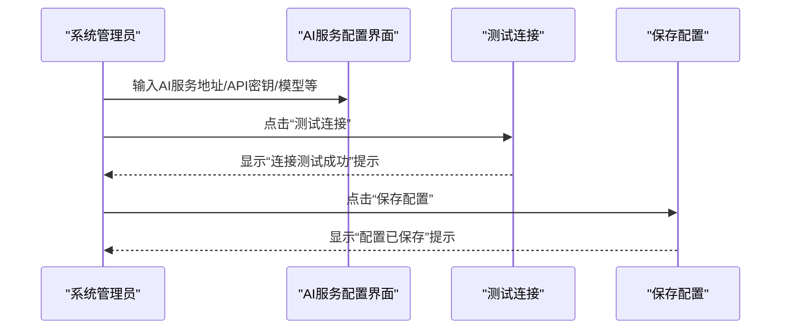
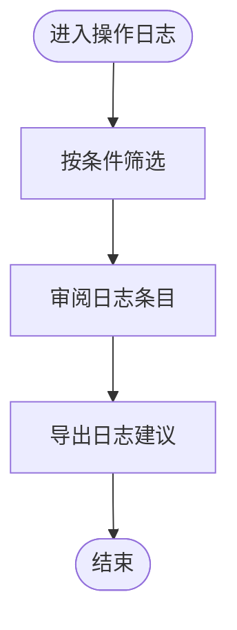
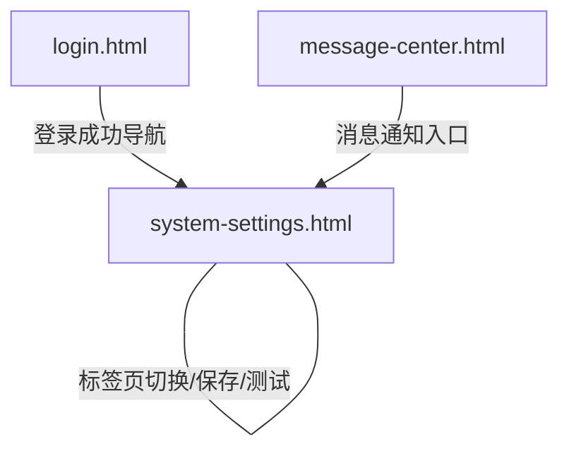

# 系统设置

<cite>
**本文引用的文件**
- [pages/system-settings.html](file://pages/system-settings.html)
- [pages/login.html](file://pages/login.html)
- [pages/message-center.html](file://pages/message-center.html)
</cite>

## 目录
1. [简介](#简介)
2. [项目结构](#项目结构)
3. [核心组件](#核心组件)
4. [架构总览](#架构总览)
5. [详细组件分析](#详细组件分析)
6. [依赖关系分析](#依赖关系分析)
7. [性能考量](#性能考量)
8. [故障排查指南](#故障排查指南)
9. [结论](#结论)
10. [附录](#附录)

## 简介
本文件面向系统管理员，提供“系统设置”功能的完整配置管理文档。内容覆盖用户与角色权限管理、系统参数配置、AI服务配置、功能开关控制、操作日志查看等模块，并给出配置变更前的备份建议、验证步骤与回滚方案，帮助管理员高效、安全地维护系统。

## 项目结构
系统设置页面位于前端静态页面目录，采用模块化标签页组织，包含用户管理、角色权限、系统参数、AI服务配置、操作日志五个主要区域。页面内嵌样式与脚本，支持主题切换、表单交互与模拟数据展示。

图表来源
- [pages/system-settings.html:555-565](file://pages/system-settings.html#L555-L565)
- [pages/login.html:318-362](file://pages/login.html#L318-L362)
- [pages/message-center.html:440-463](file://pages/message-center.html#L440-L463)

章节来源
- [pages/system-settings.html:555-565](file://pages/system-settings.html#L555-L565)

## 核心组件
- 用户管理：查看用户列表、新建用户、编辑用户、重置密码。
- 角色权限：查看角色列表、新建角色、编辑角色、查看权限。
- 系统参数：系统名称、版本、文件存储路径、最大文件大小、会话超时、检测不通过上限次数等。
- 功能开关：AI对话功能、智能检测功能、消息通知。
- AI服务配置：AI服务地址、API密钥、模型名称、温度参数、最大Token数、请求超时、检测规则。
- 操作日志：按时间、用户、操作类型、对象、详情、IP等维度查看历史记录。

章节来源
- [pages/system-settings.html:603-677](file://pages/system-settings.html#L603-L677)
- [pages/system-settings.html:680-735](file://pages/system-settings.html#L680-L735)
- [pages/system-settings.html:737-811](file://pages/system-settings.html#L737-L811)
- [pages/system-settings.html:813-879](file://pages/system-settings.html#L813-L879)
- [pages/system-settings.html:881-947](file://pages/system-settings.html#L881-L947)

## 架构总览
系统设置页面采用前端单页应用风格，通过标签页切换不同配置区域。页面内含主题切换逻辑与表单交互函数，用于演示配置保存与测试流程。

图表来源
- [pages/system-settings.html:954-960](file://pages/system-settings.html#L954-L960)
- [pages/system-settings.html:992-994](file://pages/system-settings.html#L992-L994)
- [pages/system-settings.html:996-998](file://pages/system-settings.html#L996-L998)
- [pages/system-settings.html:1004-1021](file://pages/system-settings.html#L1004-L1021)

## 详细组件分析

### 用户管理
- 功能要点
  - 查看用户列表：用户名、姓名、角色、部门、状态、创建时间。
  - 新建用户：触发创建流程。
  - 编辑用户：定位到用户编辑流程。
  - 重置密码：确认后执行重置。
- 影响范围
  - 直接影响用户访问系统与执行业务操作的能力。
  - 建议在变更用户状态或角色时同步评估其权限边界。

图表来源
- [pages/system-settings.html:603-677](file://pages/system-settings.html#L603-L677)
- [pages/system-settings.html:966-978](file://pages/system-settings.html#L966-L978)

章节来源
- [pages/system-settings.html:603-677](file://pages/system-settings.html#L603-L677)
- [pages/system-settings.html:966-978](file://pages/system-settings.html#L966-L978)

### 角色权限
- 功能要点
  - 查看角色列表：角色名称、描述、用户数量、创建时间。
  - 新建/编辑角色：进入角色配置流程。
  - 查看权限：展示角色所拥有的权限集合。
- 影响范围
  - 角色决定用户在系统中的操作边界，需与业务流程匹配。

图表来源
- [pages/system-settings.html:680-735](file://pages/system-settings.html#L680-L735)
- [pages/system-settings.html:980-990](file://pages/system-settings.html#L980-L990)

章节来源
- [pages/system-settings.html:680-735](file://pages/system-settings.html#L680-L735)
- [pages/system-settings.html:980-990](file://pages/system-settings.html#L980-L990)

### 系统参数
- 参数项
  - 系统名称：当前系统显示名称。
  - 系统版本：只读字段，标识版本号。
  - 文件存储路径：文件上传与存储根路径。
  - 最大文件大小（MB）：上传文件大小限制。
  - 会话超时时间（分钟）：用户会话有效期。
  - 检测不通过上限次数：智能检测失败累计阈值。
- 默认值与作用
  - 默认值来源于页面初始化输入框的初始值。
  - 作用：控制系统外观、文件处理能力、用户体验与安全策略。
- 安全与性能建议
  - 存储路径应指向具备写入权限且隔离的目录。
  - 文件大小限制应结合带宽与磁盘空间评估。
  - 会话超时应平衡安全与可用性。
  - 检测上限次数用于防止滥用与资源耗尽。

图表来源
- [pages/system-settings.html:737-811](file://pages/system-settings.html#L737-L811)
- [pages/system-settings.html:992-994](file://pages/system-settings.html#L992-L994)

章节来源
- [pages/system-settings.html:737-811](file://pages/system-settings.html#L737-L811)
- [pages/system-settings.html:992-994](file://pages/system-settings.html#L992-L994)

### 功能开关
- 开关项
  - 启用AI对话功能：开启后允许浮动AI对话组件。
  - 启用智能检测功能：开启后系统自动进行文档检测。
  - 启用消息通知：开启后用户接收系统消息通知。
- 影响范围
  - 影响前端交互体验与后端处理负载。
  - 建议在变更后进行功能验证与性能监控。

图表来源
- [pages/system-settings.html:772-801](file://pages/system-settings.html#L772-L801)
- [pages/system-settings.html:962-964](file://pages/system-settings.html#L962-L964)
- [pages/system-settings.html:992-994](file://pages/system-settings.html#L992-L994)

章节来源
- [pages/system-settings.html:772-801](file://pages/system-settings.html#L772-L801)
- [pages/system-settings.html:962-964](file://pages/system-settings.html#L962-L964)
- [pages/system-settings.html:992-994](file://pages/system-settings.html#L992-L994)

### AI服务配置
- 配置项
  - AI服务地址：AI服务API端点。
  - API密钥：访问AI服务的身份凭证。
  - 模型名称：使用的AI模型标识。
  - 温度参数：推理随机性控制。
  - 最大Token数：单次请求输出长度限制。
  - 请求超时时间（秒）：网络请求超时阈值。
  - 检测规则：公平竞争与合规性检查规则文本。
- 影响范围
  - 直接决定AI对话与智能检测功能的可用性与质量。
  - 密钥与地址需严格保密，避免泄露。
- 测试与验证
  - 使用“测试连接”按钮验证连通性与鉴权。
  - 保存配置后进行端到端功能验证。

图表来源
- [pages/system-settings.html:813-879](file://pages/system-settings.html#L813-L879)
- [pages/system-settings.html:996-998](file://pages/system-settings.html#L996-L998)
- [pages/system-settings.html:1000-1002](file://pages/system-settings.html#L1000-L1002)

章节来源
- [pages/system-settings.html:813-879](file://pages/system-settings.html#L813-L879)
- [pages/system-settings.html:996-998](file://pages/system-settings.html#L996-L998)
- [pages/system-settings.html:1000-1002](file://pages/system-settings.html#L1000-L1002)

### 操作日志
- 日志内容
  - 时间、用户、操作类型、操作对象、操作详情、IP地址。
- 用途
  - 追踪系统变更与异常行为，辅助审计与问题定位。
- 建议
  - 结合日志定期审查高风险操作。
  - 对异常频繁的操作类型进行关注与告警。

图表来源
- [pages/system-settings.html:881-947](file://pages/system-settings.html#L881-L947)

章节来源
- [pages/system-settings.html:881-947](file://pages/system-settings.html#L881-L947)

## 依赖关系分析
- 页面内联样式与脚本：系统设置页面自包含样式与交互逻辑，便于独立部署与维护。
- 主题切换：通过修改CSS变量实现深浅主题切换，无需外部依赖。
- 导航与跳转：页面内通过事件绑定实现标签页切换与功能入口跳转。
- 外部依赖：AI服务配置依赖后端AI服务端点与鉴权机制，需确保网络可达与凭据正确。

图表来源
- [pages/system-settings.html:954-960](file://pages/system-settings.html#L954-L960)
- [pages/login.html:318-362](file://pages/login.html#L318-L362)
- [pages/message-center.html:440-463](file://pages/message-center.html#L440-L463)

章节来源
- [pages/system-settings.html:954-960](file://pages/system-settings.html#L954-L960)
- [pages/login.html:318-362](file://pages/login.html#L318-L362)
- [pages/message-center.html:440-463](file://pages/message-center.html#L440-L463)

## 性能考量
- 文件上传性能
  - 合理设置最大文件大小与存储路径，避免磁盘IO瓶颈。
  - 在高并发场景下考虑分片上传与断点续传策略。
- 会话与超时
  - 会话超时时间过短影响用户体验，过长增加安全风险。
  - 建议结合业务场景与安全策略动态调整。
- AI服务性能
  - 请求超时与最大Token数直接影响响应速度与成本。
  - 建议对高频调用进行缓存与限流控制。
- 日志与审计
  - 大量日志可能带来存储压力，建议定期归档与清理。

## 故障排查指南
- AI服务无法连接
  - 步骤：检查AI服务地址与API密钥是否正确；使用“测试连接”验证；确认网络连通性与防火墙策略。
  - 回滚：恢复上一次保存的配置或回退到默认值。
- 参数保存无效
  - 步骤：确认参数格式与取值范围；检查浏览器控制台是否有错误；重新保存并刷新页面。
  - 回滚：恢复到上一次有效配置。
- 功能开关未生效
  - 步骤：确认开关状态已保存；刷新页面后再次验证；检查前端脚本是否正常执行。
- 主题切换异常
  - 步骤：检查CSS变量是否被覆盖；尝试清除浏览器缓存；更换浏览器测试。
- 消息通知不显示
  - 步骤：确认“启用消息通知”开关已打开；检查消息中心页面是否正常加载；核对用户权限。

章节来源
- [pages/system-settings.html:996-998](file://pages/system-settings.html#L996-L998)
- [pages/system-settings.html:1004-1021](file://pages/system-settings.html#L1004-L1021)
- [pages/system-settings.html:992-994](file://pages/system-settings.html#L992-L994)

## 结论
系统设置页面提供了完整的配置管理入口，涵盖用户与角色、系统参数、功能开关、AI服务配置与操作日志等关键领域。管理员应遵循“先备份、再验证、后回滚”的变更流程，结合安全与性能建议，确保系统稳定运行与持续优化。

## 附录
- 配置变更建议流程
  - 变更前：备份当前配置与日志；记录变更清单。
  - 变更中：逐项修改并保存；使用测试功能验证。
  - 变更后：进行端到端功能验证；观察系统性能指标。
  - 回滚：若出现异常，立即恢复备份配置；必要时回退到上一个稳定版本。