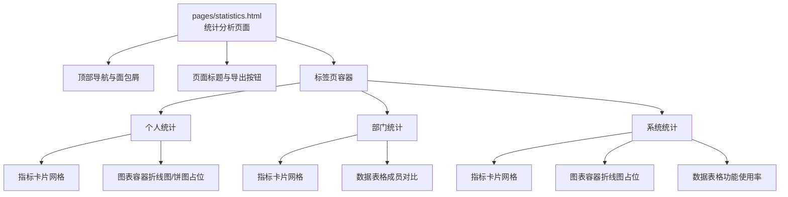
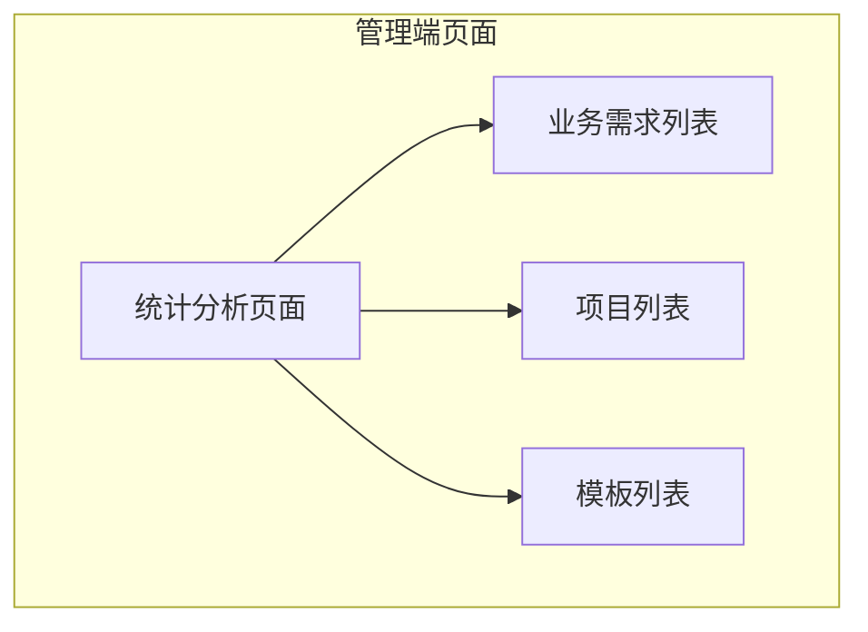
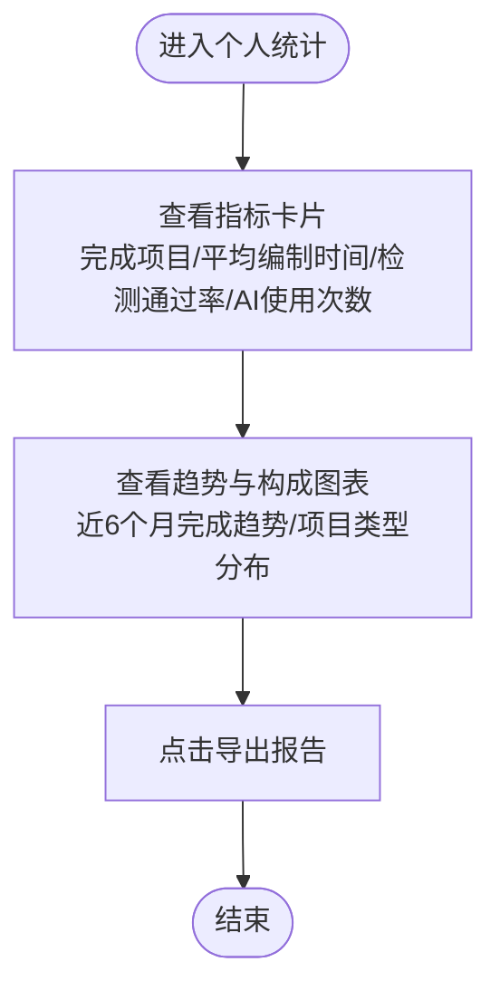
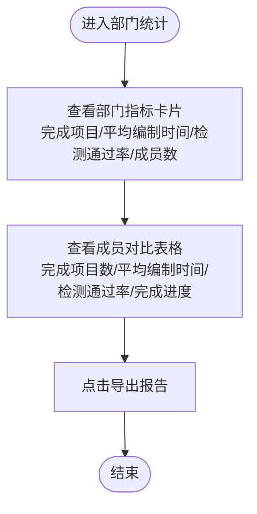
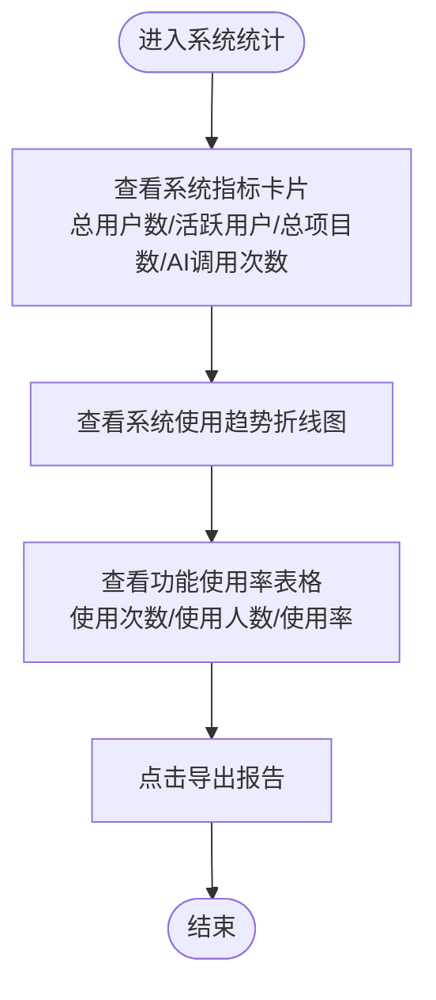
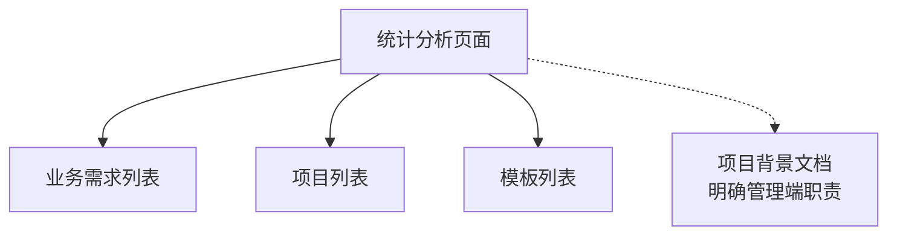

# 统计分析

<cite>
**本文引用的文件**
- [statistics.html](file://pages/statistics.html)
- [business-requirement-list.html](file://pages/business-requirement-list.html)
- [project-list.html](file://pages/project-list.html)
- [2026-04-10-招标文件AI编制会议纪要.md](file://2026-04-10-招标文件AI编制会议纪要.md)
</cite>

## 目录
1. [简介](#简介)
2. [项目结构](#项目结构)
3. [核心组件](#核心组件)
4. [架构总览](#架构总览)
5. [详细组件分析](#详细组件分析)
6. [依赖关系分析](#依赖关系分析)
7. [性能考量](#性能考量)
8. [故障排查指南](#故障排查指南)
9. [结论](#结论)
10. [附录](#附录)

## 简介
本文件面向系统管理员与数据分析人员，系统性梳理“统计分析”页面的功能定位、数据维度、图表类型、筛选与导出能力，以及关键指标的业务含义与解读方法。结合项目背景，统计分析模块服务于管理端，覆盖个人、部门与系统三个层级，支撑业务需求统计、项目进度统计、模板使用统计等核心指标的可视化呈现与报表导出。

## 项目结构
统计分析功能位于前端页面 pages/statistics.html，采用标签页分层组织数据视图，包含以下主要区域：
- 顶部导航与面包屑
- 页面标题与“导出报告”按钮
- 三类统计标签页：个人统计、部门统计、系统统计
- 各标签页内的指标卡片、图表容器与数据表格
- 主题切换与通用样式

**图表来源**
- [statistics.html:440-775](file://pages/statistics.html#L440-L775)

**章节来源**
- [statistics.html:440-775](file://pages/statistics.html#L440-L775)

## 核心组件
- 标签页切换：支持在“个人统计”“部门统计”“系统统计”之间切换，对应不同的数据维度与图表布局。
- 指标卡片：以数值与变化趋势展示关键指标，如完成项目数、平均编制时间、检测通过率、AI使用次数等。
- 图表容器：提供折线图与饼图的占位区域，用于展示趋势与构成。
- 数据表格：用于成员对比与功能使用率统计，支持悬停高亮与进度条展示。
- 导出报告：提供“导出报告”按钮，便于将当前视图导出为报表。

**章节来源**
- [statistics.html:474-775](file://pages/statistics.html#L474-L775)

## 架构总览
统计分析页面作为管理端的可视化入口，承担以下职责：
- 展示个人/部门/系统三个层级的统计数据
- 提供趋势与构成类图表占位
- 支持报表导出
- 与系统其他页面（业务需求、项目管理、模板管理）形成数据关联（通过导航与面包屑体现）

**图表来源**
- [statistics.html:440-450](file://pages/statistics.html#L440-L450)
- [business-requirement-list.html:1-200](file://pages/business-requirement-list.html#L1-L200)
- [project-list.html:1-200](file://pages/project-list.html#L1-L200)

**章节来源**
- [statistics.html:440-450](file://pages/statistics.html#L440-L450)
- [business-requirement-list.html:1-200](file://pages/business-requirement-list.html#L1-L200)
- [project-list.html:1-200](file://pages/project-list.html#L1-L200)

## 详细组件分析

### 个人统计
- 指标卡片：包含“本月完成项目”“平均编制时间”“检测通过率”“AI使用次数”，并标注与上月的增减变化。
- 图表区域：提供“项目完成趋势（近6个月）”折线图占位与“项目类型分布”饼图占位。
- 使用场景：帮助个人管理员评估自身工作产出与效率，识别改进点。

**图表来源**
- [statistics.html:494-555](file://pages/statistics.html#L494-L555)

**章节来源**
- [statistics.html:494-555](file://pages/statistics.html#L494-L555)

### 部门统计
- 指标卡片：包含“部门本月完成项目”“部门平均编制时间”“部门检测通过率”“部门成员数”。
- 数据表格：展示团队成员的项目完成数、平均编制时间、检测通过率与完成进度（进度条）。
- 使用场景：用于部门负责人评估团队整体产出与质量，识别低效环节与优秀实践。

**图表来源**
- [statistics.html:557-672](file://pages/statistics.html#L557-L672)

**章节来源**
- [statistics.html:557-672](file://pages/statistics.html#L557-L672)

### 系统统计
- 指标卡片：包含“系统总用户数”“本月活跃用户”“系统总项目数”“AI服务调用次数”。
- 图表区域：提供“系统使用趋势（近12个月）”折线图占位。
- 数据表格：展示各功能模块的使用次数、使用人数与使用率，便于识别热门功能与低使用功能。
- 使用场景：用于系统管理员从全局视角评估系统使用情况与功能热度，指导资源分配与优化方向。

**图表来源**
- [statistics.html:674-775](file://pages/statistics.html#L674-L775)

**章节来源**
- [statistics.html:674-775](file://pages/statistics.html#L674-L775)

### 图表类型与含义
- 折线图：用于展示时间序列趋势，如“项目完成趋势（近6个月）”“系统使用趋势（近12个月）”。适合观察周期性波动与长期变化。
- 饼图：用于展示构成比例，如“项目类型分布”。适合直观呈现不同类别的占比。
- 数据表格：用于横向对比与明细查询，如成员对比与功能使用率统计。支持进度条可视化，便于快速识别达标与未达标项。

**章节来源**
- [statistics.html:542-554](file://pages/statistics.html#L542-L554)
- [statistics.html:722-727](file://pages/statistics.html#L722-L727)
- [statistics.html:729-773](file://pages/statistics.html#L729-L773)

### 时间范围与筛选条件
- 时间范围：页面提供“近6个月”“近12个月”的时间窗口提示，用于折线图的趋势展示。
- 筛选条件：当前页面未见显式的日期选择器或筛选控件，建议在实际系统中增加时间范围选择器与按项目类型/部门/成员等维度的筛选，以提升分析灵活性。

**章节来源**
- [statistics.html:542-547](file://pages/statistics.html#L542-L547)
- [statistics.html:722-727](file://pages/statistics.html#L722-L727)

### 报表生成与导出
- 导出功能：页面提供“导出报告”按钮，点击后弹出提示“导出统计报告”。实际导出逻辑可在前端扩展为下载PDF/Excel等格式，或在后端实现API对接。
- 建议：导出应包含当前标签页的全部可视数据（指标卡片、图表占位、表格），并支持选择导出范围（如“近6个月”“近12个月”）。

**章节来源**
- [statistics.html:477-484](file://pages/statistics.html#L477-L484)
- [statistics.html:789-791](file://pages/statistics.html#L789-L791)

### 关键指标的计算逻辑与业务含义
- 本月完成项目：统计当月完成的项目数量，反映个人/部门/系统的产出效率。
- 平均编制时间：完成项目总耗时除以完成项目数，衡量编制效率与流程优化空间。
- 检测通过率：通过智能检测的项目数占总检测项目数的比例，反映文档质量与规范性。
- AI使用次数：系统内AI服务被调用的总次数，体现智能化工具的使用广度。
- 功能使用率：某功能模块的使用次数/使用人数/使用率，用于识别热门与冷门功能，指导资源投入与功能迭代。

**章节来源**
- [statistics.html:496-539](file://pages/statistics.html#L496-L539)
- [statistics.html:559-599](file://pages/statistics.html#L559-L599)
- [statistics.html:676-719](file://pages/statistics.html#L676-L719)
- [statistics.html:731-773](file://pages/statistics.html#L731-L773)

### 系统管理员操作指南
- 查看与解读
  - 个人统计：关注“平均编制时间”“检测通过率”“AI使用次数”的变化趋势，识别效率提升与质量改进机会。
  - 部门统计：通过成员对比表格识别高产与低效成员，结合“平均编制时间”“检测通过率”制定团队培训与流程优化计划。
  - 系统统计：通过“功能使用率”识别热门功能与低使用功能，结合“系统使用趋势”评估系统推广效果与用户粘性。
- 异常识别与策略建议
  - 若“平均编制时间”持续上升且“检测通过率”下降，建议加强培训与流程优化。
  - 若“AI使用次数”显著低于预期，建议开展专项推广与使用引导。
  - 若“功能使用率”差异过大，建议分析原因并调整资源配置或优化用户体验。
- 报表导出与分享
  - 定期导出“系统统计”报表，用于高层汇报与资源规划。
  - 将“部门统计”报表分享给部门负责人，用于绩效评估与团队建设。

**章节来源**
- [statistics.html:494-775](file://pages/statistics.html#L494-L775)

## 依赖关系分析
统计分析页面与其他页面存在导航与数据关联：
- 通过侧边栏导航与面包屑，连接到业务需求列表、项目列表、模板列表等页面，便于从统计结果回溯到具体业务场景。
- 项目背景文档明确了管理端与用户端的权限划分，统计分析属于管理端功能之一，服务于系统运营与管理决策。

**图表来源**
- [statistics.html:440-450](file://pages/statistics.html#L440-L450)
- [business-requirement-list.html:1-200](file://pages/business-requirement-list.html#L1-L200)
- [project-list.html:1-200](file://pages/project-list.html#L1-L200)
- [2026-04-10-招标文件AI编制会议纪要.md:1-29](file://2026-04-10-招标文件AI编制会议纪要.md#L1-L29)

**章节来源**
- [statistics.html:440-450](file://pages/statistics.html#L440-L450)
- [business-requirement-list.html:1-200](file://pages/business-requirement-list.html#L1-L200)
- [project-list.html:1-200](file://pages/project-list.html#L1-L200)
- [2026-04-10-招标文件AI编制会议纪要.md:1-29](file://2026-04-10-招标文件AI编制会议纪要.md#L1-L29)

## 性能考量
- 图表渲染：折线图与饼图建议采用轻量级图表库（如纯CSS占位或轻量JS库），避免在统计页面引入重型依赖，确保首屏加载速度。
- 数据更新：建议采用异步请求获取实时数据，避免页面初始化时阻塞渲染。
- 表格与进度条：使用原生HTML表格与CSS进度条，减少DOM复杂度，提升滚动与交互性能。
- 主题切换：当前页面已内置主题切换逻辑，建议保持简洁实现，避免频繁重绘。

[本节为通用性能建议，不直接分析具体文件]

## 故障排查指南
- 导出功能无效
  - 现象：点击“导出报告”无响应或弹窗提示。
  - 排查：检查导出函数是否正确绑定，确认浏览器控制台无错误；若为占位逻辑，需补充实际导出实现。
  - 参考路径：[statistics.html:789-791](file://pages/statistics.html#L789-L791)
- 图表区域空白
  - 现象：图表容器显示占位文本。
  - 排查：确认图表初始化逻辑与数据加载流程；检查网络请求与数据格式。
  - 参考路径：[statistics.html:542-554](file://pages/statistics.html#L542-L554)，[statistics.html:722-727](file://pages/statistics.html#L722-L727)
- 进度条显示异常
  - 现象：进度条宽度不正确或颜色异常。
  - 排查：核对进度条样式类名与宽度计算逻辑，确保数值范围与样式映射一致。
  - 参考路径：[statistics.html:619-623](file://pages/statistics.html#L619-L623)，[statistics.html:630-634](file://pages/statistics.html#L630-L634)

**章节来源**
- [statistics.html:789-791](file://pages/statistics.html#L789-L791)
- [statistics.html:542-554](file://pages/statistics.html#L542-L554)
- [statistics.html:722-727](file://pages/statistics.html#L722-L727)
- [statistics.html:619-623](file://pages/statistics.html#L619-L623)
- [statistics.html:630-634](file://pages/statistics.html#L630-L634)

## 结论
统计分析页面提供了从个人、部门到系统的多维数据视图，配合趋势与构成类图表以及功能使用率表格，能够有效支撑日常运营与管理决策。建议在现有基础上增强时间范围选择、筛选条件与报表导出能力，并结合项目背景文档明确管理端职责，持续优化数据采集与展示体验。

[本节为总结性内容，不直接分析具体文件]

## 附录
- 项目背景要点
  - 管理端与用户端权限分离，统计分析属于管理端功能之一。
  - 系统支持业务需求生成、智能检测、模板管理、评审项管理等核心模块。
  - 初期聚焦核心链路闭环，后续通过标准接口对接第三方平台。

**章节来源**
- [2026-04-10-招标文件AI编制会议纪要.md:1-29](file://2026-04-10-招标文件AI编制会议纪要.md#L1-L29)