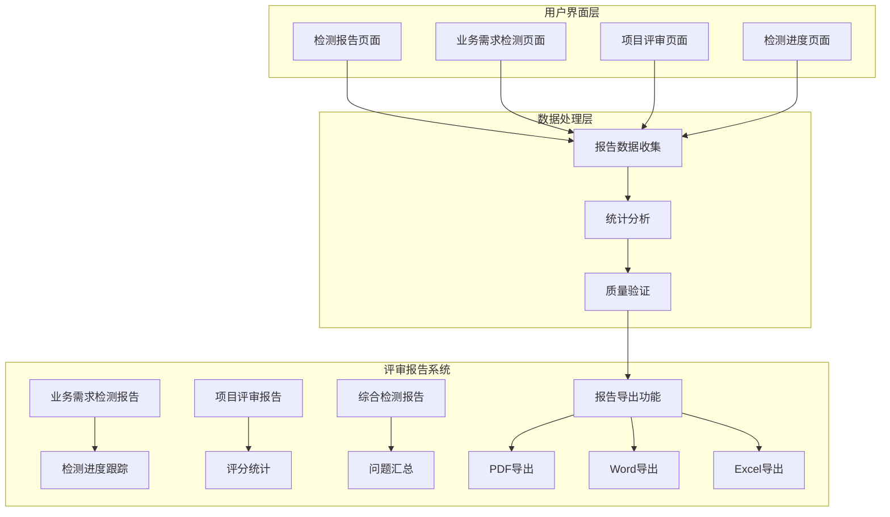
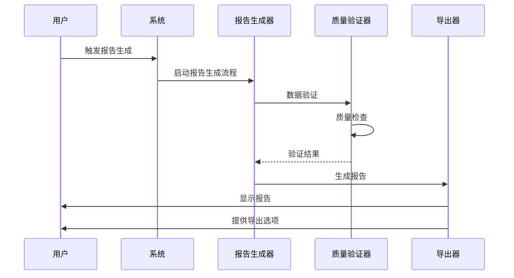
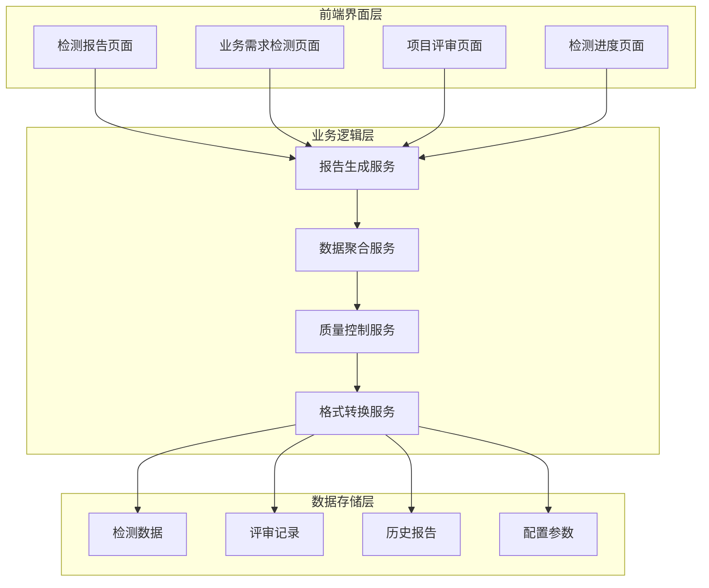
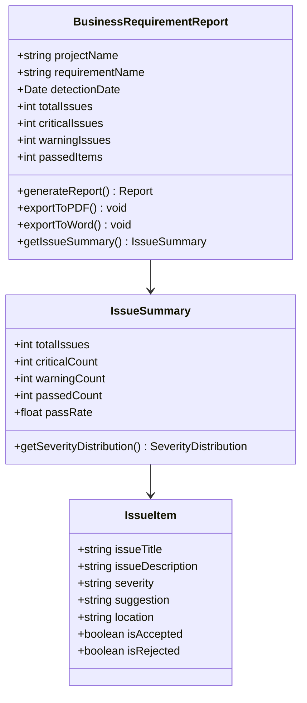
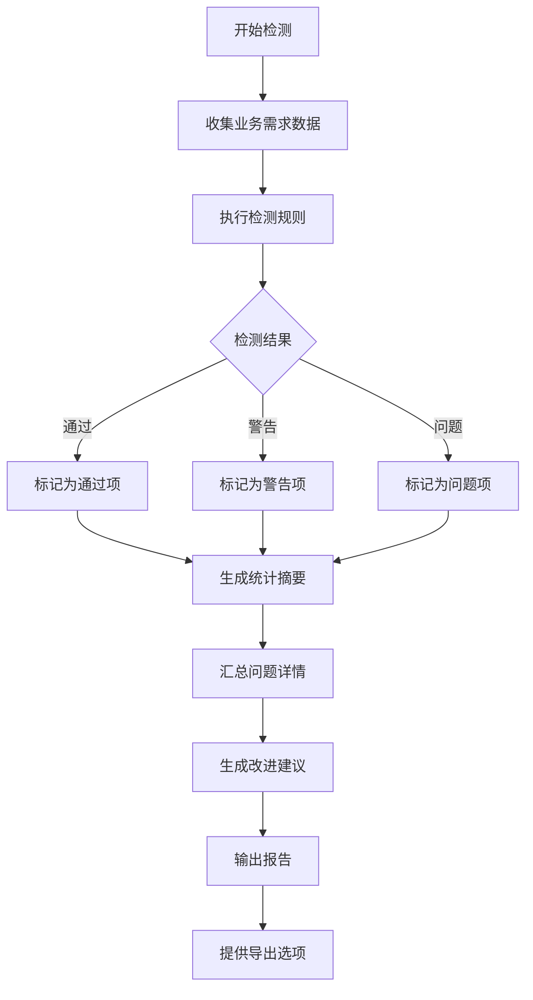
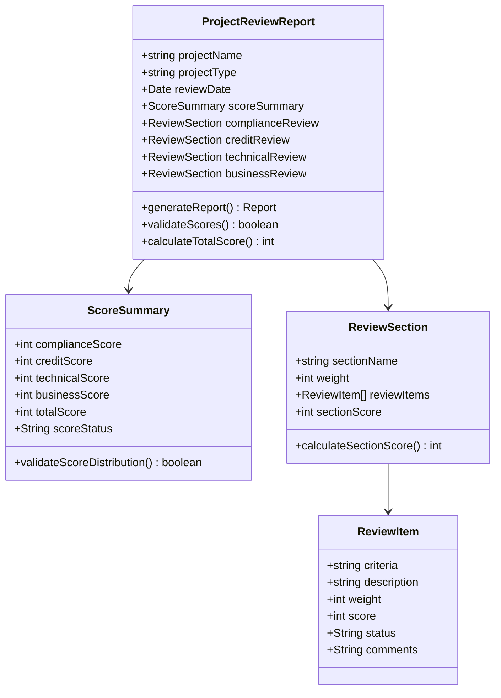
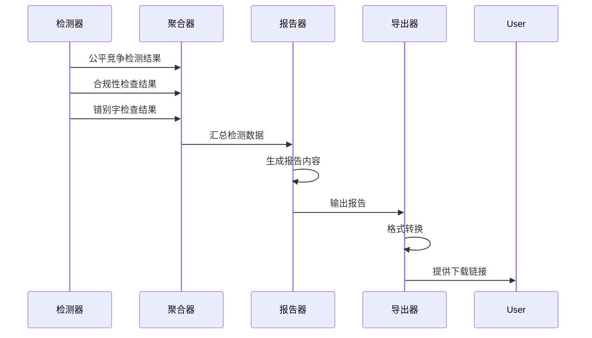
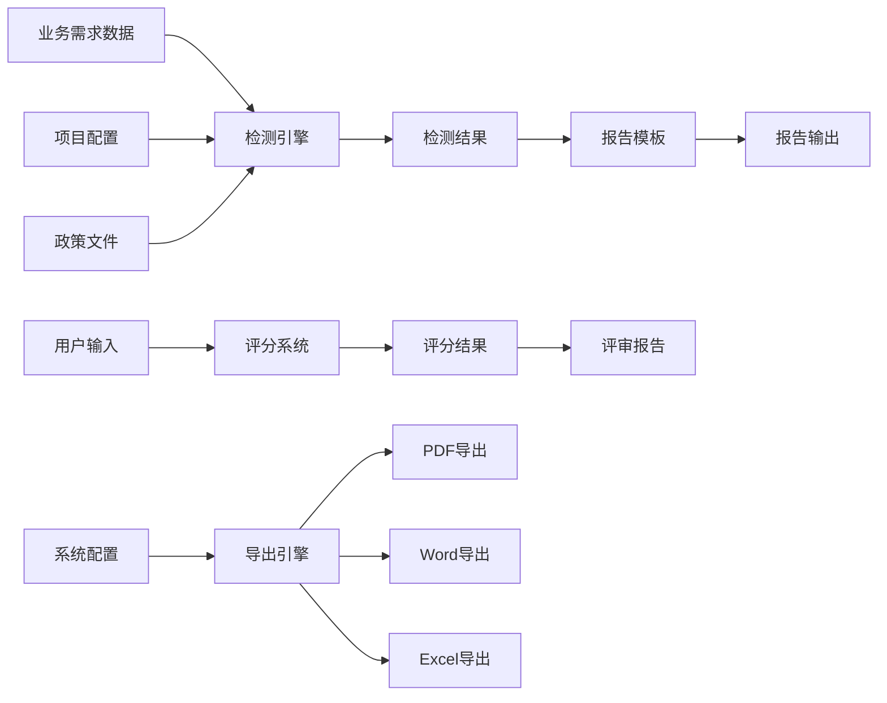
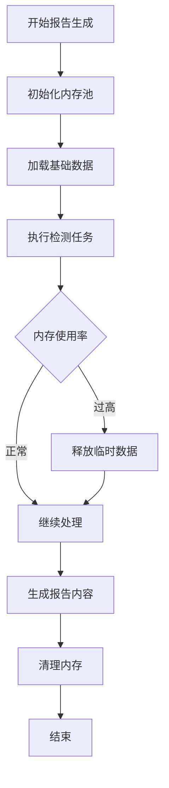

# 评审报告

<cite>
**本文档引用的文件**
- [review-report.html](file://pages/review-report.html)
- [business-requirement-review.html](file://pages/business-requirement-review.html)
- [project-review.html](file://pages/project-review.html)
- [review-progress.html](file://pages/review-progress.html)
- [business-requirement-generate.html](file://pages/business-requirement-generate.html)
- [project-detail.html](file://pages/project-detail.html)
</cite>

## 目录
1. [简介](#简介)
2. [项目结构](#项目结构)
3. [核心组件](#核心组件)
4. [架构概览](#架构概览)
5. [详细组件分析](#详细组件分析)
6. [依赖关系分析](#依赖关系分析)
7. [性能考虑](#性能考虑)
8. [故障排除指南](#故障排除指南)
9. [结论](#结论)
10. [附录](#附录)

## 简介

本文档详细介绍招标文件AI编制系统中的评审报告功能。该系统提供了完整的评审报告生成功能，包括业务需求检测报告、项目评审报告和综合检测报告。系统支持多种报告格式导出，具备自动化的报告生成机制和严格的质量控制措施。

## 项目结构

系统采用模块化设计，评审报告功能分布在多个页面中，每个页面负责不同的报告生成阶段：

**图表来源**
- [review-report.html:1-1234](file://pages/review-report.html#L1-L1234)
- [business-requirement-review.html:1-741](file://pages/business-requirement-review.html#L1-L741)
- [project-review.html:1-1534](file://pages/project-review.html#L1-L1534)

**章节来源**
- [review-report.html:1-1234](file://pages/review-report.html#L1-L1234)
- [business-requirement-review.html:1-741](file://pages/business-requirement-review.html#L1-L741)
- [project-review.html:1-1534](file://pages/project-review.html#L1-L1534)

## 核心组件

### 报告生成引擎

系统实现了多层次的报告生成机制，支持自动触发和手动触发两种模式：

**图表来源**
- [review-progress.html:729-800](file://pages/review-progress.html#L729-L800)
- [business-requirement-generate.html:774-781](file://pages/business-requirement-generate.html#L774-L781)

### 报告内容构成

系统生成的评审报告包含以下核心组成部分：

1. **评审概况**：项目基本信息、检测进度、整体状态
2. **评分统计**：各项评审指标的分数分布
3. **问题汇总**：检测到的问题分类和详细描述
4. **改进建议**：针对问题的具体解决方案

**章节来源**
- [review-report.html:505-758](file://pages/review-report.html#L505-L758)
- [business-requirement-review.html:596-707](file://pages/business-requirement-review.html#L596-L707)

## 架构概览

系统采用前后端分离的架构设计，评审报告功能通过统一的接口实现：

**图表来源**
- [project-detail.html:1041-1056](file://pages/project-detail.html#L1041-L1056)
- [business-requirement-generate.html:774-781](file://pages/business-requirement-generate.html#L774-L781)

## 详细组件分析

### 业务需求检测报告

业务需求检测报告专注于业务需求的完整性检查：

**图表来源**
- [business-requirement-review.html:596-707](file://pages/business-requirement-review.html#L596-L707)
- [business-requirement-generate.html:783-800](file://pages/business-requirement-generate.html#L783-L800)

#### 报告生成流程

**图表来源**
- [review-progress.html:773-800](file://pages/review-progress.html#L773-L800)
- [business-requirement-review.html:695-707](file://pages/business-requirement-review.html#L695-L707)

**章节来源**
- [business-requirement-review.html:596-707](file://pages/business-requirement-review.html#L596-L707)
- [business-requirement-generate.html:783-800](file://pages/business-requirement-generate.html#L783-L800)

### 项目评审报告

项目评审报告涵盖更广泛的评审维度：

**图表来源**
- [project-review.html:992-1035](file://pages/project-review.html#L992-L1035)
- [project-review.html:1019-1025](file://pages/project-review.html#L1019-L1025)

#### 评分统计机制

项目评审采用多维度评分体系：

| 评审维度 | 权重分配 | 评分范围 | 质量等级 |
|---------|---------|---------|---------|
| 符合性审查 | 20% | 通过/不通过 | 合格/不合格 |
| 资信评审 | 30% | 0-30分 | 优秀/良好/合格/不合格 |
| 技术评审 | 40% | 0-40分 | 优秀/良好/合格/不合格 |
| 商务评审 | 30% | 0-30分 | 优秀/良好/合格/不合格 |
| **总计** | **100%** | **0-100分** | **优秀/良好/合格/不合格** |

**章节来源**
- [project-review.html:992-1035](file://pages/project-review.html#L992-L1035)
- [project-review.html:1019-1025](file://pages/project-review.html#L1019-L1025)

### 综合检测报告

综合检测报告整合所有检测结果：

**图表来源**
- [review-progress.html:773-800](file://pages/review-progress.html#L773-L800)
- [review-report.html:810-823](file://pages/review-report.html#L810-L823)

**章节来源**
- [review-progress.html:773-800](file://pages/review-progress.html#L773-L800)
- [review-report.html:810-823](file://pages/review-report.html#L810-L823)

## 依赖关系分析

### 报告生成依赖链

**图表来源**
- [business-requirement-generate.html:783-800](file://pages/business-requirement-generate.html#L783-L800)
- [project-review.html:1019-1025](file://pages/project-review.html#L1019-L1025)

### 数据流依赖

系统中的数据流遵循严格的依赖关系：

1. **数据采集层**：从各个业务模块收集原始数据
2. **数据处理层**：对原始数据进行清洗和标准化
3. **数据分析层**：执行各种检测算法和评分计算
4. **报告生成层**：根据分析结果生成报告内容
5. **报告输出层**：提供多种格式的报告输出

**章节来源**
- [business-requirement-generate.html:783-800](file://pages/business-requirement-generate.html#L783-L800)
- [project-review.html:1019-1025](file://pages/project-review.html#L1019-L1025)

## 性能考虑

### 报告生成性能优化

系统在报告生成方面采用了多项性能优化策略：

1. **异步处理**：报告生成采用异步方式，避免阻塞用户界面
2. **缓存机制**：对常用的数据和中间结果进行缓存
3. **增量更新**：只更新发生变化的部分，减少重复计算
4. **并发处理**：支持多线程并行处理不同的检测任务

### 内存管理

**图表来源**
- [review-progress.html:773-800](file://pages/review-progress.html#L773-L800)

## 故障排除指南

### 常见问题及解决方案

#### 报告生成失败

**问题现象**：报告生成过程中出现错误或卡死

**可能原因**：
1. 数据源连接异常
2. 内存不足
3. 检测规则配置错误
4. 文件权限问题

**解决步骤**：
1. 检查数据源连接状态
2. 清理系统缓存
3. 验证检测规则配置
4. 检查文件写入权限

#### 报告内容不准确

**问题现象**：生成的报告与预期不符

**可能原因**：
1. 输入数据格式不正确
2. 检测算法参数设置错误
3. 缓存数据过期
4. 版本兼容性问题

**解决步骤**：
1. 验证输入数据格式
2. 检查检测参数配置
3. 清除缓存数据
4. 更新系统版本

#### 导出功能异常

**问题现象**：报告导出失败或格式错误

**可能原因**：
1. 导出格式不支持
2. 文件路径权限问题
3. 磁盘空间不足
4. 第三方库依赖缺失

**解决步骤**：
1. 检查导出格式支持情况
2. 验证文件路径权限
3. 清理磁盘空间
4. 重新安装依赖库

**章节来源**
- [review-progress.html:773-800](file://pages/review-progress.html#L773-L800)
- [business-requirement-generate.html:774-781](file://pages/business-requirement-generate.html#L774-L781)

## 结论

评审报告功能是招标文件AI编制系统的重要组成部分，具有以下特点：

1. **完整性**：覆盖业务需求、项目评审、综合检测等多个维度
2. **自动化**：支持自动触发和手动触发两种模式
3. **可扩展性**：模块化设计便于功能扩展和维护
4. **可靠性**：完善的质量控制和错误处理机制
5. **易用性**：友好的用户界面和丰富的导出选项

系统通过多层次的报告生成机制，为评审人员和管理人员提供了全面、准确、及时的评审报告，有效提升了招标文件编制工作的效率和质量。

## 附录

### 报告格式支持

系统支持以下报告格式：

| 格式类型 | 文件扩展名 | 主要用途 | 特殊说明 |
|---------|-----------|---------|---------|
| PDF | .pdf | 正式发布、归档保存 | 标准格式，兼容性强 |
| Word | .docx | 编辑修改、打印输出 | 支持编辑和批注 |
| Excel | .xlsx | 数据分析、统计报表 | 支持数据导出和分析 |
| HTML | .html | 在线查看、分享展示 | 支持在线浏览 |

### 使用操作指南

#### 评审人员操作流程

1. **访问报告页面**：登录系统后进入评审报告页面
2. **选择报告类型**：根据需要选择相应的报告类型
3. **查看报告内容**：系统自动加载并显示报告内容
4. **审阅报告结果**：仔细查看各项检测结果和评分
5. **制定改进措施**：根据报告建议制定相应的改进方案

#### 管理人员操作流程

1. **批量生成报告**：支持批量生成多个项目的评审报告
2. **质量审核**：对生成的报告进行质量审核和把关
3. **导出报告**：将报告导出为所需的格式
4. **归档管理**：对历史报告进行归档和管理
5. **统计分析**：基于报告数据进行统计分析和趋势预测

### 最佳实践建议

1. **定期更新检测规则**：根据最新的政策法规更新检测规则
2. **建立质量控制流程**：建立完善的报告质量控制流程
3. **培训用户操作**：对相关人员进行系统操作培训
4. **备份重要数据**：定期备份重要的报告数据
5. **监控系统性能**：持续监控系统的运行性能和稳定性