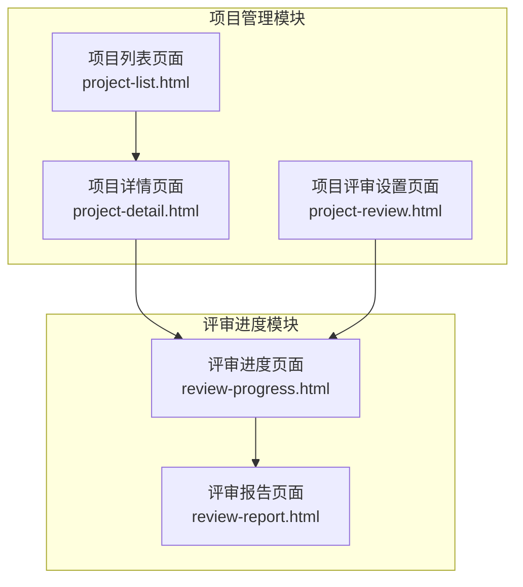
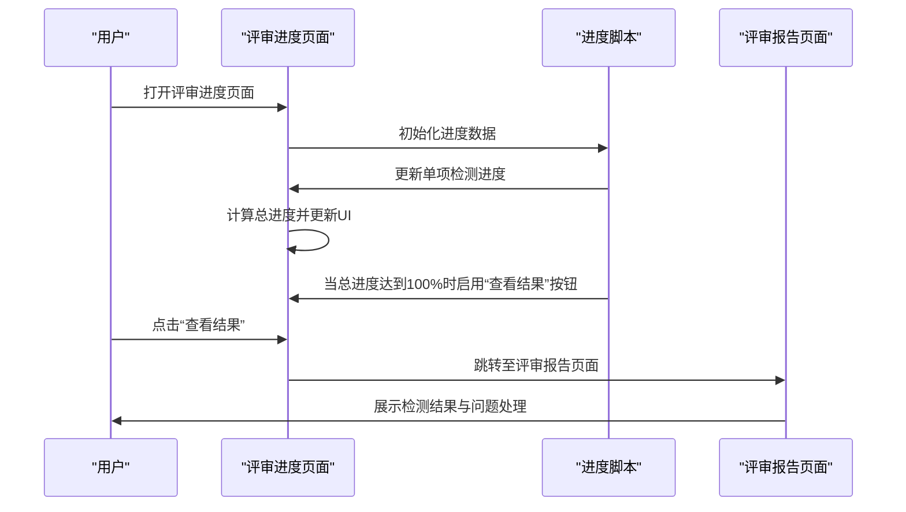
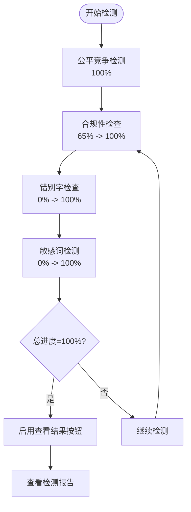
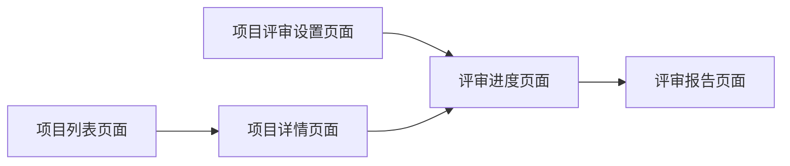

# 评审进度

<cite>
**本文引用的文件**
- [review-progress.html](file://pages/review-progress.html)
- [project-review.html](file://pages/project-review.html)
- [project-detail.html](file://pages/project-detail.html)
- [project-list.html](file://pages/project-list.html)
- [review-report.html](file://pages/review-report.html)
</cite>

## 目录
1. [简介](#简介)
2. [项目结构](#项目结构)
3. [核心组件](#核心组件)
4. [架构概览](#架构概览)
5. [详细组件分析](#详细组件分析)
6. [依赖关系分析](#依赖关系分析)
7. [性能考虑](#性能考虑)
8. [故障排除指南](#故障排除指南)
9. [结论](#结论)
10. [附录](#附录)

## 简介
本文件面向评审进度功能，系统化梳理了项目评审过程中的进度跟踪与状态监控能力。评审进度功能覆盖多种展示形式（时间线视图、总进度条、单项检测进度），提供完整的状态标识与流转规则，支持自动化进度推进与人工干预，同时具备评审历史查询与追溯能力。本文档旨在帮助项目负责人与评审人员高效使用该功能，准确把握项目进展、识别潜在风险并进行有效决策。

## 项目结构
评审进度功能主要分布在以下页面：
- 评审进度页面：展示实时检测进度、单项检测状态与总进度
- 项目评审设置页面：配置评审项与评分
- 项目详情页面：展示项目整体进度时间线
- 项目列表页面：展示项目总体进度与状态
- 评审报告页面：汇总检测结果与问题处理

图表来源
- [review-progress.html:1-1072](file://pages/review-progress.html#L1-L1072)
- [project-detail.html:1-1755](file://pages/project-detail.html#L1-L1755)
- [project-list.html:1-820](file://pages/project-list.html#L1-L820)
- [project-review.html:1-1534](file://pages/project-review.html#L1-L1534)
- [review-report.html:1-1234](file://pages/review-report.html#L1-L1234)

章节来源
- [review-progress.html:1-1072](file://pages/review-progress.html#L1-L1072)
- [project-detail.html:1-1755](file://pages/project-detail.html#L1-L1755)
- [project-list.html:1-820](file://pages/project-list.html#L1-L820)
- [project-review.html:1-1534](file://pages/project-review.html#L1-L1534)
- [review-report.html:1-1234](file://pages/review-report.html#L1-L1234)

## 核心组件
- 进度指示器：包含步骤导航与步骤圆点，直观展示当前所处阶段
- 时间线视图：在项目详情页展示项目关键节点的时间线
- 总进度条：聚合多项检测任务的平均进度
- 单项检测进度：针对不同检测类型的独立进度条与状态标识
- 状态标识与流转：完成、进行中、等待中等状态的视觉与交互反馈
- 自动化推进：基于定时器模拟检测进度，完成后自动启用结果查看按钮
- 历史与追溯：通过报告页汇总问题并支持重新检测

章节来源
- [review-progress.html:704-880](file://pages/review-progress.html#L704-L880)
- [project-detail.html:464-524](file://pages/project-detail.html#L464-L524)
- [review-report.html:505-757](file://pages/review-report.html#L505-L757)

## 架构概览
评审进度功能采用前端静态页面+轻量脚本的实现方式，通过HTML结构承载布局，CSS负责样式与动画，JavaScript负责进度模拟与状态切换。整体架构清晰、耦合度低，便于扩展新的检测类型或展示形式。

图表来源
- [review-progress.html:895-1069](file://pages/review-progress.html#L895-L1069)
- [review-report.html:1119-1231](file://pages/review-report.html#L1119-L1231)

## 详细组件分析

### 1. 评审进度页面（review-progress.html）
- 功能概述
  - 展示智能检测的实时进度，包含公平竞争检测、合规性检查、错别字检查、敏感词检测四项子任务
  - 提供总进度条与单项进度条，支持状态标识（完成、检测中、等待中）
  - 自动化推进：通过定时器模拟检测进度，完成后自动启用“查看结果”按钮
  - 支持主题切换与返回上一步操作

- 关键元素
  - 步骤导航与步骤圆点：用于指示当前所在流程阶段
  - 单项检测区域：每个检测项包含标题、状态徽标、进度条与百分比文本
  - 总进度区域：显示聚合后的总进度百分比与进度条
  - 操作按钮：返回上一步、返回修改、查看结果（仅在总进度100%时可用）

- 自动化机制
  - 使用定时器逐步提升各项检测进度
  - 当某项检测完成时，自动切换其状态为“已完成”，并更新总进度
  - 总进度达到100%后，启用“查看结果”按钮并更新状态图标与提示语

- 状态标识与流转
  - 等待中：初始状态，进度为0%
  - 检测中：进行中的状态，带有旋转动画
  - 已完成：检测完成，状态变为绿色勾选图标
  - 总进度100%：启用查看结果按钮，状态图标变为绿色勾选

图表来源
- [review-progress.html:896-1040](file://pages/review-progress.html#L896-L1040)

章节来源
- [review-progress.html:704-880](file://pages/review-progress.html#L704-L880)
- [review-progress.html:895-1069](file://pages/review-progress.html#L895-L1069)

### 2. 项目详情页面（project-detail.html）
- 功能概述
  - 展示项目整体进度时间线，标注已完成与当前活动节点
  - 提供项目基本信息、状态徽章与文档卡片等辅助信息

- 关键元素
  - 时间线容器：使用左侧竖线与节点圆点表示进度推进
  - 时间线项：包含标题、描述与时间戳，支持完成态与活动态样式

- 使用场景
  - 项目负责人快速了解项目关键节点的完成情况
  - 评审人员结合时间线核对当前阶段的合理性

章节来源
- [project-detail.html:464-524](file://pages/project-detail.html#L464-L524)
- [project-detail.html:1119-1128](file://pages/project-detail.html#L1119-L1128)

### 3. 项目列表页面（project-list.html）
- 功能概述
  - 展示多个项目的列表，包含项目编号、名称、类型、预算、进度与操作按钮
  - 提供筛选条件与分页功能

- 关键元素
  - 进度条：以微缩形式展示项目完成度
  - 状态徽章：根据项目状态（进行中、已完成、已发布等）显示不同颜色
  - 操作按钮：查看、编辑、删除等

- 使用场景
  - 项目负责人批量查看项目整体进度
  - 快速定位需要重点关注的项目

章节来源
- [project-list.html:594-794](file://pages/project-list.html#L594-L794)

### 4. 项目评审设置页面（project-review.html）
- 功能概述
  - 设置评审项与评分标准，支持表格化编辑与标签式展示
  - 提供评分汇总与状态徽章，便于快速了解评审准备情况

- 关键元素
  - 评审项表格：支持输入、编辑与评分
  - 评分汇总：展示各类指标的得分与状态
  - 标签徽章：用于标识不同类型的评审项

章节来源
- [project-review.html:490-700](file://pages/project-review.html#L490-L700)

### 5. 评审报告页面（review-report.html）
- 功能概述
  - 汇总检测结果，按问题类型分组展示
  - 支持接受/拒绝建议、查看原文、重新检测等操作
  - 实时更新问题计数与状态徽章

- 关键元素
  - 问题卡片：包含问题位置、标题、严重程度、描述与建议
  - 操作按钮：接受建议、拒绝建议、查看原文、重新检测
  - 统计摘要：展示各类问题数量与总问题数

- 使用场景
  - 评审人员逐项审阅问题并决定处理方案
  - 项目负责人根据报告调整文档并重新检测

章节来源
- [review-report.html:505-757](file://pages/review-report.html#L505-L757)
- [review-report.html:1119-1231](file://pages/review-report.html#L1119-L1231)

## 依赖关系分析
- 页面间依赖
  - 评审进度页面依赖评审报告页面进行结果展示
  - 项目详情页面依赖项目列表页面进行项目导航
  - 项目评审设置页面与评审进度页面共同构成完整的评审流程

- 数据流
  - 评审进度页面通过JavaScript维护检测进度状态
  - 评审报告页面从评审进度页面的最终状态生成报告
  - 项目详情与列表页面提供项目背景信息支撑评审决策

图表来源
- [project-review.html:1-1534](file://pages/project-review.html#L1-L1534)
- [review-progress.html:1-1072](file://pages/review-progress.html#L1-L1072)
- [review-report.html:1-1234](file://pages/review-report.html#L1-L1234)
- [project-detail.html:1-1755](file://pages/project-detail.html#L1-L1755)
- [project-list.html:1-820](file://pages/project-list.html#L1-L820)

章节来源
- [project-review.html:1-1534](file://pages/project-review.html#L1-L1534)
- [review-progress.html:1-1072](file://pages/review-progress.html#L1-L1072)
- [review-report.html:1-1234](file://pages/review-report.html#L1-L1234)
- [project-detail.html:1-1755](file://pages/project-detail.html#L1-L1755)
- [project-list.html:1-820](file://pages/project-list.html#L1-L820)

## 性能考虑
- 前端渲染优化
  - 使用CSS动画与过渡效果提升用户体验，避免过度频繁的DOM更新
  - 将进度计算逻辑集中在JavaScript中，减少重复计算
- 交互响应
  - 在总进度达到100%时才启用“查看结果”按钮，避免无效点击
  - 对于长列表（如项目列表），保持分页与筛选功能以减轻渲染压力

## 故障排除指南
- 检测进度不更新
  - 检查浏览器控制台是否有JavaScript错误
  - 确认定时器是否正常运行，必要时刷新页面重试
- “查看结果”按钮不可用
  - 确认所有单项检测均已完成且总进度达到100%
  - 如需重新检测，可从报告页点击“重新检测”按钮
- 主题切换异常
  - 切换主题会动态修改CSS变量，若出现样式异常，尝试刷新页面

章节来源
- [review-progress.html:895-1069](file://pages/review-progress.html#L895-L1069)
- [review-report.html:1194-1231](file://pages/review-report.html#L1194-L1231)

## 结论
评审进度功能通过多维度的可视化展示与自动化推进机制，有效提升了项目评审过程的透明度与效率。项目负责人与评审人员可以基于时间线视图、总进度条与单项检测进度快速掌握项目状态，识别潜在风险并及时采取措施。配合评审报告页面的问题处理与重新检测能力，形成了完整的评审闭环。

## 附录
- 操作指南（面向项目负责人与评审人员）
  - 查看项目进展
    - 在项目列表页面查看项目总体进度与状态徽章
    - 在项目详情页面查看项目关键节点的时间线
  - 了解各环节耗时
    - 在项目详情页面的时间线项中查看具体时间戳
  - 识别潜在风险
    - 关注“检测中”状态的单项检测，及时跟进
    - 在评审报告页面关注高严重程度问题
  - 处理问题与重新检测
    - 在评审报告页面逐项处理问题，选择接受或拒绝建议
    - 如需重新检测，点击“重新检测”按钮回到评审进度页面