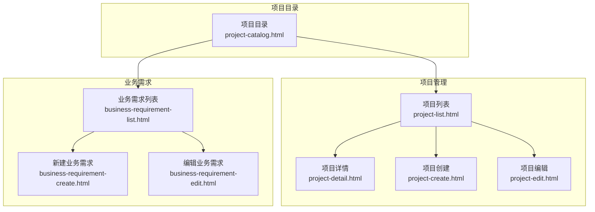
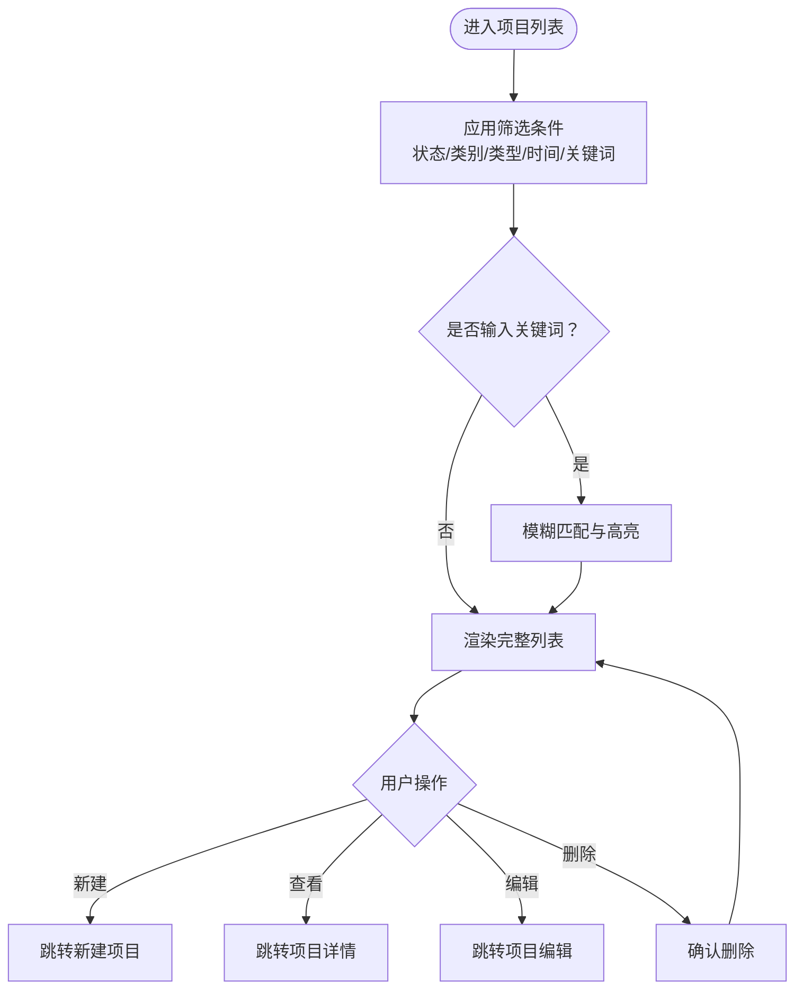
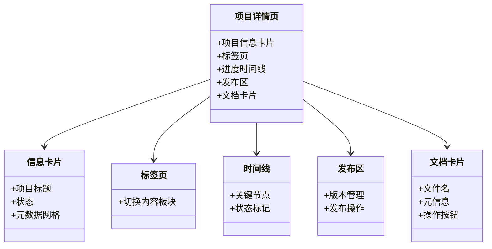
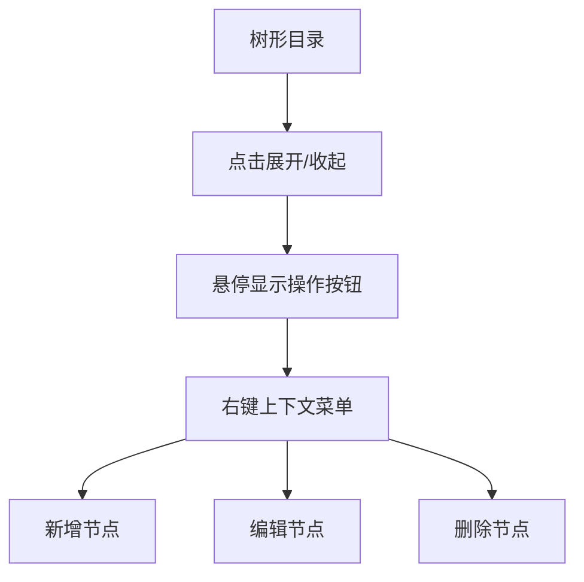
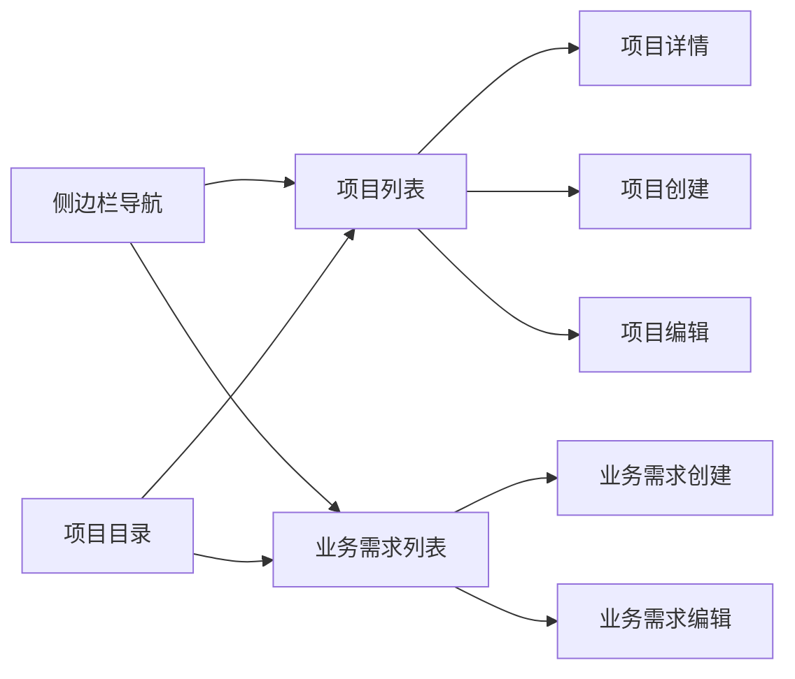

# 项目目录

<cite>
**本文引用的文件**   
- [pages/project-catalog.html](file://pages/project-catalog.html)
- [pages/project-list.html](file://pages/project-list.html)
- [pages/business-requirement-list.html](file://pages/business-requirement-list.html)
- [pages/business-requirement-create.html](file://pages/business-requirement-create.html)
- [pages/business-requirement-edit.html](file://pages/business-requirement-edit.html)
- [pages/project-detail.html](file://pages/project-detail.html)
- [pages/project-create.html](file://pages/project-create.html)
- [pages/project-edit.html](file://pages/project-edit.html)
</cite>

## 目录
1. [简介](#简介)
2. [项目结构](#项目结构)
3. [核心组件](#核心组件)
4. [架构总览](#架构总览)
5. [详细组件分析](#详细组件分析)
6. [依赖关系分析](#依赖关系分析)
7. [性能考虑](#性能考虑)
8. [故障排查指南](#故障排查指南)
9. [结论](#结论)
10. [附录](#附录)

## 简介
本文件面向“项目目录”功能，围绕项目组织结构、分类管理与搜索能力展开，结合现有页面实现，系统化梳理如下主题：
- 项目目录的层级结构与分类标准：按部门、地区、项目类型等维度的分类方式
- 项目搜索功能：关键词搜索、高级筛选与模糊匹配
- 权限控制与访问限制：导航侧边栏与页面入口的访问路径
- 项目信息展示格式与字段说明：表格列、状态与类型标签、进度条等
- 项目管理员维护项目目录的操作指南：新增项目、调整分类、更新信息、状态变更流程

## 项目结构
项目采用前端静态页面组织，围绕“项目管理”与“业务需求”两大主线构建目录与检索体系：
- 项目管理主界面：项目列表页提供筛选、分页与操作按钮
- 业务需求子系统：业务需求列表页提供更细粒度的状态与类型筛选
- 项目详情页：集中展示项目信息、进度与文档
- 项目创建/编辑页：支撑项目信息录入、分类与状态变更



图表来源
- [pages/project-list.html](file://pages/project-list.html)
- [pages/project-detail.html](file://pages/project-detail.html)
- [pages/project-create.html](file://pages/project-create.html)
- [pages/project-edit.html](file://pages/project-edit.html)
- [pages/business-requirement-list.html](file://pages/business-requirement-list.html)
- [pages/business-requirement-create.html](file://pages/business-requirement-create.html)
- [pages/business-requirement-edit.html](file://pages/business-requirement-edit.html)
- [pages/project-catalog.html](file://pages/project-catalog.html)

章节来源
- [pages/project-list.html](file://pages/project-list.html)
- [pages/business-requirement-list.html](file://pages/business-requirement-list.html)
- [pages/project-catalog.html](file://pages/project-catalog.html)

## 核心组件
- 项目列表组件
  - 功能：展示项目清单、状态与类型标签、进度条、分页与操作按钮
  - 关键字段：项目编号、项目名称、项目类别、项目类型、项目预算、完成进度、创建时间
  - 筛选器：项目状态、项目类别、项目类型、创建时间、关键词搜索
- 业务需求列表组件
  - 功能：展示业务需求清单、需求状态、进度条与操作按钮
  - 关键字段：项目名称、项目类型、项目预算、需求状态、完成进度、创建时间
  - 筛选器：需求状态、项目类型、创建时间、关键词搜索
- 项目详情组件
  - 功能：集中展示项目信息卡片、标签页、进度时间轴、发布区与文档卡片
  - 关键字段：项目标题、状态、元数据网格、文档列表、进度时间线
- 项目创建/编辑组件
  - 功能：录入项目基本信息、评审类型、招标需求来源与生成模式
  - 关键字段：项目名称、项目类别、项目类型、项目预算、评审类型、招标需求来源/生成
- 项目目录组件
  - 功能：提供树形分类视图与上下文菜单，支持节点展开/折叠与动作触发
  - 关键元素：树节点、展开/收起图标、操作按钮组

章节来源
- [pages/project-list.html](file://pages/project-list.html)
- [pages/business-requirement-list.html](file://pages/business-requirement-list.html)
- [pages/project-detail.html](file://pages/project-detail.html)
- [pages/project-create.html](file://pages/project-create.html)
- [pages/project-edit.html](file://pages/project-edit.html)
- [pages/project-catalog.html](file://pages/project-catalog.html)

## 架构总览
项目目录功能由“列表页+详情页+创建/编辑页+业务需求页”构成，形成“目录—筛选—详情—维护”的闭环。导航侧边栏统一入口，目录页提供树形结构辅助浏览。

```mermaid
sequenceDiagram
participant U as "用户"
participant Nav as "导航侧边栏"
participant List as "项目列表"
participant Detail as "项目详情"
participant Create as "项目创建"
participant Edit as "项目编辑"
U->>Nav : 点击“项目管理”
Nav-->>List : 跳转至项目列表
U->>List : 使用筛选器/关键词搜索
List-->>Detail : 点击项目进入详情
U->>Detail : 需要维护时返回列表
U->>List : 点击“新建项目”
List-->>Create : 跳转至创建页
U->>Create : 录入信息并提交
Create-->>List : 创建成功返回列表
U->>List : 选择项目“编辑”
List-->>Edit : 跳转至编辑页
U->>Edit : 修改信息并保存
Edit-->>Detail : 更新后回到详情或列表
```

图表来源
- [pages/project-list.html](file://pages/project-list.html)
- [pages/project-detail.html](file://pages/project-detail.html)
- [pages/project-create.html](file://pages/project-create.html)
- [pages/project-edit.html](file://pages/project-edit.html)

## 详细组件分析

### 组件一：项目列表（筛选与搜索）
- 分类维度
  - 项目状态：进行中、已完成、已发布等
  - 项目类别：限额以下、产权交易、政府采购
  - 项目类型：工程类、货物类、服务类及其细分
  - 创建时间：日期范围筛选
  - 关键词搜索：项目名称/编号
- 展示字段
  - 项目编号、项目名称、项目类别、项目类型、项目预算、完成进度、创建时间
  - 操作：查看、编辑、删除
- 分页与交互
  - 支持分页控件与“上一页/下一页”导航
  - 表头含“新建项目”按钮



图表来源
- [pages/project-list.html](file://pages/project-list.html)

章节来源
- [pages/project-list.html](file://pages/project-list.html)

### 组件二：业务需求列表（状态与类型筛选）
- 分类维度
  - 需求状态：草稿、进行中、待检测、检测中、检测通过、检测不通过、已发布、已归档、已取消
  - 项目类型：工程类、货物类、服务类
  - 创建时间：日期范围筛选
  - 关键词搜索：项目名称
- 展示字段
  - 项目名称、项目类型、项目预算、需求状态、完成进度、创建时间
  - 操作：查看、编辑、删除

章节来源
- [pages/business-requirement-list.html](file://pages/business-requirement-list.html)

### 组件三：项目详情（信息展示与进度）
- 信息卡片
  - 项目标题、状态标签、元数据网格（如预算、类型、状态等）
- 标签页与时间轴
  - 标签页用于切换不同信息板块
  - 进度时间线展示关键节点与状态变化
- 发布区与文档卡片
  - 发布区用于发布与版本管理
  - 文档卡片展示相关附件与操作



图表来源
- [pages/project-detail.html](file://pages/project-detail.html)

章节来源
- [pages/project-detail.html](file://pages/project-detail.html)

### 组件四：项目创建与编辑（信息录入与来源模式）
- 创建流程
  - 基本信息：项目名称、项目类别、项目类型、项目预算
  - 评审类型：人工评审/智能评审（自动推荐）
  - 招标需求来源：模式1（引用）/模式2（系统生成）
    - 引用模式：可从“编制业务需求”模块选择已定稿项目，或直接录入
    - 生成模式：输入项目描述，系统生成招标需求
- 编辑流程
  - 支持修改项目名称、类型、评审类型、项目描述与资格要求
  - 提供“取消项目”与“保存修改”操作

```mermaid
sequenceDiagram
participant U as "用户"
participant Create as "项目创建"
participant BR as "业务需求"
participant Gen as "系统生成"
U->>Create : 选择“模式1：引用”
Create->>BR : 选择已定稿业务需求
BR-->>Create : 回显业务需求内容
U->>Create : 选择“模式2：系统生成”
Create->>Gen : 输入项目描述
Gen-->>Create : 输出生成的招标需求
U->>Create : 填写评审类型与预算
Create-->>U : 保存并继续
```

图表来源
- [pages/project-create.html](file://pages/project-create.html)
- [pages/business-requirement-create.html](file://pages/business-requirement-create.html)
- [pages/business-requirement-edit.html](file://pages/business-requirement-edit.html)

章节来源
- [pages/project-create.html](file://pages/project-create.html)
- [pages/business-requirement-create.html](file://pages/business-requirement-create.html)
- [pages/business-requirement-edit.html](file://pages/business-requirement-edit.html)

### 组件五：项目目录（树形分类与上下文菜单）
- 树形结构
  - 节点展开/收起、节点内容悬停显示操作按钮
- 上下文菜单
  - 支持针对节点执行新增、编辑、删除等操作
- 适用场景
  - 作为项目列表的补充视图，便于快速定位与批量操作



图表来源
- [pages/project-catalog.html](file://pages/project-catalog.html)

章节来源
- [pages/project-catalog.html](file://pages/project-catalog.html)

## 依赖关系分析
- 页面间依赖
  - 项目列表页依赖于项目详情页、项目创建页、项目编辑页
  - 业务需求列表页与项目创建页存在“引用业务需求”与“生成需求”的协作关系
  - 项目目录页作为导航补充，连接项目与业务需求两大模块
- 导航依赖
  - 侧边栏统一提供“项目管理”“编制业务需求”等入口，形成清晰的访问路径



图表来源
- [pages/project-list.html](file://pages/project-list.html)
- [pages/business-requirement-list.html](file://pages/business-requirement-list.html)
- [pages/project-catalog.html](file://pages/project-catalog.html)

章节来源
- [pages/project-list.html](file://pages/project-list.html)
- [pages/business-requirement-list.html](file://pages/business-requirement-list.html)
- [pages/project-catalog.html](file://pages/project-catalog.html)

## 性能考虑
- 列表渲染优化
  - 使用分页减少一次性渲染的数据量
  - 筛选器采用前端过滤，建议在大数据量时引入虚拟滚动或服务端分页
- 搜索性能
  - 关键词搜索建议增加防抖与缓存策略，避免频繁重绘
- 图标与动画
  - 展开/收起与进度条动画应保持流畅，避免阻塞主线程

## 故障排查指南
- 筛选无效
  - 检查筛选器字段是否正确绑定，确认事件监听与状态更新逻辑
- 关键词搜索无响应
  - 核对输入框值与过滤函数，确保大小写与空格处理一致
- 创建/编辑失败
  - 校验必填字段与表单验证提示，确认提交逻辑与跳转目标
- 目录树无法展开
  - 检查节点展开状态与CSS类名，确认事件绑定与DOM结构

章节来源
- [pages/project-list.html](file://pages/project-list.html)
- [pages/project-create.html](file://pages/project-create.html)
- [pages/project-edit.html](file://pages/project-edit.html)
- [pages/project-catalog.html](file://pages/project-catalog.html)

## 结论
项目目录功能以“项目列表+业务需求+详情+创建/编辑+目录树”为核心，形成完整的项目生命周期管理闭环。通过多维筛选、关键词搜索与状态/类型标签，提升项目检索效率；通过目录树与上下文菜单增强批量操作体验。建议后续在大数据量场景下引入服务端分页与搜索优化，并完善权限控制与审计日志。

## 附录

### 字段与标签说明
- 项目列表字段
  - 项目编号、项目名称、项目类别、项目类型、项目预算、完成进度、创建时间
  - 状态标签：草稿、进行中、审查中、审查通过、审查不通过、已发布、已取消
  - 类型标签：工程类、货物类、服务类
- 业务需求列表字段
  - 项目名称、项目类型、项目预算、需求状态、完成进度、创建时间
  - 需求状态：草稿、进行中、待检测、检测中、检测通过、检测不通过、已发布、已归档、已取消

章节来源
- [pages/project-list.html](file://pages/project-list.html)
- [pages/business-requirement-list.html](file://pages/business-requirement-list.html)