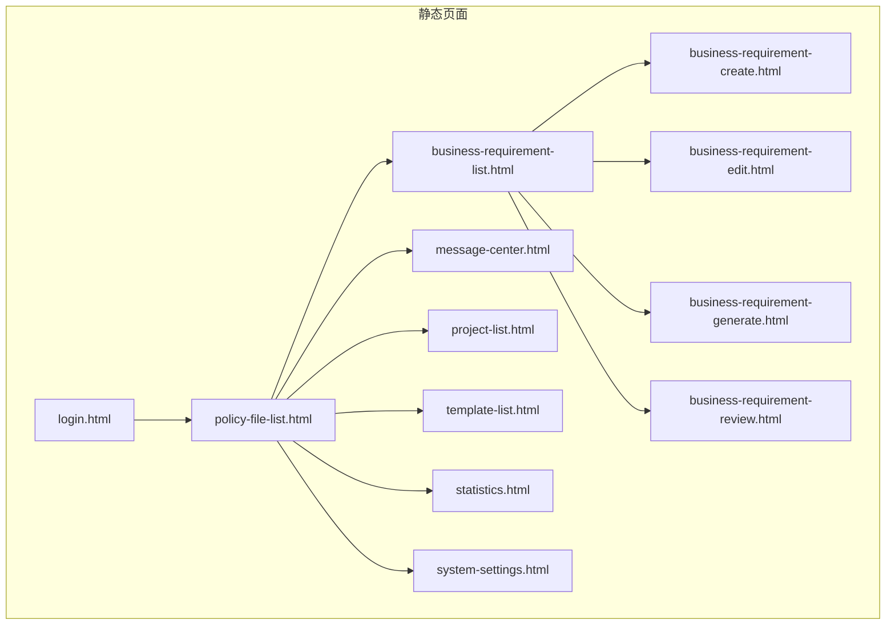
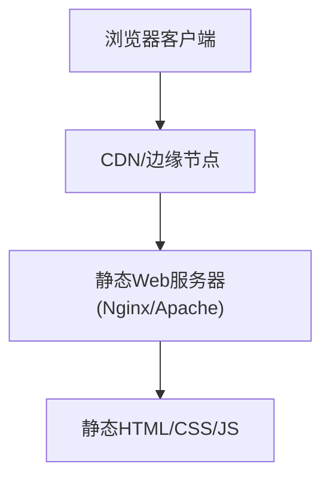
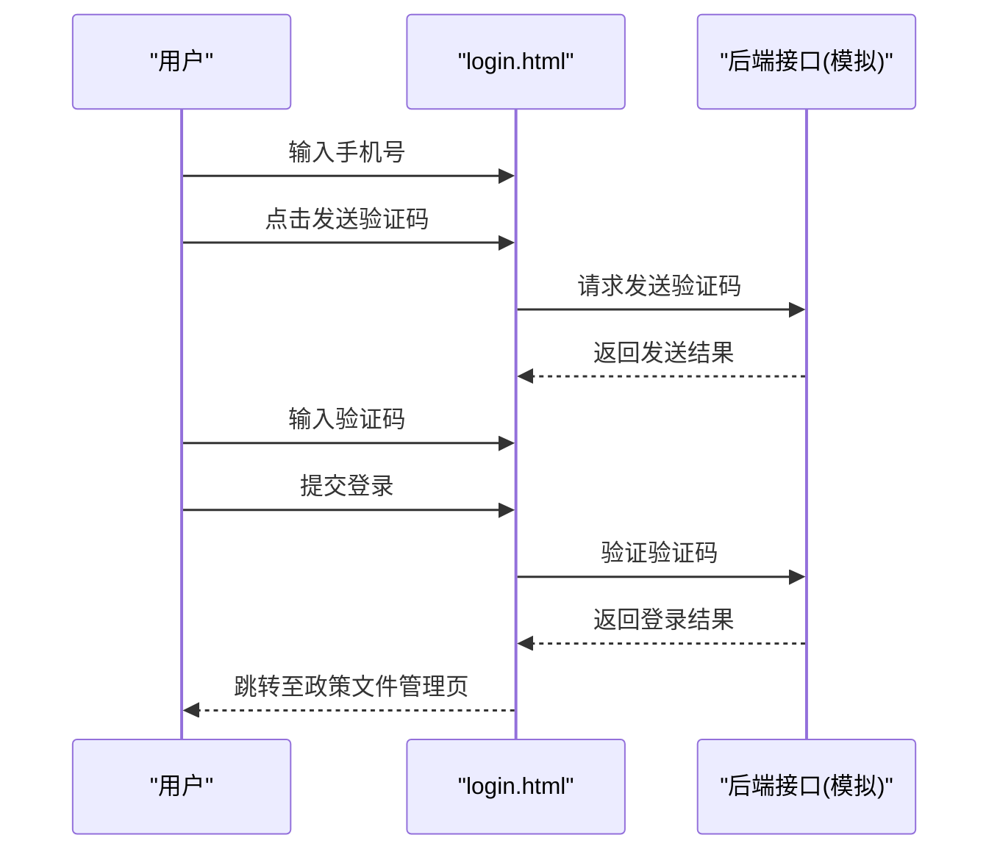
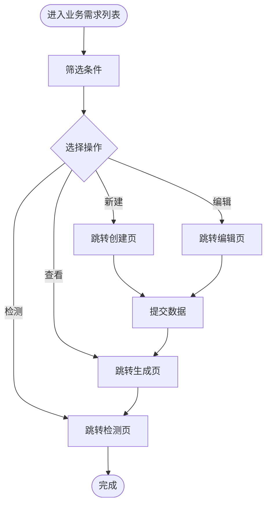
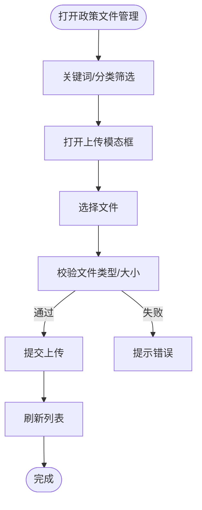
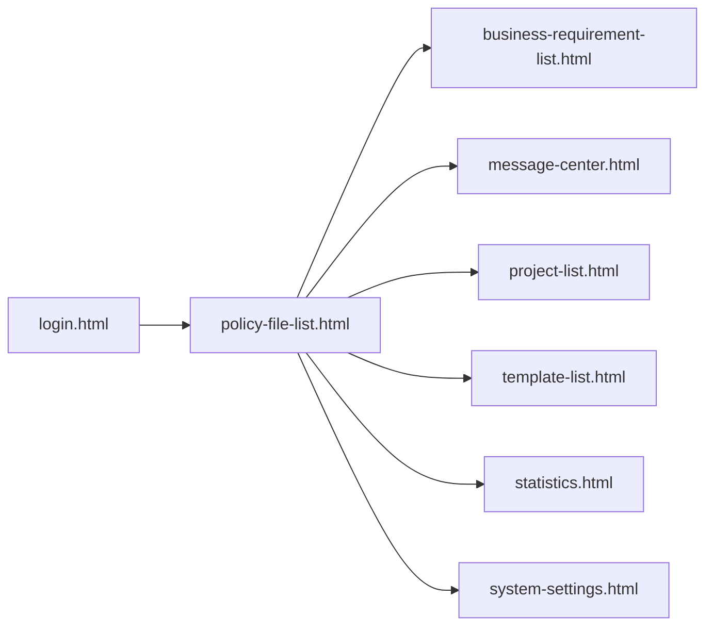

# 部署和运维

<cite>
**本文引用的文件**
- [pages/business-requirement-create.html](file://pages/business-requirement-create.html)
- [pages/business-requirement-edit.html](file://pages/business-requirement-edit.html)
- [pages/business-requirement-generate.html](file://pages/business-requirement-generate.html)
- [pages/business-requirement-list.html](file://pages/business-requirement-list.html)
- [pages/business-requirement-review.html](file://pages/business-requirement-review.html)
- [pages/login.html](file://pages/login.html)
- [pages/message-center.html](file://pages/message-center.html)
- [pages/policy-file-list.html](file://pages/policy-file-list.html)
- [pages/project-catalog.html](file://pages/project-catalog.html)
- [pages/project-create.html](file://pages/project-create.html)
- [pages/project-detail.html](file://pages/project-detail.html)
- [pages/project-edit.html](file://pages/project-edit.html)
- [pages/project-init.html](file://pages/project-init.html)
- [pages/project-integration.html](file://pages/project-integration.html)
- [pages/project-list.html](file://pages/project-list.html)
- [pages/project-requirement.html](file://pages/project-requirement.html)
- [pages/project-review.html](file://pages/project-review.html)
- [pages/review-progress.html](file://pages/review-progress.html)
- [pages/review-report.html](file://pages/review-report.html)
- [pages/statistics.html](file://pages/statistics.html)
- [pages/system-settings.html](file://pages/system-settings.html)
- [pages/template-create.html](file://pages/template-create.html)
- [pages/template-detail.html](file://pages/template-detail.html)
- [pages/template-edit.html](file://pages/template-edit.html)
- [pages/template-list.html](file://pages/template-list.html)
- [2026-04-10-招标文件AI编制会议纪要.md](file0.00000000000000000000000000000000000000000000000000000000000000000000000000000000000000000000000000000000000000000000000000000000000000000000000000000000000000000000000000000000000000000000000000000000000000000000000000000000000000000000000000000000000000000000000000000000000000000000000000000000000000000000000000000000000000000000000000000000000000000000000000000000000000000000000000000000000000000000000000000000000000000000000000000000000000000000000000000000000000000000000000000000000000000000000......](file://2026-04-10-招标文件AI编制会议纪要.md)
</cite>

## 目录
1. [简介](#简介)
2. [项目结构](#项目结构)
3. [核心组件](#核心组件)
4. [架构总览](#架构总览)
5. [详细组件分析](#详细组件分析)
6. [依赖关系分析](#依赖关系分析)
7. [性能考虑](#性能考虑)
8. [故障排查指南](#故障排查指南)
9. [结论](#结论)
10. [附录](#附录)

## 简介
本文件面向运维与平台团队，围绕“招标文件AI编制系统”的纯前端静态页面，提供从开发到生产的全生命周期部署与运维指南。内容涵盖：
- 静态文件部署最佳实践（服务器配置、CDN、缓存策略）
- 不同环境（开发/测试/生产）差异化配置
- 域名与HTTPS、跨域问题的解决方案
- 性能优化（资源压缩、加载优化）
- 监控与日志、故障排查
- 备份、版本回滚与应急处置
- 维护、升级与扩展建议

## 项目结构
该系统由多个HTML页面组成，采用内联CSS与少量内联脚本，无外部JS依赖，适合直接部署为静态站点。

图表来源
- [pages/login.html](file://pages/login.html)
- [pages/business-requirement-list.html](file://pages/business-requirement-list.html)
- [pages/business-requirement-create.html](file://pages/business-requirement-create.html)
- [pages/business-requirement-edit.html](file://pages/business-requirement-edit.html)
- [pages/business-requirement-generate.html](file://pages/business-requirement-generate.html)
- [pages/business-requirement-review.html](file://pages/business-requirement-review.html)
- [pages/policy-file-list.html](file://pages/policy-file-list.html)
- [pages/message-center.html](file://pages/message-center.html)
- [pages/project-list.html](file://pages/project-list.html)
- [pages/template-list.html](file://pages/template-list.html)
- [pages/statistics.html](file://pages/statistics.html)
- [pages/system-settings.html](file://pages/system-settings.html)

章节来源
- [pages/login.html](file://pages/login.html)
- [pages/business-requirement-list.html](file://pages/business-requirement-list.html)
- [pages/business-requirement-create.html](file://pages/business-requirement-create.html)
- [pages/business-requirement-edit.html](file://pages/business-requirement-edit.html)
- [pages/business-requirement-generate.html](file://pages/business-requirement-generate.html)
- [pages/business-requirement-review.html](file://pages/business-requirement-review.html)
- [pages/policy-file-list.html](file://pages/policy-file-list.html)
- [pages/message-center.html](file://pages/message-center.html)
- [pages/project-list.html](file://pages/project-list.html)
- [pages/template-list.html](file://pages/template-list.html)
- [pages/statistics.html](file://pages/statistics.html)
- [pages/system-settings.html](file://pages/system-settings.html)

## 核心组件
- 页面导航与布局：各页面均包含侧边栏导航、顶部面包屑与用户信息区域，使用内联CSS实现统一风格与深浅主题切换。
- 表单与交互：业务需求创建/编辑/生成/检测等页面包含复杂表单与交互逻辑，部分页面包含内联脚本用于主题切换与简单交互。
- 文件管理：政策文件管理页面提供文件上传、筛选、分页与状态展示，具备弹窗上传模态框。
- 消息中心：提供标签页切换、消息列表、标记已读等功能。
- 登录页：提供手机号+验证码登录流程与倒计时发送验证码逻辑。

章节来源
- [pages/business-requirement-create.html](file://pages/business-requirement-create.html)
- [pages/business-requirement-edit.html](file://pages/business-requirement-edit.html)
- [pages/business-requirement-generate.html](file://pages/business-requirement-generate.html)
- [pages/business-requirement-list.html](file://pages/business-requirement-list.html)
- [pages/business-requirement-review.html](file://pages/business-requirement-review.html)
- [pages/policy-file-list.html](file://pages/policy-file-list.html)
- [pages/message-center.html](file://pages/message-center.html)
- [pages/login.html](file://pages/login.html)

## 架构总览
系统为纯静态前端应用，无需后端服务。典型部署路径如下：

图表来源
- [pages/business-requirement-list.html](file://pages/business-requirement-list.html)
- [pages/policy-file-list.html](file://pages/policy-file-list.html)
- [pages/login.html](file://pages/login.html)

## 详细组件分析

### 登录与会话组件
- 功能要点：手机号校验、验证码发送倒计时、登录提交、主题切换。
- 运维关注：验证码发送接口需在测试/生产环境配置；登录成功后跳转目标页面需与路由一致。

图表来源
- [pages/login.html](file://pages/login.html)

章节来源
- [pages/login.html](file://pages/login.html)

### 业务需求管理组件
- 列表页：筛选、分页、状态徽标、进度条、操作按钮。
- 创建/编辑页：动态表单、参考文件选择（自动匹配/人工选择/本地上传）。
- 生成页：进度条、内容展示、AI侧边栏、导出/保存/编辑。
- 检测页：检测进度、汇总统计、问题项与建议。

图表来源
- [pages/business-requirement-list.html](file://pages/business-requirement-list.html)
- [pages/business-requirement-create.html](file://pages/business-requirement-create.html)
- [pages/business-requirement-edit.html](file://pages/business-requirement-edit.html)
- [pages/business-requirement-generate.html](file://pages/business-requirement-generate.html)
- [pages/business-requirement-review.html](file://pages/business-requirement-review.html)

章节来源
- [pages/business-requirement-list.html](file://pages/business-requirement-list.html)
- [pages/business-requirement-create.html](file://pages/business-requirement-create.html)
- [pages/business-requirement-edit.html](file://pages/business-requirement-edit.html)
- [pages/business-requirement-generate.html](file://pages/business-requirement-generate.html)
- [pages/business-requirement-review.html](file://pages/business-requirement-review.html)

### 政策文件管理组件
- 功能要点：文件上传（拖拽/点击）、分类筛选、状态徽标、分页与操作按钮。
- 运维关注：上传接口与存储策略、文件类型与大小限制、CDN缓存与版本控制。

图表来源
- [pages/policy-file-list.html](file://pages/policy-file-list.html)

章节来源
- [pages/policy-file-list.html](file://pages/policy-file-list.html)

### 消息中心组件
- 功能要点：标签页切换、消息列表、未读标记、批量已读。
- 运维关注：消息推送与持久化、未读数同步、主题切换一致性。

章节来源
- [pages/message-center.html](file://pages/message-center.html)

## 依赖关系分析
- 内部依赖：页面间通过相对路径跳转，如从登录页跳转至政策文件管理页。
- 外部依赖：当前仓库未包含任何外部JS/CSS依赖，全部为内联样式与脚本。
- 配置耦合：登录页与政策文件管理页分别承担入口与核心功能，其他页面围绕其展开。

图表来源
- [pages/login.html](file://pages/login.html)
- [pages/policy-file-list.html](file://pages/policy-file-list.html)
- [pages/business-requirement-list.html](file://pages/business-requirement-list.html)
- [pages/message-center.html](file://pages/message-center.html)
- [pages/project-list.html](file://pages/project-list.html)
- [pages/template-list.html](file://pages/template-list.html)
- [pages/statistics.html](file://pages/statistics.html)
- [pages/system-settings.html](file://pages/system-settings.html)

章节来源
- [pages/login.html](file://pages/login.html)
- [pages/policy-file-list.html](file://pages/policy-file-list.html)
- [pages/business-requirement-list.html](file://pages/business-requirement-list.html)
- [pages/message-center.html](file://pages/message-center.html)
- [pages/project-list.html](file://pages/project-list.html)
- [pages/template-list.html](file://pages/template-list.html)
- [pages/statistics.html](file://pages/statistics.html)
- [pages/system-settings.html](file://pages/system-settings.html)

## 性能考虑
- 资源压缩
  - HTML：移除注释与多余空白，合并内联CSS/JS（若未来引入外链资源）。
  - CSS：避免重复定义，统一变量与命名，减少层级嵌套。
  - 图片：优先使用现代格式（WebP），按需裁剪尺寸与分辨率。
- 加载优化
  - 使用HTTP/2或多路复用，启用Gzip/Brotli压缩。
  - 将首屏关键CSS内联，非关键CSS异步加载。
  - 合理拆分页面，按需懒加载（如AI侧边栏、大表格分页）。
- 缓存策略
  - 静态资源：强缓存（immutable）+ 版本号/子目录策略。
  - HTML：短缓存或协商缓存（ETag/Last-Modified）。
  - CDN：就近缓存与回源策略，配置边缘缓存TTL。
- 渲染优化
  - 避免长任务阻塞主线程，使用虚拟滚动处理大列表。
  - 减少重排重绘，使用transform与opacity动画。

## 故障排查指南
- 页面无法访问
  - 检查静态服务器是否正确映射根目录与默认首页。
  - 确认CDN缓存是否命中，必要时清空缓存或绕过CDN验证。
- 跨域问题
  - 若引入外部API，需在服务器层配置CORS头或通过反向代理转发。
- HTTPS与证书
  - 使用受信CA签发的证书，启用TLS1.2+/HTTP2，禁用弱加密套件。
- 登录异常
  - 验证码发送失败：检查短信网关可用性与配额。
  - 登录跳转异常：确认目标页面存在且路径正确。
- 文件上传失败
  - 检查上传接口限流、文件类型白名单与大小限制。
  - 确认CDN对上传请求的放行策略。
- 性能劣化
  - 分析首屏渲染时间（FCP/LCP），定位大资源与阻塞脚本。
  - 使用浏览器性能面板与网络面板定位瓶颈。

章节来源
- [pages/login.html](file://pages/login.html)
- [pages/policy-file-list.html](file://pages/policy-file-list.html)

## 结论
本系统为纯静态前端应用，部署与运维成本低、扩展灵活。通过合理的服务器配置、CDN与缓存策略、HTTPS与跨域治理，以及完善的监控与回滚机制，可在不同环境中稳定运行并持续演进。

## 附录

### 不同环境配置指南
- 开发环境
  - 本地Nginx/Apache直出，开启Gzip/Brotli，关闭强缓存。
  - 使用自签名证书或跳过HTTPS验证，便于调试。
- 测试环境
  - 与生产相同的CDN与缓存策略，但缓存时间缩短。
  - 引入轻量级监控与日志采集，验证核心流程。
- 生产环境
  - 启用强缓存与版本化资源，CDN就近加速。
  - HTTPS强制开启，HSTS、CSP、X-Frame-Options等安全头齐全。
  - 配置健康检查与灰度发布策略，支持快速回滚。

### 域名与HTTPS
- 域名解析：A/AAAA记录指向CDN或源站IP。
- HTTPS：申请并部署SSL证书，配置自动续期。
- HSTS：启用严格传输安全，降低降级攻击风险。
- CSP：限制脚本来源，降低XSS风险。

### 跨域问题解决方案
- CORS：服务端设置Access-Control-Allow-Origin/Methods/Headers。
- 反向代理：将API请求代理到同源地址。
- JSONP/iframe：仅限于GET场景，不推荐。

### 监控与日志
- 指标：页面加载时延、首次内容绘制、错误率、CDN命中率。
- 日志：前端埋点上报、错误堆栈、用户行为追踪。
- 工具：APM（如Sentry）、Web Vitals、CDN日志分析。

### 备份、回滚与应急
- 备份：定期备份静态资源与配置文件。
- 回滚：通过版本化资源与CDN缓存控制，快速回退。
- 应急：建立值班与快速响应流程，准备一键切流方案。