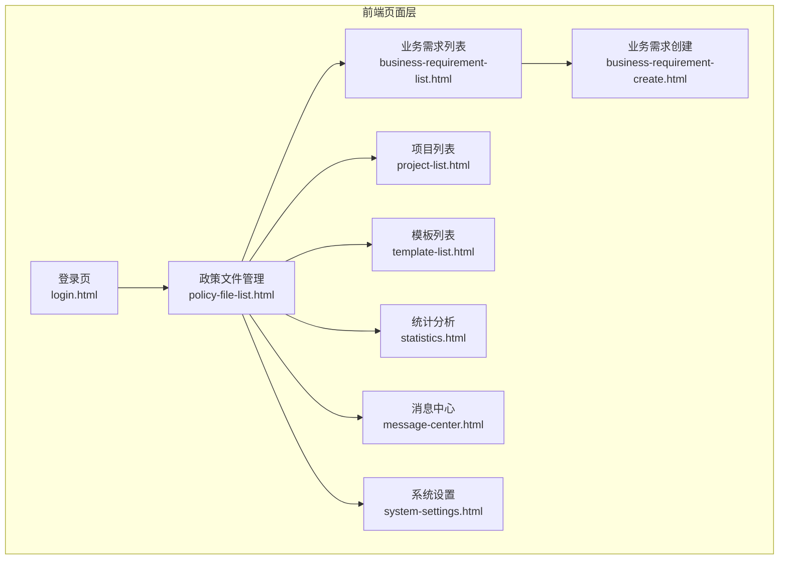
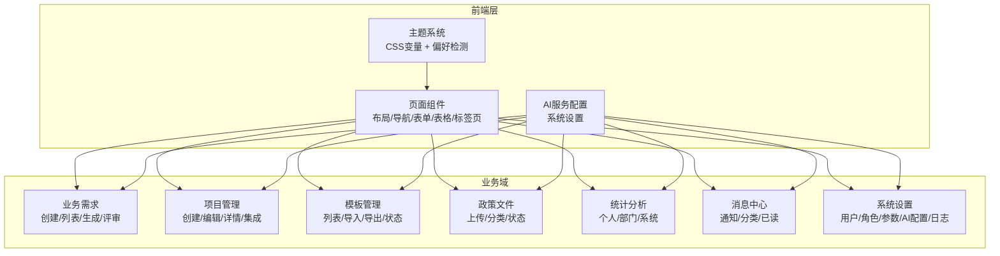
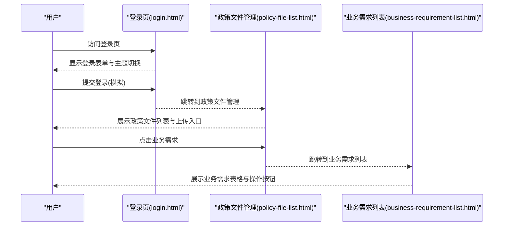
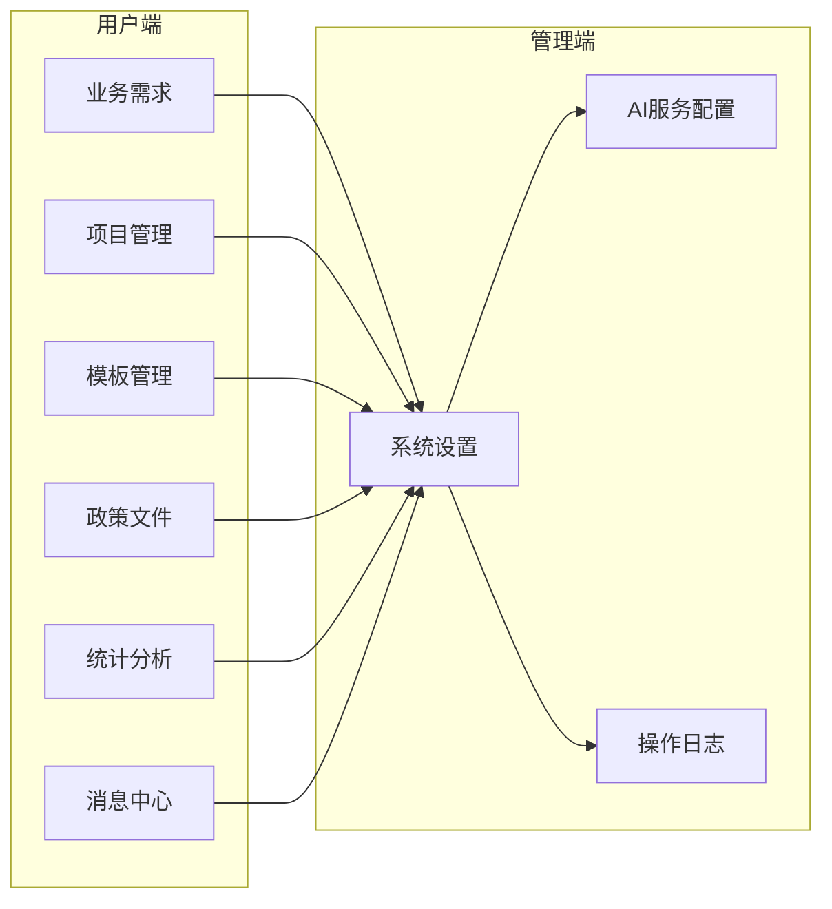
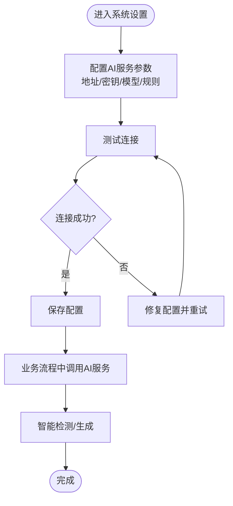
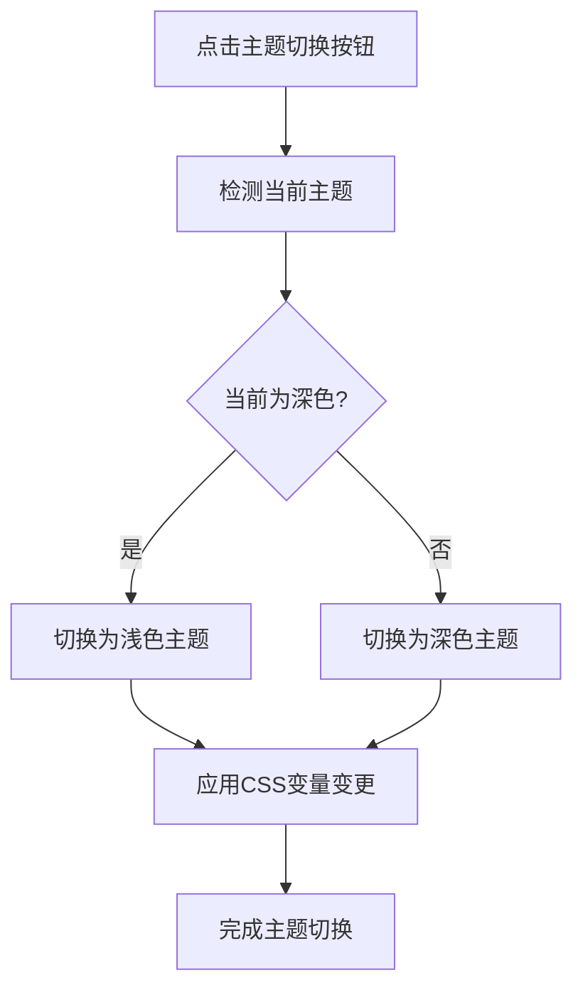
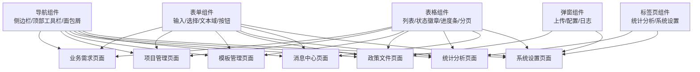
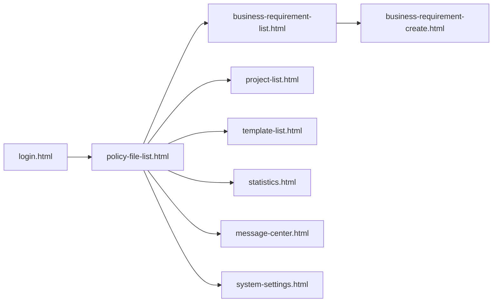

# 技术架构

<cite>
**本文档引用的文件**
- [business-requirement-create.html](file://pages/business-requirement-create.html)
- [business-requirement-list.html](file://pages/business-requirement-list.html)
- [login.html](file://pages/login.html)
- [project-list.html](file://pages/project-list.html)
- [template-list.html](file://pages/template-list.html)
- [statistics.html](file://pages/statistics.html)
- [system-settings.html](file://pages/system-settings.html)
- [policy-file-list.html](file://pages/policy-file-list.html)
- [message-center.html](file://pages/message-center.html)
- [2026-04-10-招标文件AI编制会议纪要.md](file://2026-04-10-招标文件AI编制会议纪要.md)
</cite>

## 目录
1. [引言](#引言)
2. [项目结构](#项目结构)
3. [核心组件](#核心组件)
4. [架构总览](#架构总览)
5. [详细组件分析](#详细组件分析)
6. [依赖关系分析](#依赖关系分析)
7. [性能考虑](#性能考虑)
8. [故障排除指南](#故障排除指南)
9. [结论](#结论)
10. [附录](#附录)

## 引言
本技术架构文档面向“招标文件AI编制系统”，旨在系统化阐述前端纯HTML/CSS/JavaScript实现的系统架构、前后端分离模式、双权限体系（用户端/管理端）、AI服务集成策略、主题切换机制与响应式设计等关键技术点。文档结合会议纪要中的系统目标与模块边界，帮助开发者快速理解并扩展该系统。

## 项目结构
系统采用纯前端静态页面组织方式，按功能模块划分为多个HTML页面，每个页面包含完整的布局、样式与脚本，形成“页面级微应用”的结构。页面间通过相对链接导航，无后端路由参与。

- 页面组织方式：pages目录下按功能域划分页面，如业务需求、项目管理、模板管理、政策文件、统计分析、消息中心、系统设置等。
- 架构形态：纯前端静态页面 + 本地主题切换逻辑 + 模拟交互（如登录、查询、分页、切换标签页等）。
- 扩展性：页面内脚本集中于页面末尾，便于按需引入或替换为真实后端接口。

**图表来源**
- [login.html](file://pages/login.html)
- [business-requirement-list.html](file://pages/business-requirement-list.html)
- [business-requirement-create.html](file://pages/business-requirement-create.html)
- [project-list.html](file://pages/project-list.html)
- [template-list.html](file://pages/template-list.html)
- [policy-file-list.html](file://pages/policy-file-list.html)
- [statistics.html](file://pages/statistics.html)
- [message-center.html](file://pages/message-center.html)
- [system-settings.html](file://pages/system-settings.html)

**章节来源**
- [business-requirement-create.html](file://pages/business-requirement-create.html)
- [business-requirement-list.html](file://pages/business-requirement-list.html)
- [login.html](file://pages/login.html)
- [project-list.html](file://pages/project-list.html)
- [template-list.html](file://pages/template-list.html)
- [statistics.html](file://pages/statistics.html)
- [system-settings.html](file://pages/system-settings.html)
- [policy-file-list.html](file://pages/policy-file-list.html)
- [message-center.html](file://pages/message-center.html)

## 核心组件
- 布局与导航组件
  - 侧边栏导航：统一的左侧导航栏，包含各功能模块入口，支持当前页高亮与点击跳转。
  - 顶部工具栏：面包屑导航、消息徽章、用户信息展示。
  - 内容区容器：页面标题、操作按钮、主内容区。
- 表单与交互组件
  - 表单容器与分节：用于业务需求创建、项目管理、模板管理等页面的信息录入与编辑。
  - 列表与表格：业务需求列表、项目列表、模板列表、政策文件列表等，支持筛选、分页、状态徽章、进度条等。
  - 标签页与弹窗：统计分析、系统设置、消息中心等页面的标签切换与模态弹窗。
- 主题与视觉组件
  - CSS变量主题：通过CSS自定义属性实现深浅主题切换，支持媒体查询偏好。
  - 动画与过渡：页面切换、悬停效果、加载动画等。
- AI服务与权限组件
  - AI服务配置：系统设置中的AI服务地址、密钥、模型参数、检测规则等。
  - 双权限体系：用户端（业务需求、项目管理、模板管理、政策文件、统计分析、消息中心）与管理端（系统设置、AI配置、日志等）分离。

**章节来源**
- [business-requirement-create.html](file://pages/business-requirement-create.html)
- [business-requirement-list.html](file://pages/business-requirement-list.html)
- [project-list.html](file://pages/project-list.html)
- [template-list.html](file://pages/template-list.html)
- [statistics.html](file://pages/statistics.html)
- [system-settings.html](file://pages/system-settings.html)
- [policy-file-list.html](file://pages/policy-file-list.html)
- [message-center.html](file://pages/message-center.html)

## 架构总览
系统采用“纯前端静态页面 + 本地主题切换 + 模拟交互”的架构，页面间通过相对链接导航，无需后端路由。AI服务与知识库通过系统设置中的配置项进行对接，支持公有大模型与未来私有模型的平滑切换。双权限体系通过页面访问控制实现，管理端页面仅对具备权限的用户可见。

**图表来源**
- [business-requirement-create.html](file://pages/business-requirement-create.html)
- [business-requirement-list.html](file://pages/business-requirement-list.html)
- [project-list.html](file://pages/project-list.html)
- [template-list.html](file://pages/template-list.html)
- [statistics.html](file://pages/statistics.html)
- [system-settings.html](file://pages/system-settings.html)
- [policy-file-list.html](file://pages/policy-file-list.html)
- [message-center.html](file://pages/message-center.html)

## 详细组件分析

### 前后端分离架构
- 页面级微服务：每个HTML页面自包含布局、样式与脚本，形成独立的功能单元，便于维护与扩展。
- 导航与路由：通过页面内脚本或浏览器历史API实现页面跳转，无需后端路由参与。
- 数据流：页面内脚本负责事件绑定与UI更新，模拟数据交互；实际部署时可替换为真实后端接口。

**图表来源**
- [login.html](file://pages/login.html)
- [policy-file-list.html](file://pages/policy-file-list.html)
- [business-requirement-list.html](file://pages/business-requirement-list.html)

**章节来源**
- [login.html](file://pages/login.html)
- [policy-file-list.html](file://pages/policy-file-list.html)
- [business-requirement-list.html](file://pages/business-requirement-list.html)

### 双权限体系（用户端/管理端）
- 用户端：业务需求、项目管理、模板管理、政策文件、统计分析、消息中心等页面，面向一线用户与部门主管。
- 管理端：系统设置、AI服务配置、操作日志等页面，面向系统管理员与技术维护人员。
- 实现方式：页面访问控制与菜单显隐，管理端页面仅在具备权限时展示。

**图表来源**
- [business-requirement-list.html](file://pages/business-requirement-list.html)
- [project-list.html](file://pages/project-list.html)
- [template-list.html](file://pages/template-list.html)
- [policy-file-list.html](file://pages/policy-file-list.html)
- [statistics.html](file://pages/statistics.html)
- [message-center.html](file://pages/message-center.html)
- [system-settings.html](file://pages/system-settings.html)

**章节来源**
- [business-requirement-list.html](file://pages/business-requirement-list.html)
- [project-list.html](file://pages/project-list.html)
- [template-list.html](file://pages/template-list.html)
- [policy-file-list.html](file://pages/policy-file-list.html)
- [statistics.html](file://pages/statistics.html)
- [message-center.html](file://pages/message-center.html)
- [system-settings.html](file://pages/system-settings.html)

### AI服务集成架构
- 配置入口：系统设置页面提供AI服务地址、API密钥、模型名称、温度参数、最大Token数、请求超时时间等配置项。
- 检测规则：支持公平竞争检测与合规性检查规则的配置。
- 调用策略：会议纪要指出系统需支持调用公有大模型（如DeepSeek）与未来私有模型；知识库为独立模块，通过中间服务封装后调用模型。
- 集成路径：AI服务配置与检测规则在系统设置中集中管理，业务流程中按需触发检测与生成。

**图表来源**
- [system-settings.html](file://pages/system-settings.html)

**章节来源**
- [system-settings.html](file://pages/system-settings.html)
- [2026-04-10-招标文件AI编制会议纪要.md](file://2026-04-10-招标文件AI编制会议纪要.md)

### 主题切换机制与响应式设计
- 主题切换：通过CSS变量与脚本动态修改根节点变量值，实现深浅主题无缝切换；同时支持系统偏好（prefers-color-scheme）自动适配。
- 响应式布局：页面采用弹性布局与网格布局，配合媒体查询与断点，确保在不同屏幕尺寸下的良好体验。
- 视觉一致性：统一的色彩体系、字体与间距，保证跨页面的一致性与可维护性。

**图表来源**
- [business-requirement-create.html](file://pages/business-requirement-create.html)
- [business-requirement-list.html](file://pages/business-requirement-list.html)
- [login.html](file://pages/login.html)
- [project-list.html](file://pages/project-list.html)
- [template-list.html](file://pages/template-list.html)
- [statistics.html](file://pages/statistics.html)
- [system-settings.html](file://pages/system-settings.html)
- [policy-file-list.html](file://pages/policy-file-list.html)
- [message-center.html](file://pages/message-center.html)

**章节来源**
- [business-requirement-create.html](file://pages/business-requirement-create.html)
- [business-requirement-list.html](file://pages/business-requirement-list.html)
- [login.html](file://pages/login.html)
- [project-list.html](file://pages/project-list.html)
- [template-list.html](file://pages/template-list.html)
- [statistics.html](file://pages/statistics.html)
- [system-settings.html](file://pages/system-settings.html)
- [policy-file-list.html](file://pages/policy-file-list.html)
- [message-center.html](file://pages/message-center.html)

### 模块化与组件关系
- 模块边界：业务需求、项目管理、模板管理、政策文件、统计分析、消息中心、系统设置各自为独立模块，职责清晰。
- 组件复用：导航、表单、表格、分页、标签页等通用组件在多个页面中复用，降低重复开发成本。
- 数据流向：页面内脚本负责事件处理与UI更新，模拟数据交互；实际部署时可替换为真实后端接口，保持模块边界不变。

**图表来源**
- [business-requirement-create.html](file://pages/business-requirement-create.html)
- [business-requirement-list.html](file://pages/business-requirement-list.html)
- [project-list.html](file://pages/project-list.html)
- [template-list.html](file://pages/template-list.html)
- [statistics.html](file://pages/statistics.html)
- [system-settings.html](file://pages/system-settings.html)
- [policy-file-list.html](file://pages/policy-file-list.html)
- [message-center.html](file://pages/message-center.html)

**章节来源**
- [business-requirement-create.html](file://pages/business-requirement-create.html)
- [business-requirement-list.html](file://pages/business-requirement-list.html)
- [project-list.html](file://pages/project-list.html)
- [template-list.html](file://pages/template-list.html)
- [statistics.html](file://pages/statistics.html)
- [system-settings.html](file://pages/system-settings.html)
- [policy-file-list.html](file://pages/policy-file-list.html)
- [message-center.html](file://pages/message-center.html)

## 依赖关系分析
- 页面依赖：登录页 -> 政策文件管理页 -> 业务需求列表页；业务需求列表页 -> 业务需求创建页；项目管理、模板管理、统计分析、消息中心、系统设置等页面相互独立。
- 组件依赖：导航组件被所有页面依赖；表单、表格、标签页、弹窗等通用组件在多个页面中复用。
- 外部依赖：AI服务配置依赖系统设置页面；主题切换依赖CSS变量与脚本；检测规则依赖系统设置页面。

**图表来源**
- [login.html](file://pages/login.html)
- [policy-file-list.html](file://pages/policy-file-list.html)
- [business-requirement-list.html](file://pages/business-requirement-list.html)
- [business-requirement-create.html](file://pages/business-requirement-create.html)
- [project-list.html](file://pages/project-list.html)
- [template-list.html](file://pages/template-list.html)
- [statistics.html](file://pages/statistics.html)
- [message-center.html](file://pages/message-center.html)
- [system-settings.html](file://pages/system-settings.html)

**章节来源**
- [login.html](file://pages/login.html)
- [policy-file-list.html](file://pages/policy-file-list.html)
- [business-requirement-list.html](file://pages/business-requirement-list.html)
- [business-requirement-create.html](file://pages/business-requirement-create.html)
- [project-list.html](file://pages/project-list.html)
- [template-list.html](file://pages/template-list.html)
- [statistics.html](file://pages/statistics.html)
- [message-center.html](file://pages/message-center.html)
- [system-settings.html](file://pages/system-settings.html)

## 性能考虑
- 静态资源优化：页面内样式与脚本集中，减少HTTP请求数；可按需拆分与懒加载。
- 渲染性能：使用CSS变量与媒体查询，避免频繁DOM操作；合理使用Flex/Grid布局，减少重排与重绘。
- 交互性能：事件委托与防抖节流，避免高频事件导致的卡顿；分页与虚拟滚动，提升大数据量表格的渲染效率。
- 缓存策略：利用浏览器缓存与CDN加速静态资源；主题切换状态可持久化至本地存储，减少重复计算。

## 故障排除指南
- 主题切换异常
  - 现象：点击主题切换按钮无效或样式不生效。
  - 排查：检查CSS变量赋值逻辑与脚本执行顺序；确认页面内脚本未被压缩工具破坏。
- 登录流程异常
  - 现象：登录表单提交后无响应或跳转失败。
  - 排查：检查表单验证逻辑与模拟登录流程；确认页面跳转逻辑正确。
- 表格与分页异常
  - 现象：表格数据不显示或分页控件失效。
  - 排查：检查数据绑定与渲染逻辑；确认分页参数与事件绑定正确。
- AI服务配置错误
  - 现象：AI服务连接测试失败或配置保存无效。
  - 排查：核对AI服务地址、密钥与模型参数；检查网络连通性与跨域设置。

**章节来源**
- [login.html](file://pages/login.html)
- [business-requirement-list.html](file://pages/business-requirement-list.html)
- [system-settings.html](file://pages/system-settings.html)

## 结论
本系统采用纯前端静态页面架构，通过页面级微服务与通用组件复用，实现了清晰的模块边界与良好的可维护性。双权限体系与AI服务集成策略满足业务需求，主题切换与响应式设计提升了用户体验。建议在后续阶段逐步引入真实后端接口与权限校验，完善数据持久化与安全机制，持续优化性能与可扩展性。

## 附录
- 技术选型说明
  - 纯前端技术栈：HTML/CSS/JavaScript，便于快速迭代与部署。
  - CSS变量主题：统一主题管理，支持深浅主题与系统偏好。
  - 模块化页面：页面内自包含，职责明确，便于扩展与维护。
- 部署建议
  - 静态托管：适用于CDN与静态站点托管平台。
  - 后端对接：按模块逐步替换为真实后端接口，保持前端页面不变。
  - 安全加固：引入HTTPS、CSP、XSS防护与权限校验。