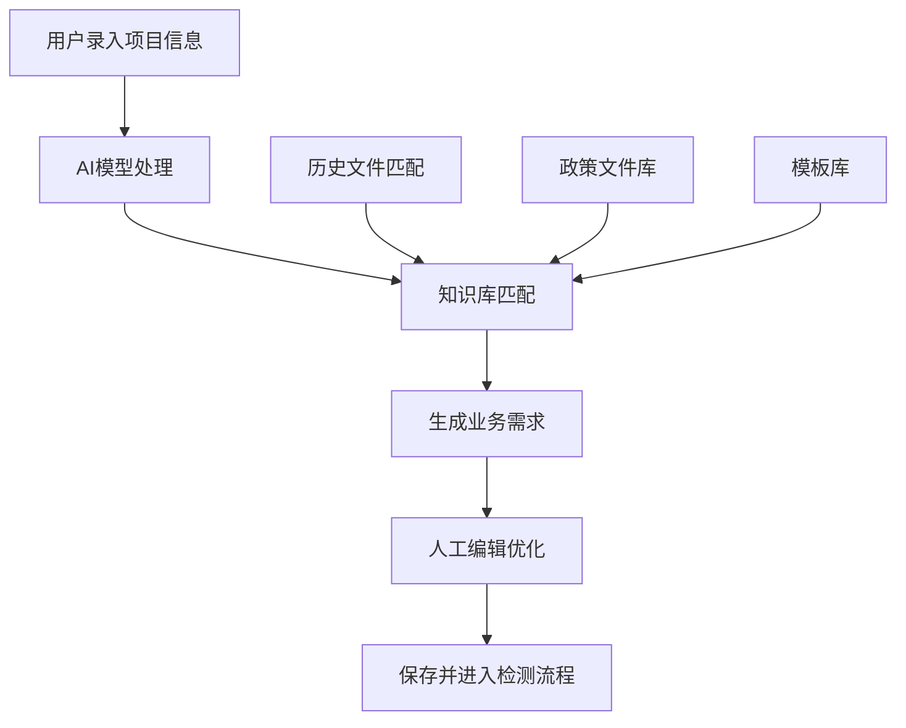
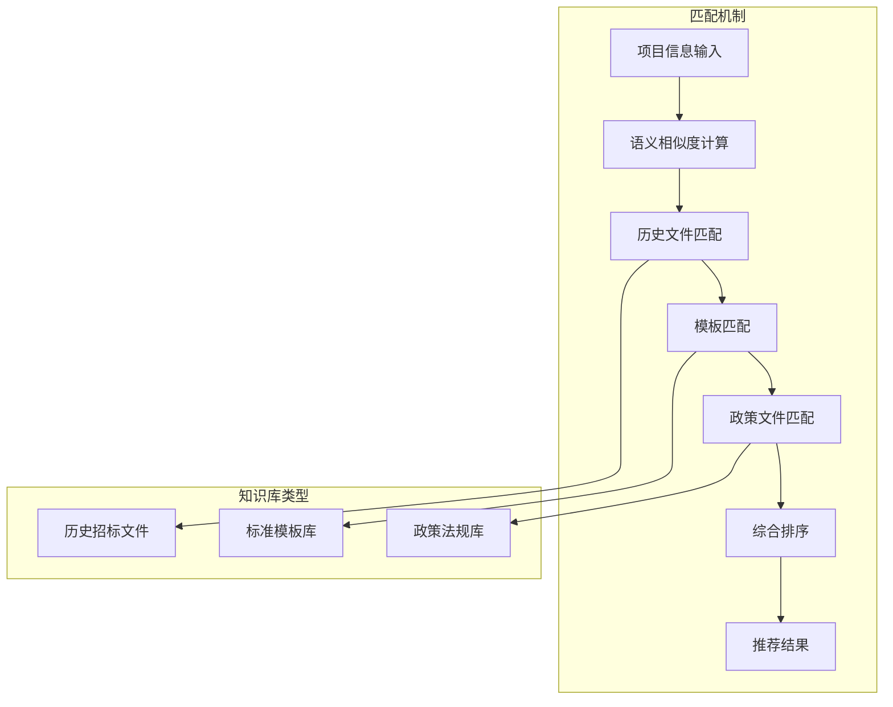
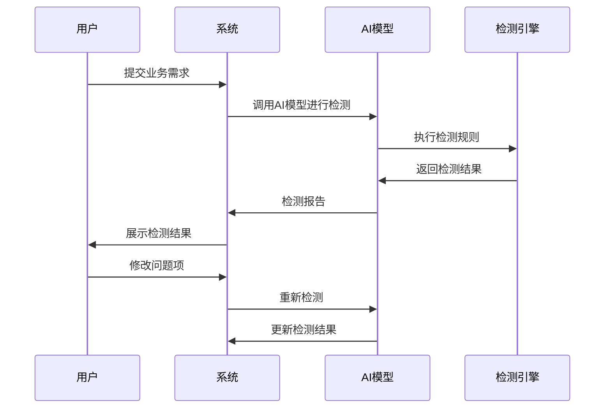
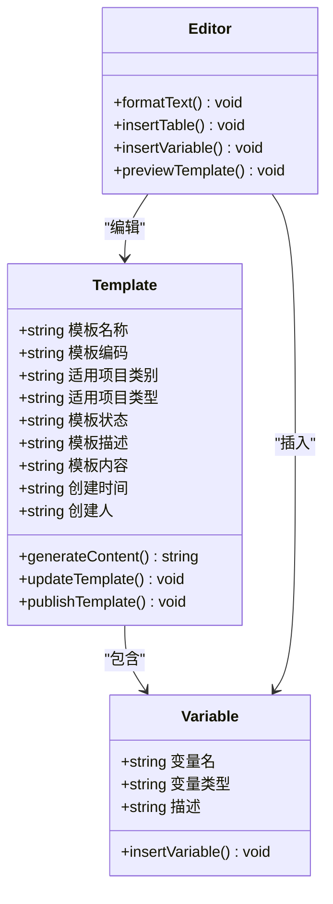
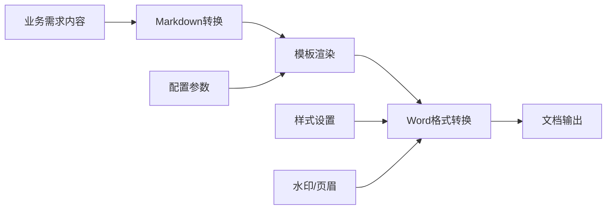
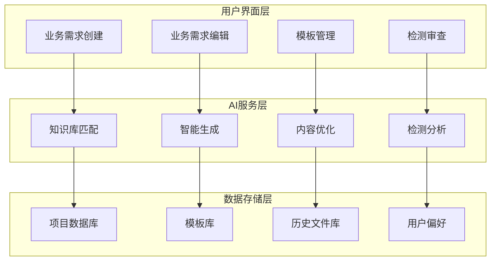

# 核心功能特性

<cite>
**本文档引用的文件**
- [business-requirement-generate.html](file://pages/business-requirement-generate.html)
- [business-requirement-create.html](file://pages/business-requirement-create.html)
- [business-requirement-list.html](file://pages/business-requirement-list.html)
- [business-requirement-review.html](file://pages/business-requirement-review.html)
- [business-requirement-edit.html](file://pages/business-requirement-edit.html)
- [template-create.html](file://pages/template-create.html)
- [template-list.html](file://pages/template-list.html)
- [2026-04-10-招标文件AI编制会议纪要.md](file://2026-04-10-招标文件AI编制会议纪要.md)
</cite>

## 目录
1. [系统概述](#系统概述)
2. [AI智能生成业务需求](#ai智能生成业务需求)
3. [知识库匹配推荐](#知识库匹配推荐)
4. [智能检测审查](#智能检测审查)
5. [Markdown模板管理](#markdown模板管理)
6. [Word文档导出](#word文档导出)
7. [功能协作机制](#功能协作机制)
8. [使用场景与演示](#使用场景与演示)
9. [技术实现特点](#技术实现特点)
10. [总结](#总结)

## 系统概述

招标文件AI编制系统是一个基于人工智能技术的智能化招标文件生成平台。系统采用前后端分离架构，包含用户端和管理端两个独立权限体系，支持从项目信息录入到最终Word文档输出的完整业务流程。

系统的核心设计理念是"AI驱动 + 智能辅助 + 规范化管理"，通过AI技术提升招标文件编制效率和质量，同时确保符合相关法规要求和行业标准。

## AI智能生成业务需求

### 功能概述

AI智能生成业务需求是系统的核心功能模块，负责根据用户输入的项目基本信息，通过AI技术自动生成完整的业务需求文档。

### 工作原理

系统提供两种业务需求生成方式：

1. **智能生成模式**：用户录入项目基本信息后，系统基于历史招标文件知识库自动匹配高相关度模板供手动选择
2. **AI自动生成模式**：系统直接由AI生成业务需求初稿

### 实现方式

**图表来源**
- [business-requirement-create.html:740-800](file://pages/business-requirement-create.html#L740-L800)
- [business-requirement-generate.html:783-800](file://pages/business-requirement-generate.html#L783-L800)

### 技术特点

- 支持多种项目类型（工程类、货物类、服务类）
- 自动预算分解和项目描述生成
- AI助手提供实时优化建议
- 支持手动编辑和AI交互式优化

**章节来源**
- [business-requirement-create.html:740-800](file://pages/business-requirement-create.html#L740-L800)
- [business-requirement-generate.html:783-800](file://pages/business-requirement-generate.html#L783-L800)

## 知识库匹配推荐

### 功能概述

知识库匹配推荐模块负责在业务需求生成过程中，为用户提供最相关的参考文件和模板建议。

### 工作原理

系统采用三层匹配机制：

**图表来源**
- [business-requirement-edit.html:738-780](file://pages/business-requirement-edit.html#L738-L780)

### 实现方式

系统提供三种匹配模式：

1. **模式1：系统自动匹配** - 基于AI算法自动匹配最相关文件
2. **模式2：系统匹配用户选择** - 展示匹配结果供用户手动选择
3. **模式3：本地上传** - 支持用户上传自定义参考文件

### 技术特点

- 多维度匹配算法（语义相似度、项目类型匹配、预算匹配）
- 支持批量文件上传和管理
- 实时匹配结果展示和预览功能
- 支持人工干预和二次筛选

**章节来源**
- [business-requirement-edit.html:738-780](file://pages/business-requirement-edit.html#L738-L780)

## 智能检测审查

### 功能概述

智能检测审查模块基于银行级智能审查能力，对生成的业务需求进行自动化检测，识别潜在问题和风险点。

### 工作原理

**图表来源**
- [business-requirement-review.html:620-707](file://pages/business-requirement-review.html#L620-L707)

### 实现方式

检测功能分为三个层次：

1. **格式合规性检测** - 检查文档格式是否符合标准
2. **条款完整性检测** - 确认关键条款是否完整
3. **风险预警检测** - 识别潜在的法律和合规风险

### 技术特点

- 支持用户自主选择启用或跳过检测
- 分级问题提示（严重、警告、通过）
- 详细的改进建议和解决方案
- 检测结果可追溯和审计

**章节来源**
- [business-requirement-review.html:620-707](file://pages/business-requirement-review.html#L620-L707)

## Markdown模板管理

### 功能概述

Markdown模板管理系统负责维护和管理各类招标文件模板，支持模板的创建、编辑、发布和版本控制。

### 工作原理

**图表来源**
- [template-create.html:536-757](file://pages/template-create.html#L536-L757)

### 实现方式

模板管理包含以下核心功能：

1. **模板创建** - 支持富文本编辑器和变量插入
2. **模板编辑** - 在线编辑和实时预览
3. **变量管理** - 系统预置变量和自定义变量
4. **版本控制** - 模板版本管理和回滚
5. **状态管理** - 启用/禁用状态控制

### 技术特点

- 支持Markdown语法和富文本混合编辑
- 内置变量系统，支持动态内容填充
- 实时预览和草稿保存功能
- 多项目类型模板分类管理

**章节来源**
- [template-create.html:536-757](file://pages/template-create.html#L536-L757)
- [template-list.html:681-800](file://pages/template-list.html#L681-L800)

## Word文档导出

### 功能概述

Word文档导出模块负责将生成的业务需求转换为标准的Word文档格式，支持批量导出和个性化定制。

### 工作原理

**图表来源**
- [business-requirement-generate.html:774-780](file://pages/business-requirement-generate.html#L774-L780)

### 实现方式

系统采用"模板+AI填充内容→转为Markdown→转为Word"的三层转换架构：

1. **内容生成** - AI生成业务需求内容
2. **格式转换** - 转换为Markdown格式
3. **文档输出** - 最终转换为Word文档

### 技术特点

- 支持批量文档生成和导出
- 自动化的格式规范化处理
- 支持自定义样式和模板
- 保持内容结构和层次关系

**章节来源**
- [business-requirement-generate.html:774-780](file://pages/business-requirement-generate.html#L774-L780)

## 功能协作机制

### 整体架构

系统采用模块化设计，各功能模块之间通过清晰的接口进行协作：

### 数据流协作

1. **业务需求创建** → **知识库匹配** → **AI生成** → **内容优化**
2. **模板管理** → **变量系统** → **内容填充** → **文档生成**
3. **检测审查** → **问题识别** → **建议反馈** → **内容修正**

### 权限控制机制

系统采用双权限体系：

- **用户端权限**：项目管理、业务需求编制、基础文档查看
- **管理端权限**：模板管理、知识库管理、统计分析、系统配置

**章节来源**
- [business-requirement-list.html:585-745](file://pages/business-requirement-list.html#L585-L745)
- [template-list.html:651-800](file://pages/template-list.html#L651-L800)

## 使用场景与演示

### 场景一：新建业务需求

**典型流程**：
1. 用户访问业务需求创建页面
2. 录入项目基本信息（名称、类型、预算等）
3. 选择参考文件匹配模式
4. 系统生成业务需求初稿
5. 进行人工编辑和优化
6. 执行智能检测审查
7. 导出Word文档

**使用价值**：
- 显著减少业务需求编制时间
- 确保内容完整性和规范性
- 提供AI辅助优化建议

### 场景二：模板定制与管理

**典型流程**：
1. 进入模板管理页面
2. 选择项目类型和适用类别
3. 使用富文本编辑器创建模板
4. 插入系统预置变量
5. 设置模板状态和描述
6. 发布模板供使用

**使用价值**：
- 统一模板标准和格式
- 支持灵活的内容定制
- 实现模板版本管理

### 场景三：批量文档生成

**典型流程**：
1. 准备多个项目信息
2. 选择合适的模板
3. 批量导入项目数据
4. 自动生成对应文档
5. 导出标准化Word文件

**使用价值**：
- 提高批量处理效率
- 保证文档一致性
- 减少人工错误

## 技术实现特点

### 架构设计

1. **前后端分离**：采用现代化Web技术栈
2. **模块化设计**：功能模块独立开发和部署
3. **可扩展性**：支持插件化扩展和第三方集成
4. **安全性**：完善的权限控制和数据保护

### 性能优化

1. **缓存机制**：智能缓存常用模板和配置
2. **异步处理**：长耗时任务异步执行
3. **资源压缩**：前端资源压缩和CDN加速
4. **数据库优化**：索引优化和查询优化

### 用户体验

1. **响应式设计**：适配各种设备和屏幕尺寸
2. **主题切换**：支持深色和浅色主题
3. **实时预览**：所见即所得的编辑体验
4. **操作引导**：智能提示和帮助系统

## 总结

招标文件AI编制系统通过AI技术与传统招标流程的深度融合，实现了从项目信息录入到最终文档输出的全流程智能化管理。系统的核心优势在于：

1. **效率提升**：AI自动生成大幅缩短业务需求编制时间
2. **质量保障**：智能检测确保文档质量和合规性
3. **标准化管理**：统一模板和流程规范
4. **灵活扩展**：模块化设计支持持续功能扩展

该系统不仅提升了工作效率，更重要的是通过AI技术的应用，为传统的招标文件编制工作带来了革命性的变化，为未来的数字化转型奠定了坚实基础。