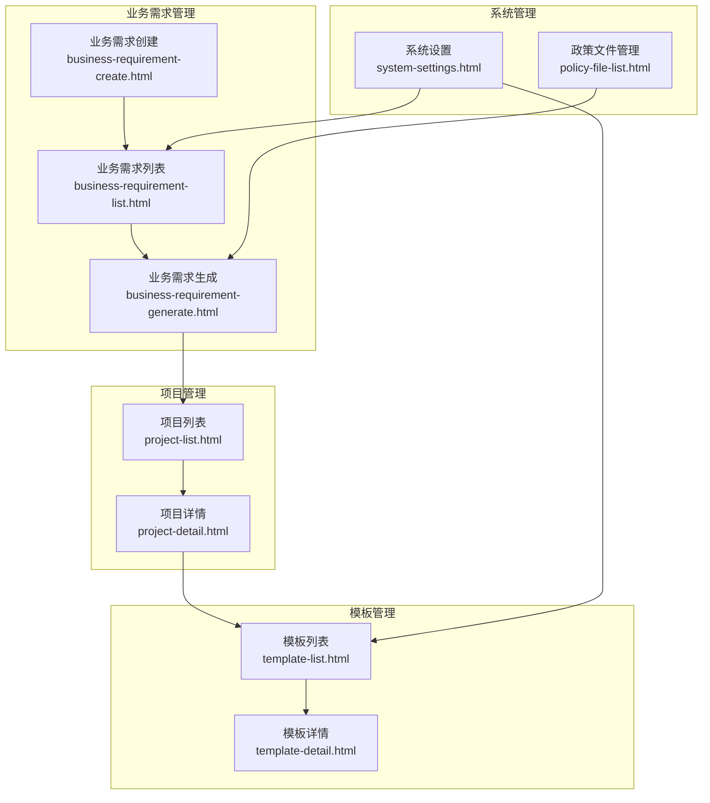
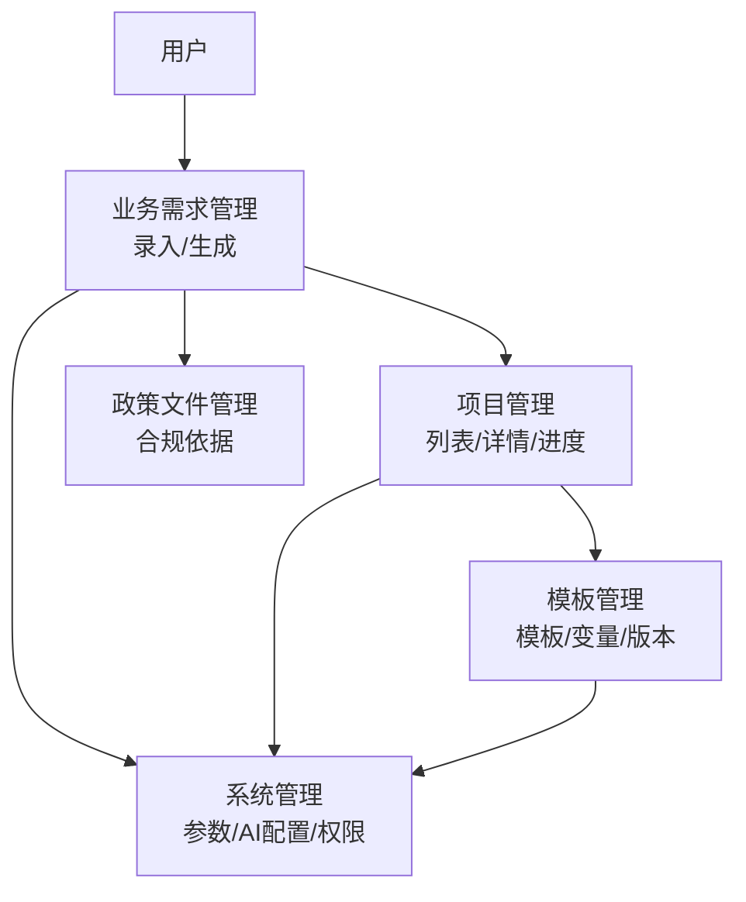
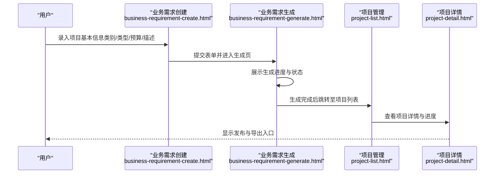
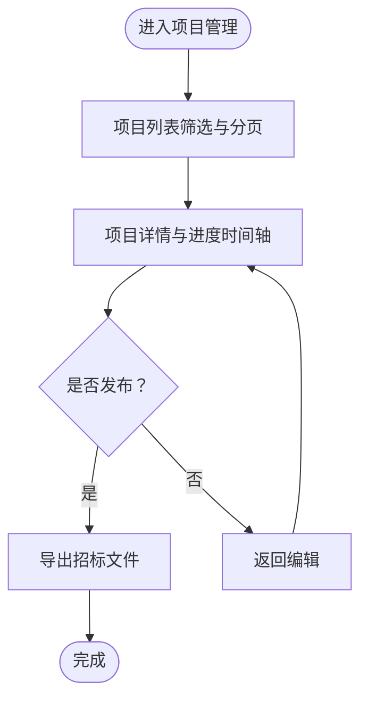
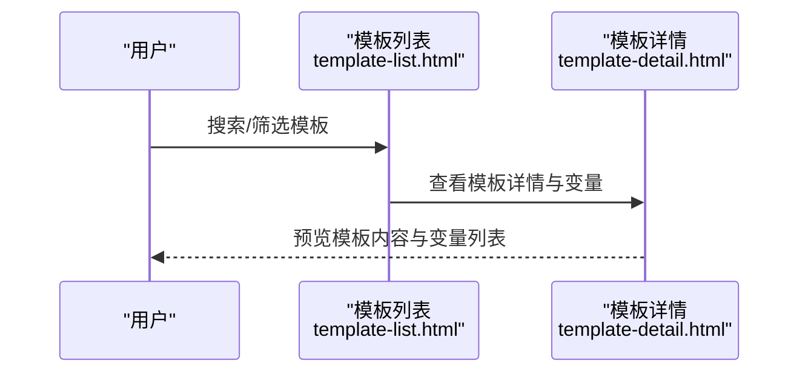
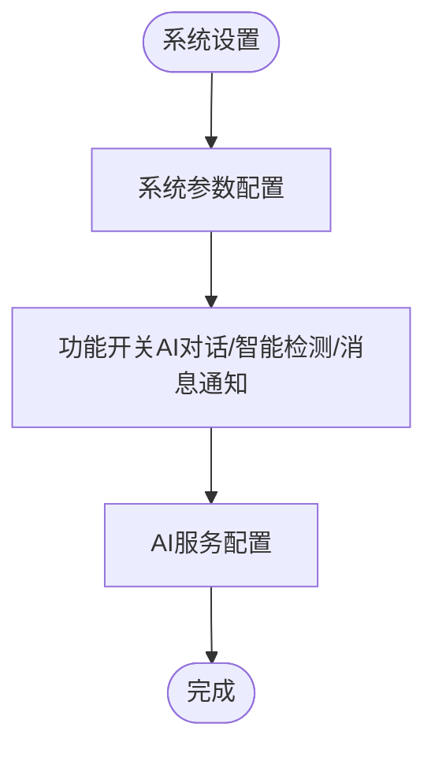
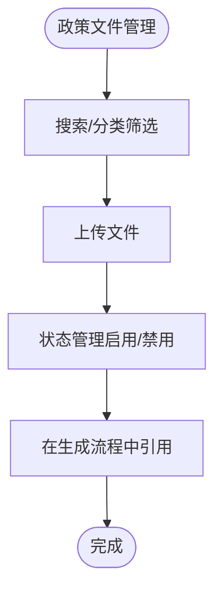
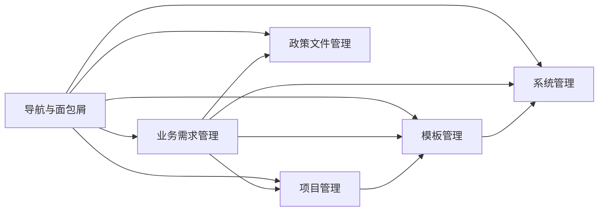

# 模块关系与工作流程

<cite>
**本文档引用的文件**
- [business-requirement-create.html](file://pages/business-requirement-create.html)
- [business-requirement-list.html](file://pages/business-requirement-list.html)
- [business-requirement-generate.html](file://pages/business-requirement-generate.html)
- [project-list.html](file://pages/project-list.html)
- [project-detail.html](file://pages/project-detail.html)
- [template-list.html](file://pages/template-list.html)
- [template-detail.html](file://pages/template-detail.html)
- [system-settings.html](file://pages/system-settings.html)
- [policy-file-list.html](file://pages/policy-file-list.html)
- [2026-04-10-招标文件AI编制会议纪要.md](file://2026-04-10-招标文件AI编制会议纪要.md)
</cite>

## 目录
1. [引言](#引言)
2. [项目结构](#项目结构)
3. [核心组件](#核心组件)
4. [架构总览](#架构总览)
5. [详细组件分析](#详细组件分析)
6. [依赖关系分析](#依赖关系分析)
7. [性能考虑](#性能考虑)
8. [故障排除指南](#故障排除指南)
9. [结论](#结论)
10. [附录](#附录)

## 引言
本文件面向“招标文件AI编制系统”的前端页面，梳理业务需求管理、项目管理、模板管理、系统管理等模块之间的关系与协作机制，绘制从用户录入到最终文档生成的完整工作流程，解释AI服务调用、知识库对接、智能检测等关键业务流程，明确数据在各模块间的流转与状态变化，并提供具体使用场景与流程示例。

## 项目结构
系统采用前端单页应用风格，按功能划分为多个页面，形成清晰的模块边界：
- 业务需求管理：业务需求录入、列表、生成与编辑
- 项目管理：项目创建、列表、详情与进度跟踪
- 模板管理：模板列表、详情、变量与版本管理
- 系统管理：用户管理、角色权限、系统参数、AI服务配置、操作日志
- 政策文件管理：政策文件上传、分类、状态与操作
- 统计分析与消息中心：辅助功能页面

**图表来源**
- [business-requirement-create.html:1-1181](file://pages/business-requirement-create.html#L1-L1181)
- [business-requirement-list.html:1-787](file://pages/business-requirement-list.html#L1-L787)
- [business-requirement-generate.html:1-1132](file://pages/business-requirement-generate.html#L1-L1132)
- [project-list.html:1-820](file://pages/project-list.html#L1-L820)
- [project-detail.html:1-1755](file://pages/project-detail.html#L1-L1755)
- [template-list.html:1-974](file://pages/template-list.html#L1-L974)
- [template-detail.html:1-899](file://pages/template-detail.html#L1-L899)
- [system-settings.html:1-1025](file://pages/system-settings.html#L1-L1025)
- [policy-file-list.html:1-1106](file://pages/policy-file-list.html#L1-L1106)

**章节来源**
- [business-requirement-create.html:1-1181](file://pages/business-requirement-create.html#L1-L1181)
- [business-requirement-list.html:1-787](file://pages/business-requirement-list.html#L1-L787)
- [business-requirement-generate.html:1-1132](file://pages/business-requirement-generate.html#L1-L1132)
- [project-list.html:1-820](file://pages/project-list.html#L1-L820)
- [project-detail.html:1-1755](file://pages/project-detail.html#L1-L1755)
- [template-list.html:1-974](file://pages/template-list.html#L1-L974)
- [template-detail.html:1-899](file://pages/template-detail.html#L1-L899)
- [system-settings.html:1-1025](file://pages/system-settings.html#L1-L1025)
- [policy-file-list.html:1-1106](file://pages/policy-file-list.html#L1-L1106)

## 核心组件
- 业务需求管理组件
  - 表单输入与校验（项目类别、类型、预算、描述）
  - 历史匹配与AI生成（模式1/2/3）
  - 生成进度与状态展示
- 项目管理组件
  - 项目列表筛选与分页
  - 项目详情与进度时间轴
  - 发布与导出入口
- 模板管理组件
  - 模板列表与筛选
  - 模板详情与变量展示
  - 版本历史与对比
- 系统管理组件
  - 用户/角色/参数/权限/日志/AI配置
  - 功能开关（AI对话、智能检测、消息通知）

**章节来源**
- [business-requirement-create.html:740-800](file://pages/business-requirement-create.html#L740-L800)
- [business-requirement-generate.html:745-782](file://pages/business-requirement-generate.html#L745-L782)
- [project-list.html:588-794](file://pages/project-list.html#L588-L794)
- [project-detail.html:352-524](file://pages/project-detail.html#L352-L524)
- [template-list.html:681-800](file://pages/template-list.html#L681-L800)
- [template-detail.html:646-732](file://pages/template-detail.html#L646-L732)
- [system-settings.html:594-800](file://pages/system-settings.html#L594-L800)

## 架构总览
系统采用“前端页面+后端服务”的前后端分离架构，模块间通过页面跳转与数据状态流转协作：
- 用户在业务需求管理完成信息录入与生成
- 生成内容进入项目管理进行进度跟踪与发布
- 模板管理提供模板与变量支撑生成
- 系统管理提供参数与AI配置保障
- 政策文件管理为生成提供合规依据

**图表来源**
- [business-requirement-create.html:698-707](file://pages/business-requirement-create.html#L698-L707)
- [business-requirement-generate.html:709-717](file://pages/business-requirement-generate.html#L709-L717)
- [project-list.html:510-519](file://pages/project-list.html#L510-L519)
- [project-detail.html:536-546](file://pages/project-detail.html#L536-L546)
- [template-list.html:566-575](file://pages/template-list.html#L566-L575)
- [system-settings.html:556-565](file://pages/system-settings.html#L556-L565)
- [policy-file-list.html:696-705](file://pages/policy-file-list.html#L696-L705)

## 详细组件分析

### 业务需求管理流程
业务需求管理包含“录入—生成—编辑—检测—导出”的完整闭环，支持AI助手交互与历史匹配。

**图表来源**
- [business-requirement-create.html:740-800](file://pages/business-requirement-create.html#L740-L800)
- [business-requirement-generate.html:733-754](file://pages/business-requirement-generate.html#L733-L754)
- [project-list.html:588-593](file://pages/project-list.html#L588-L593)
- [project-detail.html:352-397](file://pages/project-detail.html#L352-L397)

**章节来源**
- [business-requirement-create.html:740-800](file://pages/business-requirement-create.html#L740-L800)
- [business-requirement-generate.html:733-782](file://pages/business-requirement-generate.html#L733-L782)
- [project-list.html:588-593](file://pages/project-list.html#L588-L593)
- [project-detail.html:352-397](file://pages/project-detail.html#L352-L397)

### 项目管理流程
项目管理负责项目生命周期的可视化与进度跟踪，支持发布与导出。

**图表来源**
- [project-list.html:588-794](file://pages/project-list.html#L588-L794)
- [project-detail.html:464-524](file://pages/project-detail.html#L464-L524)

**章节来源**
- [project-list.html:588-794](file://pages/project-list.html#L588-L794)
- [project-detail.html:464-524](file://pages/project-detail.html#L464-L524)

### 模板管理流程
模板管理提供模板选择、变量注入与版本对比，支撑生成与发布。

**图表来源**
- [template-list.html:681-800](file://pages/template-list.html#L681-L800)
- [template-detail.html:646-732](file://pages/template-detail.html#L646-L732)

**章节来源**
- [template-list.html:681-800](file://pages/template-list.html#L681-L800)
- [template-detail.html:646-732](file://pages/template-detail.html#L646-L732)

### 系统管理与AI配置
系统管理提供参数配置、功能开关与AI服务配置，保障AI对话与智能检测功能的可用性。

**图表来源**
- [system-settings.html:737-800](file://pages/system-settings.html#L737-L800)

**章节来源**
- [system-settings.html:737-800](file://pages/system-settings.html#L737-L800)

### 政策文件管理
政策文件管理提供合规依据，支持上传、分类与状态管理，为生成提供政策支撑。

**图表来源**
- [policy-file-list.html:734-763](file://pages/policy-file-list.html#L734-L763)

**章节来源**
- [policy-file-list.html:734-763](file://pages/policy-file-list.html#L734-L763)

## 依赖关系分析
- 页面导航依赖：左侧导航统一控制模块跳转，面包屑提供上下文
- 数据流转依赖：业务需求生成页承载生成进度与状态，项目详情页承载发布与导出
- 模块耦合：模板管理与生成流程强耦合（变量与预览），系统管理与AI功能弱耦合（参数与开关）
- 外部依赖：AI服务与知识库通过系统设置进行配置与启用

**图表来源**
- [business-requirement-create.html:698-707](file://pages/business-requirement-create.html#L698-L707)
- [project-list.html:510-519](file://pages/project-list.html#L510-L519)
- [template-list.html:566-575](file://pages/template-list.html#L566-L575)
- [system-settings.html:556-565](file://pages/system-settings.html#L556-L565)
- [policy-file-list.html:696-705](file://pages/policy-file-list.html#L696-L705)

**章节来源**
- [business-requirement-create.html:698-707](file://pages/business-requirement-create.html#L698-L707)
- [project-list.html:510-519](file://pages/project-list.html#L510-L519)
- [template-list.html:566-575](file://pages/template-list.html#L566-L575)
- [system-settings.html:556-565](file://pages/system-settings.html#L556-L565)
- [policy-file-list.html:696-705](file://pages/policy-file-list.html#L696-L705)

## 性能考虑
- 页面渲染：采用卡片式布局与渐进加载，减少首屏压力
- 列表分页：项目与模板列表支持分页，降低一次性渲染成本
- 进度展示：生成进度条与状态徽标直观反映处理状态
- 功能开关：AI与检测功能可通过系统设置灵活启停，避免不必要的资源消耗

## 故障排除指南
- 无法进入生成页
  - 检查业务需求创建表单必填字段是否完整
  - 确认项目类别/类型选择正确
- 生成进度停滞
  - 检查系统设置中的AI服务配置与功能开关
  - 确认网络连接稳定
- 模板变量未生效
  - 在模板详情中核对变量列表与预览内容
  - 确认模板状态为“启用”
- 项目发布失败
  - 检查项目状态与生成内容完整性
  - 确认政策文件合规性

**章节来源**
- [business-requirement-create.html:740-800](file://pages/business-requirement-create.html#L740-L800)
- [business-requirement-generate.html:745-754](file://pages/business-requirement-generate.html#L745-L754)
- [template-detail.html:734-785](file://pages/template-detail.html#L734-L785)
- [system-settings.html:770-800](file://pages/system-settings.html#L770-L800)
- [project-detail.html:525-557](file://pages/project-detail.html#L525-L557)

## 结论
本系统通过清晰的模块划分与页面协作，实现了从信息录入到文档生成的完整闭环。业务需求管理、项目管理、模板管理与系统管理相互配合，辅以政策文件管理与AI配置，确保生成流程的高效与合规。建议在后续迭代中完善知识库对接与智能检测能力，持续优化用户体验与生成质量。

## 附录
- 使用场景示例
  - 场景一：新建工程类项目
    - 步骤：业务需求创建 → 业务需求生成 → 项目列表 → 项目详情 → 发布
  - 场景二：使用模板与变量
    - 步骤：模板列表 → 模板详情 → 变量列表 → 预览 → 应用到生成
  - 场景三：启用AI检测
    - 步骤：系统设置 → 功能开关 → 启用智能检测 → 生成后自动检测

**章节来源**
- [business-requirement-create.html:740-800](file://pages/business-requirement-create.html#L740-L800)
- [business-requirement-generate.html:733-782](file://pages/business-requirement-generate.html#L733-L782)
- [project-list.html:588-593](file://pages/project-list.html#L588-L593)
- [project-detail.html:352-397](file://pages/project-detail.html#L352-L397)
- [template-list.html:681-800](file://pages/template-list.html#L681-L800)
- [template-detail.html:646-732](file://pages/template-detail.html#L646-L732)
- [system-settings.html:770-800](file://pages/system-settings.html#L770-L800)