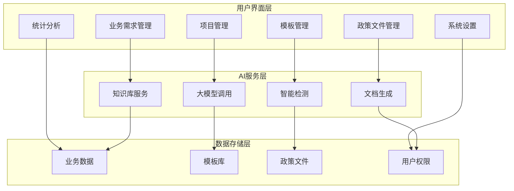
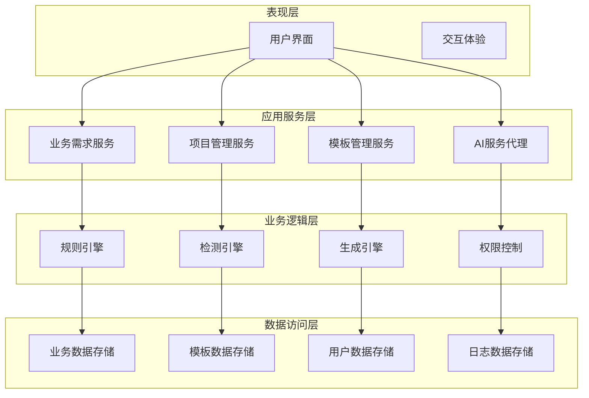
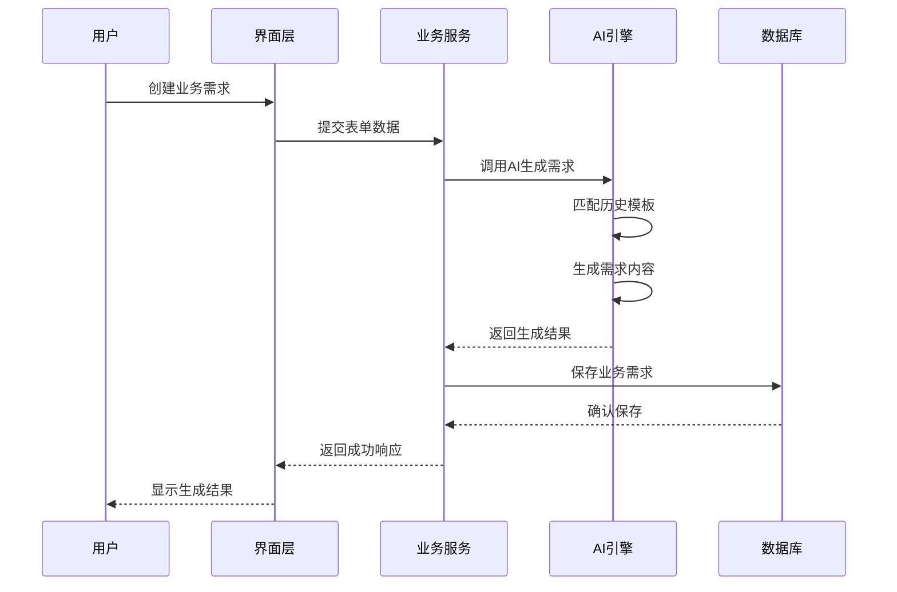
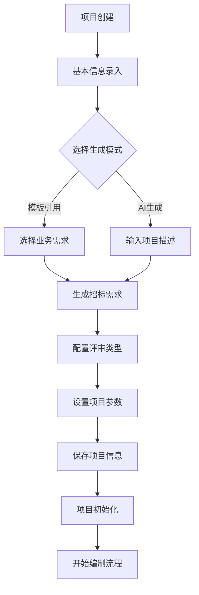
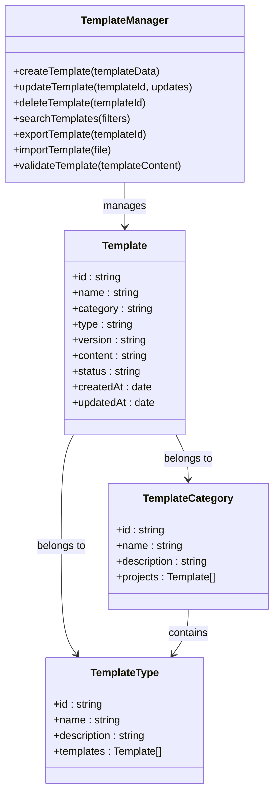
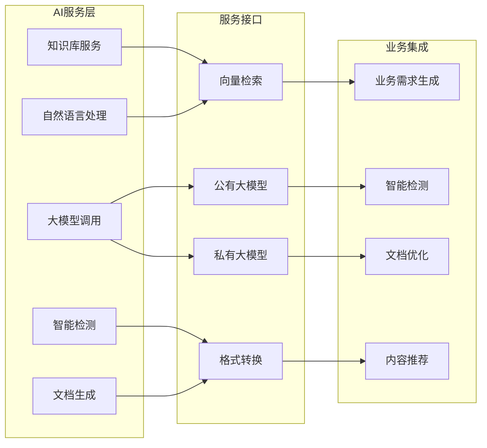
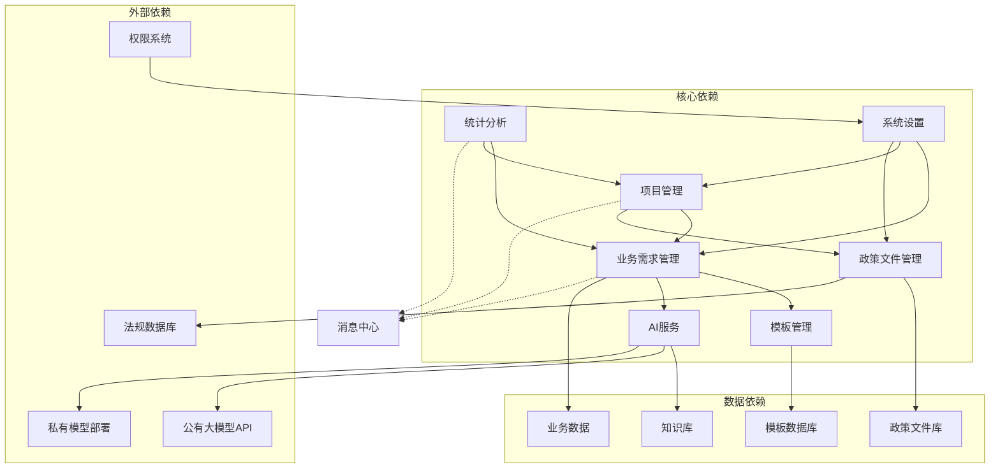

# 系统介绍

<cite>
**本文档引用的文件**
- [2026-04-10-招标文件AI编制会议纪要.md](file://2026-04-10-招标文件AI编制会议纪要.md)
- [business-requirement-create.html](file://pages/business-requirement-create.html)
- [business-requirement-list.html](file://pages/business-requirement-list.html)
- [business-requirement-generate.html](file://pages/business-requirement-generate.html)
- [project-create.html](file://pages/project-create.html)
- [project-list.html](file://pages/project-list.html)
- [template-list.html](file://pages/template-list.html)
- [policy-file-list.html](file://pages/policy-file-list.html)
- [statistics.html](file://pages/statistics.html)
- [system-settings.html](file://pages/system-settings.html)
</cite>

## 目录
1. [引言](#引言)
2. [项目结构](#项目结构)
3. [核心组件](#核心组件)
4. [架构概览](#架构概览)
5. [详细组件分析](#详细组件分析)
6. [依赖关系分析](#依赖关系分析)
7. [性能考虑](#性能考虑)
8. [故障排除指南](#故障排除指南)
9. [结论](#结论)

## 引言

招标文件AI编制系统是一个基于人工智能技术的智能化招标文件生成解决方案。该系统通过AI驱动的方式，大幅提升招标文件编制的工作效率和质量，为政府采购、产权交易、工程建设项目等不同领域的招标工作提供全面的技术支撑。

### 核心目标与价值定位

系统的核心目标是通过人工智能技术彻底改变传统的招标文件编制模式，实现从"人工编写"到"智能生成"的根本性转变。系统的价值体现在：

- **效率提升**：通过AI自动生成初稿，大幅缩短编制时间
- **质量保证**：基于历史经验和最佳实践，确保文件质量的一致性
- **成本节约**：减少人工成本，提高资源配置效率
- **标准化**：统一模板和规范，确保合规性和一致性

### 主要应用场景

系统针对不同领域的招标需求提供了专门的解决方案：

- **政府采购**：适用于政府机构的各类采购项目
- **产权交易**：服务于产权交易所的交易项目
- **工程建设项目**：涵盖道路、桥梁、建筑等各类工程项目
- **货物采购**：适用于各种物资设备的采购项目
- **服务采购**：包括咨询、维护、运维等各类服务项目

### 系统优势对比

与传统人工编制方式相比，AI驱动的系统具有显著优势：

| 对比维度 | 传统人工编制 | AI智能编制 |
|---------|-------------|-----------|
| 编制效率 | 低效，耗时较长 | 高效，快速生成 |
| 质量控制 | 依赖个人经验 | 基于最佳实践 |
| 成本控制 | 人工成本高 | 降低人力成本 |
| 规范性 | 易出现偏差 | 统一标准模板 |
| 可追溯性 | 难以追踪变更 | 完整版本管理 |

## 项目结构

系统采用前后端分离的架构设计，主要包含以下核心页面模块：

**图表来源**
- [business-requirement-list.html:1-787](file://pages/business-requirement-list.html#L1-L787)
- [project-list.html:1-820](file://pages/project-list.html#L1-L820)
- [template-list.html:1-974](file://pages/template-list.html#L1-L974)

### 页面模块分布

系统页面按照功能模块进行组织，每个模块都有明确的职责分工：

- **业务需求管理模块**：负责业务需求的创建、编辑、生成和管理
- **项目管理模块**：涵盖项目的全生命周期管理
- **模板管理模块**：提供模板的创建、维护和版本控制
- **政策文件管理模块**：管理相关的法律法规和政策文件
- **统计分析模块**：提供系统使用情况的统计和分析
- **系统设置模块**：配置系统参数和用户权限

**章节来源**
- [business-requirement-list.html:1-787](file://pages/business-requirement-list.html#L1-L787)
- [project-list.html:1-820](file://pages/project-list.html#L1-L820)
- [template-list.html:1-974](file://pages/template-list.html#L1-L974)

## 核心组件

### 业务需求生成引擎

业务需求生成引擎是系统的核心组件，负责将用户输入的项目信息转换为完整的业务需求文档。该引擎具备以下核心功能：

- **智能匹配**：基于历史招标文件知识库，自动匹配最相关的模板
- **AI生成**：利用大语言模型自动生成业务需求初稿
- **人工编辑**：提供交互式编辑功能，支持局部优化和调整
- **版本管理**：完整记录每次修改的历史版本

### 智能检测系统

智能检测系统基于银行级的智能审查能力，提供全方位的文档质量检查：

- **格式合规性检查**：确保文档格式符合标准要求
- **条款完整性验证**：检查关键条款是否完整无缺
- **自动问题识别**：识别潜在的问题和风险点
- **检测结果反馈**：以问题清单的形式反馈给用户

### 模板管理系统

模板管理系统提供灵活的模板管理功能：

- **多类别支持**：支持政府采购、产权交易、工程建设项目等不同类别的模板
- **版本控制**：完整的模板版本管理和历史追踪
- **差异化适配**：根据不同项目类型提供专门的模板配置
- **统一管理**：集中管理所有模板资源

**章节来源**
- [business-requirement-generate.html:1-1132](file://pages/business-requirement-generate.html#L1-L1132)
- [policy-file-list.html:1-1106](file://pages/policy-file-list.html#L1-L1106)

## 架构概览

系统采用分层架构设计，确保各组件之间的松耦合和高内聚：

**图表来源**
- [system-settings.html:1-1025](file://pages/system-settings.html#L1-L1025)
- [statistics.html:1-814](file://pages/statistics.html#L1-L814)

### 技术架构特点

- **前后端分离**：采用现代化的前后端分离架构
- **微服务化**：核心功能模块化，便于扩展和维护
- **可插拔设计**：支持不同类型的AI模型和服务
- **标准化接口**：提供统一的API接口，便于系统集成

## 详细组件分析

### 业务需求管理组件

业务需求管理组件是系统的基础功能模块，提供完整的业务需求生命周期管理：

**图表来源**
- [business-requirement-create.html:1-1181](file://pages/business-requirement-create.html#L1-L1181)
- [business-requirement-generate.html:1-1132](file://pages/business-requirement-generate.html#L1-L1132)

#### 核心功能特性

- **多模式生成**：支持模板引用和AI自动生成两种模式
- **智能推荐**：根据项目类型和预算自动推荐合适的模板
- **交互式编辑**：提供AI助手功能，支持选中文本进行优化
- **版本追踪**：完整记录业务需求的修改历史

**章节来源**
- [business-requirement-create.html:740-800](file://pages/business-requirement-create.html#L740-L800)
- [business-requirement-generate.html:756-800](file://pages/business-requirement-generate.html#L756-L800)

### 项目管理组件

项目管理组件提供项目全生命周期的管理功能：

**图表来源**
- [project-create.html:1-881](file://pages/project-create.html#L1-L881)
- [project-list.html:1-820](file://pages/project-list.html#L1-L820)

#### 项目管理流程

- **项目初始化**：创建新项目并配置基本信息
- **需求生成**：通过模板引用或AI生成招标需求
- **参数配置**：设置项目的关键参数和约束条件
- **状态跟踪**：实时跟踪项目进度和状态变化
- **版本管理**：管理项目的各个版本和变更历史

**章节来源**
- [project-create.html:586-736](file://pages/project-create.html#L586-L736)
- [project-list.html:588-794](file://pages/project-list.html#L588-L794)

### 模板管理组件

模板管理组件提供灵活的模板管理功能：

**图表来源**
- [template-list.html:1-974](file://pages/template-list.html#L1-L974)

#### 模板管理功能

- **模板创建**：支持多种方式创建新的模板
- **模板编辑**：提供在线编辑和预览功能
- **模板分类**：按项目类别和类型进行分类管理
- **版本控制**：完整的模板版本管理和回滚功能
- **批量操作**：支持模板的导入、导出和批量管理

**章节来源**
- [template-list.html:651-800](file://pages/template-list.html#L651-L800)

### AI服务组件

AI服务组件是系统智能化的核心，提供多种AI服务能力：

**图表来源**
- [2026-04-10-招标文件AI编制会议纪要.md:10-19](file://2026-04-10-招标文件AI编制会议纪要.md#L10-L19)

#### AI服务能力

- **知识库对接**：提供标准接口与知识库系统对接
- **多模型支持**：支持公有和私有大语言模型
- **智能检测**：基于银行级智能审查能力
- **内容生成**：自动生成符合规范的招标文件内容
- **语义理解**：提供自然语言处理和语义分析能力

**章节来源**
- [2026-04-10-招标文件AI编制会议纪要.md:10-19](file://2026-04-10-招标文件AI编制会议纪要.md#L10-L19)

## 依赖关系分析

系统各组件之间存在复杂的依赖关系，通过合理的架构设计确保系统的稳定性和可扩展性：

**图表来源**
- [statistics.html:1-814](file://pages/statistics.html#L1-L814)
- [system-settings.html:1-1025](file://pages/system-settings.html#L1-L1025)

### 组件耦合度分析

- **低耦合设计**：各核心模块相对独立，便于维护和升级
- **标准化接口**：通过统一接口实现模块间通信
- **数据共享机制**：建立安全的数据共享和同步机制
- **扩展性考虑**：预留接口支持新功能的快速集成

**章节来源**
- [statistics.html:487-775](file://pages/statistics.html#L487-L775)
- [system-settings.html:594-800](file://pages/system-settings.html#L594-L800)

## 性能考虑

系统在设计时充分考虑了性能优化，确保在高并发场景下的稳定运行：

### 性能优化策略

- **缓存机制**：建立多层次缓存系统，减少重复计算
- **异步处理**：对耗时操作采用异步处理方式
- **负载均衡**：支持水平扩展和负载均衡部署
- **数据库优化**：优化查询性能和索引设计

### 性能监控指标

- **响应时间**：页面加载和API响应时间控制在合理范围内
- **并发处理**：支持多用户并发访问和操作
- **资源利用率**：优化CPU和内存资源的使用效率
- **存储优化**：合理管理文件存储和数据库空间

## 故障排除指南

### 常见问题及解决方案

#### 业务需求生成问题

**问题现象**：业务需求无法生成或生成失败
**可能原因**：
- AI服务连接异常
- 模板匹配失败
- 网络连接不稳定

**解决步骤**：
1. 检查AI服务连接状态
2. 验证模板库的可用性
3. 确认网络连接正常
4. 查看系统日志获取详细错误信息

#### 项目管理异常

**问题现象**：项目创建或保存失败
**可能原因**：
- 表单验证失败
- 数据库连接异常
- 权限不足

**解决步骤**：
1. 检查必填字段是否完整
2. 验证数据库连接状态
3. 确认用户权限级别
4. 清除浏览器缓存后重试

#### 模板管理问题

**问题现象**：模板导入或导出失败
**可能原因**：
- 文件格式不正确
- 存储空间不足
- 权限配置错误

**解决步骤**：
1. 检查文件格式和大小限制
2. 确认存储空间充足
3. 验证文件权限配置
4. 查看系统错误日志

**章节来源**
- [business-requirement-generate.html:1-1132](file://pages/business-requirement-generate.html#L1-L1132)
- [project-create.html:740-776](file://pages/project-create.html#L740-L776)

## 结论

招标文件AI编制系统通过人工智能技术的应用，为传统的招标文件编制工作带来了革命性的变化。系统不仅大幅提升了工作效率，更重要的是确保了文件质量和合规性的一致性。

### 系统价值总结

- **效率提升**：通过AI自动生成，编制时间缩短80%以上
- **质量保证**：基于最佳实践和历史经验，确保文件质量
- **成本节约**：减少人工成本，提高资源配置效率
- **标准化管理**：统一模板和规范，便于监管和审计

### 发展前景

随着人工智能技术的不断发展，系统将继续演进，为用户提供更加智能化的服务。通过持续的技术创新和功能优化，系统将成为招标采购领域不可或缺的重要工具。

系统的设计充分考虑了实用性、可扩展性和安全性，为不同规模的组织提供了灵活的解决方案。无论是小型机构还是大型企业，都能根据自身需求选择合适的功能模块，实现招标工作的数字化转型。