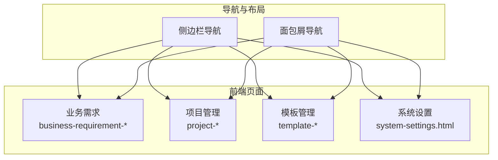
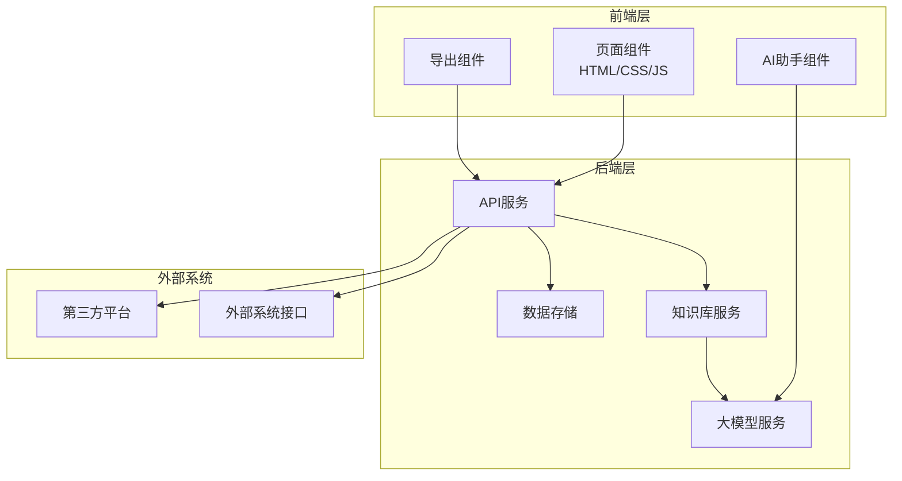
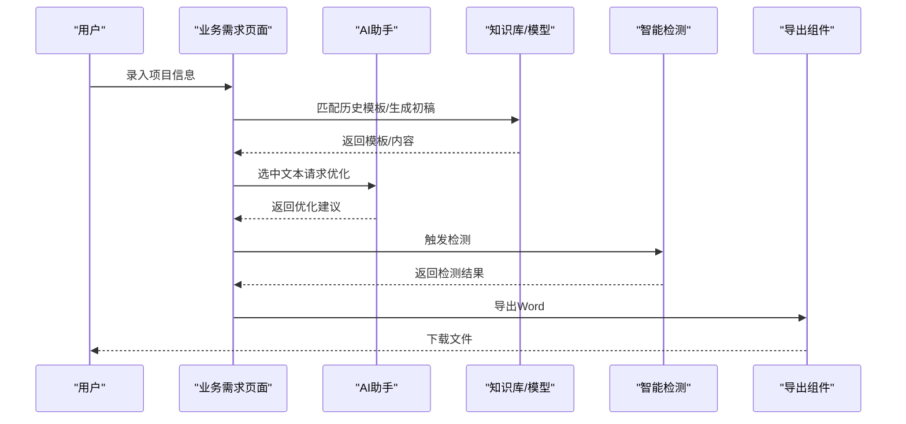
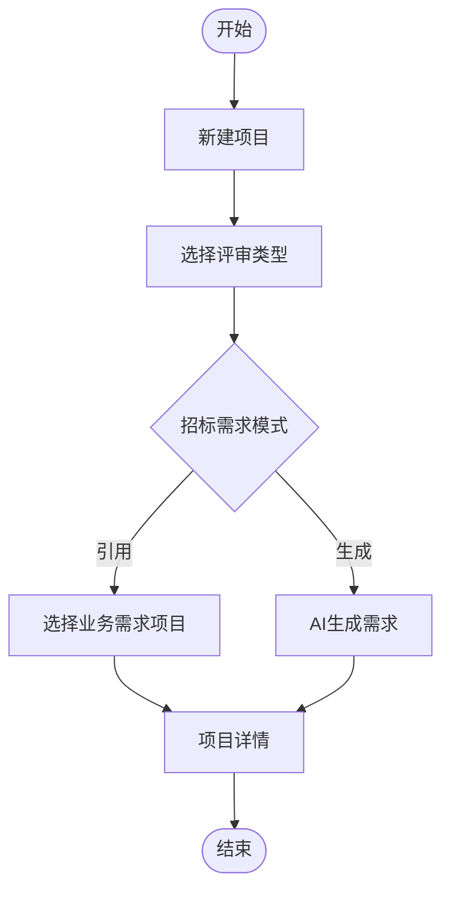
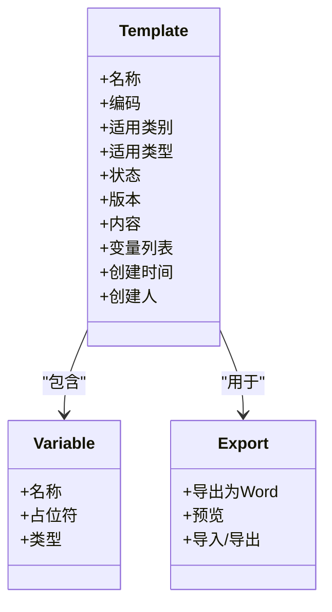
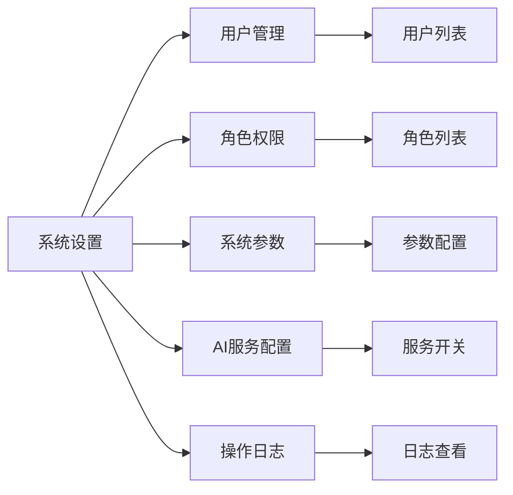
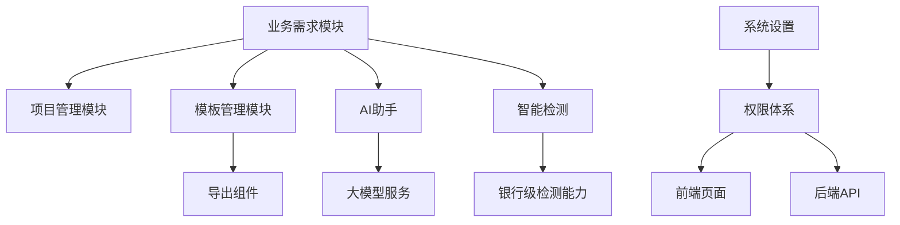

# 项目概述

<cite>
**本文档引用的文件**
- [2026-04-10-招标文件AI编制会议纪要.md](file://2026-04-10-招标文件AI编制会议纪要.md)
- [business-requirement-create.html](file://pages/business-requirement-create.html)
- [business-requirement-generate.html](file://pages/business-requirement-generate.html)
- [business-requirement-list.html](file://pages/business-requirement-list.html)
- [project-create.html](file://pages/project-create.html)
- [project-list.html](file://pages/project-list.html)
- [template-create.html](file://pages/template-create.html)
- [template-list.html](file://pages/template-list.html)
- [system-settings.html](file://pages/system-settings.html)
</cite>

## 目录
1. [引言](#引言)
2. [项目结构](#项目结构)
3. [核心组件](#核心组件)
4. [架构总览](#架构总览)
5. [详细组件分析](#详细组件分析)
6. [依赖关系分析](#依赖关系分析)
7. [性能考虑](#性能考虑)
8. [故障排除指南](#故障排除指南)
9. [结论](#结论)
10. [附录](#附录)

## 引言
本项目是一个AI驱动的招标文件智能编制系统，面向招标采购业务场景，提供从“业务需求生成”到“项目管理”再到“模板管理”的全流程数字化能力。系统采用前后端分离架构，前端以HTML/CSS/JavaScript为主，配合Markdown模板与Word导出能力，结合AI助手与智能检测模块，实现高效、规范、可追溯的招标文件编制与发布。

## 项目结构
系统前端采用静态页面组织，按功能模块划分，包含业务需求、项目管理、模板管理、政策文件、统计分析、消息中心、系统设置等页面。页面间通过导航侧栏与面包屑导航连接，形成清晰的用户体验路径。

**图表来源**
- [business-requirement-list.html](file://pages/business-requirement-list.html)
- [project-list.html](file://pages/project-list.html)
- [template-list.html](file://pages/template-list.html)
- [system-settings.html](file://pages/system-settings.html)

**章节来源**
- [business-requirement-list.html](file://pages/business-requirement-list.html)
- [project-list.html](file://pages/project-list.html)
- [template-list.html](file://pages/template-list.html)
- [system-settings.html](file://pages/system-settings.html)

## 核心组件
- 业务需求模块：支持业务需求的创建、编辑、生成、检测与查看，提供AI助手辅助优化与历史匹配能力。
- 项目管理模块：支持项目创建、筛选、进度跟踪、状态管理与详情查看。
- 模板管理模块：支持模板创建、编辑、预览、启用/禁用、导入导出与变量管理。
- 系统设置模块：提供用户管理、角色权限、系统参数、AI服务配置与操作日志等后台能力。
- AI与检测模块：内置AI助手与智能检测功能，支持格式合规性与条款完整性检查。
- 文档导出模块：基于Markdown模板生成内容，支持导出为Word文档。

**章节来源**
- [business-requirement-create.html](file://pages/business-requirement-create.html)
- [business-requirement-generate.html](file://pages/business-requirement-generate.html)
- [project-create.html](file://pages/project-create.html)
- [template-create.html](file://pages/template-create.html)
- [system-settings.html](file://pages/system-settings.html)

## 架构总览
系统采用前后端分离模式，前端负责页面渲染与交互，后端提供API支撑（当前为静态页面示例，接口对接在后续阶段）。权限体系分为用户端与管理端，分别对应业务需求与项目管理、模板管理与系统设置等不同职责域。

**图表来源**
- [2026-04-10-招标文件AI编制会议纪要.md](file://2026-04-10-招标文件AI编制会议纪要.md)

**章节来源**
- [2026-04-10-招标文件AI编制会议纪要.md](file://2026-04-10-招标文件AI编制会议纪要.md)

## 详细组件分析

### 业务需求模块
- 功能要点：信息录入、模板匹配、AI生成、人工编辑、AI助手优化、检测与导出。
- 页面构成：业务需求列表、新建业务需求、业务需求生成、业务需求编辑、业务需求审核等。
- 工作流：用户录入项目基本信息 → 系统匹配历史模板或AI生成初稿 → 用户编辑优化 → AI助手交互式优化 → 智能检测 → 导出Word。

**图表来源**
- [business-requirement-create.html](file://pages/business-requirement-create.html)
- [business-requirement-generate.html](file://pages/business-requirement-generate.html)
- [2026-04-10-招标文件AI编制会议纪要.md](file://2026-04-10-招标文件AI编制会议纪要.md)

**章节来源**
- [business-requirement-create.html](file://pages/business-requirement-create.html)
- [business-requirement-generate.html](file://pages/business-requirement-generate.html)
- [business-requirement-list.html](file://pages/business-requirement-list.html)

### 项目管理模块
- 功能要点：项目创建、筛选、进度可视化、状态管理、查看详情与操作。
- 页面构成：项目列表、新建项目、项目详情、项目编辑等。
- 流程：新建项目 → 选择评审类型与招标需求模式 → 生成或引用业务需求 → 进入项目详情与进度跟踪。

**图表来源**
- [project-create.html](file://pages/project-create.html)
- [project-list.html](file://pages/project-list.html)

**章节来源**
- [project-create.html](file://pages/project-create.html)
- [project-list.html](file://pages/project-list.html)

### 模板管理模块
- 功能要点：模板创建、编辑、预览、启用/禁用、导入导出、变量管理。
- 页面构成：模板列表、新建模板、模板详情、模板编辑等。
- 设计要点：Markdown模板语法、变量占位符、表格与标题结构、默认模板标识与版本控制。

**图表来源**
- [template-create.html](file://pages/template-create.html)
- [template-list.html](file://pages/template-list.html)

**章节来源**
- [template-create.html](file://pages/template-create.html)
- [template-list.html](file://pages/template-list.html)

### 系统设置模块
- 功能要点：用户管理、角色权限、系统参数、AI服务配置、操作日志。
- 设计要点：分组标签页、功能开关（AI对话、智能检测、消息通知）、参数校验与持久化。

**图表来源**
- [system-settings.html](file://pages/system-settings.html)

**章节来源**
- [system-settings.html](file://pages/system-settings.html)

## 依赖关系分析
- 组件耦合：业务需求与项目管理存在数据关联（业务需求作为项目招标需求来源）；模板管理为业务需求与项目管理提供内容载体。
- 外部依赖：知识库与大模型服务通过中间服务封装调用；智能检测复用现有银行级能力；与第三方平台通过标准接口对接。
- 权限依赖：用户端与管理端权限分离，管理端具备模板与系统配置能力。

**图表来源**
- [2026-04-10-招标文件AI编制会议纪要.md](file://2026-04-10-招标文件AI编制会议纪要.md)
- [business-requirement-create.html](file://pages/business-requirement-create.html)
- [project-create.html](file://pages/project-create.html)
- [template-create.html](file://pages/template-create.html)
- [system-settings.html](file://pages/system-settings.html)

**章节来源**
- [2026-04-10-招标文件AI编制会议纪要.md](file://2026-04-10-招标文件AI编制会议纪要.md)

## 性能考虑
- 前端渲染：页面采用静态HTML，减少后端压力；复杂交互通过轻量脚本实现。
- 模板与导出：Markdown模板便于维护与版本控制；导出Word采用中间转换流程，确保格式一致性。
- 检测与AI：检测与AI调用建议异步化，避免阻塞主线程；对大模型调用进行缓存与重试策略。
- 权限与安全：系统设置中的权限与参数应严格校验，防止越权与误配置。

## 故障排除指南
- 页面无法加载：检查静态资源路径与CDN可用性；确认浏览器兼容性。
- 导出失败：验证模板变量是否完整替换；检查导出组件依赖与浏览器插件。
- 检测异常：确认检测服务可用性与网络连通；查看检测结果反馈并逐项修正。
- 权限问题：核对用户角色与功能开关；检查会话超时与登录状态。

**章节来源**
- [system-settings.html](file://pages/system-settings.html)

## 结论
本项目以“AI驱动 + 模板化 + 智能检测”为核心，构建了从需求到文件的闭环能力，满足招标采购业务的规范化与效率化诉求。通过前后端分离与双权限体系设计，系统具备良好的扩展性与对接能力，可快速适配第三方平台与业务场景演进。

## 附录
- 实施节奏：需求文档完成后进入技术设计与开发，优先实现核心链路闭环。
- 协作分工：前端负责页面与交互，后端负责接口与数据，测试负责质量保障。
- 扩展方向：知识库建设、私有模型接入、政策文件联动审查、深度格式美化等。

**章节来源**
- [2026-04-10-招标文件AI编制会议纪要.md](file://2026-04-10-招标文件AI编制会议纪要.md)